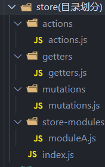
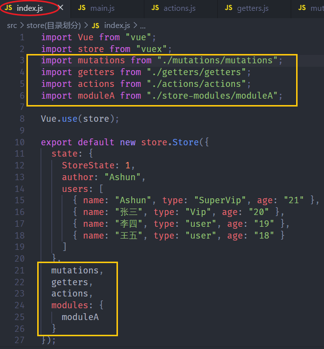
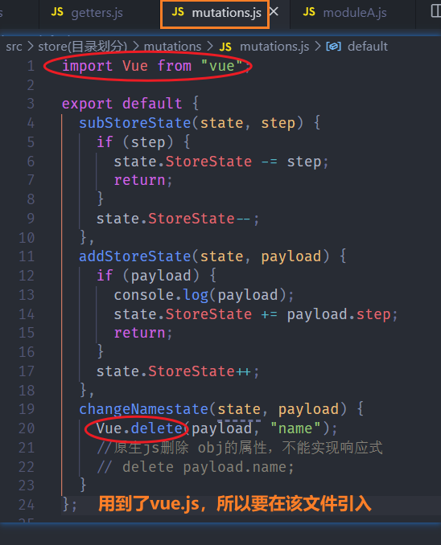

# store文件夹中的目录组织与管理

---

​	store目录，是专门用来管理vuex相关配置的，但是之前所有的操作都是在store/index.js中进行配置的，实际开发时，state、mutations、actions、getters、modules。这些配置会很多，如果都在index.js里面，则会变得非常臃肿不易管理。

​	这时候就需要合理的目录组织进行抽离。

>* store
>  * index.js	
>  * mutations目录
>  * actions目录
>  * getters目录
>  * modules目录
>
>
>
>>vuex.store.options都是obj，所以直接抽离到对应目录中的单独文件中，默认导出即可。
>>
>>mutations、actions、getters目录存放的都是vuex.store中的对应option。
>>
>>modules抽离划分的模块。

**如图：**

---

> 其余抽离出去的option同理。**需要注意的就是，抽离出去的option如果依赖于其它模块，也需要导入。**