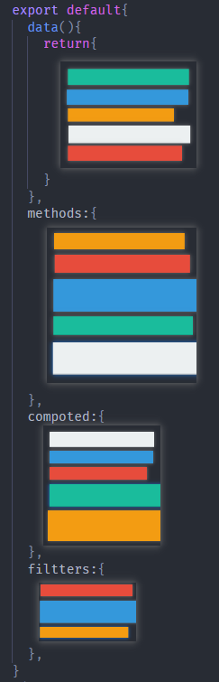
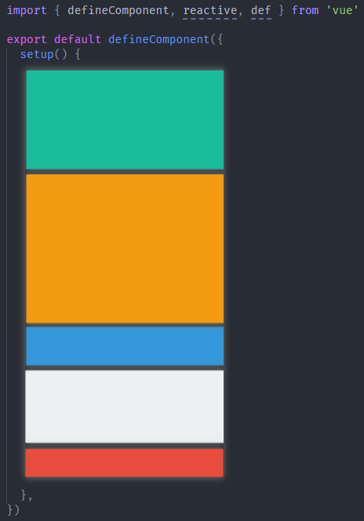
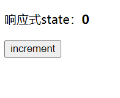
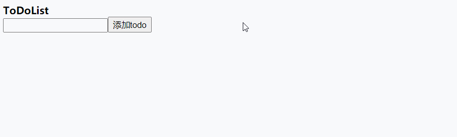
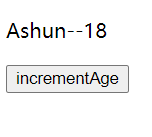
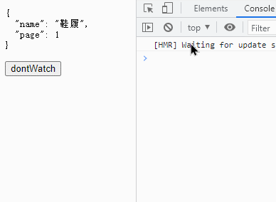
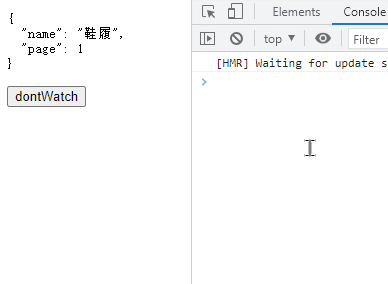
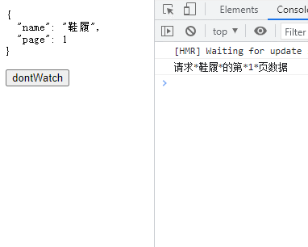

在 Vue3 中，有很多好用的新特性，其中最常用到的就是 CompositionAPI，下面我们就来了解一下CompositionAPI。

## 为什么使用CompositionAPI？

​	在使用 CompositionAPI 之前，我们要知道为什么使用它，相比之前的 optionsAPI 有什么好处？下面我们通过实际情况的对比，来体现为什么使用 CompositionAPI。

​	对于为什么使用 CompositionAPI，[官方文档](https://v3.cn.vuejs.org/guide/composition-api-introduction.html#什么是组合式-api)所举的例子🌰就很好，如果你开发过中大型的项目，就能够很好的体会这个问题：

​	在 Vue2.x 中，我们通过在 vue 实例中配置各种 options（data、methods、compoted、fillters、watch……）来实现组件在代码层面的业务，这种形式能够强制性地让 **不同的操作进行分离**，在逻辑、组件数目较少时代码的结构是很清晰的。但是通过项目逐渐的迭代，不论在 `组件数目` 还是 `逻辑处理` 上，都会变得非常繁多，这时在代码的阅读、维护上就出现了比较严重的问题。

​	由于组件的功能不断增多，在各个 option 中的代码也就不断增多，并且 **各个option中都存在不同功能模块的代码**，这时如果我们要阅读、维护某个功能模块，就要在不同的 option 中来回跳转，还要在其中查找对应功能的代码块。显然增加了阅读、维护的成本。

如图所示：这是一个大型组件的示例，其中 **功能模块** 按颜色进行分组。



如果代码能够按照所对应的功能模块进行排列，就像下图一样，岂不是更好？



我们可以使用 `CompositionAPI` 实现这种结构，而且，如果将各个功能模块抽离为单独的 `hook` 再进行引入，代码会更加清晰🎉。

## Vue3功能模块的抽离

在了解怎么使用 `CompositionAPI` 之前，我们先了解一下 Vue3 在代码组织上的改变，通过上文图片可以看到在 vue3 中，将各个功能模块进行了抽离，这样我们就可以按需引入对应的模块进行使用。

这里介绍一下 vue3 在最基本的场景中，代码使用层面的改变。

### App.vue

vue2.x

```
import Vue from "vue";
import router from './router'
import store from './store'
import App from "./App.vue"

new Vue({
  render:(h)=>h(App),
  store,
  router
}).$mount("#app")
```

vue3

```
import { createApp } from 'vue'

import App from './App.vue'
import router from './router'
import store from './store'

createApp(App).use(store).use(router).mount('#app')
```

* 引入 `createApp` 工厂函数，将 App 组件传入，创建应用组件
* 通过 `use` API 配置其它选项
* 通过 `mount` 方法挂载到 DOM元 素上

### 组件的创建

vue2.x

* 直接导出一个包含各个 option 的对象即可

```
<template>
	<div>
			template只能有一个子节点
	</div>
</template>

<script>
  export default {
    ……
  }
</script>
```

vue3

* 使用 `defineComponent` 定义组件

```
<template>
	<header></header>
	<main>
		template可以有多个子节点
	</main>
	<footer></footer>
</template>

<script>
  import { defineComponent } from 'vue'
  export default defineComponent ({
    setup(props,context){
    	……
    }
  })
</script>
```

而 `setup` 是所有 CompositionAPI "表演的舞台" 👇

## 邂逅setup

CompositionAPI 的应用，都是在 `setup(props,context)` 方法中完成的，setup 相当于 CompositionAPI 的入口，下面先总结一下setup的特点：

* 组件中用到的 state、method，都是在 setup 中配置的。
*  执行时机：setup 选项在组件创建 **之前** 执行
  * 具体来说：在 `beforeCreate`、`created` 之前执行，也就是说 setup 内部 **不能** 使用`this`去访问实例。
* 函数类型：
  * 同步函数（常用）
  * 异步函数（async）
* 返回值：
  * 默认情况下(同步函数) setup 有两种返回值，作用也不同
    * ⭐ 返回一个object，其中的属性、方法，能够与模板进行绑定。
    * 直接返回一个渲染函数，自定义渲染的内容
  * 若将 setup 设置为 async（异步函数），将默认返回 Promise。
    * 此时为了让 template 能够正常绑定 state，需要在父组件作用域中使用 suspense 处理异步组件

## state与method

前面讲到，组件中用到的 state、method，都是在 setup 中配置的。而且要将它们放在一个 object 中并返回，才能与视图进行绑定。下面我们来体验一下。


```
<template>
  <header>{{ headerContent }}</header>
  <main>{{ mainContent }}</main>
  <footer>{{ footerContent }}</footer>
  <button @click="getContent">getContent</button>
</template>
<script>
  import { defineComponent, reactive } from "vue";

  export default defineComponent({
    setup() {
    	//state
      let headerContent = "我是头部信息";
      let mainContent = "我是主体部分";
      let footerContent = "我是页脚";
      //method
      const getContent = () => {
        alert(`${headerContent},${mainContent},${footerContent}`);
      };
      //将与视图绑定的state、method放入Object并返回
      return {
        headerContent,
        mainContent,
        footerContent,
        getContent,
      };
    },
  });
</script>
```

## 响应式数据

如果你在上述案例代码中，尝试使用自定义的 method 去变更之前定义的某些 state，你会发现，页面并没有发生改变，因为在 vue3 中，你需要通过 `ref`、`reactive` 去生产响应式的引用。

### reactive

在 `setup` 中，我们可以使用 `reactive` 功能函数去创建响应式的引用，下面通过简单的计数器案例展示：



```
<template>
  <p>
    响应式state：<strong>{{ state.counter }}</strong>
  </p>
  <button @click="increment">increment</button>
</template>

<script>
	//引入reactive功能函数
  import { defineComponent, reactive } from "vue";

  export default defineComponent({
    setup() {
    	//使用reactive创建响应式引用
      const state = reactive({
        counter: 0,
      });
      //事件定义
      const increment = () => {
        state.counter++;
      };
      //将数据、事件返回,与视图绑定
      return {
        state,
        increment,
      };
    },
  });
</script>
```

todo案例，加深体验



```
<template>
  <header><strong>ToDoList</strong></header>
  <main>
    <input id="addBar" type="text" v-model="state.content" />
    <button @click="addTodo">添加todo</button>
    <ul>
      <li v-for="(val, index) in state.todoList" key="val">
        <div class="content">{{ index }}--{{ val }}</div>
        <button @click="deleteTodo(index, val)">delete</button>
      </li>
    </ul>
  </main>
</template>
<script>
  import Vue, { defineComponent, reactive } from "vue";

  export default defineComponent({
    setup() {
      const state = reactive({
        content: "",
        todoList: [],
      });
      const addTodo = () => {
        if (state.content) {
          //Vue3能够直接通过索引改变数组实现响应式，因为内部使用Proxy进行拦截
          state.todoList[state.todoList.length] = state.content;
          state.content = "";
        } else {
          alert("不能为空");
        }
      };
      const deleteTodo = (index, val) => {
        state.todoList.splice(index, 1);
        alert(`您删除了：${val}`);
      };
      return {
        state,
        addTodo,
        deleteTodo,
      };
    },
  });
</script>
```

关于数组的响应式：

* vue2.x 内部使用 Object.defineProperty 实现数据劫持，但 defineProperty 自身是能够拦截 Array 的每一个 item 的。但在 vue2.x 中，我们不能直接通过索引改变 Array，这将不能实现响应式。你可能会觉的这很矛盾，但尤大在 vue 的 issue 上进行了解答，之所以不使用 defineProperty 拦截数组，是因为 **性能问题**。在源码中，也确实对 Array 类型的数据进行了特殊处理，此时将不会监控其中的每一项 item。

>值得注意的是：上述两则案例，reactive 中传入的都是一个 Object，当然也可传入其它 **引用类型数据**，但reactive **不能代理基本数据类型**，因为 reactive 内部应用的是 `Proxy` 实现数据劫持。
>
>若想产生 `基本数据类型` 的响应式引用，可以使用 `ref` 👇

### ref

除了上文讲到的 `reactive`，我们也可以使用 `ref` 功能函数创建响应式引用。

ref 还包含其它功能，简单总结如下：

* 创建响应式引用
  * 基本类型
  * 引用类型
* 能够利用 `ref` 访问组件、DOM节点。

#### 响应式引用

`ref` 与 `reactive` 不同，其既能生产 `基本类型 `响应式数据，又能生产 `引用类型 `的响应式数据。

下面还是通过案例进行体现：

```
<template>
  <main>
    <li>
      <p>ref响应式数据（基本类型）：{{ count }}</p>
      <button @click="increment">increment</button>
    </li>
    <li>
      <p>ref响应式数据（引用类型）：{{ ref_user.name }}--{{ ref_user.age }}</p>
      <button @click="changeUser">changeUser</button>
    </li>
  </main>
</template>
<script>
  //引入ref
  import Vue, { defineComponent, ref } from "vue";

  export default defineComponent({
    setup() {
      //ref引用类型
      const ref_user = ref({
        name: "Ashun",
        age: 18,
      });
      const changeUser = () => {
        ref_user.value.name = "Ashuntefannao";
        ref_user.value.age = 20;
      };

      //ref基本类型
      let count = ref(0);
      const increment = () => {
        count.value++;
      };
      return {
        ref_user,
        changeUser,
        count,
        increment,
      };
    },
  });
</script>
```

>由于 `ref` 生产后的数据需要通过 **value属性** 去访问真正的值，若代理 `引用类型` 的数据，在访问、操作时较为繁琐，所以一般情况下：ref 用于生产 `基本类型` 的响应式数据。

#### 原理

* 经过 [上文](###reactive) 我们已经知道：`reactive` 内部使用 `Proxy` 实现对 **引用数据类型** 的劫持，因此**不能够代理基本数据类型**。

* 但为什么 `ref` 可以呢？

  ​	实际上我们不难发现，`ref` 处理后的基本类型实际上也变为了一个 `Object`，我们**只能通过**`value`属性去访问真正的值，并且，**只有操作**`value`**属性，才能实现数据的响应式。**

  ​	并且，如果使用 ref 处理引用数据类型，通过打印 ref 变量的 `value`，可以得到是一个 `Proxy` 对象。实际上 ref 处理引用数据类型时，使用的就是 `reactive` 的逻辑。

#### 访问节点

在 vue2.x 中可以通过 `this.$refs["xxx"]` 去访问节点，但在 `setup` 中不可以这样访问。

我们可以利用 `ref` 访问节点：

* 定义 `ref` 响应式数据，可设置初始值为 `null`，并将其 return
* 为标签绑定 `ref` 属性，值为暴露的 ref 变量名称
* 在组件挂载后 `onMounted`，即可通过变量的 `value` 属性访问目标元素

```
<template>
  <header>
    <strong ref="Title">{{ state.title }}</strong>
  </header>
</template>
<script>
  import Vue, {
    defineComponent,
    onMounted,
    reactive,
    ref,
  } from "vue";

  export default defineComponent({
    setup() {
      const state = reactive({
        title: "Ashuntefannao",
      });
      const Title = ref(null);

      //setup在组件创建前调用，因此访问不到，结果为null
      console.log(Title.value);
      //挂载后即可正常访问
      onMounted(() => {
        console.log(Title.value);
      });
      return {
        state,
        Title,
      };
    },
  });
</script>
```

#### 切勿踩坑

下述代码，只是在标签上绑定了 `ref` 属性，但没有定义 `ref` 变量，最后也能够正常访问对应节点。

这是一个比较基础的问题，如果你想不明白为什么，可以看看我之前写过的文章

>下例的`console.log(Title)`等同于`console.log(window.Title);`

```
<template>
  <header>
    <strong id="Title" ref="Title">{{ state.title }}</strong>
  </header>
</template>
<script>
  import Vue, {
    defineComponent,
    onMounted,
    reactive,
  } from "vue";

  export default defineComponent({
    setup() {
      const state = reactive({
        title: "Ashuntefannao",
      });

      //挂载后即可正常访问
      onMounted(() => {
        console.log(Title);
      });
      return {
        state,
      };
    },
  });
</script>
```

### ref 转为 reactive

如果我们将 `ref` 作为属性放入 `reactive` 中，依旧是可以实现响应式的。

内部对 `ref` 数据进行操作时，两种方法都可实现响应式：

1. 通过 `value`属性 操作
2. 通过 `reactive` 操作



```
<template>
  <main>
    <p>{{ state.name }}--{{ state.age }}</p>
    <button @click="incrementAge">incrementAge</button>
  </main>
</template>
<script>
  import { defineComponent, ref, reactive } from "vue";

  export default defineComponent({
    setup() {
      const age = ref(18);
      const state = reactive({
        name: "Ashun",
        //将ref放入reactive中
        age,
      });
      const incrementAge = () => {
      	//两种操作形式都可生效，相当于+2
        age.value++;
        state.age++;
      };
      return {
        state,
        incrementAge,
      };
    },
  });
</script>
```

### toRefs

上面讲到了 `ref` 转为 `reactive` 的属性。相反地， `reactive` 中的各个属性也可转化为 `ref`。

在之前的案例中不难发现，通过 reactive 定义的 state 在暴露给 template 后，每次都要通过 `state.propName` 访问对应的状态，能不能像暴露 ref 变量一样，直接通过变量名访问对应的 state？

答案是可以的：我们可以在return出reactive创建的state时，利用 `toRefs` 将 state 中的各个属性转化为一个个ref。

注意点：

* 在使用 `toRefs` 将 state 中的各个属性转化为 ref 对象后，还要将整体进行展开，这样才相当于将一个个 ref 对象依次暴露。
* tempalte 使用时，可直接通过属性名访问
* 操作数据时，依旧通过 state 进行访问

```
<template>
  <main>
    reactive属性转化为ref
    <p>{{ title }}--{{ counter }}</p>
    <button @click="incrementCounter">incrementCounter</button>
  </main>
</template>
<script>
  import { defineComponent, reactive, toRefs } from "vue";

  export default defineComponent({
    setup() {
      //reactive属性转化为ref
      const state = reactive({
        title: "Ashuntefannao",
        counter: 0,
      });
      const incrementCounter = () => {
        state.counter++;
      };
      return {
        ...toRefs(state),
        incrementCounter,
      };
    },
  });
</script>
```

此时你可能会产生一个疑问：既然 state 本身是一个 Object，可不可以直接将 state 展开并返回？

```
export default defineComponent({
  setup() {
    ……
    return {
      ...state,
      incrementCounter,
    };
  },
});
```

此时你发现，视图依旧正常展示，但如果点击按钮变更 state，你就会很失望了，此时的 state 已经不具有响应引用了。

* 不要忘了 reactive 内部是通过 `Proxy` 代理整个对象的，最后会返回一个被代理的Object，这不是一个普通的对象，如果将其进行展开，虽然视图也能够正常绑定，但此时属性在进行操作时，内部的 `getter/setter` 将不会被执行，也就不会产生响应式。

## computed

这里我们不再说明 vue2.x 中的用法，主要演示 vue3 中怎样使用。

在 vue3 中 `watch/computed` 也被抽离为单独的功能函数，在使用之前都需要进行引入，下面我们来体验一下：

* 引入 `computed` 功能函数
* 在 `computed` 中传入 `callback` 处理对应的业务，并定义变量接收 `computed` 的执行结果
* 将变量return，与视图绑定

```
<template>
  <pre>{{ info }}</pre>
</template>
<script>
  import { defineComponent, reactive, computed } from "vue";

  export default defineComponent({
    setup() {
      const state = reactive({
        name: "ashun",
        age: 18,
        like: "coding",
      });
      const info = computed(() => {
        let { name, age, like } = state;
        name = `名称:${name.substring(0, 1).toUpperCase()}${name.slice(1)}`;
        age = `年龄:${age}岁`;
        like = `喜欢:${like}!`;
        return `
          ${name}
          --${age}
          --${like}`;
      });
      return {
        info,
      };
    },
  });
</script>
```

## watch

> watch 函数用来侦听特定的数据源，并在回调函数中执行副作用。
>
> 默认情况下 watch 的执行是惰性的，也就是说仅在侦听的源数据变更时才执行回调（这个特性可以通过配置 option 进行改变）。

```vue
watch(source, callback(current,prev), {options})
```

参数说明：

- `source`: 可以支持 string,Object,Function,Array; 用于指定要侦听的响应式变量
- `callback(current,prev)`: 执行的回调函数
- `options`：支持 deep、immediate 和 flush 选项。
  - deep 值为 boolean：是否深层次观察数据变更，默认为false
  - immediate 值为 boolean：是否立即执行(改变惰性)，默认为false

### 侦听 ref 数据

侦听 ref 定义的数据，形式比较简单，第一个参数直接传入侦听的变量即可

```
const counter = ref(0);

setTimeout(() => {
  counter.value++;
}, 1000);

watch(counter, (newVal, oldVal) => {
  console.log("新值:", newVal, "老值:", oldVal);
});
```

​	但如果使用 ref 去生产 `引用数据类型` 的响应式数据，则直接通过上述方法**不能**够正确侦听，与[下文](####引用类型的监听)侦听 reactive 响应式数据一样，需要配置 `deep:true`。

​	因为该情况内部是判断 `ref` 变量的 `value` 属性是否发生改变，来决定是否触发 watch，而如果此时生产的是 `引用数据类型` 的响应式数据，则 value 对应的是一个 **Proxy** 对象，是一个引用数据类型，而其特点是**传址**，因此在进行判断时，认为数据没有发生改变，返回为true。

### 侦听 reactive 数据

为了正常地侦听`reactive`的数据变化，`watch`的第一个参数必须为`function`，且需要将监听的`state`进行`return`。

#### 基本类型的监听

如果侦听的是`基本数据类型`，能够通过第二个参数正常的访问到旧数据

```
<template>
  <pre>{{ state.info }}</pre>
</template>
<script>
  import { defineComponent, reactive, watch, } from "vue";

  export default defineComponent({
    setup() {
      const state = reactive({
        info: {
          name: "ashun",
          age: 18,
          like: "coding",
        },
      });
      setTimeout(() => {
        state.info.name = "SHUN";
        state.info.age = "22";
        state.info.like = "跑酷";
      }, 1000);
      
      watch(
        () => state.info.age,
        (cuurent, pre) => {
          console.log("基本数据类型传值，因此前后信息访问正确");
          console.log(cuurent);
          console.log(pre);
        }
      );

      return {
        state,
      };
    },
  });
</script>

```

---

#### 引用类型的监听

引用类型数据的监听，涉及到两个问题：

1. 深度侦听，才有效
2. 不能有效访问变更之前的数据

**问题1**

若将上述代码的 `watch` 更改如下，则当数据变更时，不会执行 callback。

由于监听的是 `引用数据类型`，而改变的仅仅是其中的属性，并不会产生新的引用。

因此默认情况下，`info.prop ` 发生变更时，callback不会执行。改变的只是 `prop` 而不是 `info` 本身。

```
watch(
  () => state.info,
  (cuurent, pre) => {
    console.log(cuurent);
  },
);
```

即便是直接监听 state，也依旧如此，state 本身也是一个 object，变更的是 `info.prop`，相对于监听`state.info`，侦听的层级反而更深

```
watch(
  () => state,
  ……
);
```

如果要进行深层数据的侦听，需要配置 `watch.options.deep` ,也就是第三个参数的配置

```
watch(
  () => state.info,
  (cuurent, pre) => {
    console.log(cuurent);
  },
  {
  	deep:true
  }
);
```

**问题2**

如果侦听的是`引用类型数据`，将**不能有效访问变更之前的数据**。

因为`watch`的`callback(cuurent,pre)`中的两个参数，传入的都是 **所侦听的数据本身**。

而基本数据类型是`引值`，引用数据类型是`引址`，因此在获取 `prev` 时会有差异。

```
watch(
  () => state.info,
  (cuurent, pre) => {
    console.log("引用类型传址，因此不能正常获取之前的信息");
    console.log(cuurent === pre);	//true
  },
  { deep: true }
);
```

解决方案：

**每次返回新的引用**：

* 上文我们一直在说：`watch`的`callback(cuurent,pre)`中的两个参数，传入的都是 **所侦听的数据本身**。
* 因此，若侦听 `引用数据类型`，则 `current` 与 `pre` 是同一个引用，导致不能获取旧数据。
* 解决该问题也很简单，不直接返回数据本身，每次返回一个新的引用。

```
watch(
  () => ({ ...state.info }),	//每次返回新的引用
  (cuurent, pre) => {
    console.log(cuurent, pre);
  },
  { deep: true }
);
```


---

### 侦听多个数据

前面的案例中，我们都是侦听**单一数据源**，那如果我想一次性侦听多个数据，怎么办呢？我们可以使用以下语法：

```
watch(stateArr, callback(newValueArr, oldValueArr), {options})
```

实际应用：

* 同时侦听 ref、reactive
* 由于侦听了引用数据类型，为了保证状态变更时能正常执行，也要配置 `deep`
* `counter` 与 `state.info `发生改变时，都能正常执行 watch 中的 callback

```
<template>
  <pre>{{ state }}</pre>
</template>
<script>
  import { defineComponent, ref, reactive, watch } from "vue";
  export default defineComponent({
    setup() {
      const state = reactive({
        info: {
          name: "Ashun",
          age: 18,
        },
      });
      let counter = ref(0);
      
      watch(
        [counter, () => state.info],
        ([newCounter, newInfo], [oldCounter, oldInfo]) => {
          console.log(newCounter);
          console.log(newInfo === oldInfo);
        },
        {
          deep: true,
        }
      );
      
      setTimeout(() => {
        counter.value++;
        state.info.age = 20;
      }, 1000);
      
      return {
        state,
      };
    },
  });
</script>
```

### 非惰性immediate

前面我们已经认识了`watch.options.deep`用于实现 reactive 引用类型的深层侦听，这里我们再介绍一下`immediate`。

在最开始介绍`watch`时，就已经指出了其具有**惰性**，默认情况下不会立刻执行，只有侦听的state发生变更时，才会执行callback中的逻辑。但如果我们想让其在最开始就立即执行，就可以配置`immediate:true`。

下面代码，watch将会立即执行

* 在最开始执行时，**获取不到**`old`，`current`将会获取当前的状态。

```
watch(
  () => state.info,
  (current, old) => {
    console.log(current);
    console.log(old == undefined);	//true
  },
  { immediate: true, deep: true }
);
```

### 手动取消侦听

watch 监听，会在组件被销毁时自动停止。

如果在组件销毁之前我们想要停止掉某个监听，可以调用 watch() 函数的返回值

* 点击第二个按钮后，再改变 toggle ，将不会执行 watch 中的业务。

```
<template>
  <button @click="changeToggle">{{ toggle }}</button>
  <button @click="handleNoWatchToggle">手动取消对 toggle 的侦听</button>
</template>
<script>
  import { defineComponent, ref, watch } from "vue";

  export default defineComponent({
    setup() {
      let toggle = ref(true);

      let changeToggle = () => {
        toggle.value = !toggle.value;
      };

      let noWatchToggle = watch(toggle, (newVal, oldVal) => {
        console.log(`toggle改变：${newVal}`);
      });

      let handleNoWatchToggle = () => {
        noWatchToggle();
        console.log("已取消对 toggle 的侦听");
      };

      return {
        toggle,
        changeToggle,
        handleNoWatchToggle,
      };
    },
  });
</script>
```

## watchEffect

关于 watchEffect 你需要了解：

1. 执行时机（与 `flush` 选项有关，侦听模板引用时，可手动更改）
2. 自动收集依赖
3. 清除副作用

### 基本使用

`watchEffect`同样能够监听状态变更，不过在使用上与`watch`有一些区别：

```
watchEffect(callback,{...options})
```

* `watchEffect`会先执行一次 callback 中的逻辑，而 `watch` 默认是惰性的。
* `watchEffect`会自动收集依赖，只需要在 callback 中使用 state ，即可自动将这些 state 收集为观察项，当其中的任意 state 变更时，都会重新执行 callback
* `watchEffect` 中的 callback 中，无法获取到旧的 state 值。
  * callback 只接受一个参数 `invalidate`（用于清除副作用，后文详解）

```
<template>
  <pre>{{ state }}</pre>
</template>
<script>
  import { defineComponent, ref, reactive, watchEffect } from "vue";

  export default defineComponent({
    setup() {
      const state = reactive({
        info: {
          name: "Ashun",
          counter: 0,
        },
      });

      watchEffect(() => {
        console.log(state.info.counter);
      });
      setInterval(() => {
        state.info.counter++;
      }, 800);
      return {
        state,
      };
    },
  });
</script>
```

若将上述`watchEffect`代码更改如下，则当状态变更时，不会触发callback。

```
watchEffect(() => {
  //引用数据类型更新，默认情况下，依旧不能够实现深度侦听
  console.log(state.info);
});
```

* 在 [上文](####引用类型的监听) 中已经说明了 `watch` 在侦听 reactive 的引用类型时，默认不能深度侦听的问题。
* `watchEffect` 亦是如此。虽然在其中产生了 `state.info` 的引用，会自动收集依赖，但该依赖为`引用类型`，而变更的是`state.info.props`，因此也不会触发callback。

我们也可使用相同的解决手段：在 `watchEffect` 中，**不断产生新的引用即可**。

```
watchEffect(() => {
  /* 我们可以创建新的引用，这样 watchEffect 将正常执行 */
  console.log({ ...state.info });
});
```

### 侦听模板引用

所谓模板引用，也就是对 template 中的 `元素/组件` 的引用。

我们知道，在 Vue3 中，可以通过 ref 获取 template 中的 `元素/组件` ，你需要经过以下步骤：

* 设置 ref 变量的初始值为 `null`
* 在 template 中，为目标 `元素/组件` 标签绑定 ref 属性
* 后期即可通过之前设置的 ref 变量，获取对应的 `元素/组件`  。

你首先会想到在 `onMounted` 中获取，因为此时 virtualDom 已被挂载到页面。

```
<template>
  <h3 ref="titleRef">Ashuntefannao</h3>
</template>
<script>
  import { defineComponent, ref, watchEffect } from "vue";
  
  export default defineComponent({
    setup() {
      const titleRef = ref(null);
      
      onMounted(()=>{console.log(titleRef.value)});
      
      return {
        titleRef,
      };
    },
  });
</script>

```

但如果想要在 `watchEffect` 中获取呢？

* 你会遇到一个问题：一开始将获取不到 ref

```
/* 默认非惰性触发，立即执行，一开始会打印 null */
watchEffect(() => {
   console.log(titleRef.value, "titleRef");
});
```

如果只是想要 state 更新后，才执行副作用，可以设置 `flush:"post"` 解决：

* `titleRef.value` 更新后才执行，因此在第一次执行时，就可获取到DOM元素

```
watchEffect(
  () => {
    console.log(titleRef.value, "titleRef");
  },
  { flush: "post" }
);
```

>值得注意的是，`flush:"post"` 只对 `侦听模板引用` 有效。
>
>普通的 ref 响应式数据，依旧是非惰性触发，能够立刻打印初始值。

```
<script>
  import { defineComponent, ref, watchEffect } from "vue";
  
  export default defineComponent({
    setup() {
      const num = ref(0);

      watchEffect(
        () => {
        	//先打印 0 
          console.log(num.value, "num");
        },
        { flush: "post" }
      );

      setInterval(() => {
        num.value++;
      }, 1500);
      
      return {
        num,
      };
    },
  });
</script>

```

`flush` 的其它值：

* `"pre"`: state 更新前就先调用一次（默认值，非惰性）
* `"post"`: state 更新后，才执行副作用（只对侦听模板引用有效）
* `"sync"`: 强制效果始终同步触发。然而，这是低效的，应该很少需要。

从 Vue 3.2.0 开始，`watchPostEffect` 和 `watchSyncEffect` 别名也可以用来让代码的意图更加明显。

### 清除副作用

有时，`副作用函数` 会执行一些 `异步的副作用`，我们希望能够把这些副作用及时清除。

就拿网络请求来说：

​	当某些 state 变更时，希望重新发送请求，但请求刚刚发送出去时，可能 state 又变更了，此时就希望取消之前的网络请求，提升效率。

我们可以使用 `onInvalidate` 实现：

* `onInvalidate` 是 `watchEffect` 的 `副作用函数`(callback) 的参数

* `onInvalidate` 是一个函数，接受一个 callback 参数，在其中清除 `副作用函数` 产生的副作用
* 执行时机：
  * 副作用重新执行时（依赖变更时）
  * 侦听器被取消时（组件卸载后 或 手动取消侦听）

***案例体验***

* 希望在手动取消侦听器时，取消网络请求的发送
* 这里将使用定时器模拟网络请求的发送

*优化前的代码：*

* state 变更后，将触发 watchEffect 的副作用函数，重新发送网络请求

```
<template>
  <pre>{{ state }}</pre>
  <button @click="dontWatch">dontWatch</button>
</template>
<script>
  import { defineComponent, ref, reactive, watchEffect } from "vue";
  
  export default defineComponent({
    setup() {
      const state = reactive({
        name: "鞋履",
        page: 1,
      });

      let timeout = setTimeout(() => {
        state.name = "外套";
        console.log("setTimeout");
      }, 2000);

      let interval = setInterval(() => {
        state.page++;
        console.log("setInterval");
      }, 1500);

      function request(name, page) {
        console.log(`请求*${name}*的第*${page}*页数据`);
      }

      let dontWatch = watchEffect(() => {
        request(state.name, state.page);
      });

      return {
        state,
        dontWatch,
      };
    },
  });
</script>
```

但是当手动取消侦听器后，定时器还会不断执行下去，因为我们没有取消定时器，这将严重影响性能。（如下图所示）



我们希望在手动取消侦听器时，同时清除定时器这个副作用。

此时可以使用 `onInvalidate` 取消副作用函数所产生的副作用。

```
let dontWatch = watchEffect((onInvalidate) => {
  onInvalidate(() => {
    clearInterval(interval);
    clearTimeout(timeout);
  });
  request(state.name, state.page);
});
```

但你会看到这样的效果：

* 还没等到手动取消 `watchEffect`，定时器就已经清除了。



这也印证了上文的说法，`onInvalidate` 的执行时机：

* 副作用重新执行时（依赖变更时）
* 侦听器被取消时（组件卸载后 或 手动取消侦听）

由于 setInterval 的执行，导致依赖项变更，所以 `onInvalidate` 就会执行，从而清除了定时器。

---

*为了更好的看到效果，我们可以更改代码为：*将定时器放在 request 中

* 这样每次 request 都会产生新的定时器，而 `onInvalidate` 又会不断清除。
* 当点击按钮，手动取消侦听器时 `onInvalidate` 再次执行，清除最后产生的定时器。

```
export default defineComponent({
  setup() {
    const state = reactive({
      name: "鞋履",
      page: 1,
    });

    function request(name, page) {
      console.log(`请求*${name}*的第*${page}*页数据`);

      let timeout = setTimeout(() => {
        state.name = "外套";
        console.log("setTimeout");
      }, 1500);

      let interval = setInterval(() => {
        state.page++;
        console.log("setInterval");
      }, 2000);

      return { interval, timeout };
    }

    let dontWatch = watchEffect((invalidate) => {
      let { interval, timeout } = request(state.name, state.page);
      invalidate(() => {
        clearInterval(interval);
        clearTimeout(timeout);
      });
    });

    return {
      state,
      dontWatch,
    };
  },
});
```

效果如下：



