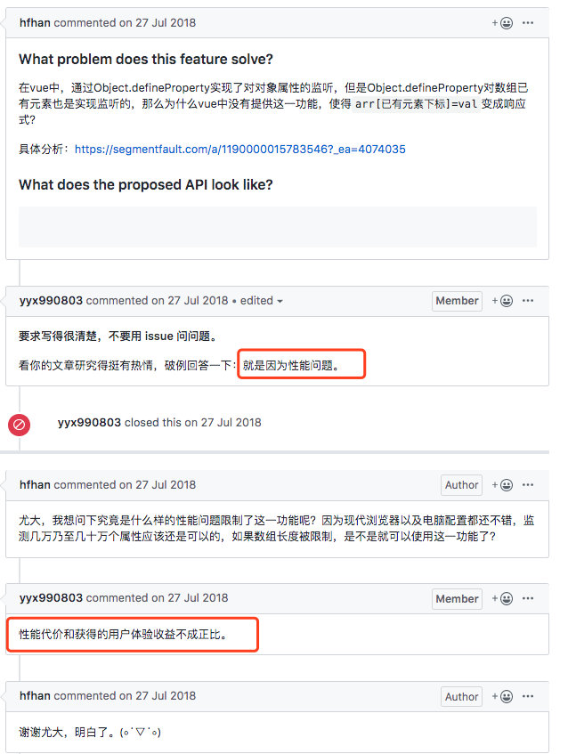

Vue2.0对于响应式数据的实现有一些不足：

- 无法检测数组/对象的新增属性

  （在data option 中已初始化的数据能够实现响应式，后期为其新增的数据，不能实现响应式）

- 无法检测通过索引改变数组的操作。

----

​	在初学 vue 时，并没有深入思考这个问题，但偶然的一天，我突然有了以下想法：vue2.x 内部使用 defineProperty 实现数据劫持，但 defineProperty 真的不能拦截数组吗？

​	我认为是可以的，因为数组是引用类型数据，其中的 prop 只不过是数字而已，defineProperty 应该可以正常的代理其中的每一个 item。

​	光是猜测肯定不行，我们上代码测试一下不就好了。

```
function watcher(arr) {
  for (const [key, value] of Object.entries(arr)) {
    defineEffect(arr, key, value);
  }

  function defineEffect(obj, prop, value) {
    Object.defineProperty(obj, prop, {
      get() {
        console.log("getter");
        return value;
      },
      set(newValue) {
        console.log("setter");
        value = newValue;
      },
    });
  }
}
```

测试：

```
let arr = [1, 2, 3, 4, 5];
watcher(arr);

arr[1];			//getter
arr[1] = 3;	//setetr
```

结果确实可以侦听，那就奇了怪，为啥尤大不去正常的拦截 Array 呢？

后来发现，早已有大佬提出了这个 issue：



根据尤大在 vue 的 issue 上的解答，之所以不使用 defineProperty 拦截数组，是因为 **性能问题**。在源码中，也确实对 Array 类型的数据进行了特殊处理，此时将不会监控其中的每一项 item。

我们再来看一下官方文档的解释：


其中提到，是由于 JS 的限制，但 defineProperty 是可以拦截 Array 的，可能这里表达的意思就是性能方面的限制。

---

在 Vue3 中，使用 Proxy 进行数据劫持，就很好的解决了这个问题：

* Proxy 将一次性代理整个对象
* 而不用像 defineProperty 一样，需要使用 for 循环依次遍历，再进行拦截。

因而在 Vue3 中，我们可以直接通过 index 去操作数组，并且保持数据的响应式。

