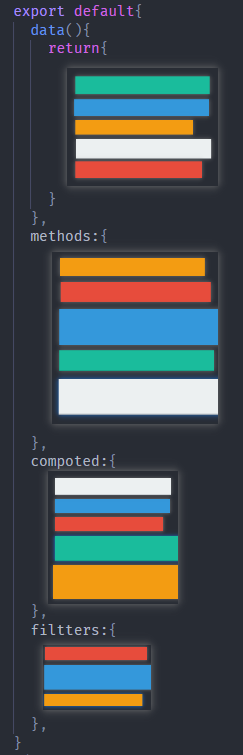
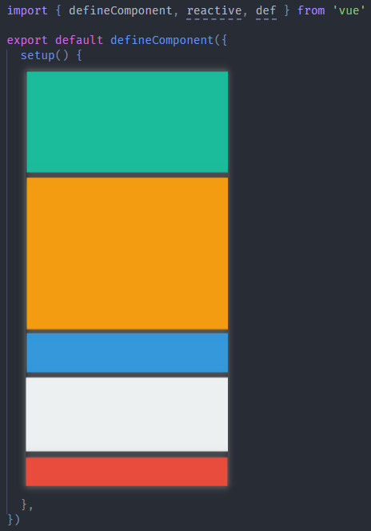
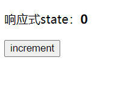
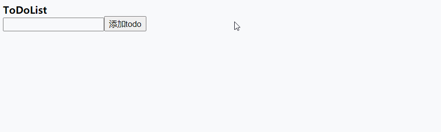
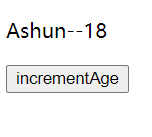

在Vue3中，有很多好用的新特性，其中最常用到的就是CompositionAPI，下面我们就来了解一下CompositionAPI。

## 为什么使用CompositionAPI？

​	在使用CompositionAPI之前，我们要知道为什么使用它，相比之前的optionsAPI有什么好处？下面我们通过实际情况的对比，来体现为什么使用CompositionAPI。

​	对于为什么使用CompositionAPI，[官方文档](https://v3.cn.vuejs.org/guide/composition-api-introduction.html#什么是组合式-api)所举的例子🌰就很好，如果你开发过中大型的项目，就能够很好的体会这个问题：

​	在Vue2.x中，我们通过在vue实例中配置各种options（data、methods、compoted、fillters、watch……）来实现组件在代码层面的业务，这种形式能够强制性地让**不同的操作进行分离**，在逻辑、组件数目较少时代码的结构是很清晰的。但是通过项目逐渐的迭代，不论在`组件数目`还是`逻辑处理`上，都会变得非常繁多，这时在代码的阅读、维护上就出现了比较严重的问题。

​	由于组件的功能不断增多，在各个option中的代码也就不断增多，并且**各个option中都存在不同功能模块的代码**，这时如果我们要阅读、维护某个功能模块，就要在不同的option中来回跳转，还要在其中查找对应功能的代码块。显然增加了阅读、维护的成本。

如图所示：这是一个大型组件的示例，其中**功能模块**按颜色进行分组。



如果代码能够按照所对应的功能模块进行排列，就像下图一样，岂不是更好？



我们可以使用`CompositionAPI`实现这种结构，而且，如果将各个功能模块抽离为单独的`hook`再进行引入，代码会更加清晰🎉。

## Vue3功能模块的抽离

在了解怎么使用`CompositionAPI`API之前，我们先了解一下Vue3在代码组织上的改变，通过上文图片可以看到在vue3中，将各个功能模块进行了抽离，这样我们就可以按需引入对应的模块进行使用。

这里介绍一下vue3在最基本的场景中，代码使用层面的改变。

### App.vue

vue2.x

```
import Vue from "vue";
import router from './router'
import store from './store'
import App from "./App.vue"

new Vue({
  render:(h)=>h(App),
  store,
  router
}).$mount("#app")
```

vue3

```
import { createApp } from 'vue'

import App from './App.vue'
import router from './router'
import store from './store'

createApp(App).use(store).use(router).mount('#app')
```

* 引入`createApp`工厂函数，将App组件传入，创建应用组件
* 通过`use`API配置其它选项
* 通过`mount`方法挂载到DOM元素上

### 组件的创建

vue2.x

```
<template>
	<div>
			template只能有一个子节点
	</div>
</template>

<script>
  export default {
    ……
  }
</script>
```

vue3

```
<template>
	<header></header>
	<main>
		template可以有多个子节点
	</main>
	<footer></footer>
</template>

<script>
  import { defineComponent } from 'vue'
  export default defineComponent ({
    setup(props,context){
    	……
    }
  })
</script>
```

* 引入`defineComponent`工厂函数，通过其配置组件
* `setup` 是所有CompositionAPI "表演的舞台" 👇

## 邂逅setup

CompositionAPI 的应用，都是在`setup(props,context)`方法中完成的，setup相当于CompositionAPI 的入口，下面先总结一下setup的特点：

* 组件中用到的state、method，都是在setup中配置的。
* setup有两种返回值，作用也不同
  * （⭐）返回一个Object，其中的属性、方法，能够与模板进行绑定。
  * 直接返回一个渲染函数，自定义渲染的内容
  * 所以setup不能是一个`async`函数，因为此时返回的将是Promise，模板中将不能绑定其中的state
*  setup选项在组件创建**之前**执行
  * 具体来说：在`beforeCreate`、`created`之前执行，也就是说setup内部**不能**够使用`this`去访问实例。

## state与method

前面讲到，组件中用到的state、method，都是在setup中配置的。而且要将它们放在一个Object中并返回，才能与视图进行绑定。下面我们来体验一下。


```
<template>
  <header>{{ headerContent }}</header>
  <main>{{ mainContent }}</main>
  <footer>{{ footerContent }}</footer>
  <button @click="getContent">getContent</button>
</template>
<script>
  import { defineComponent, reactive } from "vue";

  export default defineComponent({
    setup() {
    	//state
      let headerContent = "我是头部信息";
      let mainContent = "我是主体部分";
      let footerContent = "我是页脚";
      //method
      const getContent = () => {
        alert(`${headerContent},${mainContent},${footerContent}`);
      };
      //将与视图绑定的state、method放入Object并返回
      return {
        headerContent,
        mainContent,
        footerContent,
        getContent,
      };
    },
  });
</script>
```

## 响应式变量

如果你在上述案例代码中，尝试使用自定义的method去变更之前定义的各个state，你会发现，页面并没有发生改变，因为在vue3中，你需要通过`ref`、`reactive`去生产响应式引用。

### reactive

在`setup`中，我们可以使用`reactive`功能函数去创建响应式的引用，下面通过简单的计数器案例展示：



```
<template>
  <p>
    响应式state：<strong>{{ state.counter }}</strong>
  </p>
  <button @click="increment">increment</button>
</template>

<script>
	//引入reactive功能函数
  import { defineComponent, reactive } from "vue";

  export default defineComponent({
    setup() {
    	//使用reactive创建响应式引用
      const state = reactive({
        counter: 0,
      });
      //事件定义
      const increment = () => {
        state.counter++;
      };
      //将数据、事件返回,与视图绑定
      return {
        state,
        increment,
      };
    },
  });
</script>
```

todo案例，加深体验



```
<template>
  <header><strong>ToDoList</strong></header>
  <main>
    <input id="addBar" type="text" v-model="state.content" />
    <button @click="addTodo">添加todo</button>
    <ul>
      <li v-for="(val, index) in state.todoList" key="val">
        <div class="content">{{ index }}--{{ val }}</div>
        <button @click="deleteTodo(index, val)">delete</button>
      </li>
    </ul>
  </main>
</template>
<script>
  import Vue, { defineComponent, reactive } from "vue";

  export default defineComponent({
    setup() {
      const state = reactive({
        content: "",
        todoList: [],
      });
      const addTodo = () => {
        if (state.content) {
          //Vue3能够直接通过索引改变数组实现响应式，因为内部使用Proxy进行拦截
          state.todoList[state.todoList.length] = state.content;
          state.content = "";
        } else {
          alert("不能为空");
        }
      };
      const deleteTodo = (index, val) => {
        state.todoList.splice(index, 1);
        alert(`您删除了：${val}`);
      };
      return {
        state,
        addTodo,
        deleteTodo,
      };
    },
  });
</script>
```

>值得注意的是：上述两则案例，reactive中传入的都是一个Object，当然也可传入其它**引用类型数据**，但reactive**不能代理基本数据类型**，因为reactive内部应用的是`Proxy`实现数据劫持。
>
>若想产生`基本数据类型`的响应式引用，可以使用`ref`👇

### ref

我们也可以使用`ref`功能函数创建响应式引用，ref还包含其它功能，总结如下：

* 创建响应式引用
  * 基本类型
  * 引用类型
* 能够利用`ref`访问组件、DOM节点。

#### 响应式引用

`ref`与`reactive`不同，其既能生产`基本类型`响应式数据，又能生产`引用类型`的响应式数据。

下面还是通过案例进行体现：

```
<template>
  <main>
    <li>
      <p>ref响应式数据（基本类型）：{{ count }}</p>
      <button @click="increment">increment</button>
    </li>
    <li>
      <p>ref响应式数据（引用类型）：{{ ref_user.name }}--{{ ref_user.age }}</p>
      <button @click="changeUser">changeUser</button>
    </li>
  </main>
</template>
<script>
  //引入ref
  import Vue, { defineComponent, ref } from "vue";

  export default defineComponent({
    setup() {
      //ref引用类型
      const ref_user = ref({
        name: "Ashun",
        age: 18,
      });
      const changeUser = () => {
        ref_user.value.name = "Ashuntefannao";
        ref_user.value.age = 20;
      };

      //ref基本类型
      let count = ref(0);
      const increment = () => {
        count.value++;
      };
      return {
        ref_user,
        changeUser,
        count,
        increment,
      };
    },
  });
</script>
```

>由于`ref`生产后的数据需要通过`value`属性去访问真正的值，若代理`引用类型`的数据，在访问、操作时较为繁琐，所以一般情况下：ref 用于生产`基本类型`的响应式数据。

#### 原理

* 经过[上文](###reactive)我们已经知道：`reactive`内部使用`Proxy`实现对**引用类型**的数据劫持，因此**不能够代理基本数据类型**。

* 但为什么`ref`可以呢？

  ​	实际上我们不难发现，`ref`处理后的基本类型实际上也变为了一个`Object`，我们**只能通过**`value`属性去访问真正的值，并且，**只有操作**`value`**属性，才能实现数据的响应式。**

  ​	并且，如果使用 ref 处理引用类型，通过打印 ref 变量的`value`，可以得到是一个Proxy对象，实际上ref 处理引用类型时，引用的是`reactive`的逻辑。

#### 访问节点

在vue2.x中可以通过`this.$refs["xxx"]`去访问节点，但在`setup`中不可以，我们可以利用`ref`访问节点。

* 定义`ref`响应式数据，可设置初始值为`null`，并将其return
* 为标签绑定 `ref` 属性，值为暴露的 ref 变量名称
* 在组件挂载后`onMounted`，即可通过变量的`value`属性访问目标元素

```
<template>
  <header>
    <strong ref="Title">{{ state.title }}</strong>
  </header>
</template>
<script>
  import Vue, {
    defineComponent,
    onMounted,
    reactive,
    ref,
  } from "vue";

  export default defineComponent({
    setup() {
      const state = reactive({
        title: "Ashuntefannao",
      });
      const Title = ref(null);

      //setup在组件创建前调用，因此访问不到，结果为null
      console.log(Title.value);
      //挂载后即可正常访问
      onMounted(() => {
        console.log(Title.value);
      });
      return {
        state,
        Title,
      };
    },
  });
</script>
```

#### 切勿踩坑

下述代码，只是在标签上绑定了`ref`属性，但没有定义`ref`变量，最后也能够正常访问对应节点。

这是一个比较基础的问题，如果你想不明白为什么，可以看看我之前写过的文章

>下例的`console.log(Title)`等同于`console.log(window.Title);`

```
<template>
  <header>
    <strong id="Title" ref="Title">{{ state.title }}</strong>
  </header>
</template>
<script>
  import Vue, {
    defineComponent,
    onMounted,
    reactive,
  } from "vue";

  export default defineComponent({
    setup() {
      const state = reactive({
        title: "Ashuntefannao",
      });

      //挂载后即可正常访问
      onMounted(() => {
        console.log(Title);
      });
      return {
        state,
      };
    },
  });
</script>
```

### ref转为reactive

如果我们将`ref`作为属性放入`reactive`中，依旧是可以实现响应式的。

内部对`ref`数据进行操作时，两种方法都可实现响应式：

1. 通过`value`属性操作
2. 通过`reactive`操作



```
<template>
  <main>
    <p>{{ state.name }}--{{ state.age }}</p>
    <button @click="incrementAge">incrementAge</button>
  </main>
</template>
<script>
  import { defineComponent, ref, reactive } from "vue";

  export default defineComponent({
    setup() {
      const age = ref(18);
      const state = reactive({
        name: "Ashun",
        //将ref放入reactive中
        age,
      });
      const incrementAge = () => {
      	//两种操作形式都可生效，相当于+2
        age.value++;
        state.age++;
      };
      return {
        state,
        incrementAge,
      };
    },
  });
</script>
```

### toRefs

上面讲到了`ref`转为`reactive`的属性，而`reactive`中的各个属性也可转化为`ref`。

在之前的案例中不难发现，通过reactive定义的state在暴露给template后，每次都要通过`state.propName`访问对应的状态，能不能像暴露 ref 变量一样，直接通过变量名访问对应的state？

答案是可以的：我们可以在return出reactive创建的state时，利用`toRefs`将state中的各个属性转化为一个个ref

注意点：

* 在使用`toRefs`将state中的各个属性转化为 ref 对象后，还要将整体进行展开，这样才相当于将一个个 ref 对象依次暴露。
* tempalte使用时，可直接通过属性名访问
* 操作数据时，依旧通过state进行访问

```
<template>
  <main>
    reactive属性转化为ref
    <p>{{ title }}--{{ counter }}</p>
    <button @click="incrementCounter">incrementCounter</button>
  </main>
</template>
<script>
  import { defineComponent, reactive, toRefs } from "vue";

  export default defineComponent({
    setup() {
      //reactive属性转化为ref
      const state = reactive({
        title: "Ashuntefannao",
        counter: 0,
      });
      const incrementCounter = () => {
        state.counter++;
      };
      return {
        ...toRefs(state),
        incrementCounter,
      };
    },
  });
</script>
```

此时你可能会产生一个疑问：既然state本身是一个Object，可不可以直接将state展开并返回？

```
export default defineComponent({
    setup() {
      ……
      return {
        ...state,
        incrementCounter,
      };
    },
  });
```

此时你发现，视图依旧正常展示，但如果点击按钮变更state，你就会很失望了，此时的state已经不具有响应引用了。

* 不要忘了reactive内部是通过`Proxy`代理整个对象的，最后会返回一个被代理的Object，这不是一个普通的对象，如果将其进行展开，虽然视图也能够正常绑定，但此时属性在进行操作时，内部的`getter/setter`将不会被执行，也就不会产生响应式。

## computed

这里我们不再说明vue2.x中的用法，主要示例vue3中怎样使用，在vue3中`watch/computed`也被抽离为单独的功能函数，在使用之前都需要进行引入，下面我们来体验一下：

* 引入`computed`功能函数
* 在`computed`中传入`callback`处理对应的业务，并定义变量接收`computed`的执行结果
* 将变量return，与视图绑定

```
<template>
  <pre>{{ info }}</pre>
</template>
<script>
  import { defineComponent, reactive, computed } from "vue";

  export default defineComponent({
    setup() {
      const state = reactive({
        name: "ashun",
        age: 18,
        like: "coding",
      });
      const info = computed(() => {
        let { name, age, like } = state;
        name = `名称:${name.substring(0, 1).toUpperCase()}${name.slice(1)}`;
        age = `年龄:${age}岁`;
        like = `喜欢:${like}!`;
        return `
          ${name}
          --${age}
          --${like}`;
      });
      return {
        info,
      };
    },
  });
</script>
```

## watch

> watch 函数用来侦听特定的数据源，并在回调函数中执行副作用。默认情况是惰性的，也就是说仅在侦听的源数据变更时才执行回调（这个特性可以通过配置option进行改变）。

```vue
watch(source, callback(current,pre), {options})
```

参数说明：

- `source`: 可以支持 string,Object,Function,Array; 用于指定要侦听的响应式变量
- `callback(current,pre)`: 执行的回调函数
- `options`：支持 deep、immediate 和 flush 选项。
  - deep值为boolean，是否深层次观察数据变更，默认为false
  - immediate值为boolean，是否立即执行(改变惰性)，默认为false

### 侦听 ref 数据

侦听 ref 定义的数据，形式比较简单，第一个参数直接传入侦听的变量即可

```
const counter = ref(0);

setTimeout(() => {
  counter.value++;
}, 1000);

watch(counter, (newVal, oldVal) => {
  console.log("新值:", newVal, "老值:", oldVal);
});
```

​	但如果使用 ref 去生产`引用类型`的响应式数据，则直接通过上述方法不能够正确侦听，与[下文](####引用类型的监听)侦听reactive引用类型数据一样需要配置`deep:true`。

​	因为该情况内部是判断`ref`变量的`value`属性是否发生改变，来决定是否触发watch，而如果此时生产的是`引用类型`响应式数据，则value对应的是一个**Proxy**对象，是一个引用类型数据，而其特点是**传址**，因此在进行判断时，认为数据没有发生改变，返回为true。

### 侦听reactive 数据

侦听`reactive`的数据变化，`watch`的第一个参数必须为`function`，且需要将监听的`state`进行`return`。

#### 基本类型的监听

如果侦听的是`基本数据类型`，能够通过第二个参数正常的访问到之前的数据

```
<template>
  <pre>{{ state.info }}</pre>
</template>
<script>
  import { defineComponent, reactive, watch, } from "vue";

  export default defineComponent({
    setup() {
      const state = reactive({
        info: {
          name: "ashun",
          age: 18,
          like: "coding",
        },
      });
      setTimeout(() => {
        state.info.name = "SHUN";
        state.info.age = "22";
        state.info.like = "跑酷";
      }, 1000);
      
      watch(
        () => state.info.age,
        (cuurent, pre) => {
          console.log("基本数据类型传值，因此前后信息访问正确");
          console.log(cuurent);
          console.log(pre);
        }
      );

      return {
        state,
      };
    },
  });
</script>

```

---

#### 引用类型的监听

引用类型数据的监听，涉及到两个问题：

1. 深度侦听，才有效
2. 不能有效访问变更之前的数据

**问题1**

若将上述代码的`watch`更改如下，则当数据变更时，不会执行callback。

由于监听的是复杂的引用类型数据，而改变的是其中的选项，因此默认情况下，`info.prop`发生变更时，callback不会执行。

```
watch(
  () => state.info,
  (cuurent, pre) => {
    console.log(cuurent);
  },
);
```

即便是直接监听state，也依旧如此，state本身也是一个Object，变更的是`info.prop`，相对于监听`state.info`，侦听的层级反而更深

```
watch(
  () => state,
  ……
);
```

如果要进行深度数据的侦听，需要配置`watch.options.deep`,也就是第三个参数的配置

```
watch(
  () => state.info,
  (cuurent, pre) => {
    console.log(cuurent);
  },
  {
  	deep:true
  }
);
```

**问题2**

如果侦听的是`引用类型数据`，将**不能有效访问变更之前的数据**，因为`watch`的`callback(curren,pre)`中的两个参数，传入的都是所侦听的数据，而基本类型数据是`引值`，引用类型数据是`引址`，因此在获取`pre`时会有差异。

```
watch(
  () => state.info,
  (cuurent, pre) => {
    console.log("引用类型传址，因此不能正常获取之前的信息");
    console.log(cuurent === pre);
  },
  { deep: true }
);
```

---

### 侦听多个数据

前面的案例中，我们都是侦听**单一数据源**，那如果我想一次性侦听多个数据，怎么办呢？我们可以使用以下语法：

```
watch(stateArr, callback(oldValueArr, newValueArr), {options})
```

实际应用：

* 同时侦听ref、reactive
* 由于侦听了引用数据类型，为了保证状态变更时能正常执行，也要配置depp
* `counter`与`state.info`发生改变时，都能正常执行watch中的callback

```
<template>
  <pre>{{ state }}</pre>
</template>
<script>
  import { defineComponent, ref, reactive, watch } from "vue";
  export default defineComponent({
    setup() {
      const state = reactive({
        info: {
          name: "Ashun",
          age: 18,
        },
      });
      //多数据侦听
      let counter = ref(0);
      watch(
        [counter, () => state.info],
        ([newCounter, newInfo], [oldCounter, oldInfo]) => {
          console.log(newCounter);
          console.log(newInfo === oldInfo);
        },
        {
          deep: true,
        }
      );
      setTimeout(() => {
        counter.value++;
        state.info.age = 20;
      }, 1000);
      return {
        state,
      };
    },
  });
</script>
```

### 非惰性immediate

前面我们已经认识了`watch.options.deep`用于实现reactive引用类型的深层侦听，这里我们再介绍一下`immediate`。

在最开始介绍`watch`时，就已经指出了其具有**惰性**，默认情况下不会立刻执行，只有侦听的state发生变更时，才会执行callback中的逻辑。但如果我们想让其在最开始就立即执行，就可以配置`immediate:true`。

下面代码，watch将会立即执行

* 在最开始执行时，**获取不到**`old`，`current`将会获取当前的状态。

```
watch(
  () => state.info,
  (current, old) => {
    console.log(current);
    console.log(old == undefined);	//true
  },
  { immediate: true, deep: true }
);
```

## watchEffect

`watchEffect`同样能够监听状态变更，不过在使用上与`watch`有一些区别：

```
watchEffect(callback)
```

* `watchEffect`会先执行一次callback中的逻辑，而`watch`是惰性的。
* `watchEffect`会自动收集依赖，只需要在callback中去引用state即可，当其中的任意state变更时，都会重新执行callback
* `watchEffect` 只接收一个callback，且无法获取到变化前的值， 

```
<template>
  <pre>{{ state }}</pre>
</template>
<script>
  import { defineComponent, ref, reactive, watchEffect } from "vue";

  export default defineComponent({
    setup() {
      const state = reactive({
        info: {
          name: "Ashun",
          counter: 0,
        },
      });

      watchEffect(() => {
        console.log(state.info.counter);
      });
      setInterval(() => {
        state.info.counter++;
      }, 800);
      return {
        state,
      };
    },
  });
</script>

```

若将上述`watchEffect`代码更改如下，则当状态变更时，不会触发callback。

```
watchEffect(() => {
  //引用类型数据更新，默认情况下，依旧不能够实现深度侦听
  console.log(state.info);
});
```

* 在[上文](####引用类型的监听)中已经说明了`watch`在侦听reactive的引用类型时，默认不能深度侦听的问题。
* `watchEffect`亦是如此，于由于在其中产生了`state.info`的引用，会自动收集依赖，但该依赖为`引用类型`，而变更的是`state.info.props`，因此也不会触发callback。

