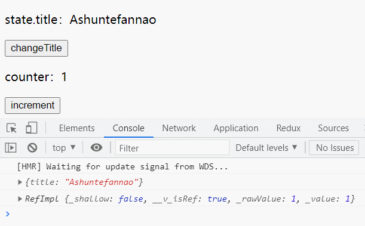
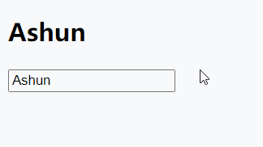

## shallowReactive 与 shallowRef

`shallowReactive与shallowRef`对应`reactive与ref`。二者用法相同，不过在性质上不同：

- shallowReactive：只处理对象最外层属性的响应式（浅响应式）。
- shallowRef：只处理基本数据类型的响应式, 不会将引用类型处理为响应式。
- 什么时候使用?
  -  如果有一个对象数据，结构比较深, 但变化时只是外层属性变化 ===> shallowReactive。
  -  如果有一个对象数据，后续功能不会修改该对象中的属性，而是生新的对象来替换 ===> shallowRef。

## readonly 与 shallowReadonly

- readonly: 让一个响应式数据变为只读的（深只读）。
- shallowReadonly：让一个响应式数据变为只读的（浅只读）。
- 应用场景: 不希望数据被修改时。

```
let state = reactive({……});
state = readonly(state)
//state = shallowReadonly(state)
```

```
let counter = ref(0);
counter = readonly(counter)
//counter = shallowReadonly(counter)
```

**对 ref 所定义状态的应用**：

当ref变量为基本类型时：

* readonly与shallowReadonly效果相同

当ref变量为引用类型时：

* readonly：深只读
* shallowReadonly：潜只读

## toRaw 与 markRaw

### toRaw

- 作用：获取`reactive`生成的<strong style="color:orange">响应式对象</strong>所对应的<strong style="color:orange">普通对象</strong>。**（对ref无效）**
- 使用场景：用于读取响应式对象对应的普通对象，对这个普通对象的所有操作，不会引起页面更新。

下面测试toRaw分别对reactive与ref的处理：

* 该案例将toRaw转化后的reactive又赋值给了state，相当于state变成了普通Object，也就失去了响应式。
* 但官方示例的作用主要是：单纯获取`reactive`响应式对象所对应的普通Object，我们可以定义一个新变量进行接收，对这个新变量的更改，不会影响原来的响应式数据

```
<template>
  <main>
    <div class="reactive">
      <p>state.title：{{ state.title }}</p>
      <button @click="changeTitle">changeTitle</button>
    </div>
    <div class="ref">
      <p>counter：{{ counter }}</p>
      <button @click="increment">increment</button>
    </div>
  </main>
</template>
<script>
  import { defineComponent, markRaw, reactive, ref, toRaw, toRefs } from "vue";

  export default defineComponent({
    setup() {
      //reactive
      let state = reactive({
        title: "Ashuntefannao",
      });
      
      state = toRaw(state);
      console.log(toRaw(state));	//toRaw获取的是reactive对应原始状态的Object
			const changeTitle = () => {
        state.title = state.title.toUpperCase();
      };
      //ref
      let counter = ref(1);
			counter = toRaw(counter);
			console.log(toRaw(counter));	//对ref变量无效，打印结果还是被ref处理的数据
      const increment = () => {
        counter.value++;
      };
      return {
        state,
        changeTitle,
        counter,
        increment,
      };
    },
  });
</script>
```

这里详细展示一下打印的结果：

```
console.log(toRaw(state));		// {title: "Ashuntefannao"}
console.log(toRaw(counter));	// RefImpl {_shallow: false, __v_isRef: true, _rawValue: 1, _value: 1}
```

---

### markRaw

- 作用：标记一个**原始**对象，使其永远不会再成为响应式对象。
- 原理：会给被标记的对象新增一个`__v_skip:true`属性，代表将跳过响应式。
- 应用场景:
  1. 有些值不应被设置为响应式的，例如复杂的第三方类库等。
  2. 当渲染具有不可变数据源的大列表时，跳过响应式转换可以提高性能。
  3. 被`markRaw`标记的对象应放入`reactive`中，之所以不放入`ref`中，是因为`ref`都是通过`value`属性进行数据操作的，而被标记后的**原始**对象是不会徒增value属性的，只是新增了`__v_skip:true`。

下面依旧通过实际案例进行体验：

```
<template>
  <main>
    <div class="reactive">
      <p>state.title：{{ state.title }}</p>
      <button @click="changeTitle">changeTitle</button>
    </div>
    <div class="ref">
      <p>counter：{{ counter.counter }}</p>
      <button @click="increment">increment</button>
    </div>
  </main>
</template>
<script>
  import { defineComponent, markRaw, reactive, ref, toRefs } from "vue";

  export default defineComponent({
    setup() {
    	//原对象
      let obj = {
        title: "Ashuntefannao",
      };
      //reactive
      let state = reactive(obj);
      const changeTitle = () => {
        state.title = state.title.toUpperCase();
        console.log(state);
      };
      state = markRaw(obj);
      
      return {
        state,
        changeTitle,
      };
    },
  });
</script>
```

#### 错误用法

* 没有原始对象，直接将reactive响应式变量使用markRaw标记。
* 虽然此时依然会新增`__v_skip: true`属性进行标记，但`state1`整体已经变为了`Proxy`对象，依旧是响应式

```
let state = reactive({
  title: "Ashuntefannao",
});

state1 = markRaw(state1);
console.log(state);	//Proxy {title: "Ashuntefannao", __v_skip: true}

const changeTitle = () => {
  state.title = state1.title.toUpperCase();
};
```

#### 为什么不放入ref

因为ref定义的是响应式数据，肯定会涉及到值的改变，而其都是通过`value`属性进行操作的。

如果后期使用markRaw标记ref变量，并重新赋值，此时将没有`value`属性，因为markRaw标记的是**原对象引用**

```
//ref
let num = { counter: 1 };
let counter = ref(num);
counter = markRaw(num);
console.log(counter);	// {counter: 1, __v_skip: true} 标记并重新赋值后的counter没有了value属性

const increment = () => {
  counter.value.counter++;	//点击按钮，执行该语句报错
};
```

---

### 注意点

**toRaw该案例**：将toRaw转化后的reactive又赋值给了state，让其state失去了响应式，但还有一个潜在的问题：

**当页面的其他响应式数据变更时，依旧会触发页面更新**

* 如果我先点击了`changeTitle`按钮，页面虽然不会更新，但title数据已经改变
* 再点击`increment`按钮，页面触发更新，由于state与视图绑定，所以此时会展示新的title



**markRaw：**markRaw也同理，当其他响应式数据变更时，会触发组件的更新。也会导致使用markRaw标记的数据呈现最新的状态。

测试代码：

```
<template>
  <main>
    <div class="reactive">
      <p>state.title：{{ state.title }}</p>
      <button @click="changeTitle">changeTitle</button>
    </div>
    <div class="ref">
      <p>counter：{{ counter }}</p>
      <button @click="increment">increment</button>
    </div>
  </main>
</template>
<script>
  import { defineComponent, markRaw, reactive, ref, toRefs } from "vue";

  export default defineComponent({
    setup() {
      let obj = {
        title: "Ashuntefannao",
      };

      //reactive
      let state = reactive(obj);
      const changeTitle = () => {
        state.title = state.title.toUpperCase();
        console.log(state);
      };
      state = markRaw(obj);

      //ref
      let counter = ref(0);
      const increment = () => {
        counter.value++;
      };

      return {
        state,
        changeTitle,
        counter,
        increment,
      };
    },
  });
</script>
```

## customRef

`customRef`(定制Ref)：

官方解释：

* 创建一个自定义的 ref，并对其`依赖项跟踪`和`更新触发`进行显式控制。
* 它需要传入一个工厂函数，该函数接收 `track` 和 `trigger` 函数作为参数，后期用于追踪、触发，并且该工厂函数应该返回一个带有 `get` 和 `set` 的对象。

理解：

* `ref`定义的是响应式数据，就涉及到了状态的`跟踪`、`更新`，但传统的`ref`方法已经帮我们自动完成了这些操作。
* 如果我们想在`跟踪`、`更新`这些流程中，想要完成一些个性化操作，就可使用`customRef`进行定制。

使用语法：

* 创建一个与将要使用的`定制Ref`同名的函数，这样能够与传统的ref在使用上保持一致（都是一个功能函数的调用）
* 调用customRef进行定制，并将其return
* customRef中需要返回一个包含getter、setter的Object
  * 在getter中调用`track`，告知Vue这个value值是需要被“追踪”的，后期才能够进行更新
  * 在setter中调用`trigger`，用于触发更新。(更新value后调用)

```
//自定义一个myRef
function myRef(value){
	returen customRef((track,trigger)=>{
    returen {
      get(){
      	track();
      	return value;
      },
      set(newValue){
      	value = newValue;
      	trigger();
      }
    }
  })
}
//使用自定义的myRef
const title = myRef("Ashun")
```

防抖更新案例：

既然customRef允许我们在getter、setter中`"加料"`,我们就可以在其中进行随意的操作，例如实现防抖更新。



```
<template>
  <h2>{{ title }}</h2>
  <input type="text" v-model="title" @change="changeTitle" />
</template>
<script>
  import { defineComponent, customRef } from "vue";

  export default defineComponent({
    setup() {
      function deBounceRef(value, delay = 200) {
        let timer = null;
        return customRef((track, trigger) => {
          return {
            get() {
              track();
              return value;
            },
            set(newVal) {
              clearTimeout(timer);
              timer = setTimeout(() => {
                value = newVal;
                trigger();
              }, delay);
            },
          };
        });
      }
      const title = deBounceRef("Ashun", 1000);
      const changeTitle = () => {};
      return {
        title,
        changeTitle,
      };
    },
  });
</script>
```

## 响应式数据的判断

#### isRef

检查目标是否为 `ref` 对象

```
const title = ref("Ashuntefannao");
const objRef = ref({ name: "Shun" });

console.log(isRef(title));	//true
console.log(isRef(objRef));	//true
```

#### isReactive

检查目标是否为 `reactive` 对象

* 这里判断`objRef.value`也为`true`
* 印证了之前文章的说法：ref 代理引用类型响应式数据，内部走的是`reactive`的逻辑

```
const admin = reactive({
  name: "Ashun",
  type: "Admin",
});
const objRef = ref({ name: "Shun" });

console.log(isReactive(admin));		//true
console.log(isReactive(objRef.value));//true
```

#### isReadonly

检查目标是否为 `readonly/shallowReadonly` 创建的只读代理

```
const readOnlyAdmin = readonly(admin);
const shallowReadonlyAdmin = shallowReadonly(admin);

console.log(isReadonly(readOnlyAdmin));	//true
console.log(isReadonly(shallowReadonlyAdmin));//true
```

#### isProxy

检查目标是否为**Vue内部**的`Proxy`代理对象

* 原生创建的Proxy判断返回false
* `objRef`内部走的是`reactive`逻辑，因此其对应的value属性也是Vue内部的Proxy代理对象。

```
//reactive
const admin = reactive({
  name: "Ashun",
  type: "Admin",
});
//objRef
const objRef = ref({ name: "Shun" });
//原生Proxy
let obj = { name: "Ashun" };
let proxy = new Proxy(obj, {
  get(target, prop) {
    return Reflect.get(target, prop);
  },
  set(target, prop, newVal) {
    let result = Reflect.set(target, prop, newVal);
    return result;
  },
});

console.log(isProxy(admin));	//true
console.log(isProxy(objRef.value));//true
console.log(isProxy(proxy));	//false

```

