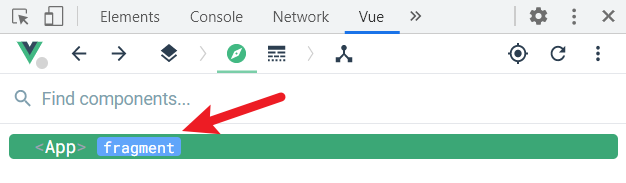
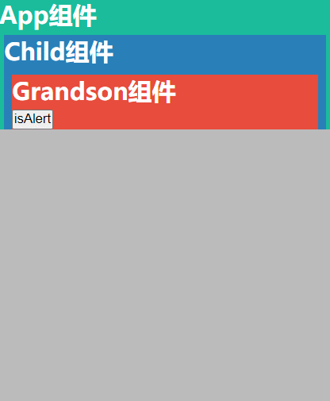
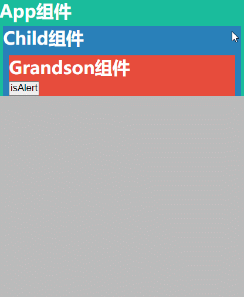
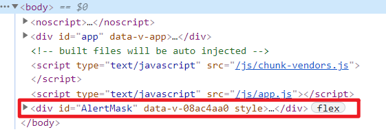
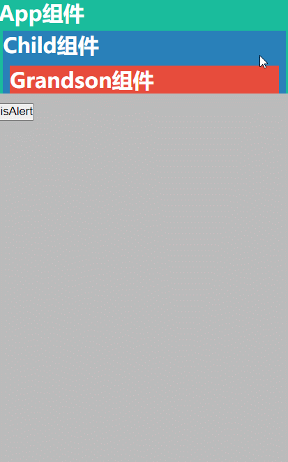
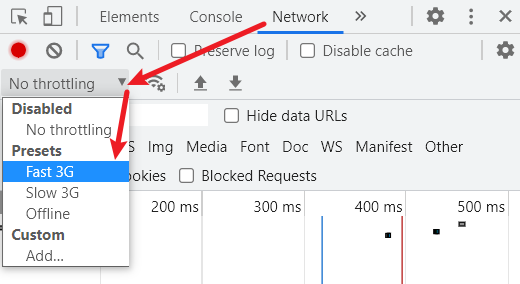
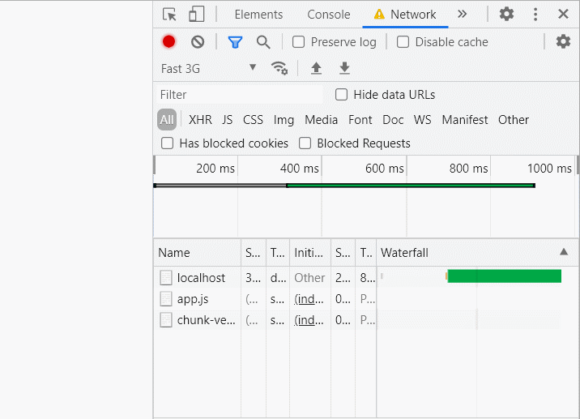
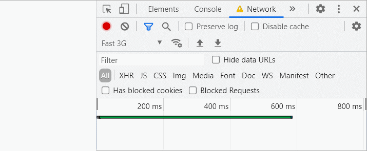
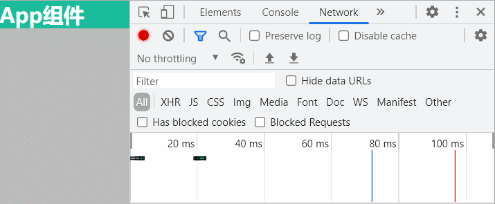
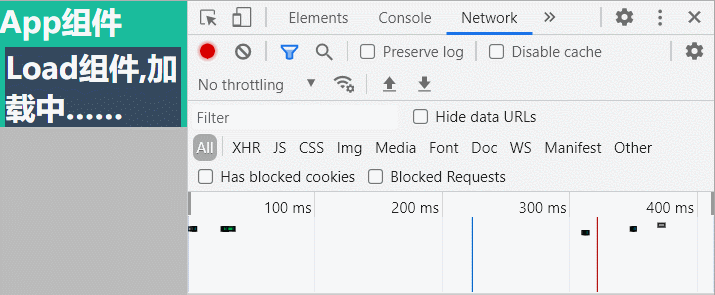

## Fragment

`Fragment`是Vue内部创建的一个组件，不用我们手动定义，用于解决Vue2的组件中必须有一个`rootElement`的问题

- 在Vue2中: 组件必须有一个根元素
- 在Vue3中: 组件可以设置多个根元素, 内部会将多个标签包含在一个`Fragment`**虚拟元素**中
- 好处: 减少标签层级, 减小内存占用

```
<template>
  <p>
    在Vue3中: 组件可以设置多个根元素,
    内部会将多个标签包含在一个Fragment虚拟元素中
  </p>
  <h2>可在Vue.js devtools中查看</h2>
</template>
```



## Teleport

Teleport (传送)——是一种能够将<strong style="color:#f39c12">目标html结构</strong>移动到指定位置的组件。

* 使用`teleport`标签包裹`目标html结构`
* 为`teleport`设置`to`属性，代表移动的目标位置
  * 其值为`css选择器`，就能移动到指定标签内部的末尾
* 若`teleport`包裹的内容，包含`组件`，虽然组件的位置会进行移动，但不会影响组件注册时的父子关系，依旧能从原父组件接收props

### 警示框案例体验：

通过封装警示框组件，来体验`teleport`，其中组件的嵌套关系为：

* App
  * Child
    * Grandson
      * Alert

要求：Alert能被任意组件使用，且弹出时有mask遮罩层，将整个应用进行遮罩。

#### 最终代码

App.vue

```
<template>
  <div id="main">
    <h2>{{ title }}</h2>
    <child />
  </div>
</template>
<script>
  import { defineComponent, reactive, toRefs } from "vue";
  import Child from "./Child.vue";
  export default defineComponent({
    name: "App",
    components: { Child },
    setup() {
      const state = reactive({
        title: "App组件",
      });
      return {
        ...toRefs(state),
      };
    },
  });
</script>
<style>
  * {
    margin: 0;
    padding: 0;
  }
  body {
    width: 100vw;
    height: 100vh;
    background: #bbb;
  }
  #main {
    color: white;
    background: #1abc9c;
  }
</style>
```

Child.vue

```
<template>
  <div id="Child">
    <h2>{{ title }}</h2>
    <grandson />
  </div>
</template>
<script>
  import { defineComponent, reactive, toRefs } from "vue";
  import Grandson from "./Grandson.vue";
  export default defineComponent({
    name: "ChildCPN",
    components: {
      Grandson,
    },
    setup() {
      const state = reactive({
        title: "Child组件",
      });
      return {
        ...toRefs(state),
      };
    },
  });
</script>
<style scoped>
  #Child {
    margin: 5px;
    color: white;
    background: #2980b9;
  }
</style>
```

Grandson.vue

```
<template>
  <div id="Grandson">
    <h2>{{ title }}</h2>
    <alert :message="message" />
  </div>
</template>
<script>
  import { defineComponent, reactive, toRefs } from "vue";
  import Alert from "./Alert.vue";
  export default defineComponent({
    name: "GrandsonCPN",
    components: { Alert },
    setup() {
      const state = reactive({
        title: "Grandson组件",
        message: "父组件传入的massage",
      });

      return {
        ...toRefs(state),
      };
    },
  });
</script>
<style scoped>
  #Grandson {
    margin: 8px;
    color: white;
    background: #e74c3c;
  }
</style>
```

Alert.vue

```
<template>
  <div id="Alert">
    <button @click="changeShow">isAlert</button>
    <teleport to="body">
      <div id="AlertMask" v-show="isShow">
        <div class="content">
          <button @click="changeShow">X</button>
          <h2>{{ title }}</h2>
          <p>{{ message }}</p>
        </div>
      </div>
    </teleport>
  </div>
</template>
<script>
  import { defineComponent, reactive, toRefs } from "vue";

  export default defineComponent({
    name: "AlertCPN",
    props: {
      message: {
        type: String,
        default: "Message",
      },
    },
    setup(props) {
      const state = reactive({
        title: "Alert组件",
        isShow: false,
      });
      const changeShow = () => {
        state.isShow = !state.isShow;
      };
      return {
        ...toRefs(state),
        changeShow,
      };
    },
  });
</script>
<style scoped>
  #Alert {
    color: white;
  }
  #AlertMask {
    position: absolute;
    top: 0;
    bottom: 0;
    left: 0;
    right: 0;
    background-color: rgba(0, 0, 0, 0.3);
    backdrop-filter: blur(5px);
    display: flex;
    flex-direction: column;
    justify-content: center;
    align-items: center;
  }

  .content {
    display: flex;
    flex-direction: column;
    justify-content: center;
    align-items: center;
    background-color: #9b59b6;
    border-radius: 8px;
    padding: 8px;
  }
</style>
```

#### 使用teleport

为了能让`mask`遮挡住整个应用，使用`position`结合`top/bottom/left/right`将mask撑开。

但如果Alert组件的使用者(父组件)，设置了`相对定位`,并且其宽高没有占满整个屏幕，则mask就不能遮挡整个应用。

并且若父组件还设置了overflow，情况会更加糟糕。

例如将上述组件代码做出以下更改，Alert组件的展示会很糟：

Grandson.vue

```
<style scoped>
  #Grandson {
    ……
    position: relative;
    overflow: hidden;
  }
</style>
```

Alert.vue

```
去除teleport组件
```



因此，我们可以使用`teleport`，将`mask`部分移动到`body`中，此时position就是相对于整个body进行定位的：





#### teleport包裹组件

若`teleport`包裹的内容，包含`组件`，虽然组件的位置会进行移动，但不会影响组件注册时的父子关系，依旧能从原父组件接收props

例如在Grandson.vue中将整个alert组件进行移动，alert组件虽然被移动到了外部，但点击按钮后，依旧能展示Grandson传入的props

```
<template>
  <div id="Grandson">
    <h2>{{ title }}</h2>
    <teleport to="body">
    	<alert :message="message" />
    </teleport>
  </div>
</template>
```



## Suspense

`Suspense`(悬念)：等待异步组件的过程中渲染一些额外内容，让用户有更好的体验。

先简单总结一下使用步骤：

- 异步引入组件

  1. 使用`defineAsyncComponent`，异步引入
  2. 在异步组件中返回`Promise`，异步返回组件的state，正常引入

- 使用```Suspense```包裹组件，并配置好`default` 与 `fallback`

  - default：异步加载的组件
  - fallback(退路)：等待异步组件加载时，渲染的内容

  ```
  <Suspense>
    <template v-slot:default>
      <Child/>
    </template>
    <template v-slot:fallback>
      <h3>加载中.....</h3>
    </template>
  </Suspense>
  ```

## 异步引入组件

我们知道，默认情况下：只有当后代组件挂载完毕后，祖先组件才能够被挂载到页面，因此呈现的效果是父子组件一同出现。

我们可以通过控制台，将网络调差，来观察加载的这个过程：



可以观察到，父子组件是一起出现的



但有时，我们希望子组件能够`异步加载`，可以通过两种方式实现👇

1. 使用`defineAsyncComponent`，异步引入
2. 在异步组件中返回`Promise`，异步返回组件的state，正常引入

### defineAsyncComponent

在父组件中，使用`defineAsyncComponent`功能函数，异步引入组件

```
defineAsyncComponent(() => import("pathName"))
```

```
<script>
  import { defineAsyncComponent, …… } from "vue";
  const Child = defineAsyncComponent(() => import("./Child.vue"));
  export default defineComponent({
    name: "App",
    components: {
      Child,
    },
    setup() {
      const state = reactive({
        title: "App组件",
      });
      return {
        ...toRefs(state),
      };
    },
  });
</script>
```

此时就可观察到，Child是异步引入，App组件优先呈现



### Promise异步返回状态

如果我们希望某个组件变为`异步组件`，可以在`setup`中返回Promise，用于异步返回state。同样能够达到异步效果。

Child.vue:

```
<script>
  import { defineComponent, reactive, toRefs } from "vue";
  export default defineComponent({
    name: "ChildCPN",
    setup() {
      const state = reactive({
        title: "Child组件",
      });
      return new Promise((resolve, reject) => {
       setTimeout(() => {
         resolve({ ...toRefs(state) });
       }, 3000);
      });
    },
  });
</script>
```

App.vue

由于在Child组件中异步返回state，Child本身是异步组件，所以在App中正常引入即可

```
import Child from "./Child.vue";
……
```

效果：三秒后，Child出现



## 案例体验

* Child异步引入，在等待Child过程中，加载Load组件。
* 为了让效果更加明显，这里使用Promise让Child本身变为异步组件。

App.vue

```
<template>
  <div id="main">
    <h2>{{ title }}</h2>
    <suspense>
      <template v-slot:default>
        <child />
      </template>
      <template v-slot:fallback>
        <load />
      </template>
    </suspense>
  </div>
</template>
<script>
  import { defineAsyncComponent, defineComponent, reactive, toRefs } from "vue";
  import Child from "./Child.vue";
  import Load from "./Load.vue";
  export default defineComponent({
    name: "App",
    components: {
      Child,
      Load,
    },
    setup() {
      const state = reactive({
        title: "App组件",
      });
      return {
        ...toRefs(state),
      };
    },
  });
</script>
```

Child.vue

```
<template>
  <div id="Child">
    <h2>{{ title }}</h2>
  </div>
</template>
<script>
  import { defineComponent, reactive, toRefs } from "vue";
  export default defineComponent({
    name: "ChildCPN",
    async setup() {
      const state = reactive({
        title: "Child组件",
      });
      const State = new Promise((resolve, reject) => {
        setTimeout(() => {
          resolve({ ...toRefs(state) });
        }, 1000);
      });
      return await State;
    },
  });
</script>
```

Load.vue

```
<template>
  <div id="Load">
    <h2>{{ title }}</h2>
  </div>
</template>
<script>
  import { defineComponent, reactive, toRefs } from "vue";
  export default defineComponent({
    name: "LoadCPN",
    setup() {
      const state = reactive({
        title: "Load组件,加载中……",
      });
      return {
        ...toRefs(state),
      };
    },
  });
</script>
```

效果：


