## 基础知识

### 一、关于变量

#### 1.1 弱类型

​	JavaScript是一种弱类型语言，声明变量时不用指定变量的类型，变量类型由赋予的值所决定。

```text
var web = "ashun.com";
console.log(typeof web); //string
web = 99;
console.log(typeof web); //number
web = {};
console.log(typeof web); //object
```

---

#### 1.2 变量提升

​	代码在执行前会进行预解析，会把var形式的变量的声明提升到当前作用域(window、function)最前。

预解析示例:

​	我们知道`while`是js的关键字，是不能够作为变量名称的，下面代码在解析过程中发现`while`不能做为变量名，没有到执行环节就出错了，这是一个很好的预解析过程的体验。

```txt
var web = 'ashun';
console.log(web);
let while = 'ashuntefannao'; //Uncaught SyntaxError: Unexpected token 'while'
```

​	使用 `var` 声明代码会被提升到前面，按理来说，变量未定义就使用应该报错，但是由于变量提升的缘故，并不会报错。

```text
console.log(a); //undefined
var a = 1;
console.log(a);  //1

//以上代码解析器执行过程如下
var a;
console.log(a); //1
a = 1;
console.log(a); //1
```

下面是 `if(false)` 中定义的var也会发生变量提升，注释掉`if` 结果会不同

```text
var web = "ashun";
function as() {
  if (false) {
    var web = "阿顺";
  }
  console.log(web);
}
as();//undefined
```

---

#### 1.3 TDZ

​	TDZ 又称暂时性死区，指变量在作用域内已经存在，但必须在`let/const`声明后才可以使用。

TDZ可以让程序保持先声明后使用的习惯，让程序更稳定。

- 变量要先声明后使用
- 建议使用let/const 而少使用var

使用`let/const` 声明的变量在声明前存在临时性死区（TDZ）使用会发生错误

```text
console.log(x); // Cannot access 'x' before initialization
let x = 1;
```

在`run`函数作用域中产生TDZ，不允许变量在声明前使用。

```TEXT
as = "Ashuntefannao";
function run() {
  console.log(as);
  let as = "Ashun";
}
run();
```

函数参数的解析，自左向右，下面代码b没有声明赋值不允许直接使用

```text
function test(a = b, b = 3) {}
test(); //Cannot access 'b' before initialization
```

因为a已经赋值，所以b可以使用a变量，下面代码访问正常

```text
function test(a = 2, b = a) {}
test(); 
```

### 二、块级作用域

​	var不具有块级作用域，ES6的let、const具有块级作用域。但是它们都具有函数、全局作用域。

#### 2.1 共同点

​	在父级作用域中声明的变量，能够被子级作用域访问，但子级作用域中的变量不能够被父级访问。

```
var as = "ashunte";

function test() {
    var site = "ashuntefannao.com";
    console.log(as);
}

test();	//ashunte
onsole.log(site);//Uncaught ReferenceError: site is not defined
```

#### 2.2 let

​	`let`、`const`都具有块级作用域，会与`{ }`形成一个作用域，块级作用域与全局、函数作用域一样：在父级作用域中声明的变量，能够被子级作用域访问，但子级作用域中的变量不能够被父级访问。

​	但`let`、`const`形成的块级作用域所定义的变量，不会污染全局, 并且`let`、`const`定义的变量全局不会添加到`window`中。

```
 {
        let as = "ashun";
        {
          console.log(as);//ashun
        }
}
console.log(as);//Uncaught ReferenceError: as is not defined
```

每一层都是独立作用域，里层作用域可以声明外层作用域同名变量，但不会改变外层变量

```
function run() {
        let as = "Ashuntefannao";
        if (true) {
          let as = "Ashun";
          console.log(as); //Ashun
        }
        console.log(as); //Ashuntefannao
}
run();
```


--var不具有块级作用域，使用 `var` 声明的变量存在于最近的函数或全局作用域中。

没有块作用域很容易污染全局，下面函数中的变量污染了全局环境

```
function run() {
    web = "ashun";
}
run();
console.log(web); //ashun
```

>​	注意：上面示例的代码中，web变量没有使用var声明，如果使用var声明，就会报错。
>
>使用var声明报错的原因:
>
>​	如果使用var声明了web变量，证明web变量属于run函数的作用域。所以外部作用域不能访问该变量。
>
>没有使用var声明:
>
>​	证明使用的是全局变量，变量提升在全局作用域，因此在函数外部（全局作用域）能够访问。
>
>```
>var web;//变量提升过程
>function run() {
>	web = "ashun";
>}
>run();
>console.log(web); //ashun
>```
>
>这个问题虽然说出来很理所当然，但是在一开始很难get到这个点。

--没有块作用作用域时`var`在`for循环`中也会污染全局

```text
for (var i = 0; i < 10; i++) {
  console.log(i);
}
console.log(i);//10
```

--`var` 全局声明的变量也存在于 `window`对象中

```txt
var as = "ashun";
console.log(window.as); //ashun
```

--使用`let、const`全局声明的变量不会添加到`window`中

```
let as = "ashun";
console.log(window.as); //undefined
```


---

#### 2.3 const

使用 `const` 用来声明常量，这与其他语言差别不大，比如可以用来声明后台接口的URI地址。

- 常量名建议全部大写

- const常量只能声明一次

- 声明时必须同时赋值

- 不允许再次全新赋值

- 拥有块、函数、全局作用域

- 可以修改`引用类型`变量的值

  ```
  const INFO = {
    url: 'https://www.ashuntefannao.com',
    port: '8080'
  };
  INFO.port = '443';
  console.log(INFO); //443
  ```

  ##### <font color="yellowgreen">Object.freeze</font>

  如果冻结变量后，变量也不可以修改了，若使用严格模式还会报出错误。

  ```text
  "use strict";
  const INFO = {
  	url: "https://www.ashun.com",
  	port: "8080",
  };
  Object.freeze(INFO);
  INFO.port = "443"; //Cannot assign to read only property
  console.log(INFO);
  ```

  

  

---

#### 2.4 重复定义

* 使用`var`定义变量，可在`同作用域`下定义同名变量进行覆盖。
* 使用`let、const`定义的变量，不可在`同作用域`下定义同名变量

使用 var 可能造成不小心定义了同名变量

```text
//优惠价
var price = 90;
//商品价格
var price = 100;
console.log(`商品优惠价格是:${price}`);//100
```

使用`let` 可以避免上面的问题，因为let声明后的变量不允许在同一作用域中重新声明

```text
let web = 'astfn.github.io';
let web = '阿顺'; //Identifier 'web' has already been declared
```

不同作用域可以重新声明

```text
let web = "ashun.com";
if (1) {
   let web = "Ashun";
   console.log(web);//Ashun
}
```

---

### 三、 严格模式

​	严格模式("use strict")，可以定义在script标签对顶部定义（范围为该标签对内），也可以在函数体顶部定义（范围为该函数内部）。

​	严格模式的使用，可以使我们的代码更加的规范，所以强力推荐使用`"use strict"`

#### 3.1 不同点

* 变量必须`先定义后使用`

* 函数形参名称不能重复

* 关键词不允许做变量使用

* 单独为函数设置严格模式

  ```text
  function strict(){  
    "use strict";  
    return "严格模式";  
  }  
  function notStrict() {  
    return "正常模式";  
  }  
  ```

  为了在多文件合并时，防止全局设置严格模式对其他没使用严格模式文件的影响，将脚本放在一个立即执行函数中。

  ```text
  (function () {
    "use strict";
    url = 'ashun.com';
  })();
  ```

* 解构差异

  非严格模式可以不使用声明指令，严格模式下必须使用声明。所以建议使用 let 等声明语法进行声明。

  ```text
  {name,url} = {name:'ashun',url:'ashuntefannao.com'};
  console.log(name, url);	//ashun ashuntefannao.com
  ```

  ```
  "use strict";
  {name,url} = {name:'ashun',url:'ashuntefannao.com'};
  console.log(name, url); //Uncaught ReferenceError: age is not defined
  ```

  ```
  "use strict";
  const {name,url} = {name:'ashun',url:'ashuntefannao.com'};
  console.log(name, url);	//ashun ashuntefannao.com
  ```

  

---

### 四、运算符与流程控制

​	在JavaScript中，与其他语言一样，都具有常用的运算符、流程控制语法。这里不再对其进行赘述，只对比较特殊的运算符、流程控制语法进行详细的解释。

#### 4.1 运算符

* 赋值运算符（=）
* 算数运算符（+、-、*、/、%）
* 复合运算符（+=、-=、*=、/=、%=）
* 一元运算符（++、--）
* 比较运算符（>、>=、<、<=、==、===）
* 逻辑运算符（&&、||、！）

#### 4.2 流程控制

* if、else、else if

* switch

* while

* do/while

* for

* break/continue

* 三元表达式

* for/in

  >for/in循环能够遍历Array，Object的`key`。
  >
  >```
  >let arr = ["A", "s", "h", "u", "n"];
  >for (let i in arr) {
  >	 console.log(i);		//0~4
  >}
  >```
  >
  >```
  >let obj = { baseURL: "http://ashuntefannao.com", port: 8081 };
  >for (let i in obj) {
  >	console.log(i);			//baseURL port
  >}
  >```
  >
  >--遍历window对象的所有属性
  >
  >```
  >for (name in window) {
  >		console.log(window[name]);
  >}
  >```
  >
  >

* for/of

  >for/of,能够遍历所有的`可迭代`数据结构，例如：Dom元素、Array、String、Set、Map。
  >
  >`但是Object、WeakSet、WeakMap是不可迭代的，因此也就不能够使用for/in进行遍历`
  >
  >```
  >let arr = [1, 2, 3];
  >for (const iterator of arr) {
  >console.log(iterator);
  >}
  >```
  >
  >```
  >let str = 'Ashun';
  >for (const iterator of str) {
  >console.log(iterator);
  >}
  >```
  >
  >`--使用迭代特性遍历数组，后期在迭代器部分会详解。`
  >
  >```
  >let site = ["ashun", "Ashuntefannao"];
  >for (const [key, value] of site.entries()) {
  >	console.log(key, value);
  >}
  >//0 ashun 1 Ashuntefannao
  >```
  >
  >使用`for/of` 也可以用来遍历DOM元素
  >
  >```text
  ><body>
  ><ul>
  ><li></li>
  ><li></li>
  ></ul>
  ></body>
  ><script>
  >let lis = document.querySelectorAll("li");
  >for (const li of lis) {
  >li.addEventListener("click", function() {
  > this.style.backgroundColor = "red";
  >});
  >}
  ></script>
  >```

* lable

  >标签(label) 为程序定义位置，可以使用`continue/break`跳到该位置。
  >
  >下面取`i+n` 大于15时退出循环
  >
  >```
  >ashuntefan: for (let i = 1; i <= 10; i++) {
  >	ashun: for (let n = 1; n <= 10; n++) {
  >		if (n % 2 != 0) {
  >			continue ashun;
  >		}
  >		console.log(i, n);
  >		if (i + n > 15) {
  >			break ashuntefan;
  >		}
  >	}
  >}
  >```


## 基本类型

>JavaScript中的基本数据类型有：boolean、null、undefined、number、string、symbol、BigInt。
>
>引用类型有：Object、Array、Function、Match、Date、RegExp、Set、WeakSet、Map、WeakMap…
>
>该标题所示基本类型意为 新手初始学习的一些数据类型。

### 一、 类型检测

#### 1.1 typeof

`typeof` 能够正确的返回以下数据类型（在不使用构造函数实例化的前提下，否则返回Object）

* Number、String、undefined、Object、Boolean、function

  ```
  console.log(
          typeof 1,									//number 
          typeof "",								//string 
          typeof undefined,					//undefined 
          typeof {},								//object  
          typeof false,							//boolean 
          typeof function () {}			//function
  );
  ```

不能正确判断的情况：

---使用构造函数实例化为对象，则返回Object。

```
let as = "Ashun";
let str = new String("Ashun"); 
console.log(typeof as, typeof str); //string object
```

---`typeof []`

```
console.log(typeof []);  //object
```

---关于`typeof null==='object'`

首先要说明的是，null**不是!**对象，但为什么返回结果为`object`呢？

解释: 这是JS的历史遗留bug，在 JS 的最初版本中使用的是 32 位系统，为了性能考虑使用低位存储变量的类型信息，000 开头代表是对象然而 null 表示为全零，所以将它错误的判断为 object 。

>---如果要正确判断能够使用构造函数实例化的以上数据类型、或Array。可以使用`instanceof` 👇

----

#### 1.2 instanceof

​	**`instanceof`** 运算符用于检测构造函数的 `prototype` 属性(原型对象)是否出现在某个实例对象的原型链上。也可以理解为：判断是否为某个对象的实例，`typeof`不能区分Array，但`instanceof`可以。instanceof的返回结果为Boolean。

---判断Array

```
console.log([] instanceof Array);		//true
```

---检测typeof能够正确返回的数据类型（在不 手动实例化 的情况下）

​	只有obj、function能够返回正确的结果，其余返回false的数据类型如果通过构造函数实例化，则能够正确判断。

```
console.log("" instanceof String);									//false
console.log(1 instanceof Number);										//false
console.log(true instanceof Boolean);								//false
console.log(function () {} instanceof Function);		//true
console.log({} instanceof Object);									//true

//这里undefined不能够判断，因为其没有构造函数。
```


----

#### 1.3 值类型与对象

下面是使用字面量与对象方法创建字符串，返回的是不同类型。

```text
let as = "astfn";
let ext = new String(".github.io"); 
console.log(typeof as, typeof ext); //string object
```

只有对象才能够调用属性和方法，但在`JS`中也可以使用值类型调用方法，因为它会在执行时将值类型转为对象。

```text
[].concat(["ashun"]);
"Ashun".length
(1.266).toFixed(2)
```

---


### 二、String

#### 2.1 声明定义

* 构造函数声明

  ```
  let str=new String("ashun");
  console.log(str.length);
  ```

  

* 字面量声明

  单引号''、双引号""、模板字面量``。

  ```
  let str="ashun";
  let str1='ashun';
  let str2=`ashun`; 
  console.log(str.length);
  ```

---

#### 2.2 转义符号

有些字符在js中具有特殊含义，需要进行转义。

```
let site="site:\"ashuntefannao.com\"";
console.log(site)
//site:"ashuntefannao.com"
```

常用转义符号列表如下

| 符号 | 说明     |
| ---- | -------- |
| \t   | 制表符   |
| \n   | 换行     |
| \\   | 斜杠符号 |
| \\'  | 单引号   |
| \\"  | 双引号   |

---在使用RegExp时，有很多符号都具有特殊含义，如果需要匹配某些字符，也需要进行转义，在`RegExp`总结中会详解。

---

#### 2.3 连接运算符

使用 `+` 可以连接多个内容组合成字符串，经常用于组合输出内容使用。

```text
let name = "ashun";
age = 18;
console.log(name + '今年' + age + '岁了');
name+="tefannao";
console.log(name);
```

---使用String的内置方法`str.concat(str1,…strN)`也能够完成字符串的合并操作。该方法`不会改变`原字符串

```
let str = "ashun";
console.log(str.concat("Ashun", "Tefannao"));//ashunAshunTefannao
console.log(str);//ashun
```


#### 2.4 模板字面量

（模板字面量`` ）可以声明字符串变量，也可拼接String，相比传统方式使用 + 来链接String，字面量更加的灵活和方便。

优点：

* 可以包含变量和表达式`${}`
* 可在模板字面量中换行
* 可以嵌套使用

```
let name="ashun";
function getAge(){return 18};
console.log(`${name}今年${getAge()}岁了`)
```

```
console.log(`Ashun
Te
FanNao
`);
/*
Ashun
Te
FanNao
*/
```

```
let arr=[{title:"ashun"},{title:"Ashun"},{title:"ashuntefannao.com"},];

function template(arr){
return `<ul>${arr.map(v=>`<li>${v.title}</li>`).join("")}</ul>`;
}
document.write(template(arr))
```

----

#### 2.5 标签模板

功能：提取出`普通字符串`与`变量`，交由`标签函数`处理

使用步骤:

1. 定义处理标签模板的函数

2. 调用标签模板函数，处理字符串

   >```
   >functionName `StringContent`
   >```

```text
let obj={name:"阿顺",age:18};
function tagTemplate(str,...argus){
	console.log(str);		//["info：", "今年", "岁了"]
	console.log(argus);		//["阿顺", 18]
}
tagTemplate `info：${obj.name}今年${obj.age}岁了`;
```

---若String开头就使用了变量，那么获取普通字符串Arr的第一个元素为空字符串`""`

---同理，若String的结尾使用了变量，获取普通字符串Arr的最后一个元素也为`""`

```
let name="ashun";
tag `${name}18岁了`;
function tag(str,...argu){
	console.log(str);	//["", "18岁了"]
	console.log(argu)	//["ashun"]
}
```

---

#### 2.6 String属性

| 属性        | 描述                             |
| :---------- | :------------------------------- |
| length      | 字符串的长度                     |
| constructor | 访问其构造函数                   |
| prototype   | 通过其可扩展String的属性和方法。 |

---

#### 2.7 String方法

##### 2.7.1 大小写转换

| 方法          | 描述                 |
| :------------ | :------------------- |
| toLowerCase() | 把字符串转换为小写。 |
| toUpperCase() | 把字符串转换为大写。 |


##### 2.7.2 移除空白

| 方法        | 描述                     |
| :---------- | :----------------------- |
| trim()      | 移除字符串左右两侧的空白 |
| trimLeft()  | 移除字符串左侧的空白     |
| trimRight() | 移除字符串右侧的空白     |


##### 2.7.3 获取单字符

| 方法              | 描述                                |
| :---------------- | :---------------------------------- |
| charAt(index)     | 返回在指定位置的字符。              |
| charCodeAt(index) | 返回在指定位置字符的 Unicode 编码。 |

---使用索引形式，获取单字符

```
console.log("Ashun"[2]);
```


##### 2.7.4 截取字符串

slice、substr、substring这些操作都不会改变原字符串，而是返回一个新的string。

###### slice(n1,n2)

参数1:起始位置，参数2:结束位置	相当于`区间左闭右开[n1,n2)`，参数可为负数，意为自后向前的字符。

关于参数：

* 没有传参时，截取整个sring

* 只有一个参数
  * 正数：从n1截取到尾部。
  * 负数：自后向前截取n1个字符。

```
console.log("Ashun".slice(-4));			//shun

console.log("Ashun".slice(1));			//shun

console.log("Ashun".slice(1, 2));		//s

console.log("Ashun".slice(1, -1));	//shu

console.log("Ashun".slice(-1, -5));	//shun

//截取的规则必须是自前向后，n1<n2
console.log("Ashun".slice(-4, -2)); //sh
```

---

###### substr(n1,n2)

参数1:起始位置，参数2:`自前向后截取n2个字符（数量包含起始位置字符）`,因此参数2不可为负数。

关于参数：

* 没有传参时，截取整个sring

* 只有一个参数（同slice）。

```
console.log("Ashun".substr(1)); 							//shun
console.log("Ashun".substr(-4)); 							//shun
console.log("Ashuntefan".substr(1, 3));				//shu
console.log("Ashuntefan".substr(-3, 2));			//fa
```

---

###### substring(n1,n2)

关于参数：对比slice。

* 相同点
  * 没有传参时，截取整个sring
  * 参数1、2的意义与slice相同`区间左闭右开[n1,n2)`。
* 不同点
  * 参数不能为负数，否则会视为`0`
  * 自动将两个参数中较小的参数作为起始位置。

```
console.log("Ashun".substring(1));					//shun

//二者结果相同
console.log("Ashun".substring(1, 5));				//shun
console.log("Ashun".substring(5, 1));				//shun

//相当于substring(0)
console.log("Ashun".substring(-2));					//Ashun

//相当于substring(1,0)===substring(0,1)
console.log("Ashun".substring(1, -1));			//A
console.log("Ashun".substring(1, 0));				//A
```

---

##### 2.7.5 检索字符串

| 方法                   | 描述                                                         |
| :--------------------- | :----------------------------------------------------------- |
| indexOf(str,index)     | 返回某个指定的字符串值在字符串中`首次出现的索引`。匹配失败返回-1。参数2(可选)指定开始查找的位置 |
| lastIndexOf(str,index) | 自后向前检索字符串，返回结果同indexOf()，参数2(可选)指定开始查找的位置(自后向前) |
| includes(str，index)   | 是否包含指定的子字符串，参数2(可选)指定开始查找的位置(自后向前) |
| match(`Regexp`)        | 查找找到一个或多个正则表达式的匹配。                         |
| search(str/`Regexp`)   | 相对于indexof()可以传入`Regexp`                              |
| startsWith(str,index)  | 是否以指定的str开头。index:检索的起始位置。                  |
| endsWith(str,index)    | 是否以指定的str结束，index:检索的结束位置。                  |

---indexOf

```
console.log("Ashun、ashun".indexOf("shun")); 	//1
console.log("Ashun".indexOf("as"));						 //-1

let str = "ashunashun";
console.log(str.indexOf("a"));//0
console.log(str.indexOf("a", 2));//5
```

---lastIndexOf

```
console.log("Ashun、ashun".lastIndexOf("shun")); 	//7
console.log("Ashun".lastIndexOf("as")); 					//-1

let str = "ashunashun";
console.log(str.lastIndexOf("a"));//5
console.log(str.lastIndexOf("a", 3));//0
```

---includes

```
console.log("Ashun".includes("shun")); 		//true
console.log("Ashun".includes("as")); 			//false
```

---match

```
let reg = new RegExp("shun", "g");
console.log("Ashun、ashun".match(reg)); 				//["shun", "shun"]
console.log("Ashun、ashun".match(/[0-9]/)); 		//null
```

---search

```
let reg = new RegExp("shun", "g");
console.log("Ashun、shun".search(reg)); 			//1
console.log("Ashun、shun".search("、")); 		 //5
```

---startsWith

```
console.log("Ashuntefannao".startsWith("A"));				//true
console.log("Ashuntefannao".startsWith("shun", 1));	//true
```

---endsWith

```
console.log("Ashuntefannao".endsWith("fannao")); 		//true
console.log("Ashuntefannao".endsWith("shun", 5)); 	//true
```


---

##### 2.7.6 替换字符串

`replace(matchStr,replaceStr)` 方法用于字符串的替换操作

```text
let site = "Ashuntefannao.com";
console.log(site.replace("Ashuntefannao", "ashun"));
```

默认只替换一次，如果全局替换需要使用正则（更强大的使用会在正则表达式章节介绍）

```text
let str = "Ashun、shun";
console.log(str.replace(/shun/g, "SHUN"));
```

使用字符串替换来生成关键词链接

```text
let keys = ["Js", "css"];
let str = "Ashun喜欢Js和css知识";
	str = keys.reduce((pre, key) => {
		return pre.replace(key, `<a href="?key=${key}">${key}</a>`);
}, str);
document.body.innerHTML = str;
```

使用正则表达式完成替换

```text
let str = "Ashun喜欢Js和css知识";
str = str.replace(/(css|Js)/g, `<a href="?key=$&">$&</a>`);
document.body.innerHTML = str;
```


---

##### 2.7.7 重复生成

`repeat(num)`完成字符串的重复生成

下例是根据参数重复生成星号

```text
function repeat(str = "*", num = 3) {
		return str.repeat(num);
}
console.log(repeat());
console.log(repeat("8 ", 8));
```

下面是模糊电话号码

```text
let phone = "89452176335";
console.log(phone.slice(0, 3).concat("*".repeat(5)).concat(phone.slice(-3)));
//894*****335
```

---

##### 2.7.8 类型转换

###### String->Array

使用`split(str)`方法：以参数str分割String为Array。

```
console.log("Ashun".split(""));								//["A", "s", "h", "u", "n"]
console.log("ashun,Ashun".split(","));				//["ashun","Ashun"]
console.log("Ashuntefannao".split("te"));			//["Ashun","fannao"]
```

###### Number->String

* +""
* String(Number)
* num.toString()

###### Array->String

* arr.join(str)

  `join(str)`方法：以参数str合并Array的每个元素变为String。

  ```
  console.log(["2020", "3", "13"].join("-"));			//2020-3-13
  ```

* arr.toString()

js中大部分类型都是对象，可以使用类方法 `toString`转化为字符串

```text
let as = 99;
console.log(typeof as.toString()); //string

let arr = ['Ashun', '阿顺'];
console.log(typeof arr.toString()); //string
```


---

### 三、Boolean

#### 隐式转换

基本上所有类型都可以隐式转换为 Boolean类型。

| 数据类型  | true              | false            |
| :-------- | :---------------- | ---------------- |
| String    | 非空字符串        | 空字符串         |
| Number    | 非0的数值         | 0 、NaN          |
| Array     | 不与Boolean比较时 | 参与比较的空数组 |
| Object    | 不与Boolean比较时 |                  |
| undefined | 无                | undefined        |
| null      | 无                | null             |
| NaN       | 无                | NaN              |


当与boolean类型比较时，会将两边类型统一为数字1或0。

```text
console.log(3 == true); 	//false
console.log(0 == false); 	//true
```

下面是一个典型的例子，字符串在与Boolean比较时，两边都为转换为数值类型后再进行比较。

```text
console.log(Boolean("ashun")); //true
console.log(Number("ashun")); //NaN
console.log("ashun" == true); //false
console.log("1" == true); //true
```

数组的表现与字符串原理一样，会先转换为数值

```text
console.log(Number([])); //0
console.log(Number([3])); //3
console.log(Number([1, 2, 3])); //NaN
console.log([] == false); //true
console.log([1] == true); //true
console.log([1, 2, 3] == true); //false
```

---引用类型`Object、Array`不与Boolean比较时，值为`真`。

```
if ([]) console.log("true");
if ({}) console.log("true");
```


---

#### 显式转换

使用 `!`或`!!` 转换布尔类型

```text
let as = '';
console.log(!!as); //false
as = 0;
console.log(!!as); //false
as = null;
console.log(!!as); //false
as = new Date("2021-3-13 16:42");
console.log(!!as); //true
```

使用 `Boolean` 函数可以显式转换为布尔类型

```text
let as = '';
console.log(Boolean(as)); //false
as = 0;
console.log(Boolean(as)); //false
as = null;
console.log(Boolean(as)); //false
as = new Date("2021-3-13 16:42");
console.log(Boolean(as)); //true
```


---

#### 实例操作

下面使用Boolean类型判断用户的输入，并给出不同的反馈。

```text
while (true) {
  let test = prompt("请输入Ashuntefannao成立年份").trim();
  if (!test) continue;
  alert(test == 2020 ? "回答正确" : "答案错误！假粉一个");
  break;
}
```


---

### 四、Number

#### 声明定义

使用对象方式声明

```text
let as = new Number(3);
console.log(as+3); //6
```

Number用于表示整数和浮点数，数字是 `Number`实例化的对象，可以使用对象提供的丰富方法。

```text
let num = 99;
console.log(typeof num);
```


---

#### 基本函数

`Number.isInteger(num)`：判断是否为整数

```text
console.log(Number.isInteger(1.2));	//false
```

`Number.isNaN(message)`：判断参数是否为无效数值

```
let as = "ashun" / 0;
console.log(Number.isNaN(as)); //true
```

`num.toFixed(n)`：四舍五入保留n位小数。

```text
console.log((16.556).toFixed(2)); // 16.56
```

`num.toString()`：转为String，js中几乎所有类型都具有该方法。

```
console.log(typeof (2).toString())
```


---

#### NaN

表示无效的数值，下例计算将产生NaN结果。

```text
console.log(Number("ashun")); //NaN

console.log(2 / 'ashun'); //NaN
```

NaN不能使用 `==` 比较，使用以下代码来判断结果是否正确

```text
let res = 2 / 'ashun';
if (Number.isNaN(res)) {
	console.log('Error');
}
console.log(res == NaN);	//false
```

也可以使用 `Object.is` 方法判断两个值是否完全相同

```text
let res = 2 / 'ashun';
console.log(Object.is(res, NaN)); //true
```


----

#### 类型转换

**other->Number**

使用Number函数基本上可以转换所有类型

```text
console.log(Number('Ashun')); //NaN
console.log(Number(true));	//1
console.log(Number(false));	//0
console.log(Number('9'));	//9
console.log(Number([]));	//0
console.log(Number([5]));	//5
console.log(Number([5, 2]));	//NaN
console.log(Number({}));	//NaN
```

**parseInt**

提取字符串头部去除空白后的数字转为整数。

```text
console.log(parseInt('  99houdunren'));	//99
console.log(parseInt('18.55'));	//18
```

**parseFloat**

提取字符串头部去除空白后的数字转为浮点数。

```text
console.log(parseFloat('  99houdunren'));	//99
console.log(parseFloat('  18.55'));	//18.55
```


---

#### 浮点精度

大部分编程语言在浮点数计算时都会有精度误差问题，下面来看JS中的表现形式

```text
let num = 0.1 + 0.2
console.log(num)// 结果：0.30000000000000004
```

这是因为计算机以二进制处理数值类型，上面的0.1与0.2转为二进制后是无穷的

```text
console.log((0.1).toString(2)) //0.0001100110011001100110011001100110011001100110011001101
console.log((0.2).toString(2)) //0.001100110011001100110011001100110011001100110011001101
```

**处理方式**

一种方式使用toFixed 方法进行小数截取

```text
console.log((0.1 + 0.2).toFixed(2)) //0.3

console.log(1.0 - 0.9) //0.09999999999999998
console.log((1.0 - 0.9).toFixed(2)) //0.10
```

将小数转为整数进行计算后，再转为小数也可以解决精度问题

```text
Number.prototype.add = function (num) {
	//取两个数值中小数位最大的
  let n1 = this.toString().split('.')[1].length
  let n2 = num.toString().split('.')[1].length
  
  //得到10的N次幂
  let m = Math.pow(10, Math.max(n1, n2))

  return (this * m + num * m) / m
}
console.log((0.1).add(0.2))
```

**推荐做法**

市面上已经存在很多针对数学计算的库 [mathjs](https://mathjs.org/examples/browser/basic_usage.html.html)、[decimal.js](https://github.com/MikeMcl/decimal.js)等，我们就不需要自己构建了。下面来演示使用 [decimal.js ](https://github.com/MikeMcl/decimal.js)进行浮点计算。

```text
<script src="https://cdn.bootcss.com/decimal.js/10.2.0/decimal.min.js"></script>

<script>
	console.log(Decimal.add(0.1, 0.2).valueOf())
</script>
```


---

### 五、Mach

`Math` 对象提供了众多方法用来进行数学计算，下面我们介绍常用的方法，更多方法使用请查看 [MDN官网](https://developer.mozilla.org/en-US/docs/Web/JavaScript/Reference/Global_Objects/Math)了解。

#### 取极限值

使用 `min` 与 `max` 可以取得最小与最大值。

```text
console.log(Math.min(1, 2, 3));

console.log(Math.max(1, 2, 3));
```

---从数组中取值

```text
let arr = [1, 2, 3];
console.log(Math.max.apply(Math, arr));		
console.log(Math.max(...arr));						
```


---

#### 舍入处理

`Math.ceil(num)`向上取整

```text
console.log(Math.ceil(1.111)); //2
```

`Math.floor(num)`向下取整

```text
console.log(Math.floor(1.555)); //1
```

`Math.round(num)`四舍五入处理

```text
console.log(Math.round(1.5)); //2
```


---

#### random

`random` 方法用于返回`[0,1)`的随机数。

返回`[0,n)`的随机数 公式为：Math.floor(Math.random()*n)

```text
const number = Math.floor(Math.random() * 5);
console.log(number);
```

返回`[0,n]`的随机数 公式为：Math.floor(Math.random()*(n+1))

```text
const number = Math.floor(Math.random() * (5+1));
console.log(number);
```

下面取`[2,5)`的随机数 公式为：min+Math.floor(Math.random()*(Max-min))

```text
const number = Math.floor(Math.random() * (5 - 2)) + 2;
console.log(number);
```

下面取`[2,5]`的随机数 公式为：min+Math.floor(Math.random()*(Max-min+1))

```text
const number = Math.floor(Math.random() * (5 - 2 + 1)) + 2;
console.log(number);
```

---

#### 取绝对值

`Math.abs(num)`：取num的绝对值。

```
console.log(Math.abs(-999));//999
```

---

#### 次幂运算

`Math.pow(x,y)`：返回 x 的 y 次幂。

```
console.log(Math.pow(10, -2)); //0.01
console.log(Math.pow(1, -2)); //1
```


---

### 六、Date

  网站中处理日期时间是很常用的功能，通过 `Date` 类型提供的丰富功能可以非常方便的操作。

#### 声明日期

获取当前日期时间

```text
let now = new Date();
console.log(now);
console.log(typeof date); //object （由构造函数实例化为Object）


//直接使用函数获取当前时间
console.log(Date());
console.log(typeof Date()); //string （直接使用Date()方法）

```

根据指定的日期与时间定义日期对象

```text
let now = new Date('2028-02-22 03:25:02');
console.log(now);

now = new Date(2028, 4, 5, 1, 22, 16);
console.log(now);
```

使用展示运算符处理更方便

```text
let info = [2021, 3, 14, 10, 51, 19];
let date = new Date(...info);
console.dir(date);
```


---

#### 时间戳

  js内的时间戳指的是`当前时间`到`1970年1月1日00:00:00`之间的`毫秒数`。

获取时间戳

```
/*	获取指定时间对象的时间戳，可通过内置方法来获取。
*/
let as = new Date(2021,3,14,11,06,23);
console.log(as); //w3c标准时间
console.log(as.getTime()); //getTime()获取as的时间戳
console.log(as.valueOf()); //valueOf()获取as的时间戳
console.log(as*1);	//转为数字即时间戳

/*	获取当前时间戳
*/
console.log(Date.now()); 
console.log(new Date().getTime());
console.log(new Date().valueOf());
console.log(new Date()*1);	//转为数字即时间戳
```

计算脚本执行时间`Date.now()`

```text
const start = Date.now();
for (let i = 0; i < 2000000; i++) {}
const end = Date.now();
console.log(end - start);
```

当然也可以使用控制台测试`console.time("name") && console.timeEnd("name")`

```text
console.time("testFor");
for (let i = 0; i < 20000000; i++) {}
console.timeEnd("testFor");
```


---

#### 类型转换

**w3c->时间戳**

* 内置方法获取`getTime()\valueOf()`
* 将日期`转为数值类型`就是转为时间戳，单位是毫秒。

```text
let as = new Date("2020-2-22 10:33:12");
console.log(as * 1);

console.log(Number(as));

console.log(as.valueOf())

console.log(date.getTime());
```

**时间戳->w3c**

* `实例化Date`，并将时间戳作为参数传入。

有时后台提供的日期为时间戳格式，下面是将时间戳转换为标准日期的方法

```text
const date = new Date().getTime();
console.log(date);
console.log(new Date(date));
```


---

#### 封装时间函数

封装函数用于复用

```text
function getCurrentTime(date = new Date(),modle = "YYYY/MM/DD/HH/mm/ss") {
		let newDate = {
					YYYY: date.getFullYear(),
					MM: date.getMonth() + 1,
					DD: date.getDate(),
					HH: date.getHours(),
					mm: date.getMinutes(),
					ss: date.getSeconds(),
		};
		for (let key in newDate) {
			modle = modle.replace(key, newDate[key]);
		}
		return modle;
}
console.log(getCurrentTime());
console.log(getCurrentTime(new Date(), "YYYY-MM-DD"));
```


下面是系统提供的日期时间方法，更多方法请查看 [MDN官网](https://developer.mozilla.org/zh-CN/docs/Web/JavaScript/Reference/Global_Objects/Date)

| 方法          | 描述                                               |
| :------------ | :------------------------------------------------- |
| Date()        | 返回当日的日期和时间。                             |
| getDate()     | 从 Date 对象返回`一个月中`的某一天 (1 ~ 31)。      |
| getDay()      | 从 Date 对象返回`一周中`的某一天 (0 ~ 6)。         |
| getMonth()    | 从 Date 对象返回月份 (`0 ~ 11`)。                  |
| getFullYear() | 从 Date 对象以四位数字返回年份。                   |
| getHours()    | 返回 Date 对象的小时 (0 ~ 23)。                    |
| getMinutes()  | 返回 Date 对象的分钟 (0 ~ 59)。                    |
| getSeconds()  | 返回 Date 对象的秒数 (0 ~ 59)。                    |
| parse()       | 返回1970年1月1日午夜到指定日期（字符串）的毫秒数。 |
| getTime()     | 返回 时间戳                                        |
| valueOf()     | 返回 Date 对象的原始值。（时间戳）                 |
| toString()    | 把 Date 对象转换为字符串                           |


#### moment.js

Moment.js是一个轻量级的JavaScript时间库，它方便了日常开发中对时间的操作，提高了开发效率。

更多使用方法请访问中文官网 [http://momentjs.cn](http://momentjs.cn/)或 英文官网 [https://momentjs.com](https://momentjs.com/)

```text
<script src="https://cdn.bootcss.com/moment.js/2.24.0/moment.min.js"></script>
```

获取当前时间

```text
console.log(moment().format("YYYY-MM-DD HH:mm:ss"));
```

设置时间

```text
console.log(moment("2020-02-18 09:22:15").format("YYYY-MM-DD HH:mm:ss"));
```

十天后的日期

```text
console.log(moment().add(10, "days").format("YYYY-MM-DD hh:mm:ss"));
```


## 数组类型

数组是多个变量值的集合，数组是`Array` 对象的实例，所以可以像对象一样调用方法。

#### 声明数组

##### 创建数组

使用对象方式创建数组

```text
console.log(new Array(1, '阿顺', 'Ashun')); //[1, "阿顺", "Ashun"]
```

使用字面量创建是推荐的简单作法

```text
const array = ["ashun", "Ashun"];
```

多维数组定义

```text
const array = [["ashun"], ["Ashun"]];					//字面量
const arr = new Array(["ashun"], ["Ashun"]);	//构造函数
console.log(array[1][0], arr[1][0]);  
```

数组是引用类型可以使用`const`声明并修改它的值

```text
const array = ["Ashun", "ashun"];
array.push("ashuntefannao");
console.log(array);
```

使用原型的 `length`属性可以获取数组元素数量

```text
let as= ["Ashun", "ashun"];
console.log(as.length); //2
```

数组可以设置任何值，下面是使用索引添加数组

```text
let as = ["阿顺"];
as[1] = "ashun";
```

下面直接设置3号数组，会将1，2索引的数组定义为空值

```text
let Arr = ["ashun"];
Arr[3] = "Ashun";
console.log(Arr, Arr[2]); //["ashun", empty × 2, "Ashun"] undefined
```

声明多个空元素的数组

```text
let arr = new Array(3);		//仅传入一个参数且为Number，会创建对应长度的空Array
console.log(arr.length);
console.log(arr);
```


##### Array.of

使用`Array.of` 与 `new Array` 不同的是：仅传入一个参数且为Number，不会创建空元素的Array

```text
let as = Array.of(3);
console.log(as); //[3]

as = Array.of(1, 2, 3);
console.log(as); //[1, 2, 3]
```

---

##### 类型检测

检测变量是否为数组类型

* 内置方法`Array.isArray(msg)`
* `instanceof`

```text
console.log(Array.isArray(1));					//false
console.log(Array.isArray(["ashun"]));	//true
console.log([] instanceof Array);				//true
```


---

#### 类型转换

​	在js中，灵活的将各种数据类型转换，使用不同的方法进行处理，能够快速的解决很多问题。


##### ->String

大部分数据类型都可以使用`.toString()` 函数转换为字符串。

```text
console.log(([1, 2, 3]).toString()); // 1,2,3
```

也可以使用函数 `String()` 转换为字符串。

```text
console.log(String([1, 2, 3]));
```

或使用`join()`连接为字符串

```text
console.log([1, 2, 3].join("-"));//1-2-3
```


---

##### Array.from

使用`Array.from`可将`类数组`转换为数组，类数组指包含 `length` 属性或可迭代的对象。

- 第一个参数为要转换的数据，第二个参数为类似于`map` 函数的回调方法

```text
let str = '阿顺';
console.log(Array.from(str)); //["阿", "顺"]
```

为对象设置`length`属性后也可以转换为数组，但要下标为`数值或数值字符串`

```text
let user = {
  0: '阿顺',
  '1': 18,
  length: 2
};
console.log(Array.from(user)); //["阿顺", 18]
```

DOM元素转换为数组后来使用数组函数，第二个参数类似于`map` 函数的方法，可对数组元素进行处理。

* `querySelectorAll`返回的是一个`类数组的Object`,但不是数组

```text
<body>
    <button>Ashun</button>
    <button>Ashuntefannao.com</button>
</body>

<script>
    let btns = document.querySelectorAll("button");
    
    console.log(btns instanceof Array); //false
    console.log(btns instanceof Object); //true
    
    console.dir(btns); 		/*NodeList{0:button,1:button,length:2}*/
    
    Array.from(btns, (val) => {
      val.style.backgroundColor = "red";
    });
</script>
```


---

##### 展开语法

使用`...`展开语法将 `NodeList` 转换为数组操作。

* `forEach`可以直接操作Dom，但是`map`方法只能被Array调用

```text
<style>
    .active {
        background-color: pink;
      }
</style>

<body>
   <button>Ashun</button>
   <button>Ashuntefannao.com</button>
</body>

<script>
  let btns = document.querySelectorAll("button");
  [...btns].map((v) => {
        v.addEventListener("click", (e) =>
          console.log(e.target.classList.toggle("active"))
        );
   });
</script>
```


---

#### 展开语法

`...`即展开语法，功能有两个，介绍如下:

* 将Array拆分为多个独立数据元	（作为表达式使用时）
* 将多个独立数据元合并为Array    （在形参、实参中使用时）


##### 拆分

利用拆分功能，合并数组

```
let arr = ["ashun", "Ashun"];
let arr1 = [1, 2, ...arr];
console.log(arr1);
//[1, 2, "ashun", "Ashun"]
```

将Array拆分，传入Math.max

```
let nums = [1, 2, 3];
console.log(Math.max(...nums));//3
```

---

##### 合并

函数接收多个参数转为Array

```
function test(...argu) {
	console.log(argu);
}
test("ashun", "Ashun");//["ashun", "Ashun"]
```

```
function test(a, ...argu) {
	console.log(a);							//ashun
	console.log(argu);					//[1, "site:Ashuntefannao.com"]
}
test("ashun", 1, "site:Ashuntefannao.com");
```

定义实参，合并接收多个数组元素

```
let [name, ...argus] = ["AHSUN", "CSS3", "ES6", "Node"];
console.log(argus);	//["CSS3", "ES6", "Node"]
```


---

##### 节点转换

​	之前已经遇到过此问题：通过`querySelectAll`获取多个Dom节点，但是不能够使用Array的`map`等方法。原因是`querySelectAll`返回的是一个`类数组的Object`(NodeList),但其并不是Array，自然也就不能够使用Array的方法。但是`forEach`能够直接操作Dom。


学习后面章节后也可以使用原型处理，将Dom节点传入，那么Array的map方法在执行时，也就拥有了Dom的context(执行上下文)，也就能够操作Dom节点。

```text
<body>
    <button>Ashun</button>
    <button>Ashuntefannao.com</button>
</body>

<script>
	let btns = document.querySelectorAll("button");
	Array.prototype.map.call(btns,(item)=>{
	 item.style.background = 'red';
	});
</script>
```


---

#### 解构赋值

##### 基本使用

下面是基本使用语法

```text
let [name, age] = ["ashun", 18];
console.log(name, age);
```

函数返回结果也可解构赋值

```text
function getInfo() {
	 return ["ASHUN", 18];
}
let [name, age] = getInfo();
console.log(name);//ASHUN
```

剩余解构：指用一个变量来接收剩余参数

```text
let [name, ...args] = ["ashun", "ashuntefannao.com", "ES6", "Vue"];
console.log(args);
```

`字符串`也可进行解构

```text
"use strict";
let str = "Ashun";
let [...nameItems] = str;
console.log(nameItems);		//["A", "s", "h", "u", "n"]
```


---

##### 严格模式

非严格模式可以不使用声明指令，严格模式下必须使用声明。所以建议养成先声明后使用的好习惯。

```text
"use strict";
[web, url] = ["ashun.com", "ashuntefannao.com"];
console.log(web, url);
//Uncaught ReferenceError: web is not defined
```

```
"use strict";
let [web, url] = ["ashun.com", "ashuntefannao.com"];
console.log(web, url);	//ashun.com ashuntefannao.com
```


---

##### 设置默认值

可在解构的同时，设置默认值。

```
let [name, age = 18] = ["ashun"];
console.log(age);//18
```


##### 函数参数赋值

若函数接收Array为参数，也可利用解构。

```
function test([a,b]){
	console.log(a,b);			//18 ashun
}
test(["18","ashun"]); 
```


---

#### 管理元素

##### 基本使用

利用索引，改变Array

```text
let arr = [1, "Ashun", "ashun"];
arr[1] = "Ashuntefannao";
console.log(arr); //[1, "Ashuntefannao", "ashun"]
```

向数组追加元素

```text
let arr = [1, "Ashun"];
arr[arr.length] = "Ashuntefannao";
console.log(arr); //[1, "Ashun", "Ashuntefannao"]
```


---

##### 扩展语法

使用展示语法批量添加元素

```text
let arr = ["A", "s"];
let arr1 = ["h", "u", "n"];
arr.push(...arr1);
console.log(arr); //["A", "s", "h", "u", "n"]
```


---

##### push

压入元素，直接改变元数组，返回值为`数组长度`

```text
let arr = ["ashun", 18, "AshunTeFanNao"];
console.log(arr.push("ashun.com"));		//4
console.log(arr);		//["ashun", 18, "AshunTeFanNao", "ashun.com"]
```

根据区间创建新数组

```text
function rangeArray(begin, end) {
		let newArr = [];
		for (let i = begin; i <= end; i++) {
				newArr.push(i);
		}
		return newArr;
}
console.log(rangeArray(2, 5)); //[1, 2, 3, 4, 5, 6]
```


##### pop

从末尾弹出元素，直接改变元数组，返回值为`弹出的元素`

```text
let arr = ["Ashun", "王五"];
console.log(arr.pop()); //王五
console.log(arr); //["Ashun"]
```


##### shift

从数组前面取出一个元素，返回值为`弹出的元素`

```text
let arr = ["王五", "Ashun"];
console.log(arr.shift()); //王五
console.log(arr); //["Ashun"]
```


##### unshift

从数组前面添加元素，返回值为`数组长度`

```text
let arr = ["u", "n"];
console.log(arr.unshift('s', 'h')); //4
console.log(arr); //["a","s","h","u","n"]
```


##### 栈和队列

​	利用`push`、`shift`能够模拟队列操作（先进先出），利用`unshift`、`shift`能够模拟栈操作，操作栈顶（后进先出）。

***小总结***：

* push、unshift都是新增数据，返回结果为Array.length
* pop、shift都是弹出数据，返回结果为弹出的元素。


---

##### fill

* 参数1：填充的元素
* 参数2、3：规定填充的范围，区间左闭右开`[n1,n2)`

使用`fill` 填充数组元素

```text
console.dir(new Array(3).fill("SHUN")); //["SHUN", "SHUN", "SHUN"]
//empty×3 -> ["SHUN", "SHUN", "SHUN"]
```

`fill`能够`覆盖原来的数据`

```
let arr = [1, 2, 3];
arr.fill("Ashun");
console.log(arr);		//["Ashun", "Ashun", "Ashun"]
```

指定填充位置

```text
let arr = [1, 2, 3];
console.log(arr.fill("ashun", 1, 2));//[1, "ashun", 3]
```


---

##### slice

该方法的使用规则与`string.slice()`相同，同时也不会改变原数组，而是返回一个新Array。

```
let arr = [1, 2, 3];
console.log(arr.slice(2, 3));//[3]
console.log(arr);//[1, 2, 3]
```

不传参时，获取所有元素

```text
let arr = [0, 1, 2, 3, 4, 5, 6];
console.log(arr.slice()); //[0, 1, 2, 3, 4, 5, 6]
```


---

##### splice

使用 `splice` 方法可以实现`添加、删除、替换`操作，<font color="#2980b9">会对原数组进行改变</font>，返回值为`删除的元素`。

该方法可接受多个参数：

* 参数1：操作的位置
* 参数2：删除的个数
* 参数3~n：新增的元素


```text
let arr = [0, 1, 2, 3, 4, 5, 6];
console.log(arr.splice(1, 3)); //返回删除的元素 [1, 2, 3] 
console.log(arr); //删除数据后的原数组 [0, 4, 5, 6]
```

通过修改`length`删除最后一个元素

```text
let arr = ["ashun", "Ashun"];
arr.length = arr.length - 1;
console.log(arr);
```

通过指定第3~n个参数来设置在删除位置添加的元素

```text
let arr = [0, 1, 2, 3, 4, 5, 6];
console.log(arr.splice(1, 3, "Ashun", "SHUN")); //[1, 2, 3]
console.log(arr); //[0, "Ashun", "SHUN", 4, 5, 6]
```

向末尾添加元素

```text
let arr = [0, 1, 2, 3, 4, 5, 6];
console.log(arr.splice(arr.length, 0, 'ashun', 'SHUN')); 	//[]
console.log(arr); 	// [0, 1, 2, 3, 4, 5, 6, "ashun", "SHUN"]
```

向数组前添加元素

```text
let arr = [0, 1, 2, 3, 4, 5, 6];
console.log(arr.splice(0, 0, 'ashun', 'SHUN')); //[]
console.log(arr); //["ashun", "SHUN", 0, 1, 2, 3, 4, 5, 6]
```

数组元素位置调整函数

```text
function moveArrayItem(arr, begin, num, to) {
	if (begin < 0 || to > arr.length) {
		throw new Error("操作范围有误");
	}
	if (arr.length - begin < num) {
		throw new Error("删除的数据超出数组的操作长度");
	}
	
	let newArr = [...arr];
	let movePart = newArr.splice(begin, num);
	newArr.splice(to, 0, ...movePart);
	return newArr;
}
let arr = [1, 2, 3, 4, 5, 6];
console.log(moveArrayItem(arr, 0, 3, arr.length)); //[4, 5, 6, 1, 2, 3]
console.log(arr);	//[1, 2, 3, 4, 5, 6]
```

可将方法添加到原型上

```
Array.prototype.moveArrayItem = function (begin, num, to) {
	if (begin < 0 || to > this.length) {
		throw new Error("操作范围有误");
	}
	if (this.length - begin < num) {
		throw new Error("删除的数据超出数组的操作长度");
	}
	
	let newArr = [...this];
	const movePart = newArr.splice(begin, num);
	newArr.splice(to, 0, ...movePart);
	return newArr;
};

 let arr = [1, 2, 3, 4, 5, 6];
 console.log(arr.moveArrayItem(0, 6, arr.length));
 console.log(arr);
```


----

##### 清空数组

将数组值修改为`[]`可以清空数组，如果有多个变量引用时，清空其中一个变量，不会影响其它变量对数组内存地址的引用，数组data在内存中依旧存在，被其他变量引用。除非清空所有变量对数组的引用时，才会进行垃圾回收。

```text
let user = [
     { name: "ashun", type: "Controller" },
     { name: "wangwu", type: "user" },
 ];
let arr = user;
user = [];
console.log(arr);	
/*
     [{ name: "ashun", type: "Controller" },
     { name: "wangwu", type: "user" }]
 */
arr = [];
console.log(arr, user); //[] []
```

将数组`length`设置为0也可以清空数组

```text
let user = [
     { name: "ashun", type: "Controller" },
     { name: "wangwu", type: "user" },
];
user.length = 0;
console.log(user);
```

使用`splice`方法删除所有数组元素

```text
let user = [{ name: "ashun" }, { name: "SHUN" }];
user.splice(0, user.length);
console.log(user);
```

使用`pop/shift`删除所有元素，来清空数组

```text
let user = [{ name: "ashun" }, { name: "SHUN" }];
while (user.pop()) {}
console.log(user);
```


---

##### 合并操作

除了之前介绍的方式：`...`展开语法、`join(str)`合并为String。

还有一个属于数组的合并方法：`arr.concat(arr1,……arrN)`，能够将多个数组合并在一起，该方法`不会改变`原数组。

```
let arr = ["ashun", "Ashun"];
console.log(arr.concat(["ASHUN", "TeFanNao"]));//["ashun", "Ashun", "ASHUN", "TeFanNao"]
console.log(arr);//["ashun", "Ashun"]
```

* 当传入的参数也为Array时，在合并时会自动将其展开一层。

```
let as = ["a"];
console.log(as.concat("b"));	//["a","b"]
console.log(as.concat("c",["d","e"],[[[["f"]]]]));	//["a","c","d","e",[[["f"]]]];
console.log(as);	//["a"]
```


---

##### copyWithin

使用 `copyWithin` 从数组中复制一部分到同数组中的另一个位置。（该方法会改变原数组）

语法说明

```text
array.copyWithin(target, start, end)
```

参数说明

| 参数     | 描述                                                         |
| :------- | :----------------------------------------------------------- |
| *target* | 必需。复制到指定目标索引位置。                               |
| *start*  | 可选。元素复制的起始位置。                                   |
| *end*    | 可选。停止复制的索引位置 (默认为 *array*.length)。如果为负值，表示倒数。 |

start、end`区间左闭右开`。

```text
const arr = [1, 2, 3, 4];
arr.copyWithin(2, 0, 2)
console.log(arr); //[1, 2, 1, 2]
```


---

#### 查找元素

数组包含多种查找的函数，需要把这些函数掌握清楚，然后根据不同场景选择合适的函数。

`indexOf、lastIndexOf、includes`只能查找非引用类型元素。使用方式同`string.indexOf()/lastIndexOf()/indeludes()`

`find、findIndex`能够查找引用类型元素


##### indexOf

使用 `indexOf` 从前向后查找元素出现的位置，如果找不到返回 `-1`。

```text
let arr = [7, 3, 2, 8, 2, 6];
console.log(arr.indexOf(2)); // 2 从前面查找2出现的位置
```

如下面代码一下，使用 `indexOf` 查找字符串将找不到，因为`indexOf` 类似于`===`是严格类型约束。

```text
let arr = [7, 3, 2, '8', 2, 6];
console.log(arr.indexOf(8)); // -1
```

第二个参数用于指定查找开始位置

```text
let arr = [7, 3, 2, 8, 2, 6];
//从第二个元素开始向后查找
console.log(arr.indexOf(2, 3)); //4
```


---

##### lastIndexOf

使用 `lastIndexOf` 从后向前查找元素出现的位置，如果找不到返回 `-1`。

```text
let arr = [7, 3, 2, 8, 2, 6];
console.log(arr.lastIndexOf(2)); // 4 从后查找2出现的位置
```

第二个参数用于指定查找开始位置

```text
let arr = [7, 3, 2, 8, 2, 6];
//从第五个元素向前查找
console.log(arr.lastIndexOf(2, 5));

//从最后一个字符向前查找
console.log(arr.lastIndexOf(2, -2));
```


---

##### includes

使用 `includes` 查找字符串返回值是布尔类型更方便判断

```text
let arr = [7, 3, 2, 6];
console.log(arr.includes(6)); //true
```

我们来实现一个自已经的`includes`函数，来加深对`includes`方法的了解

```text
function includes(array, item) {
  for (const value of array)
    if (item === value) return true;
  return false;
}

console.log(includes([1, 2, 3, 4], 3)); //true
```


---

##### find

find 方法找到后会把值返回出来，且只返回第一次找到的值，不继续查找。如果找不到返回值为`undefined`。

* 参数是一个callback：`(val,index,arr)=>{return Boolean}`
* callback必须返回一个boolean，就是通过这个boolean判断是否找到目标元素。

```text
let arr = ["ashun", "Ashun", "SHUN"];
console.log(arr.find((v) => v === "SHUN"));//SHUN
console.log(arr.find((v) => true));//ashun
```

使用`includes、indexOf、lastIndexOf`不能查找引用类型，因为它们的内存地址是不相等的

```text
let user = [
    { name: "ashun", type: "Controller" },
    { name: "wangwu", type: "user" },
];
console.log(user.includes({ name: "wangwu", type: "user" }));//false
console.log(user.indexOf({ name: "wangwu", type: "user" }));//-1
console.log(user.lastIndexOf({ name: "wangwu", type: "user" }));//-1
```

`find` 可以方便的查找引用类型

```text
let user = [
	{ name: "ashun", type: "Controller" },
	{ name: "wangwu", type: "user" },
];
let find=user.find((v) => v.type == "Controller");
console.log(find);//{name: "ashun", type: "Controller"}
```


---

##### findIndex

`findIndex` 与 `find` 的区别是返回索引值。其余用法相同。

- 查找不到时返回 `-1`

```text
let arr = [7, 3, 2, '8', 2, 6];

console.log(arr.findIndex(function (v) {
	return v == 8;
})); //3

console.log(8 == "8");//true
console.log(8 === "8");//false
```


---

##### find原理

下面使用自定义函数

```text
let arr = [1, 2, 3, 4, 5];
function find(array, callback) {
  for (const value of array) {
    if (callback(value) === true) return value;
  }
  return undefined;
}
let res = find(arr, function(item) {
  return item == 23;
});
console.log(res);
```

```
function Find(arr, callback) {
	for (let i = 0; i < arr.length; i++) {
		if (callback(arr[i], i, arr)) {
			return arr[i];
		}
	}
	return undefined;
}

let arr = ["ashun", "Ashun", "SHUN"];
let find = Find(arr, (val, index, arr) => val == "SHUN");
console.log(find);//SHUN
```

下面添加原型方法实现

```text
Array.prototype.Find = function (callback) {
	for (let i = 0; i < this.length; i++) {
		if (callback(this[i], i, this)) return this[i];
	}
	return undefined;
};

let arr = [7, 3, 2, "8", 2, 6];
let find = arr.Find((val, index, arr) => index == 3);
console.log(find);//'8'
```


---

#### 数组排序

##### reverse

反转数组顺序，该方法`会改变`原数组

```text
let arr = [1, 4, 2, 9];
arr.reverse();
console.log(arr)//[9, 2, 4, 1]
```


##### sort

```
sort`每次使用两个值进行比较 `Array.sort((a,b)=>a-b)
```

- 返回负数 a 排在 b前面，从小到大,`a-b`
- 返回正数 b 排在a 前面,`b-a`
- 返回 0 时保持不变
- 该方法也`会改变`原数组

默认从小到大排序数组元素

```text
let arr = [1, 4, 2, 9];
console.log(arr.sort()); //[1, 2, 4, 9]
```

```
let arr = [8, 4, 5, 2, 1, 7];
arr.sort((a, b) => a - b);
console.log(arr); //[1, 2, 4, 5, 7, 8];

arr.sort((a, b) => b - a);
console.log(arr); //[8, 7, 5, 4, 2, 1]

arr.sort((a, b) => 0);
console.log(arr); //[8, 7, 5, 4, 2, 1]
```

下面是按课程点击数由高到低排序

```
let lessons = [
	{ title: "CSS3", click: 78 },
	{ title: "ES6", click: 12 },
	{ title: "MYSQL多表查询随意操作", click: 99 },
	{ title: "Node", click: 100 },
];

let sortLessons = lessons.sort((v1, v2) => v2.click - v1.click);
console.log(sortLessons);
```

##### 排序原理

```
Array.prototype.Sort = function (callback) {
	for (let i = 0; i < this.length; i++) {
		for (let j = 0; j < this.length; j++) {
			let temp = 0;
			if (callback(this[i], this[j]) < 0) {
					temp = this[i];
					this[i] = this[j];
					this[j] = temp;
			}
		}
	}
};
let arr = [1, 2, 4, 5, 3];
arr.Sort((a, b) => b - a);
console.log(arr);	//[5, 4, 3, 2, 1]
```


---

#### 循环遍历

##### for

根据数组长度结合`for` 循环来遍历数组

```text
let lessons = [
	{title: '媒体查询响应式布局',category: 'css'},
  {title: 'FLEX 弹性盒模型',category: 'css'},
	{title: 'MYSQL多表查询随意操作',category: 'mysql'}
];

for (let i = 0; i < lessons.length; i++) {
  lessons[i] = `阿顺: ${lessons[i].title}`;
}
console.log(lessons);
```


##### forEach

`forEach`使函数作用在每个数组元素上，但是`没有返回值`。

关于参数：

* 参数1：value
* 参数2：index
* 参数3：arr

下面例子是截取标签的五个字符。

```text
let lessons = [
	{title: '媒体查询响应式布局',category: 'css'},
  {title: 'FLEX 弹性盒模型',category: 'css'},
	{title: 'MYSQL多表查询随意操作',category: 'mysql'}
];

lessons.forEach((item, index, array) => {
    item.title = item.title.substr(0, 5);
});
console.log(lessons);
```


##### for/in

遍历时的 key 值为数组的`索引`

```text
let lessons = [
	{title: '媒体查询响应式布局',category: 'css'},
  {title: 'FLEX 弹性盒模型',category: 'css'},
	{title: 'MYSQL多表查询随意操作',category: 'mysql'}
];

for (const key in lessons) {
    console.log(`标题: ${lessons[key].title}`);
}
```


##### for/of

与 `for/in` 不同的是 `for/of` 每次循环取其中的`值`而不是索引。

```text
let lessons = [
	{title: '媒体查询响应式布局',category: 'css'},
  {title: 'FLEX 弹性盒模型',category: 'css'},
	{title: 'MYSQL多表查询随意操作',category: 'mysql'}
];

for (const item of lessons) {
  console.log(`
    标题: ${item.title}
    栏目: ${item.category == "css" ? "前端" : "数据库"}
  `);
}
```


---

##### 迭代器

​	使用`arr.keys()、arr,values()、arr.entries()`创建迭代器，然后使用`.next()`方法进行迭代。

###### keys

* `.next()`迭代返回值为一个对象，包含两个属性
* value --返回当前的`index`
* done --返回当前是否迭代完毕

通过迭代对象获取索引

```text
const as = ["ashun", "Ashun"];
const keys = as.keys();
console.log(keys.next());	//[value:0,done:false]
console.log(keys.next());	//[value:1,done:false]
```

使用`for/of`结合`iterator`取数组所有键。因为iterator返回的是一个`可迭代对象`，而`for/of`可以遍历可迭代对象。

```text
"use strict";
const arr = ["a", "b", "c", "阿顺"];

for (const key of arr.keys()) {
  console.log(key);
}
console.log(arr.keys());	//Array Iterator {}
```

使用while遍历

```text
const arr = ["ashun", "Ashun", "Ashuntefannao.com"];

while (({ value, done } = values.keys()) && !done ) {
	console.log(value);
}
```


---

###### values

* `.next()`迭代返回值为一个对象，包含两个属性
* value --返回当前的`value`
* done --返回当前是否迭代完毕

通过迭代对象获取值

```text
const arr = ["ashun", "Ashuntefannao.com"];

let iteratorVal = arr.values();
console.log(iteratorVal.next());
console.log(iteratorVal.next());
console.log(iteratorVal.next());	//{value: undefined, done: true}
```

`iterator`结合`for/of`获取数组的所有值

```text
"use strict";
const arr = ["a", "b", "c", "阿顺"];

for (const value of arr.values()) {
  console.log(value);
}
```


---

###### entries

* `.next()`迭代返回值为一个对象，包含两个属性
* value --值为`Array`包含当前的`key,value`
* done --返回当前是否迭代完毕


```
const arr = ["a", "b", "c", "阿顺"];
console.log(arr.entries().next());		//{value: [0 , "a"], done: false}
```

`iterator`结合`for/of`结合`解构语法`，获取数组的所有键值对。

```text
const arr = ["a", "b", "c", "阿顺"];
for (const [key, value] of arr.entries()) {
  console.log(key, value);
}
```

解构获取内容（对象章节会详细讲解）

```text
const as = ["ashun", "SHUN"];
const iterator = as.entries();

let {done,value: [k, v]} = iterator.next();

console.log(v);
```


---

#### 扩展方法

##### every

`every((val,index,arr)=>Boolean)`，every 接收一个callback参数，并且callback必须返回一个boolean值，判断数组中的各个元素是否符合条件。

只有当所有元素都符合条件时every返回true ; 若有一个不符合就返回false，并停止遍历。


查看班级中同学的JS成绩是否都及格

```text
const user = [
  { name: "李四", js: 89 },
  { name: "马六", js: 55 },
  { name: "张三", js: 78 }
];
const resust = user.every(user => user.js >= 60);
console.log(resust);
```

标题的关键词检查

```text
let words = ["阿顺", "Ashun", "烦恼"];
let title = "阿顺特烦恼渴望没有烦恼";

let state = words.every(function (item, index, array) {
		 return title.indexOf(item) >= 0;
});

if (state == false) console.log("标题必须包含所有关键词");
```


---

##### some

`some((val,index,arr)=>Boolean)`some在使用格式上与every相同。但是两个方法的意义不同。

当数组中有一个元素符合条件时就返回true，并且停止遍历。


下面是使用 `some` 检测规则关键词的示例，如果匹配到一个词就提示违规。

```text
let words = ['阿顺', 'Ashun', '烦恼'];
let title = '阿顺特烦恼渴望没有烦恼'

let state = words.some(function (item, index, array) {
	return title.indexOf(item) >= 0;
});

if (state) console.log('标题含有违规关键词');
```


---

##### filter

`filter((val,index,arr)=>Boolean)`，filter也接受一个callback，并且callback必须返回boolean值，通过这个boolean，过滤出符合条件的元素。

下面是使用`filter`获取所有的普通用户。

```text
let users = [
		{ name: "阿顺", type: "Controller" },
		{ name: "李四 ", type: "user" },
		{ name: "王五", type: "user" },
];

let ordinary = users.filter((val, index, arr) => val.type == "user");
console.log(ordinary);
//[ {name: "李四 ", type: "user"}, {name: "王五 ", type: "user"}]
```

我们来写一个`剔除元素`的方法来加深些技术

```text
function Filter(arr, callback) {
		let result = [];
		arr.forEach((val, index, arr) => {
				!callback(val, index, arr) && result.push(val);
		});
		return result;
}
const user = [
	{ name: "李四", js: 89 },
	{ name: "马六", js: 55 },
	{ name: "张三", js: 78 },
];
console.log(Filter(user, (val, index, arr) => val.js > 60));
//[{ name: "马六", js: 55 }]
```


---

##### map

在使用形式上与`forEach`相同，都能够遍历`Array`。

与`forEAch`的不同点：

* | map                                                          | forEach                      |
  | :----------------------------------------------------------- | ---------------------------- |
  | 返回一个新数组                                               | 无返回值                     |
  | 虽然能够访问到原数组的数据，但是这些都是新的存储空间`值为非引用类型时`，每次遍历时，`必须返回一个值`，作为对应位置的元素，若不返回，则对应的元素为undefined。 | 能够直接操作原数组的各个元素 |


Array的元素为 `非引用类型` 数据时，map操作返回的数组与原Array`没有任何关系`，无论是整个数组，还是数组的各个元素，都是新的内存空间。

```
const user = ["ashun", "Ashun", "SHUN"];

let newUser = user.map((val) => {
	return val = "ASHUN";
});

console.log(user);	// ["ashun", "Ashun", "SHUN"]
console.log(newUser);//["ASHUN", "ASHUN", "ASHUN"]
```

Array的元素为 `引用类型` 数据时，若每次返回的是原Array对应元素的内存地址，则map操作返回的数组，整体是仍是一个新的内存地址，但是由于对`引用类型数据`操作并返回，则会影响原数组的对应元素。

```
//返回原Array引用类型元素的内存地址
const user = [
		{ name: "李四", js: 89 },
		{ name: "马六", js: 55 },
		{ name: "张三", js: 78 },
];
let newUsers = user.map((v) => {
		v.js = 100;
		return v;
});

console.log(newUsers);
console.log(user);
/*
[ { name: "李四", js: 100 },
	{ name: "马六", js: 100 },
	{ name: "张三", js: 100 } ]
*/
```

定义新变量，直接赋值，也是相同的内存地址

```
........
let newUsers = user.map((v) => {
		let newValue = v;		//直接赋值,与上面代码没区别。
		newValue.js = 100;
		return newValue;
});
console.log(user);
console.log(newUsers);
```

解决：可以进行`浅拷贝`，只是赋值其值，而不共享内存地址。【后续在Object章节会详细介绍】

```
........
let newUsers = user.map((v) => {
		let newValue = { ...v }; //浅拷贝
		newValue.js = 100;
		return newValue;
});
console.log(user);
/*
[ { name: "李四", js: 89 },
	{ name: "马六", js: 55 },
	{ name: "张三", js: 78 } ]
*/
console.log(newUsers);
/*
[ { name: "李四", js: 100 },
	{ name: "马六", js: 100 },
	{ name: "张三", js: 100 } ]
*/
```


---

##### reduce

使用 `reduce` 与 `reduceRight` 函数可以迭代数组的所有元素，`reduce` 从前开始 `reduceRight` 从后面开始。下面通过函数计算课程点击数的和。

第一个参数是执行函数，第二个参数为初始值

- 传入第二个参数时将所有元素循环一遍，第二个参数为pre的初始值。
- 不传第二个参数时从cur从第二个元素开始循环，则pre的初始值为第一个元素。

函数参数说明如下

| 参数  | 说明                       |
| ----- | -------------------------- |
| prev  | 上次调用回调函数返回的结果 |
| cur   | 当前的元素值               |
| index | 当前的索引                 |
| array | 原数组                     |

统计元素出现的次数

```text
function countArrayELem(array, elem) {
  return array.reduce((total, cur) => (total += cur == elem ? 1 : 0), 0);
}

let numbers = [1, 2, 3, 1, 5];
console.log(countArrayELem(numbers, 1)); //2
```

取数组中的最大值

```text
function arrayMax(array) {
  return array.reduce(
  	(max, elem) => (max > elem ? max : elem)
  , array[0]);
}

console.log(arrayMax([1, 3, 2, 9]));
```

取价格最高的商品

```text
let cart = [
  { name: "iphone", price: 12000 },
  { name: "imac", price: 25000 },
  { name: "ipad", price: 3600 }
];

function maxPrice(array) {
  return array.reduce(
    (goods, elem) => (goods.price > elem.price ? goods : elem)
  ,array[0]);
}
console.log(maxPrice(cart));
```

计算购物车中的商品总价

```text
let cart = [
  { name: "iphone", price: 12000 },
  { name: "imac", price: 25000 },
  { name: "ipad", price: 3600 }
];

const total = cart.reduce(
	(total, goods) => total += goods.price
, 0);
console.log(total); //40600
```

获取价格超过1万的商品名称

```text
let goods = [
  { name: "iphone", price: 12000 },
  { name: "imac", price: 25000 },
  { name: "ipad", price: 3600 }
];

function getNameByPrice(array, price) {
  return array.reduce((goods, elem) => {
    if (elem.price > price) {
      goods.push(elem);
    }
    return goods;
  }, []).map(elem => elem.name);
}
console.table(getNameByPrice(goods, 10000));
```

使用 `reduce` 实现数组去重

```text
let arr = [1, 2, 6, 2, 1];
let filterArr = arr.reduce((pre, cur, index, array) => {
  if (pre.includes(cur) === false) {
      pre = [...pre, cur];
  }
  return pre;
}, [])
console.log(filterArr); // [1,2,6]
```


##### 动画实例

---


```
 <body>
    <div>Ashuntefannao</div>
 </body>
```

```
<style>
      * {
        margin: 0;
        padding: 0;
        box-sizing: border-box;
      }

      div {
        text-align: center;
        font-size: 30px;
      }
      span {
        color: rebeccapurple;
        font-weight: bold;
      }
      .active {
        display: inline-block;
        animation: active 0.8s 2;
        letter-spacing: 0.4rem;
      }
      @keyframes active {
        25% {
          color: pink;
          transform: scale(1.2);
        }
        40% {
          color: #f1c40f;
          transform: scale(1.5);
        }
        50% {
          color: red;
          transform: scale(2);
        }
        60% {
          color: #e67e22;
          transform: scale(1.5);
        }
        80% {
          color: pink;
          transform: scale(1.2);
        }
      }
    </style>
```

```
 <script>
      let div = document.querySelector("div");
      let text = div.innerText;
      [...text].reduce((pre, val) => {
        pre == 0 && (div.innerHTML = "");
        
        let span = document.createElement("span");
        span.innerText = val;
        div.append(span);

        span.addEventListener("mouseenter", (e) => {
          e.target.classList.add("active");
        });
        span.addEventListener("animationend", (e) => {
          e.target.classList.remove("active");
        });
      }, 0);
</script>
```


## Symbol

Symbol用于防止属性名冲突而产生的，比如向第三方对象中添加属性时。

Symbol 的值是唯一的，独一无二的不会重复的


### 基础知识

`Symbol`是一个基本类型，`没有构造函数`所以也就不能通过`new`关键字来进行实例化。而是直接使用`Symbol()`声明。既然其没有构造函数，所以不能够使用`instanceof`判断类型。可以使用typeof判断类型。

```text
let as = Symbol();
let edu = Symbol();
console.log(as); //Symbol()
console.log(as == edu); //false

console.log(typeof as); //symbol
```

Symbol 不可以添加属性

```text
let as = Symbol();
as.name = "ashun";
console.log(as.name); //undefined
```

#### 描述参数

可传入字符串用于描述Symbol，方便在控制台分辨Symbol

```text
let as = Symbol("ashun");
let sy = Symbol("Ashuntefannao");

console.log(as); //Symbol(ashun)
console.log(sy.toString()); //Symbol(Ashuntefannao)
```

传入相同参数Symbol也是独立唯一的，因为参数只是描述而已，但使用 `Symbol.for`则不会

```text
let symbol1 = Symbol("ashun");
let symbol2 = Symbol("ashun");
console.log(symbol1 == symbol2); //false
```

使用`description`可以获取传入的描述参数

```text
let as = Symbol("阿顺");
console.log(as.description); //阿顺
```


----

#### Symbol.for

根据描述获取Symbol，如果不存在则新建一个Symbol

- 使用Symbol.for会在系统中将Symbol登记
- 使用Symbol则不会登记

由于Symbol.for会使得系统对Symbol做记录，所以只要`描述相同`，引用的就是同一个内存地址，即恒等。

```text
let as = Symbol.for("ashun");
let zs = Symbol.for("ashun");
console.log(as === zs); //true
```

```
let as = Symbol.for();
let zs = Symbol.for();
console.log(as === zs); //true
```


#### Symbol.keyFor

`Symbol.keyFor(Symbol.for())` 根据使用`Symbol.for`登记的Symbol返回描述，如果找不到返回undefined 。

```text
let as = Symbol.for("ashun");
console.log(Symbol.keyFor(as));//ashun
console.log(Symbol.keyFor(Symbol.for()));//undefined

let symbol=Symbol("Ashun");
console.log(Symbol.keyFor(symbol))//undefined
```

---

#### 设置obj属性

Symbol 是独一无二的所以可以保证对象属性的唯一。

- Symbol 变量在作为对象属性声明和访问时，使用 `[]`（变量）形式操作
- 也不能使用 `.` 语法因为 `.`语法是操作字符串属性的。

下面写法是错误的，会将`symbol` 当成字符串`symbol`处理

```text
let symbol = Symbol("ashun");
let obj = {
	symbol: "Ashuntefannao.com",
};
console.log(obj);//{symbol: "Ashuntefannao.com"}
```

正确写法是以`[]` 变量形式声明和访问

```text
let symbol = Symbol("ashun");
let obj = {
  [symbol]: "Ashuntefannao.com"
};
console.log(obj);//{Symbol(ashun): "Ashuntefannao.com"}
console.log(obj[symbol]); //Ashuntefannao.com
```


---

### 实例操作

##### **缓存操作**

使用`Symbol`可以解决在保存数据时由于名称相同造成的耦合覆盖问题。

```text
class Cache {
	static data = {};
	
	static get(key) {
		return data[key];
	}
	
	static set(val, key) {
		this.data[key] = val;
	}	
}

let user = {
	name: "Ashun",
	type: "Controller",
	key: Symbol("用户"),
};
let cart = {
	name: "ShoppingCart",
	type: "store",
	key: Symbol("购物车"),
};

Cache.set(user, user.key);
Cache.set(cart, cart.key);
console.log(Cache.data[Symbol("用户")]);	//undefined
console.log(Cache.data[user.key]);		//{name: "Ashun", type: "Controller", key: Symbol(用户)}
```


##### 遍历属性

Symbol作为属性名称：不能使用 `for/in`、`for/of` 遍历操作

```text
let symbol = Symbol("ashun");
let obj = {
	 name: "Ashun",
	 type: "Controller",
	 [symbol]: "Ashuntedannao.com",
};

for (let key in obj) {
console.log(key);   //name type
}
for (let val of Object.values(obj)) {
console.log(val);		//Ashun Controller
}
```

可以使用 `Object.getOwnPropertySymbols` 获取所有`Symbol`属性

* `Object.getOwnPropertySymbols`返回的是一个包含所有Symbol类型属性名的Array

```text
...
for (const key of Object.getOwnPropertySymbols(obj)) {
  console.log(key);
}

console.log(Object.getOwnPropertySymbols(obj));
```

也可以使用 `Reflect.ownKeys(obj)` 获取所有属性包括`Symbol`

* Reflect.ownKeys(obj)能够映射obj中的所有属性，包括`Symbol`

```text
...
for (const key of Reflect.ownKeys(obj)) {
  console.log(key);
}
...
```

如果对象属性不想被遍历，可以使用`Symbol`类型进行保护

```text
const site = Symbol("网站名称");

class User {
	constructor(name) {
	this[site] = "阿顺";
	this.name = name;
	}
	getName() {
		return `${this[site]}--${this.name}`;
	}
}

let user = new User("Ashuntefannao.com");
console.log(user.getName());

for (let key in user) {
		console.log(key); //name
}
```


---

## Set

`new Set([item1,item2,…])`用于存储任何类型的<font color="#f39c12">唯一值</font >，无论是基本类型还是对象引用。

- 以数组的形式，传入各个参数。使用`[]`包裹。
- 只能保存值`没有键名`
- 严格类型检测`===`：如字符串数字不等于数值型数字
- 值是<font color="#f39c12">唯一</font>的，不重复的。
- 遍历顺序是添加的顺序，方便保存回调函数

### 基本使用

**特性的体现**

没有键名，通过迭代，keys、entries，返回的键值就是`value值`

```
let set = new Set([1, "1", 1]);
console.log(set.keys());		//SetIterator {1, "1"}
console.log(set.values());	//SetIterator {1, "1"}
console.log(set.entries());	//SetIterator {1 => 1, "1" => "1"}
```

值是唯一的，会自动剔除重复元素。判断重复的标准：是否严格类型等与`===`。

```
let set = new Set([1, "1", 1]);
console.log(set);		//Set(2) {1, "1"}
```

遍历顺序是添加元素的顺序，Set可以使用`forEach`遍历。<font size="2">Set为可迭代数据类型，也可使用<font size="2" color="#f39c12">for/of</font>遍历</font>。

```
let set = new Set();
set.add("Ashun");
set.add("1");
set.add("阿顺");
set.add(1);
set.forEach((v) => console.log(v));// Ashun "1" 阿顺 1
```

### 管理Set

#### add

通过`add(item)`方法，向Set添加元素。

```
let set = new Set();
set.add("Ashun");
console.log(set.values()); //SetIterator {"Ashun"}
```


#### delete

* 通过`delete(item)`方法，删除Set`对应元素`。
* 返回值为`boolean`类型，删除成功：`true`，没有该元素:`false`

```
let as = new Set();
as.add("ashun");
as.add("Ashun");

console.log(as.delete("ashun")); //true

console.log(as.values());
console.log(as.has("ashun")); //false
```


#### clear

通过`clear()`方法，`清空`Set。

```
let set = new Set(["Ashun", "ashun", "Controller"]);
set.clear();
console.log(set);	//Set(0) {}
```


#### size

通过`size`属性，获取Set的长度。

```
let set = new Set(['阿顺', 'ASHUN']);
console.log(set.size); //2
```


#### 遍历

* 可在遍历的过程中，操作数据`但不会更改Set的数据`。
* 可使用`forEach`遍历Set
* Set为可迭代数据类型，也可使用`for/of`遍历。


在遍历过程中操作Set元素，但是`不会更改Set本身`。

```
let set = new Set(["Ashun", "ashun", "Controller"]);

for (var val of set) {
	val = val == "ashun" ? "阿顺" : val;
	console.log(val);		//Ashun 阿顺 Controller
}

console.log(set);	//Set(3) {"Ashun", "ashun", "Controller"}
```

可以定义新的Set，接收操作后的数据。

```
let set = new Set(["Ashun", "ashun", "Controller"]);
let newSet = new Set();

for (var val of set) {
	val = val == "ashun" ? "阿顺" : val;
	newSet.add(val);
}

console.log(newSet);//Set(3) {"Ashun", "阿顺", "Controller"}
```


#### has

通过`has(item)`属性，判断该元素是否存在

```
let as = new Set();
as.add('SHUN');
console.log(as.has('SHUN'));//true
```


### 去重操作

String去重。

```
let str = "Ashuntefannao";
console.log([...new Set(str)].join("")); //Ashuntefao
```

Array去重

```
let arr=[1,2,3,3,4,5];
console.log([...new Set(arr)]);	//[1, 2, 3, 4, 5]
```


### 实例体验

实现搜索框`可排除重复内容`。


```
//HTML
<body>
	<main>
      <input type="search" />
      <div class="list">
        <ul></ul>
      </div>
	</main>
</body>
```

```
//CSS
* {
        margin: 0;
        padding: 0;
        box-sizing: border-box;
      }
      body {
        width: 100vw;
        height: 100vh;
        display: flex;
        justify-content: center;
        align-items: center;
        flex-direction: column;
      }
      main {
        width: 150px;
        height: 500px;
        display: flex;
        justify-content: center;
        align-items: center;
        flex-direction: column;
      }
      input {
        width: 100%;
      }
      .list {
        flex: 1;
        width: 100%;
      }
      ul {
        width: 100%;
        list-style: none;
        transition: 0.3s;
        transform-origin: top center;
        transform: scale(0);
        display: flex;
        flex-direction: column;
        border-radius: 7px;
        overflow: hidden;
      }
      .active {
        transform: scale(1);
      }
      li {
        min-height: 30px;
        width: 100%;
        background-color: pink;
        display: flex;
        justify-content: center;
        align-items: center;
        color: white;
      }
      li:nth-of-type(2n) {
        background-color: yellowgreen;
      }
```

```
//JavaScript

let input = document.querySelector("input");
let ul = document.querySelector("ul");

let obj = {
	words: new Set(),
	add(val) {
		input.value != "" && this.words.add(val);
	},
	show() {
		ul.innerHTML = "";
		this.words.forEach((v) => {
			let li = document.createElement("li");
			li.innerHTML = v;
			ul.append(li);
		});
	},
};

input.addEventListener("focus", () => {
	obj.add(input.value);
	obj.show();
	ul.classList.add("active");
});
input.addEventListener("blur", () => {
	ul.classList.remove("active");
});
```


### 交,并,差集

* 在求并集时，使用Set类型比较简单，直接合并Array传入即可。

* 但是在求交集、差集时，若使用Set类型解决就比较麻烦，需要先转化为Array类型，再使用filter。
* 所以灵活、合理的转化数据类型，借助不同类的方法，能够高效的解决问题。


#### 交集

数组解决

```
let arr = [1, 2, 4];
let arr1 = [1, 2, 3, 5, 6];

console.log(arr.filter((val, key) => val == arr1[key]));
```

Set类型解决（转为Array，使用filter）e

```
……
let set1 = new Set(arr);
let set2 = new Set(arr1);
let newSet = new Set([...set1].filter((item) => set2.has(item)));
console.log(newSet); 	//Set(2) {1, 2}
```


#### 并集

数组解决

```
let arr = [1, 2, 4];
let arr1 = [1, 2, 3, 5, 6];

let subArr = arr1.filter((v, i) => v != arr[i]);
let result=arr.concat(subArr)
console.log(result);
```

Set类型解决，直接合并

```
……
let set = new Set(arr.concat(arr1));
console.log([...set]);
```


#### 差集

在a中出现，却不在b中出现的元素。

数组解决

```
let arr = [1, 2, 4];
let arr1 = [1, 2, 3, 5, 6];
console.log(arr1.filter((val, index) => val != arr[index]));
```

Set类型解决（转为Array，使用filter）

```
……
let set = new Set(arr);
let set1 = new Set(arr1);
let newSet = new Set([...set1].filter((item) => !set.has(item)));

console.log(newSet); //Set(3) {3, 5, 6}
```


---

### WeakSet

WeakSet结构同样不会存储重复的值，它的成员`必须只能是引用类型`的值。WeakSet是一种`弱引用的、不可迭代`的数据结构。

- 垃圾回收不用考虑WeakSet，即被WeakSet引用时引用计数器不加一，所以对象不被引用时不管WeakSet是否在使用都将删除
- **不可迭代**，因为WeakSet 是弱引用，由于其他地方操作成员可能会不存在，所以不可以进行`forEach()`遍历等操作
- 也是因为弱引用，WeakSet 结构没有keys( )，values( )，entries( )等方法和size属性
- 因为是弱引用，所以当外部的引用删除时，希望自动删除数据时使用 `WeakSet`


#### 声明定义

以下操作由于数据不是对象类型将产生错误

```text
new WeakSet("Ashun"); //Invalid value used in weak set
new WeakSet(["as", "Ashun"]); //Invalid value used in weak set

//传参的形式必须是数组形式，使用[]包裹各个items
```

WeakSet的值必须为`引用类型`

```text
new WeakSet([["Ashun"], ["Ashun1"]]);
new WeakSet([{name:"Ashun"},{name:"ES6"}]);
```

将DOM节点保存到`WeakSet`

```text
document.querySelectorAll("button").forEach(item => Wset.add(item));
```


#### 基本操作

下面是WeakSet的常用指令:

* `add(item)`
* `delete(item)`
* `has(item)`

```text
const as = new WeakSet();
const arr = ["Ashun"];
//添加操作
as.add(arr);
console.log(as.has(arr));

//删除操作
as.delete(arr);

//检索判断
console.log(as.has(arr));
```


#### 垃圾回收

WeaSet保存的引用类型`不会增加`引用计数器，如果一个对象不被引用了会自动删除。

- 下例中的数组被 `arr` 引用了，引用计数器+1
- 数据又添加到了 as 的WeaSet中，引用计数还是1
- 当 `arr` 设置为null时，引用计数-1 此时对象引用为0
- 当垃圾回收时对象被删除，这时WakeSet也就没有记录了


**什么是垃圾回收？**

​	大部分语言都有自身的垃圾回收机制，因为在语言中定义的各种变量，都会占用系统的内存。在JS中，如果一个对象不再被任何变量引用，则为无用的垃圾，JS引擎就会将其删除，释放内存空间。

##### 强引用

 普通的赋值，为强引用。

* a引用了obj，引用计数器+1
* b通过a引用了obj，引用计数器+1
* WeakSet引用了obj，引用计数器`不计数`,（弱引用）
* a清除了对obj的引用，引用计数器-1
* 但是b并没有清除对obj的引用，引用计数器值为1，还可获取到obj的值。

```
let a = { name: "Ashun" };
let b = a;
let wset = new WeakSet();
wset.add(a);
a = null;
console.log(b);	//{name:"Ashun"}
```

---

##### 弱引用

* 当没有变量引用obj时，JS内部就会进行垃圾回收，删除obj。
* 但垃圾回收不用考虑`WeakSet`，WeakSet对obj的弱引用，系统的引用计数器`不会+1`,所以当其它变量不再引用obj时，过一段时间系统会自动清除WeakSet中对应的数据。

```
let a = { name: "Ashun" };
let wSet = new WeakSet();

wSet.add(a);
b = a;
a = null;
console.log(wSet);		//WeakSet {{ name: "Ashun" }}
b = null;

setTimeout(() => {
	console.log(wSet);	//WeakSet {}
}, 6000);
```


---


##### 案例操作

`使用WeakSet管理TODO`


```
<style>
      * {
        margin: 0;
        padding: 0;
        box-sizing: border-box;
      }
      body {
        width: 100vw;
        height: 100vh;
        display: flex;
        justify-content: center;
        align-items: center;
        flex-direction: column;
      }
      main {
        width: 150px;
        height: 500px;
        display: flex;
        justify-content: center;
        align-items: center;
        flex-direction: column;
      }
      input {
        width: 100%;
        transition: 0.8s;
      }
      .list {
        flex: 1;
        width: 100%;
      }
      ul {
        width: 100%;
        list-style: none;
        display: flex;
        flex-direction: column;
        border-radius: 7px;
      }
      ul > li {
        transition: 0.8s;
        height: 30px;
        margin-top: 8px;
        border: 1px solid black;
        border-radius: 5px;
        display: flex;
        flex-direction: row;
        justify-content: space-between;
        overflow: hidden;
      }
      input {
        height: 100%;
        flex: 1;
        outline: none;
        border: none;
        margin-left: 2px;
      }
      span {
        transition: 0.8s;
        display: flex;
        justify-content: center;
        align-items: center;
        width: 25px;
        background: yellowgreen;
        border-radius: 3px;
        color: white;
      }
      li.delete {
        color: #ddd;
        border: 1px solid #ddd;
      }
      .delete > span {
        background-color: #ddd;
      }
      .delete > input {
        color: #ddd;
      }
</style>
<body>
<main>
	<div class="list">
		<ul>
			<li><input type="text"/> <span>×</span></li>
			<li><input type="text"/> <span>×</span></li>
			<li><input type="text"/> <span>×</span></li>
		</ul>
	</div>
</main>
</body>

<script>
      class Todo {
        constructor(listClass) {
          this.listDom = document.querySelectorAll(listClass);
          this.WSetList = new WeakSet();
          this.links = [];
          this.run();
        }
        run() {
          this.init();
          console.log(this.WSetList);
          this.addEvent();
        }
        init() {
          //初始化，存储dom，
          this.listDom.forEach((v) => {
            this.WSetList.add(v);
            this.links.push(v.querySelector("span"));
          });
          console.log(this.links);
        }
        addEvent() {
          //添加事件
          this.links.forEach((v) =>
            v.addEventListener("click", (e) => {
              let parent = e.target.parentElement;
              if (!this.WSetList.has(parent)) {
                alert("已经删除此TODO");
              } else {
                parent.classList.add("delete");
                this.WSetList.delete(parent);
              }
            })
          );
        }
      }
      new Todo("li");
</script>
```


## Map

Map是一组`键值对`的结构，用于解决以往不能用对象做为键的问题

- 具有极快的查找速度
- Map的key可以为`任意类型`

### 声明定义

`接受一个数组作`为参数，该数组的`成员是一个表示键值对的数组`。

```text
let map = new Map([
	["name", "ashun"],
	["age", 18],
]);
console.log(map); 	//Map(2) {"name" => "ashun", "age" => 18}
```

使用构造函数`new Map`创建的原理如下

```text
const as = new Map();
const arr = [["ashun", "阿顺"], ["type", "Controller"]];

arr.forEach(([key, value]) => {
  as.set(key, value);
});
console.log(as);
```

对于键是对象的`Map`， 键保存的是内存地址，值相同但内存地址不同的视为两个键。

```text
let arr = ["阿顺"];
const as = new Map();
as.set(arr, "Ashuntefannao.com");
console.log(as.get(arr)); //"Ashuntefannao.com
console.log(as.get(["阿顺"])); //undefined
```


### 管理Map

#### set

使用`set(key,value)` 方法添加元素，支持链式操作

```
let map = new Map();
let obj = {
  name: "Ashun"
};

map.set(obj, "Ashuntefannao.com").set("name", "ashun");

console.log(map.entries()); //MapIterator {{…} => "Ashuntefannao.com", "name" => "ashun"}
```


#### delete

使用`delete(key)`删除对应键和值。返回Boolean。

```
let map = new Map([
        ["name", "ashun"],
        ["age", 18],
]);
map.delete("age");
console.log(map);	//Map(1) {"name" => "ashun"}
```


#### clear

使用`clear()`清空Map。

```
let map = new Map([
        ["name", "ashun"],
        ["age", 18],
]);
map.clear();
console.log(map); 	//Map(0) {}
```


####  遍历数据

由于Map数据类型是可迭代的，所以可以通过`for/of、forEach`或迭代器进行遍历。


使用 `keys()/values()/entries()` 都可以返回可遍历的迭代对象。

```text
 let map = new Map([
        ["Ashun", "阿顺"],
        ["tefannao", "特烦恼"],
]);
console.log(map.keys()); //MapIterator {"Ashun", "tefannao"}
console.log(map.values()); //MapIterator {"阿顺", "特烦恼"}
console.log(map.entries()); //MapIterator {"Ashun" => "阿顺", "tefannao" => "特烦恼"}
```

可以使用`keys/values` 函数遍历键与值

```text
let as = new Map([["Ashun", "阿顺"], ["tefannao", "特烦恼"]]);
for (const key of as.keys()) {
  console.log(key);
}
for (const value of as.values()) {
  console.log(value);
}
```

使用`for/of`遍历操作，直接遍历Map 等同于使用`entries()` 函数

```text
let as = new Map([
        ["Ashun", "阿顺"],
        ["tefannao", "特烦恼"],
]);
for (const [key, value] of as) {
		console.log(`${key}=>${value}`);
}
for (const [key, value] of as.entries()) {
		console.log(`${key}=>${value}`);
}
```

使用`forEach`遍历操作

```text
let as = new Map([["title", "Ashuntefannao"], ["name", "Ashun"]]);
as.forEach((value, key) => {
  console.log(`${key}=>${value}`);
});
```


#### has

使用`has(key)`查找是否有该元素。返回Boolean

```
let map = new Map([
        ["name", "ashun"],
        ["age", 18],
]);
console.log(map.has("as"));	//false
```


#### get

使用`get(key)`读取对应的`Value`。

```
let obj = { name: "Ashun" };
let map = new Map();
map.set(obj, "SHUN");

console.log(map.get(obj));	//"SHUN"
console.log(map.get({ name: "Ashun" }));//undefined
```


#### size

使用`size`属性，查看Map的长度。

```
let map = new Map([
        ["name", "ashun"],
        ["age", 18],
]);
console.log(map.size); //2
```


### 节点集合

map的key可以为任意类型，下面使用DOM节点做为键来记录DOM的desc属性。

```text
<body>
	<div desc="阿顺特烦恼">Ashuntefannao</div>
	<div desc="阿顺">ashun</div>
</body>

<script>
  const divs = document.querySelectorAll("div");
	let map = new Map();

		divs.forEach((elem) => {
			map.set(elem, { desc: elem.getAttribute("desc") });
		});
		map.forEach((val, elem) => {
			elem.addEventListener("click", (_) => {
				alert(val.desc);
			});
		});
</script>
```


### 实例操作

当不接受协议、不符合条件时无法提交表单，并根据自定义信息提示用户。

* 以下代码巧妙之处在于：灵活的转化了数据类型，利用数组的`every`方法返回的Boolean，判断是否满足所有条件，如果有一个不满足，返回false，表单数据也就不会提交。

```text
<body>
		<form action="#" onsubmit="return commmit()">
      <label><input type="checkbox" message="请接受协议" />接受</label>
      <label><input type="checkbox" message="本网站只对学生开放" />学生</label>
      <button>commit</button>
    </form>
</body>

<script>
 function commmit() {
        let map = new Map();
        let checkboxs = document.querySelectorAll("[type='checkbox']");
        checkboxs.forEach((v) => {
          map.set(v, {message:v.getAttribute("message"),isSelect:v.checked});
        });

       return [...map].every((item,index)=>{
         let [elem,obj]=item;
         obj.isSelect||alert(obj.message);
         return obj.isSelect
       });
   }
</script>
```


---

### WeakMap

**WeakMap** 对象是一组键/值对的集

- 键名必须是对象
- WeaMap对`键名`是`弱引用`的，`键值`是`正常引用`

- 垃圾回收不考虑WeaMap的`键名`，不会改变引用计数器，键在其他地方不被引用时即删除
- **不可迭代**，因为WeakMap 是弱引用，由于其他地方操作成员可能会不存在，所以不可以进行`forEach( )`遍历等操作
- 也是因为弱引用，WeaMap 结构没有keys( )，values( )，entries( )等方法和 size 属性
- 当键的外部引用删除时，希望自动删除数据时使用 `WeakMap`


#### 声明定义

以下操作由于键不是对象类型将产生错误

```text
new WeakMap([["ashun", "tefannao"]]); // TypeError: Invalid value used as weak map key
```

将DOM节点保存到`WeakMap`

```text
<body>
  <div>ashuntefannao.com</div>
  <div>Ashun</div>
</body>
<script>
  const Wmap = new WeakMap();
  document.querySelectorAll("div").forEach(item => Wmap.set(item, item.innerHTML));
  console.log(as); //WeakMap {div => "ashuntefannao.com", div => "Ashun"}
</script>
```


#### 基本操作

下面是WeakMap的常用指令

```text
const Wmap = new WeakMap();
const arr = ["ashun"];
//添加操作
Wmap.set(arr, "Ashuntefannao");
console.log(Wmap.has(arr)); //true

//删除操作
Wmap.delete(arr);

//检索判断
console.log(Wmap.has(arr)); //false
```


#### 垃圾回收

WakeMap的键名对象不会增加引用计数器，如果一个对象不被引用了会自动删除。

- 下例当`as`删除时内存即清除，因为WeakMap是弱引用不会产生引用计数
- 当垃圾回收时因为对象被删除，这时WakeMap也就`没有记录了`

```text
let map = new WeakMap();
let as = {};
map.set(as, "Ashun");
as = null;
console.log(map);		//WeakMap {{…} => "Ashun"}

setTimeout(() => {
  console.log(map);	//WeakMap {}
}, 3000);
```


---

#### 选课案例

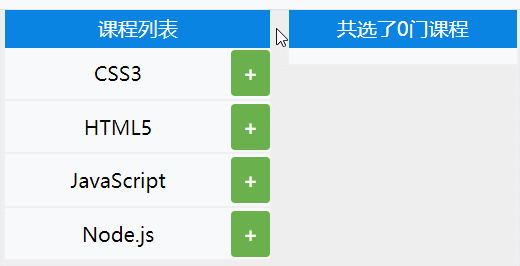

```
<style>
      * {
        margin: 0;
        padding: 0;
        box-sizing: border-box;
      }
      body {
        width: 100vw;
        height: 100vh;
        position: relative;
      }
      main {
        margin: 0 auto;
        width: 80%;
        height: 100%;
        display: flex;
        justify-content: space-around;
        align-items: center;
        background-color: #eee;
      }
      .left,
      .right {
        display: flex;
        flex-direction: column;
      }
      .left {
        width: 50%;
      }
      .right {
        width: 43%;
      }
      .l_top,
      .r_top {
        width: 100%;
        height: 30px;
        background-color: #0984e3;
        color: white;
        line-height: 30px;
        text-align: center;
      }
      ul,
      .listBox {
        width: 100%;
        flex: 1;
        display: flex;
        background-color: white;
      }
      .listBox {
        flex-wrap: wrap;
        padding: 5px;
        padding-bottom: 8px;
      }
      ul {
        flex-direction: column;
        list-style: none;
      }
      ul > li {
        flex: 1;
        display: grid;
        grid-template-columns: 85% 15%;
        text-align: center;
      }
      ul > li:nth-of-type(n + 2) {
        border-top: 2px solid #eee;
      }
      .txt {
        padding: 10px 0px;
      }
      .btn {
        display: flex;
        justify-content: center;
        align-items: center;
        border-radius: 3px;
        margin: 2px 0px;
        transition: 0.8s;
      }
      .delete {
        background-color: #eb4d4b;
      }
      .add {
        background-color: #6ab04c;
      }
      .delete::before {
        content: "-";
        font-weight: bold;
        color: #fff;
      }
      .add::before {
        content: "+";
        font-weight: bold;
        color: #fff;
      }
      .list_item {
        display: inline-block;
        padding: 3px 10px;
        border-radius: 3px;
        background-color: #00cec9;
        margin: 8px 5px 0px 3px;
        color: white;
      }
</style>

<body>
	<main>
      <div class="left">
        <div class="l_top">课程列表</div>
        <ul class="course">
          <li class="course_item">
            <span class="txt">CSS3</span><span class="btn add"></span>
          </li>
          <li class="course_item">
            <span class="txt">HTML5</span><span class="btn add"></span>
          </li>
          <li class="course_item">
            <span class="txt">JavaScript</span><span class="btn add"></span>
          </li>
          <li class="course_item">
            <span class="txt">Node.js</span><span class="btn add"></span>
          </li>
        </ul>
      </div>
      <div class="right">
        <div class="r_top">共选了<span class="count">0</span>门课程</div>
        <article class="listBox"></article>
      </div>
	</main>
</body>

<script>
      class Lesson {
        constructor() {
          this.course = document.querySelectorAll(".course_item");
          this.countDom = document.querySelector(".count");
          this.listBox = document.querySelector(".listBox");
          this.Wmap = new WeakMap();
          this.run();
        }
        run() {
          this.course.forEach((li, index) => {
            let btn = li.querySelector(".btn");

            btn.addEventListener("click", (e) => {
              let isSelect = btn.classList.contains("add");
              if (isSelect) {
                btn.classList.remove("add");
                btn.classList.add("delete");
                this.Wmap.set(li, true);
              } else {
                btn.classList.remove("delete");
                btn.classList.add("add");
                this.Wmap.delete(li);
              }
              this.UpDate();
            });
          });
        }
        UpDate() {
          this.listBox.innerHTML = "";
          let selectArr = [...this.course].filter((v) => this.Wmap.has(v));
          selectArr.forEach((li) => {
            let span = document.createElement("span");
            span.classList.add("list_item");
            span.innerText = li.querySelector(".txt").innerText;
            this.listBox.append(span);
          });
          this.newCount(selectArr.length);
        }
        newCount(newNum) {
          this.countDom.innerText = newNum;
        }
      }
      new Lesson();
</script>
```


## 函数进阶

​	函数是将复用的代码块封装起来的模块，在JS中函数还有其他语言所不具有的特性，接下来我们会详细掌握使用技巧。


### 声明定义

在JS中函数也是对象函数是`Function`类创建的实例，下面的例子可以方便理解函数是对象。

* `new Function(...argus,funcContent)`

```text
let fun = new Function("title", "type", "console.log(title,type)");
fun("Ashun", "Controller");
```

标准语法是：使用函数声明来定义函数

* `function funcName(argus){…funcContent}`

```text
function as(num) {
	return num+=2;
}
console.log(as(3));
```

对象字面量属性函数简写

```text
let user = {
  name: null,
  getName: function (name) {
  	return this.name;
  },
  //简写形式
  setName(value) {
  	this.name = value;
  }
}
user.setName('阿顺');
console.log(user.getName()); // 阿顺
```

普通形式定义的全局函数会声明在window对象中，这很危险，建议使用后面章节的模块处理

```text
function Ashun() {
	console.log("普通形式定义的全局函数，会追加到window中");
	console.log(window.Ashun);
}
Ashun();
```

再比如：当我们定义了 `screenX` 函数后就覆盖了window.screenX方法

```
console.log(window.screenX); 	//999
```

```text
function screenX() {
  return "阿顺";
}
console.log(window.screenX); 
```

使用`let/const`时不会压入window

* 注意：使用变量接收定义的函数时，整体为表达式，必须以`;`结尾，不然会报错。

```text
let func = function as() {
	return "Ashuntefannao.com";
};
console.log(window.func); //undefined
```


### 匿名函数

​	函数是对象，所以可以通过赋值，指向到函数对象的指针，当然指针也可以传递给其他变量，注意结尾要以`;`结束(整体为表达式)。下面使用函数表达式将 `匿名函数` 赋值给变量

```text
let as = function(num) {
  return num+=2;
};

console.log(as instanceof Object); //true

let tfn = as;
console.log(tfn(3));
```

标准声明的函数优先级更高，解析器会优先提取函数并放在代码树顶端，所以标准声明函数位置不限制，所以下面的代码可以正常执行。

```text
console.log(as(3));
function as(num) {
	return ++num;
};
```

标准声明优先级高于赋值声明

```text
console.log(as(3)); //4

function as(num) {
  return ++num;
}

var as = function() {
  return "as";
};
```

程序中使用匿名函数的情况非常普遍

```text
function sum(...args) {
  return args.reduce((a, b) => a + b);
}
console.log(sum(1, 2, 3));
```


### 函数提升

函数也会提升到前面，但优先级高于`var`变量

```text
var c = 1;
function c(c) {
    console.log(c);
    var c = 2;
}
c(3);	//TypeError: c is not a function
```

变量定义函数的形式，函数不会被提升

```text
console.log(as("Ashun"));	//Ashun 

function as(title) {
	return title;
}

var as = function () {
	return "ashun";
};
```

**小测试**

```
var c = 1;
function d() {
    console.log(c);
    var c = 2;
}
d();
```

```
var c = 1;
function d(c) {
    console.log(c);
    var c = 2;
}
d(3);
```

>* 其实第(1)个结果很快就答出来了:`undefined`
>
>原因: `var`定义变量(除函数)，会提升到当前作用域的最前面，因此打印undefined。
>
>* 但是第(2)个结果一开始我认为是undefined，但其实是`3`
>
>原因: 虽然也会变量提升，但是`若接收的参数与函数内部定义的变量名重复，并且该变量没有赋值，则该变量还为接收的参数`.
>
>```
>var c = 1;
>function d(c) {
>		var c;
>   console.log(c);
>}
>d(3);	//3
>```
>
>```
>var c = 1;
>function d(c) {
>   console.log(c);
>   var c = 2;
>   console.log(c);
>}
>d(3);	//3 2
>```
>
>

### 形参实参

形参是在函数声明时设置的参数，实参指在调用函数时传递的值。

- 形参数量大于实参时，没有传参的形参值为 undefined
- 实参数量大于形参时，多于的实参将忽略并不会报错

```text
// n1,n2 为形参
function sum(n1, n2) {
	return n1+n2;
}
// 参数 2,3 为实参
console.log(sum(2, 3)); //5
```

当没传递参数时值为undefined

```text
function sum(n1, n2) {
  return n1 + n2;
}
console.log(sum(2)); //NaN
```


---

### 默认参数

下面通过计算年平均销售额来体验以往默认参数的处理方式

```text
//total:总价 year:年数
function avg(total, year) {
  year = year || 1;
  return Math.round(total / year);
}
console.log(avg(2000, 3));
```

使用`ES6`默认参数方式如下

```text
function avg(total, year = 1) {
  return Math.round(total / year);
}
console.log(avg(2000, 3));
```

下面通过排序来体验新版默认参数的处理方式，下例中当不传递 type 参数时使用默认值 asc。

```text
function sortArray(arr, type = 'asc') {
	return arr.sort((a, b) => type == 'asc' ? a - b : b - a);
}
console.log(sortArray([1, 3, 2, 6], 'desc'));
```

默认参数要放在最后面

​	默认参数就是为了在使用者默认配置时不用传参，若默认参数放在前面，而非默认参数放在后面，则当使用者默认配置时，为了传递非默认参数，就需要把前面的默认参数都传递进去。

```text
//total:价格,discount:折扣,dis:折后折
function sum(total, discount = 0, dis = 0) {
  return total * (1 - discount) * (1 - dis);
}
console.log(sum(2000, undefined, 0.3));
```

### 立即执行

立即执行函数指函数定义时立即执行

- 可以用来定义私有作用域防止污染全局作用域

```text
"use strict";
(function () {
    var web = 'astfn.github.io';
})();
console.log(web); //web is not defined
```

使用 `let/const` 有块作用域特性，所以使用以下方式也可以产生私有作用域

```text
{
	let web = 'astfn.github.io';
}
console.log(web);
```


---

### Callback

函数可以做为参数传递，这也是大多数语言都支持的语法规则。

```text
<body>
    <button>订阅</button>
</body>
<script>
    document.querySelector('button').addEventListener('click', function () {
        alert('感谢订阅');
    })
</script>
```

函数可以做为参数传递

```text
function filterFun(item) {
	return item <= 3;
}
let arr = [1, 2, 3, 4, 5].filter(filterFun);
console.log(arr); //[1,2,3]
```


---

### arguments

arguments 是在函数内部获得所有参数集合的一个方式 ，下面是使用 `arguments` 求和的例子

* arguments是一种类数组的对象，属性名称依次为0~n，且包含callee和length属性，但其不是Array，所以不能够直接使用数组的方法，若要使用Array的方法，我们需要将其转化为数组，或借用数组原型的方法。

```text
function sum() {
  return [...arguments].reduce((total, num) => total += num , 0);
}
```

```
function sum() {
  return Array.from(arguments).reduce((total, num) => (total += num), 0);
}
```

```
function sum() {
  return Array.prototype.reduce.call(
    arguments,
    (pre, v) => (pre += v),
    0
  );
}
console.log(sum(1, 2, 3));	//6
```

更建议使用展示语法接收多个参数

```text
function sum(...args) {
 return args.reduce((a, b) => a + b);
}
console.log(sum(2, 3, 4, 2, 6)); //17
```


---

### 箭头函数

箭头函数是函数声明的简写形式，在使用递归调用、构造函数、事件处理器时不建议使用箭头函数。

无参数时使用空扩号即可

```text
let sum = () => {
	return 1 + 3;
}
console.log(sum()); //4
```

函数体为单一表达式时不需要 `return` 返回处理，系统会自动返回表达式计算结果。

```text
let sum = () => 1 + 3;
console.log(sum()); //4
```

多参数传递与普通声明函数一样使用逗号分隔

```text
let arr = [1, 8, 3, 5].filter((item, index) => {
	return item <= 3;
});
console.log(arr);
```

只有一个参数时可以省略括号

```text
let arr = [1, 8, 3, 5].filter(item => item <= 3);
console.log(arr);
```

> 有关箭头函数的作用域知识会在后面章节讨论


### 标签函数

之前在String的`标签模板`中已经介绍过了，使用`标签函数`，能够处理string中的`普通字符串、变量`。

使用函数来解析标签字符串，第一个参数是字符串值的数组，其余的参数为标签变量。

```text
function Ashun(str, ...argus) {
  console.log(str); //["", "-", "", raw: Array(3)]
  console.log(argus); //["ashun", "ashuntefannao.com"]
}
let name = 'ashun',url = 'ashuntefannao.com';
Ashun `${name}-${url}`;
```


---

### this指向

调用函数时 `this` 会隐式传递给函数指函数调用时的关联对象，也称之为函数的上下文。

* 独立存在的函数,this指向window
* 函数作为对象的方法，this指向该对象
* 箭头函数本身没有this指向，会使用父级作用域的this指向。


#### 函数调用

全局环境下`this`就是window对象的引用

```text
<script>
  console.log(this == window); //true
</script>
```

使用严格模式时在全局函数内`this`为`undefined`

```text
var as = "阿顺";
function get() {
	"use strict";
	console.log(this);	//undefined
	return this.as; 	
}
console.log(get());
//严格模式将产生错误  TypeError: Cannot read property 'as' of undefined
```


---

#### 对象方法

函数为对象的方法时`this` 指向该对象

可以使用多种方式创建对象，下面是使用构造函数创建对象

**构造函数**

函数当被 `new` 时即为构造函数，一般构造函数中包含属性与方法。函数中的上下文`指向到实例对象`。

- 构造函数主要用来生成对象，里面的this默认就是指当前对象

```text
function User() {
  this.name = "阿顺";
  this.say = function() {
    console.log(this); 			//User {name: "阿顺", say: ƒ}
    return this.name;
  };
}
let as = new User();
console.log(as.say()); 			//阿顺
```

**对象字面量**

- 下例中的as函数不属于对象方法所以指向`window`
- show属于对象方法执向 `obj`对象

```text
let obj = {
	site: "阿顺",
	show() {
		console.log(this.site); //阿顺
		console.log(`show method in :${this} 中`); //show method in :[object Object] 中
		function as() {
			console.log(`as function in : ${this} 中`); //as function in : [object Window] 中
		}
		as();
	},
};
obj.show();
```

在方法中使用函数时，有些函数可以改变this如`forEach、map…`第二个参数为执行上下文，当然也可以使用后面介绍的`apply/call/bind`，或者直接使用箭头函数。

```text
let Lesson = {
  site: "阿顺",
  lists: ["js", "css", "mysql"],
  show() {
    return this.lists.map(function(title) {
      return `${this.site}-${title}`;
    }, this);
  }
};
console.log(Lesson.show());
```

也可以在父作用域中定义引用`this`的变量

```text
let Lesson = {
    site: "阿顺",
    lists: ["js", "css", "mysql"],
    show() {
      const self = this;
      return this.lists.map(function(title) {
        return `${self.site}-${title}`;
      });
    }
  };
console.log(Lesson.show());
```


#### 箭头函数

箭头函数没有`this`, 也可以理解为箭头函数中的`this` 会继承定义函数时的上下文，可以理解为和外层函数指向同一个this。

- 如果想使用函数定义时的上下文中的this，那就使用箭头函数

下例中的匿名函数的执行环境为全局所以 `this` 指向 `window`。

```text
var name = 'ASHUN';
var obj = {
  name: 'ashun',
  getName: function () {
    return function () {
    	return this.name;
    }
  }
}
console.log(obj.getName()()); //返回window.name的值ASHUN
```

以往解决办法：会在父级函数(对象方法)中定义变量，保留this，然后在独立存在的函数中使用。

```text
var name = 'ASHUN';
var obj = {
  name: '阿顺',
  getName: function () {
    var self = this;
		return function () {
    	return self.name;
    }
  }
}
console.log(obj.getName()()); //阿顺
```

使用箭头函数后 `this` 为定义该函数的上下文，也可以理解为定义时父作用域中的`this`

```text
var name = 'ASHUN';
var obj = {
  name: '阿顺',
  getName: function () {
    return () => {
    	return this.name;
    }
  }
}
console.log(obj.getName()()); //阿顺
```

事件中使用箭头函数结果不是我们想要的

- 事件函数可理解为对象`onclick`设置值，所以函数声明时`this`为当前对象
- 但使用箭头函数时`this`为声明函数上下文

下面体验使用普通事件函数时`this`指向元素对象

使用普通函数时`this`为当前DOM对象

```text
<body>
  <button desc="ashun">button</button>
</body>
<script>
  let Dom = {
    site: "阿顺",
    bind() {
      const button = document.querySelector("button");
      button.addEventListener("click", function() {
        alert(this.getAttribute("desc"));
      });
    }
  };
  Dom.bind();
</script>
```

下面是使用箭头函数时this指向上下文对象，若想获取当前的DOM，可以通过`e.target|e.srcElement`

```text
<body>
  <button desc="ashun">button</button>
</body>
<script>
  let Dom = {
    site: "阿顺",
    bind() {
      const button = document.querySelector("button");
      button.addEventListener("click", event => {
        alert(this.site + event.target.innerHTML);
      });
    }
  };
  Dom.bind();
</script>
```

#### apply/call/bind

​	能够改变this指向，并传入参数，也可以理解为对象借用方法，就现像生活中向邻居借东西一样的事情。

##### 原理分析

构造函数中的`this`默认是一个空对象，然后构造函数处理后把这个空对象变得有值。再隐式的设置这个对象的原型。

```text
function User(name) {
  this.name = name;
}
let as = new User("阿顺");
```

可以改变构造函数中的空对象，即让构造函数this指向到另一个对象。传入参数初始化属性，再设置该对象的原型。就可以模仿`new 构造函数()`的过程。

```text
function User(name) {
	this.name = name;
}
let obj = {};
User.call(obj, "阿顺");
Object.setPrototypeOf(obj,User.prototype)
console.log(obj);
```


---

##### apply/call

call与apply 用于显示的设置函数的上下文，两个方法作用一样都是将对象绑定到this，只是在传递参数上有所不同。

- apply 用`数组`传参
- call 需要`分别`传参
- 与 bind 不同call/apply 会`立即执行`函数

语法使用介绍

```text
function show(title) {
    alert(`${title+this.name}`);
}
let zs = {
    name: '张三'
};
let lisi = {
    name: '李四'
};
show.call(zs, 'Ashun');
show.apply(lisi, ['SHUN']);
```

使用 `call` 设置函数上下文

```text
<body>
    <button message="阿顺">button</button>
    <button message="特烦恼">button</button>
</body>
<script>
    function show() {
        alert(this.getAttribute('message'));
    }
    let bts = document.getElementsByTagName('button');
    for (let i = 0; i < bts.length; i++) {
        bts[i].addEventListener('click', () => show.call(bts[i]));
    }
</script>
```

找数组中的数值最大值

```text
let arr = [1, 3, 2, 8];
console.log(Math.max(arr)); //NaN
console.log(Math.max.apply(Math, arr)); //8
console.log(Math.max.call(Math,...arr)); //8
console.log(Math.max(...arr)); //8
```

实现构造函数属性继承

* 下例相当于Article、Lesson，都继承了Request的get方法

```text
"use strict";

      function Request() {
        this.get = function (preset = {}) {
          let paramsTxt = Object.keys(preset)
            .map((key) => `${key}=${preset[key]}`)
            .join("&");

          return `${this.url}?${paramsTxt}`;
        };
      }
      
      //控制文章请求
      function Article() {
        this.url = "ashun/article/index.html";
        Request.call(this);
      }
      
      //控制课程请求
      function Lesson() {
        this.url = "ashun/course/index.html";
        Request.apply(this, []);
      }

      let articleReq = new Article();
      let lessonReq = new Lesson();
      console.log(articleReq.get({ name: "Ashun", type: "Controller" }));
      console.log(lessonReq.get({ row: 20, start: 999 }));
```

制作显示隐藏面板

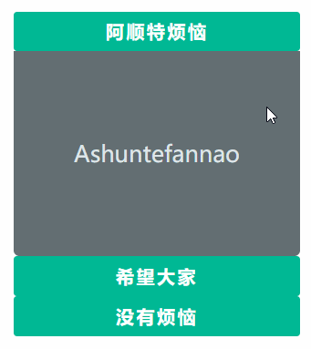

```
<style>
      * {
        margin: 0;
        padding: 0;
        box-sizing: border-box;
      }
      main {
        width: 100%;
        margin: 10px auto;
      }
      dl {
        width: 90%;
        margin: 0 auto;
        text-align: center;
      }
      dt,
      dd {
        width: 100%;
        display: flex;
        justify-content: center;
        align-items: center;
      }
      dt {
        height: 35px;
        background-color: #00b894;
        color: white;
        font-weight: bold;
        letter-spacing: 2px;
        border-radius: 3px;
        cursor: pointer;
      }
      dd {
        background-color: #636e72;
        color: #dfe6e9;
        font-size: 20px;
        border-radius: 0px 0px 5px 5px;
        transition: 0.3s;
        height: 0px;
        overflow: hidden;
      }
      .show {
        height: 180px;
      }
</style>
<body>
	<main>
      <dl>
        <dt>阿顺特烦恼</dt>
        <dd>Ashuntefannao</dd>
        <dt>希望大家</dt>
        <dd>Ashuntefannao</dd>
        <dt>没有烦恼</dt>
        <dd>Ashuntefannao</dd>
      </dl>
 	</main>
</body>
<script>
      function show(index) {
        let items = document.querySelectorAll("dd");
        items.forEach((v) => v.classList.remove("show"));
        items[index].classList.add("show");
      }
      let titles = document.querySelectorAll("dt");
      titles.forEach((ele, i) => {
        ele.addEventListener("click", () => {
          show.call(null, i);
        });
      });
</script>

```


---

##### bind

`bind(this,...args)`在使用形式上与call相同。bind是`复制函数行为`。

与call、apply的不同之处：

- bind绑定后，函数不会立即执行，需要被调用。

- 原理不同:

  - call、apply是在函数调用时改变this指向。
  - 使用 bind 绑定函数时，会生成一个新函数，新函数的函数体与被绑定函数一样，bind 是在`复制得到新函数时改变的this指向`。

  

bind是复制函数行为

```text
{
	let a = function () {};
	let c = a.bind();
	console.log(c);					//ƒ () {}
}
{
	let a = function () {};
	let c = a.call();
	console.log(c);					//undefined
}
{
	let a = function () {};
	let c = a.apply();
	console.log(c);					//undefined
}
```

绑定参数注意事项

```text
function sum(a, b) {
  return this.f + a + b;
}

//使用bind会生成新函数
let newFunc = sum.bind({ f: 1 }, 3);

//1+3+2 将2赋值给参数b即 a=3,b=2
console.log(newFunc(2));
```

在事件中使用`bind`

```text
<body>
  <button>阿顺</button>
</body>
<script>
  document.querySelector("button").addEventListener(
    "click",
    function(event) {
      console.log(event.target.innerHTML + this.url);
    }.bind({ url: "Ashuntefannao.com" })
  );
</script>
```

动态改变元素背景颜色，当然下面的例子也可以使用箭头函数处理


```
<style>
      * {
        margin: 0;
        padding: 0;
        box-sizing: border-box;
      }
      body {
        width: 100vw;
        height: 100vh;
        background-color: #e17055;
        color: rgba(255, 255, 255, 0.8);
        display: flex;
        justify-content: center;
        align-items: center;
        transition: 0.8s;
      }
</style>
<body>
    <h2>Ashuntefannao</h2>
</body>
<script>
      class Color {
        constructor(dom) {
          this.dom = dom;
          this.colors = [ "#fdcb6e","#55efc4","#00b894","#6c5ce7","#74b9ff","#e17055"];
          this.run();
        }
        run() {
          setInterval(
            function () {
              let random = Math.floor(Math.random() * this.colors.length);
              this.dom.style.backgroundColor = this.colors[random];
            }.bind(this),
            800
          );
        }
      }
      new Color(document.body);
</script>
```


## 作用域与闭包


### 作用域

作用域有三种:

* 全局作用域
* 函数作用域
* let\const 与 `{}` 形成的块级作用域

变量引用规则

* 编译器运行时会将变量定义在：当前所在的作用域
* 使用变量时会从当前作用域开始向上查找变量
* 作用域就像攀亲亲一样，晚辈总是可以向上辈要些东西
* 默认请况下：父级作用域不能够访问子级作用域的变量（使用闭包解决），但是子级作用域却可以访问祖先作用域的变量。


#### 使用规范

​	作用域链只向上查找，找到全局window即终止，应该尽量不要在全局作用域中添加变量。


函数被执行后其环境变量将从内存中删除。下面函数在每次执行后将删除函数内部的total变量。

```text
function count() {
  let total = 0;
}
count();
```

函数`每次调用`都会创建一个新作用域

```text
let site = '阿顺';

function a() {
  let as = 'ashuntefannao.com';

  function b() {
      let cms = 'Ashun.com';
      console.log(as);
      console.log(site);
  }
  b();
}
a();
```

如果子函数被外部(window作用域)使用时，父级环境将被保留，因此在全局作用域能够`间接访问`函数内的变量。这就是`闭包`的特性

```text
function as() {
  let n = 1;
  return function() {
    let b = 1;
    return function() {
      console.log(++n);
      console.log(++b);
    };
  };
}
let a = as()();
a(); //2,2
a(); //3,3
```

构造函数也是很好的环境例子，子函数被外部使用父级环境将被保留。

通过这两个例子可以发现，闭包可以保护某些变量，不被外部直接访问，而是让外部通过接口(子函数、方法)进行间接访问。

```text
function User() {
  let a = 1;
  this.show = function() {
    console.log(a++);
  };
}
let a = new User();
a.show(); //1
a.show(); //2
let b = new User();
b.show(); //1
```


----

#### let/const

使用 `let/const` 可以将变量声明在块作用域中（放在新的环境中，而不是全局中）

```text
{
	let a = 9;
}
console.log(a); //ReferenceError: a is not defined
if (true) {
	var i = 1;
}
console.log(i);//1
```

也可以通过下面的定时器函数来体验

```text
for (let i = 0; i < 10; i++) {
  setTimeout(() => {
    console.log(i);
  }, 500);
}
```

在 `for` 循环中使用`let/const` 会在每一次迭代中重新生成不同的变量

```text
let arr = [];
for (let i = 0; i < 10; i++) {
	arr.push((() => i));
}
console.log(arr[3]()); //3 如果使用var声明将是10
```

在没有`let/const` 的历史中使用以下方式产生作用域

```text
//自行构建闭包
var arr = [];
for (var i = 0; i < 10; i++) {
  (function (a) {
      arr.push(()=>a);
  })(i);
}
console.log(arr[3]()); //3
```


---

### 闭包

闭包指子函数可以访问外部作用域变量的函数特性，即使在子函数所在的作用域外也可以访问。如果没有闭包那么在处理事件绑定，异步请求时都会变得困难。

- 闭包一般在子函数本身作用域以外执行。
- 闭包一般的形式：函数套函数，在子函数中使用父级作用域的变量，将子函数return出去。
- 但闭包的形式并不是固定的，其本质是：**`当前作用域块存在对父级作用域块的引用`**


#### 基本示例

前面在讲作用域时已经在使用闭包特性了，下面再次重温一下闭包。

* 以下三例代码虽然形式不同，但都实现了内部作用域的变量，间接的让外部访问。

```
function first() {
	let a = 1;
	return function second() {
		return ++a;
	};
}

let func = first();
console.log(func());//2
console.log(func());//3
console.log(func());//4
```

```text
function first() {
	let a = 1;
	function second() {
		return ++a;
	}
	window.func = second;
}

first();
console.log(func());//2
console.log(func());//3
console.log(func());//4
```

```
let fuc;
function first() {
  let a = 0;
  fuc = function () {
    console.log(++a);
  };
}
first();
fuc();
fuc();
```

使用闭包返回数组区间元素

```text
let arr = [3, 2, 4, 1, 5, 6];
function between(a, b) {
  return function(v) {
    return v >= a && v <= b;
  };
}
console.log(arr.filter(between(3, 5)));
```

下面是在回调函数中使用闭包，当点击按钮时显示当前点击的是第几个按钮。

* 利用立即执行函数创建作用域，形成闭包

```text
<body>
  <button message="ashun">button</button>
  <button message="SHUN">button</button>
</body>
<script>
  var btns = document.querySelectorAll("button");
  for (let i = 0; i < btns.length; i++) {
    btns[i].onclick = (function(i) {
      return function() {
        alert(`点击了第${i + 1}个按钮`);
      };
    })(i);
  }
</script>
```

* 使用普通函数结合call\apply

```
……
var btns = document.querySelectorAll("button");
      for (let i = 0; i < btns.length; i++) {
        btns[i].onclick = function () {
          return function () {
            alert(`点击了第${i + 1}个按钮`);
          };
        }.call(btns[i], i);
      }
```


#### 移动动画

计时器中使用闭包来获取独有变量

```text
<body>
  <button message="阿顺">Ashun</button>
	<button message="阿顺特烦恼">Ashuntefannao</button>
</body>
<script>
 let btns = document.querySelectorAll("button");
      btns.forEach(function (elem) {
        let checked = false;
        let L = 0;
        elem.addEventListener("click", function () {
          !checked &&
            (checked = setInterval(function () {
              elem.style.marginLeft = ++L + "px";
            }, 40));
        });
      });
</script>
```


---

#### 闭包排序

下例使用闭包按指定字段排序

```text
let lessons = [
  {
    title: "媒体查询响应式布局",
    click: 89,
    price: 12
  },
  {
    title: "FLEX 弹性盒模型",
    click: 45,
    price: 120
  },
  {
    title: "GRID 栅格系统",
    click: 19,
    price: 67
  },
  {
    title: "盒子模型详解",
    click: 29,
    price: 300
  }
];
function order(field) {
  return (a, b) => (a[field] > b[field] ? 1 : -1);
}
console.table(lessons.sort(order("price")));
```


#### 内存泄漏

闭包特性中上级作用域会为函数保存数据，从而造成的如下所示的内存泄漏问题

```text
<body>
  <div desc="ashun">阿顺</div>
  <div desc="Ashuntefannao">阿顺特烦恼</div>
</body>
<script>
  let divs = document.querySelectorAll("div");
  divs.forEach(function(item) {
    item.addEventListener("click", function() {
      console.log(item.getAttribute("desc"));
    });
  });
</script>
```

下面通过清除不需要的数据解决内存泄漏问题

```text
let divs = document.querySelectorAll("div");
divs.forEach(function(item) {
  let desc = item.getAttribute("desc");
  item.addEventListener("click", function() {
    console.log(desc);
  });
  item = null;		//及时清空引用。
});
```


## 对象

### 基础知识

对象是包括属性与方法的数据类型，JS中大部分类型都是对象如 `String/Number/Math/RegExp/Date` 等等。

传统的函数编程会有错中复杂的依赖很容易创造意大利式面条代码。

**面向过程编程**

```text
let name = "阿顺";
let grade = [
  { lesson: "js", score: 99 },
  { lesson: "vue", score: 85 }
];
function average(grade, name) {
  const total = grade.reduce((t, a) => t + a.score, 0);
  return name + ":" + total / grade.length + "分";
}
console.log(average(grade, name));
```

**面向对象编程**

下面使用对象编程的代码结构清晰，也减少了函数的参数传递，也不用担心函数名的覆盖

```text
let user = {
  name: "阿顺",
  grade: [
    { lesson: "js", score: 99 },
    { lesson: "vue", score: 85 }
  ],
  average() {
    const total = this.grade.reduce((t, a) => t + a.score, 0);
    return this.name + ":" + total / this.grade.length + "分";
  }
};
console.log(user.average());
```


#### OOP

OOP：**Object Oriented Programming **

特点：封装、继承、抽象、多态

- 对象是属性和方法的集合即封装
- 将复杂功能隐藏在内部，只开放给外部少量方法，更改对象内部的复杂逻辑不会对外部调用造成影响即抽象
- 继承是通过代码复用减少冗余代码
- 根据不同形态的对象产生不同结果即多态


#### 基本声明

使用字面量形式声明对象是最简单的方式

```text
let obj = {
  name: '阿顺',
  getName:function() {
  	return this.name;
  }
}
console.log(obj.getName()); //阿顺
```

`ES6`属性与方法简写

```text
let name = "阿顺";
let obj = {
  name,
  get() {
    return this.name;
  }
};
console.log(obj.get()); //阿顺
```

其实字面量形式在系统内部也是使用构造函数 `new Object`创建的，后面会详细介绍构造函数。

```text
let as = {};
let Ashun = new Object();
console.log(as, Ashun);
console.log(as.constructor);
console.log(Ashun.constructor);
```


#### 属性方法

Object中包含属性和方法，属性用来标记Object的特点或状态，方法用来操作属性或完成其它功能。

定义在对象中的函数我们称为方法，下面定义了学生对象，并提供了计算平均成绩的方法。

```text
let ashun = {
  name: "阿顺",
  age: 21,
  grade: {
    math: 88,
    english: 67
  },
  //平均成绩
  avgGrade: function() {
    let total = 0;
    for (const key in this.grade) {
      total += this.grade[key];
    }
    return total / this.propertyCount("grade");
  },
  //获取属性数量
  propertyCount: function(property) {
		return Object.keys(this[property]).reduce((pre, val) => (pre += 1),0);
  }
};
console.log(ashun.avgGrade());
```

> 一个学生需要手动创建一个对象，设置对应的属性和方法，这显然是不实际的，后面章节构造函数就可以解决这个问题


---

#### 引用特性

对象和函数、数组一样是引用类型，即复制只会复制引用地址。

```text
let as = { name: "阿顺" };
let user = as;
user.name = "Ashun";
console.log(as.name); //Ashun
```

对象做为函数参数使用时也不会产生完全赋值，传递的依旧是内存地址，内外共用一个对象

```text
let user = { age: 15 };
function as(user) {
  user.age += 3;
}
as(user);
console.log(user.age); //18
```

`引用类型变量`之间的比较是对`内存地址`的比较所以使用 `==` 或 `===` 结果一样。

```text
let as = {};
let js = as;
let tfn = {};

console.log(as == js); //true
console.log(as === js); //true

console.log(as == tfn); //false
console.log(as === tfn); //false
```

###### Object.is(arg1,arg2)

该方法用于判断二者是否恒等，其中注意的是，`Object.is`方法在`===`的基础上，做了一些特殊情况的优化。具体来说就是+0和-0，NaN和NaN。

`0===-0`

```
console.log(-0 === 0); //true
console.log(Object.is(0, -0));//false
```

`NaN===NaN`

```
console.log(NaN == NaN); //false
console.log(NaN === NaN); //false
console.log(Object.is(NaN, NaN));//true
```

我们也可使用全局静态方法`isNaN`进行判断

```
let a= 1 / "s"
console.log(isNaN(a)); //true
```


---

#### this

`this` 指当前对象的引用，始终建议在代码内部使用`this` 而不要使用对象名，不同对象的this只指向当前对象。

下例是不使用 `this` 时发生错误的场景

- 删除了`as` 变量，但在函数体内还在使用`as`变量造成错误
- 使用 `this` 后，始终指向到当前引用地址，就不会有这个问题

```text
let as = {
	name: "阿顺",
	show() {
		return as.name;
	},
};
let user = as;
as = null;
console.log(user.show()); //TypeError: Cannot read property 'name' of null
```

改用`this` 后一切正常

```text
let as = {
	name: "阿顺",
	show() {
		return this.name;
	},
};
let user = as;
as = null;
console.log(user.show());	//阿顺
```


#### 展开语法

使用`...`可以将对象的各个属性展开。

```
function upload(params) {
  let config = {
    type: "*.jpeg,*.png",
    size: 10000
  };
  params = { ...config, ...params };	//传参覆盖默认值
  console.log(params);
}
upload({ size: 999 });
```

`...`用作收集时，还是用数组形式`[]`包裹

```
let as = { name: "ashun" };
function test(...obj) {
		console.log(obj);
}
test(as);	//[{…}]
```


---

### 对象转换

##### 基础知识

对象直接参与计算时，系统会根据计算的场景在 `string/number/default` 间转换。

- 如果声明需要字符串类型，调用顺序为 `toString > valueOf`
- 如果场景需要数值类型，调用顺序为 `valueOf > toString`
- 声明不确定时使用 `default` ，大部分对象的 `default` 会当数值使用
- 若对象中同时定义了`Symbol.toPrimitive`方法，则会优先执行其中对数据类型转化的处理

下面的数值对象会在数学运算时转换为 `number`

```text
let ashun = new Number(1);
console.log(ashun + 5); //6
```

如果参数字符串运长时会转换为 `string`

```text
let ashun = new Number(1);
console.log(ashun + "5"); //15
```

下面当不确定转换声明时使用 `default` ，大部分`default`转换使用 `number` 转换。

```text
let ashun = new Number(1);
console.log(ashun == "1"); //true
```


##### Symbol.toPrimitive

内部自定义`Symbol.toPrimitive`方法用来处理所有的转换场景

`Symbol.toPrimitive` 是一个内置的 Symbol 值，它是作为对象的函数值属性存在的，当一个对象转换为对应的原始值时，会调用此函数。

```
let as = {
	num: 1,
	str: "ashun",
	[Symbol.toPrimitive]: function (hint) {
		if (hint == "number") return this.num;
		if (hint == "string") return this.str;
	},
};

console.log(+as); //1
console.log(String(as)); //ashun
```

```text
let as = {
  num: 1,
  [Symbol.toPrimitive]: function() {
    return this.num;
  }
};
console.log(as+ 1); //2
console.log(as+"1")	//11
```


##### valueOf/toString

可以自定义`valueOf` 与 `toString` 方法用来转换，转换并不限制返回类型。

下例能验证:

- 如果声明需要字符串类型，调用顺序为 `toString > valueOf`
- 如果场景需要数值类型，调用顺序为 `valueOf > toString`

```text
let as = {
  name: "Ashun",
  num: 1,
  valueOf: function() {
    console.log("valueOf");
    return this.num;
  },
  toString: function() {
    console.log("toString");
    return this.name;
  }
};
console.log(as + 5); //valueOf 4
console.log(`${as}阿顺`); //toString Ashun阿顺
```

若对象中在定义`toString/valueOf`方法的同时，又定义了`Symbol.toPrimitive`方法，则会优先执行其中对数据类型转化的处理

```
let obj = {
  value: 123,
  name: "Ashun",
  toString() {
    return this.name;
  },
  valueOf() {
    return this.value;
  },
  [Symbol.toPrimitive]: function (hint) {
    if (hint == "string") return "Ashuntefannao";
    if (hint == "number") return 7;
  },
};
console.log(String(obj)); //Ashuntefannao
console.log(++obj);   //8
```


##### `==`与`===`

对于==与===，我们已经不陌生了，==判定的是等式两边的值是否相同，但===是严格等于，不仅要求值相等，还要满足类型相同。

但是对于使用==判断时，对于不同的场景，也涉及到了类型的转换

* 等式两边类型相同，就比较值的大小

```
console.log(1 == 2) //false
console.log("abc" == "abc") //true
```

* 等式两边为`null`|`undefined`时，返回`true`
  * aa已定义，但是未赋值，为`null`
  * 由于`null==undefined`得`aa == undefined`

```
let aa;
console.log(aa == null);
console.log(aa == undefined);
console.log(null == undefined);
```

* 其中一方为Number，则会先转化为Number再比较

```
let obj = {
  value: 123,
  name: "Ashun",
  toString() {
    return this.name;
  },
  valueOf() {
    return this.value;
  },
};

console.log(obj == 123);
console.log(1 == true);
console.log(1 == "1");
```

* 判断其中一方是否是Boolean，是的话就把Boolean转换成Number，再进行比较

```
let obj = {
  value: 1,
  name: "Ashun",
  toString() {
    return this.name;
  },
  valueOf() {
    return this.value;
  },
};

console.log(true == obj);
```

###### 如何让if(a == 1 && a == 2)条件成立？

其实就是上一个问题的应用，利用类型转化的过程，在其中做操作

```text
let a = {
  num: 1,
  valueOf() {
    return this.num++;
  },
};
console.log(a == 1 && a == 2);
```


---

### 解构赋值

解构是一种更简洁的赋值特性，可以理解为分解一个数据的结构，在数组章节已经介绍过。

- 建设使用 `var/let/const` 声明

#### 基本使用

下面是基本使用语法

```text
{
	let info = { name: "阿顺", site: "Ashuntefannao.com" };
	let { name: n, site: u } = info;
	console.log(n, u); // 阿顺 Ashuntefannao.com
}

{
//如果属性名与变量相同可以省略属性定义`ES6简写形式`。
	let info = { name: "阿顺", site: "Ashuntefannao.com" };
	let { name } = info;
	console.log(name); // 阿顺
}
```

函数返回值直接解构到变量

```text
function user({ name, type }) {
	console.log(name, type);
}

let as = { name: "Ashun", type: "Controller" };
user(as);
```

系统函数解构练习，这没有什么意义只是加深解构印象

```text
const {random,min,max} =Math;
console.log(random,max);
```

可以直接使用变量赋值对象属性

```text
let name = "阿顺",url = "Ashuntefannao.com";
//标准写法如下
{
	let as = { name: name, url: url };
	console.log(as);  //{name: "阿顺", url: "Ashuntefannao.com"}
}

//ES6简写形式
{
	let as = { name, url };
	console.log(as); //{name: "阿顺", url: "Ashuntefannao.com"}
}

```


#### 嵌套解构

可以操作多层复杂数据结构

```text
const as = {
  name:'阿顺',
  lessons:{
    title:'JS'
  }
}
const {name,lessons:{title}}  = as;
console.log(name,title); //阿顺 JS
```


---

#### 严格模式

非严格模式可以不使用声明指令，严格模式下必须使用声明。所以建议使用 let 等声明。

```text
// "use strict";
({ name, url } = { name: "阿顺", url: "Ashuntefannao.com" });
console.log(name, url);
```

还是建议使用`let`等赋值声明

```text
"use strict";
let { name, url } = { name: "阿顺", url: "Ashuntefannao.com" };
console.log(name, url);
```


---

#### 默认值

为变量设置默认值

```text
let [Name, site = "Ashuntefannao.com"] = ["阿顺"];
console.log(site); //Ashuntefannao.com

let { name, url, type = "Controller" } = {
	name: "阿顺",
	url: "Ashuntefannao.com",
};
console.log(type); //Controller
```

使用默认值特性可以方便的对参数预设

```text
function createElement(options) {
	let {
		name = "div",
		width = "200px",
		height = "100px",
		backgroundColor = "red",
	} = options;

	const dom = document.createElement(name);
	dom.style.width = width;
	dom.style.height = height;
	dom.style.backgroundColor = backgroundColor;
	document.body.appendChild(dom);
}
createElement({
backgroundColor: "green",
});
```

也可使用`展开语法`或`Object.assign`，将默认obj与传入的options合并。（`Object.assign`后面章节会详细介绍）

```
function createElement(options) {
	let preset = {
		name: "div",
		width: "200px",
		height: "100px",
		backgroundColor: "red",
	};
	preset = Object.assign(preset, options);
	//preset = { ...preset, ...options };
	const dom = document.createElement(preset.name);
	for (const key in preset) {
		key != "name" && (dom.style[key] = preset[key]);
	}
	document.body.appendChild(dom);
}
createElement({
	backgroundColor: "#16a085",
});
```


#### 函数参数

---

数组参数的使用

```text
function as([a, b]) {
	console.log(a, b);
}
as(['阿顺', 'SHUN']);
```

对象参数使用方法

```text
function getUser({name,url,type='Controller'}) {
	console.log(name,url,type);
}
getUser({name:'阿顺',url:'Ashuntefannao.com'}); //阿顺 Ashuntefannao.com Controller
```

对象解构传参

```text
function user(name, { sex, age } = {}) {
  console.log(name, sex, age); //阿顺 男 18
}
user("阿顺", { sex: "男", age: 18 });
```


### 操作属性


##### 属性名称

`对象的属性名类型为:String`

对象的属性名最终都会转为`字符串`

```text
let obj = { 1: "ashun", "1": "Ashuntefannao" };
console.table(obj); //{1:"Ashuntefannao"}
```

使用对象做为键名时，也会将对象转为字符串后使用

```text
let obj = { 1: "ashun", "1": "Ashuntefannao" };

let as = { [obj]: "阿顺" };
console.table(as);

console.log(as[obj.toString()]);
console.log(as["[object Object]"]);
```

---

##### 添加属性

* `obj.prop`
* `obj[prop]`
  * 当属性名称：不合法时、为变量时，可通过`[prop]`进行设置。
* `Object.defineProperty(obj,prop,{desc…})`
  * 设置属性的描述，若该属性不存在，则添加该属性到obj上。

```
let user = {};

user.name = "Ashun";
user["user-type"] = "Controller";
let like = "like";
user[like] = "javascript";

Object.defineProperty(user, "age", {
	value: 18,
	writable: true,
	enumerable: true,
	configurable: true,
});
console.log(user);

//{name: "Ashun", user-type: "Controller", like: "javascript", age: 18}
```


##### 删除属性

`delete obj.prop`

```
let user = {};

user.name = "Ashun";
user["user-type"] = "Controller";
let like = "like";
user[like] = "javascript";

Object.defineProperty(user, "age", {
	value: 18,
	writable: true,
	enumerable: true,
	configurable: true,
});

for (const key of Object.keys(user)) {
		key !== "name" && delete user[key];
}
console.log(user);	//{name:"Ashun"}
```


##### 修改属性

* 在访问某属性的同时，赋值即可
  * `obj.prop=value`
  * `obj[prop]=value`
* `Object.defineProperty(obj,propName,{…desc})`


```
let type="type";
let user = {
	name: "defult",
	age: "18",
	[type]: "user",
};
user.name = "Ashun";
user[type] = "Controller";
console.log(user);	//{name: "Ashun", age: "18", type: "Controller"}
```

```
let user = {
	name: "Ashun",
	age: "18",
	type: "user",
};
Object.defineProperty(user, "type", {
	value: "Controller",
	writable: true,
	enumerable: true,
	configurable: true,
});
console.log(user.type); //Controller
```


##### 检测属性

###### hasOwnProperty

`obj.hasOwnProperty(prop)`检测对象`自身`是否包含指定的属性，`不检测原型链上继承的属性`。

```text
let obj = { name: '阿顺'};
console.log(obj.hasOwnProperty('name')); //true
```

不检测原型链上继承的属性

```text
{
	let arr = ["阿顺"];
	console.log(arr.hasOwnProperty("length")); //true
	console.log(arr.hasOwnProperty("concat")); //false
}

{
	let Admin={type:"Controler"}
	let as={name:"阿顺",age:18};
	as.__proto__=Admin;
	console.log(as.hasOwnProperty("age"))//true
	console.log(as.type);	//Controler
	console.log(as.hasOwnProperty("type"))//false
}
```


###### in

`prop in obj` 使用`in`关键字，能够判断某属性是否在obj`本身或原型链上`。

```
let as = { name: "阿顺" };
let site = {
	web: "Ashuntefannao.com",
};

//设置site为as的新原型
Object.setPrototypeOf(as, site);
// as.__proto__ = site;
console.dir(as);

console.log("name" in as); //true
console.log("web" in as); //true
console.log(as.hasOwnProperty("web")); //false
```


---

##### 获取属性名

###### 获取普通属性

以下方式只能够获取普通属性，不能够获取属性名为Symbol类型的属性。

* `for/in`
* `Object.getOwnPropertyNames(obj)`
* `Object.keys(obj)`


使用`Object的静态方法`或`Reflect`获得的属性名称，都是某**obj本身的prop**，如果使用`for/in`会遍历到`原型上`的普通属性。

```
let Admin = { type: "Controller" ,[Symbol("Admin")]: "Admin"};
let as = { name: "阿顺", age: 18, [Symbol("as")]: "ashun" };
Object.setPrototypeOf(as, Admin);

for (const key in as) console.log(key);	//name age type

console.log(Object.getOwnPropertyNames(as));		 	//["name","age"]
console.log(Object.keys(as));										 	//["name","age"]
console.log(Object.getOwnPropertySymbols(as));		//[Symbol(as)]
console.log(Reflect.ownKeys(as));									//["name", "age", Symbol(as)]
```

当我们使用ES6的`class`声明构造函数时，就不用考虑`for/in`循环遍历原型属性的问题了

* 内部默认严格模式
* class声明的方法自动添加到原型链，且自动设置各个方法的属性特征描述为`enumerable:false`

```
class Person {
          constructor(options) {
            for (let [key, val] of Object.entries(options)) {
              this[key] = val;
            }
          }
          show() {
            return this.name;
          }
 				}
let p1 = new Person({ name: "Ashun", age: 18, type: "Controller" });
console.log(Object.keys(p1)); ["name","age","type"]
for (let key in p1) {
	console.log(key);		//name,age,type	而没有show
}
```


---

###### 获取Symbol

* `getOwnPropertySymbols` 该方法`只返回`属性名称类型为Symbol的属性名。

```
let as = { name: "阿顺", age: 18, [Symbol()]: "ashun" };
console.log(Object.getOwnPropertySymbols(as)); //[Symbol()]
```


---

###### 获取所有属性

* `Reflect.ownKeys`，该方法能够返回所有类型的属性名，包括Symbol。

```
let as = { name: "阿顺", age: 18, [Symbol()]: "ashun" };
console.log(Reflect.ownKeys(as));	//["name", "age", Symbol()]
```


##### 获取属性值

###### 普通访问

* `obj.prop`
* `obj[prop]`

###### 查看描述

* `Object.getOwnPropertyDescriptors(obj)`
* `Object.getOwnPropertyDescriptor(obj,"propName")`

```
let Admin = { type: "Controller", [Symbol("Admin")]: "Admin" };
let as = { name: "阿顺", age: 18, [Symbol("as")]: "ashun" };
Object.setPrototypeOf(as, Admin);

console.log(as.type); //Controller
console.log(as["age"]); //18

console.log(Object.getOwnPropertyDescriptor(as, "name"));
//{value: "阿顺", writable: true, enumerable: true, configurable: true}
console.log(Object.getOwnPropertyDescriptors(as));
//{name: {…}, age: {…}, Symbol(as): {…}}
```


##### assign

使用 `Object.assign()` 静态方法，能够将多个Object的属性值进行合并。当prop的值为非引用类型时，可以用来做深拷贝。

从一个或多个对象复制属性

```text
"use strict";

let as = { a: 1, b: 2 };
as = Object.assign(as, { a: 3 }, { m: 9 });
console.log(as); 	//{a: 3, b: 2, m: 9}
```

可以让传递的参数覆盖默认值

```
function test(options) {
		let preset = {
			name: "default",
			age: 18,
			type: "user",
		};
		return (preset = Object.assign(preset, options));
}
console.log(test({ name: "Ashun", type: "Controller" }));
//{name: "Ashun", age: 18, type: "Controller"}
```


##### 传址操作

对象是引用类型赋值是传址操作，后面会介绍对象的深、浅拷贝操作

```text
let user = {
	name: '阿顺'
};
let as = {
	stu: user
};
as.stu.name = 'Ashun';
console.log(user.name);//Ashun
```


##### 计算属性

对象属性可以通过`表达式计算`定义，这在动态设置属性或执行属性方法时很好用。

```text
let id = 0;
const user = {
  [`id-${id++}`]: id,
  [`id-${id++}`]: id,
  [`id-${id++}`]: id
};
console.log(user);
```

使用计算属性为文章定义键名

```text
const lessons = [
  {
    title: "媒体查询响应式布局",
    category: "css"
  },
  {
    title: "FLEX 弹性盒模型",
    category: "css"
  },
  {
    title: "MYSQL多表查询随意操作",
    category: "mysql"
  }
];
let lessonObj = lessons.reduce((obj, cur, index) => {
  obj[`${cur["category"]}-${index}`] = cur;
  return obj;
}, {});
console.log(lessonObj); //{css-0: {…}, css-1: {…}, mysql-2: {…}}
console.log(lessonObj["css-1"]); //{title: "FLEX 弹性盒模型", category: "css"}
```


---

### 遍历对象

#### 迭代器

可以使用系统提供的迭代器API，迭代遍历Object。

这些方法，只能够得到：**对象本身的、可枚举的属性**

* `Object.keys(obj)`
* `Object.values(obj)`
* `Object.entries(obj)`

```
let as = { name: "阿顺", age: 18, [Symbol("as")]: "ashun" };
console.log(Object.keys(as));			//["name", "age"]
console.log(Object.values(as));		//["阿顺", 18]
console.log(Object.entries(as));	//[["name","阿顺"], ["age",18]]
```


----

#### 循环遍历

之前已经接触过了Object的循环遍历。

* 可使用`for/in`遍历Keys (但会遍历到原型上的属性)
* 不能直接使用`for/of`遍历Object
  * 由于系统内部没有为Object提供`for/of`遍历的接口 (Object不可迭代)（遍历Object的属性值，应该由用户决定），所以不能够直接使用`for/of`遍历。
  * 但是`for/of`可以结合迭代器，对Object进行遍历。（内置迭代方法，返回的是可迭代数据类型，所以可以使用`for/of`进行遍历）

##### for/in

```
let as = { name: "阿顺", age: 18, [Symbol("as")]: "ashun" };
for (const key in as) {
	console.log(key,as[key]);
}
// name ashun
//age 18
```


##### for/of

结合`Object.keys()`遍历属性

```
let as = { name: "阿顺", age: 18, [Symbol("as")]: "ashun" };
for (const key of Object.keys(as)) {
	console.log(key, as[key]);
}
//name 阿顺
//age 18
```

结合`Object.values()`遍历值

```
……
for (const val of Object.values(as)) {
  console.log(val);
}
//阿顺 18
```

结合`Object.entries()`同时获取key、value

```
……
for (const [key, val] of Object.entries(as)) {
	console.log(key, val);
}
//name 阿顺
//age 18
```

添加元素DOM练习

```text
let lessons = [
  { name: "js", click: 23 },
  { name: "node", click: 192 }
];
let ul = document.createElement("ul");
for (const val of lessons) {
  let li = document.createElement("li");
  li.innerHTML = `课程:${val.name},点击数:${val.click}`;
  ul.appendChild(li);
}
document.body.appendChild(ul);
```


---

### 拷贝对象

* 深浅拷贝一般只考虑引用类型，因为引用类型有传址的概念。

  * 浅拷贝：直接赋值，赋予的是引用类型的地址，新旧变量引用同一个内存空间
  * 深拷贝：通过一些操作，让新变量只是copy引用类型数据的值，而不是地址，深拷贝过后，新旧变量只是内容相同，内存地址不同。

* 非引用类型的赋值、合并操作都是深拷贝，因为非引用类型是传值。

  

#### 浅拷贝

简单的赋值、合并都是浅拷贝。

* 遍历赋值
* `Object.assign()`
* 展开语法`...`


使用`for/in`执行对象浅拷贝

* obj.user为引用类型，直接赋值传址

```
let obj = { user: { name: "ASHUN" } };

let as = {};
for (const key in obj) {
	as[key] = obj[key];  
}

as.user.name = "shun";
console.log(obj.user.name); //shun
```


`Object.assign` 函数可简单的实现浅拷贝，它是将两个或多个对象的属性叠加后，追加到前面的对象中，后面的对象属性会覆盖前面对象的同名属性。

```
let a = { user: { name: "Ashun" , type: "Controller"} };
let b = { user: { name: "SHUN" } };
let c = { user: { name: "shun" } };

Object.assign(a, b, c);
console.log(a); 	//{user:{name: "shun"}
```

```
……
let newobj = {};
newobj["user"] = Object.assign(a.user, b.user, c.user);
console.log(newobj.user);	//{name: "shun", type: "Controller"}
newobj.user.name = "SHUN";
console.log(a.user.name); // SHUN
```

非引用类型深拷贝

```
let user = {
	name: "阿顺",
};
let as = {
	stu: Object.assign({}, user),
};
as.stu.name = "Ashun";
console.log(user.name); //阿顺
```


使用展示语法`...`也可以实现浅拷贝

```
let a = { user: { name: "Ashun", type: "Controller" } };
let b = { user: { name: "SHUN" } };
let c = { user: { name: "shun" } };

a = { ...a, ...b, ...c };
console.log(a); //{user:{name: "shun"}
```

非引用类型为深拷贝。

```text
let obj = {
	name: "阿顺",
};
let as = { ...obj };
as.name = "ashun";

console.log(obj.name); //阿顺
```


---

#### 深拷贝

**深拷贝**是完全的复制一个对象，两个对象是完全独立的对象，新旧对象仅仅是内容相同，两个对象的内存地址不同。

深拷贝方式：

* 递归深入层级，进行数据深拷贝
* `JSON.parse(JSON.stringify(obj))`
  * 该方式缺点: 不能拷贝obj中的method、属性值为undefined的属性。

浅拷贝不会将深层的非引用类型数据复制

```text
let obj = {
	name: "阿顺",
	user: {
		name: "SHUN",
	}
};

function copy(object) {
	let obj = {};
	for (const key in object) {
		obj[key] = object[key];
	}
	return obj;
}

let newObj = copy(obj);
newObj.user.name = "Ashuntefannao.com";
console.log(obj.user.name);//Ashuntefannao.com
```


**递归深入层级，进行数据的深拷贝**。

```
function copy(obj) {
	let newObj = obj instanceof Array ? [] : {};
	for (const key in obj) {
		newObj[key] = typeof obj[key] == "object" ? copy(obj[key]) : obj;
	}
	return newObj;
}

let obj = { 
	user: { name: "Ashun", Array: [1, 2, 3] },
  test() {},
  type:undefined 
};
let newobj = copy(obj);
newobj.user.name = "ASHUN";
newobj.user.Array = {};
newobj.test = {};
console.log(obj);
console.log(newobj);
```

**`JSON.parse(JSON.stringify(obj))`**

* 不能拷贝method
* 不能拷贝属性值为undefined的属性。

```
function copy(obj) {
	return JSON.parse(JSON.stringify(obj));
}
let obj = { 
	user: { name: "Ashun", Array: [1, 2, 3] },
  test() {},
  type:undefined 
};
let newobj = copy(obj);
newobj.user.name = "SHUN";
newobj.user.Array = {};
console.log(obj);
console.log(newobj);
```


---

### 构建函数

对象可以通过`自定义工厂函数`和`内置构造函数`或`自定义的构造函数`创建。

#### 工厂函数

在函数中`返回对象`的函数称为工厂函数，工厂函数有以下优点

- 减少重复创建相同类型对象的代码
- 修改工厂函数的方法影响所有同类对象


使用字面量创建对象需要复制属性与方法结构

```text
const as = {
  name: "阿顺",
  show() {
    console.log(this.name);
  }
};
const shun = {
  name: "SHUN",
  show() {
    console.log(this.name);
  }
};
```

使用工厂函数可以简化这个过程

```text
function stu(name) {
  return {
    name,
    show() {
      console.log(this.name);
    }
  };
}
const as = stu("阿顺");
as.show();
const shun = stu("SHUN");
shun.show();
```


---

#### 构造函数

和工厂函数相似构造函数也用于`创建对象`，它的上下文为新的对象实例。

- 命名规范：构造函数名每个单词首字母大写即`Pascal` 
- `this`指当前创建的对象
- 不需要返回`this`系统会自动完成
- 需要使用`new`关键词生成对象

```text
function Student(name) {
  this.name = name;
  this.show = function() {
    console.log(this.name);
  };
  //不需要返回，系统会自动返回
  // return this;
}
const ashun = new Student("阿顺");
ashun.show();
const shun = new Student("SHUN");
shun.show();
```

如果构造函数返回对象，通过new构造函数实例化后的对象就是返回的对象。

```text
function ArrayObject(...values) {
  const arr = new Array();
  arr.push.apply(arr, values);
  arr.string = function(sym = "|") {
    return this.join(sym);
  };
  return arr;
}
const array = new ArrayObject(1, 2, 3);
console.log(array);
console.log(array.string("-"));
```

##### 原理分析

构造函数中的`this`默认是一个空对象，然后构造函数处理后把这个空对象变得有值。

```text
function User(name) {
  this.name = name;
}
let as = new User("阿顺");
```

构造函数的实例化过程，相当于创建一个空对象，并为其赋予属性。然后再隐式设置这个对象的原型。

可以改变构造函数中的空对象，即让构造函数this指向到另一个对象。再为这个对象设置原型即可。

```
function User(name) {
	this.name = name;
}
let obj = {};
User.call(obj, "阿顺");
Object.setPrototypeOf(obj,User.prototype)
console.log(obj);
```


---

#### 严格模式

在严格模式下`独立存在的函数`中的`this`值为undefined，这是为了防止无意的修改window对象

注意: 

* 这里考虑的this，是构造函数生成对象的`方法中出现的this`。(下例中的show方法)
* 不是考虑构造函数中的this，因为构造函数虽然也是独立存在的函数，但是在使用`new`实例化后，其中的this会自动指向当前的实例。

```text
"use strict";
function User() {
  this.show = function() {
    console.log(this);
  };
}
let as = new User();
as.show(); //User

let show = as.show;		//让as.show函数体在全局执行,在严格模式下,其中的this为undefined
show(); //undefined
```

将函数体改为箭头函数`()=>{}`能够解决。因为箭头函数没有自身的this指向，会自动继承上下文的this。在通过new构造函数实例化时，里面的this已经绑定到了当前实例。

```
"use strict";
function User() {
  this.show = ()=> {
    console.log(this);
  };
}
let as = new User();
as.show(); //User

let show = as.show;
show(); //User
```


---

#### 内置构造

JS中大部分数据类型都是通过构造函数创建的。

```text
const num = new Number(99);
console.log(num.valueOf());

const string = new String("阿顺特烦恼");
console.log(string.valueOf());

const boolean = new Boolean(true);
console.log(boolean.valueOf());

const date = new Date();
console.log(date.valueOf());

const regexp = new RegExp("\\d+");
console.log(regexp.test(99));	//true

let as= new Object();
as.name = "阿顺";
console.log(as);
```

字面量创建的对象，内部也是调用了`Object`构造函数

```text
//字面量创建对象
const as = {
	name: "阿顺",
};
console.log(as.constructor); //ƒ Object() { [native code] }

//构造函数创建对象
const ashun = new Object();
ashun.title = "Ashuntefannao";
console.log(ashun.constructor); //ƒ Object() { [native code] }
```


---

#### 函数对象

在`JS`中函数也是一个对象

```text
function as(name) {}

console.log(as.toString());
console.log(as.length);
```

函数是由系统内置的 `Function` 构造函数创建的

```text
function as(name) {}

console.log(as.constructor);
```

下面是使用内置构造函数创建的函数

```text
const User = new Function(`name`,`
  this.name = name;
  this.show = function() {
    return this.name;
  };
`
);

const zs = new User("张三");
console.log(zs.show());
```


---

### 抽象特性

将复杂功能隐藏在内部，只开放给外部少量方法，更改对象内部的复杂逻辑不会对外部调用造成影响即抽象。

下面的手机就是抽象的好例子，只开放几个按钮给用户，复杂的工作封装在手机内部，程序也应该如此。

​	【引用图片】


#### 问题分析

下例将对象属性封装到构造函数内部

```text
function User(name,type="user"){
	this.name=name;
	this.type=type;
	this.info=()=>{
		return this.type=="Controller"?`管理员`:`普通用户`;
	}	
	this.show=()=>{
		return `${name} 是 ${this.info()}`	
	}		
}

let as=new User("ashun","Controller");
console.log( as.show())
let lisi=new User("lisi");
console.log(lisi.show())
```

####　抽象封装

上例中的方法和属性仍然可以在外部访问到，但是为了实现抽象和数据的安全性，有些属性和方法不需要被外部访问，比如 `info`方法只是在内部使用，不需要被外部访问到，若外部访问修改，这会破坏程序的内部逻辑。

* 将不需要暴露的属性、方法，使用普通声明形式，而不是追加到this（实例）上。

```text
function User(name,type="user"){
	let data={name,type};
	let info=()=>{
		return data.type=="Controller"?`管理员`:`普通用户`;
	}	
	 this.show=()=>{
		return `${data.name} 是 ${info()}`	
	}
		
}
let as=new User("ashun","Controller");
console.log( as.show())
let lisi=new User("lisi");
console.log(lisi.show());
console.log(lisi.info)//undefined
```

### 属性特征

JS中可以对属性的特性进行访问和控制。

####　查看特征

* `Object.getOwnPropertyDescriptor(obj,"prop")`
* `Object.getOwnPropertyDescriptors(obj)`

使用 `Object.getOwnPropertyDescriptor`查看对象属性的描述。

```text
"use strict";
const as={
	name:"ashun",
	age:18,
	type:"Controller"	
};
console.log(JSON.stringify(Object.getOwnPropertyDescriptor(as,"type"),null,2));
```

使用 `Object.getOwnPropertyDescriptors`查看对象所有属性的描述

```text
"use strict";
const as={
	name:"ashun",
	age:18,
	type:"Controller"	
};
let desc = Object.getOwnPropertyDescriptors(as);
console.log(JSON.stringify(desc, null, 2));
```

属性包括以下四种特性

| 特性         | 说明                                                     | 默认值    |
| ------------ | -------------------------------------------------------- | --------- |
| configurable | 是否可删除该属性、是否可以再次配置属性描述特征           | true      |
| enumerable   | (是否可枚举)对象属性是否可通过for-in循环，或迭代方法读取 | true      |
| writable     | 对象属性值是否可修改                                     | true      |
| value        | 对象属性的默认值                                         | undefined |


#### 设置特征

* `Object.defineProperty(obj,"prop",{...desc})` 
* `Object.defineProperties(obj,{ prop1:{...desc}, ...propN:{...desc})` 

使用`Object.defineProperty` 方法修改某属性的属性特性，通过下面的设置，属性name将不能被删除、修改、`for/in`或迭代方法遍历。

```text
"use strict";
const user = {
  name: "阿顺"
};
Object.defineProperty(user, "name", {
  value: "Ashun",
  writable: false,
  enumerable: false,
  configurable: false
});
```

通过执行以下代码对上面配置进行测试，请分别打开注释进行测试

```text
// 不允许修改=>writable
// user.name = "SHUN"; //Error

// 不能遍历=>enumerable
// console.log(Object.keys(user));

//不允许删除=>configurable
// delete user.name;
// console.log(user);

//不允许配置=>configurable
// Object.defineProperty(user, "name", {
//   value: "阿顺",
//   writable: true,
//   enumerable: false,
//   configurable: false
// });
```

使用 `Object.defineProperties` 可以一次设置多个属性的属性特征，具体参数和上面介绍的一样。

```
"use strict";
let user = {};
Object.defineProperties(user, {
  name: { value: "阿顺", writable: false },
  age: { value: 18 }
});
console.log(user);
user.name = "SHUN"; //TypeError
```


---

####　禁止添加

`Object.preventExtensions(obj)` 禁止向obj添加属性

```text
"use strict";
const user = {
  name: "阿顺"
};
Object.preventExtensions(user);
user.age = 18; //Error
```

`Object.isExtensible(obj)` 判断是否能向obj中添加属性

```text
"use strict";
const user = {
  name: "阿顺"
};
Object.preventExtensions(user);
console.log(Object.isExtensible(user)); //false
```


---

####　封闭对象

`Object.seal(obj)`方法封闭一个对象，`阻止添加新属性`并将所有现有属性的属性特征的`configurable`选项标记为 `false`

* 相当于`Object.preventExtensions(obj)`与`configurable:false`的结合。

* 不能够增加、删除属性。
* 不能再次配置属性的特征描述

```
"use strict";
let user = {
  name: "阿顺",
  age: 18
};

Object.seal(user);
console.log(Object.isSealed(user));

console.log(
  JSON.stringify(Object.getOwnPropertyDescriptors(user), null, 2)
);

delete user.name; 
console.log(Object.keys(user));  //["name","age"]
```

`Object.isSealed(obj)` 判断obj是否被封闭。 

```text
"use strict";
const user = {
  name: "阿顺"
};
Object.seal(user);
console.log(Object.isSealed(user)); //true
```


---

####　冻结对象

`Object.freeze(obj)` 冻结对象后不允许添加、删除、修改属性，`writable、configurable`都标记为`false`

* 相当于`Object.preventExtensions()`与`writable:false、configurable:false`的结合

```
"use strict";
const user = {
  name: "阿顺"
};
Object.freeze(user);
user.name = "Ashun"; //Error
```

`Object.isFrozen()`方法判断一个对象是否被冻结

```text
"use strict";
const user = {
  name: "阿顺"
};
Object.freeze(user);
console.log(Object.isFrozen(user)); //true
```


---

### 访问器属性

#### 基础知识

##### 属性种类

在JavaScript中，对象的属性有两种

* 数据属性
* 访问器属性
* 同名称属性只能在访问器属性和数据属性任选其一，不能共同存在，也就是说：一个属性若不是数据属性，则就是访问器属性。

两种类型的属性又分别对应着不同的属性特征

* 数据属性->数据属性特征
* 访问器属性->访问器属性特征

**数据属性:** 直接配置数据的属性。能够被外部直接访问和修改。与其对应的数据属性特征，就是之前介绍到的四个属性特征：`value、writable、enumerable、configurable`

```
const user={
	name:"ashun"
}
console.log(Object.getOwnPropertyDescriptor(user,"name"));
//{
		value: "ashun", 
		writable: true, 
		enumerable: true, 
		configurable: true
	}
```

**访问器属性:** 该类型的属性，所有的访问、修改操作都需要通过`getter/setter`访问器，进行处理。具有的属性特征:`get、set、enumerable、configurable`

* 相对于**数据属性**，**访问器属性**不具有`value、writable`特征，与之替代的是`get、set`。
* 因为访问器属性，不像数据属性一样(直接设置属性值)，所以不具有value特征，
* 并且访问器属性值是否可改写，与是否有对应的setter直接挂钩（只有getter则为只读，也就不能改写）,所以也就没有了writable特征，将其替代为了set特征。

```
const user={
	get name(){
		return this.name;
	},
	set name(name){
		this.name=name;
	}
}
console.log(Object.getOwnPropertyDescriptor(user,"name"));
//{enumerable: true, configurable: true, get: ƒ, set: ƒ}
```


----

##### 访问器属性不能够管理自身

需要注意的是，属性访问器不能够管理自身，因为会导致`死循环调用`。

* 外部使用`user.name`访问该属性时，会走get访问器，但是在get的return语句中又访问了该属性，又会调用get访问器，周而复始，死循环产生
* 同理，外部使用`user.name="Ashun"`进行赋值，会走set，但是在set的赋值语句中又会调用set访问器。
* 所以，一般都会让访问器属性管理数据属性或变量对象。

```
const user = {
	get name() {
		return this.name;
	},
	set name(name) {
		return (this.name = name);
	},
};

user.name; //Error
user.name="Ashun"//Error
```


---

#### getter/setter

`getter`方法用于`获得属性值`，`setter`方法用于`设置属性`，这是JS提供的存取器特性即使用函数来管理属性。

- 用于避免错误的赋值
- 需要动态监测值的改变


向对是地用户的年龄数据使用访问器监控控制

```text
"use strict";
const User = {
	data: {
		name: "Ashun",
		age: null,
	},
	get age() {
		return `${this.data.name}的年龄为:${this.data.age}`;
	},
	set age(value) {
		if (typeof value != "number" || value > 100 || value < 10)
			throw new Error("年龄格式错误！");
		this.data.age = value;
	},
};
User.age = 18;
console.log(User.age);	//Ashun的年龄为:18
User.age = 7;	//Error: 年龄格式错误！
```

下面使用getter设置只读的课程总价

```text
let Lesson = {
  lists: [
    { name: "javascript", price: 100 },
    { name: "mysql", price: 212 },
    { name: "CSS3", price: 98 }
  ],
  get total() {
    return this.lists.reduce((p, v) => p + v.price, 0);
  }
};
console.log(Lesson.total); //410
Lesson.total = 999; //无效
console.log(Lesson.total); //410
```

下面通过设置站网站名称与网址体验`getter/setter`批量设置属性的使用

```text
let web = {
	name: "阿顺",
	url: "Ashuntefannao.com",
	get site() {
		return `${this.name}-${this.url}`;
	},
	set site(message) {
		[this.name, this.url] = message.split(",");
	},
};

console.log(web.site);
web.site = "顺子,Ashun.com";
console.log(web.site);
```

下面是设置token储取的示例，将业务逻辑使用`getter/setter`处理更方便，也方便其他业务的复用。

```text
let Request = {
  get token() {
    let con = localStorage.getItem('token');
    if (!con) {
    	alert('请登录后获取token')
    } else {
    	return con;
    }
  },
  set token(con) {
  	localStorage.setItem('token', con);
  }
};
// Request.token = 'ashun'
console.log(Request.token);
```

定义内部私有属性

* 使用setter、getter定义一个与实际属性对应的形式属性，通过这个形式属性名称让外部操作。
* 这只是形式上的内部私有属性，用户还是能通过实际属性名称进行访问。

```text
"use strict";
const user = {
	_name:"user",
  get name() {
    return this._name;
  },
  set name(value) {
    if (value.length <= 3) {
      throw new Error("用户名不能小于三位");
    }
    this._name = value;
  }
};
user.name = "阿顺特烦恼";
console.log(user.name);
console.log(user._name);
```


----

#### 通过描述设置访问器属性

下例在构造函数中，设置this的访问器属性描述`getter/setter`，当实例化为对象时，自动为对象配置对应访问器属性。

```
function User(name, age) {
        let Data = { name, age };
        Object.defineProperties(this, {
          name: {
            get() {
              return `name：${Data.name}`;
            },
            set(value) {
              Data.name = value;
            },
          },
          age: {
            get() {
              return `age：${Data.age}`;
            },
            set(value) {
              Data.age = value;
            },
          },
        });
}
let as = new User("阿顺", 18);
console.log(as.name);	//name：阿顺
as.name = "SHUN";
console.log(as.name);	//age：SHUN
```

上面的代码也可以使用语法糖 `class`定义

```text
let Data = Symbol();
      class User {
        constructor(name, age) {
          this[Data] = { name, age };
        }
        get name() {
          return `name:${this[Data].name}`;
        }
        set name(val) {
          this[Data].name = val;
        }
        get age() {
          return `age:${this[Data].age}`;
        }
        set age(val) {
          this[Data].age = val;
        }
}
let as = new User("Ashun", 18);
console.log(as.age);	//age:18
as.name = "SHUN";
console.log(as.name);	//name:SHUN
```


---

#### 闭包访问器

下面结合闭包特性对属性进行访问控制

- 下例中访问器定义在函数中，并接收参数v
- 在get() 中通过闭包返回 v
- 在set() 中修改了v，这会影响get()访问的闭包数据v

```text
let user = { name: "Ashun", age: 18 };
      function observer(obj, key, val) {
        Object.defineProperty(obj, key, {
          get() {
            console.log(val);
            return val;
          },
          set(newVal) {
            val = newVal;
          },
        });
      }
for (let [key, val] of Object.entries(user)) {
	observer(user, key, val);
}
user.name;	//Ashun
user.name = "SHUN";
user.name;	//SHUN
```


---

### 代理拦截

代理`proxy`（拦截器）是对象的访问控制，`setter/getter` 是对单个对象属性的控制，而`proxy是对整个对象的控制`。

- 读写属性时代码更简洁
- 对象的多个属性控制统一交给代理完成
- 严格模式下 `set` 必须返回布尔值
- 可代理多种引用类型：`Object,Array,Functoin`

#### 代理对象属性

下例为使用proxy代理对象

* `new Proxy(obj,{ get(obj,prop){…} , set(obj,prop,val){…} })`
* 通过`set`设置值后需要返回Boolean

```
let user = {
	name: "Ashun",
	age: 18,
};

let proxy = new Proxy(user, {
	get(obj, prop) {
		return `通过proxy访问：${obj[prop]}`;
	},
	set(obj, prop, value) {
		obj[prop] = value;
		return true;
	},
});

console.log(proxy.name);//通过proxy访问：Ashun
proxy.name = "SHUN";
console.log(proxy.name);//通过proxy访问：SHUN
```

#### 代理函数

如果代理以函数方式执行时，会执行代理中定义的 `apply` 方法。

- apply参数说明：函数，上下文对象，代理函数接收的参数(`类型必须为Array`)

下面使用 `apply` 计算函数执行时间

```text
function factorial(num) {
	return num == 1 ? 1 : num * factorial(num - 1);
}
let proxy = new Proxy(factorial, {
	apply(func, context, args) {
		console.time("run");
		console.log(func.call(context, ...args));
		console.timeEnd("run");
	},
});
      
proxy.apply(this, [3]);	//传入的参数类型必须为Array
```


#### 代理数组

下例中对数组进行代理，用于截取标题操作，同代理对象：设置`get(arr,key)、set(arr,key,val)`

```text
const stringDot = {
	get(arr, key) {
		const maxLeng = 5;
		let currentTitle = arr[key].title;
		return currentTitle.length > 5
		 ? currentTitle.substr(0, maxLeng).concat(".".repeat(3))
 		 : currentTitle;
	},
};
      const lessons = [
        {
          title: "媒体查询响应式布局",
          category: "css",
        },
        {
          title: "FLEX 弹性盒模型",
          category: "css",
        },
        {
          title: "MYSQL多表查询随意操作",
          category: "mysql",
        },
      ];
const stringDotProxy = new Proxy(lessons, stringDot);
console.log(stringDotProxy[0]);	//媒体查询响...
```


----

#### 双向绑定

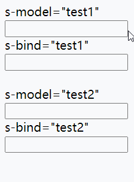

```
<body>
    <label> s-model="test1"<input s-model="test1" /></label><br />
    <label> s-bind="test1"<input s-bind="test1" /></label><br /><br />
    <label> s-model="test2"<input s-model="test2" /></label><br />
    <label> s-bind="test2"<input s-bind="test2" /></label>
<script>
      let proxy = new Proxy(
        {},
        {
          set(obj, prop, val) {
            obj[prop] = val;
            let doms = document.querySelectorAll(
              `[s-model=${prop}],[s-bind=${prop}]`
            );

            console.log(obj[prop]);
            doms.forEach((v) => (v.value = obj[prop]));
            return true;
          },
        }
      );
      let models = document.querySelectorAll(`[s-model]`);
      models.forEach((ele) =>
        ele.addEventListener("input", function () {
          let prop = this.getAttribute("s-model");
          proxy[prop] = this.value;
        })
      );
</script>
</body>
```


---

#### 表单验证

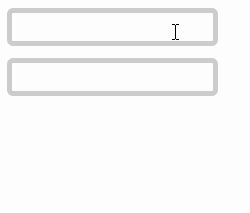

```
<style>
[validate]{
	border:3px dotted #ccc; 
	margin:5px 0px;
	border-radius:5px;
	outline:none;
	height:20px;

}
.err{
	border:3px dotted red; 
}
</style>

<body>
<input type="text" validate rule="min:3,max:6"  />
<input type="text" validate rule="isNumber,min:3"  />
<script>

class Validate{
	static min(val,len){
		return val.length>len;
	}
	static max(val,len){
		return val.length<len;
	}
	static isNumber(val){
		return /^\d+$/.test(val);
	}	
}

function makePoxy(Arr){
return new Proxy(Arr,{
	
	get(arr,key){
		return arr[key];
	},
	set(arr,key,val){
		let rules=arr[key].getAttribute("rule").split(",");
		console.log(rules,key);
		
		let check=rules.every((val)=>{
			let Switch=val.split(":");
			return 	Validate[Switch[0]](arr[key].value,Switch[1]);
		});
		arr[key].classList[check?"remove":"add"]("err");
	},
	
});	
}

let doms=document.querySelectorAll("[validate]");
let proxy=new makePoxy(doms);

doms.forEach(function(ele,i){
	ele.addEventListener("input",function(){
			proxy[i]=this;	
	});
	
});
</script>
</body>

```

 


---

### 静态属性方法总结


## JSON

- json 是一种轻量级的数据交换格式，易于人阅读和编写。
- 使用`json` 数据格式是替换 `xml` 的最佳方式，主流语言都很好的支持`json` 格式。所以 `json` 也是前后台传输数据的主要格式。
- json 标准中要求使用`双引号包裹属性名称`，虽然有些语言不强制，但使用双引号可避免多程序间传输发生错误语言错误的发生。


**关于Javascript中的JSON**

* javacript中的json数据转化，主要依赖两个内置方法。

* 序列化

  * `JSON.stringify(obj,[...prop],num/str)`
  * 参数说明
    * jsonObj
    * 可选，如果只想得到个别属性，则可传入该参数
    * 可选，为number时:控制缩进数，为string时:控制引导字符串

* 反序列化

* `JSON.parse(jsonStr,(key,val)=>{...})`

  * 参数说明
  * josnStr
    * 可选，可在反序列化的过程中对数据进行操作

  

### 声明定义

##### 基本结构

```text
let json = {
  "title": "阿顺特烦恼",
  "url": "Ashuntefannao.com",
  "Controller": {
  	"name": "Ashun",
  }
}
console.log(json.Controller.name);
```

##### **数组结构**

```text
let lessons = [
  {
    "title": '媒体查询响应式布局',
    "category": 'css',
    "click": 199
  },
  {
    "title": 'FLEX 弹性盒模型',
    "category": 'css',
    "click": 12
  },
  {
    "title": 'MYSQL多表查询随意操作',
    "category": 'mysql',
    "click": 89
  }
];

console.log(lessons[0].title);
```

### 序列化

序列化是将 `json对象` 转换为`字符串`，一般用来向其他语言传输使用。

* `JSON.stringify(obj,[...props])`

```text
let as = {
  "title": "阿顺特烦恼",
  "url": "Ashuntefannao.com",
  "Controller": {
  	"name": "Ashun",
  }
}
console.log(JSON.stringify(as));
//{"title":"阿顺特烦恼","url":"Ashuntefannao.com","Controller":{"name":"Ashun"}}
```

根据第二个参数指定保存的属性

* 可选，若不指定，则返回所有prop

```text
console.log(JSON.stringify(as, ['title', 'url']));
//{"title":"阿顺特烦恼","url":"Ashuntefannao.com"}
```

第三个是参数用来控制TAB缩进数量，如果字符串则为前导字符。

```text
let as = {
  "title": "阿顺特烦恼",
  "url": "Ashuntefannao.com",
  "Controller": {
  	"name": "Ashun",
  }
}
console.log(JSON.stringify(as, null, 2));
/*
{
  "title": "阿顺特烦恼",
  "url": "Ashuntefannao.com",
  "Controller": {
    "name": "Ashun"
  }
}
*/
console.log(JSON.stringify(as, null, "-"));
/*
{
-"title": "阿顺特烦恼",
-"url": "Ashuntefannao.com",
-"Controller": {
--"name": "Ashun"
-}
}
*/
```

为数据添加 `toJSON` 方法来自定义返回格式

```text
let as = {
    "title": "阿顺特烦恼",
    "url": "Ashuntefannao.com",
    "Controller": {
        "name": "Ashun",
    },
    "toJSON": function () {
        return {
            "title": this.url,
            "name": this.Controller.name
        };
    }
}
console.log(JSON.stringify(as)); //{"title":"Ashuntefannao.com","name":"Ashun"}
```

### 反序列化

使用 `JSON.parse` 将`josn字符串` 解析成`json对象`

```text
let as = {
  "title": "阿顺特烦恼",
  "url": "Ashuntefannao.com",
  "Controller": {
  	"name": "Ashun",
  }
}
let jsonStr = JSON.stringify(as);
console.log(JSON.parse(jsonStr));
```

```
let jsonStr=`
{
	"name":"Ashun",
	"age":18	
}
`;
console.log(JSON.parse(jsonStr));
```

使用第二个参数函数来对返回的数据二次处理

```text
let as = {
  title: "阿顺特烦恼",
  url: "Ashuntefannao.com",
  Controller: {
  	"name": "Ashun",
  }
}
let jsonStr = JSON.stringify(as);
console.log(
  JSON.parse(jsonStr, (key, value) => {
    if (key == "title") {
      return `${value}-SHUN`;
    }
    return value;
  })
);
/*
{title: "阿顺特烦恼-SHUN", url: "Ashuntefannao.com", Controller: {…}}
*/
```


## 原型与继承

### 原型基础

#### 原型对象

​	我们知道，在Javascript中，任何一个种类其实都是对象。我们可以访问该对象的属性和方法，但是如果对象本身没有某属性、方法，就会从对象的原型上去查找，如果对象的原型上存在你要使用的属性、方法，则将会使用原型上的对应属性和方法。

* 可以将原型理解为对象的父亲，对象从原型对象继承来属性、方法

* 所有函数的原型默认是 `Object`的实例，所以可以使用`toString/toValues/isPrototypeOf` 等方法的原因

* 使用原型对象为多个对象共享属性或方法

* 如果对象本身不存在属性或方法才到原型上查找，若对象本身和原型具有同名属性、方法，则会使用对象本身的属性、方法。

* 使用原型可以解决，通过构建函数创建对象时复制多个函数造成的内存占用问题

* 原型对象`prototype`默认包含 `constructor` 属性，指向构造函数

* 对象具有 `__proto__` 属性，指向它`构造函数的原型对象prototype`

* 构造函数的`prototype`是用来让实例对象继承的。

* `prototype`是`构造器/函数/class`天生具有的属性
  JavaScript内置的构造器有：Object,Number,Boolean,String,Array,RegExp,Date,Function,Error,Math,JSON等。

  当然，普通的函数也可以是构造函数、工厂函数。所以普通函数也具有prototype，让实例化对象来继承。

* 原型链的顶点是`Object.prototype`,所有对象都继承于该原型。


下例就是使用数组原型上的 `concat` 方法完成的连接操作

```text
let as = ["a"];
console.log(as.concat("b"));	//["a","b"]
console.log(as.concat("c",["d","e"],[[[["f"]]]]));	//["a","c","d","e",["f"]]
console.log(as);	//["a"]
```

默认情况下创建的对象都有：继承而来的构造函数原型


* 由于a本身是由Objec构造函数创建的，所以a继承的是Object.prototype
* `a.constructor`和`a.__proto__.constructor`其实是一样的。
* 因为a本身没有constructor属性，所以访问的就是原型上的constructor。

```
let a = { name: "阿顺特烦恼" };
console.log(a);
console.log(a.constructor);// ƒ Object() {}
console.log(a.__proto__.constructor);// ƒ Object() {}
console.log(a.__proto__ == Object.prototype);	//true
```


我们也可以创建一个极简对象（纯数据字典对象）没有原型（原型为null)

```
let obj = { name: 3 };
console.log(obj.hasOwnProperty("name"));

let as = Object.create(null, {
  name: {
    value: "阿顺"
  }
});
console.log(as.hasOwnProperty("name")); //Error:hasOwnProperty not undefined

//Object.keys是静态方法，不是原型方法所以是可以使用的,但也不会返回正常结果，因为该方法也依赖于原型上的迭代接口。
console.log(Object.keys(as));//[]
```


函数具有两个原型对象：`prototype`、`__proto__`

* 之前说过，只有函数具有prototype，用于让实例继承。
* 但是在JS中，任何类型其实都是对象，当把函数看作对象时，其也就具有`__proto__`,用来访问自身的构造函数的原型。

```
function User() {}
User.__proto__.view = function() {
  console.log("User MakeFunction view method");
};
User.view();

User.prototype.show = function() {
  console.log("阿顺特烦恼");
};
let as = new User();
as.show();
console.log(User.prototype == as.__proto__);
```

```
……
console.log(User.__proto__ == User.constructor.prototype);
console.log(User.constructor.prototype == Function.prototype);
console.log(User.__proto__.__proto__ == Object.prototype);
console.log(User.prototype.__proto__ == Object.prototype);
console.log(Object.__proto__.__proto__ == Object.prototype);
console.log(Object.prototype.__proto__ == null);
```

是不是感觉`Object.__proto__.__proto__ == Object.prototype`很难理解？我们可以进行拆解

```
console.log(Object.__proto__.__proto__ == Object.prototype);
console.log(Object.__proto__ == Function.prototype);
console.log(Function.prototype.__proto__ == Object.prototype);
```

下面是原型关系分析，与方法继承的示例

* 实例对象，只有一个`__proto__`接口，用于访问构造函数的`prototype`
* 而`函数/构造函数`都有两个原型接口：`prototype`用于让实例对象继承、`__proto__`用于让自身继承构造自己的构造函数的`prototype`


```
let as = new Object();
as.name = "阿顺";
Object.prototype.show = function() {
  console.log("阿顺特烦恼");
};
as.show();

function User() {}
let shun = new User();
shun.show();
User.show();
```


下面是使用构造函数创建对象的原型体现

- 构造函数拥有原型
- 创建对象时构造函数把原型赋予对象


`constructor`存在于`prototype`原型中，用于指向构建函数。

```text
function User() {}
let as = new User();
console.log(as.__proto__ == User.prototype);
console.log(as.__proto__.constructor == User);
console.log(as.constructor == User);
```

使用对象的 `constructor` 创建对象

```text
 function User(name, age) {
		this.name = name;
		this.age = age;
 }

 function createByObject(obj, ...args) {
		const constructor = obj.__proto__.constructor;
		// const constructor = Object.getPrototypeOf(obj).constructor;
		return new constructor(...args);
 }

 let as = new User("阿顺", 18);
 let zs = createByObject(as, "张三", 7);
 console.log(zs);
```


---

#### 原型链

​	多个原型对象之间的继承，形成的多层级关系，可以抽象为一个链条，即原型链。

​	从之前的图解中也能够看出这种关系。


---

#### 获取\设置原型

##### getprototypeOf

* 使用`Object.getPrototypeOf(obj)`，获取`obj`的原型

  * 等同于`obj.__proto__`

  ```
  const a = {};
  console.log(Object.getPrototypeOf(a) == Object.prototype);
  console.log(Object.getPrototypeOf(a) == a.__proto__);
  ```


---

##### setPrototypeOf

* 使用`Object.setPrototypeOf(sub,sup)`，将`sub`的父级原型对象设置为`sup`

  ```
  let a = {};
  let b = {
  	show() {
  		return "Ashuntefannao";
  	},
  };
  Object.setPrototypeOf(a, b);
  console.log(Object.getPrototypeOf(a));	//{show: ƒ}
  ```

  下面的示例中继承关系为 user=>as=>shun。

  ```
  let user = {};
  let as = { name: "Ashun" };
  let shun = { type: "Controller" };
  
  Object.setPrototypeOf(user, as);
  Object.setPrototypeOf(as, shun);
  
  console.log(user.type);
  console.log(Object.getPrototypeOf(as));
  ```


##### Object.create

使用`Object.create(sup,{desc…})`在创建对象时设置新对象的父级原型。

* 参数1：设置新对象的父级原型
* 参数2：为新对象配置属性，以属性描述的形式，相当于`Object.defineProperties`的形式。


只设置原型

```
let user = {
  show() {
    return this.name;
  }
};

let as = Object.create(user);
as.name = "阿顺";
console.log(as.show());
```

设置原型并赋予新对象属性

```
let sup = {
	name: "Ashun",
	type: "Controller",
};
let obj = Object.create(sup, {
		show: {
				value: function () {
					console.log(this.name);
					console.log(Object.getPrototypeOf(this).name);
				},
				writable: false,
				enumerable: true,
		},
		type:{
			value:"VIP",
			configurable:false
		}
});
obj.show();	//Ashun Ashun
console.log(obj.type) //VIP
```


---

#### 原型检测

##### instanceof

instanceof 检测构造函数的 `prototype` 属性是否出现在某个实例对象的原型链上

```
function A() {}
function B() {}
function C() {}

let c = new C();

B.prototype = c;

let b = new B();

A.prototype = b;

let a = new A();

console.log(a instanceof A);
console.log(a instanceof B);
console.log(a instanceof C);
console.log(b instanceof B);
console.log(b instanceof C);
```

##### isPrototypeof

使用`isPrototypeOf`检测一个对象是否是另一个对象的原型链中

* `a.isPrototypeOf(b)`检测a对象是否在b的原型链上

```text
const a = {};
const b = {};
const c = {};

Object.setPrototypeOf(a, b);
Object.setPrototypeOf(b, c);

console.log(b.isPrototypeOf(a)); //true
console.log(c.isPrototypeOf(a)); //true
console.log(c.isPrototypeOf(b)); //true
console.log(Object.prototype.isPrototypeOf({})); //true

let num = new Number(1);
console.log(Object.prototype.isPrototypeOf(num));
```


---

#### 属性遍历

使用`in` 检测`原型链`上是否存在属性，使用 `hasOwnProperty` 只检测当前对象

```text
let a = { url: "Ashuntefannao" };
let b = { name: "阿顺" };
Object.setPrototypeOf(a, b);
console.log("name" in a);
console.log(a.hasOwnProperty("name"));
console.log(a.hasOwnProperty("url"));
```

使用 `for/in` 也会遍历`原型链`上的属性

```text
let as = { name: "阿顺" };
let shun = Object.create(as, {
  url: {
    value: "Ashuntefannao.com",
    enumerable: true
  }
});
for (const key in shun) {
  console.log(key);
}
```

`hasOwnProperty` 方法判断对象是否存在属性，而**不会查找原型**。所以如果只想遍历对象属性使用以下代码

```text
let as = { name: "阿顺" };
let shun = Object.create(as, {
  url: {
    value: "Ashuntefannao.com",
    enumerable: true
  }
});
for (const key in shun) {
  if (xj.hasOwnProperty(key)) {
    console.log(key);
  }
}
```

之前所说的Object内置迭代器：`Object.keys()、Object.values()、Object.entries()`,它们只能够获得**自身的、可枚举**的属性

```
function User(name) {
		Object.defineProperty(this, "site", {
			value: "Ashuntefannao.com",
			enumerable: false,
		});
		this.name = name;
}
User.prototype.show = function () {
	console.log(this.name);
};
let as = new User("阿顺");
console.log(Object.keys(as));//["name"]
```


---

#### 借用原型

使用 `call` 或 `apply` 可以借用其他原型方法完成功能。

下面的shun对象不能使用`max`方法，但可以借用 as 对象的原型方法

```text
let as = {
	data: [1, 2, 3, 4, 5],
};
Object.setPrototypeOf(as, {
		max: function (data) {
		return data.sort((a, b) => b - a)[0];
	},
});

console.log(as.max(as.data));

let shun = {
	lessons: { js: 100, php: 78, node: 78, linux: 125 },
};
console.log(as.__proto__.max.call(as, Object.values(shun.lessons)));
```

也可使用系统自带的 `Math.max` 。

```text
let as = {
  data: [1, 2, 3, 4, 5]
};
console.log(Math.max.apply(null, Object.values(as.data)));
console.log(Math.max.apply(null, as.data));

let shun = {
  lessons: { js: 100, php: 78, node: 78, linux: 125 }
};
console.log(Math.max.apply(shun, Object.values(.lessons)));
```

下面是获取设置了 `class` 属性的按钮，但`NodeList类数组`不能直接使用数组的`filter` 等方法，但借用数组的原型方法就可以操作了。

```text
<body>
  <button class="red">阿顺</button>
  <button>Ashun</button>
</body>
<script>
  let btns = document.querySelectorAll("button");
  btns = Array.prototype.filter.call(btns, item => {
    return item.hasAttribute("class");
  });
</script>
```


---

#### this

`this` 不受原型继承影响，`this` 指向调用属性时使用的对象。

* 谁调用，`this`指向谁

```text
let shun = {
  name: "阿顺特烦恼"
};
let as = {
  name: "阿顺",
  show() {
    return this.name;
  }
};
shun.__proto__ = as;
console.log(shun.show()); //阿顺特烦恼
```

```
 {
        function Fn() {
          this.x = 100;
          this.y = 200;
          this.getX = function () {
            console.log(this.x);
          };
        }
        
        Fn.prototype.getX = function () {
          console.log(this.x);
        };
        Fn.prototype.getY = function () {
          console.log(this.y);
        };
        
        var f1 = new Fn();
        var f2 = new Fn();
        console.log(f1.getX === f2.getX); //false
        console.log(f1.getY === f2.getY); //true
        console.log(f1.__proto__.getY === Fn.prototype.getY); //true
        console.log(f1.__proto__.getX === f2.getX); //false
        console.log(f1.__proto__.getX === Fn.prototype.getX); //true
        console.log(f1.constructor); //Fn
        console.log(Fn.prototype.__proto__.constructor); //Object
        f1.getX(); //100	(使用其本身的getX，this=》f1)
        f1.__proto__.getX(); //undefined	(通过原型调用，this=》f1.__proto__)
        f2.getY(); //200	(虽然使用的是原型上的方法，但是通过f2调用，this=》f2)
        Fn.prototype.getY(); //undefined	(通过原型调用，this=》f1.__proto__)
}
```

```
{
	function fun(){
		this.a = 0;
		this.b = function(){
			console.log(this.a);
		}
	}
	fun.prototype = {
		b: function(){
			this.a = 20;
			console.log(this.a);
		},
		c: function(){
			this.a = 30;
			console.log(this.a);
		}
	}
	var my_fun = new fun();
	my_fun.b();	//私有方法	this=>my_fun
	console.log(my_fun.a);
	my_fun.c();	//公有方法	this=>my_fun this.a = 30（将私有属性a修改为30）
	console.log(my_fun.a);
	
	var my_fun2 = new fun();
	console.log(my_fun2.a);
	my_fun2.__proto__.c();	//this=>my_fun2.__proto__ 在原型对象上增加了一个a:30
	console.log(my_fun2.a);
	console.log(my_fun2.__proto__.a);

}
//0,0,30,30,0,30,0,30
```


---

### 使用建议

#### prototype

##### 引用属性

原型中保存引用类型属性会造成对象共享属性，所以一般只会在原型中定义方法。

```text
function User() {}
User.prototype = {
  lessons: ["JS", "VUE"]
};
const as = new User();
const shun = new User();

as.lessons.push("CSS");

console.log(as.lessons); //["JS", "VUE", "CSS"]
console.log(shun.lessons); //["JS", "VUE", "CSS"]
```

普通函数的原型默认只有一个`constructor`属性，用于指向自身，这样在实例化后，就能让实例访问自身的构造函数。

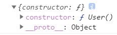

```
function User() {}
console.log(User.prototype);
```


---

##### 更改原型

* `自定义`构造函数的原型`可以手动更改`
* `系统内置`构造函数的原型:`只能读、不能改`

下例是手动更改自定义构造函数的原型，以下代码直接设置了构造函数的原型将造成 `constructor` 丢失

```
function User() {}
User.prototype = {
	show() {
		return `外部更改了默认的prototype`;
	},
};
console.log(User.prototype); // {show: ƒ}
```

正确的做法是要保证原型中的 `constructor`指向构造函数

```
function User() {}
User.prototype = {
	constructor:User,
	show() {
		return `外部更改了默认的prototype`;
	},
};
console.log(User.prototype); // {constructor: ƒ, show: ƒ}
```

实例对象的原型引用构造函数的原型对象，是在创建对象时确定的，当构造函数原型对象改变时会影响后面创建的实例对象。

```text
function User() {}
User.prototype.name = "Ashun";
const obj1 = new User();
console.log(obj1.name); //Ashun

User.prototype = {
	constructor:User,
  name: "阿顺"
};
const obj2 = new User();
console.dir(obj2.name); //阿顺
```


`系统内置`构造函数的原型:为只读属性，外部不可更改，严格模式下会报错

```
String.prototype = {
	show() {
		return `外部更改了默认的prototype`;
	},
};
console.log(String.prototype);
```

```
"use strict"
String.prototype = {
	show() {
		return `外部更改了默认的prototype`;
	},
};
```


---

#### 原型管理

通过前介绍我们知道可以使用多种方式设置原型，下面是按时间顺序的排列

1. `prototype` 构造函数的原型属性
2. `Object.create` 创建对象时指定原型
3. `__proto__` 声明自定义的`非标准属性`设置原型，解决之前通过 `Object.create` 定义原型，而没提供获取方法
4. `Object.setPrototypeOf` 设置对象原型

以上几种方式都可以管理原型，一般我使用 `prototype` 更改自定义构造函数原型，使用  `Object.setPrototypeOf`  设置对象原型。

由于`__proto__`是一个非标准属性，所以使用`Object.getPrototypeOf`，获取对象原型。


---

### 构造函数

#### 使用优化

使用构造函数会产生 `函数复制` 即 `函数不能共享` 的问题造成内存占用。

```text
function User(name) {
  this.name = name;
  this.get = function() {
    return this.name;
  };
}
let zs = new User("张三");
let lisi = new User("李四");
console.log(zs.get == lisi.get); //false
```

将方法定义在原型上让对象共享，解决通过构造函数创建对象时函数复制的内存占用问题

```text
function User(name) {
  this.name = name;
}
User.prototype.get = function() {
  return "阿顺特烦恼" + this.name;
};
let lisi = new User("李四");

let wangwu = new User("王五");
console.log(lisi.get == wangwu.get); //true

//通过修改原型方法会影响所有对象调用，因为方法是共用的
lisi.__proto__.get = function() {
  return "Ashun" + this.name;
};
console.log(lisi.get());
console.log(wangwu.get());
```

下面演示使用原型让多个实例共享属性

```text
function User(name, age) {
  this.name = name;
  this.age = age;
  this.show = () => {
  	return `你在${this.site}的姓名:${this.name}，年龄:${this.age}`;
  }
}
User.prototype.site = '-阿顺特烦恼-';
let lisi = new User('李四', 12); 
let xiaoming = new User('小明', 32);

console.log(lisi.show()); //你在-阿顺特烦恼-的姓名:李四，年龄:12
console.log(xiaoming.show()); //你在-阿顺特烦恼-的姓名:小明，年龄:32
```

使用`Object.assign`一次设置原型方法来复用，后面会使用这个功能实现`Mixin模式`

```text
function User(name, age) {
  this.name = name;
  this.age = age;
}
Object.assign(User.prototype, {
  getName() {
      return this.name;
  },
  getAge() {
      return this.age;
  }
});
let lisi = new User('李四', 12);
let xiaoming = new User('小明', 32);
console.log(lisi.getName()); //李四
console.log(lisi.__proto__)
```


---

### 继承与多态

当对象自身不存在将要使用的属性时，JS会从原型上获取这就是继承在JavaScript中的实现。

#### 继承实现

下面使用`Object.create` 创建对象并指定原型，做为`Admin、Member`的原型对象来实现继承。


使用`Object.create` 创建一个对象，虽然没有赋予任何属性，但是为这个空对象指定了原型，所以能够实现原型的继承。

* 但是会导致`constructor`丢失

```text
function User() {}
User.prototype.getUserName = function() {};

function Admin() {}
Admin.prototype = Object.create(User.prototype);
Admin.prototype.role = function() {};

function Member() {}
Member.prototype = Object.create(User.prototype);
Member.prototype.email = function() {};
console.log(new Admin());
console.log(new Member());
```

不能使用以下方式操作（直接赋值），因为这样会改变User的原型方法，这不是继承，这是改变原型。相当于Admin的原型完全引用了User的原型对象，二者是同一个内存地址。

```text
...
function User() {}
User.prototype.getUserName = function() {};

function Admin() {}
Admin.prototype = User.prototype;
Admin.prototype.role = function() {};
...
```


---

#### 构造函数

有多种方式通过构造函数创建对象

* 直接new构造函数
* 通过原型找到`constructor`,然后再new实例化

```text
function Admin() {}
console.log(Admin == Admin.prototype.constructor); //true

let as = new Admin.prototype.constructor();
console.log(as);

let shun = new Admin();
console.log(shun);
```

因为有时根据得到的对象获取构造函数，然后再创建新对象，所以需要保证构造函数存在，但如果直接设置 `Admin.prototype` ，却没有为其保留`constructor`属性，会造成默认的`constructor`丢失，所以需要再次设置`constructor`值。

```text
function User() {}
function Admin() {}

Admin.prototype = Object.create(User.prototype);
Admin.prototype.role = function() {};

let as = new Admin();
console.log(as.constructor); //constructor丢失，返回User构造函数

Admin.prototype.constructor = Admin;

let shun = new Admin();
console.log(shun.constructor); //正确返回Admin构造函数

//现在可以通过对象获取构造函数来创建新对象了
console.log(new shun.constructor());
```

使用`Object.defineProperty`设置属性特征描述，来禁止遍历constructor属性

```text
function User() {}
function Admin(name) {
  this.name = name;
}

Admin.prototype = Object.create(User.prototype);

Object.defineProperty(Admin.prototype, "constructor", {
  value: Admin,
  enumerable: false //禁止遍历
});

let as = new Admin("阿顺");
for (const key in as) {
  console.log(key);
}
```

完全重写构建函数原型，只对后面创建的实例对象有效

```text
function User() {}
const lisi = new User();
User.prototype = {
  show() {
    return "prototype show";
  }
};
const wangwu = new User();
console.log(wangwu.show());

console.log(lisi.show()); // lisi.show is not a function
```


---

#### 方法重写

下而展示的是子类需要重写父类方法的技巧。

* 在子类构造函数的原型上压入 与 父类构造函数原型上的 同名方法
* 当对象本身没有使用的方法时，会`逐级`向原型链上层查找。

```text
function Person() {}
Person.prototype.getName = function() {
  console.log("parent method");
};

function User(name) {}
User.prototype = Object.create(Person.prototype);
User.prototype.constructor = User;

User.prototype.getName = function() {
  //调用父级同名方法
  Person.prototype.getName.call(this);
  console.log("child method");
};
let as = new User();
as.getName();
console.log(Object.getPrototypeOf(as).getName ==
Object.getPrototypeOf(Object.getPrototypeOf(as)).getName); //false
```


---

#### 多态

多态：根据多种不同的形态产生不同的结果。

下而会根据不同类型的对象得到不同的结果。

```text
			function Person() {}

			Person.prototype.show = function () {
        	console.log(this.desc);
			};

      function Admin() {}
      Admin.prototype = Object.create(Person.prototype);
      Admin.prototype.desc = "管理员的蔑视";

      function Member() {}
      Member.prototype = Object.create(Person.prototype);
      Member.prototype.desc = "我是Vip";

      function Enterprise() {}
      Enterprise.prototype = Object.create(Person.prototype);
      Enterprise.prototype.desc = "企业账户";

      let users = [new Admin(), new Member(), new Enterprise()];
      for (const user of Object.values(users)) user.show();
```


---

### 深挖继承

继承是为了复用代码，继承的本质是将原型指向到另一个对象。

#### 构造函数

我们希望`调用父类构造函数完成对象属性的初始化`，但像下面这样使用是不会成功的。因为此时 `this` 指向了window，无法为当前对象声明属性。

* 下例通过Admin构造函数创建实例，但是希望在Admin中 使用父级构造函数User来初始化实例的属性。
* 但是如果直接调用User函数，由于独立存在的函数this指向window，所以不能够为Admin实例赋予属性

```text
function User(name) {
  this.name = name;
  console.log(this);// Window
}
User.prototype.getUserName = function() {
  return this.name;
};

function Admin(name) {
  User(name);
}
Admin.prototype = Object.create(User.prototype);

let as = new Admin("阿顺");
console.log(as.getUserName()); //undefined
console.log(window.name); //阿顺
```

解决上面的问题是使用 `call/apply` 改变User函数的this指向，为每个生成的对象设置属性。

* 因为这里只是简单的调用User构造函数，所以需要改变this指向，不然this指向window。构造函数实例化为对象时，内部的this才会分配到实例上。

```text
function User(name) {
  this.name = name;
  console.log(this); // Admin
}
User.prototype.getUserName = function() {
  return this.name;
};

function Admin(name) {
  User.call(this, name);
}
Admin.prototype = Object.create(User.prototype);

let as = new Admin("阿顺");
console.log(as.getUserName()); //undefined
```


---

#### 原型工厂

原型工厂是将继承的过程封装，使用继承业务简单化。

```text
function extend(sub, sup) {
  sub.prototype = Object.create(sup.prototype);
  sub.prototype.constructor = sub;
}

function Access() {}
function User() {}
function Admin() {}
function Member() {}

extend(User, Access); 
extend(Admin, User); 
extend(Member, Access); 

Access.prototype.rules = function() {};
User.prototype.getName = function() {};

console.log(new Admin()); // 继承关系: Admin>User>Access>Object
console.log(new Member()); //继承关系：Member>Access>Object
```


---

#### 对象工厂

其实就是在`工厂函数`的基础上，完成原型的继承、对象属性的初始化。

```text
function User(name, age) {
  this.name = name;
  this.age = age;
}
User.prototype.show = function() {
  console.log(this.name, this.age);
};

function Admin(name, age) {
  let instance = Object.create(User.prototype);
  User.call(instance, name, age);
  instance.role=function(){
    console.log('admin.role');
  }
  return instance;
}
let as = Admin("阿顺", 18);
as.show();

function member(name, age) {
  let instance = Object.create(User.prototype);
  User.call(instance, name, age);
  return instance;
}
let lisi = member("李四", 28);
lisi.show();
```


---

#### Mixin模式

`JS`不能实现多继承，因为每个类的原型`prototype`只能设置一次，多次设置会覆盖之前的配置，每个类只能够继承一个父类原型。如果要使用多个类的方法时可以使用`mixin`混合模式来完成。

- `mixin` 类是一个包含许多供其它类使用的方法的类
- `mixin` 类`不用来`继承做为其它类的父类,只是将其中的方法合并到目标原型上。


下面是示例中 `Admin`需要使用 `Request.prototype` 与 `Credit.prototype` 的功能，因为`JS` 是单继承，`Admin`不能够同时继承`Request.prototype` 与 `Credit.prototype` 。我们不得不将无关的类连接在一起，显然下面的代码实现并不佳。

* User->Request->Credit
* Admin要同时使用Request和Credit中的方法，则就需要一个中间类(User)，将二者连接起来，再继承User的原型

```text
function extend(sub, sup) {
  sub.prototype = Object.create(sup.prototype);
  sub.prototype.constructor = sub;
}

function Credit() {}
function Request() {}

function User(name, age) {
  this.name = name;
  this.age = age;
}
extend(Request, Credit);
extend(User, Request);

Request.prototype.ajax = function() {
  console.log("请求后台");
};
Credit.prototype.total = function() {
  console.log("统计积分");
};

User.prototype.show = function() {
  console.log(this.name, this.age);
};
function Admin(...args) {
  User.apply(this, args);
}
extend(Admin, User);
let as = new Admin("阿顺", 18);
as.show();
as.total(); //统计积分
as.ajax(); //请求后台
```

下面分拆功能使用`Object.assign`实现Mixin多继承，使用代码结构更清晰。只让 `Admin` 继承 `User` 原型

```text
function extend(sub, sup) {
  sub.prototype = Object.create(sup.prototype);
  sub.prototype.constructor = sub;
}
function User(name, age) {
  this.name = name;
  this.age = age;
}
User.prototype.show = function() {
  console.log(this.name, this.age);
};
const Credit = {
  total() {
    console.log("统计积分");
  }
};
const Request = {
  ajax() {
    console.log("请求后台");
  }
};

function Admin(...args) {
  User.apply(this, args);
}
extend(Admin, User);
Object.assign(Admin.prototype, Request, Credit);
let as = new Admin("阿顺", 18);
as.show();
as.total(); //统计积分
as.ajax(); //请求后台
```

> 上面使用`Object.assign`实现多继承，具有局限性，因为此时，需要继承的方法必须都封装在对象中，此时就需要把`Credit、Request`从构造函数形式，转化成对象形式。

我们也可以使用`for/in、for/of`浅拷贝目标原型上的所有属性，实现多继承，下例就不需要中间类User了，直接继承`Credit`,再Copy`Request.prototype`中的属性即可。

**Tips**

* 在遍历赋值之前，使用`Object.create()`设置了子类的父级原型，也导致子类本身的prototype为`{}`

* 之后遍历赋值操作，设置了子类的constructor为父类的constructor，不符合逻辑，所以我再次配置了子类的constructor

```
		 function assignPrototype(sub, sup) {
        for (let [key, value] of Object.entries(sup.prototype)) {
          sub.prototype[key] = value;
        }
      }

      function Credit() {}
      function Request() {}

      Credit.prototype.total = function () {
        console.log("统计积分");
      };
      Credit.prototype.getName = function () {
        console.log(this.name);
      };
      Request.prototype.ajax = function () {
        console.log("请求后台");
      };

      function Admin(name) {
        this.name = name;
      }

      Admin.prototype = Object.create(Credit.prototype);
      assignPrototype(Admin, Request);
      Admin.prototype.constructor = Admin;	//重新设置constructor

      let as = new Admin("阿顺");
      as.total();
      as.getName();
      as.ajax();
      console.log(Admin.prototype);
```

也可以直接使用`Object.assign(sub.prototype,sup.prototype)`将二者的原型进行合并

```
……
      Admin.prototype = Object.create(Credit.prototype);
      Object.assign(Admin.prototype, Request.prototype);
      Admin.prototype.constructor = Admin;	//重新设置constructor
……
```

如果我们只是单纯的使用某些类的方法，而不在意父子关系，我们可以直接使用`Object.assign`合并多个原型即可，但是由于没有让这些原型链接起来，所以不能够使用instanceof进行判断。

* 若没有使用`Object.create`设置子类的原型，则之后使用`Object.assign`合并原型时，不会覆盖子类的`prototype.constructor`

```
……
      Object.assign(Admin.prototype, Credit.prototype, Request.prototype);

      let as = new Admin("阿顺");
      as.total();
      as.getName();
      as.ajax();
      console.log(as instanceof Admin); //true
      console.log(as instanceof Credit); //false
      console.log(as instanceof Request); //false
```


也可以使用`Class`结合`super`关键字，实现多继承

* super关键字必须写在constructor的顶部

```
		 	let CalculaterMixin = (Base) =>
        class extends Base {
          constructor(...argus) {
            super(...argus);
            this.argus = argus;
          }
          cacul() {
            console.log(`Calculater Method:${this.argus}`);
          }
        };

      let RandomMixin = (Base) =>
        class extends Base {
          constructor(...argus) {
            super(...argus);
            this.argus = argus;
          }
          random() {
            console.log(`Random Method:${this.argus}`);
          }
        };

      class Foo {
        constructor(...argus) {
          this.argus = argus;
          console.log(...argus);
        }
        foo() {
          console.log(`Foo Method:${this.argus}`);
        }
      }

      class End extends CalculaterMixin(RandomMixin(Foo)) {}
      let end = new End("ashun", "SHUN");
      end.foo();
      end.random();
      end.cacul();
      console.log(end instanceof End);
      console.log(end instanceof Foo);
      console.log(end instanceof CalculaterMixin); //Err
      console.log(end instanceof RandomMixin); //Err
```

上面这种方法利用了ES6中class的extends`后面可以使用表达式`特性，间接实现多继承，这种方法有个缺点是CalculatorMixin等Mixin其实是个箭头函数，无法用instanceof检测，因为`箭头函数没有显示原型`。

下面看看如何修正原型链：

* 手动设置Mixin的原型
* 让Mixin之间产生继承关系

```
……
//需要继承自Object，这里如果写null的话，CalculaterMixin instanceof Object会是false
CalculaterMixin.prototype = Object.create({});
RandomMixin.prototype = Object.create(null);

Object.setPrototypeOf(RandomMixin.prototype, CalculaterMixin.prototype);
Object.setPrototypeOf(Foo.prototype, RandomMixin.prototype);
      console.log(end instanceof End);
      console.log(end instanceof Foo);
      console.log(end instanceof CalculaterMixin); //true
      console.log(end instanceof RandomMixin); //true
```


---


##### super

`mixin` 类也可以继承其他类，比如下面的 `Create` 类获取积分要请求后台，就需要继承 `Request` 来完成。

* 手动配置`Create`的`__proto__`属性

- `super` 关键字指向本对象的父级原型。

```text
function extend(sub, sup) {
  sub.prototype = Object.create(sup.prototype);
  sub.prototype.constructor = sub;
}
function User(name, age) {
  this.name = name;
  this.age = age;
}
User.prototype.show = function() {
  console.log(this.name, this.age);
};
const Request = {
  ajax() {
    return "请求后台";
  }
};
const Credit = {
  __proto__: Request,
  total() {
    console.log(super.ajax() + ",统计积分");
  }
};

function Admin(...args) {
  User.apply(this, args);
}
extend(Admin, User);
Object.assign(Admin.prototype, Request, Credit);
let as = new Admin("阿顺", 18);
as.show();
as.total(); //统计积分
as.ajax(); //请求后台
```


---

#### 实例体验

使用继承原型的方法，结合 `call/apply` 制作选项卡。

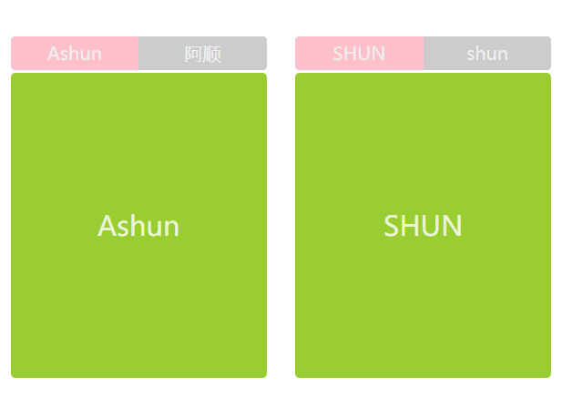

```
<style>
      * {
        margin: 0;
        padding: 0;
        box-sizing: border-box;
      }
      body {
        width: 100vw;
        height: 100vh;
        display: flex;
        justify-content: space-around;
        align-items: center;
      }
      main {
        width: 45%;
        height: 300px;
        display: flex;
        flex-direction: column;
      }
      main > nav {
        width: 100%;
        min-height: 30px;
        display: flex;
        background-color: #ccc;
        border-radius: 4px;
        overflow: hidden;
      }
      a {
        text-decoration: none;
        flex: 1;
        display: flex;
        justify-content: center;
        align-items: center;
        color: #eee;
      }
      main > article {
        width: 100%;
        flex: 1;
        background-color: #eee;
        position: relative;
        border-radius: 4px;
        overflow: hidden;
        margin-top: 2px;
      }
      section {
        position: absolute;
        top: 0;
        left: 0;
        width: 100%;
        height: 100%;
        background-color: yellowgreen;
        display: none;
        justify-content: center;
        align-items: center;
        font-size: 24px;
        color: rgba(255, 255, 255, 0.8);
      }
</style>
<body>
    <main class="tab1">
      <nav><a>Ashun</a> <a>阿顺</a></nav>
      <article>
        <section>Ashun</section>
        <section>阿顺</section>
      </article>
    </main>
    <main class="tab2">
      <nav>
        <a>SHUN</a>
        <a>shun</a>
      </nav>
      <article>
        <section>SHUN</section>
        <section>shun</section>
      </article>
    </main>
</body>
<script>
      /*
        prototype 实例操作：实现Tab选项卡
        让Tab类原型继承Animation类的原型。
        Animation类中提供实现动画的方法，Tab类中完成dom的追踪和事件的绑定,
        在Tab类中，结合call/applay使用Animation中的方法。
        Tab类中只需要传入选项卡的rootDOM即可，内部使用rootDOM.querySelector查找子元素即可。
      */

      //继承封装
      function extend(sub, sup) {
        sub.prototype = Object.create(sup.prototype);
        sub.prototype.constructor = sub;
      }
      /*Animation类*/

      function Animation() {}
      Animation.prototype.show = function () {
        this.style.display = "flex";
      };
      Animation.prototype.hide = function () {
        this.style.display = "none";
      };
      Animation.prototype.background = function (color) {
        this.style.backgroundColor = color;
      };

      function Tab(tab) {
        this.tab = tab;
        this.a = tab.querySelectorAll("a");
        this.section = tab.querySelectorAll("section");
        console.log(this.a, this.section);
      }
      
      extend(Tab, Animation);
      
      Tab.prototype.init = function () {
        this.build();
        this.reset();
        this.action(0);
      };
      Tab.prototype.reset = function () {
        this.section.forEach((val) => this.hide.call(val));
        this.a.forEach((val) => this.background.call(val, "#ccc"));
      };
      Tab.prototype.action = function (i) {
        this.show.call(this.section[i]);
        this.background.call(this.a[i], "pink");
      };
      Tab.prototype.build = function () {
        this.a.forEach((a, index) => {
          a.addEventListener("click", () => {
            this.reset();
            this.action(index);
          });
        });
      };
      new Tab(document.querySelector(".tab1")).init();
      new Tab(document.querySelector(".tab2")).init();
</script>
```


## 类

### 基础知识

为了和其他语言继承形态一致，JS提供了`class` 关键词用于模拟传统的`class` ，但底层实现机制依然是原型继承。

`class` 只是语法糖为了让类的声明与继承更加简洁清晰。

#### 声明定义

可以使用类声明和赋值表达式定义类，推荐使用类声明来定义类

```text
//类声明
class User {
}
console.log(new Article());

//赋值表达式
let Article = class {
};
console.log(new User());
```

类方法间不需要逗号

```text
class User {
  show() {}
  get() {
    console.log("get method");
  }
}
const as = new User();
as.get();
```


#### 构造函数

使用 `constructor` 构造函数传递参数，下例中`show`为构造函数方法，`getName`为原型方法。

* `constructor` 会在 new 时自动执行
* 在`class`中`constructor`就相当于普通构造函数的`函数体`，当使用`new`进行时实例化时，就会执行构造函数，为实例分配属性。
* 在`constructor`中使用`this`声明的属性，会被分配到实例本身，在`constructor`外部定义的`方法`，相当于添加到`class`这个构造函数的原型`prototype`上。（class实际上就是一个函数）
* 但是在`constructor`外部定义的`属性`依旧会被分配到实例上
* 其实创建一个类的过程，其实就是设置该类的原型对象`prototype`，默认有`constructor`属性，还可以在原型上压入其它的属性、方法。

```text
class User {
  constructor(name) {
    this.name = name;
    this.show = function() {};
  }
  getName() {
    return this.name;
  }
}
const as = new User("阿顺");
console.log(as);
console.log(User.prototype);
console.log(as.hasOwnProperty("getName"));
console.log(as.hasOwnProperty("name"));
```

构造函数用于传递对象的初始参数，但不是必须定义的，如果不设置系统会设置如下类型

- **子构造器中调用完`super` 后才可以使用 `this`**。
- 至于 `super` 的概念会在后面讲到，（执行父类中的constructor）

```
constructor(...args) {
  super(...args);
}
```


---

#### 原理分析

之前也提到过，**`class`其实就是函数**

```text
class User {
}
console.log(typeof User); //function
```

下面是与普通函数的对比，结构是完全一致的。


* `constructor` 用于定义函构造数体代码
* `constructor ` 外部定义的`方法`，会追加到该 类(构造函数) 的原型上。
* `constructor ` 外部定义的`属性`，依然会分配到实例上

```
class User {
	constructor(name) {
		this.name = "name";
	}
	getName() {
		return this.name;
	}
}

//普通构造函数
function Ashun(name) {
	this.name = "name";
}
Ashun.prototype.getName = function () {
	return this.name;
};

console.dir(User);
console.dir(Ashun);
```


---

#### 属性定义

在calss类中，无论是在`constructor ` 内、外部定义的`属性`，**都会分配到实例上**。

* `constructor ` 内部定义的`属性`，使用this声明
* `constructor ` 外部定义的`属性`，**不使用**关键字声明。

在class类中，在`constructor ` 外部定义的`方法`，会自动添加到该类的原型上。

```
class User {
	site = `Ashuntefannao.com`; //在constructor外部定义的属性，依然会被分配到实例上
	constructor(name) {
		this.name = name;
	}
	show() {
		console.log(this.name);
	}
}

console.log(User.prototype.site);//undefined
console.log(User.prototype.show);
let as = new User("阿顺");
console.log(as.name, as.site);//阿顺	Ashuntefannao.com
console.table(as);
```


---

#### 函数差异

虽然class是函数的语法糖，但是与普通构造函数在使用方面还是有一些区别的，这都是为了更加规范的管理原型。

* 在class中定义的方法即(原型上的方法)，自动设置为不可枚举。

我们知道，普通构造函数实例化的对象，通过`for/in`遍历属性，会访问原型上的属性。但这样可能会在遍历操作过程中，影响原型的属性或方法。所以class自动为原型上的方法设置属性特征`enumerable:false`。

```
{
        class User {
          site = `Ashuntefannao.com`;
          constructor(name) {
            this.name = name;
          }
          show() {
            console.log(this.name);
          }
        }
        let as = new User("阿顺");
        for (let key in as) {
          console.log(key);		//site name
        }
}
```

对比普通构造函数

```
{
        function User(name) {
          this.site = "Ashuntefannao.com";
          this.name = name;
        }
        User.prototype.show = function () {
          console.log(this.name);
        };
        let as = new User("阿顺");
        for (let key in as) {
          console.log(key);  //site name show
        }
}
```


----

#### 严格模式

`class` 默认使用`use strict` 严格模式执行

```text
{
        class User {
          site = `Ashuntefannao.com`;
          constructor(name) {
            this.name = name;
          }
          show() {
            !(function () {
              console.log(this); //默认严格模式，打印undefined
            })();
          }
        }
        let as = new User("阿顺");
        as.show();
}
```

对比普通构造函数

```
{
        function User(name) {
          this.site = "Ashuntefannao.com";
          this.name = name;
        }
        User.prototype.show = function () {
          !(function () {
            console.log(this); //非严格模式，this=》window
          })();
        };
        let as = new User("阿顺");
        as.show();
}
```


---

### 静态访问

​	静态属性、方法：意为只能够被 该类本身 访问的属性和方法，使用类名来调用。

* 在class中使用`static`关键字进行声明
* 在普通构造函数中，向构造函数本身压入对应的属性和方法。(构造函数本身也是对象)

#### 静态属性

静态属性即为类设置属性，而不是为实例对象设置，下面是原理实现

```text
function User() {}
User.site = "阿顺特烦恼";
console.dir(User);

const as = new User();
console.log(as.site); //undefiend
console.log(User.site); //阿顺特烦恼 
```

在 `class` 中为属性添加 `static` 关键字即声明为静态属性

- 可以把所有实例对象都要使用的值 定义为静态属性

```text
class Request {
  static HOST = "https://www.Ashuntefannao.com";
  
  query(api) {
    return Request.HOST + "/" + api;
  }
}
let request = new Request();
```


#### 静态方法

指通过类访问不能使用对象访问的方法，比如系统的`Math.round()`就是静态方法

- 一般来讲方法不需要对象属性参与计算就可以定义为静态方法

下面是静态方法实现原理，向构造函数本身压入方法。

```text
function User() {
  this.show = function() {
    return "this is a object function";
  };
}
User.show = function() {
  return "welcome to Ashuntefannao";
};
const as = new User();
console.dir(as.show()); //this is a object function
console.dir(User.show()); //welcome to Ashuntefannao
```

在 `class` 内声明的方法前使用 `static` 定义的方法即是静态方法

```text
class User {
  constructor(name) {
    this.name = name;
  }
  static create(name) {
    return new User(name);
  }
}
const as = User.create("阿顺");
console.log(as);
```

下面使用静态方法在课程类中的使用

```text
const data = [
  { name: "js", price: 100 },
  { name: "mysql", price: 212 },
  { name: "React", price: 98 }
];
class Lesson {
  constructor(data) {
    this.model = data;
  }
  get price() {
    return this.model.price;
  }
  get name() {
    return this.model.name;
  }
  //批量生成对象
  static createBatch(data) {
    return data.map(item => new Lesson(item));
  }
  //最贵的课程
  static MaxPrice(collection) {
    return collection.reduce((pre, v) => (pre.price > v.price ? pre : v));
    //  return collection.sort((a, b) => b.price - a.price)[0];
  }
}
const lessons = Lesson.createBatch(data);
console.log(lessons);
console.log(Lesson.MaxPrice(lessons).name);
```


----

### 访问器

使用访问器可以对对象的属性进行访问控制，下面是使用访问器对私有属性进行管理。

#### 语法介绍

- 使用访问器可以管控属性，有效的防止属性随意修改
- 访问器就是在函数前加上 `get/set`修饰，操作属性时不需要加函数的扩号，直接用函数名

```text
class User {
  constructor(name) {
    this.data = { name };
  }
  get name() {
    return this.data.name;
  }
  set name(value) {
    if (value.trim() == "") throw new Error("invalid params");
    this.data.name = value;
  }
}
let as = new User("阿顺");
as.name = "Ashun";
console.log(as.name);
```


---

### 访问控制

设置对象的私有属性有多种方式，包括后面章节介绍的模块封装。

#### public

`public` 指不受保护的属性，在类的内部与外部都可以访问到

```text
class User {
  url = "Ashuntefannao.com";
  constructor(name) {
    this.name = name;
  }
}
let as = new User("阿顺");
console.log(as.name, as.url);
```

#### protected

protected是受保护的属性修释，不允许外部直接操作，只能在`该类`及其`子类(继承类)`中访问的属性

##### 命名保护

将属性定义为以 `_` 开始，来告诉使用者这是一个私有属性，请不要在外部使用。

- 外部修改、访问protected属性时可以使用访问器 `setter/getter` 操作
- 但这只是提示，就像吸烟时烟盒上的吸烟有害健康，但还是可以抽的

```text
class Article {
  _host = "https://Ashuntefannao.com";

  set host(url) {
    if (!/^https:\/\//i.test(url)) {
      throw new Error("网址错误");
    }
    this._host = url;
  }
  get host(){
  	return this._host
  }
  lists() {
    return `${this._host}/article`;
  }
}
let article = new Article();
console.log(article.lists()); //https://Ashuntefannao.com/article
article.host = "https://ASHUN.com";
console.log(article.lists()); //https://ASHUN.com/article
console.log(article._host);		//实际上是能够被实例访问的，因为_host属性被分配到了实例上
```

继承时是可以使用的

```text
class Common {
  _host = "https://Ashuntefannao.com";
  set host(url) {
    if (!/^https:\/\//i.test(url)) {
      throw new Error("网址错误");
    }
    this._host = url;
  }
   get host(){
  	return this._host
  }
}
class Article extends Common {
  lists() {
    return `${this._host}/article`;
  }
}
let article = new Article();
console.log(article.lists()); //https://Ashuntefannao.com/article
article.host = "https://ASHUN.com";
console.log(article.lists()); //https://ASHUN.com/article
```

##### Symbol

下面使用 `Symbol`定义protected属性，即在外部通过查看对象结构无法获取的属性

```text
const protecteds = Symbol();
class Common {
  constructor() {
    this[protecteds] = {};
    this[protecteds].host = "https://Ashuntefannao.com";
  }
  set host(url) {
    if (!/^https?:/i.test(url)) {
      throw new Error("非常网址");
    }
    this[protecteds].host = url;
  }
  get host() {
    return this[protecteds].host;
  }
}
class User extends Common {
  constructor(name) {
    super();//调用父类的constructor
    this[protecteds].name = name;
  }
  get name() {
    return this[protecteds].name;
  }
}
let as = new User("阿顺");
as.host = "https://www.ASHUN.com";
// console.log(as[Symbol()]);
console.log(as.name);
```

##### WeakMap

**WeakMap** 是一组键/值对的集，下面利用`WeakMap`类型特性定义protected属性

```text
const _host = new WeakMap();
class Common {
  constructor() {
    _host.set(this, "https://Ashuntefannao.com");
  }
  set host(url) {
    if (!/^https:\/\//i.test(url)) {
      throw new Error("网址错误");
    }
    _host.set(this, url);
  }
}
class Article extends Common {
  constructor() {
    super();
  }
  lists() {
    return `${_host.get(this)}/article`;
  }
}
let article = new Article();
console.log(article.lists()); //https://Ashuntefannao.com/article
article.host = "https://SHUN.com";
console.log(article.lists()); //https://SHUN.com/article
```

也可以统一定义私有属性

```text
const protecteds = new WeakMap();
class Common {
  constructor() {
    protecteds.set(this, {
      host: "https://Ashuntefannao",
      port: "80"
    });
  }
  set host(preset) {
    if (!/^https:\/\//i.test(preset.host)) {
      throw new Error("网址错误");
    }
    protecteds.set(this, { ...protecteds.get(this), ...preset });
  }
}
class Article extends Common {
  constructor() {
    super();
  }
  lists() {
    return `${protecteds.get(this).host}:${protecteds.get(this).port}/article`;
  }
}
let article = new Article();
console.log(article.lists()); //https://Ashuntefannao:80/article
article.host = { host: "https://SHUN", port: 8083 };
console.log(article.lists()); //https://SHUN:8083/article
```


#### private

`private` 指私有属性，只在当前类可以访问到，并且不允许继承使用

- 为属性或方法名前加 `#` 为声明为私有属性
- 私有属性`只能`在声明的类中使用

下面声明私有属性 `#host` 与私有方法 `#check` 用于检测用户名

```text
class User {
  //private
  #host = "https://Ashuntefannao.com";
  constructor(name) {
    this.name = name ;
    this.#check(name);
  }
  set host(url) {
    if (!/^https?:/i.test(url)) {
      throw new Error("非常网址");
    }
    this.#host = url;
  }
  get host() {
    return this.#host;
  }
  #check = () => {
    if (this.name.length < 5) {
      throw new Error("用户名长度不能小于五位");
    }
    return true;
  };
}
let as = new User("阿顺特烦恼");
as.host = "https://www.SHUN.com";
console.log(as["#host"]);//实例中不能访问类的私有属性
console.log(as.host);	//可以通过getter间接访问
```

对比普通构造函数

```
function User(name) {
	let privateProp = { name };
	Object.defineProperty(this, "name", {
			get() {
				return privateProp.name;
			},
			set(newVal) {
				privateProp.name = newVal;
			},
	});     
}
let as = new User("Ashun");
console.log(as.name);
console.log(as.privateProp);	//undefined
```


---

### 详解继承

#### 属性继承

class实现属性继承的原型如下

```text
function User(name) {
  this.name = name;
}
function Admin(name) {
  User.call(this, name); 
}
let as = new Admin("阿顺");
console.log(as);
```

这就解释了为什么在子类构造函数中要先执行`super`

```text
class User {
  constructor(name) {
    this.name = name;
  }
}
class Admin extends User {
  constructor(name) {
    super(name);
  }
}
let as = new Admin("阿顺");
console.log(as);
```


---

####  继承原理

`class` 使用`extends`关键字实现原型继承。


```
class User {
  show() {
    console.log("user.show");
  }
}
class Admin extends User {
  info() {
    this.show();
  }
}
let as = new Admin("阿顺");
console.dir(as);
as.info();
```


---

#### 方法继承

原生的继承主要是操作原型链，实现起来比较麻烦，使用 `class` 就要简单的多了。

- 在子类中使用父类同名方法，需要使用`super`关键字访问父类的方法，当然，如果子类中没有与父类的同名方法，则直接使用`this`即可，该类没有使用的方法，会到原型上去查找，但是为了更加准确地调用父类方法，推荐使用`super`
- super.show() 执行父类的show方法

下面是在子类中使用父类的方法`show`

```text
      class Person {
        constructor(name) {
          this.name = name;
        }
        show() {
          return `阿顺特烦恼会员: ${this.name}`;
        }
      }
      class User extends Person {
        constructor(name) {
          super(name);
        }
        show() {
          return "is User show";
        }
        run() {
          // return this.show();
          return super.show();
        }
      }
      const as = new User("ASHUN");
      console.log(as.run());
```

class中的`extends`关键字后面可以跟表达式，也就是说可以使用 `extends` 继承表达式返回的类

```text
function controller() {
  return class {
    show() {
      console.log("user.show");
    }
  };
}
class Admin extends controller() {
  info() {
    this.show();
  }
}
let as = new Admin();
as.show()
```


---

#### super

表示从当前原型中查找方法，

- super 一直指向当前对象
- super只能在`类`或`对象方法`中使用，不能在 独立存在的函数 中使用


下面是使用 `this` 模拟`super`，会有以下问题

- `this`指向调用该方法的对象，结果并不是 `admin`的`name`值

```text
let user = {
  name: "user",
  show() {
    return this.name;
  }
};
let admin = {
  __proto__: user,
  name: "admin",
  show() {
    return this.__proto__.show();	//this=>user
  }
};
console.log(admin.show()); //user
```

为了解决以上问题，需要调用父类方法时改变`this`指向

```text
let user = {
  name: "user",
  show() {
    return this.name;
  }
};
let admin = {
  __proto__: user,
  name: "admin",
  show() {
    return this.__proto__.show.call(this);
  }
};
console.log(admin.show());//admin
```

上面看似结果正常，但如果是多层继承时，会出现新的问题

- 我们期望使用`common.show`，但因为始终传递的是当前对象`this` ，造成从 `this` 原型循环调用
- `admin.get`调用父级原型上的show，并绑定了admin的this，所以当执行user.show()时，this为admin，又会导致admin调用user.show()，周而复始，产生循环调用。

```text
let common = {
  show() {
    console.log("common.init");
  }
};
let user = {
  __proto__: common,
  name: "user",
  show() {
    return this.__proto__.show.call(this);
  }
};
let admin = {
  __proto__: user,
  name: "admin",
  get() {
    return this.__proto__.show.call(this);
  }
};
console.log(admin.get());
```

为了解决以上问题 `js` 提供了 `super` 关键字

- 使用 `super` 调用时，在所有继承中 `this` 始终为调用对象
- `super` 是用来查找当前对象的原型，而不像上面使用 `this` 查找原型造成死循环

```text
let common = {
  show() {
    return this.name;
  }
};
let user = {
  __proto__: common,
  name: "user",
  show() {
    return super.show();
  }
};
let admin = {
  __proto__: user,
  name: "admin",
  get() {
    return super.show();
  }
};
console.log(admin.get());
```

虽然使用`super`调用父级方法，但`this指向当前对象`

```
      let common = {
        show() {
          console.log("common.init");
          console.log(this.name);
        },
      };
      let user = {
        __proto__: common,
        name: "user",
        show() {
          return super.show();
        },
      };
      let admin = {
        __proto__: user,
        name: "admin",
        get() {
          return super.show(); //虽然使用super调用父级方法，但this指向当前对象
        },
      };
      admin.get();	//common.init admin
```

`super` **只能在**`类`或`对象的方法`中使用，而不能在独立存在的函数中使用，下面将产生错误

```text
let user = {
  name: "user",
  show() {
    return this.name;
  }
};
let admin = {
  __proto__: user,
  name: "admin",
  get: function() {
    return super.show();
  }
};
console.log(admin.get()); //Uncaught SyntaxError: 'super' keyword unexpected here
```


---

#### constructor

`super` 指向父类引用，在构造函数`constructor` 中必须先调用`super()`，因为这样才能够继承父级原型的属性、方法。

- `super()` 调用父类的构造函数`constructor()`
- 必须在 `constructor` 函数里的`this` 使用前执行 `super()`
- 若不手动配置`super()`,系统会默认执行

```text
class User {
  constructor(name) {
    this.name = name;
  }
  show() {
    console.log(this.name);
  }
}
class Admin extends User {
  constructor(name) {
    super(name);
  }
}
let as = new Admin("阿顺");
as.show();
```

`constructor` 中先调用 `super` 方法的原理如下

* 利用父级构造函数，初始化实例属性

```text
function Parent(name) {
  this.name = name;
}
function User(...args) {
  Parent.apply(this, args);
}
User.prototype = Object.create(User.prototype)
User.prototype.constructor = User;
const as = new User("阿顺");
console.log(as.name);
```

若不手动配置`super(...args)`,系统会默认执行

```
class User {
  constructor(name) {
    this.name = name;
    this.age = age;
  }
  show() {
    console.log(this.name, this.age);
  }
}
class Admin extends User {
  constructor(...args) {
    super(..args);
  }
}
let as = new Admin("阿顺",18);
as.show();
```

与下方代码结果相同

```
class User {
  constructor(name) {
    this.name = name;
    this.age = age;
  }
  show() {
    console.log(this.name, this.age);
  }
}
class Admin extends User {}
let as = new Admin("阿顺",18);
as.show();
```


---

#### 父类方法

之前已经提到过，使用`super`指向父级原型引用，所以可以通过`super`调用父级原型的方法，并且this指向当前对象。

- 不添加方法名是执调用父类构造函数`constructor`

```text
class User {
  constructor(name) {
    this.name = name;
  }
  getName() {
    return this.name;
  }
}
class Admin extends User {
  constructor(name) {
    super(name);
  }
}
const as = new Admin("阿顺");
console.log(as.getName());
```

下面是通过父类方法获取课程总价

```text
class Controller {
  sum() {
    return this.data.reduce((t, c) => t + c.price, 0);
  }
} 
class Lesson extends Controller {
  constructor(lessons) {
    super();
    this.data = lessons;
  }
  info() {
    return {
      totalPrice: super.sum(),
      data: this.data
    };
  }
}
let data = [
  { name: "js", price: 100 },
  { name: "mysql", price: 212 },
  { name: "vue.js", price: 98 }
];
const as = new Lesson(data);
console.table(as.info());
```


---

#### 方法覆盖

即在子类中设置与父类同名的方法，这样就会优先调用子类自身的方法，子类自身没有，才会攀爬原型进行查找。

子类存在父类同名方法时使用子类方法

```text
class User {
  constructor(name) {
    this.name = name;
  }
  say() {
    return this.name;
  }
}
class Admin extends User {
  say() {
    return "阿顺特烦恼：" + super.say();
  }
}
const as = new Admin("阿顺");
console.log(as.say());
```

下面是覆盖父类方法，只获取课程名称

```text
class Controller {
  say() {
    return this.name;
  }
  total() {
    return this.data.reduce((t, c) => t + c.price, 0);
  }
  getByKey(key) {
    return this.data.filter(item => item.name.includes(key));
  }
}
class Lesson extends Controller {
  constructor(lessons) {
    super();
    this.data = lessons;
  }
  getByKey(key) {
    return super.getByKey(key).map(item => item.name);
  }
}
let data = [
  { name: "js", price: 100 },
  { name: "mysql", price: 212 },
  { name: "vue.js", price: 98 }
];
const hd = new Lesson(data);
console.log(hd.getByKey("js"));
```


---

#### 静态继承

静态的属性和方法也是可以被继承使用的，下面是原理分析

```text
function User() {}
User.site = "阿顺特烦恼";
User.url = function() {
  return "Ashuntefannao.com";
};
function Admin() {}
Admin.__proto__ = User;
console.dir(Admin);
console.log(Admin.url());
```

下面使用 `class` 来演示静态继承

* `extends`也会继承**静态**属性、方法

```text
class User {
  static site = "阿顺特烦恼";
  static host() {
    return "Ashuntefannao.com";
  }
  show() {
  	console.log(User.site, User.host());
   }
}
class Admin extends User {}
console.log(Admin.site);
let as = new Admin();
as.show();
```


---

#### 原型检测

##### instanceof

使用 `instanceof` 用于检测 构造函数的`prototype`是否在某个实例的原型链上，下面是在原型中的分析（已经在原型与继承中讲过）

```text
function User() {}
function Admin() {}
Admin.prototype = Object.create(User.prototype);
let as = new Admin();
console.log(as instanceof Admin); //true
console.log(as instanceof User); //true

console.log(as.__proto__ == Admin.prototype);
console.log(as.__proto__.__proto__ == User.prototype);
```

下面是递归检测原型的代码，帮助分析 `instanceof` 的原理

```text
function checkPrototype(obj, constructor) {
  if (!obj.__proto__) return false;
  if (obj.__proto__ == constructor.prototype) return true;
  return checkPrototype(obj.__proto__, constructor);
}
```

`class` 内部实现就是基于原型，所以使用`instanceof` 判断和上面原型是一样的

```text
class User {}
class Admin extends User {}
let as = new Admin();
console.log(as instanceof Admin);
console.log(as instanceof User);
```

##### isPrototypeOf

使用 `isPrototypeOf` 判断一个对象是否在另一个对象的原型链中，下面是原理分析

```text
const a = {};
const b = {
  __proto__: a
};
const c = {
  __proto__: b
};
console.log(a.isPrototypeOf(b)); //true
console.log(a.isPrototypeOf(c)); //true
```

下面在使用 `class` 语法中使用

```text
class User {}
class Admin extends User {}
let as = new Admin();
console.log(Admin.prototype.isPrototypeOf(as));
console.log(User.prototype.isPrototypeOf(as));
```


---

#### 继承内置类

使用原型扩展内置类

```text
function Arr(...args) {
  args.forEach(item => this.push(item));
  this.first = function() {
    return this[0];
  };
  this.max = function() {
    return this.data.sort((a, b) => b - a)[0];
  };
}

Arr.prototype = Object.create(Array.prototype);
let arr = new Arr("阿顺", "123", 18);
console.log(arr.first());
console.log(arr.max())
```

使用 `class`扩展内置类

```text
class Arr extends Array {
        constructor(...args) {
          super(...args);
        }
        add(val) {
          this.push(val);
        }
        remove(val) {
          let index = this.findIndex((v) => v == val);
          index && this.splice(index, 1);
          return index;
        }
}
let arr = new Arr(1, 2, 3);
arr.push("ASHUNTEFANNAO");
console.log(arr);
console.log(arr.remove(3));
console.log(arr);
```


---

#### mixin

关于`mixin` 的使用在原型章节已经讨论过，在`class` 使用也是相同的原理

`JS`不能实现多继承，如果要使用多个类的方法时可以使用`mixin`混合模式来完成。

- `mixin` 类是一个包含许多供其它类使用的方法的类
- `mixin` 类不用来继承做为其它类的父类

```text
const Tool = {
  max(key) {
    return this.data.sort((a, b) => b[key] - a[key])[0];
  }
};

class Lesson {
  constructor(lessons) {
    this.lessons = lessons;
  }
  get data() {
    return this.lessons;
  }
}

Object.assign(Lesson.prototype, Tool);
const data = [
  { name: "js", price: 100 },
  { name: "mysql", price: 212 },
  { name: "vue.js", price: 98 }
];
let hd = new Lesson(data);
console.log(hd.max("price"));
```


---

#### 实例操作

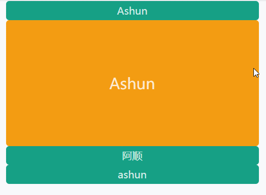

* 类：Animation、Slide、Panel
* Animation:动画效果的实现
* Slide：处理事件绑定，通过Panel调用动画，实现逻辑
* Panel：用于管理面板的伸缩
* 只有Panel extends Animation 在Slide中通过选择器遍历实例化panel。


```
<style>
      * {
        margin: 0px;
        padding: 0;
        box-sizing: border-box;
      }
      body {
        width: 100vw;
        height: 100vh;
        position: relative;
      }
      main {
        margin: 0 auto;
        width: 80%;
        height: 100%;
      }
      .slide {
        width: 100%;
        height: 100%;
      }
      dl {
        display: flex;
        flex-direction: column;
        height: 90%;
      }
      section {
        width: 100%;
        display: flex;
        flex-direction: column;
      }
      section > dt,
      section > dd {
        width: 100%;
        border-radius: 5px;
        display: flex;
        justify-content: center;
        align-items: center;
        overflow: hidden;
        color: rgba(255, 255, 255, 0.8);
      }
      section > dt {
        min-height: 30px;
        background-color: #16a085;
      }
      section > dd {
        height: 200px;
        width: 100%;
        background-color: #f39c12;
        font-size: 24px;
      }
</style>
<body>
    <main>
      <div class="slide">
        <dl>
          <section>
            <dt>Ashun</dt>
            <dd>Ashun</dd>
          </section>
          <section>
            <dt>阿顺</dt>
            <dd>阿顺</dd>
          </section>
          <section>
            <dt>ashun</dt>
            <dd>ashun</dd>
          </section>
        </dl>
      </div>
    </main>
</body>
<script>
 class Animation {
        constructor(el) {
          this.el = el;
          this.timeOut = 6;
          this.step = 3;
          this.isShow = false;
          this.defaultHeight = this.height;
          this.timer = undefined;
        }
        get height() {
          return parseFloat(window.getComputedStyle(this.el).height);
        }
        set height(num) {
          this.el.style.height = num + "px";
        }
        show(callback) {
          this.isShow = true;
          clearInterval(this.timer);
          this.timer = setInterval(() => {
            if (this.height >= this.defaultHeight) {
              clearInterval(this.timer);
              callback && callback(this);
              return;
            }
            this.height = this.height + this.step >= this.defaultHeight
                ? this.defaultHeight
                : this.height + this.step;
          }, this.timeOuttimeOut);
        }
        hide(callback) {
          this.isShow = false;
          clearInterval(this.timer);
          this.timer = setInterval(() => {
            if (this.height <= 0) {
              clearInterval(this.timer);
              callback && callback(this);
              return;
            }
            this.height = this.height - this.step < 0 ? 0 : this.height - this.step;
          }, this.timeOuttimeOut);
        }
      }
      class Slide {
        constructor(el) {
          this.el = document.querySelector(el);
          this.links = this.el.querySelectorAll("dt");
          this.panels = [...this.el.querySelectorAll("dd")].map(
            (v) => new Panel(v)
          );
          this.init();
          this.buildEvent();
        }
        init() {
          Panel.hidAll(this.panels, 0);
          this.panels[0].action();
        }
        buildEvent() {
          this.links.forEach((link, index) => {
            link.addEventListener("click", () => {
              let test = Panel.hidAll(this.panels, index);
              this.panels[index].action();
            });
          });
        }
      }
      class Panel extends Animation {
        static num = 0;
        constructor(el) {
          super(el);
          this.el = el;
        }
        action() {
          this.show();
        }
        static hidAll(panels, index) {
          panels.forEach((v, i) => {
            if (index != i) {
              v.hide();
            }
          });
        }
		}
    new Slide(".slide");
 </script>
```

上面的版本：每次点击不同的item，会展示当前的item，收缩其它item。在动画结束前可以操作其它item。

下面的版本：动画结束前操作其它item无效果。

* 定义一个静态属性，用于记录收缩选项的个数
* 如果当前收缩选项的个数大于0，即还有选项没有收缩完毕，则不执行对应的动画。

```
      class Animation {
        constructor(el) {
          this.el = el;
          this.timeOut = 6;
          this.step = 3;
          this.isShow = false;
          this.defaultHeight = this.height;
          this.timer = undefined;
        }
        get height() {
          return parseFloat(window.getComputedStyle(this.el).height);
        }
        set height(num) {
          this.el.style.height = num + "px";
        }
        show(callback) {
          this.isShow = true;
          clearInterval(this.timer);
          this.timer = setInterval(() => {
            if (this.height >= this.defaultHeight) {
              clearInterval(this.timer);
              callback && callback(this);
              return;
            }
            this.height = this.height + this.step >= this.defaultHeight
                ? this.defaultHeight
                : this.height + this.step;
          }, this.timeOuttimeOut);
        }
        hide(callback) {
          this.isShow = false;
          clearInterval(this.timer);
          this.timer = setInterval(() => {
            if (this.height <= 0) {
              clearInterval(this.timer);
              callback && callback(this);
              return;
            }
            this.height = this.height - this.step < 0 ? 0 : this.height - this.step;
          }, this.timeOuttimeOut);
        }
      }
      class Slide {
        constructor(el) {
          this.el = document.querySelector(el);
          this.links = this.el.querySelectorAll("dt");
          this.panels = [...this.el.querySelectorAll("dd")].map(
            (v) => new Panel(v)
          );
          this.init();
          this.buildEvent();
        }
        init() {
          Panel.hidAll(Panel.others(this.panels, 0), () => {
            this.panels[0].action();
          });
        }
        buildEvent() {
          this.links.forEach((link, index) => {
            link.addEventListener("click", () => {
              Panel.hidAll(Panel.others(this.panels, index), () => {
                this.panels[index].action();
              });
            });
          });
        }
      }
      class Panel extends Animation {
        static num = 0;
        constructor(el) {
          super(el);
          this.el = el;
        }
        action() {
           this.show();
        }
        static hidAll(others, callback) {
          if (Panel.num > 0) return false;
          others.forEach((v, i) => {
            ++Panel.num;
            v.hide(() => Panel.num--);	//当panel的动画执行完毕后,进行--
          });
          callback && callback();
        }
        static others(panels, index) {
          return panels.filter((v, i) => i != index);
        }
     }
    new Slide(".slide");
```


## 模块规范

#### 使用分析

项目变大时需要把不同的业务分割成多个文件，这就是模块的思想。模块是比对象与函数更大的单元，使用模块组织程序便于维护与扩展。

生产环境中一般使用打包工具如 `webpack` 构建，他提供更多的功能。但学习完本章节后会再学习打包工具会变得简单。

- 模块就是一个独立的文件，里面是函数或者类库
- 虽然JS没有命名空间的概念，使用模块可以解决全局变量冲突
- 模块需要隐藏内部实现，只对外开发接口
- 模块可以避免滥用全局变量，造成代码不可控
- 模块可以被不同的应用使用，提高编码效率

#### **实现原理**

在过去JS不支持模块时我们使用`AMD/CMD（浏览器端使用）`、`CommonJS（Node.js使用）`、`UMD(两者都支持)`等形式定义模块。

AMD代表性的是 `require.js`，CMD 代表是淘宝的 `seaJS` 框架。

下面通过定义一个类似 `require.js` 的 `AMD` 模块管理引擎，来体验模块的工作原理。

> 仿写 AMD 规范构建

```text
   		let module = (function () {
        //模块列表集合
        const moduleLists = {};
        function define(name, modules, action) {
          modules.map((m, i) => {
            modules[i] = moduleLists[m];
          });
          //执行并保存模块
          moduleLists[name] = action.apply(null, modules);
        }

        return { define };
      })();

      //声明模块时不依赖其它模块
      module.define("as", [], () => {
        return {
          getName() {
            return this.name;
          },
        };
      });
      //声明模块时依赖其它模块
      module.define("shun", ["as"], (modules) => {
        let curr = {
          getAge() {
            return this.age;
          },
          name: "shun",
        };
        console.log(modules.getName.call(curr));

        return curr;
      });
      
      module.define("SHUN", ["as", "shun"], (...modules) => {
        let curr = {
          show() {
            console.log(this.name, this.age);
          },
          name: "Ashun",
          age: 18,
        };
        let merge = Object.assign(...modules, curr);
        console.log(merge);

        console.log(merge.getName());
        return merge;
      });
```


### 基础知识

#### 标签使用

在浏览器中使用以下语法 靠`Javascript脚本提供的模块化规范` 管理各个js模块，这样就可以在js文件中使用模块代码了。

在html文件中导入模块，需要定义属性 `type="module"`

```text
<script type="module"></script>
```


在浏览器中运行`js模块化规范`管理的模块 在引入时，必须填写正确的路径 如`./xxx.js` 。

测试的 `as.js` 的模块内容如下

```text
export let as = {
  name: "阿顺"
};
```

下面没有指定路径将发生错误

```text
<script type="module">
  import { as } from "as.js";
</script>
```

正确使用需要添加上路径

```text
<script type="module">
  import { as } from "./as.js";
</script>
```


---

#### 延迟解析

模块总是会在`所有html解析后`才执行，下面的模块代码可以看到后加载的 `button` 按钮元素。

- 建议为用户提供加载动画提示，当模块运行时再去掉动画

```text
<body>
  <script type="module">
    console.log(document.querySelector("button")); //Button
  </script>
  <script>
    console.log(document.querySelector("button")); //undefined
  </script>
  <button>阿顺特烦恼</button>
</body>
```


---

#### 默认严格

模块默认运行在严格模式，以下代码没有使用声明语句将报错

```text
<script type="module">
	as = "Ashuntefannao"; // Error
</script>
```

下面的 `this` 也会是 `undefined`

```text
<script>
  console.log(this); //Window
</script>
<script type="module">
  console.log(this); //undefiend
</script>
```


---

#### 独立作用域

模块都有独立的顶级作用域，下面的模块不能互相访问

```text
<script type="module">
  let as = "Ashuntefannao";
</script>

<script type="module">
  alert(as); // Error
</script>
```

引入单独文件，作用域也是独立的，下面的模块 `1.2.js` 不能访问模块 `1.1.js` 中的数据

```text
<script type="module" src="1.1.js"></script>
<script type="module" src="1.2.js"></script>

文件内容如下
# 1.1.js
let as = "Ashuntefannao";

# 1.2.js
console.log(as)
```


---

#### 一次解析

模块在导入时`只执行一次解析`，之后的导入不会再执行模块代码，而使用第一次解析结果，并共享数据。

- 可以在首次导入时完成一些初始化工作
- 如果模块内有后台请求，也只执行一次

引入多入`as.js` 脚本时只执行一次

```text
<script type="module" src="./as.js"></script>
<script type="module" src="./as.js"></script>

# as.js内容如下
console.log("阿顺特烦恼");
```

下面在导入多次 `as.js` 时只解析一次

```text
<script type="module">
  import "./as.js";
  import "./as.js";
</script>

# as.js内容如下
console.log("阿顺特烦恼");
```


---

### 导入导出

ES6使用基于文件的模块，即一个文件一个模块。

- 使用`export` 将开发的接口导出
- 使用`import` 导入模块接口


#### 具名导出

下面定义模块 `modules/as.js` ，使用 `export` 具名导出模块接口，没有导出的变量都是模块私有的。

下面是对定义的 `as.js` 模块，分别导出内容

```text
let title="阿顺特烦恼";
export const site = "ashuntefannao";
export const func = function() {
  return "is a module function";
};
export class User {
  show() {
    console.log("user.show");
  }
}
```

##### 批量导出

也可在定义被导出变量后，使用`批量导出`一次性导出多个变量接口,`export{…options}`

```text
let title="阿顺特烦恼";
const site = "ashuntefannao";
const func = function() {
  return "is a module function";
};
class User {
  show() {
    console.log("user.show");
  }
}
export { site, func, User };
```

#### 具名导入

`具名导入`与`具名导出`相对应，具名导出的模块接口，需要具名导入。

下面导入上面定义的 `as.js` 模块，分别导入模块导出的内容

```text
<script type="module">
  import { User, site, func } from "./as.js";
  console.log(site);
  console.log(User);
</script>
```

也可只导入部分变量接口，需要哪些导入哪些，当然了 所导入的变量接口，必须被所引入的模块导出。

```
<script type="module">
  import { User } from "./as.js";
  console.log(User);
</script>
```

像下面这样在 `{}` 中导入是错误的，模块默认是在`顶层静态导入`，这是为了分析使用的模块，方便打包

```text
if (true) {
  import { site, func } from "./as.js"; // Error
}
```

##### 批量导入

也可使用批量导入语法`import * as alias `，一次性将所有暴露的接口导入，并为批量导入的接口起一个`别名`，之后通过别名来访问批量导出的对象。

* `*`整体为一个Object，为其设置别名后通过`alias.propName`访问导出的具体变量

```
<script type="module">
  import * as api from "./hd.js";
  console.log(api.site);
  console.log(api.User);
</script>
```


#### 导入建议

因为以下几点，我们更建议使用明确导入方式

- 使用`webpack` 构建工具时，没有导入的功能会删除节省文件大小
- 可以更清晰知道都使用了其他模块的哪些功能


---

### 别名使用

#### 别名导入

可以为导入的模块重新命名，语法: `import { oldName as newName …}`

**应用场景**

- 有些导出的模块命名过长，起别名可以更加简洁
- 本模块与导入模块 变量重名时，可以通过起别名防止冲突

```text
let title="阿顺特烦恼";
const site = "ashuntefannao";
const func = function() {
  return "is a module function";
};
class User {
  show() {
    console.log("user.show");
  }
}
export { site, func, User };
```

模块导入使用 `as` 对接口重命名，本模块中已经存在 `func` 变量，需要对导入的模块重命名防止命名错误。

```text
<script type="module">
  import { User as user, func as method, site as name } from "./as.js";
  let func = "ashunMethod";
  console.log(name);
  console.log(user);
  console.log(method);
</script>
```


#### 别名导出

模块可以对 暴露给外部的接口 起别名，下面是`as.js` 模块对暴露的接口起别名

```text
let title="阿顺特烦恼";
const site = "ashuntefannao";
const func = function() {
  return "is a module function";
};
class User {
  show() {
    console.log("user.show");
  }
}
export { site, func as method, User as user };
```

由于模块暴露时，为其接口起了别名，所以在具名导入时，应导入对应的别名。

```text
<script type="module">
  import { user, method } from "./as.js";
  method();
</script>
```


---

### 默认导出

很多时候模块只是一个类，也就是说只需要导入一个内容，这地可以使用默认导入。

使用`default`关键字 定义默认导出的接口，导入时不需要使用 `{}`

- 只能有一个默认导出
- 默认导出可以没有命名

- 在导入时可以任意命名


#### 单一导出

下面是`as.js` 模块内容，默认只导出一个类。并且没有对类命名，这是可以的

```text
export default class {
  static show() {
    console.log("User.method");
  }
}
```

如果将一个导出的接口 分配别名为 `default` 也算默认导出

```text
class User {
  static show() {
    console.log("User.method");
  }
}
export { User as default };
```

导入时就不需要使用 `{}` 来导入了

```text
<script type="module">
  import User from "./hd.js";
  User.show();
</script>
```

默认导出的接口 在引入时 可以随意命名

```text
<script type="module">
  import as from "./hd.js";
  as.show();
</script>
```


---

#### 混合导出

模块可以存在默认导出与命名导出。

使用`export default` 导出默认接口，使用 `export {}` 导入普通接口

```text
let title="阿顺特烦恼";
const site = "ashuntefannao";
const func = function() {
  return "is a module function";
};
export default class {
  show() {
    console.log("user.show");
  }
}
export { site, func };
```

也可以结合别名`oldName as default`综合导出各个接口

```text
let title="阿顺特烦恼";
const site = "ashuntefannao";
const func = function() {
  return "is a module function";
};
class User {
  show() {
    console.log("user.show");
  }
}
export { site, func, User as default };
```

导入默认接口时不需要使用 `{}` ，普通接口还用 `{}` 导入

```text
<script type="module">
	//可以将 as 替换为任何变量
  import as from "./as.js";
  import { site } from "./as.js";
  console.log(site);
  as.show();
</script>
```

可以使用一条语句导入默认接口与常规接口，使用`,`隔开

```text
import show, { name } from "/modules/ashun.js";
```

也可以使用别名导入 默认导出的接口

* `default as 自定义名称`，之后通过 自定义的变量 访问默认导出接口

```text
import { site, default as as } from "./as.js";
console.log(site);
as.show();
```

如果是批量导入时，使用 `alias.default` 获得默认导出

```text
<script type="module">
  import * as api from "./as.js";
  console.log(api.site);
  api.default.show();
</script>
```


#### 使用建议

对于默认导出和命名导出有以下建议

- 不建议使用默认导出，会让开发者导入时随意命名

  ```text
  import as from "./as.js";
  import shun from "./as.js";
  ```

- 如果使用默认导入，自定义的名称最好和 模块的文件名 有关联，会使用代码更易阅读

  ```text
  import as from "./as.js";
  ```


---

### 导出合并

#### 解决问题

可以将导入的模块重新导出使用，比如项目模块比较多如下所示，这时可以将所有模块`合并到一个入口文件`中。

这样只需要使用一个模块入口文件，而不用关注多个模块文件

```text
|--test1.js
|--test2.js
|--test3.js
...
```

#### 实际使用

下面是 `test1.js` 模块内容

```text
const site = "阿顺特烦恼";
const func = function () {
  console.log("is a module function");
};
export { site, func };
```

下面是 `test2.js` 模块内容

```text
export default class {
  static get() {
    console.log("ashun.js.get");
  }
}
```

下面是 `test3.js` 模块内容

```
export function method() {
  console.log("test3 method");
}
```


下面是 `index.js` 模块内容，由于我们想让index.js为入口文件，所有的模块都存放其中，暴露给外部。ES模块化规范提供了对应的语法，在`index.js`中`导入其他模块的同时也将其导出`。

* 将`import`与`export`合并使用，在导入的同时进行导出

```text
export * as as from "./test1.js";
//相当于以下语句
// import * as as from "./test1.js"
// export { as }

export { default as shunClass } from "./test2.js";
// 以上导入test2的语句相当于下两句
// import { default as shunClass } from "./test2.js";
// export { shunClass };
// 也等价于
// import shunClass  from "./test2.js";
// export { shunClass };

// 但以下方式导出 test2默认导出的模块 是错误的
// export shunClass from "./test3.js";

//	在index.js中，默认导出test3中的method。
export { method as default } from "./test3.js";
//	相当于以下语句
//  import {method} from "./test3.js"
//	export {method as default}
```

使用方法如下

```text
<script type="module">
  import * as api from "./index.js";
  console.log(api.shunClass);
  console.log(api.as.site);
  api.as.func();
  api.default();
</script>
//等价于
<script type="module">
      import test3Method, { as, shunClass } from "./index.js";
      console.log(shunClass);
      console.log(as.site);
      test3Method();
</script>
//等价于
<script type="module">
      import { as, shunClass, default as test3Method } from "./index.js";
      console.log(shunClass);
      console.log(as.site);
      test3Method();
</script>
```


---

###  动态加载

使用 `import` 关键字 必须在`顶层静态导入`模块，而使用`import("path")` 函数可以按需动态的导入模块，它返回一个 `promise` 对象。

#### 静态导入

必须在顶层静态导入，否则会报错

```
if (true) {
  import { site, func } from "./as.js"; // Error
}
```

#### 按需动态导入

测试用的 `as.js` 模块内容如下

```text
const site = "阿顺特烦恼";
const func = function() {
  console.log("is a module function");
};
export { site, func };
```

使用 `import("path")` 函数可以动态导入，实现按需加载

* `import()`返回`promise`，可以使用promise方法在导入模块后进行操作
* `import("path").then(module=>{}).catch(err=>{})`

```text
<script>
  if (true) {
    let as = import("./as.js").then(module => {
      console.log(module.site);
    });
  }
</script>
```

下面是在点击事件发生后按需要加载模块

```text
<button>阿顺特烦恼</button>
<script>
  document.querySelector("button").addEventListener("click", () => {
    let as = import("./as.js").then(module => {
      console.log(module.site);
    });
  });
</script>
```

因为是返回的对象可以使用解构语法

```text
<button>后盾人</button>
<script>
  document.querySelector("button").addEventListener("click", () => {
    let hd = import("./hd.js").then(({ site, func }) => {
      console.log(site);
    });
  });
</script>
```


---

### 指令总结

| 表达式                                                       | 说明         |
| ------------------------------------------------------------ | ------------ |
| export function show(){}                                     | 具名导出函数 |
| export const name='阿顺'                                     | 具名导出变量 |
| export class User{}                                          | 具名导出类   |
| export { show , name ,  User }                               | 批量具名导出 |
| export default show                                          | 默认导出     |
| export default show  ……  export{ name ,  User }              | 混合导出     |
| export { show as default , name ,  User  }                   | 批量混合导出 |
| export {name as shun_name}                                   | 别名导出     |
| import {name,show} from 'as.js'                              | 具名导入     |
| import defaultVar from 'ashun.js'                            | 导入默认导出 |
| import defaultVar,{name,show} from &#39;as.js&#39;           | 混合导入     |
| import  {name , show , default as defaultVar} from &#39;as.js&#39; | 混合导入     |
| Import { name as asName , show } from 'ashun.js'             | 别名导入     |
| Import * as api from 'ashun.js'                              | 导入全部接口 |

***导入并导出***

| 表达式                                          | 说明                                                  |
| ----------------------------------------------- | ----------------------------------------------------- |
| export { name, site } from "./as.js"            | 将as.js中的`name、site`具名导入并导出                 |
| export { name as asName , site } from "./as.js" | 将as.js中的`name`别名导入导出；`site`具名导入并导出   |
| export { name as default } from "./as.js"       | 将as.js中的`name`具名导入再默认导出                   |
| export { default as defaultVar } from "./as.js" | 将as.js中的默认导出进行导入，再以`defaultVar`具名导出 |
| export * as asAPI from "./as.js";               | 将as.js中暴露的接口合并导入，再以`asAPI`具名导出      |


## 正则表达式

### 基础知识

正则表达式是用于匹配字符串中`字符组合`的模式，在 JavaScript中，正则表达式也是对象。

- 正则表达式是在宿主环境下运行的，如`js/php/node.js` 等 , 即在不同的语言中都会有正则表达式。
- 本章讲解的知识在其他语言中知识也是可用的，但是会有些函数使用上的区别

#### 对比分析

与普通函数操作字符串来比较，正则表达式可以写出更简洁、功能强大的代码。

下面使用获取字符串中的所有数字来比较函数与正则的差异。

```text
let Str = "Ashuntefannao1.1324Ashun";
let numbers = [...Str].filter((char) => !isNaN(Number(char))).join("");
console.log(numbers);
```

使用正则表达式将简单得多

```text
let Str = "Ashuntefannao1.1324Ashun";
let numbers = Str.match(/\d/g).join("");
console.log(numbers);
```


---

#### 创建正则

JS提供`字面量`与`对象`两种方式创建正则表达式，推荐使用`字面量形式`创建RegExp，形式更加简洁。

##### 字面量创建

使用`//`包裹的字面量创建方式是推荐的作法，但不能在`//`中使用变量作为匹配规则

```text
let as = "Ashuntefannao.com";
let reg=/[A-Z]/;
console.log(reg.test(as)); //true
console.log(/[A-Z]/.test(as)); //true
```

`//`包裹的字面量创建的正则，其中不能应用变量，作为匹配规则。

* `//`包裹的内容会被理解为正则语法，所以其中的`z`不是变量，是匹配`z`字符

```text
let as = "Ashuntefannao.com";
let z = "shun";
console.log(/z/.test(as)); //false
console.log(/z/.test("zheng"))//true
```

虽然可以使用 `eval` 计算字符串表达式，将其转换为js语法来实现将变量解析到正则中，但是比较麻烦，所以`有变量时`建议使用下面所讲的`对象创建`方式

```text
let as = "Ashuntefannao.com";
let z = "shun";
console.log(eval(`/${z}/`).test(as)); //true
```


---

##### 对象创建

当正则需要动态创建时（应用str变量），建议使用对象方式

```text
let as = "ashuntefannao";
let str = "ashun";
let reg = new RegExp(str);
console.log(reg.test(as)); //true
```

根据用户输入高亮显示内容，支持用户输入正则表达式

```text
<body>
  <div id="content">ashuntefannao</div>
</body>
<script>
	let matchStr = prompt("请输入搜索的字符串,支持输入正则");
  let reg = new RegExp(matchStr, "g");
  let dom = document.querySelector("#content");
  dom.innerHTML = dom.innerHTML.replace(reg, (str) => {
  	console.log(str);
  	return `<strong style="color:red;">${str}</strong>`;
  });
</script>
```

通过对象创建正则，提取标签

```text
<body>
 		<h1>ashuntefannao</h1>
    <h1>ASHUN</h1>
</body>
<script>
{
        function getElement(ele) {
          let html = document.body.innerHTML;
          let matchStr = `<(${ele})>.+</\\1>`;
          let reg = new RegExp(matchStr, "g");

          console.table(html.match(reg));
        }
        getElement("h1");
}
</script>
```


---

#### 选择符

选择修释符`|` 这个符号带表`或`的关系，也就是 `|` 左右两侧有一个匹配到就可以。

###### *要注意：使用的范围不同，得到的结果也不同*

* 如果在整个表达式使用，则将整个表达式一分为二
* 同理，在原子组中使用，则只是将当前原子组一分为二

检测电话是否是上海或北京的坐机

```text
let tel = "010-12345678";
//错误结果：只匹配 | 左右两边任一结果
console.log(tel.match(/010|020\-\d{7,8}/)); 

//正确结果：需要放在原子组中使用，将当前原子组一分为二
console.log(tel.match(/(010|020)\-\d{7,8}/));
```

匹配字符是否包含`ashuntefannao` 或 `ashun`

```text
const title = "ashuntefannao";
console.log(/ashuntefannao|ashun/.test(title)); //true
```


---

#### 字符转义

`\被转义字符`

* 转义用于 `改变字符的含义`，用来处理 `某个字符有多种语义时` 的情况。

* 在正则中具有特殊意义的字符，使用时需要转义。

* 假如有这样的场景，如果我们想通过正则查找`/`符号，但是 `/`在正则中有特殊的意义。如果写成`///`这会造成解析错误，所以要使用转义语法 `/\//`来匹配。

```text
const url = "https://www.ashuntefannao.com";
console.log(/https:\/\//.test(url)); //true
```

使用 `RegExp` 构建正则时在转义上会有些区别，下面是对象与字面量定义正则时区别

* 在普通字符串中，转义一次字符，结果不变
* 由于使用对象形式`new RegExp(str,mode)`创建正则时，第一个参数接收的是字符串，需要在字符串中定义匹配的规则，所以 若使用特殊意义的匹配字符 需要转义两次。

```text
let price = 12.23;
//含义1: . 除换行外任何字符 	含义2: .普通点
//含义1: d 字母d   					含义2: \d 数字 0~9
console.log(/\d+\.\d+/.test(price));

//字符串中 \d 与 d 是一样的，所以在 new RegExp 时\d 即为 d
console.log("\d" == "d");

//使用对象定义正则时，可以先把字符串打印一样，结果是字面量一样的定义就对了
console.log("\\d+\\.\\d+");
let reg = new RegExp("\\d+\\.\\d+");
console.log(reg.test(price));
```

下面是网址检测中转义符使用

```text
let url = "https://www.ashuntefannao.com";
console.log(url.match(/https?:\/\/w+\.\w+\.\w+/));
```


---

#### 字符边界

使用字符边界符用于控制匹配内容的开始与结束约定。

| 边界符 | 说明                         |
| ------ | ---------------------------- |
| ^      | 匹配字符串的开始             |
| $      | 匹配字符串的结束，忽略换行符 |

匹配内容必须以`www`开始

```text
const as = "www.ashuntefannao.com";
console.log(/^www/.test(as)); //true
```

匹配内容必须以`.com`结束

```text
const as = "www.ashuntefannao.com";
console.log(/\.com$/.test(as)); //true
```

检测用户名长度为3~6位，且只能为字母。如果不使用 `^与$` 限制将得不到正确结果

```text
<body>
  <input type="text" name="username" />
</body>

<script>
  	document.querySelector("[name='username']")
          .addEventListener("input", function () {
            let test = this.value.match(/^[a-zA-Z]{3,6}$/);
            console.log(test ? "正确" : "错误");
          });
</script>
```

```
				let reg = /[a-zA-Z]{3,6}/;
        let reg1 = /^[a-zA-Z]{3,6}$/;
        
        //不使用^$限制，虽然字符串长度不足时也可返回正确结果
        //但字符串长度超出时，返回的是自前向后匹配的结果
        console.log("as".match(reg));							//null
        console.log("123ashuntefannao123".match(reg));	//["ashunt"]
				
				//使用^$进行限制，以字母3-6位开头，并以字母3-6位结尾，则匹配结果为3-6位纯字母
        console.log("ashuntefannao".match(reg1)); //null
        console.log("as".match(reg1)); 						//null
        console.log("ashun".match(reg1)); 				//["ashun"]
				
				//只是用^限制，则只要开头满足3-6位纯字母即可
        console.log("ashuntefannao123".match(/^[a-zA-Z]{3,6}/)); //["ashunt"]
        //只是用$限制，则只要结尾满足3-6位纯字母即可
        console.log("132ashuntefannao".match(/[a-zA-Z]{3,6}$/)); //["fannao"]
```


---

### 元字符

元字符是正则表达式中的最小元素，只代表单一（一个）字符。

#### 普通元字符

普通元字符，即 在正则中没有特殊意义的 普通字符。

```
let a = "ashun";
console.log(/a/.test(a)); 		//true
console.log(a.match(/a/)[0]); //a
```


---

#### 特殊元字符

| 元字符   | 说明                                                 | 示例                    |
| -------- | ---------------------------------------------------- | ----------------------- |
| \d       | 匹配任意一个数字                                     | [0-9]                   |
| \D       | 与除了数字以外的任何一个字符匹配                     | [^0-9]                  |
| \w       | 与任意一个字母、数字、下划线匹配                     | [a-zA-Z0-9_]            |
| \W       | 除了 字母、数字、下划线以外 与任何字符匹配           | [^a-zA-Z0-9_]           |
| \s       | 任意一个空白字符匹配，如空格，制表符`\t`，换行符`\n` | [\n\f\r\t\v]            |
| \S       | 除了空白符外任意一个字符匹配                         | [^\n\f\r\t\v]           |
| \p{prop} | 配合`u`模式，匹配对应属性的字符                      | ( \p{P} \| \p{sc=Han} ) |
| .        | 匹配除换行符外的任意字符                             | [^\n]                   |


#### 使用体验

匹配任意数字

```text
let as = "Ashuntefannao 2020";
console.log(as.match(/\d/g)); //["2", "0", "2", "0"]
```

匹配所有电话号码

```text
let as = `
	张三:010-99999999,李四:020-88888888
`;

let res = as.match(/\d{3}-\d{7,8}/g);
console.log(res);
```

获取所有用户名

* `-`在原子组`[]`中具有特殊含义，为了避免冲突，最好转义使用
* 下列情况是否转义，情况都相同，但在表示一些匹配范围时，就会有歧义

```text
let as = `
张三:010-99999999,李四:020-88888888`;
let res = as.match(/[^:\d-,\s]+/g);

console.log(/[^:\d\-,\s]+/g)
console.log(res);
```

```
console.log("103azA".match(/[0\-9]/g));	//["0"]
console.log("103azA".match(/[0-9]/g));	//["1","0","3"]
```

也可使用`\p{prop}`结合`u`模式，匹配属性为汉字的字符

```
console.log(as.match(/\p{sc=Han}{2,3}/gu)); //["张三","李四"]
```


匹配任意非数字

```text
console.log(/\D/.test(2029)); //false
```

匹配字母数字下划线

```text
let as = "ashun@";
console.log(as.match(/\w/g)); //["a", "s", "h", "u", "n"]
```

匹配除了字母,数字或下划线外与任何字符匹配

```text
console.log(/\W/.test("@")); //true
```

匹配与任意一个空白字符

```text
console.log(/\s/.test(" ")); //true
console.log(/\s/.test("\n \t")); //true
```

匹配除了空白符外任意一个字符匹配

```text
let as = "ashun@";
console.log(as.match(/\S/g)); //["a", "s", "h", "u", "n","@"]
```

如果要匹配 字符串点`"."` 则需要转义

```text
let as = `ashuntefannao@com`;
console.log(/ashuntefannao.com/i.test(as));  //true
console.log(/ashuntefannao\.com/i.test(as)); //false
```

使用`.`匹配除换行符外任意字符，下面匹配不到`ashun.com` 因为有换行符 且没有使用`g`模式

```text
const url = `
  https://www.Ashuntefanano.com
  ashun.com
`;
console.log(url.match(/.+/));
```

特殊元字符`.` 配合`s`模式，`.`就可以匹配任意字符 (能够匹配换行符)

* 使用`s`单行模式（忽略换行）时，可以匹配所有

```text
let title = `
  <span>
    ashuntefannao
    ashun
  </span>
`;
let res = title.match(/<span>.*<\/span>/s);
console.log(res[0]);
```

正则中会将 空格 按普通字符对待

```text
let tel = `010 - 999999`;
console.log(/\d+-\d+/.test(tel)); //false
console.log(/\d+ - \d+/.test(tel)); //true
```


---

#### 所有字符

* 可以使用 `[\s\S]`、`[\d\D]`、`[\w\W]`等等来匹配所有字符

```text
let as = `
  <span>
    ashuntefannao
    ashun
  </span>
`;
let res = as.match(/<span>[\s\S]+<\/span>/);
console.log(res[0]);
```

* `.`结合`s`单行模式(忽略换行符)，也可匹配所有字符

```
……
let res = title.match(/<span>.*<\/span>/s);
console.log(res[0]);
```


---

### 匹配模式

正则表达式在执行时会按他们的默认执行方式进行处理，但有时候默认的处理方式总不能满足我们的需求，所以可以切换不同的匹配模式满足业务需求。

| 修饰符 | 说明                                            |
| ------ | ----------------------------------------------- |
| i      | 不区分大小写字母的匹配                          |
| g      | 全局搜索所有匹配内容                            |
| m      | 视为多行                                        |
| s      | 视为单行忽略换行符，使用`.` 可以匹配所有字符    |
| y      | 从 `regexp.lastIndex` 开始匹配                  |
| u      | Unicode模式，能够正确处理四个字符的 UTF-16 编码 |


#### i

将所有`ashuntefannao` 统一为小写

```text
let site = "ashuntefannao ASHUNTEFANNAO";
site = site.replace(/ashuntefannao/gi, "ashuntefannao");
console.log(site);
```


#### g

使用 `g` 模式，可以搜索到所有满足匹配规则的string

```text
 {
        let as = "ashuntefannao";
        as = as.replace(/n/, "@");
        console.log(as); //没有使用 g 修饰符是，只替换了第一个 n
}
{
        let as = "ashuntefannao";
        as = as.replace(/n/g, "@");
        console.log(as); //使用全局修饰符后替换了全部的 n
}
```


#### m

`m`多行匹配模式，结合`^$`可约束匹配字符串中的每一行。

也就是说：字符串存在换行符`\n`时，字符串有几行，就匹配多少次。并且每一行都可使用`^$`进行约束。

* 默认情况下，无论字符串是否有换行符，都只有一个开头`^`和结尾`$`
* 结合`m`模式，每一行都有自身的`^$`

```
  {
        let str = `
        # jsES6 #
        # vue2.0 #
        # ashunte #
        `;
        console.log(str.match(/^\s*#\s+.*\s#$/gm));	
        console.log(str.match(/^\s*#\s+.+#\s*$/g));//null
  }
```

下例是将以 `#数字`开始的课程解析为对象结构，学习过后面讲到的原子组可以让代码简单些

```text
{
  			let str = `
  				#1 js,200元 #
  				#2 php,300元 #
  				#9 ashuntefannao # 阿顺特烦恼
  				#3 node.js,180元 #
				`;
        let lessons = str.match(/^\s*#.+#$/gm);
        console.log(lessons);
        lessons = lessons
          .map((v) => v.replace(/\s*#\d\s*/, "").replace(/\s*#\s*/, ""))
          .map((v) => {
            let [name, price] = v.split(",");
            return { name, price };
          });
        console.log(JSON.stringify(lessons, null, 2));
}
```


#### s

`s`单行模式，在匹配时忽略`换行符`，结合`.`能够匹配所有字符

```
let str = `
      ashuntefannao.com
      999999999
      !@#$%^&*()_+-
`;
console.log(str.match(/.+/gs));
```


#### u

* 每个字符都有属性，如`L`属性表示是字母，`P` 表示标点符号
* 其他属性简写可以访问 [属性的别名](https://www.unicode.org/Public/UCD/latest/ucd/PropertyValueAliases.txt)网站查看。
* 在正则中，使用`\p{prop}`来匹配对应属性的字符
* `\p{prop}`需要结合 `u` 模式才有效。

字符也有unicode文字系统属性 `Script=文字系统`，下面是使用 `\p{sc=Han}` 获取中文字符 `han`为中文系统，其他语言请查看 [文字语言表](http://www.unicode.org/standard/supported.html)

```
 let user = `
        阿顺-157******01
        张三-132******88
 `;
let reg = /\p{sc=Han}+/gu;
console.log(user.match(reg));
```

使用 `u` 模式可以正确处理四个字符的 UTF-16 字节编码

```text
let str = "𝒳𝒴";
console.table(str.match(/[𝒳𝒴]/)); //结果为乱字符"�"

console.table(str.match(/[𝒳𝒴]/u)); //结果正确 "𝒳"
```


#### lastIndex

`reg.lastIndex` 可以返回或者设置正则表达式`开始匹配的位置`

- **必须结合 `g`或`y` 模式使用**
- **只对 `exec` 方法有效**
- **使用 `exec` 匹配完所有结果时，`lastIndex` 会被重置为0**

```text
 {
        let text = `阿顺特烦恼希望大家没有烦恼,阿顺不喜欢烦恼`;
        let reg = /阿顺(.{2})/g;
        reg.lastIndex = 10; //从索引10开始搜索
        console.log(reg.exec(text));
        console.log(reg.lastIndex); //上次匹配的结束位置+1=下次匹配的开始位置:18

        reg = /\p{sc=Han}/gu;
        while ((res = reg.exec(text))) {
          console.log(res[0]);
        }
        console.log(reg.lastIndex);	//匹配完所有结果，lastIndex重置为0
}
```

`reg.lastIndex`只对`reg.exec`有效，对`str.match()`毫无影响

```
  {
        let str = "ashuntefannao";
        let reg = /a/g;
        reg.lastIndex = 11;
        console.log(str.match(reg)); //["a","a","a"]
  }
```


#### y

我们来对比 `y` 与`g` 模式，在结合`lastIndex`时的使用差异。

* 使用 `g` 模式会全局匹配，从头查到尾，一直匹配字符串

```text
{
        let str = "ashuntefannao";
        let reg = /a/g;
        console.log(reg.exec(str));
        console.log(reg.lastIndex); //1
        console.log(reg.exec(str));
        console.log(reg.lastIndex); //9
        console.log(reg.exec(str));
        console.log(reg.lastIndex); //12
        console.log(reg.exec(str)); //null
        console.log(reg.lastIndex); //0
}
```

* 但使用`y` 模式后如果从 `lastIndex` 开始匹配不成功就不继续匹配了 ，匹配结束`lastIndex`也会置为0

```text
let str = "fannao";
let reg = /a/y;
reg.lastIndex = 1;
console.log(reg.exec(str));
console.log(reg.lastIndex); //2
console.log(reg.exec(str)); //null
console.log(reg.lastIndex); //0
```

因为使用 `y` 模式可以在`lastIndex`匹配不到时停止匹配，起到及时止损的作用，在匹配下面字符中的qq时可以提高匹配效率

* 如果提前知道匹配目标 **`是连续在一起的`** 那么使用`y`模式会更加的高效
* 但由于需要结合`lastIndex`,所以只能够使用`reg.exec`结合循环匹配。

```text
{
        let title = `阿顺特烦恼QQ群:11111111,999999999,88888888
        阿顺特烦恼希望大家没有烦恼,阿顺不喜欢烦恼`;

        let reg = /(\d+),?/y;
        reg.lastIndex = 9;
        while ((res = reg.exec(title))) console.log(res[1]);
}
```


----

### 原子表

在一组字符中匹配某个元字符，在正则表达式中通过元字符表来完成，就是放到`[]` (方括号)中。

#### 使用语法

| 原子表 | 说明                                   |
| ------ | -------------------------------------- |
| [ … ]  | 只匹配其中的一个元字符                 |
| [^]    | 匹配`除了`其中所有字符的任意一个元字符 |
| [0-9]  | 匹配0-9任何一个数字                    |
| [a-z]  | 匹配小写a-z任何一个字母                |
| [A-Z]  | 匹配大写A-Z任何一个字母                |

#### 实例操作

使用`[]`匹配其中任意字符即成功，下例中匹配`Af`其中一个字符，而不会当成一个整体来对待

```text
const title = "Ashuntefannao";
console.log(/Af/.test(title)); //false
console.log(/[Af]/.test(title)); //true
```

日期的匹配

```text
let time = "2022-02-23";
console.log(time.match(/\d{4}([-\/])\d{2}\1\d{2}/));
```

获取`0~3`间的任意数字

```text
const num = "2";
console.log(/[0-3]/.test(num)); //true
```

匹配`a~f`间的任意字符

```text
const char = "e";
console.log(/[a-f]/.test(char)); //true
```

顺序必须为`升序`，否则将报错

```text
const num = "2";
console.log(/[3-0]/.test(num)); //SyntaxError
```

```text
const as = "ashuntefannao";
console.log(/[f-a]/.test(as)); //SyntaxError
```

`排除法 ^ `获取所有用户名

```text
let user = `
张三:010-99999999,李四:020-88888888`;
let res = user.match(/[^\s:\d\-,]+/g);
console.log(res);
```

可以使用 `[\s\S]` 或 `[\d\D]`等等，匹配到所有字符包括换行符

```text
...
const reg = /[\s\S]+/g;
...
```

下面是使用原子表知识删除所有标题

```text
<body>
 		<div id="content">
 			ashuntefannao
 			<h1>ashun</h1>
 		</div>
    <h1>ashuntefannao</h1>
    <h1>ashuntefannao</h1>
    <h2>ASHUN</h2>
    <input type="text" name="username" />
</body>
<script>
        let html = document.body;
        console.log(html.innerHTML.match(/^\s*<(h[0-6])>.*<\/\1>\s*$/gm));

        html.innerHTML = html.innerHTML.replace(
          /^\s*<(h[0-6])>.*<\/\1>\s*$/gm,
          ""
        );
</script>
```


##### 不需要转义的字符

有些字符在正则中具有特殊含义，但是在原子组中却不用转义，只视为普通字符。

* `|` ,  原子表中的`|`只是普通字符，不是选择符

```
console.log("ASHUN|as".match(/[a|A]/g)); //["A", "|", "a"]
console.log("ASHUN|as".match(/(a|A)/g)); //["A", "a"]
```

* `.`  在原子表中也没有特殊含义，只是普通的字符`"."`。
* `+`  在原子表中也只是普通字符`"+"`

```
let site = "Ashuntefannao.com";
console.log(site.match(/[\w+.\w+]/g).join(""));
console.log(site.match(/[\w.]/g).join(""));
```

若想使用这些特殊含义的字符，可以使用原子组`()`结合选择符`|`，让匹配形成`或`的关系

```
let site = "Ashuntefannao.com";
console.log(site.match(/(\w+|\.)/g));
console.log(site.match(/(.+)/g));
```


----

### 原子组

- 如果一次要匹配多个元子，可以通过元子组完成
- 原子组与原子表的差别在于原子组一次匹配多个元子，而原子表则是匹配任意一个字符，而且原子组配合其它的方法，能够完成给更多的功能
- 元字符组用 `()` 包裹

下面使用原子组匹配 `h1` 标签，如果想匹配 `h2` 只需要把前面原子组改为 `h2` 即可。

* 匹配结束标签时的 `\1` 意为：应用第一个原子组匹配到的内容

```text
const dom = `<h1>阿顺特烦恼</h1>`;
console.log(/<(h1)>.+<\/\1>/.test(hd)); //true
```

#### 基本使用

没有使用 `g` 模式时，自前向后只匹配到第一个，使用`str.match\reg.exec`方法 匹配到的信息包含以下数据

| 属性    | 说明                          |
| ------- | ----------------------------- |
| 0       | 匹配到的完整内容              |
| 1,2.... | 匹配到的各个原子组内容        |
| index   | 匹配到的str在原字符串中的位置 |
| input   | 原字符串                      |
| groups  | 命名分组                      |


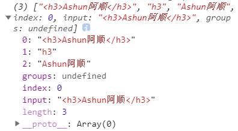

```
  {
        let title = "<h3>Ashun阿顺</h3>";
        let reg = /<(h[0-9])>(.+)<\/\1>/;
        console.log(title.match(reg));
        console.log(reg.exec(title));
  }
```

```text
let as = "Ashuntefannao.com";
console.log(as.match(/fan(nao)\.(com)/));
//["fannao.com", "nao", "com", index: 7, input: "Ashuntefannao.com", groups: undefined]
```


下面使用原子组匹配标题元素

```text
{
        let content = `
        <h1>阿顺特烦恼</h1>
        <span>阿顺</span>
        <h2>Ashun</h2>
      `;

        console.table(content.match(/<(h[1-6])[\s\S]*<\/\1>/g));
}
```

上面代码，在匹配标签对内容时，匹配的是任意字符，但是这样在同级别标题连续时，就会出错。

会将`<h1>阿顺特烦恼</h1> \n <h1>ashun</h1>`视为`<h1>阿顺……ashun</h1>`，两个标签的匹配结果只有一项

* 应该排除换行符。

```
{
        let content = `
        <h1>阿顺特烦恼</h1>
        <h1>Ashuntefannao</h1>
        <span>阿顺</span>
        <h2>Ashun</h2>
      `;

        console.table(content.match(/<(h[1-6])[\s\S]*<\/\1>/g));
        
        //标签内容应该排除换行符
        console.table(content.match(/<(h[1-6]).*<\/\1>/g));
        console.table(content.match(/^\s*<(h[1-6]).*<\/\1>\s*$/gm));
}
```

检测 `0~100` 的数值，使用 `parseInt` 将数值转为10进制

```text
console.log(/^(\d{1,2}|100)$/.test(parseInt(09, 10)));
```


#### 邮箱匹配

下面使用原子组匹配邮箱

```text
let email = "2300071698@qq.com";
let reg = /^[\w\-]+@[\w\-]+\.(com|org|cn|cc|net)$/i;
console.dir(email.match(reg));
```

如果邮箱是以下格式 `Ashuntefannao@as.com.cn` 上面规则将无效，需要定义以下方式

* 将`xxx.`这样的后缀，封装为分子组，匹配一个或多个

```text
let email = `admin@Ashun.com.cn`;
let reg = /^[\w-]+@([\w-]+\.)+(org|com|cc|cn)$/;
console.log(email.match(reg));
```


#### 引用原子组

* `\number` 在**匹配**时引用第`number`个原子组匹配的数据
* `$number` 在**替换**时引用第`number`个原子组匹配的数据。

下面将 标题标签 替换为 `p`标签

```text
let content = `
  <h1>Ashuntefannao</h1>
  <span>阿顺</span>
  <h2>SHUN</h2>
`;

let reg = /<(h[1-6])>(.*)<\/\1>/gi;
console.log(content.replace(reg, `<p>$2</p>`));
```


#### ? :

如果希望原子组**只参与匹配，不返回到结果当中**，可使用 `?:` 处理。`:?`置于原子组头部。

下面是获取所有域名的示例

* 由于下面第二层嵌套的原子组都使用`?:`处理，则在返回结果中，便没有了属性`2~n`，但有属性`1`返回第一层原子组匹配到的域名部分

```text
let webs = `
  https://www.Ashuntefannao.com
  http://Ashunwang.com
  https://Ashun.com
`;

let reg = /https?:\/\/((?:\w+\.)?\w+\.(?:com|org|cn))/gi;
while ((v = reg.exec(webs))) {
  console.dir(v);
}
```


#### 别名?<>

默认情况下，在不使用`g`模式时，并结合`str.match/reg.exec`方法时，各原子组匹配的结果将会存储到`1~n`属性中，但如果原子组过多，也就代表RegExp越复杂，就越不容易找到对应的原子组匹配结果。

如果希望返回的组数据更清晰，可以为原子组命名，结果将保存在返回的 `groups`字段中

* 语法`?<alia>`,将其置于原子组头部即可

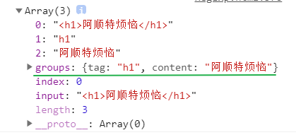

```text
let title = "<h1>阿顺特烦恼</h1>";
console.dir(title.match(/<(?<tag>h[1-6])(?<content>.*)<\/\1>/));
```


##### 引用别名原子组

别名不能在参与匹配时引用，若想引用对应原子组，还是通过`\number`进行引用

* `\number`，参与匹配时引用
* `$<alia>`，参与替换时使用

组别名使用 `?<>` 形式定义，下面将标签替换为`p`标签

```text
let txt = `
  <h1>Ashuntefannao</h1>
  <span>阿顺</span>
  <h2>SHUN</h2>
`;

let reg = /<(?<tag>h[1-6])>(?<content>[\s\S]*)<\/\1>/gi;
console.log(txt.replace(reg, `<p>$<content></p>`));
```

获取链接与网站名称组成数组集合

```text
<body>
  <a href="https://astfn.github.io">AshunBlog</a>
  <a href="https://www.hdcms.com">hdcms</a>
  <a href="https://www.sina.com.cn">新浪</a>
</body>

<script>
   let body = document.body;
   let reg = /^\s*<a.+href=.*(?<link>https?:\/\/([-\w]+\.)+(?:cn|com|org|cc|github|io)).*>(?<name>.*)<\/a>\s*$/gim;
    let arr = [];
    while ((exec = reg.exec(body.innerHTML))) {
      arr.push(exec["groups"]);
    }
    console.log(arr);
</script>
```


---

### 重复匹配

#### 基本使用

如果要重复匹配一些内容时我们要使用重复匹配修饰符，包括以下几种。

| 符号  | 说明             |
| ----- | ---------------- |
| *     | 重复零次或更多次 |
| +     | 重复一次或更多次 |
| ?     | 重复零次或一次   |
| {n}   | 重复n次          |
| {n,}  | 重复n次或更多次  |
| {n,m} | 重复n到m次       |

重复匹配可以应用于:

* 单个字符
* 原子表
* 原子组

>因为正则最小单位是元字符，而我们很少只匹配一个元字符如a、b所以基本上重复匹配在每条正则语句中都是必用到的内容。

默认情况下,重复选项对单个字符进行重复匹配，是贪婪匹配，一只匹配到不重复为止。

```text
let as = "assshun";
console.log(as.match(/as+/i)); //asss
```

使用原子组后则对整个组重复匹配

```text
let as = "ashunAshuntefannao";
console.log(as.match(/(ashun)+/i)); //ashunAshun
```

下面是验证坐机号的正则

```text
let tell = "010-12345678";
console.log(/^0\d{2,3}-\d{7,8}$/.exec(tell));
```

验证用户名只能为3~8位的字母或数字，并以字母开始

* 像这种严格约束的正则，需要用`^…$`进行约束，若不使用其进行约束，那么如果用户名符合字母\数字，但是位数超过8位，也能匹配成功，只不过只返回前8位。

```text
<body>
  <input type="text" name="username" />
</body>
<script>
  {
        let input = document.querySelector("[name='username']");
        let reg = /^[a-zA-Z](\d|[a-zA-Z]){2,7}$/;
        input.addEventListener("input", function () {
          console.log(reg.test(this.value) ? "正确" : "错误");
        });
   }
</script>
```

验证密码必须包含大写字母并在5~10位之间

* 多种验证组合，可以将regexp置于数组中，遍历数组过程中对str进行判断

```text
<body>
<input type="text" name="password" />
</body>
<script>
let input = document.querySelector(`[name="password"]`);
input.addEventListener("keyup", e => {
  const value = e.target.value.trim();
  const regs = [/^[a-zA-Z0-9]{5,10}$/, /[A-Z]/];
  let state = regs.every(v => v.test(value));
  console.log(state ? "正确！" : "密码必须包含大写字母并在5~10位之间");
});
</script>
```


---

#### 禁止贪婪

正则表达式在进行重复匹配时，**默认是贪婪匹配模式**，也就是说会尽量匹配更多内容，但是有的时候我们并不希望他匹配更多内容，这时可以通过 **`?`** 对 重复匹配语法 进行修饰，会尽可能的少匹配。

| 使用   | 说明                      |
| ------ | ------------------------- |
| *?     | 0个或多个，但尽可能少重复 |
| +?     | 1个或多个，但尽可能少重复 |
| ??     | 0个或1个，但尽可能少重复  |
| {n,m}? | n~m个，但尽可能少重复     |
| {n,}?  | >=n个，但尽可能少重复     |

下面是禁止贪婪的语法例子

```
   {
        let str = "assshun";
        // let reg = /as+?/;      //as
        // let reg = /as*?/;      //a
        // let reg = /as??/;      //a
        // let reg = /as{2,}?/;   //ass
        // let reg = /as{2,3}?/;  //ass

        console.log(str.match(reg));
   }
```

将所有span更换为`h5` 并描红，并在内容前加上 `阿顺-`

* 之前我们提到过，在匹配标签时，标签对的内容要忽略换行符，为了避免同名标签连续时，合并匹配的情况
* 其实我们也可使用禁止贪婪，来进行约束，并且禁止贪婪情况下，也就不必使用`m`模式配合`^$`进行严格约束了。

```text
<body>
  <main>
    <span>ashunwang</span>
    <span>ashun.com</span>
    <span>ashuntefannao.com</span>
  </main>
</body>
<script>
  const main = document.querySelector("main");
  const reg = /<span>([\s\S]+?)<\/span>/gi;
  main.innerHTML = main.innerHTML.replace(reg, (v, p1) => {
    console.log(p1);
    return `<h4 style="color:red">后盾人-${p1}</h4>`;
  });
</script>
```

下面是使用禁止贪婪查找页面中的标题元素

```text
<body>
 		<div id="content">
      ashuntefannao
      <h1>ashun</h1>
    </div>
    <h1>ashuntefannao</h1>
    <h1>ashuntefannao</h1>
    <h2>ASHUN</h2>
</body>

<script>
{
        let body = document.body.innerHTML;
        let reg = /<(h[1-6])>[\s\S]*?<\/\1>/gi;
        // let reg = /^\s*?<(h[1-6])>[\s\S]*?<\/\1>\s*?$/gim;
        console.table(body.match(reg));
}
</script>
```


---

### 细节返回

#### 问题分析

通过之前的使用，我们知道`str.match`方法：

* 在非`g`全局匹配模式下，只返回一个匹配结果，并且包含匹配细节参数
* 在`g`模式下，返回一个包含所有匹配内容的Array，但是每个元素不包含匹配细节

```text
<body>
  <h1>Ashuntefannao.com</h1>
  <h2>ashun.com</h2>
  <h1>阿顺特烦恼</h1>
</body>

<script>
  function elem(tag) {
    const reg = new RegExp(`<(${tag}).*>.+?</\\1>`, "g");
    return document.body.innerHTML.match(reg);
  }
  console.table(elem("h1"));
</script>
```


#### matchAll

在**新版本浏览器**中支持使用 `matchAll` 操作，并返回迭代对象

> 需要添加 `g` 修饰符

```
   {
        let str = "as";
        let reg = /./g;
        let iterator = str.matchAll(reg);
        console.log(iterator.next()); //{ value:Array(1), done:false }
        console.log(iterator.next()); //{ value:Array(1), done:false }
        console.log(iterator.next()); //{ value:undefined, done:true }
    }
```

可迭代对象可使用`for/of`遍历

```text
let str = "Ashuntefannao";
let reg = /[a-z]/ig;
for (const iterator of str.matchAll(reg)) {
  console.log(iterator);
}
```

在原型定义 `matchAll`方法，用于在旧浏览器中工作，不需要添加`g` 模式运行

```text
{
        String.prototype.matchAll = function (reg) {
          let match = this.match(reg);
          if (match) {
            let str = this.replace(reg, "^".repeat(match[0].length));
            let matchArr = str.matchAll(reg) || [];
            return [match, ...matchArr];
          }
        };
        let reg = /a/;
        console.log("ashuna".matchAll(reg));
}
```


#### exec

使用 `g` 模式修正符并结合 `exec` 循环操作可以获取结果和匹配细节

```text
<body>
  <h1>ashuntefannao.com</h1>
  <h1>阿顺</h1>
  <h2>Ashun.com</h2>
</body>
<script>
  function search(string, reg) {
    const matchs = [];
    while ((data = reg.exec( string))) {
      matchs.push(data);
    }
    return matchs;
  }
  console.log(search(document.body.innerHTML, /<(h[1-6]).*?>[\s\S]+?<\/\1>/gi));
</script>
```

使用上面定义的函数来检索字符串中的网址

```text
let sites = `https://ashunwang.com  
https://www.sina.com.cn
https://astfn.github.io`;

let res = search(sites, /https?:\/\/(\w+\.)?(\w+\.)+(com|cn|io)/gi);
console.dir(res);
```


---

### 字符方法

下面介绍的方法是 `String` 提供的支持正则表达式的方法

#### search

`search(str/reg)` 方法用于检索字符串中指定的子字符串，也可以使用正则表达式搜索，返回值为索引位置

```text
let str = "Ashuntefannao.com";
console.log(str.search(".com"));
```

使用正则表达式搜索

```text
console.log(str.search(/\.com/i));
```

#### match

直接使用字符串搜索

```text
let str = "Ashuntefannao.com";
console.log(str.match("com"));
```

使用正则获取内容，下面是简单的搜索字符串, 非`g`模式下，只匹配一次，且返回详细参数信息。

```text
let as = "Ashuntefannao";
let res = as.match(/a/i);
console.log(res);
console.log(res[0]); //匹配的结果
console.log(res[index]); //出现的位置
```

如果使用 `g` 修饰符时，就不会有结果的详细信息了（可以使用exec），下面是获取所有h1~6的标题元素

```text
let body = document.body.innerHTML;
let result = body.match(/<(h[1-6]).*?>[\s\S]+?<\/\1>/g);
console.table(result);
```

#### matchAll

在新浏览器中支持使用 `matchAll` 结合`g`模式操作，并返回迭代对象

```text
let str = "Ashuntefannao";
let reg = /[a-z]/ig;
for (const iterator of str.matchAll(reg)) {
  console.log(iterator);
}
```


#### split

用于使用字符串或正则表达式分隔字符串，下面是使用字符串分隔日期

```text
let str = "2023-02-12";
console.log(str.split("-")); //["2023", "02", "12"]
```

如果日期的连接符不确定，那就要使用正则操作了

```text
let str = "2023/02-12";
console.log(str.split(/-|\//));
```


#### replace

`replace` 方法不仅可以执行基本字符替换，也可以进行正则替换，下面替换日期连接符

```text
let str = "2023/02/12";
console.log(str.replace(/\//g, "-")); //2023-02-12
```

替换字符串可以插入下面的特殊变量名：

| 变量      | 说明                                                         |
| --------- | ------------------------------------------------------------ |
| $$        | 插入一个 "$"。                                               |
| $&        | 插入匹配的结果。                                             |
| $`        | 插入当前匹配的子串左边的内容。                               |
| $'        | 插入当前匹配的子串右边的内容。                               |
| $n        | 假如第一个参数是 `RegExp` ，并且 n 是个小于100的非负整数，则`$n`意为：插入第 n 个原子组匹配的字符串。提示：索引是从1开始 |
| $\<alia\> | 与`$n`类似，也是插入原子组匹配的内容，但`$<alia>`是通过别名锁定对应原子组 |

在"阿顺"前后再分别添加2个`=`

```text
let as = "=阿顺=";
console.log(as.replace(/阿顺/g, "$`$`$&$'$'")); // ===阿顺===
```

把电话号用 `-` 连接

```text
let tell = "(010)99999999 (020)8888888";
console.log(tell.replace(/\((\d{3,4})\)(\d{7,8})/g, "$1-$2"));
```

把所有`阿顺`关键字加上链接 `https://www.Ashuntefannao.com`

```text
<body>
  阿顺特烦恼希望大家没有烦恼，阿顺讨厌烦恼
</body>
<script>
  const body = document.body;
  body.innerHTML = body.innerHTML.replace(
    /阿顺/g,
    `<a href="https://www.Ashuntefannao.com">$&</a>`
  );
</script>
```


----

##### **回调函数**

replace 支持回调函数操作，用于处理复杂的替换逻辑，回调函数参数与`str.match\str.matchAll\reg.exec`返回的详细参数是对应的。

| 变量名            | 代表的值                                                     |
| ----------------- | ------------------------------------------------------------ |
| `str`             | 匹配的子串。（对应于上述的$&。）                             |
| `p1,p2, ...`      | 假如replace()方法的第一个参数是一个 `RegExp` ，则代表第n个原子组匹配的字符串。 |
| `index`           | 匹配到的子字符串在原字符串中的索引。（比如，如果原字符串是 `'abcd'`，匹配到的子字符串是 `'bc'`，那么这个参数将会是 1） |
| `source`          | 被匹配的原字符串。                                           |
| NamedCaptureGroup | 命名捕获组匹配的对象                                         |

将关于ashun的链接协议全部置为`https` ，并补全 `www.`

```text
<body>
  <main>
    <a style="color: red" href="http://www.ashun.com"> 阿顺 </a>
    <a id="l1" href="http://Ashuntefannao.com">阿顺特烦恼</a>
    <a href="http://yahoo.com">雅虎</a>
    <h4>http://www.ashun.com</h4>
  </main>
</body>
<script>
 {
        let reg = /(<a.*?)(http)?(:\/\/)(www\.)?(Ashuntefannao|ashun)/g;
        let body = document.body;
        body.innerHTML = body.innerHTML.replace(reg, (val, ...args) => {
          args[1] = "https";
          args[3] = args[3] || "www.";
          return args.slice(0, 5).join("");
        });
        console.log(body.innerHTML.match(reg));
  }
</script>
```

将标题标签全部替换为 `p` 标签

```text
<body>
  <h1>Ashuntefannao.com</h1>
  <h2>ashun.com</h2>
  <h1>阿顺特烦恼</h1>
</body>

<script>
  const reg = /<(h[1-6])>(.*?)<\/\1>/g;
  const body = document.body.innerHTML;
  const html = body.replace(reg, function(str, tag, content) {
    return `<p>${content}</p>`;
  });
  document.body.innerHTML = html;
</script>
```

删除页面中的 `h1~h6` 标签

```text
<body>
  <h1>Ashuntefannao.com</h1>
  <h2>ashun.com</h2>
  <h1>阿顺特烦恼</h1>
</body>
<script>
  const reg = /<(h[1-6])>(.*?)<\/\1>/g;
  const body = document.body.innerHTML;
  const html = body.replace(reg, "");
  document.body.innerHTML = html;
</script>
```

使用回调函数将 `阿顺` 添加上链接

```text
<body>
  <div class="content">
    阿顺特烦恼希望大家没有烦恼,阿顺讨厌烦恼
  </div>
</body>

<script>
  let content = document.querySelector(".content");
  content.innerHTML = content.innerHTML.replace("阿顺", function(
    search,
    index,
    source
  ) {
    return `<a href="https://www.Ashuntefannao.com">${search}</a>`;
  });
</script>
```

为所有标题添加上 `hot` 类

```text
<body>
  <div class="content">
    <h1>Ashuntefannao.com</h1>
  	<h2>ashun.com</h2>
  	<h1>阿顺特烦恼</h1>
  </div>
</body>
<script>
  let content = document.querySelector(".content");
  let reg = /<(h[1-6])(.*?)>([\s\S]*?)<\/\1>/gi;
  content.innerHTML = content.innerHTML.replace(
    reg,
    (
      search, //匹配到的字符
      p1, //第一个原子组
      p2, //第二个原子组
      p3, //第三个原子组
      index, //索引位置
      source //原字符
    ) => {
      return `
    <${p1}${p2} class="hot">${p3}</${p1}>
    `;
    }
  );
</script>
```


---

### 正则方法

下面是 `RegExp` 正则对象提供的操作方法

#### test

`reg.test(str)`用于判断str是否符合匹配条件，返回Boolean

检测输入的邮箱是否合法

```text
<body>
  <input type="text" name="email" />
</body>

<script>
  let email = document.querySelector(`[name="email"]`);
  email.addEventListener("keyup", e => {
    console.log(/^\w+@\w+\.\w+$/.test(e.target.value));
  });
</script>
```

#### exec

配合 `g` 模式使用时，`reg.exec(str)`可以循环调用直到全部匹配完。

- 配合 `g` 模式使用时，应一直操作同一个正则，即把正则定义为变量使用，这样才能够不断的向后匹配
- 使用 `g` 修饰符最后匹配不到时返回 `null`

计算内容中阿顺出现的次数

```text
<body>
  <div class="content">
    阿顺特烦恼希望大家没有烦恼，阿顺讨厌烦恼	--阿顺
  </div>
</body>

<script>
  let content = document.querySelector(".content");
  let reg = /(?<tag>阿顺)/g;
  let num = 0;
  while ((result = reg.exec(content.innerHTML))) {
    num++;
  }
  console.log(`阿顺共出现${num}次`);
</script>
```


---

### 断言匹配

断言虽然写在扩号中但`它不是组`，所以**不会在匹配结果中保存**，可以将断言理解为`正则中的条件`。

| 断言匹配语法 | 含义                                             |
| ------------ | ------------------------------------------------ |
| (?=exp)      | 将其放置于匹配内容的后面，用于约束后面的匹配内容 |


#### (?=exp)

**零宽先行断言** `(?=exp)` 匹配后面为 `exp` 的内容

把后面内容为`特烦恼` 的`阿顺`加上链接.

* 断言匹配的结果不会返回到内容当中，以下replace接收到的第一个参数只有`阿顺`
* 断言匹配，只是一个约束条件。

```
<body>
  <main>
    阿顺特烦恼希望大家没有烦恼，阿顺讨厌烦恼。
  </main>
</body>

<script>
  const main = document.querySelector("main");
  const reg = /阿顺(?=特烦恼)/gi;
  main.innerHTML = main.innerHTML.replace(
    reg,
    v => `<a href="https://Ashuntefannao.com">${v}</a>`
  );
</script>
```

下面是将价格后面 添加上 `.00`

```text
<script>
  let lessons = `
    js,200元,300次
    php,300.00元,100次
    node.js,180元,260次
  `;
  let reg = /(\d+)(.00)?(?=元)/gi;
  lessons = lessons.replace(reg, (v, ...args) => {
    args[1] = args[1] || ".00";
    return args.splice(0, 2).join("");
  });
  console.log(lessons);
</script>
```

使用断言验证用户名必须为五位，下面正则体现断言是不是组，并且不在匹配结果中记录

```text
<body>
  <input type="text" name="username" />
</body>

<script>
  document
    .querySelector(`[name="username"]`)
    .addEventListener("keyup", function() {
      let reg = /^(?=[a-z]{5}$)/i;
      console.log(reg.exec(this.value));
    });
</script>
```


#### (?<=exp)

**零宽后行断言** `?<=exp` 匹配前面为 `exp` 的内容

匹配前面是`Ashuntefannao` 的数字

```text
let str = "Ashuntefannao789Ashun666";
let reg = /(?<=Ashuntefannao)\d+/i;
console.log(str.match(reg)); //789
```

匹配前后都是数字的内容

```text
{
        let str = "Ashuntefannao789Ashun123";
        let reg = /(?<=\d)[a-z]+(?=\d)/gi;
        // let reg = /(?<=\d{3}).+(?=\d{3})/g;
        console.log(str.match(reg));
}
```

所有a标签的超链接替换为`Ashuntefannao.com`

```text
<body>
  <a href="https://baidu.com">百度</a>
  <a href="https://yahoo.com">雅虎</a>
</body>
<script>
  const body = document.body;
  let reg = /(?<=<a.*href=(['"])).+?(?=\1)/gi;
  // console.log(body.innerHTML.match(reg));
  body.innerHTML = body.innerHTML.replace(reg, "https://Ashuntefannao.com");
</script>
```

把前面内容为`阿顺` 的`特烦恼`加上链接.

```text
<body>
  <main>
    阿顺特烦恼希望大家没有烦恼，阿顺讨厌烦恼。
  </main>
</body>

<script>
  const main = document.querySelector("main");
  const reg = /(?<=阿顺)特烦恼/gi;
  main.innerHTML = main.innerHTML.replace(
    reg,
    v => `<a href="https://Ashuntefannao.com">${v}</a>`
  );
</script>
```

将电话的后四位模糊处理

```text
let users = `
  阿顺电话: 12345678901
  客服电话: 98745675603
`;

let reg = /(?<=\d{7})\d+\s*/g;
users = users.replace(reg, str => {
  return "*".repeat(4);
});
console.log(users); //阿顺电话: 1234567**** 客服电话: 9874567****
```

获取标题中的内容

```text
let th = `<h1>阿顺特烦恼</h1>`;
let reg = /(?<=<h1.*?>).*(?=<\/h1>)/g;
console.log(th.match(reg));
```


#### (?!exp)

**零宽负向先行断言** 后面<font color="#16a085">不能出现</font> `exp` 指定的内容

使用 `(?!exp)`字母后面不能为两位数字

```text
let str = "Ashun12";
let reg = /[a-z]+(?!\d{2})$/i;
console.table(reg.exec(str));
```

下例为用户名中不能出现`阿顺`

* 下例中，`(?!exp)`前面什么也没有，即`""`后面不准出现阿顺，也就是任意一个地方后面不能出现阿顺

```text
<body>
  <main>
    <input type="text" name="username" />
  </main>
</body>
<script>
  const input = document.querySelector(`[name="username"]`);
  input.addEventListener("keyup", function() {
    const reg = /^(?!.*阿顺)[(\w)(\p{sc=Han})]{5,6}$/iu;
    console.log(this.value.match(reg));
  });
</script>
```


#### (?<!exp)

**零宽负向后行断言** 前面<font color="#16a085">不能出现</font>exp指定的内容

获取前面不是数字的字符

```text
let str = "Ashun99shun";
let reg = /(?<!\d)[a-z]+/i;
console.log(reg.exec(str)); //Ashun
```

把所有不是以 `https://oss.Ashuntfn.com` 开始的静态资源替换为新网址

```text
<body>
  <main>
    <a href="https://www.Ashuntfn.com/1.jpg">1.jpg</a>
    <a href="https://oss.Ashuntfn.com/2.jpg">2.jpg</a>
    <a href="https://cdn.Ashuntfn.com/2.jpg">3.jpg</a>
    <a href="https://Ashuntfn.com/2.jpg">3.jpg</a>
  </main>
</body>
<script>
  const main = document.querySelector("main");
  let reg = /https:\/\/(?<!oss\.).+?(?=\/)/gi;
  main.innerHTML = main.innerHTML.replace(reg, v => {
    console.log(v);
    return "https://oss.Ashuntfn.com";
  });
</script>
```


## Promise

`JavaScript` 中存在很多异步操作,`Promise` 将异步操作队列化，按照期望的顺序执行，返回符合预期的结果。可以通过链式调用多个 `Promise` 达到我们的目的。

Promise 在各种开源库中已经实现，现在标准化后被浏览器默认支持。

> promise 是一个拥有 `then` 方法的对象或函数

### 问题探讨

下面通过多个示例来感受一下不使用 `promise` 时，处理相应问题的不易，及生成了不便阅读的代码。

#### 定时嵌套

下面是一个定时器执行结束后，执行另一个定时器，这种嵌套造成代码不易阅读

```
 <style>
      div {
        position: absolute;
        width: 100px;
        height: 100px;
        background-color: pink;
      }
</style>
<body>
    <div></div>
</body>
<script>
      function createInterval(callback, delay = 50) {
        let timer = setInterval(() => {
          callback(timer);
        }, delay);
      }
      const div = document.querySelector("div");
      console.log(parseFloat(window.getComputedStyle(div).left));

      function run() {
        createInterval((timer) => {
          div.style.left =
            parseFloat(window.getComputedStyle(div).left) + 2 + "px";
          // console.log("left");
          if (parseFloat(div.style.left) >= 50) {
            clearInterval(timer);
            createInterval((timer) => {
              div.style.width =
                parseFloat(window.getComputedStyle(div).width) - 2 + "px";
              // console.log("width");
              parseFloat(div.style.width) <= 0 && clearInterval(timer);
            });
          }
        });
      }
      div.addEventListener("click", run);
</script>
```

#### 图片加载

下面是图片后设置图片边框，也需要使用回调函数处理，代码嵌套较复杂

```text
      function createImage(file, resolve, reject) {
        const img = new Image();
        img.src = file;
        img.onload = () => {
          resolve(img);
          console.log("image Loading fulfilled");
        };
        img.onerror = () => {
          console.log("image loading fail");
        };
        document.body.append(img);
      }

      createImage("./images/img1.jpg", (img) => {
        img.style.border = "5px solid pink";
      });
```


#### 加载文件

下面是异步加载外部`JS`文件，需要使用回调函数执行，并设置的错误处理的回调函数

```text
      function loadJS(file, resolve, reject) {
        let script = document.createElement("script");
        script.src = file;
        script.onload = resolve;
        script.onerror = reject;
        document.body.append(script);
      }
      loadJS(
        "./js/ashun.js",
        (script) => {
          console.log(`${script.path[0].src}  load Resolve`);
          title();
        },
        (err) => console.log(`${err.srcElement.src}  load Reject`)
      );
```

实例中用到的 `ashun.js` 与 `SHUN.js` 内容如下

```text
# ashun.js
function title() {
  console.log("title method");
}

# SHUN.js
function run() {
  title();
  console.log("run method");
}
```

如果要加载多个脚本时需要嵌套使用，下面`SHUN.js` 依赖 `ashun.js`，需要先加载`ashun.js` 后加载`SHUN.js`

> 不断的回调函数操作将产生回调地狱，使代码很难维护

```text
function loadJS(file,resolve,reject){……}

   loadJS(
        "/js/ashun.js",
        (script) => {
          loadJS(
            "/js/SHUN.js",
            (script) => {
              run();
              console.log(`${script.path[0].src}  load Resolve`);
            },
            (err) => {
              console.log(`${err.srcElement.src}加载失败`);
            }
          );
          console.log(`${script.path[0].src}  load Resolve`);
        },
        (err) => {
          console.log(`${err.srcElement.src}加载失败`);
        }
    );
```


#### 异步请求

使用传统的异步请求也会产生回调嵌套的问题。

比如若要获取商品的详情，就要分为两步

1. 先请求商品数据，得到商品的id
2. 根据商品id请求获取对应商品的详情数据。

以下接口无实际用途，仅作示例，可自己编写

```text
function ajax(url, resolve, reject) {
  let xhr = new XMLHttpRequest();
  xhr.open("GET", url);
  xhr.send();
  xhr.onload = function() {
    if (this.status == 200) {
      resolve(JSON.parse(this.response));
    } else {
      reject(this);
    }
  };
}
ajax("http://localhost:8888/goodslist/data, goods => {
  ajax(
    `http://localhost:8888/category?id=${goods["id"]}`,
    response => {
      console.log(response[0]);
    }
  );
});
```


#### 肯德基

下面是模拟肯德基吃饭的事情，使用 `promise` 操作异步的方式每个阶段会很清楚

```text
      let kfc = new Promise((resolve, reject) => {
        console.log("肯德基正在为您做餐……");
        setTimeout(() => {
          resolve("餐品已经做好，为您上桌");
        }, 2000);
      });
      let as = kfc.then((result) => {
        console.log(result);
        console.log("阿顺收到消息");
        return {
          then(resolve, reject) {
            setTimeout(() => {
              resolve("我吃了2秒，不辣，张三你可以吃了");
            }, 2000);
          },
        };
      });

      let zhangsan = as.then((msg) => {
        return new Promise((resolve, reject) => {
          console.log("张三收到阿顺消息：" + msg);
          setTimeout(() => {
            let msg = "我吃了1秒，真好吃， 李四也尝尝吧";
            console.log(msg);
            resolve(msg);
          }, 1000);
        });
      });
      let lisi = zhangsan.then((result) => {
        console.log("李四收到消息：" + result);
        setTimeout(() => {
          console.log("李四:我吃了1秒，不错不错");
        }, 1000);
      });
```

而使用以往的回调方式，就会让人苦不堪言

```text
      function notice(msg, then) {
        then(msg);
      }
      function meal() {
        notice("肯德基厨房开始做饭", (msg) => {
          console.log(msg);
          notice("我是肯德基，你的餐已经做好", (msg) => {
            console.log(`阿顺收到肯德基消息: ${msg}`);
            setTimeout(() => {
              notice("张三，我吃了两秒了，不辣，你可以吃了", (msg) => {
                console.log(`张三收到阿顺消息: ${msg}`);
                setTimeout(() => {
                  notice("很好吃，李四也尝尝吧", (msg) => {
                    console.log(msg);
                    notice("李四收到消息", (msg) => {
                      console.log(msg);
                      setTimeout(() => {
                        console.log("李四:不错不错");
                      }, 1000);
                    });
                  });
                }, 2000);
              });
            }, 2000);
          });
        });
      }
      meal();
```


---

### 异步状态

Promise 意为承诺，就像我们去饭店用餐，点完餐后服务员会给我们一个票号，如果饭菜做好，我们凭借票号去领餐，这就代表成功状态，若由于其它原因饭菜不能够顺利做好，这就代表拒绝状态。在得到这些结果前，我们一直处于等待的状态。

- 一个 `promise` 必须有一个 `then` 方法用于处理状态改变

#### 状态说明

Promise包含`pending`、`fulfilled`、`rejected`三种状态

- `pending` 指等待状态，初始化 `promise` 时的状态
- `resolve` 指已经解决，将 `promise` 状态设置为`fulfilled`
- `reject` 指拒绝处理，将 `promise` 状态设置为`rejected`
- `promise` 是生产者，通过 `resolve` 与 `reject` 函数告知结果
- `promise` 非常适合需要一定执行时间的异步任务
- 同一Promise状态一旦确定(`fufilled\rejected`),状态将不可再次更改

promise 是队列状态，就像体育中的接力赛，或多米诺骨牌游戏，状态一直向后传递，当然 也可更改其中的任何一个promise的状态，来影响后续的promise。


promise 没有使用 `resolve` 或 `reject` 更改状态时，默认状态为 `pending`

```text
console.log(
  new Promise((resolve, reject) => {
  });
); //Promise {<pending>}
```

当更改状态后

```text
console.log(
  new Promise((resolve, reject) => {
    resolve("fulfilled");
  })
); //Promise {<resolved>: "fulfilled"}

console.log(
  new Promise((resolve, reject) => {
    reject("rejected");
  })
); //Promise {<rejected>: "rejected"} //Error
```

若一个Promise为`rejected`状态，却没有处理，系统会发出警示。

```
console.log(
  new Promise((resolve, reject) => {
    reject("rejected");
  })
); //Promise {<rejected>: "rejected"} //Error:Uncaught (in promise) rejected
```

使用`then\catch`处理后，不会报错，`then\catch`这些方法默认也会返回一个新的`promise`

```
console.log(
        new Promise((resolve, reject) => {
          reject("rejected");
        }).catch((err) => {})
); //Promise {<pending>}
```

按理来说上述Promise已经确认为rejected状态，也经过了`then\catch`的onRejected回调函数处理，应该返回`fufilled`状态（`then\catch`默认返回的promise状态为fufilled），但是为什么返回pending状态呢？

* console.log是同步代码会立即执行，当日志信息被打印时，promise的状态还未被确认，所以返回pending
* 将打印放在宏任务队列中，可看到正确结果

关于`任务队列`，下一章节会详细讲解

```
      let promise = new Promise((resolve, reject) => {
        reject("rejected");
      });
      let p1 = promise.catch((err) => err);
      
      console.log(promise)//Promise {<rejected>:"rejected"}
      console.log(p1);		//Promise {<pending>}
      setTimeout(() => {
        console.log(p1);	//Promise {<fulfilled>:"rejected"}
      });  
```

`promise` 自创建时，立即执行同步任务，`then` 会放在异步微任务中执行，需要等同步任务执行后才执行。

```text
let promise = new Promise((resolve, reject) => {
  resolve("fulfilled");
  console.log("阿顺");
});
promise.then(msg => {
  console.log(msg);
});
console.log("阿顺特烦恼");
// 阿顺 阿顺特烦恼 fulfilled
```

```
const promise = new Promise((resolve) => {
	resolve("fulfilled");
});
promise.then(alert);
alert("阿顺特烦恼");
promise.then((_) => alert("ashuntefannao"));
```

下例在三秒后将 `Promise` 状态设置为 `fulfilled` ，然后执行 `then` 方法

```text
new Promise((resolve, reject) => {
  setTimeout(() => {
    resolve("fulfilled");
  }, 3000);
}).then(
  msg => {
    console.log(msg);
  },
  error => {
    console.log(error);
  }
);
```

状态被改变后就不能再修改了，下面先通过`resolve` 改变为成功状态，表示`promise` 状态已经完成，就不能使用 `reject` 更改状态了

```text
new Promise((resolve, reject) => {
  resolve("操作成功");
  reject(new Error("请求失败"));
}).then(
  msg => {
    console.log(msg);
  },
  error => {
    console.log(error);
  }
);
```


#### 动态改变

可以在一个`promise`中，通过处理另一个`promise1`，来改变`promise`的状态。

当在一个`promise`中，告知状态时传入的是另一个`promise1`，则后续使用`then`或其它方法对其进行处理时，处理的已经不再是promise的状态，而是promise1。

* 在p2中确认`resolve`状态，但在后续的`then`中却执行了`rejected`回调函数。
* 在p2中确认状态时，返回的是p1，那么后续处理的promise将是p1，p2的状态已经无意义

```
{
      let p1 = new Promise((resolve, reject) => {
        reject("p1 reject");
      });
      
      let p2 = new Promise((resolve, reject) => {
        console.log(`p2发送resolve状态`);
        resolve(p1);
      }).then(
        (result) => console.log(`p2 处理结果:fulfilled--${result}`),
        (err) => console.log(`p2 处理结果:rejected--${err}`)
      );
}
```


---

### then

一个promise 需要提供一个then方法访问promise 结果，`then` 用于当 `promise` 状态发生改变时的处理，即`promise`处理异步操作过程，`then` 用于处理结果。

`promise` 就像 `饭馆` 中的厨房，`then` 就是我们用户，如果餐做好了即 `fulfilled` ，做不了拒绝即`rejected` 状态。那么 then 就要对不同状态处理。

- then 方法 **必须** 返回 promise，用户返回或系统自动返回
- 第一个函数在`resolved` 状态时执行，即使用`resolve`确认完成状态时，执行`then`第一个callback处理成功状态
- 第二个函数在`rejected`状态时执行，即使用`reject`确认拒绝状态时，执行第二个callback处理失败状态，该函数是可选的
- 两个callback都接收 `promise` 确认状态时传入的值做为参数
- 也可以使用`catch` 来处理失败的状态
- 如果在 `then` 中手动返回 `promise` ，下一个`then` 会在上一个then返回的`promise` 状态改变后执行

#### 语法说明

then的语法如下，onFulfilled 函数处理 `fulfilled` 状态， onRejected函数处理 `rejected` 状态

- onFulfilled 或 onRejected `不是函数将被忽略`
- 两个函数只会被调用一次
- onFulfilled 在 promise 执行成功时调用
- onRejected 在 promise 执行拒绝时调用

```text
promise.then(onFulfilled, onRejected)
```


---

#### 基础知识

`then` 会在 `promise` 确认状态后执行，`then` 第一个callback在 `resolve`成功状态执行

```text
const promise = new Promise((resolve, reject) => {
  resolve("success");
}).then(
  value => {
    console.log(`解决：${value}`);
  },
  reason => {
    console.log(`拒绝:${reason}`);
  }
);
```

`then` 中第二个参数在失败状态执行

```text
const promise = new Promise((resolve, reject) => {
  reject("is error");
});
promise.then(
  msg => {
    console.log(`成功：${msg}`);
  },
  error => {
    console.log(`失败:${error}`);
  }
);
```

如果只关心成功则不需要传递 `then` 的第二个参数

```text
const promise = new Promise((resolve, reject) => {
  resolve("success");
});
promise.then(msg => {
  console.log(`成功：${msg}`);
});
```

如果只关心失败时状态，`then` 的第一个参数传递 `null`

```text
const promise = new Promise((resolve, reject) => {
  reject("is error");
});
promise.then(null, error => {
  console.log(`失败:${error}`);
});
```

promise 确认状态后转入的参数，会传入到`then`对应callback的参数中，如果then没有可处理函数，会一直向后传递

```text
let p1 = new Promise((resolve, reject) => {
	reject("rejected");
})
.then()
.then(
  null,
  f => console.log(f)
);
```

```
let promise = new Promise((resolve, reject) => {
  resolve("resolve");
});
let p2 = promise.then();
p2.then().then(resolve => {
  console.log(resolve);
});
```

```
let promise = new Promise((resolve, reject) => {
  reject("reject");
});
let p2 = promise.then(() => {});
p2.then(null, null).then(null, reject => {
  console.log(reject);
});
```


#### 链式调用

* `then\catch`等promise的方法，是对上一个promise状态的处理，而使用`then/catch`后 它们本身又会默认返回一个新的promise，且状态为`fulfilled`,所以then才可不断地链式调用。
* 当然，也可以在`then\catch`中手动返回自定义的promise，可通过这个promise，改变当前then的状态


每次的 `then` 都是一个全新的 `promise`， then 默认返回的 promise 状态是 fulfilled

```
   {
        let promise = new Promise((resolve, reject) => {
          reject("promise state rejected");
        });
        promise
          .then(null, (err) => console.log(err))
          .then((_) => console.log("then默认状态为fulfilled"));
   }
```

每次的 `then` 都是一个全新的 `promise`，不要认为上一个 promise状态会影响以后then返回的状态

```text
let p1 = new Promise(resolve => {
  rejected("p1 rejected");
});
let p2 = p1.then(null,rej=>console.log(reg));
p2.then(() => {
  console.log("Ashuntefannao");
});

console.log(p1); // Promise {<resolved>}
console.log(p2); // Promise {<pending>}

setTimeout(() => {
  console.log(p1); // Promise {<resolved>}
  console.log(p2); // Promise {<resolved>}
});
```

`then` 是对上个promise 的处理，每个 `then` 又会返回一个promise，默认传递 `fulfilled`状态，所以才可以不断地链式调用then处理promise。

```text
new Promise((resolve, reject) => {
  reject();
})
.then(
  resolve => console.log("fulfilled"),
  reject => console.log("rejected")
)
.then(
  resolve => console.log("fulfilled"),
  reject => console.log("rejected")
)
.then(
  resolve => console.log("fulfilled"),
  reject => console.log("rejected")
);
  
# 执行结果如下
  rejected
  fulfilled
  fulfilled
```

如果内部手动返回 `promise` 时，后续处理的便是该 `promise`，即该promise可以改变当前then的状态

```
 {
        let promise = new Promise((resolve, reject) => {
          reject("promise state rejected");
        });
        promise
          .then(
            (result) => console.log("fulfilled"),
            (reject) => console.log(reject)
          )
          .then(
            (res) => console.log("fufilled"),
            (rej) => console.log("rejected")
          )
          .then((res) => {
            console.log("fufilled");
            return Promise.reject("手动返回的promise，状态为rejected");
          })
          .then(
            (res) => console.log("fufilled"),
            (rej) => console.log(rej)
          );
 }
 # 执行结果如下
  "promise state rejected"
  "fulfilled"
  "fulfilled"
  "手动返回的promise，状态为rejected"
```

若手动返回的不是Promise，则下一个then处理的还是 上一个then默认返回的Promise，状态为fulfilled。

* 但是下一个then对应的处理函数，会接受上一个then返回的参数。

```
{
        let promise = new Promise((resolve, reject) => {
          reject("promise state rejected");
        });
        let p1 = promise.then(null, (rej) => {
        	console.log(rej)
          return "p1 rejected";
        });
        let p2 = p1.then((res) => {
          console.log(`p2 fulfilled \n${res}`);
        });
}
 # 执行结果如下
  "promise state rejected"
  "p2 fulfilled
   p1 rejected"
```

```
new Promise((resolve, reject) => {
  resolve();
})
.then(v => {
  return new Promise((resolve, reject) => {
    resolve("第二个promise");
  });
})
.then(value => {
  console.log(value);
  return value;
})
.then(value => {
  console.log(value);
});
```

then是处理上一个Promise的结果，只有上一个promise确认了状态，then才会执行

```
{
        let promise = new Promise((resolve, reject) => {
          setTimeout(() => {
            resolve("promise fulfilled");
          }, 1000);
        })
          .then((res) => {
            console.log(res);
            return new Promise((resolve) => {
              setTimeout(() => {
                resolve("resolved");
              }, 1000);
            });
          })
          .then((res) => console.log(res));
}
```


**循环调用**

如果 `then` 的返回值与所处理的 `promise` 相同将禁止执行，（避免陷入死循环）

```text
let promise = new Promise(resolve => {
  resolve();
});
let p2 = promise.then(() => {
  return p2;
}); // TypeError: Chaining cycle detected for promise
```


---

#### 其它类型

**then able**：具有then能力的类型

Promise 解决过程是一个抽象的操作，其需输入一个 `promise` 和一个值，我们表示为 `[[Resolve]](promise, x)`，如果 `x` 有 `then` 方法且看上去像一个 Promise ，解决程序即尝试使 `promise` 接受 `x` 的状态；否则其用 `x` 的值来执行 `promise` 。

* 也就是说，如果`x`具有`then`方法，那么将会被系统认为是`类promise`的结构
* 若在Promise中返回`x`,则使用then处理Promise时，系统会尝试让原Promise的then方法接收`x`中then方法的状态


包含then方法的Object可以当作promise使用

```
{
        let promise = new Promise((resolve, reject) => {
          resolve({
            then(resolve, reject) {
              resolve("promise fulfilled");
            },
          });
        });
        let p1 = promise.then((result) => {
          console.log(result);
          return {
            then(resolve, reject) {
              setTimeout(() => {
                reject(" p1 rejected");
              }, 1000);
            },
          };
        });
        p1.then(
          (mgs) => {
            console.log(mgs);
          },
          (rej) => console.log(rej)
        );
}
```

```
class Goods {
  constructor(id) {
    this.id = id;
  }
  then(resolve, reject) {
    resolve(ajax(`http://localhost:8083/goods?id=${this.id}`));
  }
}

new Promise((resolve, reject) => {
  resolve(ajax(`http://localhost:8083/goodsList?type=new`));
})
.then(goods => {
  return new Goods(goods.id);
})
.then(category => {
  console.log(category);
});
```

当然也可以是类

```text
new Promise((resolve, reject) => {
  resolve(
    class {
      static then(resolve, reject) {
        setTimeout(() => {
          resolve("解决状态");
        }, 2000);
      }
    }
  );
}).then(
  v => {
    console.log(`fulfilled: ${v}`);
  },
  v => {
    console.log(`rejected: ${v}`);
  }
);
```

如果对象中的 then 不是函数，则将对象做为值传递

```text
new Promise((resolve, reject) => {
  resolve();
})
.then(() => {
  return {
    then: "阿顺特烦恼"
  };
})
.then(v => {
  console.log(v); //{then: "阿顺特烦恼"}
});
```


---

### catch

#### 基础知识

下面使用未定义的变量同样会触发失败状态

```text
let promise = new Promise((resolve, reject) => {
  as;
}).then(
  value => console.log(value),
  reason => console.log(reason)
);
```

如果 onFulfilled 或 onRejected 抛出异常，则 p2 拒绝执行并返回拒因

```text
let promise = new Promise((resolve, reject) => {
  throw new Error("fail");
});
let p2 = promise.then();
p2.then().then(null, resolve => {
  console.log(resolve + ",阿顺特烦恼");
});
```

* `catch(err=>{})`是用来接收Promise拒绝状态的。经catch处理后，默认返回的promise状态也为fulfilled
* `catch`相当于`then(null,onReject)`
* 若某个promise已被`then(null,onReject)`处理，则`catch`将不会接收该拒绝状态

```
{
        let promise = new Promise((resolve, reject) => {
          reject("rejected");
        });
        let p1 = promise.catch((err) => console.log(err));
        setTimeout(() => {
          console.log(p1);
        });
}
```

```
{
        let promise = new Promise((resolve, reject) => {
          reject("promise rejected");
        });
        promise
          .then(null, (resolve) => {
            console.log(resolve + ",阿顺特烦恼");
          })
          .catch((err) => console.log(err));
}
//	promise rejected,阿顺特烦恼

{
        let promise = new Promise((resolve, reject) => {
          reject("promise rejected");
        });
        promise
          .catch((err) => console.log(err))
          .then(null, (resolve) => {
            console.log(resolve + ",阿顺特烦恼");
          });
}
//	promise rejected
```

- 建议使用 `catch` 处理错误
- 将 `catch` 放在最后面用于统一处理前面发生的错误

```text
const promise = new Promise((resolve, reject) => {
  reject(new Error("Notice: Promise Exception"));
}).catch(msg => {
  console.error(msg);
});
```

`catch` 可以捕获之前所有 `promise` 的错误，所以建议将 `catch` 放在最后。下例中 `catch` 也可以捕获到了第一个 `then` 返回 的 `promise` 的错误。

```text
new Promise((resolve, reject) => {
  resolve();
})
.then(() => {
  return new Promise((resolve, reject) => {
    reject("err from .then ");
  });
})
.then(() => {})
.catch(msg => {
  console.log(msg);
});
```

错误是冒泡的操作的，下面没有任何一个`then` 定义第二个函数参数`onRejected`，将一直冒泡到 `catch` 处理错误

```text
new Promise((resolve, reject) => {
  reject(new Error("请求失败"));
})
.then(msg => {})
.then(msg => {})
.catch(error => {
  console.log(error);
});
```

`catch` 也可以捕获对 `then` 抛出的错误处理

```text
new Promise((resolve, reject) => {
  resolve();
})
.then(msg => {
  throw new Error("这是then 抛出的错误");
})
.catch(() => {
  console.log("33");
});
```

`catch` 也可以捕获其他错误，下面在 `then` 中使用了未定义的变量，将会把错误抛出到 `catch`

```
new Promise((resolve, reject) => {
  resolve("success");
})
.then(msg => {
  console.log(a);
})
.catch(reason => {
  console.log(reason);
});
```


---

#### 处理机制

```text
const promise = new Promise((resolve, reject) => {
  throw new Error("fail");
}).catch(msg => {
  console.log(msg.toString()+"阿顺特烦恼");
});
```

可以将上面的理解为如下代码，可以理解为内部自动执行 `try...catch`

```text
const promise = new Promise((resolve, reject) => {
  try {
    throw new Error("fail");
  } catch (error) {
    reject(error);
  }
}).catch(msg => {
  console.log(msg.toString());
});
```

但像下面的在`异步宏任务`中 `throw new Error` 将不会触发 `catch`，而使用系统错误处理

```text
const promise = new Promise((resolve, reject) => {
  setTimeout(() => {
    throw new Error("fail");
  }, 2000);
}).catch(msg => {
  console.log(msg + "阿顺特烦恼");
});
```

在 `catch` 中发生的错误也会抛给最近的错误处理

```text
const promise = new Promise((resolve, reject) => {
  reject();
})
.catch(msg => {
  ashun();
})
.then(null, error => {
  console.log(error);
});
```


---

#### 定制错误

可以根据不同的错误类型进行定制操作，下面将`url格式错误`与`参数错误`分别进行了处理

```text
class ParamError extends Error {
  constructor(msg) {
    super(msg);
    this.name = "ParamError";
  }
}
class HttpError extends Error {
  constructor(msg) {
    super(msg);
    this.name = "HttpError";
  }
}
function ajax(url) {
  return new Promise((resolve, reject) => {
    if (!/^http/.test(url)) {
      throw new HttpError("请求地址格式错误");
    }
    let xhr = new XMLHttpRequest();
    xhr.open("GET", url);
    xhr.send();
    xhr.onload = function() {
      if (this.status == 200) {
        resolve(JSON.parse(this.response));
      } else if (this.status == 404) {
        // throw new ParamError("用户不存在");
        reject(new ParamError("用户不存在"));
      } else {
        reject("加载失败");
      }
    };
    xhr.onerror = function() {
      reject(this);
    };
  });
}

ajax(`http://localhost:8083?name=阿顺特烦恼`)
.then(value => {
  console.log(value);
})
.catch(error => {
  if (error instanceof ParamError) {
    console.log(`参数错误:${error.message}`);
  }
  if (error instanceof HttpError) {
    alert(`url格式错误:${error.message}`);
  }
  console.log(error);
});
```


---

### finally

无论状态是`resolve` 或 `reject` 都会执行此动作，`finally` 与状态无关。

* 根据finally的特性，通常在其中做一些公共的操作，不论状态，都会执行的操作。

```text
const promise = new Promise((resolve, reject) => {
  reject("阿顺特烦恼");
})
.then(msg => {
  console.log("resolve");
})
.catch(msg => {
  console.log("reject");
})
.finally(() => {
  console.log("resolve/reject状态都会执行");
});
```

下面使用 `finally` 处理加载状态，当图片加载完成时移除加载图标。

```
<style>
      div {
        position: absolute;
        width: 100px;
        height: 100px;
        background-color: pink;
      }
      .result {
        display: none;
      }
</style>
<body>
    <div class="loading">loading...</div>
    <div class="result"></div>
</body>
<script>
      function createImage(file) {
        return new Promise((resolve, reject) => {
          let img = new Image();
          img.src = file;
          img.onload = () => resolve(img);
          img.onerror = () => reject("加载失败");
        });
      }
      setTimeout(() => {
        createImage("./images/img1.jpg")
          .then((img) => {
            document.body.append(img);
            document.querySelector(".result").innerHTML = "加载成功";
          })
          .catch((err) => {
            console.log(err);
            document.querySelector(".result").innerHTML = err;
          })
          .finally(() => {
            document.querySelector("div").style.display = "none";
            document.querySelector(".result").style.display = "block";
          });
      }, 1000);
</script>
```


#### 实例操作

##### 异步请求

下面是将 `ajax` 请求使用 `promise` 处理，代码结构清晰了很多

```text
function ajax(url) {
  return new Promise((resolve, reject) => {
    let xhr = new XMLHttpRequest();
    xhr.open("GET", url);
    xhr.send();
    xhr.onload = function() {
      if (this.status == 200) {
        resolve(JSON.parse(this.response));
      } else {
        reject(this);
      }
    };
  });
}

ajax("http://localhost:8083/goodsList?name=new")
.then(goods =>ajax(`http://localhost:8083/category?id=${goods["id"]}`))
.then(data => {
  console.log(data);
});
```

##### 脚本加载

```
{
        function loadJS(file) {
          return new Promise((resolve, reject) => {
            let script = document.createElement("script");
            script.src = file;
            document.body.append(script);
            script.onload = () => {
              resolve(script);
            };
            script.onerror = () => {
              reject(script);
            };
          });
        }
        loadJS("./js/ashun.js")
          .then((script) => {
            title();
            console.log("ashun.js finishLaod");
            return script;
          })
          .then((ashunjs) => {
            return loadJS("./js/SHUN.js").then((script) => {
              console.log("SHUN.js finishLaod");
              run();
            });
          })
          .catch((script) => console.log(`${script.src}：加载失败`));
}
```

##### 定时器

下面是封装的`timeout` 函数，使用定时器操作更加方便

```text
function timeout(times) {
  return new Promise(resolve => {
    setTimeout(resolve, times);
  });
}

timeout(3000)
  .then(() => {
    console.log("3秒后执行");
    return timeout(1000);
  })
  .then(() => {
    console.log("执行上一步的promise后1秒执行");
  });
```

使用Promise封装 `setInterval` 定时器并实现动画效果

```
<style>
    div {
      width: 100px;
      height: 100px;
      background: pink;
      position: absolute;
    }
</style>
<body>
  <div></div>
</body>
<script>
        function interval(callback, delay = 5) {
          return new Promise((resolve, reject) => {
            let id = setInterval(() => {
              callback(id, resolve);
            }, delay);
          });
        }

        let div = document.querySelector("div");

        function run() {
          const step = 2;
          interval((timer, resolve) => {
            let left = parseFloat(window.getComputedStyle(div).left);
            if (left >= 200) {
              clearInterval(timer);
              resolve("left end");
            }
            div.style.left = left + step + "px";
          })
            .then((result) => {
              console.log(result);
              return interval((timer, resolve) => {
                let width = parseFloat(window.getComputedStyle(div).width);
                if (width <= 0) {
                  clearInterval(timer);
                  resolve("width end");
                }
                div.style.width = width - step + "px";
              });
            })
            .then((result) => console.log(result));
        }
        
        div.addEventListener("click", run);
</script>
```


----

### 链式操作

- 每个 `then` 都是一个promise，`then`会默认返回一个promise，且状态为fulfilled。
- 如果在 `then` 中手动返回一个新`promsie`，只当这个新的`promise` 确认状态后，才会继承执行下一个 `then`

##### 语法介绍

下面是对同一个 `promise` 分别使用不同的 `then` 进行操作 ，每个`then` 都得到了同一个promise 结果，这不是链式操作，实际使用意义不大。


```
const promise = new Promise((resolve, reject) => {
  resolve("阿顺特烦恼");
});
promise.then(title => {
  title += "-Ashun";
  console.log(title); //阿顺特烦恼-Ashun
});
promise.then(title => {
  title += "-Ashuntefannao";
  console.log(title); //阿顺特烦恼-Ashuntefannao
});
```


`promise` 中的 `then` 方法可以链式调用，`then` 方法的返回值会传递到下一个`then` 方法对应的处理函数中。

- `then` 会返回一个`promise` ，所以如果有多个`then` 时会连续执行
- `then` 返回的值会做为当前`promise` 的结果

下面是链式操作的 `then`，即始没有 `return` 也是会执行，因为每个`then` 默认会返回`promise`

```
      new Promise((resolve, reject) => {
        resolve("阿顺特烦恼");
      })
        .then((title) => {
          title += "-Ashun";
          console.log(title); //阿顺特烦恼-Ashun
          return title;
        })
        .then((title) => {
          title += "-Ashuntefannao";
          console.log(title); //阿顺特烦恼-Ashun-Ashuntefannao
        });
```

`then` 方法可以返回一个新的`promise` 对象，等返回的`promise` 确认状态后，才会执行后面的 `then`。后面的`then` 方法就是对新返回的`promise` 状态的处理

```text
new Promise((resolve, reject) => {
  resolve("第一个promise");
})
.then(msg => {
  console.log(msg);
  return new Promise((resolve, reject) => {
    setTimeout(() => {
      resolve("第二个promise");
    }, 3000);
  });
})
.then(msg => {
  console.log(msg);
});
```


---

### 静态方法

Promise类还提供一些静态方法，能够更好的处理异步操作。

* 这些静态方法参数中若传入`非Promise`数据类型，则会将其转化为`Promise`,除了`reject`静态方法会默认将其转化为`Promise.resolve`,其余静态方法都会将其转化为`Promise.resolve`,数据本身作为返回结果。

#### resolve

使用 `promise.resolve(msg)` 方法可以快速的返回一个状态为resolve的promise对象。

```text
console.log(Promise.resolve("fulfilled"));	//Promise {<fulfilled>: "fulfilled"}
```

```
{
        let promise = new Promise((resolve, reject) => {
          reject("promise state: rejected");
        });

        promise
          .then(null, (rej) => {
            console.log(rej);
            return Promise.resolve("阿顺特烦恼");
          })
          .then((result) => console.log(result));
}
```

若传入值为promise，后续then处理的是传入的promsie

```
Promise.resolve(Promise.reject("阿顺特烦恼")).catch((rej) =>console.log(rej));
```

下面将请求结果缓存，如果再次请求时直接返回带值的 `promise`

- 为了演示使用了定时器，你也可以在后台设置延迟响应

```text
function query(name) {
  const cache = query.cache || (query.cache = new Map());
  if (cache.has(name)) {
    console.log("走缓存了");
    return Promise.resolve(cache.get(name));
  }
  return ajax(`http://localhost:8083/users?name=${name}`).then(
    response => {
      cache.set(name, response);
      console.log("没走缓存");
      return response;
    }
  );
}
query("阿顺").then(response => {
  console.log(response);
});
setTimeout(() => {
  query("阿顺").then(response => {
    console.log(response);
  });
}, 1000);
```

如果是 `then able` (具有then能力，类似promise)对象，会将对象包装成promise处理，这与其他promise处理方式一样的

```text
const as = {
  then(resolve, reject) {
    resolve("阿顺特烦恼");
  }
};
Promise.resolve(as).then(value => {
  console.log(value);
});
```

若传入非Promise数据，默认将其转化为`Promise.resolve`,数据本身作为`Promise.resolve`的返回值

```
        function getName() {
          return "ashun";
        }
        Promise.resolve(getName).then((result) => console.log(result()));
        //ashun
```


#### reject

和 `Promise.resolve` 类似，`reject` 生成一个拒绝状态的`promise`

```text
Promise.reject("fail").catch(error => console.log(error));
```

下面使用 `Project.reject` 设置状态

```text
new Promise(resolve => {
  resolve("阿顺特烦恼");
})
.then(v => {
  if (v != "Ashuntefannao") return Promise.reject(new Error("not Ashuntefannao"));
})
.catch(error => {
  console.log(error);
});
```

若传入非Promise数据，默认将其转化为`Promise.reject`数据本身作为`Promise.reject`的返回值

```
        let obj = {name:"Ashun"};
        Promise.reject(obj).catch((reason) => console.log(reason.name));
        //Ashun
```


#### all

使用`Promise.all(promiseArr)` 方法可以同时执行多个异步操作，比如页面加载时同进获取课程列表与推荐课程。

- 任何一个 `Promise` 执行失败就会调用 `catch`方法
- 任何一个`Promise`没有确认状态，则all默认返回的promise状态也为pending，也就不会执行后续的then
- 适用于一次发送多个异步操作
- 参数必须是可迭代类型，如Array/Set
- 成功后返回包含 `promise` 结果的有序数组
- 若传入`非Promise`数据，则将其自动转化为`Promise.resolve`，数据本身作为返回值

下例中当 `p1、p2` 两个 Promise 状态都为 `fulfilled` 时，p3状态才为`fulfilled`。

```text
{
        let p1 = new Promise((resolve) => {
          setTimeout(() => {
            resolve("p1 state: fulfilled");
          }, 1000);
        });
        let p2 = new Promise((resolve, reject) => {
          setTimeout(() => {
            resolve("p2 state: fulfilled");
          }, 2000);
        });
        let p3 = Promise.all([p1, p2]).then(
          (result) => console.log(result),
          (err) => console.log(err)
        );
 }
```

若其中有一个promise状态为reject，则将调用`Promise.all()`后续`then`中的`onReject`，或`catch`方法

```
{
        let p1 = new Promise((resolve) => {
          setTimeout(() => {
            resolve("p1 state: fulfilled");
          }, 1000);
        });
        let p2 = new Promise((resolve, reject) => {
          setTimeout(() => {
            reject("p2 state: reject");
          }, 2000);
        })
        let p3 = Promise.all([p1, p2]).then(
          (result) => console.log(result),
          (err) => console.log(err)
        );
}
```

```
…………
let p3 = Promise.all([p1, p2]).catch(
          (err) => console.log(err)
        );
```

若某个状态为`rejected`的Promise已经被自身的`then`处理 , 那么该Promise最后返回的状态是`fulfilled`,(**then默认返回状态为fulfilled的Promise**)

```
{
        let p1 = new Promise((resolve) => {
          setTimeout(() => {
            resolve("p1 state: fulfilled");
          }, 1000);
        });
        let p2 = new Promise((resolve, reject) => {
          setTimeout(() => {
            reject("p2 state: reject");
          }, 2000);
        }).then(null, (err) => err);
        let p3 = Promise.all([p1, p2])
          .then((result) => console.log(result))
          .catch((err) => console.log("有promise状态为rejected"));
          
        // ["p1 state: fulfilled", "p2 state: reject"]
}
```

根据用户名获取用户，有任何一个用户获取不到时 `promise.all` 状态失败，执行 `catch` 方法

```text
function ajax(url) {
  return new Promise((resolve, reject) => {
    let xhr = new XMLHttpRequest();
    xhr.open("GET", url);
    xhr.send();
    xhr.onload = function() {
      if (this.status == 200) {
        resolve(JSON.parse(this.response));
      } else {
        reject(this);
      }
    };
  });
}

const api = "http://localhost:8083";
const promises = ["阿顺", "张三"].map(name => {
  return ajax(`${api}/users?name=${name}`);
});

Promise.all(promises)
  .then(response => {
    console.log(response);
  })
  .catch(error => {
    console.log(error);
  });
```

可以将其他`非promise` 数据添加到 `all` 中，它将被处理成 `Promise.resolve`，数据本身会被当做`Promise.resolve`的返回值

```text
{
        let getName = () => "Ashun";
        let Age = 18;
        let promise = new Promise((resolve) => resolve("阿顺特烦恼"));
        Promise.all([getName, Age, promise]).then((result) =>
          console.log(result)
        );
        // [ƒ, 18, "阿顺特烦恼"]
}
```


#### allSettled

`Promise.allSettled(PromsieArr)`，**会将所有的Promsie视为已解决状态**，会`忽略拒绝状态`的Promise，

拒绝状态的Promise信息，也会返回到最终的结果中。

* 返回包含Promise状态和结果的有序数组
* `[{status:resolve/reject,value/reason},{…}]`

下面的p2 返回状态为 `rejected` ，但`promise.allSettled` 不关心，`promise.allSettled`始终将自身状态设置为 `fulfilled` 。

```text
{
        const p1 = new Promise((resolve, reject) => {
          resolve("p1 resolved");
        });
        const p2 = new Promise((resolve, reject) => {
          reject("p2 rejected");
        });
        Promise.allSettled([p1, p2]).then((msg) => {
          console.log(msg);
        });
}
# 执行结果
 [
	 {status: "fulfilled", value: "p1 resolve"},
	 {status: "rejected", reason: "p2 rejected"}
 ]
```

下面是获取用户信息，但不关注某个用户是否获取不成功

```text
const api = "http://localhost:8083";
const promises = [
  ajax(`${api}/users?name=阿顺`),
  ajax(`${api}/users?name=张三`)
];
Promise.allSettled(promises).then(response => {
  console.log(response);
});
```

其中若传入非promise数据类型，内部会转化为`Promise.resolve`,数据本身作为返回值

```
let arr = [
          function () {
            return "ashun";
          },
          { name: "ASHUN" },
          18,
				];
Promise.allSettled(arr).then((result) => console.log(result));

# 结果
[
	{status: "fulfilled", value: ƒ},
	{status: "fulfilled", value: {…}},
	{status: "fulfilled", value: 18},
]
```


#### race

使用`Promise.race(promiseArr)` 能够处理容错异步，且返回最快确定状态的Promise结果，和`race`单词一样哪个Promise快用哪个，哪个先返回用哪个。

- 以最快返回的promise为准
- 如果最快返加的状态为`rejected` 那整个`Promise.rece`状态为`rejected`执行cache
- 如果参数不是promise，内部将自动转为`Promise.resolve`


下例体现`Promise.rece`的特性，哪个Promise最先确定状态，就返回谁的处理结果。

```text
const p1 = new Promise((resolve, reject) => {
  setTimeout(() => {
    resolve("第一个Promise");
  }, 2000);
});
const p2 = new Promise((resolve, reject) => {
  setTimeout(() => {
    resolve("第二个异步");
  }, 1000);
});
Promise.race([p1, p2])
.then(results => {
  console.log(results);
})
.catch(msg => {
  console.log(msg);
});

// "第二个异步"
```

可用其设置请求最长相应时间，下例：若请求在2秒内没有返回结果，则`promise.race` 状态失败,将会执行`catch`

```
const api = "http://localhost:8083";
const promises = [
  ajax(`${api}/users.php?name=阿顺`),
  new Promise((a, b) =>
    setTimeout(() => b(new Error("request fail")), 2000)
  )
];
Promise.race(promises)
.then(response => {
  console.log(response);
})
.catch(error => {
  console.log(error);
});
```

```
{
        let promises = [
          new Promise((resolve) => {
            setTimeout(() => {
              resolve("请求成功");
            }, 1200);
          }),
          new Promise((resolve, reject) => {
            setTimeout(() => {
              reject("请求超时");
            }, 1100);
          }),
        ];
        Promise.race(promises)
          .then((result) => console.log(result))
          .catch((reason) => console.log(reason));
}
```

如果参数不是promise，内部将自动转为`Promise.resolve`,且数据本身作为`Promise.resolve`的返回值

```
{
        let arr = [
          function () {
            return "ashun";
          },
          { name: "ASHUN" },
          18,
        ];
        Promise.race(arr).then((result) => console.log(result())); //ashun
}
```


### 任务队列

#### 实现原理

* 如果在`then`中手动返回`promise` 时，后面的`then` 就是对返回的 `promise` 的处理
* 通过链式调用then，不断处理返回的Promsie，解决任务队列中的任务。

```text
let promise = Promise.resolve();
let p1 = promise.then(() => {
  return new Promise(resolve => {
    setTimeout(() => {
      console.log(`p1`);
      resolve();
    }, 1000);
  });
});
p1.then(() => {
  return new Promise((a, b) => {
    setTimeout(() => {
      console.log(`p2`);
    }, 1000);
  });
});
```

```
{
        let promise = Promise.resolve();
        promise = promise.then((result) => {
          return new Promise((resolve, reject) => {
            console.log("第一个then");
            resolve(2);
          });
        });
        promise = promise.then((index) => {
          return new Promise((resolve, reject) => {
            console.log(`第${index}个then`);
            resolve(3);
          });
        });
        promise = promise.then((index) => {
          return new Promise((resolve, reject) => {
            console.log(`第${index}个then`);
            resolve(4);
          });
        });
}
```

下面使用 `Array.map` 构建的队列，有以下几点需要说明

- `then` 内部返回的 `Promise` 更改外部的 `promise` 变量
- 为了让任务继续下去，执行完任务需要将 `promise` 状态修改为 `fulfilled`

```text
{
        function queue(tasks) {
          let promise = Promise.resolve();
          tasks.map((val, index) => {
            promise = promise.then((result) => {
              result && console.log(result);
              return new Promise((resolve, reject) => {
                console.log(val);
                resolve(
                  `第${index + 1}个任务执行完毕，第${index + 2}个任务开始执行`
                );
              });
            });
          });
        }
        queue(["shun-1", "Ashun-2", "Ashuntefannao-3"]);
}
# 执行结果
shun-1
第1个任务执行完毕，第2个任务开始执行
Ashun-2
第2个任务执行完毕，第3个任务开始执行
Ashuntefannao-3
```

下面再来通过 `reduce` 来实现队列

```text
{
        function queue(tasks) {
          tasks.reduce((promise, val, index) => {
            promise = promise.then((result) => {
              result && console.log(result);
              return new Promise((resolve, reject) => {
                console.log(val);
                resolve(
                  `第${index + 1}个任务执行完毕，第${index + 2}个任务开始执行`
                );
              });
            });
            return promise;
          }, Promise.resolve());
        }
        queue(["shun-1", "Ashun-2", "Ashuntefannao-3"]);
}
```


####  高可用封装

上例中处理是在队列中完成，不方便业务定制，下面将Promise处理在剥离到外部

**后台请求处理类**

```text
export default function(url) {
  return new Promise((resolve, reject) => {
    let xhr = new XMLHttpRequest()
    xhr.open('GET', url)
    xhr.send()
    xhr.onload = function() {
      if (this.status === 200) {
        resolve(this.response)
      } else {
        reject(this)
      }
    }
  })
}
```

**队列处理类**

```text
export default function(promises) {
  promises.reduce((promise, next) => promise.then(next), Promise.resolve())
}
```

**后台脚本**

```text
<?php
$users = [
    1 => "小明",
    2 => "李四",
    3 => "张三"
];
sleep(1);
echo $users[$_GET['id']];
```

**使用队列**

```text
<script type="module">
  import queue from './queue.js'
  import axios from './axios.js'
  queue(
    [1, 2, 3].map(v => () =>
      axios(`user.php?id=${v}`).then(user => console.log(user))
    )
  )
</script>
```


### async/await

 `async/await` 是promise 的语法糖，可以让编写 promise 更清晰易懂，也是推荐编写promise 的方式。

- `async/await` 本质还是promise，只是更简洁的语法糖书写
- `async/await` 使用更清晰的结构来替换 promise.then/catch 的方式
- `async/await`能够让异步代码，以**同步的形式**按顺序执行
- `async`声明的函数，会自动返回一个Promise。
- `await`必须在`async`声明的函数中使用。

#### async

下面在 `fun` 函数前加上async，函数将默认返回一个状态为fulfilled的promise，函数体中使用return返回的数据，可以在后续的then中接收到

```
async function fun() {
				return "阿顺特烦恼";
		}
fun().then((result) => console.log(result));
```

若要按顺序处理多个异步代码块，使用传统的`promise.then/catch`在整个代码结构上，不如使用`async/await`清晰。

下例通过处理相同的问题，进行对比

使用传统`Promise`处理

```
{
        function promise(text) {
          return new Promise((resolve, reject) => {
            resolve(text || "第一个then");
          });
        }
        promise()
          .then((result) => {
            console.log(result);
            return promise("第二个then");
          })
          .then((result) => {
            console.log(result);
            return promise("第三个then");
          })
          .then((result) => {
            console.log(result);
          });
}
```

使用`async/await`处理可观察到，代码是按照同步形式执行的，结构更加清晰，代码量也减少了许多。

* `await`相当于`then`，能够传递Promise的返回值

```
{
        async function promise(text) {
          return text || "第一个then";
        }

        async function run() {
          let result1 = await promise();
          console.log(result1);
          let result2 = await promise("第二个then");
          console.log(result2);
          let result3 = await promise("第三个then");
          console.log(result3);
        }
        run();
}
```


#### await

`await`关键词后面紧跟Promise，使用 `await` 关键词，可以接收所处理的Promise的返回值，并且等待该Promise确定状态后，才可执行后面的代码。

- `await` 后面一般是promise，如果不是直接返回
- `await` 必须放在 async 定义的函数中使用
- `await` 用于替代 `then` 使编码更优雅

下例会在 await 这行等待promise执行，直到 promise 确认状态后才执行后续代码。

```text
async function fun() {
  const promise = new Promise((resolve, reject) => {
    setTimeout(() => {
      resolve("Ashuntefannao");
    }, 2000);
  });
  let result = await promise;
  console.log(result);
}
fun();
```

我们知道：在then中不能够返回所处理的Promise本身，会产生死循环

```
let p1 = Promise.resolve().then((_) => p1);
```

同理在`async`声明的函数中，也不能使用`await`处理函数本身。

* 等待fun返回的promise确认状态，而fun在调用时，又会等待自身。

```
async function fun() {
	await fun();
}
fun();
```

下面是请求后台获取用户课程成绩的示例

```text
async function user() {
  let user = await ajax(`http://localhost:8083/users?name=向军`);
  let lessons = await ajax(
    `http://localhost:8083/lessons?id=${user.id}`
  );
  console.log(lessons);
}
```

也可以将操作放在立即执行函数中完成

```text
(async () => {
  let user = await ajax(`http://localhost:8083/users?name=向军`);
  let lessons = await ajax(
    `http://localhost:8083/lessons?id=${user.id}`
  );
  console.log(lessons);
})();
```

下面是使用async 设置定时器，并间隔时间来输出内容

```text
async function sleep(ms = 2000) {
  return new Promise(resolve => {
    setTimeout(resolve, ms);
  });
}
async function run() {
  for (const value of ["阿顺特烦恼", "Ashun"]) {
    await sleep();
    console.log(value);
  }
}
run();
```


####  加载进度

下面是模拟请求后台查看进度，进度条展示的效果

```text
<style>
      div {
        width: 0px;
        height: 30px;
        border-radius: 3px;
        overflow: hidden;
        background-color: yellowgreen;
        color: white;
        text-align: center;
      }
</style>
<body>
    <div class="loading"></div>
</body>
<script>
 {			
 				//随机产生小于3秒的请求时间。
        function randomTime() {
          let max = 3;
          let min = 1;
          let multiple = Math.floor(Math.random() * (1000 - 100 + 1) + 100);
          return Math.floor(Math.random() * (max - min + 1) + min) * multiple;
        }

				//模拟请求延时。
        async function request() {
          return new Promise((resolve) => setTimeout(resolve, randomTime()));
        }

        let div = document.querySelector(".loading");
        //请求任务队列
        let requsets = [request, request, request, request, request];
        let sum = 0;
        requsets.map(async (req) => {
          await req();
          let percent = ++sum / requsets.length;
          div.style.width = percent * 200 + "px";
          if (percent == 1) {
            div.innerHTML = "加载完毕";
          } else {
            div.innerHTML = percent * 100 + "%";
          }
        });
}
</script>
```


#### then able

和 Promise 一样，await 也可以操作`then able` 对象

```text
class User {
  constructor(name) {
    this.name = name;
  }
  then(resolve, reject) {
    let user = ajax(`http://localhost:8083/user?name=${this.name}`);
    resolve(user);
  }
}
async function get() {
  let user = await new User("阿顺");
  console.log(user);
}
get();
```

```
{
        let user = {
          name: "阿顺",
          then(resolve, reject) {
            return Promise.resolve().then((_) =>
              setTimeout(resolve.bind(null, this.name), 1000)
            );
          },
        };

        async function run() {
          let result = await user;
          console.log(result);
        }
        run();
}
```

对象、类中的方法，也可以用`async/await`处理。

```
{
        let user = {
          name: "阿顺",
          then(resolve, reject) {
            return Promise.resolve().then((_) =>
              setTimeout(resolve.bind(null, this.name), 1000)
            );
          },
        };

        let obj = {
          async getName() {
            let result = await user;
            console.log(result);
          },
        };
        obj.getName();
}
```

```
class User {
  constructor() {}
  async get(name) {
    let user = await ajax(
      `http://localhost:8083/users?name=${name}`
    );
    user.name += "-Ashuntefannao";
    return user;
  }
}
new User().get("阿顺").then(resolve => {
  console.log(resolve);
});
```


#### 声明形式

函数声明

```text
async function get(name) {
  return await ajax(`http://localhost:8083/users?name=${name}`);
}
get("阿顺").then(user => {
  console.log(user);
});
```

函数表达式

```text
let get = async function(name) {
  return await ajax(`http://localhost:8083/users?name=${name}`);
};
get("阿顺").then(user => {
  console.log(user);
});
```

对象方法声明

```text
let as = {
  async get(name) {
  	return await ajax(`http://localhost:8083/users?name=${name}`);
  }
};

as.get("阿顺").then(user => {
  console.log(user);
});
```

立即执行函数

```text
(async () => {
  let user = await ajax(`http://localhost:8083/users?name="阿顺"`);
  let lessons = await ajax( 
    `http://localhost:8083/lessons?id=${user.id}`
  );
  console.log(lessons);
})();
```

类方法中的使用

```text
class User {
  async get(name) {
    return await ajax(`http://localhost:8083/users?name=${name}`);
  }
}
let user = new User().get("阿顺").then(user => {
  console.log(user);
});
```


#### 错误处理

async 内部发生错误，会将返回的promise状态置为rejected 状态，所以可以使用`catch` 来处理

```text
async function as() {
  console.log(shun);
}
as().catch(error => {
  throw new Error(error);
});
```

下面是异步请求数据不存在时的错误处理

```text
async function get(name) {
  return await ajax(`http://localhost:8083/users?name=${name}`);
}

get("阿顺小哥").catch(error => {
  alert("用户不存在");
});
```

若await后的`promise` 被拒绝，并且没有使用`then\catch`处理，将抛出异常，可以使用 `try...catch` 处理错误

```text
{
        let users = ["阿顺", "Ashun", "shun"];

        async function getUser(name) {
        	let test = users.includes(name);
          try {
            await new Promise((res, rej) => {
              console.log(test);
              test ? res(test) : rej(`${name} not find`);
            });
          } catch (err) {
            console.log(err);
          }
        }

        getUser("阿顺A");
}
```

多个 await 时当前面的出现失败且未处理，后面的将不可以执行

```text
async function promiseQueue() {
  await Promise.reject("fail");
  await Promise.resolve("success").then(value => {
    console.log(value);
  });
}
promiseQueue();
```

如果对前一个错误进行了处理，后面的 await 可以继续执行

```text
async function promiseQueue() {
  await Promise.reject("fail").catch(e => console.log(e));
  await Promise.resolve("success").then(value => {
    console.log(value);
  });
}
promiseQueue();
```

也可以使用 `try...catch` 特性忽略不必要的错误

```text
async function promiseQueue() {
  try {
    await Promise.reject("fail");
  } catch (error) {}
  await Promise.resolve("success").then(value => {
    console.log(value);
  });
}
promiseQueue();
```

也可以将多个 await 放在 try...catch 中统一处理错误

```text
async function get(type) {
  const host = "http://localhost:8083/"
  try {
    const goods = await ajax(`${host}/goodsList?type=${type}`);
    const category = await ajax(`${host}/category?id=${goods.id}`);
    console.log(lessons);
  } catch (error) {
    console.log("商品不存在");
  }
}
get("new");
```


#### 并发执行

有时需要多个await 同时执行，有以下几种方法处理，下面多个await 将产生等待

```text
async function p1() {
  return new Promise(resolve => {
    setTimeout(() => {
      console.log("Ashuntefannao");
      resolve();
    }, 2000);
  });
}
async function p2() {
  return new Promise(resolve => {
    setTimeout(() => {
      console.log("Ashun");
      resolve();
    }, 2000);
  });
}
async function promises() {
  await p1();
  await p2();
}
promises();
```

使用 `Promise.all()` 处理多个promise并行执行

```text
……
async function promises() {
  await Promise.all([p1(), p2()]);
}
promises();
```

先执行返回promise，再使用await处理结果

```text
async function promises() {
  let a1 = p1();
  let a2 = p2();
  await a1;
  await a2;
}
promises();
```


## 任务轮询

JavaScript 语言的一大特点就是单线程，也就是说同一个时间只能处理一个任务。为了协调事件、用户交互、脚本、UI 渲染和网络处理等行为，防止主线程的不阻塞，（事件循环）Event Loop方案营运而生。

JavaScript 处理任务是在等待任务、执行任务 、休眠等待新任务中不断循环中，也称这种机制为事件循环。

- 主线程中的任务(同步代码)执行完后，才执行任务队列中的任务(异步代码)
- 有新任务到来时会将其放入队列，采取先进先执行的策略执行队列中的任务
- 比如多个 `setTimeout` 同时到时间了，就要依次执行

任务包括 script(整体代码)、 setTimeout、setInterval、DOM渲染、DOM事件、Promise、XMLHTTPREQUEST等

### 原理分析

* 立即执行主线程同步代码
* 所有主线程同步代码执行完毕后，先轮询异步微任务队列，将其中的微任务依次添加到主线程并执行。
* 微任务队列为空，轮询异步宏任务队列，将其中的异步宏任务依次添加到主线程并执行
* 所有的任务都是在主线程中执行的

下面通过一个例子来详细分析宏任务与微任务

```
      console.log("Ashuntefannao");
      setTimeout(() => {
        console.log("setTimeout");
      });
      new Promise((resolve, reject) => {
        console.log("Promise中的同步代码");
        resolve();
      })
        .then((_) => {
          console.log("Promise.then1");
        })
        .then((_) => {
          console.log("Promise.then2");
        });
      console.log("阿顺特烦恼");
      
      # 执行结果
      Ashuntefannao
      Promise中的同步代码
      阿顺特烦恼
      Promise.then1
      Promise.then2
      setTimeout
```

1. 立即执行最前面的主线程同步代码，打印结果
2. 执行setTimeout，将其放入异步宏任务队列
3. 立即执行后续同步代码，在Promise中
4. 执行到第一个then，将其放入到异步微任务队列中
5. 执行到第二个then，将其放入到异步微任务队列中
6. 立即执行末尾的主线程同步代码，打印结果
7. 所有主线程同步代码执行完毕，在微任务队列中取出第一个then代码块，放入主线程并执行
8. 主线程同步代码执行完毕，继续轮询微任务队列，取出第二个then代码块并执行。
9. 主线程代码执行完毕，微任务队列为空，轮询异步宏任务队列
10. 取出setTimeout中的代码块，放入主线程，并执行
11. 主线程同步代码执行完毕，微任务队列为空，异步宏任务队列为空

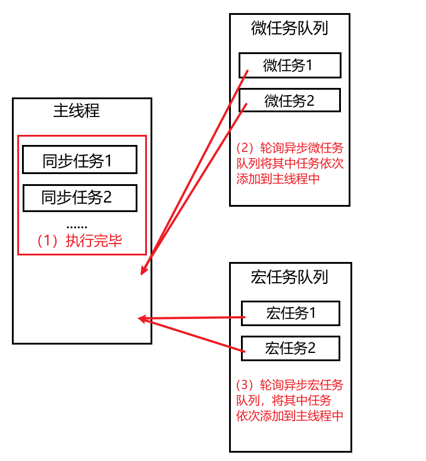


### 脚本加载

引擎在执行任务时不会进行DOM渲染，所以如果把`script` 定义在前面，要先执行完任务后再渲染DOM。

解决:

1. 将`script` 放在 BODY 结束标签前。
2. 为`script`标签添加`type="module"`,也会延迟解析执行
3. 为`script`标签添加`defer="defer"`属性
4. 为`script`标签添加`async="async"`属性

* `defer/async`属性，只对外部脚本引入生效，多次使用该属性引入其它外部脚本，不能够保证先后顺序，若引入的多个脚本之间存在依赖关系，需要注意。


### 定时器

定时器会放入异步宏任务队列，需要等待同步任务、异步微任务执行完成后执行。

下面设置了 6 毫秒执行，如果主线程代码执行10毫秒，定时器要等主线程执行完才执行。

HTML标准规定最小时间不能低于4毫秒，有些异步操作如DOM操作最低是16毫秒，总之把时间设置大些对性能更好。

```text
setTimeout(func,6);
```

下面的代码会先输出 `Ashuntefannao` 之后输出 `阿顺特烦恼`

```text
setTimeout(() => {
  console.log("阿顺特烦恼");
}, 0);
console.log("Ashuntefannao");
```


### 微任务

微任务一般由用户代码产生，微任务较宏任务执行优先级更高，`Promise.then` 是典型的微任务，实例化 Promise 时执行的代码是同步的，then注册的回调函数是异步微任务。

任务的执行顺序是同步任务、微任务、宏任务所以下面执行结果是 `1、2、3、4`

```
setTimeout(() => console.log(4));

new Promise(resolve => {
  resolve();
  console.log(1);
}).then(_ => {
  console.log(3);
});

console.log(2);
```

我们再来看下面稍复杂的任务代码

```text
setTimeout(() => {
  console.log("定时器");
  setTimeout(() => {
    console.log("timeout timeout");
  }, 0);
  new Promise(resolve => {
    console.log("settimeout Promise");
    resolve();
  }).then(() => {
    console.log("settimeout then");
  });
}, 0);
new Promise(resolve => {
  console.log("Promise");
  resolve();
}).then(() => {
  console.log("then");
});
console.log("阿顺特烦恼");
```

以上代码执行结果为

```text
Promise
阿顺特烦恼
then
定时器
settimeout Promise
settimeout then
timeout timeout
```


### 实例操作

#### 进度条

下面的定时器虽然都定时了一秒钟，但任务队列是按先进先出（先进先执行）原则，依次执行

```text
let i = 0;
setTimeout(() => {
  console.log(++i);
  console.log("timeout1");
}, 1000);

setTimeout(() => {
  console.log(++i);
  console.log("timeout2");
}, 1000);

//一秒后打印结果
1
timeout1
2
timeout2

```

下面是一个进度条的示例，将每个数字放在一个任务中执行

```text
<style>
    body {
      padding: 30px;
    }
    .loading {
      height: 30px;
      background: yellowgreen;
      width: 0;
      text-align: center;
      font-weight: bold;
    }
</style>
<body>
  <div class="loading"></div>
</body>

<script>
  let laodBox=document.querySelector(".loading");
  function view() {
    let i = 0;
    (function handle() {
      laodBox.innerHTML = i + "%";
      laodBox.style.width = i + "%";
      if (i++ < 100) {
        setTimeout(handle, 20);
      }
    })();
  }
  view();
  console.log("定时器开始了...");
</script>
```

#### 任务分解

一个比较耗时的任务可能造成游览器卡死现象，所以可以将任务拆分为多个异步小任务执行，暂时置于异步任务队列中，当主线程空闲时，在进行任务轮询。下面是一个数字统计的函数，我们会发现运行时间特别长

```text
{
        console.time("runtime");
        function sub(num) {
          let count = 0;
          for (let i = 0; i <= num; i++) {
            count += i;
          }
          console.log(count);
          console.timeEnd("runtime");
        }
        let num = 987654321;
        sub(num);
        console.log("阿顺特烦恼"); //需要等待上面执行完才会执行
}
```

现在把任务分解成小块放入任务队列，游览器就不会出现卡死的现象了，也不会影响后续代码的执行

* 执行run时，遇到第一个setTimeout，先将其添加到异步宏任务队列。
* 后面遇到同步代码，打印结果，又遇到异步宏任务，添加到任务队列中
* 同步代码执行完毕，取出第一个setTimeout到主线程并执行（运算for循环）
* 后面遇到同步代码，打印结果，又遇到异步宏任务，添加到任务队列中
* 同步代码执行完毕，取出第二个setTimeout到主线程并执行（调用run）
* 以此往复，任务轮询……

```text
{
        let count = 0;
        let num = 987654321;
        function run() {
          setTimeout(() => {
            for (let i = 0; i < 100000000; i++) {
              if (num <= 0) break;
              count += num--;
            }
          });

          if (num > 0) {
            console.log(num);
            setTimeout(run);
          } else {
            console.log(num);
            console.log(count);
          }
        }
        run();
        console.log("阿顺特烦恼");
}
```

交给微任务处理是更好的选择

```text
{
        async function run(num) {
          let res = await Promise.resolve().then((_) => {
            let count = 0;
            for (let i = 0; i < num; i++) {
              count += num--;
            }
            return count;
          });
          console.log(res);
        }
        run(987654321);
        console.log("阿顺特烦恼");
}
```


## Promise核心

本章来自己开发一个Promise实现，提升异步编程的能力。

### 起步构建

首先声明定义类并声明Promise状态与值，有以下几个细节需要注意。

- executor为执行者
- 当执行者出现异常时触发**拒绝**状态，并异步抛出错误
  - 如果直接抛出错误，在打印时，看不到PROMISE本身的状态与值，所以将抛出错误放在异步宏任务中
  - 这个结果和原生Promsie是相同的
- 使用静态属性保存状态值
- 状态只能改变一次，所以在resolve与reject添加条件判断
- 因为 `resolve`或`rejected`方法在executor中调用，作用域也是executor作用域，这会造成在外部确认状态时：this指向window，现在我们使用的是class定义，this为undefined。所以我们要改变this指向

```
      class PROMISE {
        static PENDING = "pending";
        static FULFILLED = "fulfilled";
        static REJECTED = "rejected";
        constructor(executor) {
          this.value = undefined;
          this.status = PROMISE.PENDING;
          try {
            executor(this.resolve.bind(this), this.reject.bind(this));
          } catch (err) {
            this.reject(err);
            setTimeout(() => {
              throw err;
            });
          }
        }
        resolve(result) {
          if (this.status === PROMISE.PENDING) {
            this.status = PROMISE.FULFILLED;
            this.value = result;
          }
        }
        reject(reason) {
          if (this.status === PROMISE.PENDING) {
            this.status = PROMISE.REJECTED;
            this.value = reason;
          }
        }
      }
```

测试状态改变

```
      console.log(new PROMISE(() => {}));
      console.log(
        new PROMISE((resolve, reject) => {
          resolve("fulfilled");
          reject("rejected");
        })
      );
```

测试executor执行异常

```
      console.log(
        new PROMISE((resolve, reject) => {
          console.log(as);
        })
      );
			//对比原生Promise
      console.log(
        new Promise((resolve, reject) => {
          console.log(as);
        })
      );
```


### THEN

现在添加then方法来处理状态的改变，有以下几点说明

1. then可以有两个参数，即成功和错误时的回调函数
2. 若then处理的Promise状态为fulfilled，then的函数参数都不是必须的，如果传入非函数则将被忽略，还需要设置默认值为函数，用于处理没传参，或传入非函数的情况，并将PROMISE的value返回，为后期链式调用then传递值。
3. 若then所处理的Promise状态为rejected且没有使用then的onRejected处理时，将会报错。
4. 当执行then传递的函数发生异常时，统一交给onRejected来处理错误
5. then的执行是异步任务

#### 基础构建

先观察原生Promsie.then的特点

* 能够处理异步确认状态
* then异步执行

```
      new Promise((res, rej) => {
        console.log("Ashun");
        setTimeout(() => {
          console.log("ashun");
          res("as");
        });
      }).then(
        (result) => console.log(result),
        (reason) => console.log(reason)
      );
      console.log("阿顺特烦恼");
```

* 若没有处理拒绝状态的Promise，则会报错

若Promise状态为rejected，且没有被then中的onRejected函数处理，将会报错

```
new Promise((res, rej) => {
        rej("Ashun");
		});
		
//没有传递onRejeted
new Promise((res, rej) => {
        rej("Ashun");
    }).then((result) => console.log(result));
    
//onRejeted不是函数，证明没有处理异常，依旧会报错
new Promise((res, rej) => {
        rej("Ashun");
    }).then((result) => console.log(result), "rejected");
```

即便是空函数，也代表对异常做了处理，便不会报错

```
      new Promise((res, rej) => {
        rej("Ashun");
      }).then(
        (result) => console.log(result),
        () => {}
      );
```

实现基本功能

* 对onResolve设置默认函数，并返回this.value，当PROMISE状态为fulfilled时，不传参，也会将值传递给下一个then

**rejected处理**

实现方法（一）

* 不为onRejected设置默认函数，若设置了默认函数，则会默认处理rejected状态

* 设置一个变量`isfilter`，监听rejected是否被处理
* 由于不确定onRejected是否为函数，也没有为其设置默认函数，所以在后期执行时，要判断其类型，再设置``isfilter``

```
        class PROMISE {
          …
          constructor(executor) {
            ……
            this.isfilter = false;
          }
         	……
          then(onResolve, onReject) {
            if (!(onResolve instanceof Function)) {
              onResolve = () => this.value;
            }

            if (this.status === PROMISE.FULFILLED) {
              try {
                onResolve(this.value);
              } catch (err) {
                onReject(err);
              }
            }
            if (this.status === PROMISE.REJECTED) {
              if (onReject instanceof Function) {
                try {
                  onReject(this.value);
                } catch (err) {
                  onReject(err);
                }
                this.isfilter = true;
              } else {
                throw new Error("PROMISE status rejected");
              }
            }
          }
        }
```

这种方式有一个弊端，就是一旦抛出错误，后续的同步代码将不再被执行

```
        new PROMISE((res, rej) => {
          rej("Ashun");
        }).then();
        console.log("阿顺特烦恼"); //rejected没有被处理，抛出错误，后续同步代码不会执行
```


**实现方法（二）**

在reject回调函数中，`异步判断isfilter`，因为外部代码自上而下执行，isfilter的初始值为false，若不异步判断，则无论是否被处理，一旦执行reject回调函数，就会报错。

```
//代码自上而下执行，若在reject回调函数中判断isfilter，则要异步判断，等待then处理后，再判断

new PROMISE((res, rej) => {
        rej("Ashun");
      }).then(
        	(result) => console.log(result),
        	(reason) => console.log(reason)
			);
```

```
          reject(reason) {
            if (this.status === PROMISE.PENDING) {
              this.status = PROMISE.REJECTED;
              this.value = reason;
              // 异步判断是否被过滤,等待then执行完毕，判断rejected是否被处理;
              setTimeout(() => {
                if (!this.isfilter) {
                  throw new Error("PROMISE status rejected");
                }
              });
            }
          }

          then(onResolve, onReject) {
            if (!(onResolve instanceof Function)) {
              onResolve = () => this.value;
            }

            if (this.status === PROMISE.FULFILLED) {
              try {
                onResolve(this.value);
              } catch (err) {
                onReject(err);
              }
            }
            if (this.status === PROMISE.REJECTED) {
              if (onReject instanceof Function) {
                try {
                  onReject(this.value);
                } catch (err) {
                  onReject(err);
                }
                this.isfilter = true;
              }
            }
          }
```

下面来测试then方法，结果正常输出`Ashun`

```
new PROMISE((res, rej) => {
        rej("Ashun");
      }).then(
        	(result) => console.log(result),
        	(reason) => console.log(reason)
			);
console.log("阿顺特烦恼");
```

若没有处理rejected，会报错，并且不会影响后续同步代码的执行

```
new PROMISE((res, rej) => {
        rej("Ashun");
      }).then(result => console.log(result));
console.log("阿顺特烦恼"); 
```


#### 异步任务

但上面的代码并不是异步执行的，使用setTimeout来将onFulfilled与onRejected做为异步宏任务执行

* `isfilter`的改变不使用setTimeout包裹，只要onReject为Function，就立即设置`isfilter=true`，这样才能够让resolve及时监听`isfilter`的改变

```
          then(onResolve, onReject) {
            if (!(onResolve instanceof Function)) {
              onResolve = () => this.value;
            }

            if (this.status === PROMISE.FULFILLED) {
              setTimeout(() => {
                try {
                  onResolve(this.value);
                } catch (err) {
                  onReject(err);
                }
              });
            }
            if (this.status === PROMISE.REJECTED) {
              if (onReject instanceof Function) {
                setTimeout(() => {
                  try {
                    onReject(this.value);
                  } catch (err) {
                    onReject(err);
                  }
                });
                this.isfilter = true;
              } else {
                throw new Error("PROMISE status rejected");
              }
            }
          }
```

现在再执行代码，已经有异步效果了，先输出了`阿顺特烦恼`

```text
 new PROMISE((res, rej) => {
        // res("Ashun");
        rej("Ashun");
      }).then(
        (result) => console.log(result),
        (reason) => console.log(reason)
      );
console.log("阿顺特烦恼");
```

#### PENDING异步

当在PROMISE中`异步确认状态`时，then处理的是pending状态的PROMISE，所以不会执行对应的处理函数

```
      new PROMISE((res, rej) => {
        setTimeout(() => {
          res("as");
        });
      }).then(
        (result) => console.log(result),
        (reason) => console.log(reason)
      );
# 由于处理的是pending状态的PROMISE，所以不会执行处理函数
```

为了处理以上情况，需要进行几点改动

1. 在构造函数中添加callbacks来保存pending状态时处理函数，当状态改变时，即`resolve/reject`被调用时，再在`resolve/reject`函数体中调用callbacks对应状态的处理函数
2. callbacks中的处理函数也要设置为异步调用
3. 只有在异步确认状态时，才会向callbacks中压入对应处理函数，所以在调用时，要判断处理函数是否存在。

```
        constructor(executor){
        	……
        	this.callbacks={};
        }
        resolve(result) {
          if (this.status === PROMISE.PENDING) {
            this.status = PROMISE.FULFILLED;
            this.value = result;
            this.callbacks.onResolve && this.callbacks.onResolve(this.value);
          }
        }
        reject(reason) {
          if (this.status === PROMISE.PENDING) {
            this.status = PROMISE.REJECTED;
            this.value = reason;
            this.callbacks.onReject && this.callbacks.onReject(this.value);
            setTimeout(() => {
                if (!this.isfilter) throw new Error("PROMISE status rejected");
            });
          }
        }
```

```
then(onResolve, onReject) {
          //设置默认值
          if (!(onResolve instanceof Function)) {
            onResolve = () => this.value;
          }
          //同步确认状态处理，直接执行对应处理函数
          if (this.status === PROMISE.FULFILLED) {
            setTimeout(() => {
              try {
                onResolve(this.value);
              } catch (err) {
                onReject(err);
              }
            });
          }
          if (this.status === PROMISE.REJECTED) {
          	 if (onReject instanceof Function) {
          	 		this.isfilter = true;
            		setTimeout(() => {
              		try {
               		 onReject(this.value);
              		} catch (err) {
               		 onReject(err);
              		}
           		 });
            }
          }
          //异步确认状态处理
          //先将处理函数添加到callbacks中，当状态发生改变时，再在this.resolve/reject中调用
          if (this.status === PROMISE.PENDING) {
            this.callbacks.onResolve = (result) => {
              setTimeout(() => {
                try {
                  onResolve(result);
                } catch (err) {
                  onReject(err);
                }
              });
            };
            this.callbacks.onReject = (reason) => {
            	if (onReject instanceof Function) {
          	 		this.isfilter = true;
              	setTimeout(() => {
                	try {
                  	onReject(reason);
               	 	} catch (err) {
                 	 	onReject(err);
               	 	}
              	});
              }
            };
          }
        }
```


### 链式操作

Promise中的then是链式调用执行的，所以then也要默认返回状态为fulfilled的Promise。

1. then的onReject函数是对前面Promise的rejected的处理
2. 但默认返回的Promise状态要为fulfilled，所以在调用onRejected后，需要改变当前promise为fulfilled状态,并把执行结果传入。让下一个then得以接收

```
        then(onResolve, onReject) {
          //设置默认值
          if (!(onResolve instanceof Function)) {
            onResolve = () => this.value;
          }

          //默认返回一个PROMISE
          return new PROMISE((resolve, reject) => {
            //同步确认状态处理
            if (this.status === PROMISE.FULFILLED) {
              setTimeout(() => {
                try {
                  let preResult = onResolve(this.value);
                  resolve(preResult);			
                } catch (err) {
                  reject(err);
                }
              });
            }
            if (this.status === PROMISE.REJECTED) {
              if (onReject instanceof Function) {
                this.isfilter = true;
                setTimeout(() => {
                  try {
                    let preReason = onReject(this.value);
                    resolve(preReason);
                  } catch (err) {
                    reject(err);
                  }
                });
              }
            }

            //异步确认状态处理
            if (this.status === PROMISE.PENDING) {
              this.callbacks.onResolve = (result) => {
                setTimeout(() => {
                  try {
                    let preResult = onResolve(result);
                    resolve(preResult);
                  } catch (err) {
                    reject(err);
                  }
                });
              };
              this.callbacks.onReject = (reason) => {
                if (onReject instanceof Function) {
                  this.isfilter = true;
                  setTimeout(() => {
                    try {
                      let preReason = onReject(reason);
                      resolve(preReason);
                    } catch (err) {
                      reject(err);
                    }
                  });
                }
              };
            }
          });
        }
```

下面经过测试后，链式操作已经有效了

```
      new PROMISE((resolve, reject) => {
        console.log("Ashun");
        setTimeout(() => {
          console.log("ashun");
          reject("as");
        });
      })
        .then(
          (result) => result,
          (reason) => reason
        )
        .then()
        .then(
          (result) => console.log(result),
          (reason) => console.log(reason)
        );
      console.log("阿顺特烦恼");
```


### 返回类型

原生Promise.then，若在then中手动返回一个新的Promise并确认状态，这个手动返回的Promise能够改变当前then的状态，并且下一个then就是对返回的Promise的处理。

```
      new Promise((resolve, reject) => {
        resolve("Promise status: fulfilled");
      })
        .then((result) => {
          console.log(result);
          return Promise.reject("then status: rejected");
        })
        .then(null, (err) => console.log(err));
```

#### 基本实现

我们若要实现这个效果，就要判断then返回结果的类型是否为PROMISE，若是PROMISE，我们直接调用 `preRusult.then(resolve,reject)`即可，因为调用then会等待手动返回的PROMISE确认状态后执行。

让手动返回的PROMISE状态改变当前then默认返回的PROMISE的状态

* 使用then处理，若手动返回PROMISE确认状态为fulfilled,就执行默认返回PROMISE的resolve，让其状态也变为fulfilled
* 同理，若手动返回PROMISE确认状态为rejected,就执行默认返回PROMISE的reject，让其状态也变为rejected

```
then(onResolve, onReject) {
          //设置默认值
       		………
          return new PROMISE((resolve, reject) => {
            //同步确认状态处理
            if (this.status === PROMISE.FULFILLED) {
              setTimeout(() => {
                try {
                  let preResult = onResolve(this.value);
                  if (preResult instanceof PROMISE) {
                    preResult.then(resolve, reject);
                  } else {
                    resolve(preResult);
                  }
                } catch (err) {
                  reject(err);
                }
              });
            }
            if (this.status === PROMISE.REJECTED) {
              if (onReject instanceof Function) {
                this.isfilter = true;
                setTimeout(() => {
                  try {
                    let preReason = onReject(this.value);
                    if (preReason instanceof PROMISE) {
                      preReason.then(resolve, reject);
                    } else {
                      resolve(preReason);
                    }
                  } catch (err) {
                    reject(err);
                  }
                });
              }
            }

            //异步确认状态处理
            if (this.status === PROMISE.PENDING) {
              this.callbacks.onResolve = (result) => {
                setTimeout(() => {
                  try {
                    let preResult = onResolve(result);
                    if (preResult instanceof PROMISE) {
                      preResult.then(resolve, reject);
                    } else {
                      resolve(preResult);
                    }
                  } catch (err) {
                    reject(err);
                  }
                });
              };
              this.callbacks.onReject = (reason) => {
                if (onReject instanceof Function) {
                  this.isfilter = true;
                  setTimeout(() => {
                    try {
                      let preReason = onReject(reason);
                      if (preReason instanceof PROMISE) {
                        preReason.then(resolve, reject);
                      } else {
                        resolve(preReason);
                      }
                    } catch (err) {
                      reject(err);
                    }
                  });
                }
              };
            }
          });
        }
```

测试能够到的正确结果

```
      new PROMISE((res, rej) => {
        console.log("Ashun");
        setTimeout(() => {
          console.log("ashun");
          rej("as");
        });
      })
        .then(
          (result) => result,
          (reason) => reason
        )
        .then((result) => {
          console.log(result);
          return new PROMISE((res, rej) => {
            res("then2 status Fulfilled");
          });
        })
        .then(
          (result) => console.log(`resolve__:${result}`),
          (reason) => console.log(`rejected__:${reason}`)
        );
      console.log("阿顺特烦恼");
```

#### 代码复用

现在发现pendding、fulfilled、rejected 状态的代码非常相似，所以可以提取出方法Parse来复用

```
        then(onResolve, onReject) {
          //设置默认值
         	……
          return new PROMISE((resolve, reject) => {
            //同步确认状态处理
            if (this.status === PROMISE.FULFILLED) {
              setTimeout(() => {
                this.Parse(onResolve(this.value), resolve, reject);
              });
            }
            if (this.status === PROMISE.REJECTED) {
              setTimeout(() => {
                this.Parse(onReject(this.value), resolve, reject);
              });
            }

            //异步确认状态处理
            if (this.status === PROMISE.PENDING) {
              this.callbacks.onResolve = (result) => {
                setTimeout(() => {
                  this.Parse(onResolve(result), resolve, reject);
                });
              };
              this.callbacks.onReject = (reason) => {
                setTimeout(() => {
                  this.Parse(onReject(reason), resolve, reject);
                });
              };
            }
          });
        }
        Parse(Operation, resolve, reject) {
          try {
            let preReason = Operation;
            if (preReason instanceof PROMISE) {
              preReason.then(resolve, reject);
            } else {
              resolve(preReason);
            }
          } catch (err) {
            reject(err);
          }
        }
```

#### 返回约束

then手动返回的promise不能是then默认返回Promise，会产生循环调用，下面是原生Promise的示例将产生错误

```text
let promise = new Promise((res, rej) => {
        res("fulfilled");
      }).then((result) => promise);
```

解决上面的问题来完善代码，添加当前promise做为parse的第一个参数与函数执行结果进行比对

```
        then(onResolve, onReject) {
          //设置默认值
         	……
          let promise = new PROMISE((resolve, reject) => {
            //同步确认状态处理
            if (this.status === PROMISE.FULFILLED) {
              setTimeout(() => {
                this.Parse(promise, onResolve(this.value), resolve, reject);
              });
            }
            if (this.status === PROMISE.REJECTED) {
              if (onReject instanceof Function) {
                this.isfilter = true;
                setTimeout(() => {
                  this.Parse(onReject(this.value), resolve, reject);
                });
              }
            }

            //异步确认状态处理
            if (this.status === PROMISE.PENDING) {
              this.callbacks.onResolve = (result) => {
                setTimeout(() => {
                  this.Parse(promise, onResolve(result), resolve, reject);
                });
              };
              this.callbacks.onReject = (reason) => {
                if (onReject instanceof Function) {
                  this.isfilter = true;
                  setTimeout(() => {
                    this.Parse(onReject(reason), resolve, reject);
                  });
                }
              };
            }
          });
          return promise;
        }

        Parse(promise, Operation, resolve, reject) {
          if (promise === Operation) {
            throw new Error("Chaining cycle detected for promise");
          }
          try {
            let preReason = Operation;
            if (preReason instanceof PROMISE) {
              preReason.then(resolve, reject);
            } else {
              resolve(preReason);
            }
          } catch (err) {
            reject(err);
          }
        }
```

现在进行测试也可以得到原生一样效果了

```
      let promise = new PROMISE((res, rej) => {
        res("fulfilled");
      }).then((result) => promise);
```


### 静态方法

#### RESOLVE

下面来实现原生Promise的静态方法`Promise.resolve`用于快速返回一个状态为resolve的Promise

* 默认返回Promise

* 同样需要注意返回类型，若为PROMISE，则使用then处理的就是返回的PROMISE

```
      Promise.resolve(
        new Promise((res) => res("ashuntefannao"))
      ).then((result) => console.log(result));
```

创建静态方法`static resolve`

```
        static resolve(value) {
          return new PROMISE((resolve, reject) => {
            if (value instanceof PROMISE) {
              value.then(resolve, reject);
            } else {
              resolve(value);
            }
          });
        }
```

测试

```
      PROMISE.resolve(
        new PROMISE((res, rej) => rej("ashuntefannao"))
      ).then(null, (reason) => console.log(`rejected__${reason}`));
      
      PROMISE.resolve("ashun").then((result) => console.log(result));
```


#### REJECT

封装思想和`resolve`静态方法相同

```
        static reject(reason) {
          return new PROMISE((resolve, reject) => {
            if (reason instanceof PROMISE) {
              reason.then(resolve, reject);
            } else {
              reject(reason);
            }
          });
        }
```

测试

```
      PROMISE.reject("rejected").then(null, (err) => {
        console.log(err);
      });
      PROMISE.reject(PROMISE.resolve("阿顺特烦恼")).then((val) => {
        console.log(val);
      });
```


#### ALL

原生Promise的静态方法all

* 接收一个PromiseArray，并按顺序对PromiseArray中的promise进行判断和处理
* 若存在一个promise没有确定状态，则all返回的Promise也为pending状态
* 若存在一个promise状态为rejected，则all返回的Promise也为rejected状态，并且后续的then能够接收到拒绝状态的promise传值。
* 若所有promise状态都为fulfilled，则返回一个有序的、元素为promise结果的数组

由于all是有序处理，所以我们需要通过遍历，按顺序处理业务逻辑

```
        static all(PROMISEarr) {
          let resolveArr = [];
          let test = true;
          return new PROMISE((resolve, reject) => {
            for (let promise of PROMISEarr) {
              let isPending = promise.status === PROMISE.PENDING;
              let isReject = promise.status === PROMISE.REJECTED;

              if (isPending) {
                test = false;
                break;
              } else if (isReject) {
                test = false;
                promise.then(null, (reason) => reject(reason));
                break;
              } else {
                promise.then((res) => resolveArr.push(res));
              }
            }
            test && resolve(resolveArr);
          });
        }
```

下例可自行改变某个promise的状态，来检测不同结果

```
      let p1 = new PROMISE((res, rej) => {
        res("p1 stastus fulfilled");
      });
      let p2 = new PROMISE((res, rej) => {
        res("p2 stastus fulfilled");
      });
      let p3 = new PROMISE((res, rej) => {
        res("p3 stastus fulfilled");
      });
      let arr = [p1, p2, p3];
      let all = PROMISE.all(arr).then(
        (result) => console.log(result),
        (reason) => console.log(reason)
      );

      setTimeout(() => {
        console.log(all);
      }, 100);
```


#### RACE

* `race(PromiseArray)`赛跑，哪个Promise优先确认状态，就返回哪个Promise
* 一开始我们就已经实现了promise状态一经确定，就不可再改变
* 所以在实现的时候，我们只需循环调用每一个promise的then方法，哪个最先确认状态，就会优先执行then，我们可以通过then的两个回调函数，来改变当前默认返回的Promsie的状态。

```
        static race(PROMISEarr) {
          return new PROMISE((resolve, reject) => {
            PROMISEarr.map((promise) => {
              promise.then(resolve, reject);
            });
          });
        }
```

下例可自行改变某个promise确认状态的延迟时间，来检测不同结果

```
      let p1 = new PROMISE((res, rej) => {
        setTimeout(() => {
          res("p1 stastus fulfilled");
        });
      });
      let p2 = new PROMISE((res, rej) => {
        rej("p2 stastus rejected");
      });
      let p3 = new PROMISE((res, rej) => {
        setTimeout(() => {
          res("p3 stastus fulfilled");
        }, 100);
      });

      let arr = [p1, p2, p3];
      let race = PROMISE.race(arr).then(
        (result) => console.log(`result__${result}`),
        (reason) => console.log(`reason__${reason}`)
      );

      setTimeout(() => {
        console.log(race);
      }, 500);
```


#### allSettled

* 不在乎状态拒绝与否，所有的promise确认状态后，将会返回有序结果，且返回的promise状态为fulfilled。
* 若有一个promise没有确认状态，则allSettled默认返回的promise状态也为fulfilled，也就不会执行后续的then

```
        static allSettled(PROMISEarr) {
          let results = [];
          return new Promise((resolve, reject) => {
            for (let promise of PROMISEarr) {
              if (promise.status == PROMISE.PENDING) {
                break;
              }
              let status = promise.status;
              let value = promise.value;
              promise.then(
                (result) => {
                  results.push({ status, value });
                  if (results.length == PROMISEarr.length) resolve(results);
                },
                (reason) => {
                  results.push({ status, reason: value });
                  if (results.length == PROMISEarr.length) resolve(results);
                }
              );
            }
          });
        }
```

测试

```
      let p1 = new PROMISE((res, rej) => {
        res("p1 stastus fulfilled");
      });
      let p2 = new PROMISE((res, rej) => {
        rej("p2 stastus rejected");
      });
      let p3 = new PROMISE((res, rej) => {
        res("p3 stastus fulfilled");
      });

      let arr = [p1, p2, p3];
      let allSettled = PROMISE.allSettled(arr).then((result) =>
        console.log(result)
      );

      setTimeout(() => {
        console.log(allSettled);
      }, 500);
```

若有一个promise始终没有确认状态，则allSettled默认返回的promise状态也为pending。

```
……
      let p2 = new PROMISE((res, rej) => {
        //rej("p2 stastus rejected");
      });
……
```


## DOM

### 基础知识

DOM 即Document Object Model 文档对象模型。如果对HTML很了解使用DOM并不复杂。

通过js操作界面元素，操作的对象即DOM。

浏览器在加载页面时会生成DOM对象，以供我们使用JS控制页面元素。

#### 文档渲染

浏览器会将HTML文本内容进行渲染，并生成相应的JS对象，同时会对不符规则的标签进行处理。

- 浏览器会将标签规范后渲染页面
- 目的一让页面可以正确呈现
- 目的二可以生成统一的JS可操作对象


##### 标签修复

在html文件中，若只有内容`阿顺特烦恼`而**没有任何标签时**，浏览器会自动修复成以下格式

```
<html>
<head></head>
<body>
阿顺特烦恼
</body>
</html>
```

下面H1标签结束错误并且属性也没有引号，浏览器在渲染中会进行修复

```text
<body>
  <h1 id=ashun>阿顺特烦恼<h1>
</body>
```

处理后的结果

```text
<html>
	<head></head>
	<body>
    <h1 id="ashun">阿顺特烦恼</h1>
  </body>
</html>
```

##### 表格处理

表格tabel中不允许有内容，浏览器在渲染过程中会进行处理

```text
    <table>
      阿顺特烦恼
      <tr>
        <th>阿顺</th>
      </tr>
    </table>
```

渲染后会添加tbody标签并将table中的字符移出到table标签外部

```text
阿顺特烦恼
<table>
  <tbody>
  	<tr>
      <th>阿顺</th>
    </tr>
  </tbody>
</table>
```

##### 标签移动

所有内容要写在BODY标签中，下面的SCRIPT标签写在了BODY后面，浏览器渲染后也会进行处理

```text
<body></body>
<script>
  console.dir('阿顺特烦恼')
</script>
```

渲染后处理的结果

```text
<body>
  <script>
    console.dir('阿顺特烦恼')
  </script>
</body>
```


---

#### 操作时机

需要保证浏览器已经渲染了内容才可以读取的节点对象，下例将无法读取到节点对象

```text
<script>
  const node = document.getElementById('as');
  console.log(node); //null
</script>
<h1 id="as">阿顺特烦恼</h1>
```

不过我们可以将脚本通过事件放在页面渲染完执行

```text
<script>
  window.onload = () => {
    const node = document.getElementById('as');
    console.log(node);
  }
</script>
<h1 id="as">阿顺特烦恼</h1>
```

或使用定时器将脚本设置为异步执行

```text
<script>
  setTimeout(() => {
   	const node = document.getElementById('as');
    console.log(node)
  })
</script>
<h1 id="as">阿顺特烦恼</h1>
```

为脚本设置`type="module"`,会延迟解析模块脚本

```
<script type="module">
   	const node = document.getElementById('as');
    console.log(node)
</script>
<h1 id="as">阿顺特烦恼</h1>
```

或将脚本设置在外部文件并使用`defer/async`属性加载，即会等到DOM解析后迟延执行

* 仅引入外部脚本时有效
* 多个外部脚本使用`defer/async`属性加载，不能够保证加载的前后顺序，当模块之间存在依赖时要注意

```text
<script defer src="index.js"></script>
<div id="as"></div>
```

```
<script async src="index.js"></script>
<div id="as"></div>
```


---

#### 节点对象

JS中获取html内容的对象，称为DOM节点对象（node)，即然是对象就包括操作NODE的属性和方法

- 包括12种类型的节点对象
- 常用了节点为document、标签元素节点、文本节点、注释节点
- 节点均继承自Node类型，所以拥有相同的属性或方法
- document是DOM操作的起始节点

```text
<body id="as">
  <!-- 阿顺特烦恼 -->
</body>
<script>
	// document节点 noteType为9
  console.log(document.nodeType)
  
  // 第一个子节点为<!DOCTYPE html>，且nodetype为10
  console.log(document.childNodes.item(0).nodeType)
  
  // body 是标签节点 nodeType为1
  console.log(document.body.nodeType) 
  
  // body的属性节点nodeType 为2
  console.log(document.body.attributes[0].nodeType)
  
	// body的第一个节点为文本节点，nodeType为3
  console.log(document.body.childNodes.item(0).nodeType)
  
  // body的第二个节点为注释，nodeType类型为8
  console.log(document.body.childNodes[1].nodeType)
</script>
```


---

#### 原型链

在浏览器渲染过程中会将文档内容生成为不同的对象，来对下例中的h1标签进行讨论，其他节点情况相似

- 不同类型节点由专有的构造函数创建对象
- 使用console.dir 可以打印出DOM节点对象结构
- 节点也是对象所以也具有JS对象的特征

```text
<h1 id="as">阿顺特烦恼</h1>
<script>
  function prototype(el) {
    console.log(el.__proto__)
    el.__proto__ ? prototype(el.__proto__) : ''
  }
  const node = document.getElementById('as')
  prototype(node)
</script>
```

最终得到的节点的原型链为

| 原型               | 说明                                            |
| ------------------ | ----------------------------------------------- |
| Object             | 根对象                                          |
| EventTarget        | 提供事件支持                                    |
| Node               | 提供parentNode等节点操作方法                    |
| Element            | 提供getElementsByTagName、querySelector等方法   |
| HTMLElement        | 所有元素的基础类，提供className、nodeName等方法 |
| HTMLHeadingElement | Head标题元素类                                  |

为标签元素和表单元素添加内容截取方法substr

```text
    <div id="as">阿顺特烦恼</div>
    <input type="text" value="ashuntefannao" />
<script>
      class Utils {
      	//检查是否为表单元素
        static isForm(node) {
          return node instanceof HTMLInputElement;
        }
        //获取原型
        static getPrototype(node) {
          let prototypes = [];
          let test = node.__proto__;
          if (test) {
            prototypes.push(test);
            prototypes.push(...Utils.getPrototype(test));
          }
          return prototypes;
        }
      }
      
      Node.prototype.substr = function (m, n) {
        if (Utils.isForm(this)) {
          return this.value.substr(m, n);
        } else {
          return this.innerText.substr(m, n);
        }
      };
      
      //表单测试
      let input = document.querySelector("input");
      console.log(input.substr(0, 2));
      console.log(Utils.getPrototype(input));
      //标签测试
      let div = document.querySelector("div");
      console.log(div.substr(0, 2));
      console.log(Utils.getPrototype(div));
</script>
```


---

#### 对象特征

即然DOM与我们其他JS创建的对象特征相仿，所以也可以为DOM对象添加属性或方法。

对于系统应用的属性，应该明确含义不应该随意使用，比如ID是用于标识元素唯一属性，不能用于其他目地

- 后会会讲到其他解决方案，来自定义属性，下面的直接修改ID属性是不建议的

```text
let as = document.getElementById("as");
as.id = "Ashun";
console.log(as);
```

title用于鼠标停留时显示提示文档也不应该用于其他目地

```text
<div id="as">阿顺特烦恼</div>
<script>
  let as = document.getElementById('as')
  as.title = 'Ashun'
  console.log(as)
</script>
```

下面是为对象合并属性的示例

```text
<div id="as">阿顺特烦恼</div>
<script>
  let as = document.getElementById('as')
  Object.assign(as, {
    color: 'red',
    change() {
      this.innerHTML = 'Ashun'
      this.style.color = this.color
    },
    onclick() {
      this.change()
    },
  })
</script>
```

合并对象属性更改样式

```text
<div id="as">阿顺特烦恼</div>
<script>
  let as = document.getElementById('as')
  Object.assign(as.style, {
    color: 'white',
    backgroundColor: 'red',
  })
</script>
```


---

### DOCUMENT

document是window对象的属性，是由HTMLDocument类实现的实例。

- document包含 DocumentType（唯一）或 html元素（唯一）或 comment等元素

原型链中也包含Node，所以可以使用有关节点操作的方法如nodeType/NodeName等

```text
console.dir(document.nodeType)
console.dir(document.nodeName)
```

> 有关使用Document操作cookie与本地储存将会在相应章节中介绍

#### HTML

下面通过节点的`nodeType`来获取html元素

```text
let html = [...document.childNodes].filter((node) => {
  if (node.nodeType === 1) {
    return node
  }
})[0]
console.log(html)
```

获取整个html元素：`document.documentElement`

```text
console.log(document.documentElement)
```

#### 文档信息

使用`title`获取和设置文档标题

```text
//获取文档标题内容
console.log(document.title)

//设置文档标签内容
document.title = '阿顺特烦恼-Ashun'
```

获取`body`标签

```
document.body
```

获取当前`URL`

```text
console.log(document.URL)
```

`domain`获取域名

```text
document.domain
```

`referrer`获取来源地址

```text
console.log(document.referrer)
```


---

### 节点属性

不同类型的节点拥有不同属性，下面是节点属性的说明与示例

#### nodeType

nodeType指以数值返回节点类型

| nodeType | 说明         |
| -------- | ------------ |
| 1        | 元素节点     |
| 2        | 属性节点     |
| 3        | 文本节点     |
| 8        | 注释节点     |
| 9        | document对象 |

下面是节点nodeType的示例

```
<div id="app">
  <div>阿顺</div>
  <div class="shun">SHUN</div>
  <div class="ashun"><!-- 阿顺特烦恼 --></div>
</div>
<script>
  const node = document.querySelector(`#app`)
  console.log(node.nodeType) //1
  console.log(node.firstChild);// #text{…}
  console.log(node.firstChild.nodeType) //3

  const as = document.querySelector('.ashun')
  console.log(as.childNodes[0].nodeType) //8
</script>
```

当然也可以使用对象的原型检测节点类型

```text
let h1 = document.querySelector('h1')
let p = document.querySelector('p')
console.log(h1 instanceof HTMLHeadingElement) //true
console.log(p instanceof HTMLHeadingElement) //false
console.log(p instanceof Element) //true
```

下面递归获取所有标签元素，并返回符合html嵌套结构的数据。

```text
  <div id="as">
    <ul>
      <li>
        <strong>阿顺特烦恼</strong>
      </li>
    </ul>
    <p1>ashun<span>ashuna</span></p1>
  </div>
<script>
				function childTag(node) {
          let result = [];
          [...node.childNodes].map((v) => {
            if (v.nodeType === 1) {
              result.push({ node: v, childs: childTag(v) });
            }
          });
          return result;
        }
        let as = document.getElementById("as");
        console.log(childTag(as));
</script>
```

优化：当没有子节点时，childs为null

```
……
result.push({ node: v, childs: childTag(v).length ? childTag(v) : null });
……
```


---

#### nodeName

nodeName指定节点的名称

- 获取值为大写形式

| nodeType种类 | nodeName返回结果 |
| ------------ | ---------------- |
| 1            | 元素名称如DIV    |
| 2            | 属性名称         |
| 3            | #text            |
| 8            | #comment         |

下面来操作 nodeName

```text
<div id="app">
  <div>阿顺</div>
  <div class="shun">SHUN</div>
  <div class="ashun"><!-- 阿顺特烦恼 --></div>
</div>
<script>
  const node = document.querySelector(`#app`)
  console.log(node.nodeName) //DIV
  console.log(node.firstChild.nodeName) //#text

  const as = document.querySelector('.ashun')
  console.log(as.childNodes[0].nodeName) //#comment
  console.log(as.attributes.class.nodeName);//calss
</script>
```

#### tagName

nodeName可以获取不限于节点种类的名称，tagName仅能用于获取标签元素节点名称

- tagName存在于Element类的原型中
- 元素上使用tagName与nodeName无异
- 获取值为大写形式

```text
<h1>ashun</h1>
<script>
  const node = document.querySelector('h1')
  console.log(node.tagName) //H1
</script>
```


---

#### nodeValue

使用nodeValue或data函数获取节点值，也可以使用节点的data属性获取节点内容

| nodeType | nodeValue |
| -------- | --------- |
| 1        | null      |
| 2        | 属性值    |
| 3        | 文本内容  |
| 8        | 注释内容  |

下面来看nodeValue的示例

```text
<div id="app">
  <div>阿顺特烦恼</div>
  <div class="as">ASHUN</div>
  <div class="ashun"><!-- 阿顺 --></div>
</div>
<script>
  const node = document.querySelector(`#app`)
  console.log(node.nodeValue) //null
  console.log(node.innerHTML)

  const as = document.querySelector('.as')
  console.log(as.firstChild.nodeValue) //ASHUN

  const ashun = document.querySelector('.ashun')
  console.log(ashun.childNodes[0].nodeValue) // 阿顺
</script>
```

使用data属性获取节点内容

```text
<div id="app">
  阿顺特烦恼
</div>

<script>
  const app = document.querySelector('#app')
  console.log(app.childNodes[0].data)
</script>
```


#### 树状节点

下面获取标签树状结构即多级标签结构，来加深一下nodeType/nodeName等知识

```text
<div id="app">阿顺特烦恼</div>
<script>
    function element(node) {
        if (node.nodeType != 1) return

        return Array.from(node.childNodes)
            .filter(node => node.nodeType == 1)
            .map(node => ({
                name: node.nodeName,
                children: element(node),
            }))
    }

    let nodes = element(document.documentElement)
    console.log(nodes)
</script>
```


---

### 节点集合

Nodelist与HTMLCollection都是包含多个节点标签的集合，大部分功能也是相同的。

- `getElementsBy...`等方法、`node.children` 返回的是HTMLCollection
- `querySelectorAll `、`node.childNodes` 返回的是 NodeList
- 二者都是`类数组`结构，可直接通过下标访问dom，但不能直接使用Array的方法，二者都可以迭代，二者也存在差异


**HTMLCollection**

* 不可使用`for/each`遍历
* 只是元素集合，包含dom元素

**NodeList**

* 可使用`for/each`遍历
* querySelectorAll 返回的虽然是 NodeList ，但是实际上是元素集合（只包含元素），并且是静态的（其他接口返回的HTMLCollection和NodeList都是live的）
* NodeList是节点集合（可以包含元素，也可以包含文本节点）


nodelist包含文本节点


```
<div class="a">
	<div class="cc"></div>
</div>
console.log(document.getElementsByClassName('a')[0].childNodes);//nodelist
console.log(document.getElementsByClassName('a')[0].children);//Htmlcollection
```

HTMLCollection不可使用for/each遍历操作

```
let htmlCollection = document.getElementsByClassName("shun");
let nodeList = document.querySelectorAll(".shun");

nodeList.forEach((v) => console.log(v));
htmlCollection.forEach((v) => console.log(v)); //forEach is not a function
```


#### length

Nodelist与HTMLCollection包含length属性，记录了节点元素的数量

```text
<div name="app">
  <div id="astfn">阿顺特烦恼</div>
  <div>ashun</div>
</div>
<script>
  const nodes = document.getElementsByTagName('div')
  for (let i = 0; i < nodes.length; i++) {
    console.log(nodes[i])
  }
</script>
```


#### 转换数组

有时使用数组方法来操作节点集合，这就需要将节点集合转化为数组类型，有以下几种方式可以实现。

1. 使用call调用原型方法

```text
<h1>阿顺特烦恼</h1>
<h1>Ashuntefannao</h1>
<script>
  let elements = document.getElementsByTagName('h1')
  console.log(elements)
  let arr = Array.prototype.slice.call(elements, 0)
  console.log(arr)
  arr.map((item) => {
    item.style.color = 'red'
  })
</script>
```

2. 使用Array.from转换

```text
<h1>阿顺特烦恼</h1>
<h1>Ashuntefannao</h1>
<script>
  let elements = document.getElementsByTagName('h1')
  console.log(elements)
  console.log(Array.from(elements))
</script>
```

3. 下面使用点语法转换节点为数组

```text
<h1>阿顺特烦恼</h1>
<h1>Ashuntefannao</h1>
<script>
  let elements = document.getElementsByTagName('h1')
  console.log(elements)
  ;[...elements].map((item) => {
    item.addEventListener('click', function () {
      this.style.textTransform = 'uppercase'
    })
  })
</script>
```

#### item

Nodelist与HTMLCollection提供了item()方法来根据索引获取元素

```text
<div name="app">
  <div id="astfn">阿顺特烦恼</div>
  <div>ashun</div>
</div>

<script>
  const nodes = document.getElementsByTagName('div')
  console.dir(nodes.item(0))
</script>
```

使用数组索引获取更方便

```text
<div name="app">
  <div id="astfn">阿顺特烦恼</div>
  <div>ashun</div>
</div>

<script>
  const nodes = document.getElementsByTagName('div')
  console.dir(nodes[0])
</script>
```


#### namedItem

HTMLCollection具有namedItem方法可以按name或id属性来获取元素

```text
<div name="app">
  <div id="astfn">阿顺特烦恼</div>
  <div name="as">ASHUN</div>
</div>

<script>
  const nodes = document.getElementsByTagName('div')
  console.dir(nodes.namedItem('as'))
   console.dir(nodes.namedItem('astfn'))
</script>
```

也可以使用属性方式获取

```text
<div name="app">
  <div id="astfn">阿顺特烦恼</div>
  <div name="as">ASHUN</div>
</div>

<script>
  const nodes = document.getElementsByTagName('div')
  console.dir(nodes['as']);
  console.dir(nodes.astfn)
</script>
```

即HTMLCollection，可以通过属性的形式，获取对应 `索引、id属性、name属性` 的dom元素。

```
<h1 id="astfn">阿顺特烦恼</h1>
<h1 name="as">ASHUN</h1>
<script>
  let items = document.getElementsByTagName('h1')
  console.log(items[0])
  console.log(items["astfn"])
  console.log(items['as'])
</script>
```


#### 常用元素

系统针对特定标签提供了快速选择的方式

下面展示的是获取所有a标签`document.links`

```text
<div name="app">
  <a href="">阿顺特烦恼</a>
  <a href="">Ashuntefannao</a>
</div>
<script>
  const nodes = document.links;
  console.dir(nodes)
</script>
```

获取特定元素方法如下

| 方法                     | 说明                   |
| ------------------------ | ---------------------- |
| document.documentElement | 文档节点即html标签节点 |
| document.body            | body标签节点           |
| document.head            | head标签节点           |
| document.links           | 超链接集合             |
| document.anchors         | 所有锚点集合           |
| document.forms           | form表单集合           |
| document.images          | 图片集合               |


---

### 节点关系

节点是父子级嵌套与前后兄弟关系，使用DOM提供的API可以获取这种关系的元素。

- **文本和注释也是节点，所以也在匹配结果中**
- 若只想获取dom元素，而不希望获得其它类型的节点，可以参考后续的**元素关系**

#### 基础知识

节点是根据HTML内容产生的，所以也存在父子、兄弟、祖先、后代等节点关系，下例中的代码就会产生这种多重关系

- h1与ul是兄弟关系
- span与li是父子关系
- ul与span是后代关系
- span与ul是祖先关系

```text
<h1>阿顺特烦恼</h1>
<ul>
  <li>
    <span>Ashuntefannao</span>
    <strong>ashun</strong>
  </li>
</ul>
```

下面是通过节点关系获取相应元素的方法

| 节点属性        | 说明             |
| --------------- | ---------------- |
| childNodes      | 获取所有子节点   |
| parentNode      | 获取父节点       |
| firstChild      | 子节点中第一个   |
| lastChild       | 子节点中最后一个 |
| nextSibling     | 下一个兄弟节点   |
| previousSibling | 上一个兄弟节点   |

子节点集合与首、尾节点获取

- 文本也是node所以也会在匹配当中

```text
<div id="app">
  <div>Ashuntefannao</div>
  <div>SHUN</div>
  <div>阿顺</div>
</div>
<script>
  const node = document.querySelector(`#app`)
  console.log(node.childNodes) //所有子节点
  console.log(node.firstChild) //第一个子节点是文本节点（换行符和空白字符）
  console.log(node.lastChild) //最后一个子节点也是文本节点（换行符和空白字符）
</script>
```

```
<div id="app">
  <div class="astfn" data="as">Ashuntefannao</div>
  <div class="shun">SHUN</div>
  <div class="ashun">阿顺</div>
</div>
<script>
  const node = app.querySelector(`.shun`)
  console.log(node.parentNode) //div#app
  console.log(node.childNodes) //文本节点
  console.log(node.nextSibling) //下一个兄弟节点是文本节点（换行符和空白字符）
  console.log(node.previousSibling) //上一个节点也是文本节点（换行符和空白字符）
</script>
```

document是顶级节点html标签的父节点是document

```text
<script>
  console.log(document.documentElement.parentNode === document)
</script>
```

下例是查找元素的所有父节点

```
<div id="as">ashuntefannao</div>

<script>
  function parentNodes(node) {
    let nodes = []
    while ((node = node.parentNode)) nodes.push(node)
    return nodes
  }
  const el = document.getElementById('as')
  const nodes = parentNodes(el)
  console.log(nodes)
</script>
```

获取所有的后代元素SPAN的内容

```text
<div id="app">
  <span>Ashuntefannao</span>
  <h2>
    <span>ASHUN</span>
  </h2>
</div>

<script>
  function getChildDom(parent, dom) {
  	let doms = [];
  	for (let elem of parent.childNodes) {
   		if (elem.nodeName === dom.toUpperCase()) doms.push(elem);
    	doms = doms.concat(getChildDom(elem, dom));
      // doms.push(...getChildDom(elem, dom));
  	}
   	return doms;
  }
  const app = document.getElementById('app')
  const nodes = getChildNodeByName(app, 'span')
  console.log(nodes)
</script>
```


### 元素关系

使用childNodes等获取的节点`包括文本与注释`，但这不是我们常用的，系统也提供了只操作元素的方法。

| 节点属性               | 说明                                             |
| ---------------------- | ------------------------------------------------ |
| parentElement          | 获取父元素                                       |
| children               | 获取所有子元素                                   |
| childElementCount      | 子标签元素的数量                                 |
| firstElementChild      | 第一个子标签                                     |
| lastElementChild       | 最后一个子标签                                   |
| previousElementSibling | 上一个兄弟标签                                   |
| nextElementSibling     | 下一个兄弟标签                                   |
| contains               | 返回布尔值，判断传入的节点是否为该节点的后代节点 |

以下实例展示怎样通过元素关系获取元素

```text
<div id="app">
  <div class="astfn">阿顺特烦恼</div>
  <div class="shun">SHUN</div>
  <div class="ashun"><!-- 阿顺 --></div>
</div>

<script>
  const app = document.querySelector(`#app`)
  console.log(app.children) //所有子元素
  console.log(app.firstElementChild) //第一个子元素 div.astfn
  console.log(app.lastElementChild) //最后一个子元素 div.ashun

  const as = document.querySelector('.ashun')
  console.log(as.parentElement) //父元素 div#app

  console.log(as.previousElementSibling) //上一个兄弟元素 div.astfn
  console.log(as.nextElementSibling) //下一个兄弟元素 div.ashun
</script>
```

html标签的父节点是document，但父标签节点不存在

```text
<script>
  console.log(document.documentElement.parentNode === document) //true
  console.log(document.documentElement.parentElement) //null
</script>
```


### 选取节点

系统提供了丰富的选择节点（NODE）的操作方法，下面我们来一一说明

#### getElementById

使用ID选择是非常方便的选择具有ID值的节点元素，但注意ID应该是唯一的

- 只能通过document对象调用

```text
<div id="as">Ashuntefannao</div>
<script>
  const node = document.getElementById('as')
  console.dir(node)
</script>
```

下面自定义函数来支持批量按ID选择元素

```text
<div id="as">Ashuntefannao</div>
<div id="app"></div>
<script>
  function getByElementIds(ids) {
    return ids.map((id) => document.getElementById(id))
  }
  let nodes = getByElementIds(['as', 'app'])
  console.dir(nodes)
</script>
```

拥有ID的元素可做为WINDOW的属性进行访问

```text
<div id="app">
  Ashuntefannao
</div>
<script>
  console.log(app.innerHTML)
</script>
```

如果声明了变量这种访问方式将无效，所以并不建议使用这种方式访问对象

```text
<div id="app">
  Ashuntefannao
</div>
<script>
  let app = 'ashun'
  console.log(app.innerHTML)
</script>
```

getElementById只能通过document访问，不能通过元素读取拥有ID的子元素，下面的操作将产生错误

```text
<div id="app">
  Ashuntefannao
  <div id="as">阿顺</div>
</div>
<script>
  const app = document.getElementById('app')
  const node = app.getElementById('as') //app.getElementById is not a function
  console.log(node)
</script>
```


#### getElementByName

使用getElementByName获取**设置了name属性的元素**，虽然在DIV等元素上同样有效，但一般用来对表单元素进行操作时使用。

- 返回NodeList节点列表对象
- NodeList顺序为元素在文档中的顺序

```text
<div name="astfn">阿顺特烦恼</div>
<input type="text" name="username" />

<script>
  const div = document.getElementsByName('astfn')
  console.dir(div)
  const input = document.getElementsByName('username')
  console.dir(input)
</script>
```


#### getElementsByTagName

使用getElementsByTagName用于按标签名获取元素

- 返回HTMLCollection元素集合
- 是不区分大小的获取

```text
<div name="astfn">阿顺特烦恼</div>
<div id="app"></div>
<script>
  const divs = document.getElementsByTagName('DIV')
  console.dir(divs)
</script>
```

**通配符**

可以使用通配符 ***** 获取所有元素

```text
<div name="astfn">阿顺特烦恼</div>
<div id="app"></div>

<script>
  const nodes = document.getElementsByTagName('*')
  console.dir(nodes)
</script>
```


#### getElementsByClassName

getElementsByClassName用于按class样式属性值获取元素集合

- 设置多个值时顺序无关，指包含这些class属性的元素

```text
<div class="astfn shun title">阿顺特烦恼</div>
<div class="shun">SHUN</div>
<script>
  const nodes = document.getElementsByClassName('shun')
  console.log(nodes.length) //2

  //查找包含class属性包括 astfn 与 shun 的元素
  const tags = document.getElementsByClassName('astfn shun')
  console.log(tags.length) //1
```


### 遍历节点

#### length

结合节点列表的length属性，使用for遍历

```text
<div name="app">
  <div id="astfn">阿顺特烦恼</div>
  <div name="ashun">ASHUN</div>
</div>
<script>
  const nodes = document.getElementsByTagName('div')
  for (let i = 0; i < nodes.length; i++) {
    console.log(nodes[i])
  }
</script>
```

#### forEach

Nodelist节点列表可以使用forEach来进行遍历，但HTMLCollection则不可以

```text
<div id="astfn">阿顺特烦恼</div>
<div name="ashun">ASHUN</div>
<script>
  const nodes = document.querySelectorAll('div')
  nodes.forEach((node, key) => {
    console.log(node)
  })
</script>
```

#### map

节点集合对象不是Array，原型中不存在map方法，但可以借用Array的原型map方法实现遍历

```text
<div id="astfn">阿顺特烦恼</div>
<div name="ashun">ASHUN</div>

<script>
  const nodes = document.querySelectorAll('div')
  Array.prototype.map.call(nodes, (node, index) => {
    console.log(node, index)
  })
</script>
```

#### Array.from

Array.from用于将类数组转为组件，并提供第二个迭代函数。所以可以借用Array.from实现遍历

```text
<div id="astfn">阿顺特烦恼</div>
<div name="ashun">ASHUN</div>

<script>
  const nodes = document.getElementsByTagName('div')
  Array.from(nodes, (node, index) => {
    console.log(node, index)
  })
</script>
```

也可以先使用Array.from将节点列表转为Array，再使用Array的方法

```
<div id="astfn">阿顺特烦恼</div>
<div name="ashun">ASHUN</div>

<script>
  const nodes = document.getElementsByTagName('div')
  let astfn=Array.from(nodes).filter(v=>v.id==="astfn");
  console.log(astfn)
</script>
```


#### forOf

节点集合是类数组的可迭代对象所以可以使用for...of进行遍历

```text
<div id="astfn">阿顺特烦恼</div>
<div name="ashun">ASHUN</div>
<script>
  const nodes = document.getElementsByTagName('div')
  for (const item of nodes) {
    console.log(item)
  }
</script>
```


#### 迭代器

也可使用`for/of`结合Object迭代器进行遍历

```
<div id="astfn">阿顺特烦恼</div>
<div name="ashun">ASHUN</div>
<script>
  const nodes = document.getElementsByTagName('div')
  for (let [key, dom] of Object.entries(nodes)) {
        console.log(key, dom);
  }
</script>
```

```
for (let key of Object.keys(nodes)) console.log(key);
```

```
for (let dom of Object.values(nodes)) console.log(dom);
```


---

### 样式选择器

在CSS中可以通过样式选择器修饰元素样式，在DOM操作中也可以使用这种方式查找元素。使用过jQuery库的朋友，应该对这种选择方式印象深刻。

使用getElementsByTagName等方式选择元素不够灵活，建议使用下面的样式选择器操作，更加方便灵活

#### querySelectorAll

使用querySelectorAll根据CSS选择器获取Nodelist节点列表

- `获取的NodeList节点列表是静态的，添加或删除元素后不变`
- 可以链式调用，即 既是document的接口，也是dom元素的接口。可以获取对应dom的子孙dom

获取所有div元素

```
<div class="title">阿顺特烦恼</div>
<div id="app">
  <div id="astfn">Ashuntefannao</div>
	<div class="ashun">ASHUN</div>
</div>

<script>
  const app = document.getElementById('app')
  const nodes = app.querySelectorAll('div')
  console.log(nodes.length) //2
</script>
```

可以在其中应用css选择器规则，获取对应的节点列表

* 获取id为app的dom中class为ashun的子节点

```
<div class="title">阿顺特烦恼</div>
<div id="app">
  <div id="astfn" class="ashun">Ashuntefannao</div>
	<div class="ashun">ASHUN</div>
</div>

<script>
 let nodes=document.querySelectorAll("#app .ashun");
 console.log(nodes.length);//2
</script>
```

* 根据属性选择器获取元素

```
<div class="title">阿顺特烦恼</div>
<div id="app">
  <div id="astfn" data="as">Ashuntefannao</div>
	<div class="ashun">ASHUN</div>
</div>

<script>
 let nodes=document.querySelectorAll("#app [data='as']");
 console.log(nodes[0]);
</script>
```


#### querySelector

querySelector使用CSS选择器获取一个元素，下面是根据属性获取单个元素

```text
<div id="app">
  <div id="astfn" data="as">Ashuntefannao</div>
	<div class="ashun">ASHUN</div>
</div>
<script>
  const node = app.querySelector(`#astfn[data='as']`)
  console.log(node)
</script>
```

若存在多个相同属性的元素，则只获取第一个

```
<div id="app">
  <div id="astfn" class="ashun">Ashuntefannao</div>
	<div class="ashun">ASHUN</div>
</div>
<script>
  const node = app.querySelector(`.ashun`)
  console.log(node)
</script>
```


#### matches

`node.matches(cssSelector)`用于检测**某元素**是否与 **指定的样式选择器匹配**，下面过滤掉所有name属性的LI元素。

```text
<div id="app">
  <li>Ashuntefannao</li>
  <li>ASHUN</li>
  <li name="as">阿顺</li>
</div>
<script>
  const app = document.getElementById('app')
  const nodes = [...app.querySelectorAll('li')].filter((node) => {
    return !node.matches(`[name]`)
  })
  console.log(nodes)
</script>
```


#### closest

查找最近的符合选择器的祖先元素（包括自身），下例查找父级拥有 `.comment`类的元素

```text
<div class="comment">
  <ul class="comment">
    <li>阿顺特烦恼</li>
  </ul>
</div>

<script>
  const li = document.getElementsByTagName('li')[0]
  const node = li.closest(`.comment`)
  console.log(node)
</script>
```


---

### 动态与静态获取

* 下面讨论的是 元素/节点**集合** 的动态与静态，而不是某个元素/节点的动态与静态。

* 获取某个元素都是静态的。

通过 getElementsByTagname 等getElementsBy... 函数获取的Nodelist与HTMLCollection集合是动态的，即有元素添加或移动操作将实时反映最新状态。

- 使用getElement...返回的都是动态的集合
- 使用querySelectorAll返回的是静态集合

#### 动态特性

下例中通过按钮动态添加元素后，获取的元素集合是动态的，而不是上次获取的固定快照。

```text
<h1>阿顺</h1>
<h1>Ashuntefannao</h1>
<button id="add">添加元素</button>

<script>
  let elements = document.getElementsByTagName('h1')
  console.log(elements)
  let button = document.querySelector('#add')
  button.addEventListener('click', () => {
    document.querySelector('body').insertAdjacentHTML('beforeend', '<h1>阿顺特烦恼</h1>')
    console.log(elements)
  })
</script> 
```

document.querySelectorAll获取的集合是静态的

```text
<h1>阿顺</h1>
<h1>Ashuntefannao</h1>
<button id="add">添加元素</button>

<script>
  let elements = document.querySelectorAll('h1')
  
  console.log(elements.length)
  let button = document.querySelector('#add')
  button.addEventListener('click', () => {
    document.querySelector('body').insertAdjacentHTML('beforeend', '<h1>阿顺特烦恼</h1>')
    console.log(elements.length)
  })
</script>
```


#### 使用静态

如果需要保存静态集合，则需要对集合进行复制

```text
<div id="astfn">Ashuntefannao</div>
<div class="ashun">ASHUN</div>
<script>
  const nodes = document.getElementsByTagName('div')
  const clone = Array.prototype.slice.call(nodes)
  console.log(nodes.length);//2
  document.body.appendChild(document.createElement('div'))
  console.log(nodes.length);//3
  console.log(clone.length);//2
</script>
```


### 标准属性

即在js中能够直接通过属性的方式，访问/操作DOM元素的属性。元素的标准属性具有相对应的DOM对象属性

- 操作属性`区分大小写`
- 多个单词属性命名规则为第一个单词小写，其他单词驼峰式命名
- 属性值是多类型并不全是字符串，也可能是对象等
- 事件处理程序属性值为函数
- style属性为CSSStyleDeclaration对象
- DOM对象不同生成的属性也不同

#### 属性别名

有些属性名与JS关键词冲突，系统已经起了别名

| 属性  | 别名      |
| ----- | --------- |
| class | className |
| for   | htmlFor   |

#### 操作属性

元素的标准属性可以直接进行操作，下面是直接设置元素的className

```text
<div id="app">
  <div class="astfn" data="as">阿顺特烦恼</div>
  <div class="ashun">Ashun</div>
</div>
<script>
  const app = document.querySelector(`#app`)
  app.className = 'astfn ashun'
</script>
```

下面设置图像元素的标准属性

```text

<script>
  let img = document.images[0]
  img.src = 'https://www.Ashuntefannao.com/icon.jpg'
  img.alt = '阿顺特烦恼'
</script>
```

使用hidden隐藏元素

```text
<div id="app">阿顺特烦恼</div>
<script>
  const app = document.querySelector('#app')
  app.addEventListener('click', function () {
    this.hidden = true
  })
</script>
```

通过style属性改变行内样式

* js操作Dom属性时，多个单词属性命名规则为第一个单词小写，其他单词驼峰式命名
* js中的背景颜色`backgroundColor`,css中`backgorund-color`

```
<div id="app">阿顺特烦恼</div>
<script>
  const app = document.querySelector('#app')
  app.addEventListener('click', function () {
    this.style.backgroundColor = "red"
  })
</script>
```


#### 多类型值

大部分属性值是都是字符串，但并不是全部，下例中需要转换为数值后进行数据运算

```text
<input type="number" name="age" value="88" />

<script>
  let input = document.getElementsByName('age').item(0)
  input.value = parseInt(input.value) + 100
</script>
```

下面表单checked属性值为Boolean类型

```text
<label for="hot"> <input id="hot" type="checkbox" name="hot" />热门 </label>
<script>
  const node = document.querySelector(`[name='hot']`)
  node.addEventListener('change', function () {
    console.log(this.checked)
  })
</script>
```

属性值`并非`都与HTML定义的值一样，下面返回的href属性值是完整链接

```text
<a href="#Ashuntefannao" id="home">阿顺特烦恼</a>
<script>
  const node = document.querySelector(`#home`)
  console.log(node.href)	
  //http://127.0.0.1:5500/dom.html#Ashuntefannao
</script>
```


### 元素特征

#### 基本方法

对于标准的属性可以直接通过DOM属性的方式进行操作，但对于标签的 非标准的定制属性 则不可以。但JS提供了方法来控制标准或非标准的属性

可以理解为元素的属性分两个地方保存，DOM属性中记录标准属性，特征中记录标准和定制属性

- 使用特征操作时属性名称不区分大小写
- 特征值都为字符串类型

| 方法                         | 说明              |
| ---------------------------- | ----------------- |
| getAttribute("prop")         | 获取属性值        |
| setAttribute("prop","value") | 设置属性/添加属性 |
| removeAttribute("prop")      | 删除属性          |
| hasAttribute("prop")         | 属性检测          |

特征是可迭代对象，下面使用for...of来进行遍历操作

```
<body>
<button id="add" class="add">添加元素</button>
</body>
<script>
     let attrs = document.querySelector("#add").attributes;
      console.log(attrs);	//NamedNodeMap {…}
      for (const { name, value } of nameNodeMap) {
        console.log(name, value);
      }
</script>
```

使用`getAttribute`获取的属性值都为`字符串`，所以若要获取数值类型需要进行转换

```text
<input type="number" name="age" value="88" />
<script>
  let input = document.getElementsByName('age').item(0)
  let value = input.getAttribute('value') * 1 + 100
  input.setAttribute('value', value)
</script>
```

使用removeAttribute删除元素的class属性，并通过hasAttribute进行检测删除结果

```text
<div class="ashun">阿顺特烦恼</div>
<script>
  let as = document.querySelector('.ashun')
  as.removeAttribute('class')
  console.log(as.hasAttribute('class')) //false
</script>
```

特征值与HTML定义的值是`一致的`，这和标准属性进行访问是不同的

```text
<a href="#Ashuntefannao" id="home">后盾人</a>
<script>
  const node = document.querySelector(`#home`)
  
  // http://127.0.0.1:5500/dom.html#Ashuntefannao
  console.log(node.href)
  
  // #Ashuntefannao
  console.log(node.getAttribute('href'))
</script>
```


#### attributes

元素提供了attributes 属性可以只读的获取元素的属性

```text
<div class="astfn" data-content="阿顺">Ashuntefannao</div>
<script>
  let astfn = document.querySelector('.astfn')；
  console.log(astfn.attributes);
  console.dir(astfn.attributes['class'].nodeValue) //astfn
  console.dir(astfn.attributes['data-content'].nodeValue) //阿顺
</script>
```


#### 自定义特征

虽然可以随意定义特征并使用getAttribute等方法管理，但很容易造成与标签的现在或未来属性重名。建议使用以data-为前缀的自定义特征处理，针对这种定义方式JS也提供了接口方便操作。

- 元素中以data-为前缀的属性会添加到内置的data属性集中
- 使用`dom.dataset`可获取对应dom的data属性集
- 改变dataset的值也会影响到元素上

下面演示使用属性集设置DIV标签内容

```text
<div class="astfn" data-content="阿顺特烦恼" data-color="red">ashun</div>

<script>
  let astfn = document.querySelector('.astfn')
  let content = astfn.dataset.content
  console.log(content) //阿顺特烦恼
  astfn.innerHTML = `<span style="color:${astfn.dataset.color}">${content}</span>`
</script>
```

多个单词的特征使用驼峰命名方式读取

```text
<div class="astfn" data-title-color="red">ashun</div>
<script>
  let astfn = document.querySelector('.astfn')
  astfn.innerHTML = `
    <span style="color:${astfn.dataset.titleColor}">${astfn.innerHTML}</span>
  `
</script>
```

改变dataset值也会影响到页面元素上

```text
div class="astfn" data-title-color="red">ashun</div>
<script>
  let astfn = document.querySelector('.astfn')
  astfn.addEventListener('click', function () {
    this.dataset.titleColor = ['red', 'green', 'blue'][Math.floor(Math.random() * 3)]
    this.style.color = this.dataset.titleColor
  })
</script>
```


#### 属性同步

特征和标准属性，是记录元素属性的两个不同场所，`大部分更改会进行同步操作`。

* 有些情况，通过标准属性更改，不能同步到元素特征，但元素特征的更改，能够同步到标准属性
* 推荐使用属性特征方法

下面使用属性更改了className，会自动同步到了特征集中，反之亦然

```text
<div id="app" class="red">ASHUNTEFANNAO</div>
<script>
  const app = document.querySelector('#app')
  app.className = 'astfn'
  console.log(app.getAttribute('class')) //astfn
  app.setAttribute('class', 'blue')
  console.log(app.className) //blue
</script>
```

下面对input值使用标准属性设置，**但并没有同步到特征**

```text
<input type="text" name="package" value="Ashuntefannao" />
<script>
  const package = document.querySelector(`[name='package']`)
  package.value = '阿顺'
  console.log(package.getAttribute('value'))//Ashuntefannao
</script>
```

但改变input的特征value会同步到DOM对象的标准属性

```text
<input type="text" name="package" value="Ashuntefannao" />
<script>
  const package = document.querySelector(`[name='package']`)
  package.setAttribute('value', '阿顺')
  console.log(package.value) //阿顺
</script>
```


### 创建节点

创建节点的就是构建出DOM对象，然后根据需要添加到其他节点中

#### createTextNode

创建文本节点并添加到元素中

```text
<div id="app"></div>
<script>
  let app = document.querySelector('#app')
  let text = document.createTextNode('阿顺特烦恼')
  app.append(text)
</script>
```

#### createElement

使用createElement方法可以标签节点，下例创建span标签新节点并添加到div#app

```text
<div id="app"></div>
<script>
  let app = document.querySelector('#app')
  let span = document.createElement('span')
  span.innerHTML = 'Ashun'
  app.append(span)
</script>
```

使用PROMISE结合节点操作来加载外部JAVASCRIPT文件

```text
function js(file) {
  return new Promise((resolve, reject) => {
    let js = document.createElement('script')
    js.type = 'text/javascript'
    js.src = file
    js.onload = resolve
    js.onerror = reject
    document.head.appendChild(js)
  })
}

js('11.js')
  .then(() => console.log('加载成功'))
  .catch((error) => console.log(`${error.target.src} 加载失败`))
```

使用同样的逻辑来实现加载CSS文件

```text
function css(file) {
  return new Promise((resolve, reject) => {
    let css = document.createElement('link')
    css.rel = 'stylesheet'
    css.href = file
    css.onload = resolve
    css.onerror = reject
    document.head.appendChild(css)
  })
}
css('1.css').then(() => {
  console.log('加载成功')
})
```


#### cloneNode&importNode

使用cloneNode和document.importNode用于复制节点对象操作

- cloneNode是节点的方法：`dom.cloneNode(boolean)`
- cloneNode 参数为true时递归复制子节点即深拷贝
- importNode是documet对象方法：`document.importNode(elem,boolean)`

`dom.cloneNode(true)`复制div#app节点及其子节点，并添加到body元素中

```text
<div id="app"><span>阿顺特烦恼</span></div>
<script>
  let app = document.querySelector('#app')
  let newApp = app.cloneNode(true)
  document.body.appendChild(newApp)
</script>
```

`dom.cloneNode(false)`只clone目标节点本身,不递归复制子节点

```
<div id="app"><span>阿顺特烦恼</span></div>
<script>
	const node = document.querySelector(`#app`);
	let newNode = node.cloneNode(false);
	console.log(newNode);
</script>
```

`document.importNode(elem,boolean)`方法是低版本IE浏览器不支持的，也是复制节点对象的方法

- 第一个参数为节点对象
- 第二个参数为true时递归复制

```text
<div id="app"><span>阿顺特烦恼</span></div>
<script>
  let app = document.querySelector('#app')
  let newApp = document.importNode(app, true)
  document.body.appendChild(newApp)
</script>
```


---

### 节点内容

#### innerHTML

inneHTML用于向标签中添加html内容，同时触发浏览器的解析器`重绘DOM`。

下例使用innerHTML获取和设置div内容

```text
<div id="app">
  <span>阿顺特烦恼</span>
  <div class="as">Ashun</div>
</div>
<script>
  let app = document.querySelector('#app')
  console.log(app.innerHTML)

  app.innerHTML = '<h1>阿顺</h1>'
</script>
```

**重绘节点**

使用innertHTML操作会重绘元素，下面在点击第二次就没有效果了

- 因为对#app内容进行了重绘，即删除原内容然后设置新内容
- 重绘后产生的button对象`也没有了事件`
- 重绘后又产生了新img对象，所以在控制台中可看到新图片在加载

```text
<div id="app">
  <button>Ashuntefannao</button>
  
</div>
<script>
  const app = document.querySelector('#app')
  app.querySelector('button').addEventListener('click', function () {
    alert(this.innerHTML)
    this.parentElement.innerHTML += '<hr/>阿顺特烦恼'
  })
</script>
```


#### outerHTML

outerHTML与innerHTML的区别是包含父标签

- outerHTML不会删除原来的旧元素
- 只是用新内容替换替换旧内容，旧内容（标签元素）依然存在
  - 设置后，再次打印获取dom或outerHTML还是原来的旧内容，但界面已经发生了更改

下面将div#app替换为新内容

```text
<div id="app">
  <div class="astfn" data="as">Ashuntefannao</div>
  <div class="shun">SHUN</div>
</div>
<script>
  let app = document.querySelector('#app')
  app.outerHTML = '<h1>阿顺特烦恼</h1>'
</script>
```

使用innerHTML内容是被删除然后使用新内容

```text
<div id="app">
  Ashuntefannao
</div>
<script>
  const app = document.querySelector('#app')
  console.log(app)
  app.innerHTML = '阿顺特烦恼'
  console.log(app)
</script>
```

而使用outerHTML是保留旧内容，页面中使用新内容

```text
<div id="app">
  Ashuntefannao
</div>
<script>
  const app = document.querySelector('#app')
  console.log(app,app.outerHTML)
  app.outerHTML = '阿顺特烦恼'
  console.log(app,app.outerHTML)
</script>
```


#### innerText与textContent

textContent与innerText是访问或添加文本内容到元素中

- textContent部分IE浏览器版本不支持
- innerText部分FireFox浏览器版本不支持
- 获取时忽略所有标签,只获取文本内容
- 设置时将内容中的标签当文本对待不进行标签解析

获取时忽略内容中的所有标签

```text
<div id="app">
  <h1>Ashuntefannao</h1>
</div>
<script>
  let app = document.querySelector('#app')
  console.log(app.textContent)
</script>
```

设置内容时会将标签当普通文本对待，即转为HTML实体内容

```text
<div id="app">
  Ashuntefannao
</div>
<script>
  let app = document.querySelector('#app')
  app.textContent="<h1>阿顺特烦恼</h1>"
</script>
```


#### outerText

与innerText差别是：outerText会所操作标签本身，innerText操作标签内容

```text
<h1>Ashuntefannao</h1>
<script>
  let h1 = document.querySelector('h1')
  h1.outerText = '阿顺特烦恼'
  console.log(document.querySelector('h1')); //null
</script>
```


#### insertAdjacentText

`insertAdjacentText(position,str)`

将文本插入到元素指定位置，不会对文本中的标签进行解析，包括以下位置

| 选项        | 说明         |
| ----------- | ------------ |
| beforebegin | 元素本身前面 |
| afterend    | 元素本身后面 |
| afterbegin  | 元素内部前面 |
| beforeend   | 元素内部后面 |

添加文本内容到div#app前面

* 使用`insertAdjacentText`方法，只能追加普通文本，不会解析其中的HTML标签
* 若想要追加包含HTML标签的文本，并希望对其解析，可以使用后续章节**节点管理**中的`insertAdjacentHTML`

```text
<div id="app">
  <div class="astfn" data="hd">Ashuntefannao</div>
  <div class="shun">SHUN</div>
</div>
<script>
  let app = document.querySelector('#app')
  app.insertAdjacentText('beforebegin', '<h1>阿顺特烦恼</h1>')  //不会解析HTML标签
</script>
```


### 节点管理

现在我们来讨论下节点元素的管理，包括添加、删除、替换等操作

#### 推荐方法

| 方法                        | 说明                         |
| --------------------------- | ---------------------------- |
| `dom.append(elem/str)`      | 节点内尾部添加新节点或字符串 |
| `dom.prepend(elem/str)`     | 节点内开头添加新节点或字符串 |
| `dom.before(elem/str)`      | 节点前面添加新节点或字符串   |
| `dom.after(elem/str)`       | 节点后面添加新节点或字符串   |
| `dom.replaceWith(elem/str)` | 将节点替换为新节点或字符串   |
| `dom.remove()`              | 删除节点                     |

在标签内容后面添加新内容

```text
<div id="app">
  Ashuntefannao
</div>
<script>
  let app = document.querySelector('#app')
  app.append('-阿顺特烦恼')
</script>
```

同时添加多个内容，包括字符串与元素标签

```text
<div id="app">
  Ashuntefannao
</div>
<script>
  let app = document.querySelector('#app')
  let h1 = document.createElement('h1')
  h1.append('阿顺特烦恼')
  app.append('@', h1)
</script>
```

将标签替换为新内容

```text
<div id="app">
  Ashuntefannao
</div>
<script>
  let app = document.querySelector('#app')
  let h1 = document.createElement('h1')
  h1.append('阿顺特烦恼')
  app.replaceWith(h1)
</script>
```

添加新元素h1到目标元素div#app里面

```text
<div id="app"></div>
<script>
  let app = document.querySelector('#app')
  let h1 = document.createElement('h1')
  h1.innerHTML = '阿顺特烦恼'
  app.append(h1)
</script>
```

将h2移动到h1之前

```text
<h1>阿顺特烦恼</h1>
<h2>Ashuntefannao</h2>
<script>
  let h1 = document.querySelector('h1')
  let h2 = document.querySelector('h2')
  h1.before(h2)
</script>
```

使用remove方法可以删除节点

```text
<div id="app">
  Ashuntefannao
</div>
<script>
  let app = document.querySelector('#app')
  app.remove()
</script>
```


#### insertAdjacentHTML

`insertAdjacentHTML(position,str)`

将html文本插入到元素指定位置，浏览器会对文本进行标签解析，包括以下位置

| 选项        | 说明         |
| ----------- | ------------ |
| beforebegin | 元素本身前面 |
| afterend    | 元素本身后面 |
| afterbegin  | 元素内部前面 |
| beforeend   | 元素内部后面 |

在div#app前添加HTML文本

```text
<div id="app">
  <div class="astfn" data="hd">Ashuntefannao</div>
  <div class="shun">SHUN</div>
</div>
<script>
  let app = document.querySelector('#app')
  app.insertAdjacentHTML('beforebegin', '<h1>阿顺特烦恼</h1>')  
</script>
```


#### insertAdjacentElement

`insertAdjacentElement(position,elem)`

insertAdjacentElement() 方法将指定元素插入到元素的指定位置，包括以下位置

- 第一个参数是位置
- 第二个参数为**新元素节点**

| 选项        | 说明         |
| ----------- | ------------ |
| beforebegin | 元素本身前面 |
| afterend    | 元素本身后面 |
| afterbegin  | 元素内部前面 |
| beforeend   | 元素内部后面 |

在div#app 标签前插入span标签

```
<div id="app">
  <div class="astfn">Ashuntefannao</div>
  <div class="shun">SHUN</div>
</div>
<script>
  let app = document.querySelector('#app')
  let span = document.createElement('span')
  span.innerHTML = '阿顺特烦恼'
  app.insertAdjacentElement('beforebegin', span)
</script>
```


#### 古老方法

下面列表过去使用的操作节点的方法，现在不建议使用了。但在阅读老代码时可来此查看语法

| 方法         | 说明                           |
| ------------ | ------------------------------ |
| appendChild  | 添加节点                       |
| insertBefore | 用于插入元素到另一个元素的前面 |
| removeChild  | 删除节点                       |
| replaceChild | 进行节点的替换操作             |


#### DocumentFragment

在了解DocumentFragment之前，我们先了解一下页面的呈现、回流、重绘的过程。

##### 基本知识

页面呈现、重绘、回流。

###### 界面呈现

> 获取html解析为Dom tree-->获取css样式解析为样式结构体-->Dom tree与样式结构体结合形成render tree

1. ```
   浏览器把获取到的html代码解析成1个Dom树，html中的每个tag都是Dom树中的1个节点，根节点就是我们常用的document对象(<html> tag)。dom树就是我们用开发者工具看到的html结构，里面包含了所有的html tag
   ```

2. ```
   浏览器把所有样式(主要包括css和浏览器的样式设置)解析成样式结构体，在解析的过程中会去掉浏览器不能识别的样式，比如IE会去掉-moz开头的样式，而firefox会去掉_开头的样式。
   ```

3. ```
   dom tree和 样式结构体 结合后构建 呈现树(render tree)
   render tree有点类似于dom tree，但其实区别有很大，render tree能识别样式，render tree中每个node都有自己的style，而且render tree不包含隐藏的节点(比如display:none的节点，还有head节点)，因为这些节点不会用于呈现，所以就不会包含到render tree中。
   注意 visibility:hidden隐藏的元素还是会包含到render tree中的，因为visibility:hidden 会影响布局(layout)，会占有空间。根据css2的标准，render tree中的每个节点都称为box，box所有属性：width,height,margin,padding,left,top,border等。
   ```

4. ```
   一旦render tree构建完毕后，浏览器就可以根据render tree来绘制页面了。
   ```

   

###### 界面回流

当render tree中的一部分(或全部)因为元素的规模尺寸，布局，隐藏等改变而需要重新构建。这就称为回流(其实我觉得叫重新布局更简单明了些)。每个页面至少需要一次回流，就是在页面第一次加载的时候。

影响布局的操作都会产生回流，发生回流(节点重新构建)一定会触发重绘。

###### 界面重绘

当render tree中的一些元素需要更新属性，而这些属性只是影响元素的外观，风格，而不会影响布局的，比如background-color。则就叫称为重绘。

界面重绘不一定存在界面回流。


----

##### 问题解决

当对节点进行添加、删除等操作时，都会引起页面回流来重新构建DOM渲染页面,

**解决以上问题可以使用以下几种方式**

1. 可以将DOM写成html字符串，然后使用innerHTML添加到页面中，但这种操作会比较麻烦，且不方便使用节点操作的相关方法。
2. 使用createDocumentFragment来管理节点时，此时节点都在内存中，而不是DOM树中。对节点的操作不会引发页面回流,带来比较好的性能体验。

**DocumentFragment特点**

- createDocumentFragment父节点为null
- 继承自node所以可以使用NODE的属性和方法
- createDocumentFragment创建的是文档碎片，节点类型nodeType为11。因为不在DOM树中所以只能通过JS进行操作
- 添加createDocumentFragment添加到DOM后,就不可以再操作createDocumentFragment元素了,这与DOM操作是不同的
- 将文档DOM添加到createDocumentFragment时,会移除文档中的DOM元素
- createDocumentFragment创建的节点添加到其他节点上时，会将子节点一并添加
- createDocumentFragment是虚拟节点对象，不直接操作DOM所以性能更好
- 在排序/移动等大量DOM操作时建议使用createDocumentFragment


### 表单控制

表单是高频操作的元素，下面来掌握表单项的DOM操作

#### 表单查找

JS为表单的操作提供了单独的集合控制

- 使用`document.forms`获取表单集合
- 使用`document.forms.formName`获取对应name属性的form表单
- 使用`form.elements.inputName\form.inputName`获取form中对应name属性的input表单元素
- 针对radio/checkbox获取的表单项是一个集合

```
<form action="" name="from1">
  <input type="text" name="form1_input" />
</form>
<script>
  const form = document.forms.form1
  console.log(form.elements.form1_input)
</script>
```

通过表单项可以反向查找FORM

```text
<form action="" name="form1">
  <input type="text" name="form1_input" />
</form>
<script>
  const form = document.forms.form1
  console.log(form.form1_input.form === form) //true
</script>
```


### 样式管理

通过DOM修改样式可以通过更改元素的class属性或通过style对象设置行样式来完成。

- 建议使用class控制样式，将任务交给CSS处理，更简单高效

#### 批量设置

* 使用`className`或`setAttribute`设置calss属性，**会覆盖原来的类名**

使用JS的className可以批量设置样式

```text
<div id="app" class="d-flex container">阿顺特烦恼</div>
<script>
  let app = document.getElementById('app')
  
  console.log(app.getAttribute("class"))
  app.className = 'astfn'
  console.log(app.getAttribute("class"))
</script>
```

也可以通过特征的方式来更改

```text
<div id="app" class="d-flex container">阿顺特烦恼</div>
<script>
  let app = document.getElementById('app')
  
  console.log(app.getAttribute("class"))
  app.setAttribute('class', 'astfn')
  console.log(app.getAttribute("class"))
</script>
```


#### classList

classList操作的是class属性列表，用于操作单个className，不会影响其它的className。如果对类单独进行控制使用 classList属性操作

| 方法                    | 说明     |
| ----------------------- | -------- |
| node.classList.add      | 添加类名 |
| node.classList.remove   | 删除类名 |
| node.classList.toggle   | 切换类名 |
| node.classList.contains | 类名检测 |

在元素的原有class上添加新class

```text
<div id="app" class="d-flex container">阿顺特烦恼</div>
<script>
  let app = document.getElementById('app')
  
  console.log(app.getAttribute("class"))
  app.classList.add("ashun")
  console.log(app.getAttribute("class"))
</script>
```

使用classList也可以移除class列表中的某个class

```text
<div id="app" class="d-flex container">阿顺特烦恼</div>
<script>
  let app = document.getElementById('app')
  
  console.log(app.getAttribute("class"))
  app.classList.remove('container')
  console.log(app.getAttribute("class"))
</script>
```

使用toggle切换类，即类已经存在时删除，不存在时添加

```text
<div id="app" class="d-flex container">阿顺特烦恼</div>
<script>
  let app = document.getElementById('app')
  app.addEventListener('click', function () {
    this.classList.toggle('astfn')
  })
</script>
```

使用contains检查class是否存在

```text
<div id="app" class="d-flex container">阿顺特烦恼</div>
<script>
  let app = document.getElementById('app')
  console.log(app.classList.contains('container')) //true
  console.log(app.classList.contains('as')) //false
</script>
```


#### 设置行样式

通过style对象可以对行内样式属性单独设置，使用cssText可以批量设置行内样式

>直接通过dom.prop能够访问/修改节点的对应属性,那么这个属性就是之前讲到的标准属性.
>
>通过style能够直接访问/修改 节点的样式属性 , 即操作的都是行内样式.

**样式属性设置**

使用节点的style对象来设置行样式

- 多个单词的属性使用驼峰进行命名

```text
<div id="app" class="d-flex container">阿顺特烦恼</div>
<script>
  let app = document.getElementById('app')
  app.style.backgroundColor = 'red'
  app.style.color = 'yellow'
</script>
```

**批量设置行样式**

使用 `cssText="...cssStr"`属性可以批量设置行样式，**属性名和写CSS一样不需要考虑驼峰命名**

```text
<div id="app" class="d-flex container">阿顺特烦恼</div>
<script>
  let app = document.getElementById('app')
  app.style.cssText = `background-color:red;color:yellow`
</script>
```

也可以通过`setAttribute`改变style特征来批量设置样式

```text
<div id="app" class="d-flex container">阿顺特烦恼</div>
<script>
  let app = document.getElementById('app')
  app.setAttribute('style', `background-color:red;color:yellow;`)
</script>
```


#### 获取样式

* 可通过`dom.style.prop`或`getAttribute`获取行内样式
* 可通过`window.getComputedStyle(dom).prop`对象获取样式属性，下面进行说明


`style`和`getAttribute`只能获取行样式

```text
<style>
  div {
    background-color: black;
  }
</style>
<body><div id="app">阿顺特烦恼</div></body>
<script>
      let app = document.getElementById("app");

      function getLineStyle(dom) {
        console.log(`getAttribute---${dom.getAttribute("style")}`);
        console.log(`dom.stype.prop---${dom.style.backgroundColor}`);
      }
      app.addEventListener("click", () => {
        getLineStyle(app);
        setTimeout(() => {
          app.style.backgroundColor = "yellowgreen";
          getLineStyle(app);
        }, 100);
      });
</style>
```


**getComputedStyle**

使用window.getComputedStyle可获取所有应用在元素上的样式属性

- 函数第一个参数为元素
- 第二个参数为伪类
- 获取计算后的样式属性，是所有样式复合的结果 , 所以取得的单位和定义时的可能会有不同

```
<style>
  div {
    background-color: black;
  }
</style>
<body><div id="app">阿顺特烦恼</div></body>
<script>
      let app = document.getElementById("app");
      app.addEventListener("click", () => {
        console.log(window.getComputedStyle(app).backgroundColor);
        setTimeout(() => {
          app.style.backgroundColor = "yellowgreen";
          console.log(window.getComputedStyle(app).backgroundColor);
        }, 100);
      });
</style>
```

window.getComputedStyle获取的是计算后的样式属性 , 是所有样式复合的结果

* 由于行内样式优先级别高 , 所以打印的是蓝色对应的rgb值

```
<style>
div {
	background-color: black;
}
</style>
<body><div id="app" style="background-color: blue">阿顺特烦恼</div></body>
<script>
      let app = document.getElementById("app");
      console.log(window.getComputedStyle(app).backgroundColor);  //rgb(0,0,255)
</style>
```


## 空间坐标

### 视口与文档

首先理解视口（窗口）与文档的含义

- 网页很多都是多屏（通过滚动条显示看不见的内容），所以文档尺寸一般大于视口尺寸
- 视口可以理解为可视区域，而不是全部的文档
- 视口尺寸不包括浏览器工具条、菜单、标签、状态栏等
- 当你打开控制台后，视口尺寸就相应变小了
- position使用文档定位，fixed使用视口定位
- 文档坐标在页面滚动时不发生改变
- 视口坐标的操作需要考虑滚动条的位置

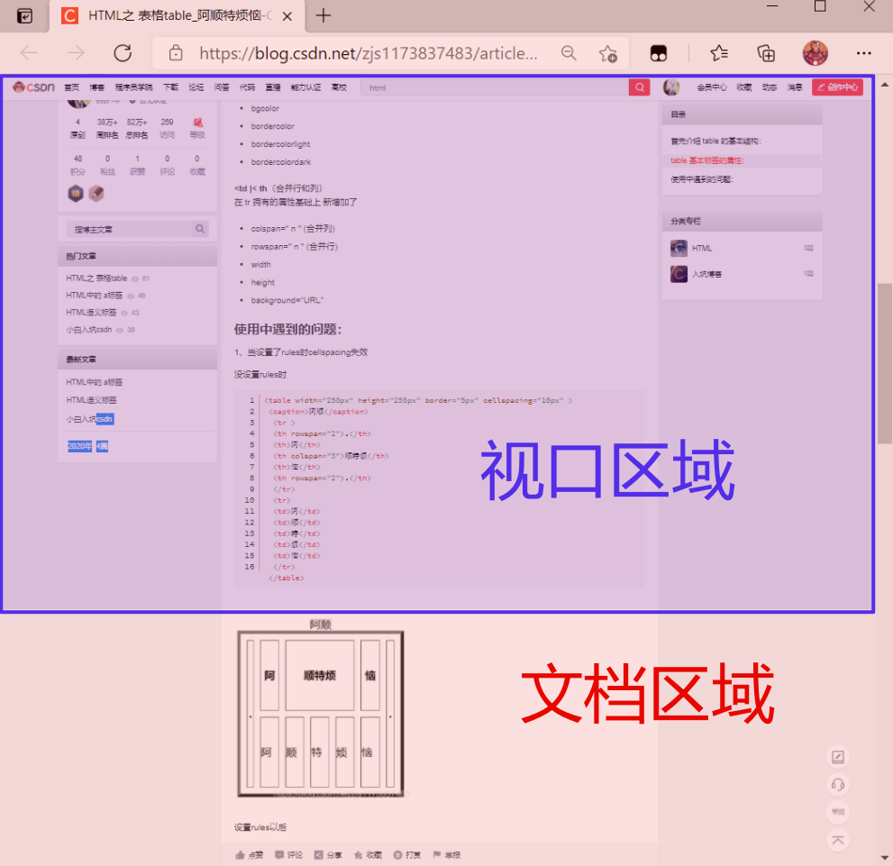

#### 视口与文档尺寸

视口坐标需要知道滚动条位置才可以进行计算，有以下几种方式获取滚动位置


| 方法                                  | 说明     | 注意                 |
| ------------------------------------- | -------- | -------------------- |
| window.innerWidth                     | 视口宽度 | 包括滚动条（不常用） |
| window.innerHeight                    | 视口高度 | 包括滚动条（不常用） |
| document.documentElement.clientWidth  | 视口宽度 |                      |
| document.documentElement.clientHeight | 视口高度 |                      |


### 几何尺寸

元素在页面中拥有多个描述几何数值的尺寸，下面截图进行了形象的描述。

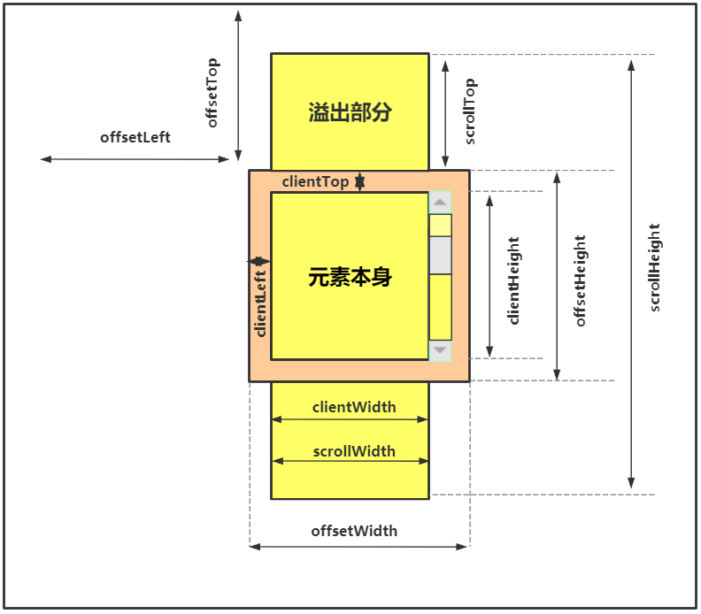


#### 方法列表

下面是获取尺寸的方法或属性

| 方法                          | 说明                                                         | 备注                           |
| ----------------------------- | ------------------------------------------------------------ | ------------------------------ |
| element.getBoundingClientRect | 返回元素在视口坐标及元素大小，width/height不包括外边距，与offsetWidth/offsetHeight匹配 | 窗口坐标                       |
| element.getClientRects        | 行级元素每行尺寸位置组成的数组                               |                                |
| element.offsetParent          | 拥有定位属性的父级，或body/td/th/table                       | 对于隐藏元素/body/html值为null |
| element.offsetWidth           | 元素宽度尺寸，包括内边距与边框和滚动条                       |                                |
| element.offsetHeight          | 元素高度尺寸，包括内边距与边框和滚动条                       |                                |
| element.offsetLeft            | 相对于祖先元素的X轴坐标                                      |                                |
| element.offsetTop             | 相对于祖先元素的Y轴坐标                                      |                                |
| element.clientWidth           | 元素宽度，不包含边框，只包含内容和内边距，行元素尺寸为0      |                                |
| element.clientHeight          | 元素高度，不包含边框，只包含内容和内边距，行元素尺寸为0      |                                |
| element.clientLeft            | 内容距离外部的距离，滚动条在左侧时包括滚动条尺寸             |                                |
| element.clientTop             | 内容距离顶部的距离，滚动条在顶部时包括滚动条尺寸             |                                |
| element.scrollWidth           | 元素宽度，内容+内边距+内容溢出的尺寸                         |                                |
| element.scrollHeight          | 元素高度，内容+内边距+内容溢出的尺寸                         |                                |
| element.scrollLeft            | 水平滚动条左侧已经滚动的宽度                                 |                                |
| element.scrollTop             | 垂直滚动条顶部已经滚动的高度                                 |                                |


#### getComputedStyle

为什么不要使用getComputedStyle

- 尺寸设置auto时获取结果不可用
- 由于滚动条的存在，不同浏览器返回结果不同
- 当元素没有设置CSS尺寸时，获取不到相应的尺寸内容

#### getBoundingClientRect

使用`getBoundingClientRect`获取元素矩形信息


```
<style>
      div {
        height: 300px;
        width: 300px;
        padding: 10px;
        margin: 10px;
        border: 5px solid #ddd;
        overflow: hidden;
      }
</style>
<body>
	<div></div>  
</body>
<script>
        let div = document.querySelector("div");
        let position = div.getBoundingClientRect();
        console.log(position);
</script>
```

计算结果的矩形尺寸不包括外边距

```
bottom: 340
height: 330
left: 18
right: 348
top: 10
width: 330
x: 18
y: 10
```


#### getClientRects

getClientRects使用场景：多行元素时 分别返回每行所占的尺寸，下面的行元素将为每行返回对应矩形尺寸

```text
<style>
	span {
    width: 200px;
    overflow: auto;
  }
</style>

<span>
网页很多都是多屏，所以文档尺寸一般大于视口尺寸,当打开控制台后，视口尺寸相应变小。网页很多都是多屏，所以文档尺寸一般大于视口尺寸,当打开控制台后，视口尺寸相应变小。网页很多都是多屏，所以文档尺寸一般大于视口尺寸,当打开控制台后，视口尺寸相应变小。
</span>
<script>
  let span = document.querySelector('span')
  let info = span.getClientRects()
  console.log(info)
</script>
```

上例计算结果如下

| (index) | x    | y                 | width              | height            | top               | right              | bottom            | left | 值   |
| :------ | :--- | :---------------- | :----------------- | :---------------- | :---------------- | :----------------- | :---------------- | :--- | :--- |
| 0       | 8    | 8                 | 1255.7125244140625 | 20.80000114440918 | 8                 | 1263.7125244140625 | 28.80000114440918 | 8    |      |
| 1       | 8    | 28.80000114440918 | 675.8624877929688  | 20.80000114440918 | 28.80000114440918 | 683.8624877929688  | 49.60000228881836 | 8    |      |
| length  |      |                   |                    |                   |                   |                    |                   |      | 2    |


### 坐标点元素

JS提供了方法获取指定坐标上的元素，如果指定坐标点在视口外，返回值为NULL

- 坐标都是从左上角计算，这与CSS中的right/bottom等不同
- 视口坐标类似于position:fixed
- 文档坐标类似于position:absolute

| 方法                           | 说明                                |
| ------------------------------ | ----------------------------------- |
| element.elementsFromPoint(x,y) | 返回指定坐标点所在的元素集合`Array` |
| element.elementFromPoint(x,y)  | 返回指定坐标点最顶层的元素          |

#### 元素集合

返回指定坐标点上的元素集合`Array`

```text
<style>
      * {
        margin: 0;
        padding: 0;
      }
      div {
        background-color: black;
        width: 100px;
        height: 100px;
      }
</style>
<div id="app"></div>
<script>
  console.log(document.elementsFromPoint(99, 99));
</script>
```

返回结果为

```text
[div#app, body, html]
```

#### 底层元素

返回坐标点上的最底层的元素

```text
<style>
      * {
        margin: 0;
        padding: 0;
      }
      div {
        background-color: black;
        width: 100px;
        height: 100px;
      }
</style>
<div id="app"></div>
<script>
  console.log(document.elementFromPoint(99, 99));
</script>
```

返回结果为

```text
div
```


### 滚动控制

下面掌握文档或元素的滚动操作

#### 方法列表

获取滚动

| 方法               | 说明                           | 参数说明 |
| ------------------ | ------------------------------ | -------- |
| window.pageXOffset | 文档相对视口水平滚动的像素距离 |          |
| window.pageYOffset | 文档相对视口竖直滚动的像素距离 |          |
| element.scrollLeft | 获取和设置元素X轴滚动位置      |          |
| element.scrollTop  | 获取和设置元素Y轴滚动位置      |          |

控制滚动

| 方法                                   | 说明                 | 说明                                                         |
| -------------------------------------- | -------------------- | ------------------------------------------------------------ |
| element.scrollBy()                     | 按偏移量进行滚动内容 | 参数为`obj`，{top:垂直偏移量,left:水平偏移量,behavior:'滚动方式'} |
| element.scroll() 或 element.scrollTo() | 滚动到指定的具体位置 | 参数为`obj`，{top:X轴文档位置,left:Y轴文档位置,behavior:'滚动方式'} |
| element.scrollIntoView(bool)           | 定位到顶部或底部     | 参数为:`obj/boolean`---参数为`boolean`：true元素定位到顶部，为false定位到窗口底部。---参数为`obj`：`{block:"start/end",behavior:"smooth"}` |


#### 获取滚动位置

##### 文档滚动位置

下例是查看文档滚动的X/Y坐标示例,`window.pageXOffset/pageYOffset`

```text
<div style="width: 3000px; height: 3000px; background: #e34334"></div>
<script>
    window.onscroll = function () {
        console.log(window.pageXOffset)
        console.log(window.pageYOffset)
    }
</script>
```

`doucment.documentElement`能够访问到html元素，所以可以使用元素的方法`element.scrollTop/scrollLeft`获取

```
<div style="width: 3000px; height: 3000px; background: #e34334"></div>
<script>
    window.onscroll = function () {
        console.log(document.documentElement.scrollTop)
        console.log(document.documentElement.scrollLeft)
    }
</script>
```


##### 元素滚动位置

下面查看元素内容的滚动属性，请在控制台查看结果

- 要为父元素设置 overflow:scroll 以使其产生滚动条
- 使用scroll 事件来监听结果

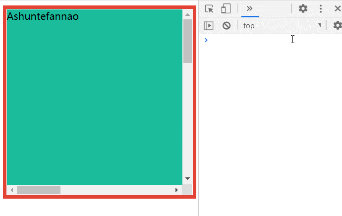

```text
<div id="app" style="width: 300px; height: 300px; border: solid 6px #e34334; overflow: auto">
    <div style="width: 1000px; height: 1000px; background: #833ca4"></div>
</div>
<script>
    const app = document.getElementById('app')
    app.addEventListener('scroll', function () {
        console.log(this.scrollLeft)
        console.log(this.scrollTop)
    })
</script>
```


#### 控制滚动位置

下面介绍的是控制元素滚动的操作方法

##### scrollBy

使用`scrollBy({top,left,behavior})`**按偏移量**滚动整个文档

- `behavior:smooth `为平滑滚动

```text
<style>
      body {
        height: 2000px;
        background: linear-gradient(
          to bottom,
          #ecf0f1,
          #1abc9c,
          #f39c12,
          #ecf0f1
        );
      }
</style>

<script type="module">
//每隔1秒,向下滚动30px,参照上次的位置，即按偏移量进行滚动
  setInterval(() => {
    document.documentElement.scrollBy({ top: 30, behavior: 'smooth' })
  }, 1000)
</script>
```

使用`scrollTop/scrollLeft`实现

```
……
      let top = 0;
      setInterval(() => {
        top += 30;
        document.documentElement.scrollTop = top;
      }, 1000);
```


##### scroll

使用`scroll({top,left,behavior})`滚动到指定位置

- `behavior:smooth` 为平滑滚动

```text
<style>
  body {
    height: 3000px;
  }
</style>

<script type="module">
//3秒后，滚动到指定位置
  setTimeout(() => {
    document.documentElement.scroll({ top: 30, behavior: 'smooth' })
  }, 1000)
</script>
```

使用`scrollTop/scrollLeft`实现

```
……
      setTimeout(() => {
        document.documentElement.scrollTop = 30;
      }, 1000);
```


##### scrollIntoView

使用元素scrollIntoView方法实现滚动操作，参数可以是布尔值或对象

* 参数为Boolean
  * 参数为 true 时顶部对齐，相当于{block: "start"}
  * 参数为 false 时底部对齐，相当于{block: "end"}
* 参数为obj
  * block:"start/width"
  * behavior:"smooth"

```text
<style>
    div {
        height: 2000px;
        background: red;
        border-top: solid 50px #efbc0f;
        border-bottom: solid 50px #1bb491;
    }
    span {
        border-radius: 50%;
        color: #fff;
        background: #000;
        width: 50px;
        height: 50px;
        display: block;
        text-align: center;
        line-height: 50px;
        position: fixed;
        top: 50%;
        right: 50px;
        border: solid 2px #ddd;
    }
</style>
<div id="app">hdcms.com</div>
<span>TOP</span>

<script>
    document.querySelector('span').addEventListener('click', () => {
        let app = document.querySelector('#app')
        app.scrollIntoView({ block: 'end', behavior: 'smooth' })
    })
</script>
```


#### 案例应用

##### backTop

下例是开发中常用的回到顶部示例


```
<style>
      body {
        height: 2000px;
        background: linear-gradient(
          to bottom,
          #ecf0f1,
          #1abc9c,
          #f39c12,
          #ecf0f1
        );
      }
      .backtop {
        width: 50px;
        height: 50px;
        position: fixed;
        right: 10px;
        bottom: 10px;
        z-index: 1;
        display: flex;
        justify-content: center;
        align-items: center;
        background-color: rgba(0, 0, 0, 0.75);
        color: white;
        border-radius: 50%;
        transition: 0.6s;
        transform: scale(0);
      }
      .show {
        transform: scale(1) rotateZ(360deg);
      }
</style>
<body>
    <div class="backtop">Top</div>
</body>
<script>
      let backtop = document.querySelector(".backtop");
      backtop.addEventListener("click", () => {
        document.documentElement.scrollIntoView({
          block: "start",
          behavior: "smooth",
        });
      });
      
      window.onscroll = function () {
        let test =
          document.documentElement.scrollTop +
            document.documentElement.clientHeight >
          document.documentElement.scrollHeight - 300;

        backtop.classList[test ? "add" : "remove"]("show");
      };
</script>
```


##### 漂浮广告

下面是全屏漂浮广告的示例

```
<style>
      div {
        border-radius: 10px;
        text-align: center;
        color: rgba(255, 255, 255, 0.8);
        width: 200px;
        height: 200px;
        background-color: #e34334;
      }
</style>
<body>
	<div id="app">阿顺特烦恼</div>
</body>
<script>
      class Ad {
        constructor(preset) {
          this.$el = preset.el;
          //初始移动方向，1向下/向右 -1 向上/向左
          this.x = this.y = 1;
          this.preset = Object.assign({delay: 10,step: 1,},preset);
          this.run();
        }
        run() {
          this.init();
          setInterval(() => {
            this.$el.style.left = this.leftMove() + "px";
            this.$el.style.top = this.topMove() + "px";
          }, this.preset.delay);
        }
        //设置定位模式
        init() {
          this.$el.style.position = "fixed";
          this.$el.style.top = 0;
          this.$el.style.left = 0;
        }
        leftMove() {
          let { x, width } = this.$el.getBoundingClientRect();
          let { clientWidth } = document.documentElement;
          if (x > clientWidth - width) this.x = -1;
          if (x < 0) this.x = 1;

          return x + this.preset.step * this.x;
        }
        topMove() {
          let { y, height } = this.$el.getBoundingClientRect();
          let { clientHeight } = document.documentElement;
          if (y > clientHeight - height) this.y = -1;
          if (y < 0) this.y = 1;
          return y + this.preset.step * this.y;
        }
      }

      let div = document.querySelector("div");
      new Ad({ el: div });
</script>
```


## 事件

在文档、浏览器、标签元素等元素在特定状态下触发的行为即为事件，比如用户的单击行为、表单内容的改变行为即为事件，我们可以为不同的事件定义处理程序。JS使用异步事件驱动的形式管理事件。

**事件类型**

JS为不同的事件定义的类型，也可以称为事件名称。

**事件目标**

事件目标指触发事件的对象，比如a标签被点击那么a标签就是事件目标。元素是可以嵌套的，所以在进行一次点击行为时可能会触发多个事件目标(事件冒泡)。


### 处理程序

事件的目的是要执行一段代码，我们称这类代码块为事件处理（监听）程序。当在对象上触发事件时就会执行定义的事件处理程序。

#### HTML绑定

可以在html元素上设置事件处理程序，浏览器解析后会绑定到DOM属性中

```text
<button onclick="alert(`Ashuntefannao`)">阿顺特烦恼</button>
```

往往事件处理程序业务比较复杂，所以绑定方法或函数会很常见

- 绑定函数或方法时需要加上括号

```text
<button onclick="show()">阿顺特烦恼</button>
<script>
  function show() {
    alert('Ashuntefannao')
  }
</script>
```

当然也可以使用对象方法做为事件处理程序

```text
<input type="text" onkeyup="SHUN.show()" />
<script>
  class SHUN {
    static show() {
      console.log('Ashun')
    }
  }
</script>
```

可以传递事件源对象与事件对象

* 传入`this`指向事件源span元素
* 传入`event`指向事件对象，可通过其访问各种事件处理的属性/方法。

```text
<!-- this指向span元素，event为事件对象，-->
<span onclick="show(this,'Ashun','阿顺特烦恼',event)">ASHUN</span>
<script>
    function show(...args) {
        console.log(args)
    }
</script>
```

#### DOM绑定

也可以将事件处理程序绑定到DOM属性中

- 使用setAttribute方法设置事件处理程序无效
- 属性名区分大小写

```text
<div id="app">Ashuntefannao/div>
<script>
  const app = document.querySelector('#app')
  app.onclick = function () {
    this.style.color = 'red'
  }
</script>
```

无法为事件类型绑定多个事件处理程序，下面绑定了多个事件处理程序，因为属性是相同的所以只有最后一个有效

```text
<div id="app">Ashuntefannao</div>
<script>
  const app = document.querySelector('#app')
  app.onclick = function () {
    this.style.color = 'red'
  }
  app.onclick = function () {
    this.style.fontSize = '55px'
  }
</script>
```


### 事件监听

通过上面的说明我们知道使用HTML与DOM绑定事件都有缺陷，建议使用新的事件监听绑定方式addEventListener 操作事件

使用addEventListener添加事件处理程序有以下几个特点

- transtionend / DOMContentLoaded 等事件类型只能使用 addEventListener 处理
- 同一事件类型可以设置多个事件处理程序，按设置的顺序先后执行
- 也可以对未来添加的元素绑定事件

| 方法                | 说明             |
| ------------------- | ---------------- |
| addEventListener    | 添加事件处理程序 |
| removeEventListener | 移除事件处理程序 |

addEventListener的参数说明如下

1. 参数一事件类型
2. 参数二事件处理程序callback
   * callback默认接收`event事件对象`参数
3. 参数三为定制的选项，可传递object或boolean类型。后面会详细介绍使用区别

#### 绑定多个事件

使用addEventListener来多个事件处理程序

```text
<div id="app">Ashuntefannao</div>
<script>
  const app = document.querySelector('#app')
  app.addEventListener('click', function () {
    this.style.color = 'red'
  })
  app.addEventListener('click', function () {
    this.style.fontSize = '55px'
  })
</script>
```

#### 通过对象绑定

`事件处理程序可以是对象`，对象的 handleEvent 方法会做为事件处理程序执行。下面将元素的事件统一交由对象处理

```text
<div id="app">Ashuntefannao</div>
<script>
  const app = document.querySelector('#app')
  class Events {
    handleEvent(e) {
      this[e.type](e)
    }
    click() {
      console.log('单击事件')
    }
    mouseover() {
      console.log('鼠标悬停事件')
    }
  }
  app.addEventListener('click', new Events())
  app.addEventListener('mouseover', new Events())
</script>
```


#### 移除事件

使用removeEventListener删除事先绑定的事件处理函数

- 事件处理程序单独定义函数或方法，这可以保证访问的事件处理程序是同一个

```text
<div id="app">Ashuntefannao</div>
<button id="rmEvent">删除事件</button>

<script>
  const app = document.querySelector('#app')
  const rm = document.querySelector('#rmEvent')
  function show(event) {
  	console.log(event.target)
    console.log('APP我执行了')
  }
  app.addEventListener('click', show)
  rm.addEventListener('click', function () {
    app.removeEventListener('click', show)
  })
</script>
```


#### 事件选项

addEventListener的第三个参数为定制的选项，可传递object或boolean类型

下面是传递对象时的说明

| 选项    | 可选参数   |                                                              |
| ------- | ---------- | ------------------------------------------------------------ |
| once    | true/false | 只执行一次事件                                               |
| capture | true/false | 事件是在捕获/冒泡哪个阶段执行，true:捕获阶段 false:冒泡阶段，默认为false |
| passive | true/false | 声明事件里不会判断 `preventDefault()`，可以减少系统默认行为的等待 |

传递Boolean时

* true：事件捕获方式执行，等同于参数`{capture:true}`
* false：事件冒泡方式执行，等同于参数`{capture:false}`

**事件捕获**

事件执行顺序：最顶层window->最底层触发事件的dom

**事件冒泡**

事件执行顺序与事件捕获相反


下面使用once:true 来指定事件只执行一次

```text
<button id="app">Ashuntefannao</button>
<script>
    const app = document.querySelector('#app')
    app.addEventListener(
        'click',
        function () {
            alert('阿顺特烦恼_Ashun')
        },
        { once: true }
    )
</script>
```

设置 `{ capture: true }` 或直接设置第三个参数为true用来在捕获阶段执行事件

> addEventListener的第三个参数传递true/false 和设置 {capture:true/false}是一样

```text
<div id="app" style="background-color: red">
    <button id="bt">Ashuntefannao</button>
</div>
<script>
    const app = document.querySelector('#app')
    const bt = document.querySelector('#bt')
    app.addEventListener(
        'click',
        function () {
            alert('这是div事件 ')
        },
        { capture: true }
    )

    bt.addEventListener(
        'click',
        function () {
            alert('这是按钮事件 ')
        },
        { capture: true }
    )
</script>
```

设置 `{ capture: false }` 或 直接设置第三个参数为false 或 不设置第三个参数(默认为false), 用来在冒泡阶段执行事件

```text
<div id="app" style="background-color: red">
    <button id="bt">Ashuntefannao</button>
</div>
<script>
    const app = document.querySelector('#app')
    const bt = document.querySelector('#bt')
    app.addEventListener(
        'click',
        function () {
            alert('这是div事件 ')
        },
        { capture: false }
    )

    bt.addEventListener(
        'click',
        function () {
            alert('这是按钮事件 ')
        },
        { capture: false }
    )
</script>
```

`passive`选项:   声明事件里不会判断 `preventDefault()`，可以减少系统默认行为的等待

很多移动端的页面都会监听 touchstart 等 touch 事件，像这样：

```
document.addEventListener("touchstart", function(e){
    ... // 浏览器不知道这里会不会有 e.preventDefault()
})
```

由于 touchstart 事件对象的 cancelable 属性为 true，也就是说它的默认行为可以被监听器通过 preventDefault() 方法阻止，那它的默认行为是什么呢，通常来说就是滚动当前页面（还可能是缩放页面），如果它的默认行为被阻止了，页面就必须静止不动。但浏览器无法预先知道一个监听器会不会调用 preventDefault()，它能做的只有等监听器执行完后再去执行默认行为，而监听器执行是要耗时的，有些甚至耗时很明显，这样就会导致页面卡顿。即便监听器是个空函数，也会产生一定的卡顿，毕竟空函数的执行也会耗时。


### 事件对象

执行事件处理程序时，会产生包含当前事件相关信息的对象，即为事件对象。**系统会自动做为参数传递给事件处理程序**。

- 大部分浏览器将事件对象保存到window.event中
- 有些浏览器会将事件对象做为事件处理程序的参数传递

事件对象常用属性如下：

| 属性               | 说明                                                         |
| ------------------ | ------------------------------------------------------------ |
| type               | 事件类型                                                     |
| target             | 事件目标对象，冒泡方式时父级对象可以通过该属性找到在哪个子元素上最终执行事件 |
| currentTarget      | 当前执行事件的对象                                           |
| timeStamp          | 事件发生时间                                                 |
| x                  | 相对窗口的X坐标                                              |
| y                  | 相对窗口的Y坐标                                              |
| clientX            | 相对窗口的X坐标                                              |
| clientY            | 相对窗口的Y坐标                                              |
| screenX            | 相对计算机屏幕的X坐标                                        |
| screenY            | 相对计算机屏幕的Y坐标                                        |
| pageX              | 相对于文档的X坐标                                            |
| pageY              | 相对于文档的Y坐标                                            |
| offsetX            | 相对于事件对象的X坐标                                        |
| offsetY            | 相对于事件对象的Y坐标                                        |
| layerX             | 相对于父级定位的X坐标                                        |
| layerY             | 相对于父级定位的Y坐标                                        |
| path               | 冒泡的路径                                                   |
| altKey             | 是否按了alt键                                                |
| shiftKey           | 是否按了shift键                                              |
| metaKey            | 是否按了媒体键                                               |
| window.pageXOffset | 文档参考窗口水平滚动的距离                                   |
| window.pageYOffset | 文档参考窗口垂直滚动的距离                                   |


### 冒泡捕获

#### 冒泡行为

事件默认是冒泡执行的：标签元素是嵌套的，在一个元素上触发的事件，同时也会向上触发父级元素对应的事件处理程序，一直到最顶层window。

- 大部分事件都会冒泡，但像focus事件则不会
- event.target `指向事件链中最底层事件的对象`
- event.currentTarget == this 即当前执行事件的对象

以下示例有标签的嵌套，并且父子标签都设置了事件，当在子标签上触发事件事会冒泡执行父级标签的事件，直至window

```
<style>
      #app {
        height: 70px;
        background-color: #95a5a6;
      }
      strong {
        display: block;
        height: 30px;
        background-color: #f39c12;
      }
</style>
<body>
    <div id="app">
      Ashuntefannao
      <strong>MyStrong</strong>
    </div>
</body>
 <script>
      const app = document.querySelector("#app");
      const strong = document.querySelector("strong");
      
      window.addEventListener("click", () => {
        console.log("window Method");
      });
      document.documentElement.addEventListener("click", () => {
        console.log("html Method");
      });
      app.addEventListener("click", () => {
        console.log("App Method");
      });
      strong.addEventListener("click", () => {
        console.log("strong Method");
      });
</script>
```

下例无论点击哪个元素，都会变为**蓝色**

* `event.target`指向事件链中的最底层的事件对象

```
<style>
      body {
        width: 100vw;
        height: 100vh;
        display: flex;
        justify-content: center;
        align-items: center;
      }

      article {
        width: 200px;
        height: 200px;
        display: flex;
        justify-content: center;
        align-items: center;
        background: #5f27cd;
        border-radius: 10px;
      }

      section {
        width: 100px;
        height: 100px;
        background: #ff9f43;
        border-radius: 5px;
      }
</style>
<body>
    <article>
      <section></section>
    </article>
</body>
<script>
    document.body.addEventListener("click", (evnet) => {
      event.target.style.background = "#0abde3"; // 祖先级body改蓝色
      console.log(event.target);	//由于冒泡执行，点击任意元素，该语句都会执行
    });

    document.querySelector("article").addEventListener("click", (event) => {
      event.target.style.background = "#ee5253"; // 父级article改红色
    });

    document.querySelector("section").addEventListener("click", (event) => {
      event.target.style.background = "#10ac84"; // 子级section改绿色
    });
</script>
```

若通过`event.currentTarget`处理当前所触发事件的元素，则更改的颜色就会对应起来

* 由于事件冒泡，点击某个元素，也会导致其祖先元素的更改

```
……
    document.body.addEventListener("click", (evnet) => {
      event.currentTarget.style.background = "#0abde3"; // 祖先级body改蓝色
    });

    document.querySelector("article").addEventListener("click", (event) => {
      event.currentTarget.style.background = "#ee5253"; // 父级article改红色
    });

    document.querySelector("section").addEventListener("click", (event) => {
      event.currentTarget.style.background = "#10ac84"; // 子级section改绿色
    });
```


#### 阻止冒泡

冒泡过程中的任何事件处理程序中，都可以执行 `event.stopPropagation/stopImmediatePropagation()` 方法阻止继续进行冒泡传递

- event.stopPropagation() 用于阻止冒泡
- event.stopImmediatePropagation() 阻止`事件冒泡`并且阻止`相同事件类型的其他事件处理函数被调用`


使用event.stopPropagation处理冒泡行为中的例子，通过阻止冒泡，点击某个元素，不会影响祖先元素的背景颜色

```
……
    document.body.addEventListener("click", (evnet) => {
      event.currentTarget.style.background = "#0abde3";
      console.log(event.target);
    });

    document.querySelector("article").addEventListener("click", (event) => {
      event.stopPropagation();
      event.currentTarget.style.background = "#ee5253";
      console.log(event.currentTarget);
    });

    document.querySelector("section").addEventListener("click", (event) => {
      event.stopPropagation();
      event.currentTarget.style.background = "#10ac84";
    });
```

`stopPropagation`只是阻止冒泡，不会阻止相同事件类型的其它事件处理函数

```
</body>
	<div id="app">
      Ashuntefannao
      <strong>MyStrong</strong>
	</div>
</body>
 			const app = document.querySelector("#app");
      const strong = document.querySelector("strong");

      app.addEventListener("click", () => {
        console.log("App Method");
      });
      strong.addEventListener("click", (e) => {
        e.stopPropagation();
        console.log("strong Method__1");
      });
      strong.addEventListener("click", () => {
        console.log("strong Method__2");
      });
```

点击strong，打印结果

```
//strong Method__1
//strong Method__2
```

若将上述代码中的`stopPropagation`改为`stopImmediatePropagation`，则也会阻止相同事件的其它处理函数

```
点击strong，打印结果: //strong Method__1
```


#### 事件捕获

事件捕获：事件执行顺序与冒泡行为相反，会由事件链的最顶层window逐步向下传递执行。事件捕获在实际使用中频率不高。

- 通过设置第三个参数为true或{ capture: true } 在捕获阶段执行事件处理程序

  ```
  <style>
        #app {
          height: 70px;
          background-color: #95a5a6;
        }
        strong {
          display: block;
          height: 30px;
          background-color: #f39c12;
        }
  </style>
  <body>
      <div id="app">
        Ashuntefannao
        <strong>MyStrong</strong>
  		</div>
  </body>
  <script>
       const app = document.querySelector("#app");
       const strong = document.querySelector("strong");
  
        app.addEventListener(
          "click",
          () => {
            console.log("App Method");
          },
          true
        );
        
        strong.addEventListener("click", (e) => {
          console.log("strong Method__1");
        });
        strong.addEventListener("click", () => {
          console.log("strong Method__2");
        });
  </script>
  ```

  由于在给`#app`添加事件时，第三个参数设置为`true/{capture:true}`,在事件捕获阶段执行，所以在点击`strong`时，会先执行`#app`的事件处理程序

  ```
  # 结果
  App Method
  strong Method__1
  strong Method__2
  ```

  

#### 事件代理

借助冒泡思路，我们可以不为子元素设置事件，而将事件设置在父级。然后通过父级事件对象的`event.target`查找事件链底层的元素，并对它做出处理。

- 这在为多个元素添加相同事件时很方便
- 会使添加事件变得非常容易

下面是为父级UL设置事件来控制子元素LI的样式切换

```
<style>
      .active {
        border-radius: 10px;
        background-color: #eee;
        text-align: center;
      }
</style>
<body>
    <ul>
      <li>阿顺</li>
      <li>Ashuntefannao</li>
    </ul>
</body>

<script>
   document.querySelector("ul").addEventListener("click", (e) => {
      e.target.classList.toggle("active");
    });
</script>
```

可以使用事件代理来共享事件处理程序，不用为每个元素单独绑定事件

```
  <ul>
      <li data-action="border" data-border="2px solid #aaa">阿顺</li>
      <li data-action="color" data-color="red">Ashuntefannao</li>
  </ul>
<script>
    class Event {
      constructor(el) {
        el.addEventListener("click", (e) => {
          let action = e.target.dataset.action;
          this[action](e.target);
        });
      }
      border(event) {
        event.style.border = event.dataset.border;
      }
      color(event) {
        console.log(event.dataset);
        event.style.color = event.dataset.color;
      }
    }
    new Event(document.querySelector("ul"));
</script>
```

下面是使用事件代理实现的TAB面板效果

```
<style>
			.tab {
        width: 200px;
      }
      dl {
        display: flex;
        flex-direction: column;
        align-items: center;
        justify-content: center;
      }
      dt,
      dd {
        width: 100%;
        color: white;
      }
      dt {
        height: 30px;
        background-color: #34495e;
      }
      dd {
        margin: 0;
        padding: 0;
        height: 60px;
        background-color: #e67e22;
      }
</style>
<body>
   <div class="tab">
      <dl>
        <dt data-action="toggle">阿顺特烦恼</dt>
        <dd data-action="hidden">Ashuntefannao</dd>
        <dt data-action="toggle">阿顺</dt>
        <dd data-action="hidden">Ashun</dd>
      </dl>
    </div>
</body>
<script>
    class Card {
      constructor(el) {
        el.addEventListener("click", (e) => {
          let action = e.target.dataset.action;
          this[action](e);
        });
      }
      toggle(event) {
        event.target
          .querySelectorAll("[data-action='hidden']")
          .forEach((elem) => (elem.hidden = true));
        event.target.nextElementSibling.hidden = false;
      }
      hidden(event) {
        event.target.hidden = true;
      }
    }
    new Card(document.querySelector(".tab"));
</script>
```

下面实现通过代理事件行为，在表单提交时禁用提交按钮，并记录提示次数

```text
<form>
  <input type="text" />
  <button type="button" data-submit-disabled data-action="submit,counter">提交表单</button>
</form>
<script>
    class FORM {
      constructor(el) {
        this.$el = el;
        this.sum = 0;
        el.addEventListener("click", (e) => {
          let actions = e.target.dataset.action;
          actions &&
            actions.split(",").forEach((method) => {
              this[method](e);
            });
        });
      }
      submit(e) {
        this.disabled(e, true);
        console.log("正在提交");

        setTimeout(() => {
          console.log("提交成功！");
          this.disabled(e, false);
        }, 1000);
      }
      disabled(event, boolean) {
        this.$el
          .querySelectorAll("[data-submit-disabled]")
          .forEach((btn) => (btn.disabled = boolean));
      }
      counter() {
        console.log(`提交次数:${++this.sum}`);
      }
    }
    new FORM(document.querySelector("form"));
</script>
```


#### 未来元素

下面使用事件代理来对未来元素进行事件绑定

```text
<div id="app">

</div>

<script>
  function show() {
    console.log(this.textContent)
  }
  const app = document.querySelector('#app')
  app.addEventListener('click', () => {
    show.call(event.target)
  })
  let newH2 = document.createElement('h2')
  newH2.textContent = 'Ashuntefannao'
  app.append(newH2)
</script>
```

我们可以将这个功能封装起来，用来代理某一类未来元素的事件

```
<div id="app">
      <section>My name is Section</section>
</div>

<script>
    Element.prototype.on = function (EventType, Element, func) {
      this.addEventListener(EventType, (event) => {
        if (event.target.tagName === Element.toUpperCase()) {
          func(event);
        }
      });
    };

    let app = document.querySelector("#app");

    app.on("click", "h2", (event) => {
      console.log(event.target);
    });

    let h2 = document.createElement("h2");
    h2.innerText = "Ashuntefannao";
    app.append(h2);
</script>
```


### 默认行为

JS中有些对象会设置默认事件处理程序，比如A链接在点击时会进行跳转，点击submit会提交表单信息…

一般默认处理程序会在用户定义的处理程序后执行，我们可以在事件处理函数中取消默认事件的执行。

- 使用onclick绑定的事件处理程序，return false 可以阻止默认行为
- 推荐使用`event.preventDefault()`阻止默认行为

下面阻止超链接的默认行为

```text
<a href="https://www.baidu.com">百度一下，你就知道</a>
<script>
  document.querySelector('a').addEventListener('click', () => {
    event.preventDefault()
    alert(event.target.innerText)
  })
</script>
```


### 文档事件

下面来学习针对文档事件的处理。

#### 事件类型

| 事件名                | 说明                                                         |
| --------------------- | ------------------------------------------------------------ |
| window.onload         | 文档解析及外部资源加载后                                     |
| DOMContentLoaded      | 文档解析后执行，不需要等待图片/样式文件等外部资源加载，该事件只能通过addEventListener设置 |
| window.onbeforeunload | 文档刷新或关闭时                                             |
| window.onunload       | 文档卸载时                                                   |
| scroll                | 页面滚动时                                                   |

#### onload

window.onload事件在文档解析后及图片、外部样式文件等资源加载完后执行

```text
<script>
  window.onload = function () {
    alert('阿顺特烦恼')
  }
</script>
<div id="app">Ashuntefannao</div>
```


#### DOMContentLoaded

DOMContentLoaded事件在文档标签解析后执行，不需要等外部图片、样式文件、JS文件等资源加载

* 该事件只能够通过`addEventListener`添加

```text
<script>
  window.addEventListener('DOMContentLoaded', (event) => {
    alert('阿顺特烦恼')
  })
</script>
<div id="app">Ashuntefannao</div>
```


#### onbeforeunload

当浏览器窗口关闭或者刷新时，会触发beforeunload事件，可以取消关闭或刷新页面。

- 返回值为非空字符串时，有些浏览器会做为弹出的提示信息内容
- 部分浏览器使用addEventListener无法绑定事件

```text
window.onbeforeunload = function (e) {
  return '真的要离开吗？'
}
```


#### unload

window.unload事件在文档资源被卸载时执行，在beforeunload后执行

- 不能执行alert、confirm等交互指令
- 发生错误也不会阻止页面关闭或刷新

```text
//文档被关闭时，在localStorage中存储用户信息
window.addEventListener('unload', function (e) {
  localStorage.setItem('name', 'Ashun')
})
```


### 鼠标事件

#### 事件类型

针对鼠标操作的行为有多种事件类型

- 鼠标事件会触发在Z-INDEX 层级最高的那个元素上

| 事件名      | 说明                                                      |
| ----------- | --------------------------------------------------------- |
| click       | 鼠标单击事件，同时触发 mousedown/mouseup                  |
| dblclick    | 鼠标双击事件                                              |
| contextmenu | 点击右键后显示的所在环境的菜单                            |
| mousedown   | 鼠标按下                                                  |
| mouseup     | 鼠标抬起时                                                |
| mousemove   | 鼠标移动时                                                |
| mouseover   | 鼠标移动时                                                |
| mouseout    | 鼠标从元素上离开时                                        |
| mouseup     | 鼠标抬起时                                                |
| mouseenter  | 鼠标移入时触发，不产生冒泡行为                            |
| mosueleave  | 鼠标移出时触发，不产生冒泡行为                            |
| oncopy      | 复制内容时触发                                            |
| scroll      | 元素滚动时，可以为元素设置overflow:auto; 产生滚动条来测试 |


#### 禁止复制

```text
    document.addEventListener('copy', () => {
      event.preventDefault()
      alert('禁止复制内容')
    })
```


#### relatedTarget

relatedTarget是控制鼠标移动事件的来源和目标对象的

- 如果移动过快会跳转中间对象

```text
<div id="app">Ashuntefannao</div>
<div id="shun">SHUN</div>
<script>
  const app = document.querySelector(`#app`)
  const shun = document.querySelector(`#shun`)
  app.addEventListener('mouseout', () => {
    console.log(event.target)
    console.log(event.relatedTarget)
  })
</script>
```


#### mouseenter与mouseleave

mouseenter与mouseleave事件从子元素移动到父元素时不触发父元素事件

```text
<style>
  #app {
    background: #e74c3c;
    padding: 80px;
    width: 500px;
  }
  #shun {
    background: #f39c12;
    padding: 30px;
  }
</style>
 <div id="app">
 	Ashuntefannao
  <div id="shun">SHUN</div>
 </div>

<script>
  const app = document.querySelector(`#app`)
  const shun = document.querySelector(`#shun`)

  app.addEventListener('mouseenter', () => {
    console.log('app')
  })
  shun.addEventListener('mouseenter', () => {
    console.log('shun')
  })
</script>
```


### 键盘事件

针对键盘输入操作的行为有多种事件类型

| 事件名   | 说明                                                 |
| -------- | ---------------------------------------------------- |
| Keydown  | 键盘按下时，一直按键不松开时keydown事件会重复触发    |
| keyup    | 按键抬起时                                           |
| keypress | 按键 按下、抬起 都会触发，一直按键不松开也会持续触发 |

#### 事件对象

键盘事件产生的事件对象包含相对应的属性

| 属性     | 说明                                                         |
| -------- | ------------------------------------------------------------ |
| keyCode  | 返回键盘的ASCII字符数字                                      |
| code     | 按键码，字符以Key开始，数字以Digit开始，特殊字符有专属名子。左右ALT键字符不同。 不同布局的键盘值会不同 |
| key      | 按键的字符含义表示，大小写不同。不能区分左右ALT等。不同语言操作系统下值会不同 |
| altKey   | 是否按了alt键                                                |
| ctrlKey  | 是否按了ctlr键                                               |
| shiftKey | 是否按了shift键                                              |
| metaKey  | 是否按了媒体键                                               |


### 表单事件

下面是可以用在表单上的事件类型

| 事件类型        | 说明                                     |
| --------------- | ---------------------------------------- |
| focus           | 获取焦点事件                             |
| blur            | 失去焦点事件                             |
| element.focus() | 让元素强制获取焦点                       |
| element.blur()  | 让元素失去焦点                           |
| change          | 文本框在`内容发生改变`并`失去焦点`时触发 |
| input           | `value` 被修改时，会触发 `input` 事件    |
| submit          | 提交表单时触发                           |


## 网络请求

### 基础知识

浏览器天生具发送HTTP请求的能力，比如在在址栏输入内容，提交FORM表单等。本章来学习通过JS程序来管理HTTP请求的能力。

#### 局部更新

最传统的网络请求是通过提交表单进行的，表单的提交、地址栏输入内容，都会导致界面的全部刷新。

而使用JS脚本发送HTTP请求，**`不会带来页面的刷新`**，我们可以向后台请求数据，拿到数据后渲染到界面上，会有页面局部更新的效果，所以用户体验非常好。

#### 请求方式

请求方式有很多，一般使用以下4种

1. GET

   >该方式一般应用于 单纯获取数据 的业务，请求参数包含在URL内

2. POST

   >该方式一般应用于 向服务器提交数据 ，请求参数置于请求体当中

3. PUT

   >该方式一般应用于 更改服务器数据 的业务

4. DELETE

   >该方式一般应用于 删除服务器数据 的业务


---

### 基本使用

#### 方法介绍

##### open

`open()`用于创建请求（单纯创建，并不发送）

> 注意：如果`open()`的`method`为`GET`，则`url`需要自带参数。
>
> * get请求就是通过url进行的
> * 参数格式`key=val`多个参数之间使用`&`隔开

| 参数   | 说明                 |
| ------ | -------------------- |
| method | 请求方式             |
| url    | 请求地址             |
| async  | 是否异步(默认为true) |


##### send

`send(body)`用于发送请求

* 若请求方式为`GET`，则不用为其传递参数(get请求在url中传参)。
* 若请求方式为`POST`,则要把参数传递到`send(body)`中

| 参数 | 说明                               |
| ---- | ---------------------------------- |
| body | 请求体(要发送的数据)（字符串类型） |

```
let xhr = new XMLHttpRequest();
xhr.open("GET", "http://127.0.0.1:5500/test?name=Ashun");
xhr.send();
```

```
let xhr = new XMLHttpRequest();
xhr.setRequestHeader("Content-Type", "application/json");
xhr.open("POST", "http://127.0.0.1:5500/test");
let body={ name: "Ashun" };
xhr.send(body);
```


##### setRequestHeader

用于设置请求头，一般我们会指定编码方式。

* 请求方式为`POST`，需要设置请求头的编码方式，`GET`不用设置。

| 参数   | 说明                        |
| ------ | --------------------------- |
| header | 请求头的key（字符串类型）   |
| vlaue  | 请求头的value（字符串类型） |

* 当传递的参数为form表单形式的数据，则需要设置`Content-type:application/x-www-form-urlencoded`

  ```
  let xhr = new XMLHttpRequest();
  xhr.open("post", "http://127.0.0.1:5500/test");
  xhr.setRequestHeader("Content-Type", "application/x-www-form-urlencoded");
  xhr.send("name=Ashun");
  ```

* 若传递的参数为json字符串，则需要设置`Content-type:application/json`

  ```
  let xhr = new XMLHttpRequest();
  xhr.open("post", "http://127.0.0.1:5500/test");
  xhr.setRequestHeader("Content-Type", "application/json");
  xhr.send(JSON.stringify({ name: "Ashun" }));
  ```

  

##### getAllResponseHeaders

用于获取响应头，返回所有的响应头数据（字符串类型）。

##### getResponseHeader

获取响应头中指定`header`的值，返回该响应头的数据（字符串类型）。

| 参数   | 描述                      |
| ------ | ------------------------- |
| header | 响应头的key（字符串类型） |

##### abort

终止请求。


---

#### 属性介绍

##### status

`HTTP`状态码，如`200/404`等等。

##### statusText

`HTTP`状态文本（字符串），与状态码对应如：OK、NotFound...

| status | statusText |
| :----: | :--------: |
|  200   |     OK     |
|  404   |  NotFound  |

##### readyState

`xhr`状态码，使用`XmlHttpRequest`时共有5种状态。

| 状态值 | 描述                                       |
| ------ | ------------------------------------------ |
| 0      | 未初始化，尚未调用open()方法               |
| 1      | 初始化，调用了open()方法，未调用send()方法 |
| 2      | 发送，已经调用了send()方法，未接收到响应   |
| 3      | 接收，已经接收到部分响应数据               |
| 4      | 完成，已经接收到全部响应数据               |

##### responseText

这是服务器返回的数据（字符串类型）


---

#### 回调函数

以下回调函数需要我们手动配置，当达到对应的状态后自动回调

##### onload

当请求完毕后，会自动执行该函数。

```
xhr.onload = () => {
  console.log(xhr.getAllResponseHeaders());
  console.log(xhr.responseText);
};
```

##### onerror

当请求产生错误时，会自动执行该函数

```
xhr.onerror = () => {
  console.log(xhr.status);
  console.log("请求失败");
};
```


##### onreadystatechange

当xhr状态码改变时，自动回调。 可以结合xhr、HTTP状态码，对请求是否成功做出判断。

```
xhr.onreadystatechange = () => {
  //请求结束，并且成功
  if (xhr.readyState == 4 && xhr.status === 200) { 
    console.log(xhr.responseText);
  } else if (xhr.status == 404) {
    console.log("请求失败");
  }	else if(xhr.status == 500){
    console.log("服务器内部错误")
  }
};
```


#### FormData

`FormData`是JavaScript的一个内置对象，当满足以下使用条件时，会使请求变得更加简便

* 使用表单`form`发送请求
* 请求方式为`POST`

**使用步骤**

1. 实例化对象，并传入表单Dom`let formdata=new FormData(formDom)`
2. 将其置于请求体中`xhr.send(formdata)`

FormData对象，会自动将传入的表单Dom中的数据，转化为正确的形式（`key=val`多个参数使用`&`隔开）。

通过使用步骤可知，使用FormData请求的方式必须为`POST`(请求参数置于请求体当中)

```
<form>
      <input type="text" name="username" />
      <input type="password" name="password" />
      <button type="button">Login</button>
</form>
<script>
      let formDom = document.querySelector("form");
      let xhr = new XMLHttpRequest();

      let btn = document.querySelector("button");
      btn.addEventListener("click", () => {
        //如果请求的是同源服务器，那么可以省略掉协议、域名、端口
        xhr.open("post", "/formdata0");
        let formdata = new FormData(formDom);
        xhr.send(formdata);
        xhr.onload = () => {
          xhr.status == 200 && console.log(xhr.responseText);
        };
        xhr.onerror = () => {
          console.log(xhr.status);
        };
      });
</script>
```

若不使用FormData，则我们需要做更多的操作

* 收集表单元素的数据，并以正确格式拼接（`FormData`自动收集）
* 发送请求前，需要设置请求头（`FormData`不需要）


---

#### 请求/返回类型

页面向服务器提交数据、服务器返回给浏览器数据。在这两个过程中，若传递的是`引用类型数据`，则最终都需要转化为`JSON String`。

**页面向服务器提交数据**

向服务器提交数据，请求方式为`POST`，若发送的数据为引用类型，需要设置响应头信息`Content-Type:application/json`,且放入请求体中的数据必须是JSON字符串(`send(JSON.stringify(data))`)

**服务器返回给浏览器数据**

服务器可以直接返回页面 引用类型 数据，但是页面接收到的还是`JSON String`，需要将数据反序列化得到真正的数据。

发送请求

* 若直接接收服务器返回的引用类型数据，则为JSON String

```
let xhr = new XMLHttpRequest();
xhr.open("post", "/test");
xhr.setRequestHeader("Content-Type", "application/json");
xhr.send(JSON.stringify({ name: "Ashun" }));
xhr.onload = function () {
  console.log(typeof xhr.responseText, xhr.responseText);
};
//结果： string { "name": "Ashun" }
```

* 可以判断响应头信息，返回对应的数据

```
……
      xhr.onload = function () {
        let isJson = xhr
          .getResponseHeader("Content-Type")
          .includes("application/json");
        isJson
          ? console.log(JSON.parse(xhr.responseText))
          : console.log(xhr.responseText);
      };
```

服务器响应

```
app.post("/test", (req, res) => {
  let postRes = "";
  req.on("data", (chunk) => {
    postRes += chunk;
  });
  req.on("end", () => {
    res.send(JSON.parse(postRes));
  });
});
```


---

### 简单封装

​	上面我们了解了`Ajax`的基本使用，现在我们可以封装一个`Ajax`请求处理函数，让请求更加的简便。

**需求**

每次请求的过程，都需要经历以下步骤

* 创建xhr对象
* 初始化请求
* 设置请求头(post)
* 发送请求
* 请求完成后的处理

我们可以将上述步骤抽离出来，把需要改变的部分暴露出去，让外部来决定，即：请求方式、请求地址、是否设置请求头、传递的参数、请求完毕后的具体操作。

还要根据服务器返回不同类型的结果进行判断，正确提交给外部。

```
function ajax(preset) {
  let options = Object.assign(
    {
      type: "get",
      url: "",
      data: {},
      header: {
        ["Content-Type"]: "application/x-www-form-urlencoded",
      },
      success: (result, xhr) => console.log(result),
      error: (xhr) => console.log(xhr.status),
    },
    preset
  );
  //数据拼接
  let queryStr = Object.entries(options.data)
    .map(([key, val]) => `${key}=${val}`)
    .join("&");
  
  //请求处理
  const xhr = new XMLHttpRequest();
  if (options.type == "get") {
    xhr.open(options.type, `${options.url}?${queryStr}`);
    xhr.send();
  }
  if (options.type == "post") {
    xhr.open(options.type, options.url);
    //设置header
    Object.entries(options.header).forEach(([prop, val]) => {
      xhr.setRequestHeader(prop, val);
    });
    let contentType = options.header["Content-Type"];
    //根据请求头信息，判断发送数据的形式
    contentType.includes("json")
      ? xhr.send(JSON.stringify(options.data))
      : xhr.send(queryStr);
  }
  xhr.onload = () => {
    //根据响应头信息，返回对应类型的数据
    let isJson = xhr.getResponseHeader("Content-Type").includes("json");
    let result = isJson ? JSON.parse(xhr.responseText) : xhr.responseText;
    //根据HTTP状态码，执行不同的callback
    xhr.status == 200 ? options.success(result, xhr) : options.error(xhr);
  };
}
```

实例测试

```
ajax({
  type: "post",
  url: "test",
  header: {
    ["Content-Type"]: "application/json",
  },
  data: {
    name: "Ashun",
  },
  success: (res, xhr) => {
    console.log(res, xhr.status);
  },
});
```


---

### FETCH

`fetch(url,{options})`是JS升级后提供的更简便的网络请求的操作方法，内部使用Promise来完成异步请求。

- response.json()处理为JSON对象，将后台返回的JSON字符串处理为JSON对象
- response.text()处理为TEXT类型数据
- response.blog()处理为Blog二进制数据

#### 请示步骤

使用fetch方法发送异步请求需要分以下两步操作

##### 响应头解析

第一步对服务器返回的响应头进行解析，会接到Response类创建的对象实例，里面包含以下属性。

- `status`:HTTP状态码
- `ok`:状态码为200-299 时为true的布尔值

##### 响应内容解析

第二步对返回的 保存在response.body 中的响应结果进行解析，支持了以下几种方式对结果进行解析，且以下方法都默认返回Promise

- response.json()处理为JSON对象，将后台返回的JSON字符串处理为JSON对象
- response.text()处理为TEXT类型数据
- response.blog()处理为Blog二进制数据

> 以上方法不能同时使用，因为使用一个方法后数据已经被处理，其他方法就不可以操作了

#### 实例操作

下面来体验使用fetch发送请求

**后台服务**

```
app.get("/test", (req, res) => {
  res.send({ name: "阿顺" });
});
```

**发送请求**

以下为发送get请求

```
fetch("/test").then((result) => {
          return result.json();
        })
        .then((result) => console.log(result))
        .catch((err) => console.log(err));
```


#### POST

发送POST请求需要设置请求头Request header

**发送请求**

- 发送的JSON类型需要设置请求头为 `application/json;charset=utf-8`

```text
async function post() {
  let response = await fetch("/test", {
    method: "post",
    headers: {
      "Content-Type": "application/json;charset=utf-8",
    },
    body: JSON.stringify({ name: "阿顺", title: "Ashuntefannao" }),
  });
  if (response.ok) {
    let result = await response.json();
    console.log(result);
  }
}
```

**后台响应**

将数据原样返回

```text
app.post("/test", (req, res) => {
  let postRes = "";
  req.on("data", (chunk) => {
    postRes += chunk;
  });
  req.on("end", () => {
    res.send(JSON.parse(postRes));
  });
});
```

