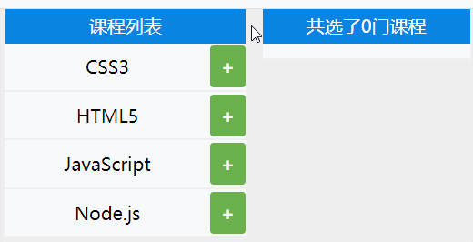

## Map

Map是一组`键值对`的结构，用于解决以往不能用对象做为键的问题

- 具有极快的查找速度
- Map的key可以为`任意类型`

### 声明定义

`接受一个数组作`为参数，该数组的`成员是一个表示键值对的数组`。

```text
let map = new Map([
	["name", "ashun"],
	["age", 18],
]);
console.log(map); 	//Map(2) {"name" => "ashun", "age" => 18}
```

使用构造函数`new Map`创建的原理如下

```text
const as = new Map();
const arr = [["ashun", "阿顺"], ["type", "Controller"]];

arr.forEach(([key, value]) => {
  as.set(key, value);
});
console.log(as);
```

对于键是对象的`Map`， 键保存的是内存地址，值相同但内存地址不同的视为两个键。

```text
let arr = ["阿顺"];
const as = new Map();
as.set(arr, "Ashuntefannao.com");
console.log(as.get(arr)); //"Ashuntefannao.com
console.log(as.get(["阿顺"])); //undefined
```


### 管理Map

#### set

使用`set(key,value)` 方法添加元素，支持链式操作

```
let map = new Map();
let obj = {
  name: "Ashun"
};

map.set(obj, "Ashuntefannao.com").set("name", "ashun");

console.log(map.entries()); //MapIterator {{…} => "Ashuntefannao.com", "name" => "ashun"}
```


#### delete

使用`delete(key)`删除对应键和值。返回Boolean。

```
let map = new Map([
        ["name", "ashun"],
        ["age", 18],
]);
map.delete("age");
console.log(map);	//Map(1) {"name" => "ashun"}
```


#### clear

使用`clear()`清空Map。

```
let map = new Map([
        ["name", "ashun"],
        ["age", 18],
]);
map.clear();
console.log(map); 	//Map(0) {}
```


####  遍历数据

由于Map数据类型是可迭代的，所以可以通过`for/of、forEach`或迭代器进行遍历。


使用 `keys()/values()/entries()` 都可以返回可遍历的迭代对象。

```text
 let map = new Map([
        ["Ashun", "阿顺"],
        ["tefannao", "特烦恼"],
]);
console.log(map.keys()); //MapIterator {"Ashun", "tefannao"}
console.log(map.values()); //MapIterator {"阿顺", "特烦恼"}
console.log(map.entries()); //MapIterator {"Ashun" => "阿顺", "tefannao" => "特烦恼"}
```

可以使用`keys/values` 函数遍历键与值

```text
let as = new Map([["Ashun", "阿顺"], ["tefannao", "特烦恼"]]);
for (const key of as.keys()) {
  console.log(key);
}
for (const value of as.values()) {
  console.log(value);
}
```

使用`for/of`遍历操作，直接遍历Map 等同于使用`entries()` 函数

```text
let as = new Map([
        ["Ashun", "阿顺"],
        ["tefannao", "特烦恼"],
]);
for (const [key, value] of as) {
		console.log(`${key}=>${value}`);
}
for (const [key, value] of as.entries()) {
		console.log(`${key}=>${value}`);
}
```

使用`forEach`遍历操作

```text
let as = new Map([["title", "Ashuntefannao"], ["name", "Ashun"]]);
as.forEach((value, key) => {
  console.log(`${key}=>${value}`);
});
```


#### has

使用`has(key)`查找是否有该元素。返回Boolean

```
let map = new Map([
        ["name", "ashun"],
        ["age", 18],
]);
console.log(map.has("as"));	//false
```


#### get

使用`get(key)`读取对应的`Value`。

```
let obj = { name: "Ashun" };
let map = new Map();
map.set(obj, "SHUN");

console.log(map.get(obj));	//"SHUN"
console.log(map.get({ name: "Ashun" }));//undefined
```


#### size

使用`size`属性，查看Map的长度。

```
let map = new Map([
        ["name", "ashun"],
        ["age", 18],
]);
console.log(map.size); //2
```


### 节点集合

map的key可以为任意类型，下面使用DOM节点做为键来记录DOM的desc属性。

```text
<body>
	<div desc="阿顺特烦恼">Ashuntefannao</div>
	<div desc="阿顺">ashun</div>
</body>

<script>
  const divs = document.querySelectorAll("div");
	let map = new Map();

		divs.forEach((elem) => {
			map.set(elem, { desc: elem.getAttribute("desc") });
		});
		map.forEach((val, elem) => {
			elem.addEventListener("click", (_) => {
				alert(val.desc);
			});
		});
</script>
```


### 实例操作

当不接受协议、不符合条件时无法提交表单，并根据自定义信息提示用户。

* 以下代码巧妙之处在于：灵活的转化了数据类型，利用数组的`every`方法返回的Boolean，判断是否满足所有条件，如果有一个不满足，返回false，表单数据也就不会提交。

```text
<body>
		<form action="#" onsubmit="return commmit()">
      <label><input type="checkbox" message="请接受协议" />接受</label>
      <label><input type="checkbox" message="本网站只对学生开放" />学生</label>
      <button>commit</button>
    </form>
</body>

<script>
 function commmit() {
        let map = new Map();
        let checkboxs = document.querySelectorAll("[type='checkbox']");
        checkboxs.forEach((v) => {
          map.set(v, {message:v.getAttribute("message"),isSelect:v.checked});
        });

       return [...map].every((item,index)=>{
         let [elem,obj]=item;
         obj.isSelect||alert(obj.message);
         return obj.isSelect
       });
   }
</script>
```


---

### WeakMap

**WeakMap** 对象是一组键/值对的集

- 键名必须是对象
- WeaMap对`键名`是`弱引用`的，`键值`是`正常引用`

- 垃圾回收不考虑WeaMap的`键名`，不会改变引用计数器，键在其他地方不被引用时即删除
- **不可迭代**，因为WeakMap 是弱引用，由于其他地方操作成员可能会不存在，所以不可以进行`forEach( )`遍历等操作
- 也是因为弱引用，WeaMap 结构没有keys( )，values( )，entries( )等方法和 size 属性
- 当键的外部引用删除时，希望自动删除数据时使用 `WeakMap`


#### 声明定义

以下操作由于键不是对象类型将产生错误

```text
new WeakMap([["ashun", "tefannao"]]); // TypeError: Invalid value used as weak map key
```

将DOM节点保存到`WeakMap`

```text
<body>
  <div>ashuntefannao.com</div>
  <div>Ashun</div>
</body>
<script>
  const Wmap = new WeakMap();
  document.querySelectorAll("div").forEach(item => Wmap.set(item, item.innerHTML));
  console.log(as); //WeakMap {div => "ashuntefannao.com", div => "Ashun"}
</script>
```


#### 基本操作

下面是WeakMap的常用指令

```text
const Wmap = new WeakMap();
const arr = ["ashun"];
//添加操作
Wmap.set(arr, "Ashuntefannao");
console.log(Wmap.has(arr)); //true

//删除操作
Wmap.delete(arr);

//检索判断
console.log(Wmap.has(arr)); //false
```


#### 垃圾回收

WakeMap的键名对象不会增加引用计数器，如果一个对象不被引用了会自动删除。

- 下例当`as`删除时内存即清除，因为WeakMap是弱引用不会产生引用计数
- 当垃圾回收时因为对象被删除，这时WakeMap也就`没有记录了`

```text
let map = new WeakMap();
let as = {};
map.set(as, "Ashun");
as = null;
console.log(map);		//WeakMap {{…} => "Ashun"}

setTimeout(() => {
  console.log(map);	//WeakMap {}
}, 3000);
```


---

#### 选课案例



```
<style>
      * {
        margin: 0;
        padding: 0;
        box-sizing: border-box;
      }
      body {
        width: 100vw;
        height: 100vh;
        position: relative;
      }
      main {
        margin: 0 auto;
        width: 80%;
        height: 100%;
        display: flex;
        justify-content: space-around;
        align-items: center;
        background-color: #eee;
      }
      .left,
      .right {
        display: flex;
        flex-direction: column;
      }
      .left {
        width: 50%;
      }
      .right {
        width: 43%;
      }
      .l_top,
      .r_top {
        width: 100%;
        height: 30px;
        background-color: #0984e3;
        color: white;
        line-height: 30px;
        text-align: center;
      }
      ul,
      .listBox {
        width: 100%;
        flex: 1;
        display: flex;
        background-color: white;
      }
      .listBox {
        flex-wrap: wrap;
        padding: 5px;
        padding-bottom: 8px;
      }
      ul {
        flex-direction: column;
        list-style: none;
      }
      ul > li {
        flex: 1;
        display: grid;
        grid-template-columns: 85% 15%;
        text-align: center;
      }
      ul > li:nth-of-type(n + 2) {
        border-top: 2px solid #eee;
      }
      .txt {
        padding: 10px 0px;
      }
      .btn {
        display: flex;
        justify-content: center;
        align-items: center;
        border-radius: 3px;
        margin: 2px 0px;
        transition: 0.8s;
      }
      .delete {
        background-color: #eb4d4b;
      }
      .add {
        background-color: #6ab04c;
      }
      .delete::before {
        content: "-";
        font-weight: bold;
        color: #fff;
      }
      .add::before {
        content: "+";
        font-weight: bold;
        color: #fff;
      }
      .list_item {
        display: inline-block;
        padding: 3px 10px;
        border-radius: 3px;
        background-color: #00cec9;
        margin: 8px 5px 0px 3px;
        color: white;
      }
</style>

<body>
	<main>
      <div class="left">
        <div class="l_top">课程列表</div>
        <ul class="course">
          <li class="course_item">
            <span class="txt">CSS3</span><span class="btn add"></span>
          </li>
          <li class="course_item">
            <span class="txt">HTML5</span><span class="btn add"></span>
          </li>
          <li class="course_item">
            <span class="txt">JavaScript</span><span class="btn add"></span>
          </li>
          <li class="course_item">
            <span class="txt">Node.js</span><span class="btn add"></span>
          </li>
        </ul>
      </div>
      <div class="right">
        <div class="r_top">共选了<span class="count">0</span>门课程</div>
        <article class="listBox"></article>
      </div>
	</main>
</body>

<script>
      class Lesson {
        constructor() {
          this.course = document.querySelectorAll(".course_item");
          this.countDom = document.querySelector(".count");
          this.listBox = document.querySelector(".listBox");
          this.Wmap = new WeakMap();
          this.run();
        }
        run() {
          this.course.forEach((li, index) => {
            let btn = li.querySelector(".btn");

            btn.addEventListener("click", (e) => {
              let isSelect = btn.classList.contains("add");
              if (isSelect) {
                btn.classList.remove("add");
                btn.classList.add("delete");
                this.Wmap.set(li, true);
              } else {
                btn.classList.remove("delete");
                btn.classList.add("add");
                this.Wmap.delete(li);
              }
              this.UpDate();
            });
          });
        }
        UpDate() {
          this.listBox.innerHTML = "";
          let selectArr = [...this.course].filter((v) => this.Wmap.has(v));
          selectArr.forEach((li) => {
            let span = document.createElement("span");
            span.classList.add("list_item");
            span.innerText = li.querySelector(".txt").innerText;
            this.listBox.append(span);
          });
          this.newCount(selectArr.length);
        }
        newCount(newNum) {
          this.countDom.innerText = newNum;
        }
      }
      new Lesson();
</script>
```

