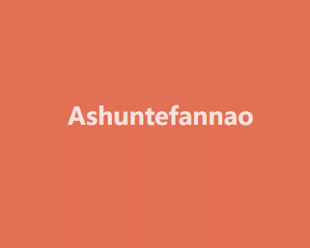

## 函数进阶

​	函数是将复用的代码块封装起来的模块，在JS中函数还有其他语言所不具有的特性，接下来我们会详细掌握使用技巧。


### 声明定义

在JS中函数也是对象函数是`Function`类创建的实例，下面的例子可以方便理解函数是对象。

* `new Function(...argus,funcContent)`

```text
let fun = new Function("title", "type", "console.log(title,type)");
fun("Ashun", "Controller");
```

标准语法是：使用函数声明来定义函数

* `function funcName(argus){…funcContent}`

```text
function as(num) {
	return num+=2;
}
console.log(as(3));
```

对象字面量属性函数简写

```text
let user = {
  name: null,
  getName: function (name) {
  	return this.name;
  },
  //简写形式
  setName(value) {
  	this.name = value;
  }
}
user.setName('阿顺');
console.log(user.getName()); // 阿顺
```

普通形式定义的全局函数会声明在window对象中，这很危险，建议使用后面章节的模块处理

```text
function Ashun() {
	console.log("普通形式定义的全局函数，会追加到window中");
	console.log(window.Ashun);
}
Ashun();
```

再比如：当我们定义了 `screenX` 函数后就覆盖了window.screenX方法

```
console.log(window.screenX); 	//999
```

```text
function screenX() {
  return "阿顺";
}
console.log(window.screenX); 
```

使用`let/const`时不会压入window

* 注意：使用变量接收定义的函数时，整体为表达式，必须以`;`结尾，不然会报错。

```text
let func = function as() {
	return "Ashuntefannao.com";
};
console.log(window.func); //undefined
```


### 匿名函数

​	函数是对象，所以可以通过赋值，指向到函数对象的指针，当然指针也可以传递给其他变量，注意结尾要以`;`结束(整体为表达式)。下面使用函数表达式将 `匿名函数` 赋值给变量

```text
let as = function(num) {
  return num+=2;
};

console.log(as instanceof Object); //true

let tfn = as;
console.log(tfn(3));
```

标准声明的函数优先级更高，解析器会优先提取函数并放在代码树顶端，所以标准声明函数位置不限制，所以下面的代码可以正常执行。

```text
console.log(as(3));
function as(num) {
	return ++num;
};
```

标准声明优先级高于赋值声明

```text
console.log(as(3)); //4

function as(num) {
  return ++num;
}

var as = function() {
  return "as";
};
```

程序中使用匿名函数的情况非常普遍

```text
function sum(...args) {
  return args.reduce((a, b) => a + b);
}
console.log(sum(1, 2, 3));
```


### 函数提升

函数也会提升到前面，但优先级高于`var`变量

```text
var c = 1;
function c(c) {
    console.log(c);
    var c = 2;
}
c(3);	//TypeError: c is not a function
```

变量定义函数的形式，函数不会被提升

```text
console.log(as("Ashun"));	//Ashun 

function as(title) {
	return title;
}

var as = function () {
	return "ashun";
};
```

**小测试**

```
var c = 1;
function d() {
    console.log(c);
    var c = 2;
}
d();
```

```
var c = 1;
function d(c) {
    console.log(c);
    var c = 2;
}
d(3);
```

* 其实第(1)个结果很快就答出来了:`undefined`

原因: `var`定义变量(除函数)，会提升到当前作用域的最前面，因此打印undefined。

* 但是第(2)个结果一开始我认为是undefined，但其实是`3`

原因: 虽然也会变量提升，但是`若接收的参数与函数内部定义的变量名重复，并且该变量没有赋值，则该变量还为接收的参数`.

```
var c = 1;
function d(c) {
		var c;
  console.log(c);
}
d(3);	//3
```

```
var c = 1;
function d(c) {
  console.log(c);
  var c = 2;
  console.log(c);
}
d(3);	//3 2
```


### 形参实参

形参是在函数声明时设置的参数，实参指在调用函数时传递的值。

- 形参数量大于实参时，没有传参的形参值为 undefined
- 实参数量大于形参时，多于的实参将忽略并不会报错

```text
// n1,n2 为形参
function sum(n1, n2) {
	return n1+n2;
}
// 参数 2,3 为实参
console.log(sum(2, 3)); //5
```

当没传递参数时值为undefined

```text
function sum(n1, n2) {
  return n1 + n2;
}
console.log(sum(2)); //NaN
```


---

### 默认参数

下面通过计算年平均销售额来体验以往默认参数的处理方式

```text
//total:总价 year:年数
function avg(total, year) {
  year = year || 1;
  return Math.round(total / year);
}
console.log(avg(2000, 3));
```

使用`ES6`默认参数方式如下

```text
function avg(total, year = 1) {
  return Math.round(total / year);
}
console.log(avg(2000, 3));
```

下面通过排序来体验新版默认参数的处理方式，下例中当不传递 type 参数时使用默认值 asc。

```text
function sortArray(arr, type = 'asc') {
	return arr.sort((a, b) => type == 'asc' ? a - b : b - a);
}
console.log(sortArray([1, 3, 2, 6], 'desc'));
```

默认参数要放在最后面

​	默认参数就是为了在使用者默认配置时不用传参，若默认参数放在前面，而非默认参数放在后面，则当使用者默认配置时，为了传递非默认参数，就需要把前面的默认参数都传递进去。

```text
//total:价格,discount:折扣,dis:折后折
function sum(total, discount = 0, dis = 0) {
  return total * (1 - discount) * (1 - dis);
}
console.log(sum(2000, undefined, 0.3));
```

### 立即执行

立即执行函数指函数定义时立即执行

- 可以用来定义私有作用域防止污染全局作用域

```text
"use strict";
(function () {
    var web = 'astfn.github.io';
})();
console.log(web); //web is not defined
```

使用 `let/const` 有块作用域特性，所以使用以下方式也可以产生私有作用域

```text
{
	let web = 'astfn.github.io';
}
console.log(web);
```


---

### Callback

函数可以做为参数传递，这也是大多数语言都支持的语法规则。

```text
<body>
    <button>订阅</button>
</body>
<script>
    document.querySelector('button').addEventListener('click', function () {
        alert('感谢订阅');
    })
</script>
```

函数可以做为参数传递

```text
function filterFun(item) {
	return item <= 3;
}
let arr = [1, 2, 3, 4, 5].filter(filterFun);
console.log(arr); //[1,2,3]
```


---

### arguments

arguments 是在函数内部获得所有参数集合的一个方式 ，下面是使用 `arguments` 求和的例子

* arguments是一种类数组的对象，属性名称依次为0~n，且包含callee和length属性，但其不是Array，所以不能够直接使用数组的方法，若要使用Array的方法，我们需要将其转化为数组，或借用数组原型的方法。

```text
function sum() {
  return [...arguments].reduce((total, num) => total += num , 0);
}
```

```
function sum() {
  return Array.from(arguments).reduce((total, num) => (total += num), 0);
}
```

```
function sum() {
  return Array.prototype.reduce.call(
    arguments,
    (pre, v) => (pre += v),
    0
  );
}
console.log(sum(1, 2, 3));	//6
```

更建议使用展示语法接收多个参数

```text
function sum(...args) {
 return args.reduce((a, b) => a + b);
}
console.log(sum(2, 3, 4, 2, 6)); //17
```


---

### 箭头函数

箭头函数是函数声明的简写形式，在使用递归调用、构造函数、事件处理器时不建议使用箭头函数。

无参数时使用空扩号即可

```text
let sum = () => {
	return 1 + 3;
}
console.log(sum()); //4
```

函数体为单一表达式时不需要 `return` 返回处理，系统会自动返回表达式计算结果。

```text
let sum = () => 1 + 3;
console.log(sum()); //4
```

多参数传递与普通声明函数一样使用逗号分隔

```text
let arr = [1, 8, 3, 5].filter((item, index) => {
	return item <= 3;
});
console.log(arr);
```

只有一个参数时可以省略括号

```text
let arr = [1, 8, 3, 5].filter(item => item <= 3);
console.log(arr);
```

> 有关箭头函数的作用域知识会在后面章节讨论


### 标签函数

之前在String的`标签模板`中已经介绍过了，使用`标签函数`，能够处理string中的`普通字符串、变量`。

使用函数来解析标签字符串，第一个参数是字符串值的数组，其余的参数为标签变量。

```text
function Ashun(str, ...argus) {
  console.log(str); //["", "-", "", raw: Array(3)]
  console.log(argus); //["ashun", "ashuntefannao.com"]
}
let name = 'ashun',url = 'ashuntefannao.com';
Ashun `${name}-${url}`;
```


---

### this指向

调用函数时 `this` 会隐式传递给函数指函数调用时的关联对象，也称之为函数的上下文。

* 独立存在的函数,this指向window
* 函数作为对象的方法，this指向该对象
* 箭头函数本身没有this指向，会使用父级作用域的this指向。


#### 函数调用

全局环境下`this`就是window对象的引用

```text
<script>
  console.log(this == window); //true
</script>
```

使用严格模式时在全局函数内`this`为`undefined`

```text
var as = "阿顺";
function get() {
	"use strict";
	console.log(this);	//undefined
	return this.as; 	
}
console.log(get());
//严格模式将产生错误  TypeError: Cannot read property 'as' of undefined
```


---

#### 对象方法

函数为对象的方法时`this` 指向该对象

可以使用多种方式创建对象，下面是使用构造函数创建对象

**构造函数**

函数当被 `new` 时即为构造函数，一般构造函数中包含属性与方法。函数中的上下文`指向到实例对象`。

- 构造函数主要用来生成对象，里面的this默认就是指当前对象

```text
function User() {
  this.name = "阿顺";
  this.say = function() {
    console.log(this); 			//User {name: "阿顺", say: ƒ}
    return this.name;
  };
}
let as = new User();
console.log(as.say()); 			//阿顺
```

**对象字面量**

- 下例中的as函数不属于对象方法所以指向`window`
- show属于对象方法执向 `obj`对象

```text
let obj = {
	site: "阿顺",
	show() {
		console.log(this.site); //阿顺
		console.log(`show method in :${this} 中`); //show method in :[object Object] 中
		function as() {
			console.log(`as function in : ${this} 中`); //as function in : [object Window] 中
		}
		as();
	},
};
obj.show();
```

在方法中使用函数时，有些函数可以改变this如`forEach、map…`第二个参数为执行上下文，当然也可以使用后面介绍的`apply/call/bind`，或者直接使用箭头函数。

```text
let Lesson = {
  site: "阿顺",
  lists: ["js", "css", "mysql"],
  show() {
    return this.lists.map(function(title) {
      return `${this.site}-${title}`;
    }, this);
  }
};
console.log(Lesson.show());
```

也可以在父作用域中定义引用`this`的变量

```text
let Lesson = {
    site: "阿顺",
    lists: ["js", "css", "mysql"],
    show() {
      const self = this;
      return this.lists.map(function(title) {
        return `${self.site}-${title}`;
      });
    }
  };
console.log(Lesson.show());
```


#### 箭头函数

箭头函数没有`this`, 也可以理解为箭头函数中的`this` 会继承定义函数时的上下文，可以理解为和外层函数指向同一个this。

- 如果想使用函数定义时的上下文中的this，那就使用箭头函数

下例中的匿名函数的执行环境为全局所以 `this` 指向 `window`。

```text
var name = 'ASHUN';
var obj = {
  name: 'ashun',
  getName: function () {
    return function () {
    	return this.name;
    }
  }
}
console.log(obj.getName()()); //返回window.name的值ASHUN
```

以往解决办法：会在父级函数(对象方法)中定义变量，保留this，然后在独立存在的函数中使用。

```text
var name = 'ASHUN';
var obj = {
  name: '阿顺',
  getName: function () {
    var self = this;
		return function () {
    	return self.name;
    }
  }
}
console.log(obj.getName()()); //阿顺
```

使用箭头函数后 `this` 为定义该函数的上下文，也可以理解为定义时父作用域中的`this`

```text
var name = 'ASHUN';
var obj = {
  name: '阿顺',
  getName: function () {
    return () => {
    	return this.name;
    }
  }
}
console.log(obj.getName()()); //阿顺
```

事件中使用箭头函数结果不是我们想要的

- 事件函数可理解为对象`onclick`设置值，所以函数声明时`this`为当前对象
- 但使用箭头函数时`this`为声明函数上下文

下面体验使用普通事件函数时`this`指向元素对象

使用普通函数时`this`为当前DOM对象

```text
<body>
  <button desc="ashun">button</button>
</body>
<script>
  let Dom = {
    site: "阿顺",
    bind() {
      const button = document.querySelector("button");
      button.addEventListener("click", function() {
        alert(this.getAttribute("desc"));
      });
    }
  };
  Dom.bind();
</script>
```

下面是使用箭头函数时this指向上下文对象，若想获取当前的DOM，可以通过`e.target|e.srcElement`

```text
<body>
  <button desc="ashun">button</button>
</body>
<script>
  let Dom = {
    site: "阿顺",
    bind() {
      const button = document.querySelector("button");
      button.addEventListener("click", event => {
        alert(this.site + event.target.innerHTML);
      });
    }
  };
  Dom.bind();
</script>
```

#### apply/call/bind

​	能够改变this指向，并传入参数，也可以理解为对象借用方法，就现像生活中向邻居借东西一样的事情。

##### 原理分析

构造函数中的`this`默认是一个空对象，然后构造函数处理后把这个空对象变得有值。再隐式的设置这个对象的原型。

```text
function User(name) {
  this.name = name;
}
let as = new User("阿顺");
```

可以改变构造函数中的空对象，即让构造函数this指向到另一个对象。传入参数初始化属性，再设置该对象的原型。就可以模仿`new 构造函数()`的过程。

```text
function User(name) {
	this.name = name;
}
let obj = {};
User.call(obj, "阿顺");
Object.setPrototypeOf(obj,User.prototype)
console.log(obj);
```


---

##### apply/call

call与apply 用于显示的设置函数的上下文，两个方法作用一样都是将对象绑定到this，只是在传递参数上有所不同。

- apply 用`数组`传参
- call 需要`分别`传参
- 与 bind 不同call/apply 会`立即执行`函数

语法使用介绍

```text
function show(title) {
    alert(`${title+this.name}`);
}
let zs = {
    name: '张三'
};
let lisi = {
    name: '李四'
};
show.call(zs, 'Ashun');
show.apply(lisi, ['SHUN']);
```

使用 `call` 设置函数上下文

```text
<body>
    <button message="阿顺">button</button>
    <button message="特烦恼">button</button>
</body>
<script>
    function show() {
        alert(this.getAttribute('message'));
    }
    let bts = document.getElementsByTagName('button');
    for (let i = 0; i < bts.length; i++) {
        bts[i].addEventListener('click', () => show.call(bts[i]));
    }
</script>
```

找数组中的数值最大值

```text
let arr = [1, 3, 2, 8];
console.log(Math.max(arr)); //NaN
console.log(Math.max.apply(Math, arr)); //8
console.log(Math.max.call(Math,...arr)); //8
console.log(Math.max(...arr)); //8
```

实现构造函数属性继承

* 下例相当于Article、Lesson，都继承了Request的get方法

```text
"use strict";

      function Request() {
        this.get = function (preset = {}) {
          let paramsTxt = Object.keys(preset)
            .map((key) => `${key}=${preset[key]}`)
            .join("&");

          return `${this.url}?${paramsTxt}`;
        };
      }
      
      //控制文章请求
      function Article() {
        this.url = "ashun/article/index.html";
        Request.call(this);
      }
      
      //控制课程请求
      function Lesson() {
        this.url = "ashun/course/index.html";
        Request.apply(this, []);
      }

      let articleReq = new Article();
      let lessonReq = new Lesson();
      console.log(articleReq.get({ name: "Ashun", type: "Controller" }));
      console.log(lessonReq.get({ row: 20, start: 999 }));
```

制作显示隐藏面板


```
<style>
      * {
        margin: 0;
        padding: 0;
        box-sizing: border-box;
      }
      main {
        width: 100%;
        margin: 10px auto;
      }
      dl {
        width: 90%;
        margin: 0 auto;
        text-align: center;
      }
      dt,
      dd {
        width: 100%;
        display: flex;
        justify-content: center;
        align-items: center;
      }
      dt {
        height: 35px;
        background-color: #00b894;
        color: white;
        font-weight: bold;
        letter-spacing: 2px;
        border-radius: 3px;
        cursor: pointer;
      }
      dd {
        background-color: #636e72;
        color: #dfe6e9;
        font-size: 20px;
        border-radius: 0px 0px 5px 5px;
        transition: 0.3s;
        height: 0px;
        overflow: hidden;
      }
      .show {
        height: 180px;
      }
</style>
<body>
	<main>
      <dl>
        <dt>阿顺特烦恼</dt>
        <dd>Ashuntefannao</dd>
        <dt>希望大家</dt>
        <dd>Ashuntefannao</dd>
        <dt>没有烦恼</dt>
        <dd>Ashuntefannao</dd>
      </dl>
 	</main>
</body>
<script>
      function show(index) {
        let items = document.querySelectorAll("dd");
        items.forEach((v) => v.classList.remove("show"));
        items[index].classList.add("show");
      }
      let titles = document.querySelectorAll("dt");
      titles.forEach((ele, i) => {
        ele.addEventListener("click", () => {
          show.call(null, i);
        });
      });
</script>

```


---

##### bind

`bind(this,...args)`在使用形式上与call相同。bind是`复制函数行为`。

与call、apply的不同之处：

- bind绑定后，函数不会立即执行，需要被调用。

- 原理不同:

  - call、apply是在函数调用时改变this指向。
  - 使用 bind 绑定函数时，会生成一个新函数，新函数的函数体与被绑定函数一样，bind 是在`复制得到新函数时改变的this指向`。

  

bind是复制函数行为

```text
{
	let a = function () {};
	let c = a.bind();
	console.log(c);					//ƒ () {}
}
{
	let a = function () {};
	let c = a.call();
	console.log(c);					//undefined
}
{
	let a = function () {};
	let c = a.apply();
	console.log(c);					//undefined
}
```

绑定参数注意事项

```text
function sum(a, b) {
  return this.f + a + b;
}

//使用bind会生成新函数
let newFunc = sum.bind({ f: 1 }, 3);

//1+3+2 将2赋值给参数b即 a=3,b=2
console.log(newFunc(2));
```

在事件中使用`bind`

```text
<body>
  <button>阿顺</button>
</body>
<script>
  document.querySelector("button").addEventListener(
    "click",
    function(event) {
      console.log(event.target.innerHTML + this.url);
    }.bind({ url: "Ashuntefannao.com" })
  );
</script>
```

动态改变元素背景颜色，当然下面的例子也可以使用箭头函数处理



```
<style>
      * {
        margin: 0;
        padding: 0;
        box-sizing: border-box;
      }
      body {
        width: 100vw;
        height: 100vh;
        background-color: #e17055;
        color: rgba(255, 255, 255, 0.8);
        display: flex;
        justify-content: center;
        align-items: center;
        transition: 0.8s;
      }
</style>
<body>
    <h2>Ashuntefannao</h2>
</body>
<script>
      class Color {
        constructor(dom) {
          this.dom = dom;
          this.colors = [ "#fdcb6e","#55efc4","#00b894","#6c5ce7","#74b9ff","#e17055"];
          this.run();
        }
        run() {
          setInterval(
            function () {
              let random = Math.floor(Math.random() * this.colors.length);
              this.dom.style.backgroundColor = this.colors[random];
            }.bind(this),
            800
          );
        }
      }
      new Color(document.body);
</script>
```

