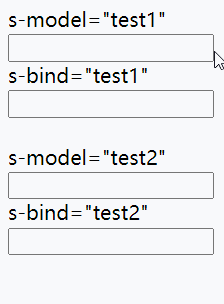

## 对象

### 基础知识

对象是包括属性与方法的数据类型，JS中大部分类型都是对象如 `String/Number/Math/RegExp/Date` 等等。

传统的函数编程会有错中复杂的依赖很容易创造意大利式面条代码。

**面向过程编程**

```text
let name = "阿顺";
let grade = [
  { lesson: "js", score: 99 },
  { lesson: "vue", score: 85 }
];
function average(grade, name) {
  const total = grade.reduce((t, a) => t + a.score, 0);
  return name + ":" + total / grade.length + "分";
}
console.log(average(grade, name));
```

**面向对象编程**

下面使用对象编程的代码结构清晰，也减少了函数的参数传递，也不用担心函数名的覆盖

```text
let user = {
  name: "阿顺",
  grade: [
    { lesson: "js", score: 99 },
    { lesson: "vue", score: 85 }
  ],
  average() {
    const total = this.grade.reduce((t, a) => t + a.score, 0);
    return this.name + ":" + total / this.grade.length + "分";
  }
};
console.log(user.average());
```


#### OOP

OOP：**Object Oriented Programming **

特点：封装、继承、抽象、多态

- 对象是属性和方法的集合即封装
- 将复杂功能隐藏在内部，只开放给外部少量方法，更改对象内部的复杂逻辑不会对外部调用造成影响即抽象
- 继承是通过代码复用减少冗余代码
- 根据不同形态的对象产生不同结果即多态


#### 基本声明

使用字面量形式声明对象是最简单的方式

```text
let obj = {
  name: '阿顺',
  getName:function() {
  	return this.name;
  }
}
console.log(obj.getName()); //阿顺
```

`ES6`属性与方法简写

```text
let name = "阿顺";
let obj = {
  name,
  get() {
    return this.name;
  }
};
console.log(obj.get()); //阿顺
```

其实字面量形式在系统内部也是使用构造函数 `new Object`创建的，后面会详细介绍构造函数。

```text
let as = {};
let Ashun = new Object();
console.log(as, Ashun);
console.log(as.constructor);
console.log(Ashun.constructor);
```


#### 属性方法

Object中包含属性和方法，属性用来标记Object的特点或状态，方法用来操作属性或完成其它功能。

定义在对象中的函数我们称为方法，下面定义了学生对象，并提供了计算平均成绩的方法。

```text
let ashun = {
  name: "阿顺",
  age: 21,
  grade: {
    math: 88,
    english: 67
  },
  //平均成绩
  avgGrade: function() {
    let total = 0;
    for (const key in this.grade) {
      total += this.grade[key];
    }
    return total / this.propertyCount("grade");
  },
  //获取属性数量
  propertyCount: function(property) {
		return Object.keys(this[property]).reduce((pre, val) => (pre += 1),0);
  }
};
console.log(ashun.avgGrade());
```

> 一个学生需要手动创建一个对象，设置对应的属性和方法，这显然是不实际的，后面章节构造函数就可以解决这个问题


---

#### 引用特性

对象和函数、数组一样是引用类型，即复制只会复制引用地址。

```text
let as = { name: "阿顺" };
let user = as;
user.name = "Ashun";
console.log(as.name); //Ashun
```

对象做为函数参数使用时也不会产生完全赋值，传递的依旧是内存地址，内外共用一个对象

```text
let user = { age: 15 };
function as(user) {
  user.age += 3;
}
as(user);
console.log(user.age); //18
```

`引用类型变量`之间的比较是对`内存地址`的比较所以使用 `==` 或 `===` 结果一样。

```text
let as = {};
let js = as;
let tfn = {};

console.log(as == js); //true
console.log(as === js); //true

console.log(as == tfn); //false
console.log(as === tfn); //false
```

###### Object.is(arg1,arg2)

该方法用于判断二者是否恒等，其中注意的是，`Object.is`方法在`===`的基础上，做了一些特殊情况的优化。具体来说就是+0和-0，NaN和NaN。

`0===-0`

```
console.log(-0 === 0); //true
console.log(Object.is(0, -0));//false
```

`NaN===NaN`

```
console.log(NaN == NaN); //false
console.log(NaN === NaN); //false
console.log(Object.is(NaN, NaN));//true
```

我们也可使用全局静态方法`isNaN`进行判断

```
let a= 1 / "s"
console.log(isNaN(a)); //true
```


---

#### this

`this` 指当前对象的引用，始终建议在代码内部使用`this` 而不要使用对象名，不同对象的this只指向当前对象。

下例是不使用 `this` 时发生错误的场景

- 删除了`as` 变量，但在函数体内还在使用`as`变量造成错误
- 使用 `this` 后，始终指向到当前引用地址，就不会有这个问题

```text
let as = {
	name: "阿顺",
	show() {
		return as.name;
	},
};
let user = as;
as = null;
console.log(user.show()); //TypeError: Cannot read property 'name' of null
```

改用`this` 后一切正常

```text
let as = {
	name: "阿顺",
	show() {
		return this.name;
	},
};
let user = as;
as = null;
console.log(user.show());	//阿顺
```


#### 展开语法

使用`...`可以将对象的各个属性展开。

```
function upload(params) {
  let config = {
    type: "*.jpeg,*.png",
    size: 10000
  };
  params = { ...config, ...params };	//传参覆盖默认值
  console.log(params);
}
upload({ size: 999 });
```

`...`用作收集时，还是用数组形式`[]`包裹

```
let as = { name: "ashun" };
function test(...obj) {
		console.log(obj);
}
test(as);	//[{…}]
```


---

### 对象转换

##### 基础知识

对象直接参与计算时，系统会根据计算的场景在 `string/number/default` 间转换。

- 如果声明需要字符串类型，调用顺序为 `toString > valueOf`
- 如果场景需要数值类型，调用顺序为 `valueOf > toString`
- 声明不确定时使用 `default` ，大部分对象的 `default` 会当数值使用
- 若对象中同时定义了`Symbol.toPrimitive`方法，则会优先执行其中对数据类型转化的处理

下面的数值对象会在数学运算时转换为 `number`

```text
let ashun = new Number(1);
console.log(ashun + 5); //6
```

如果参数字符串运长时会转换为 `string`

```text
let ashun = new Number(1);
console.log(ashun + "5"); //15
```

下面当不确定转换声明时使用 `default` ，大部分`default`转换使用 `number` 转换。

```text
let ashun = new Number(1);
console.log(ashun == "1"); //true
```


##### Symbol.toPrimitive

内部自定义`Symbol.toPrimitive`方法用来处理所有的转换场景

`Symbol.toPrimitive` 是一个内置的 Symbol 值，它是作为对象的函数值属性存在的，当一个对象转换为对应的原始值时，会调用此函数。

```
let as = {
	num: 1,
	str: "ashun",
	[Symbol.toPrimitive]: function (hint) {
		if (hint == "number") return this.num;
		if (hint == "string") return this.str;
	},
};

console.log(+as); //1
console.log(String(as)); //ashun
```

```text
let as = {
  num: 1,
  [Symbol.toPrimitive]: function() {
    return this.num;
  }
};
console.log(as+ 1); //2
console.log(as+"1")	//11
```


##### valueOf/toString

可以自定义`valueOf` 与 `toString` 方法用来转换，转换并不限制返回类型。

下例能验证:

- 如果声明需要字符串类型，调用顺序为 `toString > valueOf`
- 如果场景需要数值类型，调用顺序为 `valueOf > toString`

```text
let as = {
  name: "Ashun",
  num: 1,
  valueOf: function() {
    console.log("valueOf");
    return this.num;
  },
  toString: function() {
    console.log("toString");
    return this.name;
  }
};
console.log(as + 5); //valueOf 4
console.log(`${as}阿顺`); //toString Ashun阿顺
```

若对象中在定义`toString/valueOf`方法的同时，又定义了`Symbol.toPrimitive`方法，则会优先执行其中对数据类型转化的处理

```
let obj = {
  value: 123,
  name: "Ashun",
  toString() {
    return this.name;
  },
  valueOf() {
    return this.value;
  },
  [Symbol.toPrimitive]: function (hint) {
    if (hint == "string") return "Ashuntefannao";
    if (hint == "number") return 7;
  },
};
console.log(String(obj)); //Ashuntefannao
console.log(++obj);   //8
```


##### `==`与`===`

对于==与===，我们已经不陌生了，==判定的是等式两边的值是否相同，但===是严格等于，不仅要求值相等，还要满足类型相同。

但是对于使用==判断时，对于不同的场景，也涉及到了类型的转换

* 等式两边类型相同，就比较值的大小

```
console.log(1 == 2) //false
console.log("abc" == "abc") //true
```

* 等式两边为`null`|`undefined`时，返回`true`
  * aa已定义，但是未赋值，为`null`
  * 由于`null==undefined`得`aa == undefined`

```
let aa;
console.log(aa == null);
console.log(aa == undefined);
console.log(null == undefined);
```

* 其中一方为Number，则会先转化为Number再比较

```
let obj = {
  value: 123,
  name: "Ashun",
  toString() {
    return this.name;
  },
  valueOf() {
    return this.value;
  },
};

console.log(obj == 123);
console.log(1 == true);
console.log(1 == "1");
```

* 判断其中一方是否是Boolean，是的话就把Boolean转换成Number，再进行比较

```
let obj = {
  value: 1,
  name: "Ashun",
  toString() {
    return this.name;
  },
  valueOf() {
    return this.value;
  },
};

console.log(true == obj);
```

###### 如何让if(a == 1 && a == 2)条件成立？

其实就是上一个问题的应用，利用类型转化的过程，在其中做操作

```text
let a = {
  num: 1,
  valueOf() {
    return this.num++;
  },
};
console.log(a == 1 && a == 2);
```


---

### 解构赋值

解构是一种更简洁的赋值特性，可以理解为分解一个数据的结构，在数组章节已经介绍过。

- 建设使用 `var/let/const` 声明

#### 基本使用

下面是基本使用语法

```text
{
	let info = { name: "阿顺", site: "Ashuntefannao.com" };
	let { name: n, site: u } = info;
	console.log(n, u); // 阿顺 Ashuntefannao.com
}

{
//如果属性名与变量相同可以省略属性定义`ES6简写形式`。
	let info = { name: "阿顺", site: "Ashuntefannao.com" };
	let { name } = info;
	console.log(name); // 阿顺
}
```

函数返回值直接解构到变量

```text
function user({ name, type }) {
	console.log(name, type);
}

let as = { name: "Ashun", type: "Controller" };
user(as);
```

系统函数解构练习，这没有什么意义只是加深解构印象

```text
const {random,min,max} =Math;
console.log(random,max);
```

可以直接使用变量赋值对象属性

```text
let name = "阿顺",url = "Ashuntefannao.com";
//标准写法如下
{
	let as = { name: name, url: url };
	console.log(as);  //{name: "阿顺", url: "Ashuntefannao.com"}
}

//ES6简写形式
{
	let as = { name, url };
	console.log(as); //{name: "阿顺", url: "Ashuntefannao.com"}
}

```


#### 嵌套解构

可以操作多层复杂数据结构

```text
const as = {
  name:'阿顺',
  lessons:{
    title:'JS'
  }
}
const {name,lessons:{title}}  = as;
console.log(name,title); //阿顺 JS
```


---

#### 严格模式

非严格模式可以不使用声明指令，严格模式下必须使用声明。所以建议使用 let 等声明。

```text
// "use strict";
({ name, url } = { name: "阿顺", url: "Ashuntefannao.com" });
console.log(name, url);
```

还是建议使用`let`等赋值声明

```text
"use strict";
let { name, url } = { name: "阿顺", url: "Ashuntefannao.com" };
console.log(name, url);
```


---

#### 默认值

为变量设置默认值

```text
let [Name, site = "Ashuntefannao.com"] = ["阿顺"];
console.log(site); //Ashuntefannao.com

let { name, url, type = "Controller" } = {
	name: "阿顺",
	url: "Ashuntefannao.com",
};
console.log(type); //Controller
```

使用默认值特性可以方便的对参数预设

```text
function createElement(options) {
	let {
		name = "div",
		width = "200px",
		height = "100px",
		backgroundColor = "red",
	} = options;

	const dom = document.createElement(name);
	dom.style.width = width;
	dom.style.height = height;
	dom.style.backgroundColor = backgroundColor;
	document.body.appendChild(dom);
}
createElement({
backgroundColor: "green",
});
```

也可使用`展开语法`或`Object.assign`，将默认obj与传入的options合并。（`Object.assign`后面章节会详细介绍）

```
function createElement(options) {
	let preset = {
		name: "div",
		width: "200px",
		height: "100px",
		backgroundColor: "red",
	};
	preset = Object.assign(preset, options);
	//preset = { ...preset, ...options };
	const dom = document.createElement(preset.name);
	for (const key in preset) {
		key != "name" && (dom.style[key] = preset[key]);
	}
	document.body.appendChild(dom);
}
createElement({
	backgroundColor: "#16a085",
});
```


#### 函数参数

---

数组参数的使用

```text
function as([a, b]) {
	console.log(a, b);
}
as(['阿顺', 'SHUN']);
```

对象参数使用方法

```text
function getUser({name,url,type='Controller'}) {
	console.log(name,url,type);
}
getUser({name:'阿顺',url:'Ashuntefannao.com'}); //阿顺 Ashuntefannao.com Controller
```

对象解构传参

```text
function user(name, { sex, age } = {}) {
  console.log(name, sex, age); //阿顺 男 18
}
user("阿顺", { sex: "男", age: 18 });
```


### 操作属性


##### 属性名称

`对象的属性名类型为:String`

对象的属性名最终都会转为`字符串`

```text
let obj = { 1: "ashun", "1": "Ashuntefannao" };
console.table(obj); //{1:"Ashuntefannao"}
```

使用对象做为键名时，也会将对象转为字符串后使用

```text
let obj = { 1: "ashun", "1": "Ashuntefannao" };

let as = { [obj]: "阿顺" };
console.table(as);

console.log(as[obj.toString()]);
console.log(as["[object Object]"]);
```

---

##### 添加属性

* `obj.prop`
* `obj[prop]`
  * 当属性名称：不合法时、为变量时，可通过`[prop]`进行设置。
* `Object.defineProperty(obj,prop,{desc…})`
  * 设置属性的描述，若该属性不存在，则添加该属性到obj上。

```
let user = {};

user.name = "Ashun";
user["user-type"] = "Controller";
let like = "like";
user[like] = "javascript";

Object.defineProperty(user, "age", {
	value: 18,
	writable: true,
	enumerable: true,
	configurable: true,
});
console.log(user);

//{name: "Ashun", user-type: "Controller", like: "javascript", age: 18}
```


##### 删除属性

`delete obj.prop`

```
let user = {};

user.name = "Ashun";
user["user-type"] = "Controller";
let like = "like";
user[like] = "javascript";

Object.defineProperty(user, "age", {
	value: 18,
	writable: true,
	enumerable: true,
	configurable: true,
});

for (const key of Object.keys(user)) {
		key !== "name" && delete user[key];
}
console.log(user);	//{name:"Ashun"}
```


##### 修改属性

* 在访问某属性的同时，赋值即可
  * `obj.prop=value`
  * `obj[prop]=value`
* `Object.defineProperty(obj,propName,{…desc})`


```
let type="type";
let user = {
	name: "defult",
	age: "18",
	[type]: "user",
};
user.name = "Ashun";
user[type] = "Controller";
console.log(user);	//{name: "Ashun", age: "18", type: "Controller"}
```

```
let user = {
	name: "Ashun",
	age: "18",
	type: "user",
};
Object.defineProperty(user, "type", {
	value: "Controller",
	writable: true,
	enumerable: true,
	configurable: true,
});
console.log(user.type); //Controller
```


##### 检测属性

###### hasOwnProperty

`obj.hasOwnProperty(prop)`检测对象`自身`是否包含指定的属性，`不检测原型链上继承的属性`。

```text
let obj = { name: '阿顺'};
console.log(obj.hasOwnProperty('name')); //true
```

不检测原型链上继承的属性

```text
{
	let arr = ["阿顺"];
	console.log(arr.hasOwnProperty("length")); //true
	console.log(arr.hasOwnProperty("concat")); //false
}

{
	let Admin={type:"Controler"}
	let as={name:"阿顺",age:18};
	as.__proto__=Admin;
	console.log(as.hasOwnProperty("age"))//true
	console.log(as.type);	//Controler
	console.log(as.hasOwnProperty("type"))//false
}
```


###### in

`prop in obj` 使用`in`关键字，能够判断某属性是否在obj`本身或原型链上`。

```
let as = { name: "阿顺" };
let site = {
	web: "Ashuntefannao.com",
};

//设置site为as的新原型
Object.setPrototypeOf(as, site);
// as.__proto__ = site;
console.dir(as);

console.log("name" in as); //true
console.log("web" in as); //true
console.log(as.hasOwnProperty("web")); //false
```


---

##### 获取属性名

###### 获取普通属性

以下方式只能够获取普通属性，不能够获取属性名为Symbol类型的属性。

* `for/in`
* `Object.getOwnPropertyNames(obj)`
* `Object.keys(obj)`


使用`Object的静态方法`或`Reflect`获得的属性名称，都是某**obj本身的prop**，如果使用`for/in`会遍历到`原型上`的普通属性。

```
let Admin = { type: "Controller" ,[Symbol("Admin")]: "Admin"};
let as = { name: "阿顺", age: 18, [Symbol("as")]: "ashun" };
Object.setPrototypeOf(as, Admin);

for (const key in as) console.log(key);	//name age type

console.log(Object.getOwnPropertyNames(as));		 	//["name","age"]
console.log(Object.keys(as));										 	//["name","age"]
console.log(Object.getOwnPropertySymbols(as));		//[Symbol(as)]
console.log(Reflect.ownKeys(as));									//["name", "age", Symbol(as)]
```

当我们使用ES6的`class`声明构造函数时，就不用考虑`for/in`循环遍历原型属性的问题了

* 内部默认严格模式
* class声明的方法自动添加到原型链，且自动设置各个方法的属性特征描述为`enumerable:false`

```
class Person {
          constructor(options) {
            for (let [key, val] of Object.entries(options)) {
              this[key] = val;
            }
          }
          show() {
            return this.name;
          }
 				}
let p1 = new Person({ name: "Ashun", age: 18, type: "Controller" });
console.log(Object.keys(p1)); ["name","age","type"]
for (let key in p1) {
	console.log(key);		//name,age,type	而没有show
}
```


---

###### 获取Symbol

* `getOwnPropertySymbols` 该方法`只返回`属性名称类型为Symbol的属性名。

```
let as = { name: "阿顺", age: 18, [Symbol()]: "ashun" };
console.log(Object.getOwnPropertySymbols(as)); //[Symbol()]
```


---

###### 获取所有属性

* `Reflect.ownKeys`，该方法能够返回所有类型的属性名，包括Symbol。

```
let as = { name: "阿顺", age: 18, [Symbol()]: "ashun" };
console.log(Reflect.ownKeys(as));	//["name", "age", Symbol()]
```


##### 获取属性值

###### 普通访问

* `obj.prop`
* `obj[prop]`

###### 查看描述

* `Object.getOwnPropertyDescriptors(obj)`
* `Object.getOwnPropertyDescriptor(obj,"propName")`

```
let Admin = { type: "Controller", [Symbol("Admin")]: "Admin" };
let as = { name: "阿顺", age: 18, [Symbol("as")]: "ashun" };
Object.setPrototypeOf(as, Admin);

console.log(as.type); //Controller
console.log(as["age"]); //18

console.log(Object.getOwnPropertyDescriptor(as, "name"));
//{value: "阿顺", writable: true, enumerable: true, configurable: true}
console.log(Object.getOwnPropertyDescriptors(as));
//{name: {…}, age: {…}, Symbol(as): {…}}
```


##### assign

使用 `Object.assign()` 静态方法，能够将多个Object的属性值进行合并。当prop的值为非引用类型时，可以用来做深拷贝。

从一个或多个对象复制属性

```text
"use strict";

let as = { a: 1, b: 2 };
as = Object.assign(as, { a: 3 }, { m: 9 });
console.log(as); 	//{a: 3, b: 2, m: 9}
```

可以让传递的参数覆盖默认值

```
function test(options) {
		let preset = {
			name: "default",
			age: 18,
			type: "user",
		};
		return (preset = Object.assign(preset, options));
}
console.log(test({ name: "Ashun", type: "Controller" }));
//{name: "Ashun", age: 18, type: "Controller"}
```


##### 传址操作

对象是引用类型赋值是传址操作，后面会介绍对象的深、浅拷贝操作

```text
let user = {
	name: '阿顺'
};
let as = {
	stu: user
};
as.stu.name = 'Ashun';
console.log(user.name);//Ashun
```


##### 计算属性

对象属性可以通过`表达式计算`定义，这在动态设置属性或执行属性方法时很好用。

```text
let id = 0;
const user = {
  [`id-${id++}`]: id,
  [`id-${id++}`]: id,
  [`id-${id++}`]: id
};
console.log(user);
```

使用计算属性为文章定义键名

```text
const lessons = [
  {
    title: "媒体查询响应式布局",
    category: "css"
  },
  {
    title: "FLEX 弹性盒模型",
    category: "css"
  },
  {
    title: "MYSQL多表查询随意操作",
    category: "mysql"
  }
];
let lessonObj = lessons.reduce((obj, cur, index) => {
  obj[`${cur["category"]}-${index}`] = cur;
  return obj;
}, {});
console.log(lessonObj); //{css-0: {…}, css-1: {…}, mysql-2: {…}}
console.log(lessonObj["css-1"]); //{title: "FLEX 弹性盒模型", category: "css"}
```


---

### 遍历对象

#### 迭代器

可以使用系统提供的迭代器API，迭代遍历Object。

这些方法，只能够得到：**对象本身的、可枚举的属性**

* `Object.keys(obj)`
* `Object.values(obj)`
* `Object.entries(obj)`

```
let as = { name: "阿顺", age: 18, [Symbol("as")]: "ashun" };
console.log(Object.keys(as));			//["name", "age"]
console.log(Object.values(as));		//["阿顺", 18]
console.log(Object.entries(as));	//[["name","阿顺"], ["age",18]]
```


----

#### 循环遍历

之前已经接触过了Object的循环遍历。

* 可使用`for/in`遍历Keys (但会遍历到原型上的属性)
* 不能直接使用`for/of`遍历Object
  * 由于系统内部没有为Object提供`for/of`遍历的接口 (Object不可迭代)（遍历Object的属性值，应该由用户决定），所以不能够直接使用`for/of`遍历。
  * 但是`for/of`可以结合迭代器，对Object进行遍历。（内置迭代方法，返回的是可迭代数据类型，所以可以使用`for/of`进行遍历）

##### for/in

```
let as = { name: "阿顺", age: 18, [Symbol("as")]: "ashun" };
for (const key in as) {
	console.log(key,as[key]);
}
// name ashun
//age 18
```


##### for/of

结合`Object.keys()`遍历属性

```
let as = { name: "阿顺", age: 18, [Symbol("as")]: "ashun" };
for (const key of Object.keys(as)) {
	console.log(key, as[key]);
}
//name 阿顺
//age 18
```

结合`Object.values()`遍历值

```
……
for (const val of Object.values(as)) {
  console.log(val);
}
//阿顺 18
```

结合`Object.entries()`同时获取key、value

```
……
for (const [key, val] of Object.entries(as)) {
	console.log(key, val);
}
//name 阿顺
//age 18
```

添加元素DOM练习

```text
let lessons = [
  { name: "js", click: 23 },
  { name: "node", click: 192 }
];
let ul = document.createElement("ul");
for (const val of lessons) {
  let li = document.createElement("li");
  li.innerHTML = `课程:${val.name},点击数:${val.click}`;
  ul.appendChild(li);
}
document.body.appendChild(ul);
```


---

### 拷贝对象

* 深浅拷贝一般只考虑引用类型，因为引用类型有传址的概念。

  * 浅拷贝：直接赋值，赋予的是引用类型的地址，新旧变量引用同一个内存空间
  * 深拷贝：通过一些操作，让新变量只是copy引用类型数据的值，而不是地址，深拷贝过后，新旧变量只是内容相同，内存地址不同。

* 非引用类型的赋值、合并操作都是深拷贝，因为非引用类型是传值。

  

#### 浅拷贝

简单的赋值、合并都是浅拷贝。

* 遍历赋值
* `Object.assign()`
* 展开语法`...`


使用`for/in`执行对象浅拷贝

* obj.user为引用类型，直接赋值传址

```
let obj = { user: { name: "ASHUN" } };

let as = {};
for (const key in obj) {
	as[key] = obj[key];  
}

as.user.name = "shun";
console.log(obj.user.name); //shun
```


`Object.assign` 函数可简单的实现浅拷贝，它是将两个或多个对象的属性叠加后，追加到前面的对象中，后面的对象属性会覆盖前面对象的同名属性。

```
let a = { user: { name: "Ashun" , type: "Controller"} };
let b = { user: { name: "SHUN" } };
let c = { user: { name: "shun" } };

Object.assign(a, b, c);
console.log(a); 	//{user:{name: "shun"}
```

```
……
let newobj = {};
newobj["user"] = Object.assign(a.user, b.user, c.user);
console.log(newobj.user);	//{name: "shun", type: "Controller"}
newobj.user.name = "SHUN";
console.log(a.user.name); // SHUN
```

非引用类型深拷贝

```
let user = {
	name: "阿顺",
};
let as = {
	stu: Object.assign({}, user),
};
as.stu.name = "Ashun";
console.log(user.name); //阿顺
```


使用展示语法`...`也可以实现浅拷贝

```
let a = { user: { name: "Ashun", type: "Controller" } };
let b = { user: { name: "SHUN" } };
let c = { user: { name: "shun" } };

a = { ...a, ...b, ...c };
console.log(a); //{user:{name: "shun"}
```

非引用类型为深拷贝。

```text
let obj = {
	name: "阿顺",
};
let as = { ...obj };
as.name = "ashun";

console.log(obj.name); //阿顺
```


---

#### 深拷贝

**深拷贝**是完全的复制一个对象，两个对象是完全独立的对象，新旧对象仅仅是内容相同，两个对象的内存地址不同。

深拷贝方式：

* 递归深入层级，进行数据深拷贝
* `JSON.parse(JSON.stringify(obj))`
  * 该方式缺点: 不能拷贝obj中的method、属性值为undefined的属性。

浅拷贝不会将深层的非引用类型数据复制

```text
let obj = {
	name: "阿顺",
	user: {
		name: "SHUN",
	}
};

function copy(object) {
	let obj = {};
	for (const key in object) {
		obj[key] = object[key];
	}
	return obj;
}

let newObj = copy(obj);
newObj.user.name = "Ashuntefannao.com";
console.log(obj.user.name);//Ashuntefannao.com
```


**递归深入层级，进行数据的深拷贝**。

```
function copy(obj) {
	let newObj = obj instanceof Array ? [] : {};
	for (const key in obj) {
		newObj[key] = typeof obj[key] == "object" ? copy(obj[key]) : obj;
	}
	return newObj;
}

let obj = { 
	user: { name: "Ashun", Array: [1, 2, 3] },
  test() {},
  type:undefined 
};
let newobj = copy(obj);
newobj.user.name = "ASHUN";
newobj.user.Array = {};
newobj.test = {};
console.log(obj);
console.log(newobj);
```

**`JSON.parse(JSON.stringify(obj))`**

* 不能拷贝method
* 不能拷贝属性值为undefined的属性。

```
function copy(obj) {
	return JSON.parse(JSON.stringify(obj));
}
let obj = { 
	user: { name: "Ashun", Array: [1, 2, 3] },
  test() {},
  type:undefined 
};
let newobj = copy(obj);
newobj.user.name = "SHUN";
newobj.user.Array = {};
console.log(obj);
console.log(newobj);
```


---

### 构建函数

对象可以通过`自定义工厂函数`和`内置构造函数`或`自定义的构造函数`创建。

#### 工厂函数

在函数中`返回对象`的函数称为工厂函数，工厂函数有以下优点

- 减少重复创建相同类型对象的代码
- 修改工厂函数的方法影响所有同类对象


使用字面量创建对象需要复制属性与方法结构

```text
const as = {
  name: "阿顺",
  show() {
    console.log(this.name);
  }
};
const shun = {
  name: "SHUN",
  show() {
    console.log(this.name);
  }
};
```

使用工厂函数可以简化这个过程

```text
function stu(name) {
  return {
    name,
    show() {
      console.log(this.name);
    }
  };
}
const as = stu("阿顺");
as.show();
const shun = stu("SHUN");
shun.show();
```


---

#### 构造函数

和工厂函数相似构造函数也用于`创建对象`，它的上下文为新的对象实例。

- 命名规范：构造函数名每个单词首字母大写即`Pascal` 
- `this`指当前创建的对象
- 不需要返回`this`系统会自动完成
- 需要使用`new`关键词生成对象

```text
function Student(name) {
  this.name = name;
  this.show = function() {
    console.log(this.name);
  };
  //不需要返回，系统会自动返回
  // return this;
}
const ashun = new Student("阿顺");
ashun.show();
const shun = new Student("SHUN");
shun.show();
```

如果构造函数返回对象，通过new构造函数实例化后的对象就是返回的对象。

```text
function ArrayObject(...values) {
  const arr = new Array();
  arr.push.apply(arr, values);
  arr.string = function(sym = "|") {
    return this.join(sym);
  };
  return arr;
}
const array = new ArrayObject(1, 2, 3);
console.log(array);
console.log(array.string("-"));
```

##### 原理分析

构造函数中的`this`默认是一个空对象，然后构造函数处理后把这个空对象变得有值。

```text
function User(name) {
  this.name = name;
}
let as = new User("阿顺");
```

构造函数的实例化过程，相当于创建一个空对象，并为其赋予属性。然后再隐式设置这个对象的原型。

可以改变构造函数中的空对象，即让构造函数this指向到另一个对象。再为这个对象设置原型即可。

```
function User(name) {
	this.name = name;
}
let obj = {};
User.call(obj, "阿顺");
Object.setPrototypeOf(obj,User.prototype)
console.log(obj);
```


---

#### 严格模式

在严格模式下`独立存在的函数`中的`this`值为undefined，这是为了防止无意的修改window对象

注意: 

* 这里考虑的this，是构造函数生成对象的`方法中出现的this`。(下例中的show方法)
* 不是考虑构造函数中的this，因为构造函数虽然也是独立存在的函数，但是在使用`new`实例化后，其中的this会自动指向当前的实例。

```text
"use strict";
function User() {
  this.show = function() {
    console.log(this);
  };
}
let as = new User();
as.show(); //User

let show = as.show;		//让as.show函数体在全局执行,在严格模式下,其中的this为undefined
show(); //undefined
```

将函数体改为箭头函数`()=>{}`能够解决。因为箭头函数没有自身的this指向，会自动继承上下文的this。在通过new构造函数实例化时，里面的this已经绑定到了当前实例。

```
"use strict";
function User() {
  this.show = ()=> {
    console.log(this);
  };
}
let as = new User();
as.show(); //User

let show = as.show;
show(); //User
```


---

#### 内置构造

JS中大部分数据类型都是通过构造函数创建的。

```text
const num = new Number(99);
console.log(num.valueOf());

const string = new String("阿顺特烦恼");
console.log(string.valueOf());

const boolean = new Boolean(true);
console.log(boolean.valueOf());

const date = new Date();
console.log(date.valueOf());

const regexp = new RegExp("\\d+");
console.log(regexp.test(99));	//true

let as= new Object();
as.name = "阿顺";
console.log(as);
```

字面量创建的对象，内部也是调用了`Object`构造函数

```text
//字面量创建对象
const as = {
	name: "阿顺",
};
console.log(as.constructor); //ƒ Object() { [native code] }

//构造函数创建对象
const ashun = new Object();
ashun.title = "Ashuntefannao";
console.log(ashun.constructor); //ƒ Object() { [native code] }
```


---

#### 函数对象

在`JS`中函数也是一个对象

```text
function as(name) {}

console.log(as.toString());
console.log(as.length);
```

函数是由系统内置的 `Function` 构造函数创建的

```text
function as(name) {}

console.log(as.constructor);
```

下面是使用内置构造函数创建的函数

```text
const User = new Function(`name`,`
  this.name = name;
  this.show = function() {
    return this.name;
  };
`
);

const zs = new User("张三");
console.log(zs.show());
```


---

### 抽象特性

将复杂功能隐藏在内部，只开放给外部少量方法，更改对象内部的复杂逻辑不会对外部调用造成影响即抽象。

下面的手机就是抽象的好例子，只开放几个按钮给用户，复杂的工作封装在手机内部，程序也应该如此。

​	【引用图片】


#### 问题分析

下例将对象属性封装到构造函数内部

```text
function User(name,type="user"){
	this.name=name;
	this.type=type;
	this.info=()=>{
		return this.type=="Controller"?`管理员`:`普通用户`;
	}	
	this.show=()=>{
		return `${name} 是 ${this.info()}`	
	}		
}

let as=new User("ashun","Controller");
console.log( as.show())
let lisi=new User("lisi");
console.log(lisi.show())
```

####　抽象封装

上例中的方法和属性仍然可以在外部访问到，但是为了实现抽象和数据的安全性，有些属性和方法不需要被外部访问，比如 `info`方法只是在内部使用，不需要被外部访问到，若外部访问修改，这会破坏程序的内部逻辑。

* 将不需要暴露的属性、方法，使用普通声明形式，而不是追加到this（实例）上。

```text
function User(name,type="user"){
	let data={name,type};
	let info=()=>{
		return data.type=="Controller"?`管理员`:`普通用户`;
	}	
	 this.show=()=>{
		return `${data.name} 是 ${info()}`	
	}
		
}
let as=new User("ashun","Controller");
console.log( as.show())
let lisi=new User("lisi");
console.log(lisi.show());
console.log(lisi.info)//undefined
```

### 属性特征

JS中可以对属性的特性进行访问和控制。

####　查看特征

* `Object.getOwnPropertyDescriptor(obj,"prop")`
* `Object.getOwnPropertyDescriptors(obj)`

使用 `Object.getOwnPropertyDescriptor`查看对象属性的描述。

```text
"use strict";
const as={
	name:"ashun",
	age:18,
	type:"Controller"	
};
console.log(JSON.stringify(Object.getOwnPropertyDescriptor(as,"type"),null,2));
```

使用 `Object.getOwnPropertyDescriptors`查看对象所有属性的描述

```text
"use strict";
const as={
	name:"ashun",
	age:18,
	type:"Controller"	
};
let desc = Object.getOwnPropertyDescriptors(as);
console.log(JSON.stringify(desc, null, 2));
```

属性包括以下四种特性

| 特性         | 说明                                                     | 默认值    |
| ------------ | -------------------------------------------------------- | --------- |
| configurable | 是否可删除该属性、是否可以再次配置属性描述特征           | true      |
| enumerable   | (是否可枚举)对象属性是否可通过for-in循环，或迭代方法读取 | true      |
| writable     | 对象属性值是否可修改                                     | true      |
| value        | 对象属性的默认值                                         | undefined |


#### 设置特征

* `Object.defineProperty(obj,"prop",{...desc})` 
* `Object.defineProperties(obj,{ prop1:{...desc}, ...propN:{...desc})` 

使用`Object.defineProperty` 方法修改某属性的属性特性，通过下面的设置，属性name将不能被删除、修改、`for/in`或迭代方法遍历。

```text
"use strict";
const user = {
  name: "阿顺"
};
Object.defineProperty(user, "name", {
  value: "Ashun",
  writable: false,
  enumerable: false,
  configurable: false
});
```

通过执行以下代码对上面配置进行测试，请分别打开注释进行测试

```text
// 不允许修改=>writable
// user.name = "SHUN"; //Error

// 不能遍历=>enumerable
// console.log(Object.keys(user));

//不允许删除=>configurable
// delete user.name;
// console.log(user);

//不允许配置=>configurable
// Object.defineProperty(user, "name", {
//   value: "阿顺",
//   writable: true,
//   enumerable: false,
//   configurable: false
// });
```

使用 `Object.defineProperties` 可以一次设置多个属性的属性特征，具体参数和上面介绍的一样。

```
"use strict";
let user = {};
Object.defineProperties(user, {
  name: { value: "阿顺", writable: false },
  age: { value: 18 }
});
console.log(user);
user.name = "SHUN"; //TypeError
```


---

####　禁止添加

`Object.preventExtensions(obj)` 禁止向obj添加属性

```text
"use strict";
const user = {
  name: "阿顺"
};
Object.preventExtensions(user);
user.age = 18; //Error
```

`Object.isExtensible(obj)` 判断是否能向obj中添加属性

```text
"use strict";
const user = {
  name: "阿顺"
};
Object.preventExtensions(user);
console.log(Object.isExtensible(user)); //false
```


---

####　封闭对象

`Object.seal(obj)`方法封闭一个对象，`阻止添加新属性`并将所有现有属性的属性特征的`configurable`选项标记为 `false`

* 相当于`Object.preventExtensions(obj)`与`configurable:false`的结合。

* 不能够增加、删除属性。
* 不能再次配置属性的特征描述

```
"use strict";
let user = {
  name: "阿顺",
  age: 18
};

Object.seal(user);
console.log(Object.isSealed(user));

console.log(
  JSON.stringify(Object.getOwnPropertyDescriptors(user), null, 2)
);

delete user.name; 
console.log(Object.keys(user));  //["name","age"]
```

`Object.isSealed(obj)` 判断obj是否被封闭。 

```text
"use strict";
const user = {
  name: "阿顺"
};
Object.seal(user);
console.log(Object.isSealed(user)); //true
```


---

####　冻结对象

`Object.freeze(obj)` 冻结对象后不允许添加、删除、修改属性，`writable、configurable`都标记为`false`

* 相当于`Object.preventExtensions()`与`writable:false、configurable:false`的结合

```
"use strict";
const user = {
  name: "阿顺"
};
Object.freeze(user);
user.name = "Ashun"; //Error
```

`Object.isFrozen()`方法判断一个对象是否被冻结

```text
"use strict";
const user = {
  name: "阿顺"
};
Object.freeze(user);
console.log(Object.isFrozen(user)); //true
```


---

### 访问器属性

#### 基础知识

##### 属性种类

在JavaScript中，对象的属性有两种

* 数据属性
* 访问器属性
* 同名称属性只能在访问器属性和数据属性任选其一，不能共同存在，也就是说：一个属性若不是数据属性，则就是访问器属性。

两种类型的属性又分别对应着不同的属性特征

* 数据属性->数据属性特征
* 访问器属性->访问器属性特征

**数据属性:** 直接配置数据的属性。能够被外部直接访问和修改。与其对应的数据属性特征，就是之前介绍到的四个属性特征：`value、writable、enumerable、configurable`

```
const user={
	name:"ashun"
}
console.log(Object.getOwnPropertyDescriptor(user,"name"));
//{
		value: "ashun", 
		writable: true, 
		enumerable: true, 
		configurable: true
	}
```

**访问器属性:** 该类型的属性，所有的访问、修改操作都需要通过`getter/setter`访问器，进行处理。具有的属性特征:`get、set、enumerable、configurable`

* 相对于**数据属性**，**访问器属性**不具有`value、writable`特征，与之替代的是`get、set`。
* 因为访问器属性，不像数据属性一样(直接设置属性值)，所以不具有value特征，
* 并且访问器属性值是否可改写，与是否有对应的setter直接挂钩（只有getter则为只读，也就不能改写）,所以也就没有了writable特征，将其替代为了set特征。

```
const user={
	get name(){
		return this.name;
	},
	set name(name){
		this.name=name;
	}
}
console.log(Object.getOwnPropertyDescriptor(user,"name"));
//{enumerable: true, configurable: true, get: ƒ, set: ƒ}
```


----

##### 访问器属性不能够管理自身

需要注意的是，属性访问器不能够管理自身，因为会导致`死循环调用`。

* 外部使用`user.name`访问该属性时，会走get访问器，但是在get的return语句中又访问了该属性，又会调用get访问器，周而复始，死循环产生
* 同理，外部使用`user.name="Ashun"`进行赋值，会走set，但是在set的赋值语句中又会调用set访问器。
* 所以，一般都会让访问器属性管理数据属性或变量对象。

```
const user = {
	get name() {
		return this.name;
	},
	set name(name) {
		return (this.name = name);
	},
};

user.name; //Error
user.name="Ashun"//Error
```


---

#### getter/setter

`getter`方法用于`获得属性值`，`setter`方法用于`设置属性`，这是JS提供的存取器特性即使用函数来管理属性。

- 用于避免错误的赋值
- 需要动态监测值的改变


向对是地用户的年龄数据使用访问器监控控制

```text
"use strict";
const User = {
	data: {
		name: "Ashun",
		age: null,
	},
	get age() {
		return `${this.data.name}的年龄为:${this.data.age}`;
	},
	set age(value) {
		if (typeof value != "number" || value > 100 || value < 10)
			throw new Error("年龄格式错误！");
		this.data.age = value;
	},
};
User.age = 18;
console.log(User.age);	//Ashun的年龄为:18
User.age = 7;	//Error: 年龄格式错误！
```

下面使用getter设置只读的课程总价

```text
let Lesson = {
  lists: [
    { name: "javascript", price: 100 },
    { name: "mysql", price: 212 },
    { name: "CSS3", price: 98 }
  ],
  get total() {
    return this.lists.reduce((p, v) => p + v.price, 0);
  }
};
console.log(Lesson.total); //410
Lesson.total = 999; //无效
console.log(Lesson.total); //410
```

下面通过设置站网站名称与网址体验`getter/setter`批量设置属性的使用

```text
let web = {
	name: "阿顺",
	url: "Ashuntefannao.com",
	get site() {
		return `${this.name}-${this.url}`;
	},
	set site(message) {
		[this.name, this.url] = message.split(",");
	},
};

console.log(web.site);
web.site = "顺子,Ashun.com";
console.log(web.site);
```

下面是设置token储取的示例，将业务逻辑使用`getter/setter`处理更方便，也方便其他业务的复用。

```text
let Request = {
  get token() {
    let con = localStorage.getItem('token');
    if (!con) {
    	alert('请登录后获取token')
    } else {
    	return con;
    }
  },
  set token(con) {
  	localStorage.setItem('token', con);
  }
};
// Request.token = 'ashun'
console.log(Request.token);
```

定义内部私有属性

* 使用setter、getter定义一个与实际属性对应的形式属性，通过这个形式属性名称让外部操作。
* 这只是形式上的内部私有属性，用户还是能通过实际属性名称进行访问。

```text
"use strict";
const user = {
	_name:"user",
  get name() {
    return this._name;
  },
  set name(value) {
    if (value.length <= 3) {
      throw new Error("用户名不能小于三位");
    }
    this._name = value;
  }
};
user.name = "阿顺特烦恼";
console.log(user.name);
console.log(user._name);
```


----

#### 通过描述设置访问器属性

下例在构造函数中，设置this的访问器属性描述`getter/setter`，当实例化为对象时，自动为对象配置对应访问器属性。

```
function User(name, age) {
        let Data = { name, age };
        Object.defineProperties(this, {
          name: {
            get() {
              return `name：${Data.name}`;
            },
            set(value) {
              Data.name = value;
            },
          },
          age: {
            get() {
              return `age：${Data.age}`;
            },
            set(value) {
              Data.age = value;
            },
          },
        });
}
let as = new User("阿顺", 18);
console.log(as.name);	//name：阿顺
as.name = "SHUN";
console.log(as.name);	//age：SHUN
```

上面的代码也可以使用语法糖 `class`定义

```text
let Data = Symbol();
      class User {
        constructor(name, age) {
          this[Data] = { name, age };
        }
        get name() {
          return `name:${this[Data].name}`;
        }
        set name(val) {
          this[Data].name = val;
        }
        get age() {
          return `age:${this[Data].age}`;
        }
        set age(val) {
          this[Data].age = val;
        }
}
let as = new User("Ashun", 18);
console.log(as.age);	//age:18
as.name = "SHUN";
console.log(as.name);	//name:SHUN
```


---

#### 闭包访问器

下面结合闭包特性对属性进行访问控制

- 下例中访问器定义在函数中，并接收参数v
- 在get() 中通过闭包返回 v
- 在set() 中修改了v，这会影响get()访问的闭包数据v

```text
let user = { name: "Ashun", age: 18 };
      function observer(obj, key, val) {
        Object.defineProperty(obj, key, {
          get() {
            console.log(val);
            return val;
          },
          set(newVal) {
            val = newVal;
          },
        });
      }
for (let [key, val] of Object.entries(user)) {
	observer(user, key, val);
}
user.name;	//Ashun
user.name = "SHUN";
user.name;	//SHUN
```


---

### 代理拦截

代理`proxy`（拦截器）是对象的访问控制，`setter/getter` 是对单个对象属性的控制，而`proxy是对整个对象的控制`。

- 读写属性时代码更简洁
- 对象的多个属性控制统一交给代理完成
- 严格模式下 `set` 必须返回布尔值
- 可代理多种引用类型：`Object,Array,Functoin`

#### 代理对象属性

下例为使用proxy代理对象

* `new Proxy(obj,{ get(obj,prop){…} , set(obj,prop,val){…} })`
* 通过`set`设置值后需要返回Boolean

```
let user = {
	name: "Ashun",
	age: 18,
};

let proxy = new Proxy(user, {
	get(obj, prop) {
		return `通过proxy访问：${obj[prop]}`;
	},
	set(obj, prop, value) {
		obj[prop] = value;
		return true;
	},
});

console.log(proxy.name);//通过proxy访问：Ashun
proxy.name = "SHUN";
console.log(proxy.name);//通过proxy访问：SHUN
```

#### 代理函数

如果代理以函数方式执行时，会执行代理中定义的 `apply` 方法。

- apply参数说明：函数，上下文对象，代理函数接收的参数(`类型必须为Array`)

下面使用 `apply` 计算函数执行时间

```text
function factorial(num) {
	return num == 1 ? 1 : num * factorial(num - 1);
}
let proxy = new Proxy(factorial, {
	apply(func, context, args) {
		console.time("run");
		console.log(func.call(context, ...args));
		console.timeEnd("run");
	},
});
      
proxy.apply(this, [3]);	//传入的参数类型必须为Array
```


#### 代理数组

下例中对数组进行代理，用于截取标题操作，同代理对象：设置`get(arr,key)、set(arr,key,val)`

```text
const stringDot = {
	get(arr, key) {
		const maxLeng = 5;
		let currentTitle = arr[key].title;
		return currentTitle.length > 5
		 ? currentTitle.substr(0, maxLeng).concat(".".repeat(3))
 		 : currentTitle;
	},
};
      const lessons = [
        {
          title: "媒体查询响应式布局",
          category: "css",
        },
        {
          title: "FLEX 弹性盒模型",
          category: "css",
        },
        {
          title: "MYSQL多表查询随意操作",
          category: "mysql",
        },
      ];
const stringDotProxy = new Proxy(lessons, stringDot);
console.log(stringDotProxy[0]);	//媒体查询响...
```


----

#### 双向绑定



```
<body>
    <label> s-model="test1"<input s-model="test1" /></label><br />
    <label> s-bind="test1"<input s-bind="test1" /></label><br /><br />
    <label> s-model="test2"<input s-model="test2" /></label><br />
    <label> s-bind="test2"<input s-bind="test2" /></label>
<script>
      let proxy = new Proxy(
        {},
        {
          set(obj, prop, val) {
            obj[prop] = val;
            let doms = document.querySelectorAll(
              `[s-model=${prop}],[s-bind=${prop}]`
            );

            console.log(obj[prop]);
            doms.forEach((v) => (v.value = obj[prop]));
            return true;
          },
        }
      );
      let models = document.querySelectorAll(`[s-model]`);
      models.forEach((ele) =>
        ele.addEventListener("input", function () {
          let prop = this.getAttribute("s-model");
          proxy[prop] = this.value;
        })
      );
</script>
</body>
```


---

#### 表单验证


```
<style>
[validate]{
	border:3px dotted #ccc; 
	margin:5px 0px;
	border-radius:5px;
	outline:none;
	height:20px;

}
.err{
	border:3px dotted red; 
}
</style>

<body>
<input type="text" validate rule="min:3,max:6"  />
<input type="text" validate rule="isNumber,min:3"  />
<script>

class Validate{
	static min(val,len){
		return val.length>len;
	}
	static max(val,len){
		return val.length<len;
	}
	static isNumber(val){
		return /^\d+$/.test(val);
	}	
}

function makePoxy(Arr){
return new Proxy(Arr,{
	
	get(arr,key){
		return arr[key];
	},
	set(arr,key,val){
		let rules=arr[key].getAttribute("rule").split(",");
		console.log(rules,key);
		
		let check=rules.every((val)=>{
			let Switch=val.split(":");
			return 	Validate[Switch[0]](arr[key].value,Switch[1]);
		});
		arr[key].classList[check?"remove":"add"]("err");
	},
	
});	
}

let doms=document.querySelectorAll("[validate]");
let proxy=new makePoxy(doms);

doms.forEach(function(ele,i){
	ele.addEventListener("input",function(){
			proxy[i]=this;	
	});
	
});
</script>
</body>

```


