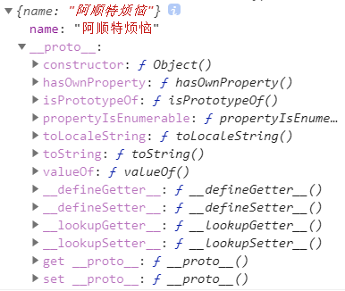
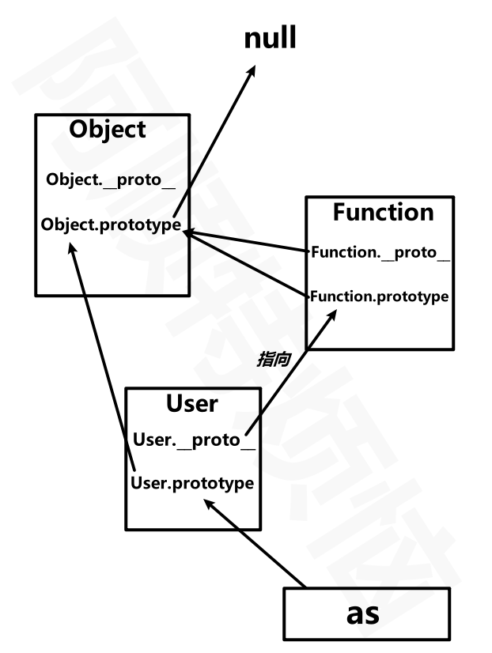
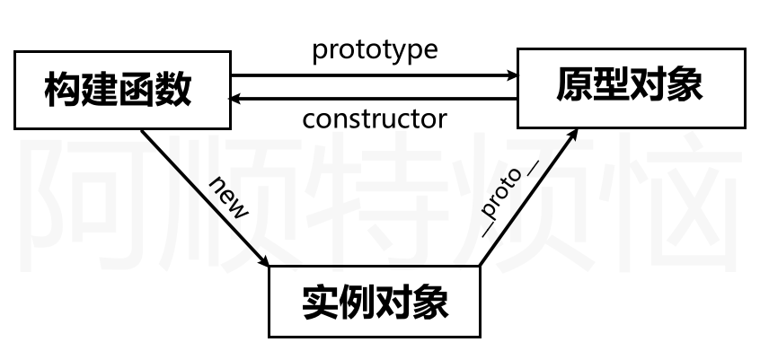

## 原型与继承

### 原型基础

#### 原型对象

​	我们知道，在Javascript中，任何一个种类其实都是对象。我们可以访问该对象的属性和方法，但是如果对象本身没有某属性、方法，就会从对象的原型上去查找，如果对象的原型上存在你要使用的属性、方法，则将会使用原型上的对应属性和方法。

* 可以将原型理解为对象的父亲，对象从原型对象继承来属性、方法

* 所有函数的原型默认是 `Object`的实例，所以可以使用`toString/toValues/isPrototypeOf` 等方法的原因

* 使用原型对象为多个对象共享属性或方法

* 如果对象本身不存在属性或方法才到原型上查找，若对象本身和原型具有同名属性、方法，则会使用对象本身的属性、方法。

* 使用原型可以解决，通过构建函数创建对象时复制多个函数造成的内存占用问题

* 原型对象`prototype`默认包含 `constructor` 属性，指向构造函数

* 对象具有 `__proto__` 属性，指向它`构造函数的原型对象prototype`

* 构造函数的`prototype`是用来让实例对象继承的。

* `prototype`是`构造器/函数/class`天生具有的属性
  JavaScript内置的构造器有：Object,Number,Boolean,String,Array,RegExp,Date,Function,Error,Math,JSON等。

  当然，普通的函数也可以是构造函数、工厂函数。所以普通函数也具有prototype，让实例化对象来继承。

* 原型链的顶点是`Object.prototype`,所有对象都继承于该原型。


下例就是使用数组原型上的 `concat` 方法完成的连接操作

```text
let as = ["a"];
console.log(as.concat("b"));	//["a","b"]
console.log(as.concat("c",["d","e"],[[[["f"]]]]));	//["a","c","d","e",["f"]]
console.log(as);	//["a"]
```

默认情况下创建的对象都有：继承而来的构造函数原型



* 由于a本身是由Objec构造函数创建的，所以a继承的是Object.prototype
* `a.constructor`和`a.__proto__.constructor`其实是一样的。
* 因为a本身没有constructor属性，所以访问的就是原型上的constructor。

```
let a = { name: "阿顺特烦恼" };
console.log(a);
console.log(a.constructor);// ƒ Object() {}
console.log(a.__proto__.constructor);// ƒ Object() {}
console.log(a.__proto__ == Object.prototype);	//true
```


我们也可以创建一个极简对象（纯数据字典对象）没有原型（原型为null)

```
let obj = { name: 3 };
console.log(obj.hasOwnProperty("name"));

let as = Object.create(null, {
  name: {
    value: "阿顺"
  }
});
console.log(as.hasOwnProperty("name")); //Error:hasOwnProperty not undefined

//Object.keys是静态方法，不是原型方法所以是可以使用的,但也不会返回正常结果，因为该方法也依赖于原型上的迭代接口。
console.log(Object.keys(as));//[]
```


函数具有两个原型对象：`prototype`、`__proto__`

* 之前说过，只有函数具有prototype，用于让实例继承。
* 但是在JS中，任何类型其实都是对象，当把函数看作对象时，其也就具有`__proto__`,用来访问自身的构造函数的原型。

```
function User() {}
User.__proto__.view = function() {
  console.log("User MakeFunction view method");
};
User.view();

User.prototype.show = function() {
  console.log("阿顺特烦恼");
};
let as = new User();
as.show();
console.log(User.prototype == as.__proto__);
```

```
……
console.log(User.__proto__ == User.constructor.prototype);
console.log(User.constructor.prototype == Function.prototype);
console.log(User.__proto__.__proto__ == Object.prototype);
console.log(User.prototype.__proto__ == Object.prototype);
console.log(Object.__proto__.__proto__ == Object.prototype);
console.log(Object.prototype.__proto__ == null);
```

是不是感觉`Object.__proto__.__proto__ == Object.prototype`很难理解？我们可以进行拆解

```
console.log(Object.__proto__.__proto__ == Object.prototype);
console.log(Object.__proto__ == Function.prototype);
console.log(Function.prototype.__proto__ == Object.prototype);
```

下面是原型关系分析，与方法继承的示例

* 实例对象，只有一个`__proto__`接口，用于访问构造函数的`prototype`
* 而`函数/构造函数`都有两个原型接口：`prototype`用于让实例对象继承、`__proto__`用于让自身继承构造自己的构造函数的`prototype`




```
let as = new Object();
as.name = "阿顺";
Object.prototype.show = function() {
  console.log("阿顺特烦恼");
};
as.show();

function User() {}
let shun = new User();
shun.show();
User.show();
```


下面是使用构造函数创建对象的原型体现

- 构造函数拥有原型
- 创建对象时构造函数把原型赋予对象




`constructor`存在于`prototype`原型中，用于指向构建函数。

```text
function User() {}
let as = new User();
console.log(as.__proto__ == User.prototype);
console.log(as.__proto__.constructor == User);
console.log(as.constructor == User);
```

使用对象的 `constructor` 创建对象

```text
 function User(name, age) {
		this.name = name;
		this.age = age;
 }

 function createByObject(obj, ...args) {
		const constructor = obj.__proto__.constructor;
		// const constructor = Object.getPrototypeOf(obj).constructor;
		return new constructor(...args);
 }

 let as = new User("阿顺", 18);
 let zs = createByObject(as, "张三", 7);
 console.log(zs);
```


---

#### 原型链

​	多个原型对象之间的继承，形成的多层级关系，可以抽象为一个链条，即原型链。

​	从之前的图解中也能够看出这种关系。


---

#### 获取\设置原型

##### getprototypeOf

* 使用`Object.getPrototypeOf(obj)`，获取`obj`的原型

  * 等同于`obj.__proto__`

  ```
  const a = {};
  console.log(Object.getPrototypeOf(a) == Object.prototype);
  console.log(Object.getPrototypeOf(a) == a.__proto__);
  ```


---

##### setPrototypeOf

* 使用`Object.setPrototypeOf(sub,sup)`，将`sub`的父级原型对象设置为`sup`

  ```
  let a = {};
  let b = {
  	show() {
  		return "Ashuntefannao";
  	},
  };
  Object.setPrototypeOf(a, b);
  console.log(Object.getPrototypeOf(a));	//{show: ƒ}
  ```

  下面的示例中继承关系为 user=>as=>shun。

  ```
  let user = {};
  let as = { name: "Ashun" };
  let shun = { type: "Controller" };
  
  Object.setPrototypeOf(user, as);
  Object.setPrototypeOf(as, shun);
  
  console.log(user.type);
  console.log(Object.getPrototypeOf(as));
  ```


##### Object.create

使用`Object.create(sup,{desc…})`在创建对象时设置新对象的父级原型。

* 参数1：设置新对象的父级原型
* 参数2：为新对象配置属性，以属性描述的形式，相当于`Object.defineProperties`的形式。


只设置原型

```
let user = {
  show() {
    return this.name;
  }
};

let as = Object.create(user);
as.name = "阿顺";
console.log(as.show());
```

设置原型并赋予新对象属性

```
let sup = {
	name: "Ashun",
	type: "Controller",
};
let obj = Object.create(sup, {
		show: {
				value: function () {
					console.log(this.name);
					console.log(Object.getPrototypeOf(this).name);
				},
				writable: false,
				enumerable: true,
		},
		type:{
			value:"VIP",
			configurable:false
		}
});
obj.show();	//Ashun Ashun
console.log(obj.type) //VIP
```


---

#### 原型检测

##### instanceof

instanceof 检测构造函数的 `prototype` 属性是否出现在某个实例对象的原型链上

```
function A() {}
function B() {}
function C() {}

let c = new C();

B.prototype = c;

let b = new B();

A.prototype = b;

let a = new A();

console.log(a instanceof A);
console.log(a instanceof B);
console.log(a instanceof C);
console.log(b instanceof B);
console.log(b instanceof C);
```

##### isPrototypeof

使用`isPrototypeOf`检测一个对象是否是另一个对象的原型链中

* `a.isPrototypeOf(b)`检测a对象是否在b的原型链上

```text
const a = {};
const b = {};
const c = {};

Object.setPrototypeOf(a, b);
Object.setPrototypeOf(b, c);

console.log(b.isPrototypeOf(a)); //true
console.log(c.isPrototypeOf(a)); //true
console.log(c.isPrototypeOf(b)); //true
console.log(Object.prototype.isPrototypeOf({})); //true

let num = new Number(1);
console.log(Object.prototype.isPrototypeOf(num));
```


---

#### 属性遍历

使用`in` 检测`原型链`上是否存在属性，使用 `hasOwnProperty` 只检测当前对象

```text
let a = { url: "Ashuntefannao" };
let b = { name: "阿顺" };
Object.setPrototypeOf(a, b);
console.log("name" in a);
console.log(a.hasOwnProperty("name"));
console.log(a.hasOwnProperty("url"));
```

使用 `for/in` 也会遍历`原型链`上的属性

```text
let as = { name: "阿顺" };
let shun = Object.create(as, {
  url: {
    value: "Ashuntefannao.com",
    enumerable: true
  }
});
for (const key in shun) {
  console.log(key);
}
```

`hasOwnProperty` 方法判断对象是否存在属性，而**不会查找原型**。所以如果只想遍历对象属性使用以下代码

```text
let as = { name: "阿顺" };
let shun = Object.create(as, {
  url: {
    value: "Ashuntefannao.com",
    enumerable: true
  }
});
for (const key in shun) {
  if (xj.hasOwnProperty(key)) {
    console.log(key);
  }
}
```

之前所说的Object内置迭代器：`Object.keys()、Object.values()、Object.entries()`,它们只能够获得**自身的、可枚举**的属性

```
function User(name) {
		Object.defineProperty(this, "site", {
			value: "Ashuntefannao.com",
			enumerable: false,
		});
		this.name = name;
}
User.prototype.show = function () {
	console.log(this.name);
};
let as = new User("阿顺");
console.log(Object.keys(as));//["name"]
```


---

#### 借用原型

使用 `call` 或 `apply` 可以借用其他原型方法完成功能。

下面的shun对象不能使用`max`方法，但可以借用 as 对象的原型方法

```text
let as = {
	data: [1, 2, 3, 4, 5],
};
Object.setPrototypeOf(as, {
		max: function (data) {
		return data.sort((a, b) => b - a)[0];
	},
});

console.log(as.max(as.data));

let shun = {
	lessons: { js: 100, php: 78, node: 78, linux: 125 },
};
console.log(as.__proto__.max.call(as, Object.values(shun.lessons)));
```

也可使用系统自带的 `Math.max` 。

```text
let as = {
  data: [1, 2, 3, 4, 5]
};
console.log(Math.max.apply(null, Object.values(as.data)));
console.log(Math.max.apply(null, as.data));

let shun = {
  lessons: { js: 100, php: 78, node: 78, linux: 125 }
};
console.log(Math.max.apply(shun, Object.values(.lessons)));
```

下面是获取设置了 `class` 属性的按钮，但`NodeList类数组`不能直接使用数组的`filter` 等方法，但借用数组的原型方法就可以操作了。

```text
<body>
  <button class="red">阿顺</button>
  <button>Ashun</button>
</body>
<script>
  let btns = document.querySelectorAll("button");
  btns = Array.prototype.filter.call(btns, item => {
    return item.hasAttribute("class");
  });
</script>
```


---

#### this

`this` 不受原型继承影响，`this` 指向调用属性时使用的对象。

* 谁调用，`this`指向谁

```text
let shun = {
  name: "阿顺特烦恼"
};
let as = {
  name: "阿顺",
  show() {
    return this.name;
  }
};
shun.__proto__ = as;
console.log(shun.show()); //阿顺特烦恼
```

```
 {
        function Fn() {
          this.x = 100;
          this.y = 200;
          this.getX = function () {
            console.log(this.x);
          };
        }
        
        Fn.prototype.getX = function () {
          console.log(this.x);
        };
        Fn.prototype.getY = function () {
          console.log(this.y);
        };
        
        var f1 = new Fn();
        var f2 = new Fn();
        console.log(f1.getX === f2.getX); //false
        console.log(f1.getY === f2.getY); //true
        console.log(f1.__proto__.getY === Fn.prototype.getY); //true
        console.log(f1.__proto__.getX === f2.getX); //false
        console.log(f1.__proto__.getX === Fn.prototype.getX); //true
        console.log(f1.constructor); //Fn
        console.log(Fn.prototype.__proto__.constructor); //Object
        f1.getX(); //100	(使用其本身的getX，this=》f1)
        f1.__proto__.getX(); //undefined	(通过原型调用，this=》f1.__proto__)
        f2.getY(); //200	(虽然使用的是原型上的方法，但是通过f2调用，this=》f2)
        Fn.prototype.getY(); //undefined	(通过原型调用，this=》f1.__proto__)
}
```

```
{
	function fun(){
		this.a = 0;
		this.b = function(){
			console.log(this.a);
		}
	}
	fun.prototype = {
		b: function(){
			this.a = 20;
			console.log(this.a);
		},
		c: function(){
			this.a = 30;
			console.log(this.a);
		}
	}
	var my_fun = new fun();
	my_fun.b();	//私有方法	this=>my_fun
	console.log(my_fun.a);
	my_fun.c();	//公有方法	this=>my_fun this.a = 30（将私有属性a修改为30）
	console.log(my_fun.a);
	
	var my_fun2 = new fun();
	console.log(my_fun2.a);
	my_fun2.__proto__.c();	//this=>my_fun2.__proto__ 在原型对象上增加了一个a:30
	console.log(my_fun2.a);
	console.log(my_fun2.__proto__.a);

}
//0,0,30,30,0,30,0,30
```


---

### 使用建议

#### prototype

##### 引用属性

原型中保存引用类型属性会造成对象共享属性，所以一般只会在原型中定义方法。

```text
function User() {}
User.prototype = {
  lessons: ["JS", "VUE"]
};
const as = new User();
const shun = new User();

as.lessons.push("CSS");

console.log(as.lessons); //["JS", "VUE", "CSS"]
console.log(shun.lessons); //["JS", "VUE", "CSS"]
```

普通函数的原型默认只有一个`constructor`属性，用于指向自身，这样在实例化后，就能让实例访问自身的构造函数。


```
function User() {}
console.log(User.prototype);
```


---

##### 更改原型

* `自定义`构造函数的原型`可以手动更改`
* `系统内置`构造函数的原型:`只能读、不能改`

下例是手动更改自定义构造函数的原型，以下代码直接设置了构造函数的原型将造成 `constructor` 丢失

```
function User() {}
User.prototype = {
	show() {
		return `外部更改了默认的prototype`;
	},
};
console.log(User.prototype); // {show: ƒ}
```

正确的做法是要保证原型中的 `constructor`指向构造函数

```
function User() {}
User.prototype = {
	constructor:User,
	show() {
		return `外部更改了默认的prototype`;
	},
};
console.log(User.prototype); // {constructor: ƒ, show: ƒ}
```

实例对象的原型引用构造函数的原型对象，是在创建对象时确定的，当构造函数原型对象改变时会影响后面创建的实例对象。

```text
function User() {}
User.prototype.name = "Ashun";
const obj1 = new User();
console.log(obj1.name); //Ashun

User.prototype = {
	constructor:User,
  name: "阿顺"
};
const obj2 = new User();
console.dir(obj2.name); //阿顺
```


`系统内置`构造函数的原型:为只读属性，外部不可更改，严格模式下会报错

```
String.prototype = {
	show() {
		return `外部更改了默认的prototype`;
	},
};
console.log(String.prototype);
```

```
"use strict"
String.prototype = {
	show() {
		return `外部更改了默认的prototype`;
	},
};
```


---

#### 原型管理

通过前介绍我们知道可以使用多种方式设置原型，下面是按时间顺序的排列

1. `prototype` 构造函数的原型属性
2. `Object.create` 创建对象时指定原型
3. `__proto__` 声明自定义的`非标准属性`设置原型，解决之前通过 `Object.create` 定义原型，而没提供获取方法
4. `Object.setPrototypeOf` 设置对象原型

以上几种方式都可以管理原型，一般我使用 `prototype` 更改自定义构造函数原型，使用  `Object.setPrototypeOf`  设置对象原型。

由于`__proto__`是一个非标准属性，所以使用`Object.getPrototypeOf`，获取对象原型。


---

### 构造函数

#### 使用优化

使用构造函数会产生 `函数复制` 即 `函数不能共享` 的问题造成内存占用。

```text
function User(name) {
  this.name = name;
  this.get = function() {
    return this.name;
  };
}
let zs = new User("张三");
let lisi = new User("李四");
console.log(zs.get == lisi.get); //false
```

将方法定义在原型上让对象共享，解决通过构造函数创建对象时函数复制的内存占用问题

```text
function User(name) {
  this.name = name;
}
User.prototype.get = function() {
  return "阿顺特烦恼" + this.name;
};
let lisi = new User("李四");

let wangwu = new User("王五");
console.log(lisi.get == wangwu.get); //true

//通过修改原型方法会影响所有对象调用，因为方法是共用的
lisi.__proto__.get = function() {
  return "Ashun" + this.name;
};
console.log(lisi.get());
console.log(wangwu.get());
```

下面演示使用原型让多个实例共享属性

```text
function User(name, age) {
  this.name = name;
  this.age = age;
  this.show = () => {
  	return `你在${this.site}的姓名:${this.name}，年龄:${this.age}`;
  }
}
User.prototype.site = '-阿顺特烦恼-';
let lisi = new User('李四', 12); 
let xiaoming = new User('小明', 32);

console.log(lisi.show()); //你在-阿顺特烦恼-的姓名:李四，年龄:12
console.log(xiaoming.show()); //你在-阿顺特烦恼-的姓名:小明，年龄:32
```

使用`Object.assign`一次设置原型方法来复用，后面会使用这个功能实现`Mixin模式`

```text
function User(name, age) {
  this.name = name;
  this.age = age;
}
Object.assign(User.prototype, {
  getName() {
      return this.name;
  },
  getAge() {
      return this.age;
  }
});
let lisi = new User('李四', 12);
let xiaoming = new User('小明', 32);
console.log(lisi.getName()); //李四
console.log(lisi.__proto__)
```


---

### 继承与多态

当对象自身不存在将要使用的属性时，JS会从原型上获取这就是继承在JavaScript中的实现。

#### 继承实现

下面使用`Object.create` 创建对象并指定原型，做为`Admin、Member`的原型对象来实现继承。


使用`Object.create` 创建一个对象，虽然没有赋予任何属性，但是为这个空对象指定了原型，所以能够实现原型的继承。

* 但是会导致`constructor`丢失

```text
function User() {}
User.prototype.getUserName = function() {};

function Admin() {}
Admin.prototype = Object.create(User.prototype);
Admin.prototype.role = function() {};

function Member() {}
Member.prototype = Object.create(User.prototype);
Member.prototype.email = function() {};
console.log(new Admin());
console.log(new Member());
```

不能使用以下方式操作（直接赋值），因为这样会改变User的原型方法，这不是继承，这是改变原型。相当于Admin的原型完全引用了User的原型对象，二者是同一个内存地址。

```text
...
function User() {}
User.prototype.getUserName = function() {};

function Admin() {}
Admin.prototype = User.prototype;
Admin.prototype.role = function() {};
...
```


---

#### 构造函数

有多种方式通过构造函数创建对象

* 直接new构造函数
* 通过原型找到`constructor`,然后再new实例化

```text
function Admin() {}
console.log(Admin == Admin.prototype.constructor); //true

let as = new Admin.prototype.constructor();
console.log(as);

let shun = new Admin();
console.log(shun);
```

因为有时根据得到的对象获取构造函数，然后再创建新对象，所以需要保证构造函数存在，但如果直接设置 `Admin.prototype` ，却没有为其保留`constructor`属性，会造成默认的`constructor`丢失，所以需要再次设置`constructor`值。

```text
function User() {}
function Admin() {}

Admin.prototype = Object.create(User.prototype);
Admin.prototype.role = function() {};

let as = new Admin();
console.log(as.constructor); //constructor丢失，返回User构造函数

Admin.prototype.constructor = Admin;

let shun = new Admin();
console.log(shun.constructor); //正确返回Admin构造函数

//现在可以通过对象获取构造函数来创建新对象了
console.log(new shun.constructor());
```

使用`Object.defineProperty`设置属性特征描述，来禁止遍历constructor属性

```text
function User() {}
function Admin(name) {
  this.name = name;
}

Admin.prototype = Object.create(User.prototype);

Object.defineProperty(Admin.prototype, "constructor", {
  value: Admin,
  enumerable: false //禁止遍历
});

let as = new Admin("阿顺");
for (const key in as) {
  console.log(key);
}
```

完全重写构建函数原型，只对后面创建的实例对象有效

```text
function User() {}
const lisi = new User();
User.prototype = {
  show() {
    return "prototype show";
  }
};
const wangwu = new User();
console.log(wangwu.show());

console.log(lisi.show()); // lisi.show is not a function
```


---

#### 方法重写

下而展示的是子类需要重写父类方法的技巧。

* 在子类构造函数的原型上压入 与 父类构造函数原型上的 同名方法
* 当对象本身没有使用的方法时，会`逐级`向原型链上层查找。

```text
function Person() {}
Person.prototype.getName = function() {
  console.log("parent method");
};

function User(name) {}
User.prototype = Object.create(Person.prototype);
User.prototype.constructor = User;

User.prototype.getName = function() {
  //调用父级同名方法
  Person.prototype.getName.call(this);
  console.log("child method");
};
let as = new User();
as.getName();
console.log(Object.getPrototypeOf(as).getName ==
Object.getPrototypeOf(Object.getPrototypeOf(as)).getName); //false
```


---

#### 多态

多态：根据多种不同的形态产生不同的结果。

下而会根据不同类型的对象得到不同的结果。

```text
			function Person() {}

			Person.prototype.show = function () {
        	console.log(this.desc);
			};

      function Admin() {}
      Admin.prototype = Object.create(Person.prototype);
      Admin.prototype.desc = "管理员的蔑视";

      function Member() {}
      Member.prototype = Object.create(Person.prototype);
      Member.prototype.desc = "我是Vip";

      function Enterprise() {}
      Enterprise.prototype = Object.create(Person.prototype);
      Enterprise.prototype.desc = "企业账户";

      let users = [new Admin(), new Member(), new Enterprise()];
      for (const user of Object.values(users)) user.show();
```


---

### 深挖继承

继承是为了复用代码，继承的本质是将原型指向到另一个对象。

#### 构造函数

我们希望`调用父类构造函数完成对象属性的初始化`，但像下面这样使用是不会成功的。因为此时 `this` 指向了window，无法为当前对象声明属性。

* 下例通过Admin构造函数创建实例，但是希望在Admin中 使用父级构造函数User来初始化实例的属性。
* 但是如果直接调用User函数，由于独立存在的函数this指向window，所以不能够为Admin实例赋予属性

```text
function User(name) {
  this.name = name;
  console.log(this);// Window
}
User.prototype.getUserName = function() {
  return this.name;
};

function Admin(name) {
  User(name);
}
Admin.prototype = Object.create(User.prototype);

let as = new Admin("阿顺");
console.log(as.getUserName()); //undefined
console.log(window.name); //阿顺
```

解决上面的问题是使用 `call/apply` 改变User函数的this指向，为每个生成的对象设置属性。

* 因为这里只是简单的调用User构造函数，所以需要改变this指向，不然this指向window。构造函数实例化为对象时，内部的this才会分配到实例上。

```text
function User(name) {
  this.name = name;
  console.log(this); // Admin
}
User.prototype.getUserName = function() {
  return this.name;
};

function Admin(name) {
  User.call(this, name);
}
Admin.prototype = Object.create(User.prototype);

let as = new Admin("阿顺");
console.log(as.getUserName()); //undefined
```


---

#### 原型工厂

原型工厂是将继承的过程封装，使用继承业务简单化。

```text
function extend(sub, sup) {
  sub.prototype = Object.create(sup.prototype);
  sub.prototype.constructor = sub;
}

function Access() {}
function User() {}
function Admin() {}
function Member() {}

extend(User, Access); 
extend(Admin, User); 
extend(Member, Access); 

Access.prototype.rules = function() {};
User.prototype.getName = function() {};

console.log(new Admin()); // 继承关系: Admin>User>Access>Object
console.log(new Member()); //继承关系：Member>Access>Object
```


---

#### 对象工厂

其实就是在`工厂函数`的基础上，完成原型的继承、对象属性的初始化。

```text
function User(name, age) {
  this.name = name;
  this.age = age;
}
User.prototype.show = function() {
  console.log(this.name, this.age);
};

function Admin(name, age) {
  let instance = Object.create(User.prototype);
  User.call(instance, name, age);
  instance.role=function(){
    console.log('admin.role');
  }
  return instance;
}
let as = Admin("阿顺", 18);
as.show();

function member(name, age) {
  let instance = Object.create(User.prototype);
  User.call(instance, name, age);
  return instance;
}
let lisi = member("李四", 28);
lisi.show();
```


---

#### Mixin模式

`JS`不能实现多继承，因为每个类的原型`prototype`只能设置一次，多次设置会覆盖之前的配置，每个类只能够继承一个父类原型。如果要使用多个类的方法时可以使用`mixin`混合模式来完成。

- `mixin` 类是一个包含许多供其它类使用的方法的类
- `mixin` 类`不用来`继承做为其它类的父类,只是将其中的方法合并到目标原型上。


下面是示例中 `Admin`需要使用 `Request.prototype` 与 `Credit.prototype` 的功能，因为`JS` 是单继承，`Admin`不能够同时继承`Request.prototype` 与 `Credit.prototype` 。我们不得不将无关的类连接在一起，显然下面的代码实现并不佳。

* User->Request->Credit
* Admin要同时使用Request和Credit中的方法，则就需要一个中间类(User)，将二者连接起来，再继承User的原型

```text
function extend(sub, sup) {
  sub.prototype = Object.create(sup.prototype);
  sub.prototype.constructor = sub;
}

function Credit() {}
function Request() {}

function User(name, age) {
  this.name = name;
  this.age = age;
}
extend(Request, Credit);
extend(User, Request);

Request.prototype.ajax = function() {
  console.log("请求后台");
};
Credit.prototype.total = function() {
  console.log("统计积分");
};

User.prototype.show = function() {
  console.log(this.name, this.age);
};
function Admin(...args) {
  User.apply(this, args);
}
extend(Admin, User);
let as = new Admin("阿顺", 18);
as.show();
as.total(); //统计积分
as.ajax(); //请求后台
```

下面分拆功能使用`Object.assign`实现Mixin多继承，使用代码结构更清晰。只让 `Admin` 继承 `User` 原型

```text
function extend(sub, sup) {
  sub.prototype = Object.create(sup.prototype);
  sub.prototype.constructor = sub;
}
function User(name, age) {
  this.name = name;
  this.age = age;
}
User.prototype.show = function() {
  console.log(this.name, this.age);
};
const Credit = {
  total() {
    console.log("统计积分");
  }
};
const Request = {
  ajax() {
    console.log("请求后台");
  }
};

function Admin(...args) {
  User.apply(this, args);
}
extend(Admin, User);
Object.assign(Admin.prototype, Request, Credit);
let as = new Admin("阿顺", 18);
as.show();
as.total(); //统计积分
as.ajax(); //请求后台
```

> 上面使用`Object.assign`实现多继承，具有局限性，因为此时，需要继承的方法必须都封装在对象中，此时就需要把`Credit、Request`从构造函数形式，转化成对象形式。

我们也可以使用`for/in、for/of`浅拷贝目标原型上的所有属性，实现多继承，下例就不需要中间类User了，直接继承`Credit`,再Copy`Request.prototype`中的属性即可。

**Tips**

* 在遍历赋值之前，使用`Object.create()`设置了子类的父级原型，也导致子类本身的prototype为`{}`

* 之后遍历赋值操作，设置了子类的constructor为父类的constructor，不符合逻辑，所以我再次配置了子类的constructor

```
		 function assignPrototype(sub, sup) {
        for (let [key, value] of Object.entries(sup.prototype)) {
          sub.prototype[key] = value;
        }
      }

      function Credit() {}
      function Request() {}

      Credit.prototype.total = function () {
        console.log("统计积分");
      };
      Credit.prototype.getName = function () {
        console.log(this.name);
      };
      Request.prototype.ajax = function () {
        console.log("请求后台");
      };

      function Admin(name) {
        this.name = name;
      }

      Admin.prototype = Object.create(Credit.prototype);
      assignPrototype(Admin, Request);
      Admin.prototype.constructor = Admin;	//重新设置constructor

      let as = new Admin("阿顺");
      as.total();
      as.getName();
      as.ajax();
      console.log(Admin.prototype);
```

也可以直接使用`Object.assign(sub.prototype,sup.prototype)`将二者的原型进行合并

```
……
      Admin.prototype = Object.create(Credit.prototype);
      Object.assign(Admin.prototype, Request.prototype);
      Admin.prototype.constructor = Admin;	//重新设置constructor
……
```

如果我们只是单纯的使用某些类的方法，而不在意父子关系，我们可以直接使用`Object.assign`合并多个原型即可，但是由于没有让这些原型链接起来，所以不能够使用instanceof进行判断。

* 若没有使用`Object.create`设置子类的原型，则之后使用`Object.assign`合并原型时，不会覆盖子类的`prototype.constructor`

```
……
      Object.assign(Admin.prototype, Credit.prototype, Request.prototype);

      let as = new Admin("阿顺");
      as.total();
      as.getName();
      as.ajax();
      console.log(as instanceof Admin); //true
      console.log(as instanceof Credit); //false
      console.log(as instanceof Request); //false
```


也可以使用`Class`结合`super`关键字，实现多继承

* super关键字必须写在constructor的顶部

```
		 	let CalculaterMixin = (Base) =>
        class extends Base {
          constructor(...argus) {
            super(...argus);
            this.argus = argus;
          }
          cacul() {
            console.log(`Calculater Method:${this.argus}`);
          }
        };

      let RandomMixin = (Base) =>
        class extends Base {
          constructor(...argus) {
            super(...argus);
            this.argus = argus;
          }
          random() {
            console.log(`Random Method:${this.argus}`);
          }
        };

      class Foo {
        constructor(...argus) {
          this.argus = argus;
          console.log(...argus);
        }
        foo() {
          console.log(`Foo Method:${this.argus}`);
        }
      }

      class End extends CalculaterMixin(RandomMixin(Foo)) {}
      let end = new End("ashun", "SHUN");
      end.foo();
      end.random();
      end.cacul();
      console.log(end instanceof End);
      console.log(end instanceof Foo);
      console.log(end instanceof CalculaterMixin); //Err
      console.log(end instanceof RandomMixin); //Err
```

上面这种方法利用了ES6中class的extends`后面可以使用表达式`特性，间接实现多继承，这种方法有个缺点是CalculatorMixin等Mixin其实是个箭头函数，无法用instanceof检测，因为`箭头函数没有显示原型`。

下面看看如何修正原型链：

* 手动设置Mixin的原型
* 让Mixin之间产生继承关系

```
……
//需要继承自Object，这里如果写null的话，CalculaterMixin instanceof Object会是false
CalculaterMixin.prototype = Object.create({});
RandomMixin.prototype = Object.create(null);

Object.setPrototypeOf(RandomMixin.prototype, CalculaterMixin.prototype);
Object.setPrototypeOf(Foo.prototype, RandomMixin.prototype);
      console.log(end instanceof End);
      console.log(end instanceof Foo);
      console.log(end instanceof CalculaterMixin); //true
      console.log(end instanceof RandomMixin); //true
```


---


##### super

`mixin` 类也可以继承其他类，比如下面的 `Create` 类获取积分要请求后台，就需要继承 `Request` 来完成。

* 手动配置`Create`的`__proto__`属性

- `super` 关键字指向本对象的父级原型。

```text
function extend(sub, sup) {
  sub.prototype = Object.create(sup.prototype);
  sub.prototype.constructor = sub;
}
function User(name, age) {
  this.name = name;
  this.age = age;
}
User.prototype.show = function() {
  console.log(this.name, this.age);
};
const Request = {
  ajax() {
    return "请求后台";
  }
};
const Credit = {
  __proto__: Request,
  total() {
    console.log(super.ajax() + ",统计积分");
  }
};

function Admin(...args) {
  User.apply(this, args);
}
extend(Admin, User);
Object.assign(Admin.prototype, Request, Credit);
let as = new Admin("阿顺", 18);
as.show();
as.total(); //统计积分
as.ajax(); //请求后台
```


---

#### 实例体验

使用继承原型的方法，结合 `call/apply` 制作选项卡。


```
<style>
      * {
        margin: 0;
        padding: 0;
        box-sizing: border-box;
      }
      body {
        width: 100vw;
        height: 100vh;
        display: flex;
        justify-content: space-around;
        align-items: center;
      }
      main {
        width: 45%;
        height: 300px;
        display: flex;
        flex-direction: column;
      }
      main > nav {
        width: 100%;
        min-height: 30px;
        display: flex;
        background-color: #ccc;
        border-radius: 4px;
        overflow: hidden;
      }
      a {
        text-decoration: none;
        flex: 1;
        display: flex;
        justify-content: center;
        align-items: center;
        color: #eee;
      }
      main > article {
        width: 100%;
        flex: 1;
        background-color: #eee;
        position: relative;
        border-radius: 4px;
        overflow: hidden;
        margin-top: 2px;
      }
      section {
        position: absolute;
        top: 0;
        left: 0;
        width: 100%;
        height: 100%;
        background-color: yellowgreen;
        display: none;
        justify-content: center;
        align-items: center;
        font-size: 24px;
        color: rgba(255, 255, 255, 0.8);
      }
</style>
<body>
    <main class="tab1">
      <nav><a>Ashun</a> <a>阿顺</a></nav>
      <article>
        <section>Ashun</section>
        <section>阿顺</section>
      </article>
    </main>
    <main class="tab2">
      <nav>
        <a>SHUN</a>
        <a>shun</a>
      </nav>
      <article>
        <section>SHUN</section>
        <section>shun</section>
      </article>
    </main>
</body>
<script>
      /*
        prototype 实例操作：实现Tab选项卡
        让Tab类原型继承Animation类的原型。
        Animation类中提供实现动画的方法，Tab类中完成dom的追踪和事件的绑定,
        在Tab类中，结合call/applay使用Animation中的方法。
        Tab类中只需要传入选项卡的rootDOM即可，内部使用rootDOM.querySelector查找子元素即可。
      */

      //继承封装
      function extend(sub, sup) {
        sub.prototype = Object.create(sup.prototype);
        sub.prototype.constructor = sub;
      }
      /*Animation类*/

      function Animation() {}
      Animation.prototype.show = function () {
        this.style.display = "flex";
      };
      Animation.prototype.hide = function () {
        this.style.display = "none";
      };
      Animation.prototype.background = function (color) {
        this.style.backgroundColor = color;
      };

      function Tab(tab) {
        this.tab = tab;
        this.a = tab.querySelectorAll("a");
        this.section = tab.querySelectorAll("section");
        console.log(this.a, this.section);
      }
      
      extend(Tab, Animation);
      
      Tab.prototype.init = function () {
        this.build();
        this.reset();
        this.action(0);
      };
      Tab.prototype.reset = function () {
        this.section.forEach((val) => this.hide.call(val));
        this.a.forEach((val) => this.background.call(val, "#ccc"));
      };
      Tab.prototype.action = function (i) {
        this.show.call(this.section[i]);
        this.background.call(this.a[i], "pink");
      };
      Tab.prototype.build = function () {
        this.a.forEach((a, index) => {
          a.addEventListener("click", () => {
            this.reset();
            this.action(index);
          });
        });
      };
      new Tab(document.querySelector(".tab1")).init();
      new Tab(document.querySelector(".tab2")).init();
</script>
```


