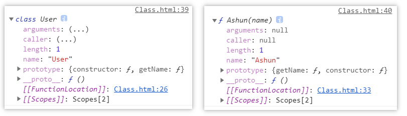
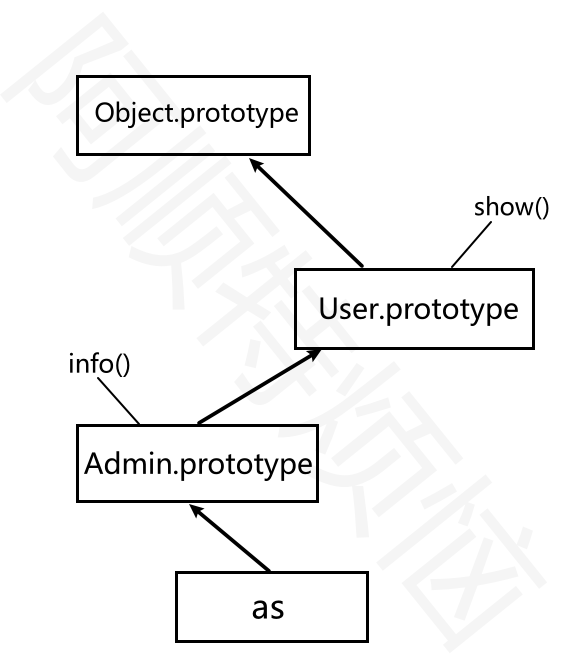

## 类

### 基础知识

为了和其他语言继承形态一致，JS提供了`class` 关键词用于模拟传统的`class` ，但底层实现机制依然是原型继承。

`class` 只是语法糖为了让类的声明与继承更加简洁清晰。

#### 声明定义

可以使用类声明和赋值表达式定义类，推荐使用类声明来定义类

```text
//类声明
class User {
}
console.log(new Article());

//赋值表达式
let Article = class {
};
console.log(new User());
```

类方法间不需要逗号

```text
class User {
  show() {}
  get() {
    console.log("get method");
  }
}
const as = new User();
as.get();
```


#### 构造函数

使用 `constructor` 构造函数传递参数，下例中`show`为构造函数方法，`getName`为原型方法。

* `constructor` 会在 new 时自动执行
* 在`class`中`constructor`就相当于普通构造函数的`函数体`，当使用`new`进行时实例化时，就会执行构造函数，为实例分配属性。
* 在`constructor`中使用`this`声明的属性，会被分配到实例本身，在`constructor`外部定义的`方法`，相当于添加到`class`这个构造函数的原型`prototype`上。（class实际上就是一个函数）
* 但是在`constructor`外部定义的`属性`依旧会被分配到实例上
* 其实创建一个类的过程，其实就是设置该类的原型对象`prototype`，默认有`constructor`属性，还可以在原型上压入其它的属性、方法。

```text
class User {
  constructor(name) {
    this.name = name;
    this.show = function() {};
  }
  getName() {
    return this.name;
  }
}
const as = new User("阿顺");
console.log(as);
console.log(User.prototype);
console.log(as.hasOwnProperty("getName"));
console.log(as.hasOwnProperty("name"));
```

构造函数用于传递对象的初始参数，但不是必须定义的，如果不设置系统会设置如下类型

- **子构造器中调用完`super` 后才可以使用 `this`**。
- 至于 `super` 的概念会在后面讲到，（执行父类中的constructor）

```
constructor(...args) {
  super(...args);
}
```


---

#### 原理分析

之前也提到过，**`class`其实就是函数**

```text
class User {
}
console.log(typeof User); //function
```

下面是与普通函数的对比，结构是完全一致的。



* `constructor` 用于定义函构造数体代码
* `constructor ` 外部定义的`方法`，会追加到该 类(构造函数) 的原型上。
* `constructor ` 外部定义的`属性`，依然会分配到实例上

```
class User {
	constructor(name) {
		this.name = "name";
	}
	getName() {
		return this.name;
	}
}

//普通构造函数
function Ashun(name) {
	this.name = "name";
}
Ashun.prototype.getName = function () {
	return this.name;
};

console.dir(User);
console.dir(Ashun);
```


---

#### 属性定义

在calss类中，无论是在`constructor ` 内、外部定义的`属性`，**都会分配到实例上**。

* `constructor ` 内部定义的`属性`，使用this声明
* `constructor ` 外部定义的`属性`，**不使用**关键字声明。

在class类中，在`constructor ` 外部定义的`方法`，会自动添加到该类的原型上。

```
class User {
	site = `Ashuntefannao.com`; //在constructor外部定义的属性，依然会被分配到实例上
	constructor(name) {
		this.name = name;
	}
	show() {
		console.log(this.name);
	}
}

console.log(User.prototype.site);//undefined
console.log(User.prototype.show);
let as = new User("阿顺");
console.log(as.name, as.site);//阿顺	Ashuntefannao.com
console.table(as);
```


---

#### 函数差异

虽然class是函数的语法糖，但是与普通构造函数在使用方面还是有一些区别的，这都是为了更加规范的管理原型。

* 在class中定义的方法即(原型上的方法)，自动设置为不可枚举。

我们知道，普通构造函数实例化的对象，通过`for/in`遍历属性，会访问原型上的属性。但这样可能会在遍历操作过程中，影响原型的属性或方法。所以class自动为原型上的方法设置属性特征`enumerable:false`。

```
{
        class User {
          site = `Ashuntefannao.com`;
          constructor(name) {
            this.name = name;
          }
          show() {
            console.log(this.name);
          }
        }
        let as = new User("阿顺");
        for (let key in as) {
          console.log(key);		//site name
        }
}
```

对比普通构造函数

```
{
        function User(name) {
          this.site = "Ashuntefannao.com";
          this.name = name;
        }
        User.prototype.show = function () {
          console.log(this.name);
        };
        let as = new User("阿顺");
        for (let key in as) {
          console.log(key);  //site name show
        }
}
```


----

#### 严格模式

`class` 默认使用`use strict` 严格模式执行

```text
{
        class User {
          site = `Ashuntefannao.com`;
          constructor(name) {
            this.name = name;
          }
          show() {
            !(function () {
              console.log(this); //默认严格模式，打印undefined
            })();
          }
        }
        let as = new User("阿顺");
        as.show();
}
```

对比普通构造函数

```
{
        function User(name) {
          this.site = "Ashuntefannao.com";
          this.name = name;
        }
        User.prototype.show = function () {
          !(function () {
            console.log(this); //非严格模式，this=》window
          })();
        };
        let as = new User("阿顺");
        as.show();
}
```


---

### 静态访问

​	静态属性、方法：意为只能够被 该类本身 访问的属性和方法，使用类名来调用。

* 在class中使用`static`关键字进行声明
* 在普通构造函数中，向构造函数本身压入对应的属性和方法。(构造函数本身也是对象)

#### 静态属性

静态属性即为类设置属性，而不是为实例对象设置，下面是原理实现

```text
function User() {}
User.site = "阿顺特烦恼";
console.dir(User);

const as = new User();
console.log(as.site); //undefiend
console.log(User.site); //阿顺特烦恼 
```

在 `class` 中为属性添加 `static` 关键字即声明为静态属性

- 可以把所有实例对象都要使用的值 定义为静态属性

```text
class Request {
  static HOST = "https://www.Ashuntefannao.com";
  
  query(api) {
    return Request.HOST + "/" + api;
  }
}
let request = new Request();
```


#### 静态方法

指通过类访问不能使用对象访问的方法，比如系统的`Math.round()`就是静态方法

- 一般来讲方法不需要对象属性参与计算就可以定义为静态方法

下面是静态方法实现原理，向构造函数本身压入方法。

```text
function User() {
  this.show = function() {
    return "this is a object function";
  };
}
User.show = function() {
  return "welcome to Ashuntefannao";
};
const as = new User();
console.dir(as.show()); //this is a object function
console.dir(User.show()); //welcome to Ashuntefannao
```

在 `class` 内声明的方法前使用 `static` 定义的方法即是静态方法

```text
class User {
  constructor(name) {
    this.name = name;
  }
  static create(name) {
    return new User(name);
  }
}
const as = User.create("阿顺");
console.log(as);
```

下面使用静态方法在课程类中的使用

```text
const data = [
  { name: "js", price: 100 },
  { name: "mysql", price: 212 },
  { name: "React", price: 98 }
];
class Lesson {
  constructor(data) {
    this.model = data;
  }
  get price() {
    return this.model.price;
  }
  get name() {
    return this.model.name;
  }
  //批量生成对象
  static createBatch(data) {
    return data.map(item => new Lesson(item));
  }
  //最贵的课程
  static MaxPrice(collection) {
    return collection.reduce((pre, v) => (pre.price > v.price ? pre : v));
    //  return collection.sort((a, b) => b.price - a.price)[0];
  }
}
const lessons = Lesson.createBatch(data);
console.log(lessons);
console.log(Lesson.MaxPrice(lessons).name);
```


----

### 访问器

使用访问器可以对对象的属性进行访问控制，下面是使用访问器对私有属性进行管理。

#### 语法介绍

- 使用访问器可以管控属性，有效的防止属性随意修改
- 访问器就是在函数前加上 `get/set`修饰，操作属性时不需要加函数的扩号，直接用函数名

```text
class User {
  constructor(name) {
    this.data = { name };
  }
  get name() {
    return this.data.name;
  }
  set name(value) {
    if (value.trim() == "") throw new Error("invalid params");
    this.data.name = value;
  }
}
let as = new User("阿顺");
as.name = "Ashun";
console.log(as.name);
```


---

### 访问控制

设置对象的私有属性有多种方式，包括后面章节介绍的模块封装。

#### public

`public` 指不受保护的属性，在类的内部与外部都可以访问到

```text
class User {
  url = "Ashuntefannao.com";
  constructor(name) {
    this.name = name;
  }
}
let as = new User("阿顺");
console.log(as.name, as.url);
```

#### protected

protected是受保护的属性修释，不允许外部直接操作，只能在`该类`及其`子类(继承类)`中访问的属性

##### 命名保护

将属性定义为以 `_` 开始，来告诉使用者这是一个私有属性，请不要在外部使用。

- 外部修改、访问protected属性时可以使用访问器 `setter/getter` 操作
- 但这只是提示，就像吸烟时烟盒上的吸烟有害健康，但还是可以抽的

```text
class Article {
  _host = "https://Ashuntefannao.com";

  set host(url) {
    if (!/^https:\/\//i.test(url)) {
      throw new Error("网址错误");
    }
    this._host = url;
  }
  get host(){
  	return this._host
  }
  lists() {
    return `${this._host}/article`;
  }
}
let article = new Article();
console.log(article.lists()); //https://Ashuntefannao.com/article
article.host = "https://ASHUN.com";
console.log(article.lists()); //https://ASHUN.com/article
console.log(article._host);		//实际上是能够被实例访问的，因为_host属性被分配到了实例上
```

继承时是可以使用的

```text
class Common {
  _host = "https://Ashuntefannao.com";
  set host(url) {
    if (!/^https:\/\//i.test(url)) {
      throw new Error("网址错误");
    }
    this._host = url;
  }
   get host(){
  	return this._host
  }
}
class Article extends Common {
  lists() {
    return `${this._host}/article`;
  }
}
let article = new Article();
console.log(article.lists()); //https://Ashuntefannao.com/article
article.host = "https://ASHUN.com";
console.log(article.lists()); //https://ASHUN.com/article
```

##### Symbol

下面使用 `Symbol`定义protected属性，即在外部通过查看对象结构无法获取的属性

```text
const protecteds = Symbol();
class Common {
  constructor() {
    this[protecteds] = {};
    this[protecteds].host = "https://Ashuntefannao.com";
  }
  set host(url) {
    if (!/^https?:/i.test(url)) {
      throw new Error("非常网址");
    }
    this[protecteds].host = url;
  }
  get host() {
    return this[protecteds].host;
  }
}
class User extends Common {
  constructor(name) {
    super();//调用父类的constructor
    this[protecteds].name = name;
  }
  get name() {
    return this[protecteds].name;
  }
}
let as = new User("阿顺");
as.host = "https://www.ASHUN.com";
// console.log(as[Symbol()]);
console.log(as.name);
```

##### WeakMap

**WeakMap** 是一组键/值对的集，下面利用`WeakMap`类型特性定义protected属性

```text
const _host = new WeakMap();
class Common {
  constructor() {
    _host.set(this, "https://Ashuntefannao.com");
  }
  set host(url) {
    if (!/^https:\/\//i.test(url)) {
      throw new Error("网址错误");
    }
    _host.set(this, url);
  }
}
class Article extends Common {
  constructor() {
    super();
  }
  lists() {
    return `${_host.get(this)}/article`;
  }
}
let article = new Article();
console.log(article.lists()); //https://Ashuntefannao.com/article
article.host = "https://SHUN.com";
console.log(article.lists()); //https://SHUN.com/article
```

也可以统一定义私有属性

```text
const protecteds = new WeakMap();
class Common {
  constructor() {
    protecteds.set(this, {
      host: "https://Ashuntefannao",
      port: "80"
    });
  }
  set host(preset) {
    if (!/^https:\/\//i.test(preset.host)) {
      throw new Error("网址错误");
    }
    protecteds.set(this, { ...protecteds.get(this), ...preset });
  }
}
class Article extends Common {
  constructor() {
    super();
  }
  lists() {
    return `${protecteds.get(this).host}:${protecteds.get(this).port}/article`;
  }
}
let article = new Article();
console.log(article.lists()); //https://Ashuntefannao:80/article
article.host = { host: "https://SHUN", port: 8083 };
console.log(article.lists()); //https://SHUN:8083/article
```


#### private

`private` 指私有属性，只在当前类可以访问到，并且不允许继承使用

- 为属性或方法名前加 `#` 为声明为私有属性
- 私有属性`只能`在声明的类中使用

下面声明私有属性 `#host` 与私有方法 `#check` 用于检测用户名

```text
class User {
  //private
  #host = "https://Ashuntefannao.com";
  constructor(name) {
    this.name = name ;
    this.#check(name);
  }
  set host(url) {
    if (!/^https?:/i.test(url)) {
      throw new Error("非常网址");
    }
    this.#host = url;
  }
  get host() {
    return this.#host;
  }
  #check = () => {
    if (this.name.length < 5) {
      throw new Error("用户名长度不能小于五位");
    }
    return true;
  };
}
let as = new User("阿顺特烦恼");
as.host = "https://www.SHUN.com";
console.log(as["#host"]);//实例中不能访问类的私有属性
console.log(as.host);	//可以通过getter间接访问
```

对比普通构造函数

```
function User(name) {
	let privateProp = { name };
	Object.defineProperty(this, "name", {
			get() {
				return privateProp.name;
			},
			set(newVal) {
				privateProp.name = newVal;
			},
	});     
}
let as = new User("Ashun");
console.log(as.name);
console.log(as.privateProp);	//undefined
```


---

### 详解继承

#### 属性继承

class实现属性继承的原型如下

```text
function User(name) {
  this.name = name;
}
function Admin(name) {
  User.call(this, name); 
}
let as = new Admin("阿顺");
console.log(as);
```

这就解释了为什么在子类构造函数中要先执行`super`

```text
class User {
  constructor(name) {
    this.name = name;
  }
}
class Admin extends User {
  constructor(name) {
    super(name);
  }
}
let as = new Admin("阿顺");
console.log(as);
```


---

####  继承原理

`class` 使用`extends`关键字实现原型继承。



```
class User {
  show() {
    console.log("user.show");
  }
}
class Admin extends User {
  info() {
    this.show();
  }
}
let as = new Admin("阿顺");
console.dir(as);
as.info();
```


---

#### 方法继承

原生的继承主要是操作原型链，实现起来比较麻烦，使用 `class` 就要简单的多了。

- 在子类中使用父类同名方法，需要使用`super`关键字访问父类的方法，当然，如果子类中没有与父类的同名方法，则直接使用`this`即可，该类没有使用的方法，会到原型上去查找，但是为了更加准确地调用父类方法，推荐使用`super`
- super.show() 执行父类的show方法

下面是在子类中使用父类的方法`show`

```text
      class Person {
        constructor(name) {
          this.name = name;
        }
        show() {
          return `阿顺特烦恼会员: ${this.name}`;
        }
      }
      class User extends Person {
        constructor(name) {
          super(name);
        }
        show() {
          return "is User show";
        }
        run() {
          // return this.show();
          return super.show();
        }
      }
      const as = new User("ASHUN");
      console.log(as.run());
```

class中的`extends`关键字后面可以跟表达式，也就是说可以使用 `extends` 继承表达式返回的类

```text
function controller() {
  return class {
    show() {
      console.log("user.show");
    }
  };
}
class Admin extends controller() {
  info() {
    this.show();
  }
}
let as = new Admin();
as.show()
```


---

#### super

表示从当前原型中查找方法，

- super 一直指向当前对象
- super只能在`类`或`对象方法`中使用，不能在 独立存在的函数 中使用


下面是使用 `this` 模拟`super`，会有以下问题

- `this`指向调用该方法的对象，结果并不是 `admin`的`name`值

```text
let user = {
  name: "user",
  show() {
    return this.name;
  }
};
let admin = {
  __proto__: user,
  name: "admin",
  show() {
    return this.__proto__.show();	//this=>user
  }
};
console.log(admin.show()); //user
```

为了解决以上问题，需要调用父类方法时改变`this`指向

```text
let user = {
  name: "user",
  show() {
    return this.name;
  }
};
let admin = {
  __proto__: user,
  name: "admin",
  show() {
    return this.__proto__.show.call(this);
  }
};
console.log(admin.show());//admin
```

上面看似结果正常，但如果是多层继承时，会出现新的问题

- 我们期望使用`common.show`，但因为始终传递的是当前对象`this` ，造成从 `this` 原型循环调用
- `admin.get`调用父级原型上的show，并绑定了admin的this，所以当执行user.show()时，this为admin，又会导致admin调用user.show()，周而复始，产生循环调用。

```text
let common = {
  show() {
    console.log("common.init");
  }
};
let user = {
  __proto__: common,
  name: "user",
  show() {
    return this.__proto__.show.call(this);
  }
};
let admin = {
  __proto__: user,
  name: "admin",
  get() {
    return this.__proto__.show.call(this);
  }
};
console.log(admin.get());
```

为了解决以上问题 `js` 提供了 `super` 关键字

- 使用 `super` 调用时，在所有继承中 `this` 始终为调用对象
- `super` 是用来查找当前对象的原型，而不像上面使用 `this` 查找原型造成死循环

```text
let common = {
  show() {
    return this.name;
  }
};
let user = {
  __proto__: common,
  name: "user",
  show() {
    return super.show();
  }
};
let admin = {
  __proto__: user,
  name: "admin",
  get() {
    return super.show();
  }
};
console.log(admin.get());
```

虽然使用`super`调用父级方法，但`this指向当前对象`

```
      let common = {
        show() {
          console.log("common.init");
          console.log(this.name);
        },
      };
      let user = {
        __proto__: common,
        name: "user",
        show() {
          return super.show();
        },
      };
      let admin = {
        __proto__: user,
        name: "admin",
        get() {
          return super.show(); //虽然使用super调用父级方法，但this指向当前对象
        },
      };
      admin.get();	//common.init admin
```

`super` **只能在**`类`或`对象的方法`中使用，而不能在独立存在的函数中使用，下面将产生错误

```text
let user = {
  name: "user",
  show() {
    return this.name;
  }
};
let admin = {
  __proto__: user,
  name: "admin",
  get: function() {
    return super.show();
  }
};
console.log(admin.get()); //Uncaught SyntaxError: 'super' keyword unexpected here
```


---

#### constructor

`super` 指向父类引用，在构造函数`constructor` 中必须先调用`super()`，因为这样才能够继承父级原型的属性、方法。

- `super()` 调用父类的构造函数`constructor()`
- 必须在 `constructor` 函数里的`this` 使用前执行 `super()`
- 若不手动配置`super()`,系统会默认执行

```text
class User {
  constructor(name) {
    this.name = name;
  }
  show() {
    console.log(this.name);
  }
}
class Admin extends User {
  constructor(name) {
    super(name);
  }
}
let as = new Admin("阿顺");
as.show();
```

`constructor` 中先调用 `super` 方法的原理如下

* 利用父级构造函数，初始化实例属性

```text
function Parent(name) {
  this.name = name;
}
function User(...args) {
  Parent.apply(this, args);
}
User.prototype = Object.create(User.prototype)
User.prototype.constructor = User;
const as = new User("阿顺");
console.log(as.name);
```

若不手动配置`super(...args)`,系统会默认执行

```
class User {
  constructor(name) {
    this.name = name;
    this.age = age;
  }
  show() {
    console.log(this.name, this.age);
  }
}
class Admin extends User {
  constructor(...args) {
    super(..args);
  }
}
let as = new Admin("阿顺",18);
as.show();
```

与下方代码结果相同

```
class User {
  constructor(name) {
    this.name = name;
    this.age = age;
  }
  show() {
    console.log(this.name, this.age);
  }
}
class Admin extends User {}
let as = new Admin("阿顺",18);
as.show();
```


---

#### 父类方法

之前已经提到过，使用`super`指向父级原型引用，所以可以通过`super`调用父级原型的方法，并且this指向当前对象。

- 不添加方法名是执调用父类构造函数`constructor`

```text
class User {
  constructor(name) {
    this.name = name;
  }
  getName() {
    return this.name;
  }
}
class Admin extends User {
  constructor(name) {
    super(name);
  }
}
const as = new Admin("阿顺");
console.log(as.getName());
```

下面是通过父类方法获取课程总价

```text
class Controller {
  sum() {
    return this.data.reduce((t, c) => t + c.price, 0);
  }
} 
class Lesson extends Controller {
  constructor(lessons) {
    super();
    this.data = lessons;
  }
  info() {
    return {
      totalPrice: super.sum(),
      data: this.data
    };
  }
}
let data = [
  { name: "js", price: 100 },
  { name: "mysql", price: 212 },
  { name: "vue.js", price: 98 }
];
const as = new Lesson(data);
console.table(as.info());
```


---

#### 方法覆盖

即在子类中设置与父类同名的方法，这样就会优先调用子类自身的方法，子类自身没有，才会攀爬原型进行查找。

子类存在父类同名方法时使用子类方法

```text
class User {
  constructor(name) {
    this.name = name;
  }
  say() {
    return this.name;
  }
}
class Admin extends User {
  say() {
    return "阿顺特烦恼：" + super.say();
  }
}
const as = new Admin("阿顺");
console.log(as.say());
```

下面是覆盖父类方法，只获取课程名称

```text
class Controller {
  say() {
    return this.name;
  }
  total() {
    return this.data.reduce((t, c) => t + c.price, 0);
  }
  getByKey(key) {
    return this.data.filter(item => item.name.includes(key));
  }
}
class Lesson extends Controller {
  constructor(lessons) {
    super();
    this.data = lessons;
  }
  getByKey(key) {
    return super.getByKey(key).map(item => item.name);
  }
}
let data = [
  { name: "js", price: 100 },
  { name: "mysql", price: 212 },
  { name: "vue.js", price: 98 }
];
const hd = new Lesson(data);
console.log(hd.getByKey("js"));
```


---

#### 静态继承

静态的属性和方法也是可以被继承使用的，下面是原理分析

```text
function User() {}
User.site = "阿顺特烦恼";
User.url = function() {
  return "Ashuntefannao.com";
};
function Admin() {}
Admin.__proto__ = User;
console.dir(Admin);
console.log(Admin.url());
```

下面使用 `class` 来演示静态继承

* `extends`也会继承**静态**属性、方法

```text
class User {
  static site = "阿顺特烦恼";
  static host() {
    return "Ashuntefannao.com";
  }
  show() {
  	console.log(User.site, User.host());
   }
}
class Admin extends User {}
console.log(Admin.site);
let as = new Admin();
as.show();
```


---

#### 原型检测

##### instanceof

使用 `instanceof` 用于检测 构造函数的`prototype`是否在某个实例的原型链上，下面是在原型中的分析（已经在原型与继承中讲过）

```text
function User() {}
function Admin() {}
Admin.prototype = Object.create(User.prototype);
let as = new Admin();
console.log(as instanceof Admin); //true
console.log(as instanceof User); //true

console.log(as.__proto__ == Admin.prototype);
console.log(as.__proto__.__proto__ == User.prototype);
```

下面是递归检测原型的代码，帮助分析 `instanceof` 的原理

```text
function checkPrototype(obj, constructor) {
  if (!obj.__proto__) return false;
  if (obj.__proto__ == constructor.prototype) return true;
  return checkPrototype(obj.__proto__, constructor);
}
```

`class` 内部实现就是基于原型，所以使用`instanceof` 判断和上面原型是一样的

```text
class User {}
class Admin extends User {}
let as = new Admin();
console.log(as instanceof Admin);
console.log(as instanceof User);
```

##### isPrototypeOf

使用 `isPrototypeOf` 判断一个对象是否在另一个对象的原型链中，下面是原理分析

```text
const a = {};
const b = {
  __proto__: a
};
const c = {
  __proto__: b
};
console.log(a.isPrototypeOf(b)); //true
console.log(a.isPrototypeOf(c)); //true
```

下面在使用 `class` 语法中使用

```text
class User {}
class Admin extends User {}
let as = new Admin();
console.log(Admin.prototype.isPrototypeOf(as));
console.log(User.prototype.isPrototypeOf(as));
```


---

#### 继承内置类

使用原型扩展内置类

```text
function Arr(...args) {
  args.forEach(item => this.push(item));
  this.first = function() {
    return this[0];
  };
  this.max = function() {
    return this.data.sort((a, b) => b - a)[0];
  };
}

Arr.prototype = Object.create(Array.prototype);
let arr = new Arr("阿顺", "123", 18);
console.log(arr.first());
console.log(arr.max())
```

使用 `class`扩展内置类

```text
class Arr extends Array {
        constructor(...args) {
          super(...args);
        }
        add(val) {
          this.push(val);
        }
        remove(val) {
          let index = this.findIndex((v) => v == val);
          index && this.splice(index, 1);
          return index;
        }
}
let arr = new Arr(1, 2, 3);
arr.push("ASHUNTEFANNAO");
console.log(arr);
console.log(arr.remove(3));
console.log(arr);
```


---

#### mixin

关于`mixin` 的使用在原型章节已经讨论过，在`class` 使用也是相同的原理

`JS`不能实现多继承，如果要使用多个类的方法时可以使用`mixin`混合模式来完成。

- `mixin` 类是一个包含许多供其它类使用的方法的类
- `mixin` 类不用来继承做为其它类的父类

```text
const Tool = {
  max(key) {
    return this.data.sort((a, b) => b[key] - a[key])[0];
  }
};

class Lesson {
  constructor(lessons) {
    this.lessons = lessons;
  }
  get data() {
    return this.lessons;
  }
}

Object.assign(Lesson.prototype, Tool);
const data = [
  { name: "js", price: 100 },
  { name: "mysql", price: 212 },
  { name: "vue.js", price: 98 }
];
let hd = new Lesson(data);
console.log(hd.max("price"));
```


---

#### 实例操作


* 类：Animation、Slide、Panel
* Animation:动画效果的实现
* Slide：处理事件绑定，通过Panel调用动画，实现逻辑
* Panel：用于管理面板的伸缩
* 只有Panel extends Animation 在Slide中通过选择器遍历实例化panel。


```
<style>
      * {
        margin: 0px;
        padding: 0;
        box-sizing: border-box;
      }
      body {
        width: 100vw;
        height: 100vh;
        position: relative;
      }
      main {
        margin: 0 auto;
        width: 80%;
        height: 100%;
      }
      .slide {
        width: 100%;
        height: 100%;
      }
      dl {
        display: flex;
        flex-direction: column;
        height: 90%;
      }
      section {
        width: 100%;
        display: flex;
        flex-direction: column;
      }
      section > dt,
      section > dd {
        width: 100%;
        border-radius: 5px;
        display: flex;
        justify-content: center;
        align-items: center;
        overflow: hidden;
        color: rgba(255, 255, 255, 0.8);
      }
      section > dt {
        min-height: 30px;
        background-color: #16a085;
      }
      section > dd {
        height: 200px;
        width: 100%;
        background-color: #f39c12;
        font-size: 24px;
      }
</style>
<body>
    <main>
      <div class="slide">
        <dl>
          <section>
            <dt>Ashun</dt>
            <dd>Ashun</dd>
          </section>
          <section>
            <dt>阿顺</dt>
            <dd>阿顺</dd>
          </section>
          <section>
            <dt>ashun</dt>
            <dd>ashun</dd>
          </section>
        </dl>
      </div>
    </main>
</body>
<script>
 class Animation {
        constructor(el) {
          this.el = el;
          this.timeOut = 6;
          this.step = 3;
          this.isShow = false;
          this.defaultHeight = this.height;
          this.timer = undefined;
        }
        get height() {
          return parseFloat(window.getComputedStyle(this.el).height);
        }
        set height(num) {
          this.el.style.height = num + "px";
        }
        show(callback) {
          this.isShow = true;
          clearInterval(this.timer);
          this.timer = setInterval(() => {
            if (this.height >= this.defaultHeight) {
              clearInterval(this.timer);
              callback && callback(this);
              return;
            }
            this.height = this.height + this.step >= this.defaultHeight
                ? this.defaultHeight
                : this.height + this.step;
          }, this.timeOuttimeOut);
        }
        hide(callback) {
          this.isShow = false;
          clearInterval(this.timer);
          this.timer = setInterval(() => {
            if (this.height <= 0) {
              clearInterval(this.timer);
              callback && callback(this);
              return;
            }
            this.height = this.height - this.step < 0 ? 0 : this.height - this.step;
          }, this.timeOuttimeOut);
        }
      }
      class Slide {
        constructor(el) {
          this.el = document.querySelector(el);
          this.links = this.el.querySelectorAll("dt");
          this.panels = [...this.el.querySelectorAll("dd")].map(
            (v) => new Panel(v)
          );
          this.init();
          this.buildEvent();
        }
        init() {
          Panel.hidAll(this.panels, 0);
          this.panels[0].action();
        }
        buildEvent() {
          this.links.forEach((link, index) => {
            link.addEventListener("click", () => {
              let test = Panel.hidAll(this.panels, index);
              this.panels[index].action();
            });
          });
        }
      }
      class Panel extends Animation {
        static num = 0;
        constructor(el) {
          super(el);
          this.el = el;
        }
        action() {
          this.show();
        }
        static hidAll(panels, index) {
          panels.forEach((v, i) => {
            if (index != i) {
              v.hide();
            }
          });
        }
		}
    new Slide(".slide");
 </script>
```

上面的版本：每次点击不同的item，会展示当前的item，收缩其它item。在动画结束前可以操作其它item。

下面的版本：动画结束前操作其它item无效果。

* 定义一个静态属性，用于记录收缩选项的个数
* 如果当前收缩选项的个数大于0，即还有选项没有收缩完毕，则不执行对应的动画。

```
      class Animation {
        constructor(el) {
          this.el = el;
          this.timeOut = 6;
          this.step = 3;
          this.isShow = false;
          this.defaultHeight = this.height;
          this.timer = undefined;
        }
        get height() {
          return parseFloat(window.getComputedStyle(this.el).height);
        }
        set height(num) {
          this.el.style.height = num + "px";
        }
        show(callback) {
          this.isShow = true;
          clearInterval(this.timer);
          this.timer = setInterval(() => {
            if (this.height >= this.defaultHeight) {
              clearInterval(this.timer);
              callback && callback(this);
              return;
            }
            this.height = this.height + this.step >= this.defaultHeight
                ? this.defaultHeight
                : this.height + this.step;
          }, this.timeOuttimeOut);
        }
        hide(callback) {
          this.isShow = false;
          clearInterval(this.timer);
          this.timer = setInterval(() => {
            if (this.height <= 0) {
              clearInterval(this.timer);
              callback && callback(this);
              return;
            }
            this.height = this.height - this.step < 0 ? 0 : this.height - this.step;
          }, this.timeOuttimeOut);
        }
      }
      class Slide {
        constructor(el) {
          this.el = document.querySelector(el);
          this.links = this.el.querySelectorAll("dt");
          this.panels = [...this.el.querySelectorAll("dd")].map(
            (v) => new Panel(v)
          );
          this.init();
          this.buildEvent();
        }
        init() {
          Panel.hidAll(Panel.others(this.panels, 0), () => {
            this.panels[0].action();
          });
        }
        buildEvent() {
          this.links.forEach((link, index) => {
            link.addEventListener("click", () => {
              Panel.hidAll(Panel.others(this.panels, index), () => {
                this.panels[index].action();
              });
            });
          });
        }
      }
      class Panel extends Animation {
        static num = 0;
        constructor(el) {
          super(el);
          this.el = el;
        }
        action() {
           this.show();
        }
        static hidAll(others, callback) {
          if (Panel.num > 0) return false;
          others.forEach((v, i) => {
            ++Panel.num;
            v.hide(() => Panel.num--);	//当panel的动画执行完毕后,进行--
          });
          callback && callback();
        }
        static others(panels, index) {
          return panels.filter((v, i) => i != index);
        }
     }
    new Slide(".slide");
```


