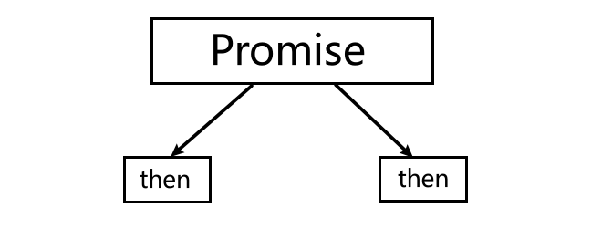

## Promise

`JavaScript` 中存在很多异步操作,`Promise` 将异步操作队列化，按照期望的顺序执行，返回符合预期的结果。可以通过链式调用多个 `Promise` 达到我们的目的。

Promise 在各种开源库中已经实现，现在标准化后被浏览器默认支持。

> promise 是一个拥有 `then` 方法的对象或函数

### 问题探讨

下面通过多个示例来感受一下不使用 `promise` 时，处理相应问题的不易，及生成了不便阅读的代码。

#### 定时嵌套

下面是一个定时器执行结束后，执行另一个定时器，这种嵌套造成代码不易阅读

```
 <style>
      div {
        position: absolute;
        width: 100px;
        height: 100px;
        background-color: pink;
      }
</style>
<body>
    <div></div>
</body>
<script>
      function createInterval(callback, delay = 50) {
        let timer = setInterval(() => {
          callback(timer);
        }, delay);
      }
      const div = document.querySelector("div");
      console.log(parseFloat(window.getComputedStyle(div).left));

      function run() {
        createInterval((timer) => {
          div.style.left =
            parseFloat(window.getComputedStyle(div).left) + 2 + "px";
          // console.log("left");
          if (parseFloat(div.style.left) >= 50) {
            clearInterval(timer);
            createInterval((timer) => {
              div.style.width =
                parseFloat(window.getComputedStyle(div).width) - 2 + "px";
              // console.log("width");
              parseFloat(div.style.width) <= 0 && clearInterval(timer);
            });
          }
        });
      }
      div.addEventListener("click", run);
</script>
```

#### 图片加载

下面是图片后设置图片边框，也需要使用回调函数处理，代码嵌套较复杂

```text
      function createImage(file, resolve, reject) {
        const img = new Image();
        img.src = file;
        img.onload = () => {
          resolve(img);
          console.log("image Loading fulfilled");
        };
        img.onerror = () => {
          console.log("image loading fail");
        };
        document.body.append(img);
      }

      createImage("./images/img1.jpg", (img) => {
        img.style.border = "5px solid pink";
      });
```


#### 加载文件

下面是异步加载外部`JS`文件，需要使用回调函数执行，并设置的错误处理的回调函数

```text
      function loadJS(file, resolve, reject) {
        let script = document.createElement("script");
        script.src = file;
        script.onload = resolve;
        script.onerror = reject;
        document.body.append(script);
      }
      loadJS(
        "./js/ashun.js",
        (script) => {
          console.log(`${script.path[0].src}  load Resolve`);
          title();
        },
        (err) => console.log(`${err.srcElement.src}  load Reject`)
      );
```

实例中用到的 `ashun.js` 与 `SHUN.js` 内容如下

```text
# ashun.js
function title() {
  console.log("title method");
}

# SHUN.js
function run() {
  title();
  console.log("run method");
}
```

如果要加载多个脚本时需要嵌套使用，下面`SHUN.js` 依赖 `ashun.js`，需要先加载`ashun.js` 后加载`SHUN.js`

> 不断的回调函数操作将产生回调地狱，使代码很难维护

```text
function loadJS(file,resolve,reject){……}

   loadJS(
        "/js/ashun.js",
        (script) => {
          loadJS(
            "/js/SHUN.js",
            (script) => {
              run();
              console.log(`${script.path[0].src}  load Resolve`);
            },
            (err) => {
              console.log(`${err.srcElement.src}加载失败`);
            }
          );
          console.log(`${script.path[0].src}  load Resolve`);
        },
        (err) => {
          console.log(`${err.srcElement.src}加载失败`);
        }
    );
```


#### 异步请求

使用传统的异步请求也会产生回调嵌套的问题。

比如若要获取商品的详情，就要分为两步

1. 先请求商品数据，得到商品的id
2. 根据商品id请求获取对应商品的详情数据。

以下接口无实际用途，仅作示例，可自己编写

```text
function ajax(url, resolve, reject) {
  let xhr = new XMLHttpRequest();
  xhr.open("GET", url);
  xhr.send();
  xhr.onload = function() {
    if (this.status == 200) {
      resolve(JSON.parse(this.response));
    } else {
      reject(this);
    }
  };
}
ajax("http://localhost:8888/goodslist/data, goods => {
  ajax(
    `http://localhost:8888/category?id=${goods["id"]}`,
    response => {
      console.log(response[0]);
    }
  );
});
```


#### 肯德基

下面是模拟肯德基吃饭的事情，使用 `promise` 操作异步的方式每个阶段会很清楚

```text
      let kfc = new Promise((resolve, reject) => {
        console.log("肯德基正在为您做餐……");
        setTimeout(() => {
          resolve("餐品已经做好，为您上桌");
        }, 2000);
      });
      let as = kfc.then((result) => {
        console.log(result);
        console.log("阿顺收到消息");
        return {
          then(resolve, reject) {
            setTimeout(() => {
              resolve("我吃了2秒，不辣，张三你可以吃了");
            }, 2000);
          },
        };
      });

      let zhangsan = as.then((msg) => {
        return new Promise((resolve, reject) => {
          console.log("张三收到阿顺消息：" + msg);
          setTimeout(() => {
            let msg = "我吃了1秒，真好吃， 李四也尝尝吧";
            console.log(msg);
            resolve(msg);
          }, 1000);
        });
      });
      let lisi = zhangsan.then((result) => {
        console.log("李四收到消息：" + result);
        setTimeout(() => {
          console.log("李四:我吃了1秒，不错不错");
        }, 1000);
      });
```

而使用以往的回调方式，就会让人苦不堪言

```text
      function notice(msg, then) {
        then(msg);
      }
      function meal() {
        notice("肯德基厨房开始做饭", (msg) => {
          console.log(msg);
          notice("我是肯德基，你的餐已经做好", (msg) => {
            console.log(`阿顺收到肯德基消息: ${msg}`);
            setTimeout(() => {
              notice("张三，我吃了两秒了，不辣，你可以吃了", (msg) => {
                console.log(`张三收到阿顺消息: ${msg}`);
                setTimeout(() => {
                  notice("很好吃，李四也尝尝吧", (msg) => {
                    console.log(msg);
                    notice("李四收到消息", (msg) => {
                      console.log(msg);
                      setTimeout(() => {
                        console.log("李四:不错不错");
                      }, 1000);
                    });
                  });
                }, 2000);
              });
            }, 2000);
          });
        });
      }
      meal();
```


---

### 异步状态

Promise 意为承诺，就像我们去饭店用餐，点完餐后服务员会给我们一个票号，如果饭菜做好，我们凭借票号去领餐，这就代表成功状态，若由于其它原因饭菜不能够顺利做好，这就代表拒绝状态。在得到这些结果前，我们一直处于等待的状态。

- 一个 `promise` 必须有一个 `then` 方法用于处理状态改变

#### 状态说明

Promise包含`pending`、`fulfilled`、`rejected`三种状态

- `pending` 指等待状态，初始化 `promise` 时的状态
- `resolve` 指已经解决，将 `promise` 状态设置为`fulfilled`
- `reject` 指拒绝处理，将 `promise` 状态设置为`rejected`
- `promise` 是生产者，通过 `resolve` 与 `reject` 函数告知结果
- `promise` 非常适合需要一定执行时间的异步任务
- 同一Promise状态一旦确定(`fufilled\rejected`),状态将不可再次更改

promise 是队列状态，就像体育中的接力赛，或多米诺骨牌游戏，状态一直向后传递，当然 也可更改其中的任何一个promise的状态，来影响后续的promise。


promise 没有使用 `resolve` 或 `reject` 更改状态时，默认状态为 `pending`

```text
console.log(
  new Promise((resolve, reject) => {
  });
); //Promise {<pending>}
```

当更改状态后

```text
console.log(
  new Promise((resolve, reject) => {
    resolve("fulfilled");
  })
); //Promise {<resolved>: "fulfilled"}

console.log(
  new Promise((resolve, reject) => {
    reject("rejected");
  })
); //Promise {<rejected>: "rejected"} //Error
```

若一个Promise为`rejected`状态，却没有处理，系统会发出警示。

```
console.log(
  new Promise((resolve, reject) => {
    reject("rejected");
  })
); //Promise {<rejected>: "rejected"} //Error:Uncaught (in promise) rejected
```

使用`then\catch`处理后，不会报错，`then\catch`这些方法默认也会返回一个新的`promise`

```
console.log(
        new Promise((resolve, reject) => {
          reject("rejected");
        }).catch((err) => {})
); //Promise {<pending>}
```

按理来说上述Promise已经确认为rejected状态，也经过了`then\catch`的onRejected回调函数处理，应该返回`fufilled`状态（`then\catch`默认返回的promise状态为fufilled），但是为什么返回pending状态呢？

* console.log是同步代码会立即执行，当日志信息被打印时，promise的状态还未被确认，所以返回pending
* 将打印放在宏任务队列中，可看到正确结果

关于`任务队列`，下一章节会详细讲解

```
      let promise = new Promise((resolve, reject) => {
        reject("rejected");
      });
      let p1 = promise.catch((err) => err);
      
      console.log(promise)//Promise {<rejected>:"rejected"}
      console.log(p1);		//Promise {<pending>}
      setTimeout(() => {
        console.log(p1);	//Promise {<fulfilled>:"rejected"}
      });  
```

`promise` 自创建时，立即执行同步任务，`then` 会放在异步微任务中执行，需要等同步任务执行后才执行。

```text
let promise = new Promise((resolve, reject) => {
  resolve("fulfilled");
  console.log("阿顺");
});
promise.then(msg => {
  console.log(msg);
});
console.log("阿顺特烦恼");
// 阿顺 阿顺特烦恼 fulfilled
```

```
const promise = new Promise((resolve) => {
	resolve("fulfilled");
});
promise.then(alert);
alert("阿顺特烦恼");
promise.then((_) => alert("ashuntefannao"));
```

下例在三秒后将 `Promise` 状态设置为 `fulfilled` ，然后执行 `then` 方法

```text
new Promise((resolve, reject) => {
  setTimeout(() => {
    resolve("fulfilled");
  }, 3000);
}).then(
  msg => {
    console.log(msg);
  },
  error => {
    console.log(error);
  }
);
```

状态被改变后就不能再修改了，下面先通过`resolve` 改变为成功状态，表示`promise` 状态已经完成，就不能使用 `reject` 更改状态了

```text
new Promise((resolve, reject) => {
  resolve("操作成功");
  reject(new Error("请求失败"));
}).then(
  msg => {
    console.log(msg);
  },
  error => {
    console.log(error);
  }
);
```


#### 动态改变

可以在一个`promise`中，通过处理另一个`promise1`，来改变`promise`的状态。

当在一个`promise`中，告知状态时传入的是另一个`promise1`，则后续使用`then`或其它方法对其进行处理时，处理的已经不再是promise的状态，而是promise1。

* 在p2中确认`resolve`状态，但在后续的`then`中却执行了`rejected`回调函数。
* 在p2中确认状态时，返回的是p1，那么后续处理的promise将是p1，p2的状态已经无意义

```
{
      let p1 = new Promise((resolve, reject) => {
        reject("p1 reject");
      });
      
      let p2 = new Promise((resolve, reject) => {
        console.log(`p2发送resolve状态`);
        resolve(p1);
      }).then(
        (result) => console.log(`p2 处理结果:fulfilled--${result}`),
        (err) => console.log(`p2 处理结果:rejected--${err}`)
      );
}
```


---

### then

一个promise 需要提供一个then方法访问promise 结果，`then` 用于当 `promise` 状态发生改变时的处理，即`promise`处理异步操作过程，`then` 用于处理结果。

`promise` 就像 `饭馆` 中的厨房，`then` 就是我们用户，如果餐做好了即 `fulfilled` ，做不了拒绝即`rejected` 状态。那么 then 就要对不同状态处理。

- then 方法 **必须** 返回 promise，用户返回或系统自动返回
- 第一个函数在`resolved` 状态时执行，即使用`resolve`确认完成状态时，执行`then`第一个callback处理成功状态
- 第二个函数在`rejected`状态时执行，即使用`reject`确认拒绝状态时，执行第二个callback处理失败状态，该函数是可选的
- 两个callback都接收 `promise` 确认状态时传入的值做为参数
- 也可以使用`catch` 来处理失败的状态
- 如果在 `then` 中手动返回 `promise` ，下一个`then` 会在上一个then返回的`promise` 状态改变后执行

#### 语法说明

then的语法如下，onFulfilled 函数处理 `fulfilled` 状态， onRejected函数处理 `rejected` 状态

- onFulfilled 或 onRejected `不是函数将被忽略`
- 两个函数只会被调用一次
- onFulfilled 在 promise 执行成功时调用
- onRejected 在 promise 执行拒绝时调用

```text
promise.then(onFulfilled, onRejected)
```


---

#### 基础知识

`then` 会在 `promise` 确认状态后执行，`then` 第一个callback在 `resolve`成功状态执行

```text
const promise = new Promise((resolve, reject) => {
  resolve("success");
}).then(
  value => {
    console.log(`解决：${value}`);
  },
  reason => {
    console.log(`拒绝:${reason}`);
  }
);
```

`then` 中第二个参数在失败状态执行

```text
const promise = new Promise((resolve, reject) => {
  reject("is error");
});
promise.then(
  msg => {
    console.log(`成功：${msg}`);
  },
  error => {
    console.log(`失败:${error}`);
  }
);
```

如果只关心成功则不需要传递 `then` 的第二个参数

```text
const promise = new Promise((resolve, reject) => {
  resolve("success");
});
promise.then(msg => {
  console.log(`成功：${msg}`);
});
```

如果只关心失败时状态，`then` 的第一个参数传递 `null`

```text
const promise = new Promise((resolve, reject) => {
  reject("is error");
});
promise.then(null, error => {
  console.log(`失败:${error}`);
});
```

promise 确认状态后转入的参数，会传入到`then`对应callback的参数中，如果then没有可处理函数，会一直向后传递

```text
let p1 = new Promise((resolve, reject) => {
	reject("rejected");
})
.then()
.then(
  null,
  f => console.log(f)
);
```

```
let promise = new Promise((resolve, reject) => {
  resolve("resolve");
});
let p2 = promise.then();
p2.then().then(resolve => {
  console.log(resolve);
});
```

```
let promise = new Promise((resolve, reject) => {
  reject("reject");
});
let p2 = promise.then(() => {});
p2.then(null, null).then(null, reject => {
  console.log(reject);
});
```


#### 链式调用

* `then\catch`等promise的方法，是对上一个promise状态的处理，而使用`then/catch`后 它们本身又会默认返回一个新的promise，且状态为`fulfilled`,所以then才可不断地链式调用。
* 当然，也可以在`then\catch`中手动返回自定义的promise，可通过这个promise，改变当前then的状态


每次的 `then` 都是一个全新的 `promise`， then 默认返回的 promise 状态是 fulfilled

```
   {
        let promise = new Promise((resolve, reject) => {
          reject("promise state rejected");
        });
        promise
          .then(null, (err) => console.log(err))
          .then((_) => console.log("then默认状态为fulfilled"));
   }
```

每次的 `then` 都是一个全新的 `promise`，不要认为上一个 promise状态会影响以后then返回的状态

```text
let p1 = new Promise(resolve => {
  rejected("p1 rejected");
});
let p2 = p1.then(null,rej=>console.log(reg));
p2.then(() => {
  console.log("Ashuntefannao");
});

console.log(p1); // Promise {<resolved>}
console.log(p2); // Promise {<pending>}

setTimeout(() => {
  console.log(p1); // Promise {<resolved>}
  console.log(p2); // Promise {<resolved>}
});
```

`then` 是对上个promise 的处理，每个 `then` 又会返回一个promise，默认传递 `fulfilled`状态，所以才可以不断地链式调用then处理promise。

```text
new Promise((resolve, reject) => {
  reject();
})
.then(
  resolve => console.log("fulfilled"),
  reject => console.log("rejected")
)
.then(
  resolve => console.log("fulfilled"),
  reject => console.log("rejected")
)
.then(
  resolve => console.log("fulfilled"),
  reject => console.log("rejected")
);
  
# 执行结果如下
  rejected
  fulfilled
  fulfilled
```

如果内部手动返回 `promise` 时，后续处理的便是该 `promise`，即该promise可以改变当前then的状态

```
 {
        let promise = new Promise((resolve, reject) => {
          reject("promise state rejected");
        });
        promise
          .then(
            (result) => console.log("fulfilled"),
            (reject) => console.log(reject)
          )
          .then(
            (res) => console.log("fufilled"),
            (rej) => console.log("rejected")
          )
          .then((res) => {
            console.log("fufilled");
            return Promise.reject("手动返回的promise，状态为rejected");
          })
          .then(
            (res) => console.log("fufilled"),
            (rej) => console.log(rej)
          );
 }
 # 执行结果如下
  "promise state rejected"
  "fulfilled"
  "fulfilled"
  "手动返回的promise，状态为rejected"
```

若手动返回的不是Promise，则下一个then处理的还是 上一个then默认返回的Promise，状态为fulfilled。

* 但是下一个then对应的处理函数，会接受上一个then返回的参数。

```
{
        let promise = new Promise((resolve, reject) => {
          reject("promise state rejected");
        });
        let p1 = promise.then(null, (rej) => {
        	console.log(rej)
          return "p1 rejected";
        });
        let p2 = p1.then((res) => {
          console.log(`p2 fulfilled \n${res}`);
        });
}
 # 执行结果如下
  "promise state rejected"
  "p2 fulfilled
   p1 rejected"
```

```
new Promise((resolve, reject) => {
  resolve();
})
.then(v => {
  return new Promise((resolve, reject) => {
    resolve("第二个promise");
  });
})
.then(value => {
  console.log(value);
  return value;
})
.then(value => {
  console.log(value);
});
```

then是处理上一个Promise的结果，只有上一个promise确认了状态，then才会执行

```
{
        let promise = new Promise((resolve, reject) => {
          setTimeout(() => {
            resolve("promise fulfilled");
          }, 1000);
        })
          .then((res) => {
            console.log(res);
            return new Promise((resolve) => {
              setTimeout(() => {
                resolve("resolved");
              }, 1000);
            });
          })
          .then((res) => console.log(res));
}
```


**循环调用**

如果 `then` 的返回值与所处理的 `promise` 相同将禁止执行，（避免陷入死循环）

```text
let promise = new Promise(resolve => {
  resolve();
});
let p2 = promise.then(() => {
  return p2;
}); // TypeError: Chaining cycle detected for promise
```


---

#### 其它类型

**then able**：具有then能力的类型

Promise 解决过程是一个抽象的操作，其需输入一个 `promise` 和一个值，我们表示为 `[[Resolve]](promise, x)`，如果 `x` 有 `then` 方法且看上去像一个 Promise ，解决程序即尝试使 `promise` 接受 `x` 的状态；否则其用 `x` 的值来执行 `promise` 。

* 也就是说，如果`x`具有`then`方法，那么将会被系统认为是`类promise`的结构
* 若在Promise中返回`x`,则使用then处理Promise时，系统会尝试让原Promise的then方法接收`x`中then方法的状态


包含then方法的Object可以当作promise使用

```
{
        let promise = new Promise((resolve, reject) => {
          resolve({
            then(resolve, reject) {
              resolve("promise fulfilled");
            },
          });
        });
        let p1 = promise.then((result) => {
          console.log(result);
          return {
            then(resolve, reject) {
              setTimeout(() => {
                reject(" p1 rejected");
              }, 1000);
            },
          };
        });
        p1.then(
          (mgs) => {
            console.log(mgs);
          },
          (rej) => console.log(rej)
        );
}
```

```
class Goods {
  constructor(id) {
    this.id = id;
  }
  then(resolve, reject) {
    resolve(ajax(`http://localhost:8083/goods?id=${this.id}`));
  }
}

new Promise((resolve, reject) => {
  resolve(ajax(`http://localhost:8083/goodsList?type=new`));
})
.then(goods => {
  return new Goods(goods.id);
})
.then(category => {
  console.log(category);
});
```

当然也可以是类

```text
new Promise((resolve, reject) => {
  resolve(
    class {
      static then(resolve, reject) {
        setTimeout(() => {
          resolve("解决状态");
        }, 2000);
      }
    }
  );
}).then(
  v => {
    console.log(`fulfilled: ${v}`);
  },
  v => {
    console.log(`rejected: ${v}`);
  }
);
```

如果对象中的 then 不是函数，则将对象做为值传递

```text
new Promise((resolve, reject) => {
  resolve();
})
.then(() => {
  return {
    then: "阿顺特烦恼"
  };
})
.then(v => {
  console.log(v); //{then: "阿顺特烦恼"}
});
```


---

### catch

#### 基础知识

下面使用未定义的变量同样会触发失败状态

```text
let promise = new Promise((resolve, reject) => {
  as;
}).then(
  value => console.log(value),
  reason => console.log(reason)
);
```

如果 onFulfilled 或 onRejected 抛出异常，则 p2 拒绝执行并返回拒因

```text
let promise = new Promise((resolve, reject) => {
  throw new Error("fail");
});
let p2 = promise.then();
p2.then().then(null, resolve => {
  console.log(resolve + ",阿顺特烦恼");
});
```

* `catch(err=>{})`是用来接收Promise拒绝状态的。经catch处理后，默认返回的promise状态也为fulfilled
* `catch`相当于`then(null,onReject)`
* 若某个promise已被`then(null,onReject)`处理，则`catch`将不会接收该拒绝状态

```
{
        let promise = new Promise((resolve, reject) => {
          reject("rejected");
        });
        let p1 = promise.catch((err) => console.log(err));
        setTimeout(() => {
          console.log(p1);
        });
}
```

```
{
        let promise = new Promise((resolve, reject) => {
          reject("promise rejected");
        });
        promise
          .then(null, (resolve) => {
            console.log(resolve + ",阿顺特烦恼");
          })
          .catch((err) => console.log(err));
}
//	promise rejected,阿顺特烦恼

{
        let promise = new Promise((resolve, reject) => {
          reject("promise rejected");
        });
        promise
          .catch((err) => console.log(err))
          .then(null, (resolve) => {
            console.log(resolve + ",阿顺特烦恼");
          });
}
//	promise rejected
```

- 建议使用 `catch` 处理错误
- 将 `catch` 放在最后面用于统一处理前面发生的错误

```text
const promise = new Promise((resolve, reject) => {
  reject(new Error("Notice: Promise Exception"));
}).catch(msg => {
  console.error(msg);
});
```

`catch` 可以捕获之前所有 `promise` 的错误，所以建议将 `catch` 放在最后。下例中 `catch` 也可以捕获到了第一个 `then` 返回 的 `promise` 的错误。

```text
new Promise((resolve, reject) => {
  resolve();
})
.then(() => {
  return new Promise((resolve, reject) => {
    reject("err from .then ");
  });
})
.then(() => {})
.catch(msg => {
  console.log(msg);
});
```

错误是冒泡的操作的，下面没有任何一个`then` 定义第二个函数参数`onRejected`，将一直冒泡到 `catch` 处理错误

```text
new Promise((resolve, reject) => {
  reject(new Error("请求失败"));
})
.then(msg => {})
.then(msg => {})
.catch(error => {
  console.log(error);
});
```

`catch` 也可以捕获对 `then` 抛出的错误处理

```text
new Promise((resolve, reject) => {
  resolve();
})
.then(msg => {
  throw new Error("这是then 抛出的错误");
})
.catch(() => {
  console.log("33");
});
```

`catch` 也可以捕获其他错误，下面在 `then` 中使用了未定义的变量，将会把错误抛出到 `catch`

```
new Promise((resolve, reject) => {
  resolve("success");
})
.then(msg => {
  console.log(a);
})
.catch(reason => {
  console.log(reason);
});
```


---

#### 处理机制

```text
const promise = new Promise((resolve, reject) => {
  throw new Error("fail");
}).catch(msg => {
  console.log(msg.toString()+"阿顺特烦恼");
});
```

可以将上面的理解为如下代码，可以理解为内部自动执行 `try...catch`

```text
const promise = new Promise((resolve, reject) => {
  try {
    throw new Error("fail");
  } catch (error) {
    reject(error);
  }
}).catch(msg => {
  console.log(msg.toString());
});
```

但像下面的在`异步宏任务`中 `throw new Error` 将不会触发 `catch`，而使用系统错误处理

```text
const promise = new Promise((resolve, reject) => {
  setTimeout(() => {
    throw new Error("fail");
  }, 2000);
}).catch(msg => {
  console.log(msg + "阿顺特烦恼");
});
```

在 `catch` 中发生的错误也会抛给最近的错误处理

```text
const promise = new Promise((resolve, reject) => {
  reject();
})
.catch(msg => {
  ashun();
})
.then(null, error => {
  console.log(error);
});
```


---

#### 定制错误

可以根据不同的错误类型进行定制操作，下面将`url格式错误`与`参数错误`分别进行了处理

```text
class ParamError extends Error {
  constructor(msg) {
    super(msg);
    this.name = "ParamError";
  }
}
class HttpError extends Error {
  constructor(msg) {
    super(msg);
    this.name = "HttpError";
  }
}
function ajax(url) {
  return new Promise((resolve, reject) => {
    if (!/^http/.test(url)) {
      throw new HttpError("请求地址格式错误");
    }
    let xhr = new XMLHttpRequest();
    xhr.open("GET", url);
    xhr.send();
    xhr.onload = function() {
      if (this.status == 200) {
        resolve(JSON.parse(this.response));
      } else if (this.status == 404) {
        // throw new ParamError("用户不存在");
        reject(new ParamError("用户不存在"));
      } else {
        reject("加载失败");
      }
    };
    xhr.onerror = function() {
      reject(this);
    };
  });
}

ajax(`http://localhost:8083?name=阿顺特烦恼`)
.then(value => {
  console.log(value);
})
.catch(error => {
  if (error instanceof ParamError) {
    console.log(`参数错误:${error.message}`);
  }
  if (error instanceof HttpError) {
    alert(`url格式错误:${error.message}`);
  }
  console.log(error);
});
```


---

### finally

无论状态是`resolve` 或 `reject` 都会执行此动作，`finally` 与状态无关。

* 根据finally的特性，通常在其中做一些公共的操作，不论状态，都会执行的操作。

```text
const promise = new Promise((resolve, reject) => {
  reject("阿顺特烦恼");
})
.then(msg => {
  console.log("resolve");
})
.catch(msg => {
  console.log("reject");
})
.finally(() => {
  console.log("resolve/reject状态都会执行");
});
```

下面使用 `finally` 处理加载状态，当图片加载完成时移除加载图标。

```
<style>
      div {
        position: absolute;
        width: 100px;
        height: 100px;
        background-color: pink;
      }
      .result {
        display: none;
      }
</style>
<body>
    <div class="loading">loading...</div>
    <div class="result"></div>
</body>
<script>
      function createImage(file) {
        return new Promise((resolve, reject) => {
          let img = new Image();
          img.src = file;
          img.onload = () => resolve(img);
          img.onerror = () => reject("加载失败");
        });
      }
      setTimeout(() => {
        createImage("./images/img1.jpg")
          .then((img) => {
            document.body.append(img);
            document.querySelector(".result").innerHTML = "加载成功";
          })
          .catch((err) => {
            console.log(err);
            document.querySelector(".result").innerHTML = err;
          })
          .finally(() => {
            document.querySelector("div").style.display = "none";
            document.querySelector(".result").style.display = "block";
          });
      }, 1000);
</script>
```


#### 实例操作

##### 异步请求

下面是将 `ajax` 请求使用 `promise` 处理，代码结构清晰了很多

```text
function ajax(url) {
  return new Promise((resolve, reject) => {
    let xhr = new XMLHttpRequest();
    xhr.open("GET", url);
    xhr.send();
    xhr.onload = function() {
      if (this.status == 200) {
        resolve(JSON.parse(this.response));
      } else {
        reject(this);
      }
    };
  });
}

ajax("http://localhost:8083/goodsList?name=new")
.then(goods =>ajax(`http://localhost:8083/category?id=${goods["id"]}`))
.then(data => {
  console.log(data);
});
```

##### 脚本加载

```
{
        function loadJS(file) {
          return new Promise((resolve, reject) => {
            let script = document.createElement("script");
            script.src = file;
            document.body.append(script);
            script.onload = () => {
              resolve(script);
            };
            script.onerror = () => {
              reject(script);
            };
          });
        }
        loadJS("./js/ashun.js")
          .then((script) => {
            title();
            console.log("ashun.js finishLaod");
            return script;
          })
          .then((ashunjs) => {
            return loadJS("./js/SHUN.js").then((script) => {
              console.log("SHUN.js finishLaod");
              run();
            });
          })
          .catch((script) => console.log(`${script.src}：加载失败`));
}
```

##### 定时器

下面是封装的`timeout` 函数，使用定时器操作更加方便

```text
function timeout(times) {
  return new Promise(resolve => {
    setTimeout(resolve, times);
  });
}

timeout(3000)
  .then(() => {
    console.log("3秒后执行");
    return timeout(1000);
  })
  .then(() => {
    console.log("执行上一步的promise后1秒执行");
  });
```

使用Promise封装 `setInterval` 定时器并实现动画效果

```
<style>
    div {
      width: 100px;
      height: 100px;
      background: pink;
      position: absolute;
    }
</style>
<body>
  <div></div>
</body>
<script>
        function interval(callback, delay = 5) {
          return new Promise((resolve, reject) => {
            let id = setInterval(() => {
              callback(id, resolve);
            }, delay);
          });
        }

        let div = document.querySelector("div");

        function run() {
          const step = 2;
          interval((timer, resolve) => {
            let left = parseFloat(window.getComputedStyle(div).left);
            if (left >= 200) {
              clearInterval(timer);
              resolve("left end");
            }
            div.style.left = left + step + "px";
          })
            .then((result) => {
              console.log(result);
              return interval((timer, resolve) => {
                let width = parseFloat(window.getComputedStyle(div).width);
                if (width <= 0) {
                  clearInterval(timer);
                  resolve("width end");
                }
                div.style.width = width - step + "px";
              });
            })
            .then((result) => console.log(result));
        }
        
        div.addEventListener("click", run);
</script>
```


----

### 链式操作

- 每个 `then` 都是一个promise，`then`会默认返回一个promise，且状态为fulfilled。
- 如果在 `then` 中手动返回一个新`promsie`，只当这个新的`promise` 确认状态后，才会继承执行下一个 `then`

##### 语法介绍

下面是对同一个 `promise` 分别使用不同的 `then` 进行操作 ，每个`then` 都得到了同一个promise 结果，这不是链式操作，实际使用意义不大。



```
const promise = new Promise((resolve, reject) => {
  resolve("阿顺特烦恼");
});
promise.then(title => {
  title += "-Ashun";
  console.log(title); //阿顺特烦恼-Ashun
});
promise.then(title => {
  title += "-Ashuntefannao";
  console.log(title); //阿顺特烦恼-Ashuntefannao
});
```


`promise` 中的 `then` 方法可以链式调用，`then` 方法的返回值会传递到下一个`then` 方法对应的处理函数中。

- `then` 会返回一个`promise` ，所以如果有多个`then` 时会连续执行
- `then` 返回的值会做为当前`promise` 的结果

下面是链式操作的 `then`，即始没有 `return` 也是会执行，因为每个`then` 默认会返回`promise`

```
      new Promise((resolve, reject) => {
        resolve("阿顺特烦恼");
      })
        .then((title) => {
          title += "-Ashun";
          console.log(title); //阿顺特烦恼-Ashun
          return title;
        })
        .then((title) => {
          title += "-Ashuntefannao";
          console.log(title); //阿顺特烦恼-Ashun-Ashuntefannao
        });
```

`then` 方法可以返回一个新的`promise` 对象，等返回的`promise` 确认状态后，才会执行后面的 `then`。后面的`then` 方法就是对新返回的`promise` 状态的处理

```text
new Promise((resolve, reject) => {
  resolve("第一个promise");
})
.then(msg => {
  console.log(msg);
  return new Promise((resolve, reject) => {
    setTimeout(() => {
      resolve("第二个promise");
    }, 3000);
  });
})
.then(msg => {
  console.log(msg);
});
```


---

### 静态方法

Promise类还提供一些静态方法，能够更好的处理异步操作。

* 这些静态方法参数中若传入`非Promise`数据类型，则会将其转化为`Promise`,除了`reject`静态方法会默认将其转化为`Promise.resolve`,其余静态方法都会将其转化为`Promise.resolve`,数据本身作为返回结果。

#### resolve

使用 `promise.resolve(msg)` 方法可以快速的返回一个状态为resolve的promise对象。

```text
console.log(Promise.resolve("fulfilled"));	//Promise {<fulfilled>: "fulfilled"}
```

```
{
        let promise = new Promise((resolve, reject) => {
          reject("promise state: rejected");
        });

        promise
          .then(null, (rej) => {
            console.log(rej);
            return Promise.resolve("阿顺特烦恼");
          })
          .then((result) => console.log(result));
}
```

若传入值为promise，后续then处理的是传入的promsie

```
Promise.resolve(Promise.reject("阿顺特烦恼")).catch((rej) =>console.log(rej));
```

下面将请求结果缓存，如果再次请求时直接返回带值的 `promise`

- 为了演示使用了定时器，你也可以在后台设置延迟响应

```text
function query(name) {
  const cache = query.cache || (query.cache = new Map());
  if (cache.has(name)) {
    console.log("走缓存了");
    return Promise.resolve(cache.get(name));
  }
  return ajax(`http://localhost:8083/users?name=${name}`).then(
    response => {
      cache.set(name, response);
      console.log("没走缓存");
      return response;
    }
  );
}
query("阿顺").then(response => {
  console.log(response);
});
setTimeout(() => {
  query("阿顺").then(response => {
    console.log(response);
  });
}, 1000);
```

如果是 `then able` (具有then能力，类似promise)对象，会将对象包装成promise处理，这与其他promise处理方式一样的

```text
const as = {
  then(resolve, reject) {
    resolve("阿顺特烦恼");
  }
};
Promise.resolve(as).then(value => {
  console.log(value);
});
```

若传入非Promise数据，默认将其转化为`Promise.resolve`,数据本身作为`Promise.resolve`的返回值

```
        function getName() {
          return "ashun";
        }
        Promise.resolve(getName).then((result) => console.log(result()));
        //ashun
```


#### reject

和 `Promise.resolve` 类似，`reject` 生成一个拒绝状态的`promise`

```text
Promise.reject("fail").catch(error => console.log(error));
```

下面使用 `Project.reject` 设置状态

```text
new Promise(resolve => {
  resolve("阿顺特烦恼");
})
.then(v => {
  if (v != "Ashuntefannao") return Promise.reject(new Error("not Ashuntefannao"));
})
.catch(error => {
  console.log(error);
});
```

若传入非Promise数据，默认将其转化为`Promise.reject`数据本身作为`Promise.reject`的返回值

```
        let obj = {name:"Ashun"};
        Promise.reject(obj).catch((reason) => console.log(reason.name));
        //Ashun
```


#### all

使用`Promise.all(promiseArr)` 方法可以同时执行多个异步操作，比如页面加载时同进获取课程列表与推荐课程。

- 任何一个 `Promise` 执行失败就会调用 `catch`方法
- 任何一个`Promise`没有确认状态，则all默认返回的promise状态也为pending，也就不会执行后续的then
- 适用于一次发送多个异步操作
- 参数必须是可迭代类型，如Array/Set
- 成功后返回包含 `promise` 结果的有序数组
- 若传入`非Promise`数据，则将其自动转化为`Promise.resolve`，数据本身作为返回值

下例中当 `p1、p2` 两个 Promise 状态都为 `fulfilled` 时，p3状态才为`fulfilled`。

```text
{
        let p1 = new Promise((resolve) => {
          setTimeout(() => {
            resolve("p1 state: fulfilled");
          }, 1000);
        });
        let p2 = new Promise((resolve, reject) => {
          setTimeout(() => {
            resolve("p2 state: fulfilled");
          }, 2000);
        });
        let p3 = Promise.all([p1, p2]).then(
          (result) => console.log(result),
          (err) => console.log(err)
        );
 }
```

若其中有一个promise状态为reject，则将调用`Promise.all()`后续`then`中的`onReject`，或`catch`方法

```
{
        let p1 = new Promise((resolve) => {
          setTimeout(() => {
            resolve("p1 state: fulfilled");
          }, 1000);
        });
        let p2 = new Promise((resolve, reject) => {
          setTimeout(() => {
            reject("p2 state: reject");
          }, 2000);
        })
        let p3 = Promise.all([p1, p2]).then(
          (result) => console.log(result),
          (err) => console.log(err)
        );
}
```

```
…………
let p3 = Promise.all([p1, p2]).catch(
          (err) => console.log(err)
        );
```

若某个状态为`rejected`的Promise已经被自身的`then`处理 , 那么该Promise最后返回的状态是`fulfilled`,(**then默认返回状态为fulfilled的Promise**)

```
{
        let p1 = new Promise((resolve) => {
          setTimeout(() => {
            resolve("p1 state: fulfilled");
          }, 1000);
        });
        let p2 = new Promise((resolve, reject) => {
          setTimeout(() => {
            reject("p2 state: reject");
          }, 2000);
        }).then(null, (err) => err);
        let p3 = Promise.all([p1, p2])
          .then((result) => console.log(result))
          .catch((err) => console.log("有promise状态为rejected"));
          
        // ["p1 state: fulfilled", "p2 state: reject"]
}
```

根据用户名获取用户，有任何一个用户获取不到时 `promise.all` 状态失败，执行 `catch` 方法

```text
function ajax(url) {
  return new Promise((resolve, reject) => {
    let xhr = new XMLHttpRequest();
    xhr.open("GET", url);
    xhr.send();
    xhr.onload = function() {
      if (this.status == 200) {
        resolve(JSON.parse(this.response));
      } else {
        reject(this);
      }
    };
  });
}

const api = "http://localhost:8083";
const promises = ["阿顺", "张三"].map(name => {
  return ajax(`${api}/users?name=${name}`);
});

Promise.all(promises)
  .then(response => {
    console.log(response);
  })
  .catch(error => {
    console.log(error);
  });
```

可以将其他`非promise` 数据添加到 `all` 中，它将被处理成 `Promise.resolve`，数据本身会被当做`Promise.resolve`的返回值

```text
{
        let getName = () => "Ashun";
        let Age = 18;
        let promise = new Promise((resolve) => resolve("阿顺特烦恼"));
        Promise.all([getName, Age, promise]).then((result) =>
          console.log(result)
        );
        // [ƒ, 18, "阿顺特烦恼"]
}
```


#### allSettled

`Promise.allSettled(PromsieArr)`，**会将所有的Promsie视为已解决状态**，会`忽略拒绝状态`的Promise，

拒绝状态的Promise信息，也会返回到最终的结果中。

* 返回包含Promise状态和结果的有序数组
* `[{status:resolve/reject,value/reason},{…}]`

下面的p2 返回状态为 `rejected` ，但`promise.allSettled` 不关心，`promise.allSettled`始终将自身状态设置为 `fulfilled` 。

```text
{
        const p1 = new Promise((resolve, reject) => {
          resolve("p1 resolved");
        });
        const p2 = new Promise((resolve, reject) => {
          reject("p2 rejected");
        });
        Promise.allSettled([p1, p2]).then((msg) => {
          console.log(msg);
        });
}
# 执行结果
 [
	 {status: "fulfilled", value: "p1 resolve"},
	 {status: "rejected", reason: "p2 rejected"}
 ]
```

下面是获取用户信息，但不关注某个用户是否获取不成功

```text
const api = "http://localhost:8083";
const promises = [
  ajax(`${api}/users?name=阿顺`),
  ajax(`${api}/users?name=张三`)
];
Promise.allSettled(promises).then(response => {
  console.log(response);
});
```

其中若传入非promise数据类型，内部会转化为`Promise.resolve`,数据本身作为返回值

```
let arr = [
          function () {
            return "ashun";
          },
          { name: "ASHUN" },
          18,
				];
Promise.allSettled(arr).then((result) => console.log(result));

# 结果
[
	{status: "fulfilled", value: ƒ},
	{status: "fulfilled", value: {…}},
	{status: "fulfilled", value: 18},
]
```


#### race

使用`Promise.race(promiseArr)` 能够处理容错异步，且返回最快确定状态的Promise结果，和`race`单词一样哪个Promise快用哪个，哪个先返回用哪个。

- 以最快返回的promise为准
- 如果最快返加的状态为`rejected` 那整个`Promise.rece`状态为`rejected`执行cache
- 如果参数不是promise，内部将自动转为`Promise.resolve`


下例体现`Promise.rece`的特性，哪个Promise最先确定状态，就返回谁的处理结果。

```text
const p1 = new Promise((resolve, reject) => {
  setTimeout(() => {
    resolve("第一个Promise");
  }, 2000);
});
const p2 = new Promise((resolve, reject) => {
  setTimeout(() => {
    resolve("第二个异步");
  }, 1000);
});
Promise.race([p1, p2])
.then(results => {
  console.log(results);
})
.catch(msg => {
  console.log(msg);
});

// "第二个异步"
```

可用其设置请求最长相应时间，下例：若请求在2秒内没有返回结果，则`promise.race` 状态失败,将会执行`catch`

```
const api = "http://localhost:8083";
const promises = [
  ajax(`${api}/users.php?name=阿顺`),
  new Promise((a, b) =>
    setTimeout(() => b(new Error("request fail")), 2000)
  )
];
Promise.race(promises)
.then(response => {
  console.log(response);
})
.catch(error => {
  console.log(error);
});
```

```
{
        let promises = [
          new Promise((resolve) => {
            setTimeout(() => {
              resolve("请求成功");
            }, 1200);
          }),
          new Promise((resolve, reject) => {
            setTimeout(() => {
              reject("请求超时");
            }, 1100);
          }),
        ];
        Promise.race(promises)
          .then((result) => console.log(result))
          .catch((reason) => console.log(reason));
}
```

如果参数不是promise，内部将自动转为`Promise.resolve`,且数据本身作为`Promise.resolve`的返回值

```
{
        let arr = [
          function () {
            return "ashun";
          },
          { name: "ASHUN" },
          18,
        ];
        Promise.race(arr).then((result) => console.log(result())); //ashun
}
```


### 任务队列

#### 实现原理

* 如果在`then`中手动返回`promise` 时，后面的`then` 就是对返回的 `promise` 的处理
* 通过链式调用then，不断处理返回的Promsie，解决任务队列中的任务。

```text
let promise = Promise.resolve();
let p1 = promise.then(() => {
  return new Promise(resolve => {
    setTimeout(() => {
      console.log(`p1`);
      resolve();
    }, 1000);
  });
});
p1.then(() => {
  return new Promise((a, b) => {
    setTimeout(() => {
      console.log(`p2`);
    }, 1000);
  });
});
```

```
{
        let promise = Promise.resolve();
        promise = promise.then((result) => {
          return new Promise((resolve, reject) => {
            console.log("第一个then");
            resolve(2);
          });
        });
        promise = promise.then((index) => {
          return new Promise((resolve, reject) => {
            console.log(`第${index}个then`);
            resolve(3);
          });
        });
        promise = promise.then((index) => {
          return new Promise((resolve, reject) => {
            console.log(`第${index}个then`);
            resolve(4);
          });
        });
}
```

下面使用 `Array.map` 构建的队列，有以下几点需要说明

- `then` 内部返回的 `Promise` 更改外部的 `promise` 变量
- 为了让任务继续下去，执行完任务需要将 `promise` 状态修改为 `fulfilled`

```text
{
        function queue(tasks) {
          let promise = Promise.resolve();
          tasks.map((val, index) => {
            promise = promise.then((result) => {
              result && console.log(result);
              return new Promise((resolve, reject) => {
                console.log(val);
                resolve(
                  `第${index + 1}个任务执行完毕，第${index + 2}个任务开始执行`
                );
              });
            });
          });
        }
        queue(["shun-1", "Ashun-2", "Ashuntefannao-3"]);
}
# 执行结果
shun-1
第1个任务执行完毕，第2个任务开始执行
Ashun-2
第2个任务执行完毕，第3个任务开始执行
Ashuntefannao-3
```

下面再来通过 `reduce` 来实现队列

```text
{
        function queue(tasks) {
          tasks.reduce((promise, val, index) => {
            promise = promise.then((result) => {
              result && console.log(result);
              return new Promise((resolve, reject) => {
                console.log(val);
                resolve(
                  `第${index + 1}个任务执行完毕，第${index + 2}个任务开始执行`
                );
              });
            });
            return promise;
          }, Promise.resolve());
        }
        queue(["shun-1", "Ashun-2", "Ashuntefannao-3"]);
}
```


####  高可用封装

上例中处理是在队列中完成，不方便业务定制，下面将Promise处理在剥离到外部

**后台请求处理类**

```text
export default function(url) {
  return new Promise((resolve, reject) => {
    let xhr = new XMLHttpRequest()
    xhr.open('GET', url)
    xhr.send()
    xhr.onload = function() {
      if (this.status === 200) {
        resolve(this.response)
      } else {
        reject(this)
      }
    }
  })
}
```

**队列处理类**

```text
export default function(promises) {
  promises.reduce((promise, next) => promise.then(next), Promise.resolve())
}
```

**后台脚本**

```text
<?php
$users = [
    1 => "小明",
    2 => "李四",
    3 => "张三"
];
sleep(1);
echo $users[$_GET['id']];
```

**使用队列**

```text
<script type="module">
  import queue from './queue.js'
  import axios from './axios.js'
  queue(
    [1, 2, 3].map(v => () =>
      axios(`user.php?id=${v}`).then(user => console.log(user))
    )
  )
</script>
```


### async/await

 `async/await` 是promise 的语法糖，可以让编写 promise 更清晰易懂，也是推荐编写promise 的方式。

- `async/await` 本质还是promise，只是更简洁的语法糖书写
- `async/await` 使用更清晰的结构来替换 promise.then/catch 的方式
- `async/await`能够让异步代码，以**同步的形式**按顺序执行
- `async`声明的函数，会自动返回一个Promise。
- `await`必须在`async`声明的函数中使用。

#### async

下面在 `fun` 函数前加上async，函数将默认返回一个状态为fulfilled的promise，函数体中使用return返回的数据，可以在后续的then中接收到

```
async function fun() {
				return "阿顺特烦恼";
		}
fun().then((result) => console.log(result));
```

若要按顺序处理多个异步代码块，使用传统的`promise.then/catch`在整个代码结构上，不如使用`async/await`清晰。

下例通过处理相同的问题，进行对比

使用传统`Promise`处理

```
{
        function promise(text) {
          return new Promise((resolve, reject) => {
            resolve(text || "第一个then");
          });
        }
        promise()
          .then((result) => {
            console.log(result);
            return promise("第二个then");
          })
          .then((result) => {
            console.log(result);
            return promise("第三个then");
          })
          .then((result) => {
            console.log(result);
          });
}
```

使用`async/await`处理可观察到，代码是按照同步形式执行的，结构更加清晰，代码量也减少了许多。

* `await`相当于`then`，能够传递Promise的返回值

```
{
        async function promise(text) {
          return text || "第一个then";
        }

        async function run() {
          let result1 = await promise();
          console.log(result1);
          let result2 = await promise("第二个then");
          console.log(result2);
          let result3 = await promise("第三个then");
          console.log(result3);
        }
        run();
}
```


#### await

`await`关键词后面紧跟Promise，使用 `await` 关键词，可以接收所处理的Promise的返回值，并且等待该Promise确定状态后，才可执行后面的代码。

- `await` 后面一般是promise，如果不是直接返回
- `await` 必须放在 async 定义的函数中使用
- `await` 用于替代 `then` 使编码更优雅

下例会在 await 这行等待promise执行，直到 promise 确认状态后才执行后续代码。

```text
async function fun() {
  const promise = new Promise((resolve, reject) => {
    setTimeout(() => {
      resolve("Ashuntefannao");
    }, 2000);
  });
  let result = await promise;
  console.log(result);
}
fun();
```

我们知道：在then中不能够返回所处理的Promise本身，会产生死循环

```
let p1 = Promise.resolve().then((_) => p1);
```

同理在`async`声明的函数中，也不能使用`await`处理函数本身。

* 等待fun返回的promise确认状态，而fun在调用时，又会等待自身。

```
async function fun() {
	await fun();
}
fun();
```

下面是请求后台获取用户课程成绩的示例

```text
async function user() {
  let user = await ajax(`http://localhost:8083/users?name=向军`);
  let lessons = await ajax(
    `http://localhost:8083/lessons?id=${user.id}`
  );
  console.log(lessons);
}
```

也可以将操作放在立即执行函数中完成

```text
(async () => {
  let user = await ajax(`http://localhost:8083/users?name=向军`);
  let lessons = await ajax(
    `http://localhost:8083/lessons?id=${user.id}`
  );
  console.log(lessons);
})();
```

下面是使用async 设置定时器，并间隔时间来输出内容

```text
async function sleep(ms = 2000) {
  return new Promise(resolve => {
    setTimeout(resolve, ms);
  });
}
async function run() {
  for (const value of ["阿顺特烦恼", "Ashun"]) {
    await sleep();
    console.log(value);
  }
}
run();
```


####  加载进度

下面是模拟请求后台查看进度，进度条展示的效果

```text
<style>
      div {
        width: 0px;
        height: 30px;
        border-radius: 3px;
        overflow: hidden;
        background-color: yellowgreen;
        color: white;
        text-align: center;
      }
</style>
<body>
    <div class="loading"></div>
</body>
<script>
 {			
 				//随机产生小于3秒的请求时间。
        function randomTime() {
          let max = 3;
          let min = 1;
          let multiple = Math.floor(Math.random() * (1000 - 100 + 1) + 100);
          return Math.floor(Math.random() * (max - min + 1) + min) * multiple;
        }

				//模拟请求延时。
        async function request() {
          return new Promise((resolve) => setTimeout(resolve, randomTime()));
        }

        let div = document.querySelector(".loading");
        //请求任务队列
        let requsets = [request, request, request, request, request];
        let sum = 0;
        requsets.map(async (req) => {
          await req();
          let percent = ++sum / requsets.length;
          div.style.width = percent * 200 + "px";
          if (percent == 1) {
            div.innerHTML = "加载完毕";
          } else {
            div.innerHTML = percent * 100 + "%";
          }
        });
}
</script>
```


#### then able

和 Promise 一样，await 也可以操作`then able` 对象

```text
class User {
  constructor(name) {
    this.name = name;
  }
  then(resolve, reject) {
    let user = ajax(`http://localhost:8083/user?name=${this.name}`);
    resolve(user);
  }
}
async function get() {
  let user = await new User("阿顺");
  console.log(user);
}
get();
```

```
{
        let user = {
          name: "阿顺",
          then(resolve, reject) {
            return Promise.resolve().then((_) =>
              setTimeout(resolve.bind(null, this.name), 1000)
            );
          },
        };

        async function run() {
          let result = await user;
          console.log(result);
        }
        run();
}
```

对象、类中的方法，也可以用`async/await`处理。

```
{
        let user = {
          name: "阿顺",
          then(resolve, reject) {
            return Promise.resolve().then((_) =>
              setTimeout(resolve.bind(null, this.name), 1000)
            );
          },
        };

        let obj = {
          async getName() {
            let result = await user;
            console.log(result);
          },
        };
        obj.getName();
}
```

```
class User {
  constructor() {}
  async get(name) {
    let user = await ajax(
      `http://localhost:8083/users?name=${name}`
    );
    user.name += "-Ashuntefannao";
    return user;
  }
}
new User().get("阿顺").then(resolve => {
  console.log(resolve);
});
```


#### 声明形式

函数声明

```text
async function get(name) {
  return await ajax(`http://localhost:8083/users?name=${name}`);
}
get("阿顺").then(user => {
  console.log(user);
});
```

函数表达式

```text
let get = async function(name) {
  return await ajax(`http://localhost:8083/users?name=${name}`);
};
get("阿顺").then(user => {
  console.log(user);
});
```

对象方法声明

```text
let as = {
  async get(name) {
  	return await ajax(`http://localhost:8083/users?name=${name}`);
  }
};

as.get("阿顺").then(user => {
  console.log(user);
});
```

立即执行函数

```text
(async () => {
  let user = await ajax(`http://localhost:8083/users?name="阿顺"`);
  let lessons = await ajax( 
    `http://localhost:8083/lessons?id=${user.id}`
  );
  console.log(lessons);
})();
```

类方法中的使用

```text
class User {
  async get(name) {
    return await ajax(`http://localhost:8083/users?name=${name}`);
  }
}
let user = new User().get("阿顺").then(user => {
  console.log(user);
});
```


#### 错误处理

async 内部发生错误，会将返回的promise状态置为rejected 状态，所以可以使用`catch` 来处理

```text
async function as() {
  console.log(shun);
}
as().catch(error => {
  throw new Error(error);
});
```

下面是异步请求数据不存在时的错误处理

```text
async function get(name) {
  return await ajax(`http://localhost:8083/users?name=${name}`);
}

get("阿顺小哥").catch(error => {
  alert("用户不存在");
});
```

若await后的`promise` 被拒绝，并且没有使用`then\catch`处理，将抛出异常，可以使用 `try...catch` 处理错误

```text
{
        let users = ["阿顺", "Ashun", "shun"];

        async function getUser(name) {
        	let test = users.includes(name);
          try {
            await new Promise((res, rej) => {
              console.log(test);
              test ? res(test) : rej(`${name} not find`);
            });
          } catch (err) {
            console.log(err);
          }
        }

        getUser("阿顺A");
}
```

多个 await 时当前面的出现失败且未处理，后面的将不可以执行

```text
async function promiseQueue() {
  await Promise.reject("fail");
  await Promise.resolve("success").then(value => {
    console.log(value);
  });
}
promiseQueue();
```

如果对前一个错误进行了处理，后面的 await 可以继续执行

```text
async function promiseQueue() {
  await Promise.reject("fail").catch(e => console.log(e));
  await Promise.resolve("success").then(value => {
    console.log(value);
  });
}
promiseQueue();
```

也可以使用 `try...catch` 特性忽略不必要的错误

```text
async function promiseQueue() {
  try {
    await Promise.reject("fail");
  } catch (error) {}
  await Promise.resolve("success").then(value => {
    console.log(value);
  });
}
promiseQueue();
```

也可以将多个 await 放在 try...catch 中统一处理错误

```text
async function get(type) {
  const host = "http://localhost:8083/"
  try {
    const goods = await ajax(`${host}/goodsList?type=${type}`);
    const category = await ajax(`${host}/category?id=${goods.id}`);
    console.log(lessons);
  } catch (error) {
    console.log("商品不存在");
  }
}
get("new");
```


#### 并发执行

有时需要多个await 同时执行，有以下几种方法处理，下面多个await 将产生等待

```text
async function p1() {
  return new Promise(resolve => {
    setTimeout(() => {
      console.log("Ashuntefannao");
      resolve();
    }, 2000);
  });
}
async function p2() {
  return new Promise(resolve => {
    setTimeout(() => {
      console.log("Ashun");
      resolve();
    }, 2000);
  });
}
async function promises() {
  await p1();
  await p2();
}
promises();
```

使用 `Promise.all()` 处理多个promise并行执行

```text
……
async function promises() {
  await Promise.all([p1(), p2()]);
}
promises();
```

先执行返回promise，再使用await处理结果

```text
async function promises() {
  let a1 = p1();
  let a2 = p2();
  await a1;
  await a2;
}
promises();
```


