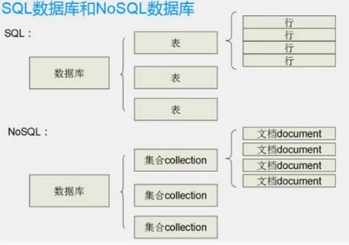
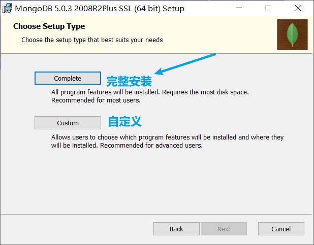
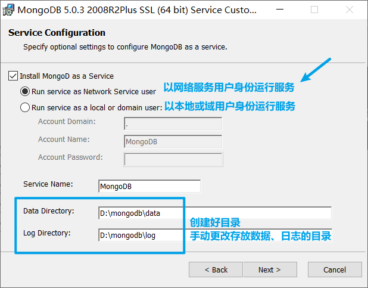
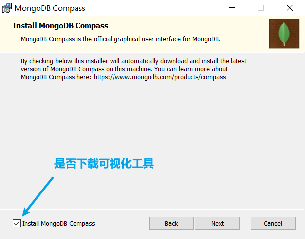
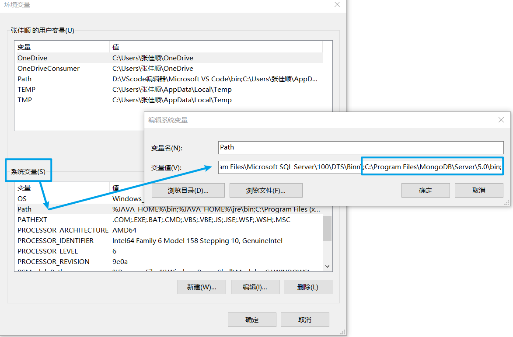
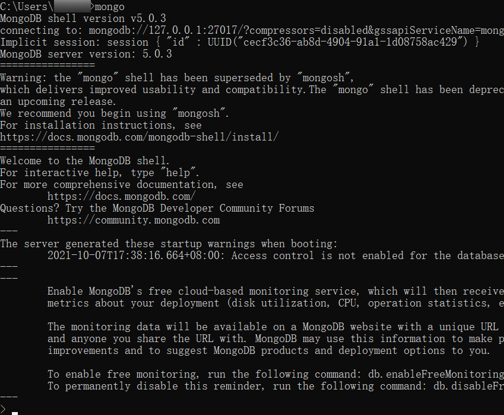

## 基本认知

​	mongoDB是一种介于`关系型`与`非关系型`之间的数据库，但其在非关系型数据库中又是`最接近`关系型数据库的。特点：高性能、易部署、易使用。

非关系型数据库 对比 关系型数据库：

* 没有行、列的概念，用类似于 JSON 的形式存储数据。
* **集合collection** 相当于关系型数据库中的`表`
* **文档document** 相当于关系型数据库中的`行`

## 安装

### 下载安装包

[官网](https://www.mongodb.com/zh-cn)->software->社区开源版本->根据系统类型下载

### 安装步骤

### 配置环境变量

找到 mongoDB 的安装目录中的 **bin** 目录：`C:\Program Files\MongoDB\Server\5.0\bin`；

配置在**系统变量**中的**Path**末尾

#### 检测

在 cmd 中，运行`mongo`命令，若出现下图，则代表安装、配置成功：

* 此时我们已经与 mongoDB 建立连接
* 之后将不用手动链接，自`4.x版本`之后，每次开启电脑后都会自动启动 mongoDB 服务。

