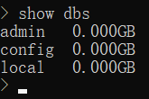
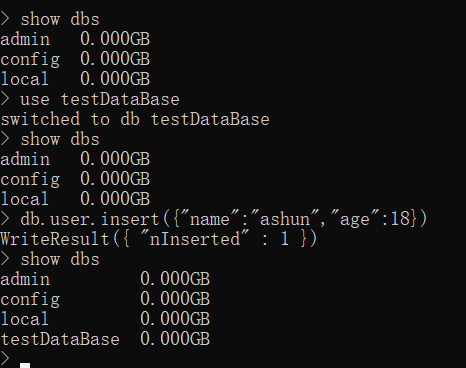

# 数据库基本操作

### 查看数据库

运行指令`show dbs`，即可打印当前已存在的数据库：

```
show dbs
```



可以看到，在mongoDB安装完毕后，内部默认创建了3个数据库：`admin`、`config`、`local`。不要对这些默认的数据库进行删除或其它操作。

### 使用、创建数据库

```
use dataBaseName
```

**情景1：对应的dataBase已存在**

* 则直接切换到该数据库，之后便可对其进行操作。

**情景2：对应的dataBase不存在**

* 运行该指令后，只是切换，并不会立即创建数据库
* 若想要创建该数据库，必须向该数据库中压入数据才可。



>若要操作某dataBase，不论该数据库是否存在，都先要切换到该dataBase，才能进行后续操作。

### 删除数据库

1.先切换到该数据库

```
use dataBaseName
```

2.运行指令，删除

```
db.dropDatabase()
```


