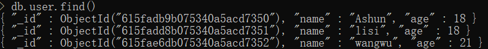
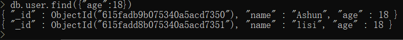
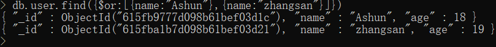
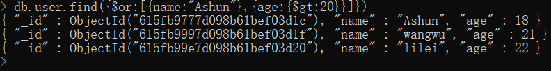
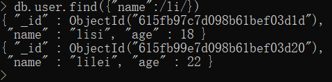
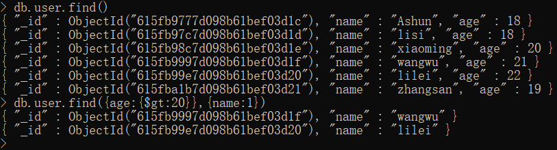
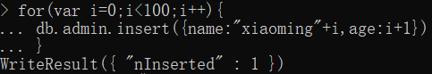
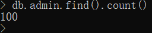
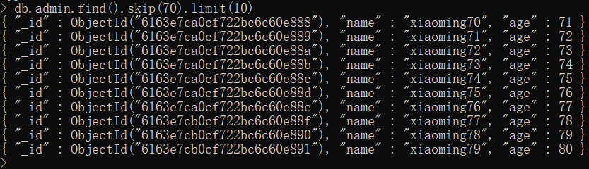
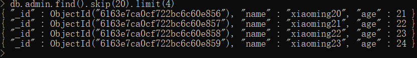

# 插入数据

上文中已经用到了该指令（若要成功创建某dataBase,必须要插入数据）：

```
db.collectionName.insert(document/docArr)
```

#### 注意点

​	数据库中不能直接插入数据，只能往集合(collections)中插入数据，所插入的数据就是一个个文档(documents)。

之前我们已经了解过mongoDB的结构，因此也很好理解：


以上文中的命令示例：

`db.user.insert({"name":"ashun","age":18})`

* user：代表集合，运行指令后若没有该集合，会自动创建
* insert 方法中传入所插入的 document，是我们所熟悉的 JSON 格式。
  * 传入一个Array，即可插入多条数据

# 查询数据

## 非条件查询

查询collection中的所有 document：

* 不传入文档片段，即可返回所有文档

```
db.collectionName.find()
```



## 条件查询

### 或与查询

#### 与查询

与查询是最简单的查询方式：直接传入想要查询的文档片段(条件)即可

```
db.collectionName.find(docChunk)
```

案例体验：

1.查找年龄为18的用户：`db.user.find({age:18})`



2.查找年龄为18且名称为Ashun的用户：`db.user.find({age:18,name:"Ashun"})`


#### 或查询

`{$or:docChunkArr}`

```
db.collectionName.find({$or:[docChunk1,docChunk2……])
```

案例体验：

1.查找名称为Ashun，或名称为zhangsan的用户：

`db.user.find({$or:[{name:"Ashun"},{name:"zhangsan"}]})`



2.查找名称为Ashun,或年龄大于20的用户：

`db.user.find({$or:[{name:"Ashun"},{age:{$gt:20}}]})`



### 数值相关

查询`大于(greater than)`某值的 document

* `{$gt:num}`

```
db.collectionName.find({"propName":{$gt:num}})
```

查询`小于(less than)`某值的 document

* `{$lt:num}`

```
db.collectionName.find({"propName":{$lt:num}})
```

---

查询`大于等于(greater than or equal)`某值

* `{$gte:num}`

查询`小于等于`某值

* `{$lte:num}`

---

查询数值在某区间的 document：

* 开区间：`{$gt:min,$lt:max}`
* 闭区间：`{$gte:min,$lte:max}`
* 左开右闭：`{$gt:min,$lte:max}`
* 右闭左开：同理

### 模糊查询

查询包含某值的 document

* `/arg/`：其中的参数，将会被当作**字符串**解析。

```
db.collectionName.find({"propName":/arg/})
```

示例：



---

| 用法   | 解释             |
| ------ | ---------------- |
| /^arg/ | 查询以某值开头的 |
| /arg$/ | 查询以某值结束的 |

>​	上面的写法其实是使用RegExp进行匹配的，可以发现与JavaScript的RegExp非常像。

### 返回指定字段

​	真实开发中，每一个document中的数据是繁多、复杂的。有时我们只希望能够返回**指定字段且符合要求的数据**，此时我们就可以通过`find`方法的**第二个参数**完成：

​	传入需要展示的片段，格式为：`{prop1:1,prop2:1,……}`

```
db.collectionName.find(docChunk,showChunk)
```

案例：

查询 `age>20` 的 document，并且只返回 name 字段

```
db.user.find({age:{$gt:20}},{name:1})
```



### 排序查询

链式调用`sort`方法

```
db.user.find(arg).sort({propName:1/-1})  
```

| 值   | 解释 |
| ---- | ---- |
| 1    | 升序 |
| -1   | 降序 |

### 长度约束

#### 查看长度

链式调用`count`方法

```
db.collectionName.find(arg).count()
```

#### 第一条数据

链式调用`findOne`方法（当然，也可使用下文的`limit(1)`方法实现）

```
db.collectionName.find(arg).findOne()
```

#### 前n条数据

链式调用`limit`方法

```
db.collectionName.find(arg).limit(num)
```

#### 跳跃查询

链式调用`skip`(跳过)方法，即返回第n条以后的数据

```
db.collectionName.find(arg).skip(num)
```

#### 实现分页

链式调用`skip`、`limit`方法实现。

```
db.collectionName.find(arg).skip(num).limit(num)
```

* `skip`传入：(searchPage-1) * pageLength
* `limit`传入：pageLength

##### 实例体验

首先我们向admin集合中压入100条数据：





按每页长度为10，查询第8页数据：

```
db.admin.find(arg).skip(70).limit(10)
```



按每页长度为4，查询第6页数据：

```
db.admin.find(arg).skip(20).limit(4)
```



