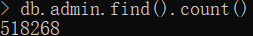
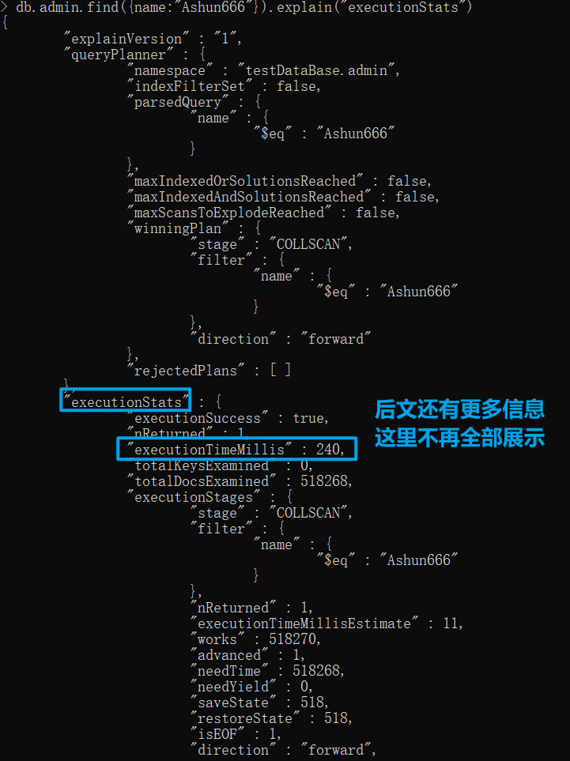
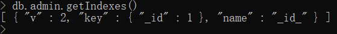
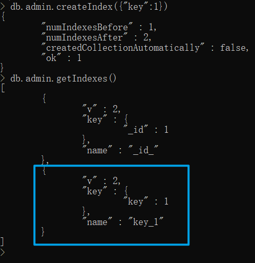
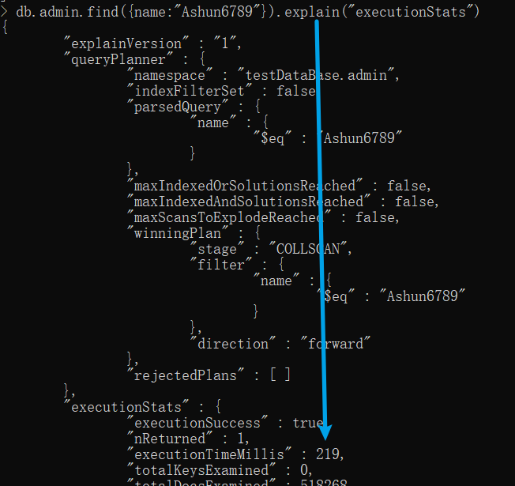
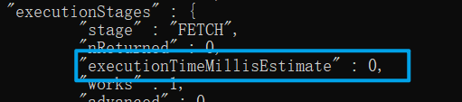

# 索引基础

索引，是对数据库表中一列或多列的值进行排序的一种结构。

在mongoDB中通过设置索引：

* 可以让我们查询的过程变得更加快速（数据量较大时，查询时间会相差百倍）
* 但对数据的操作相对较慢（很显然，这是Array的特性）

### 获取执行信息

我们可以链式调用 `explain`（解释）方法，并传入String：`"executionStats"`（执行状况），来观察命令执行的状况。

#### 案例体验

提前模拟好了五十万条数据。



查找某条数据，打印执行信息。

```
db.admin.find({name:"Ashun666"}).explain("executionStats")
```



可以发现，有很多执行的信息，本文主要关注`executionStats.executionTimeMillis`选项（执行时间毫秒），来观察有无索引时，查询数据速度的差距。

### 使用索引

#### 适用场景

​	当数据量足够大时，并且我们经常需要通过document中的某个prop来查询数据，我们就可以为该prop创建索引。

​	为某个prop创建索引后，再使用该prop查询数据，就会命中对应索引，提高查询速度。

#### 基本使用

##### 创建索引

通过`createIndex(arg)`方法，创建索引。

```
db.collectionName.createIndex({"propName":1/-1})
```

| value | desc             |
| ----- | ---------------- |
| `1`   | 该索引排序为升序 |
| `-1`  | 该索引排序为降序 |

>*注意在 3.0.0 版本前创建索引方法为 db.collection.ensureIndex()，之后的版本使用了 db.collection.createIndex() 方法，ensureIndex() 还能用，但只是 createIndex() 的别名。*

##### 获取当前集合索引

调用`getIndexes()`方法

```
db.collectionName.getIndexes()
```

##### 删除索引

调用`dropIndex(arg)`方法

* 传入对应的索引信息，从而正确删除

```
db.collectionName.dropIndex({"propName":1/-1})
```

### 案例体验

下面案例操作admin集合：

使用`getIndexes()`方法,先观察一下默认存在的索引：

* 默认只存在一个索引`_id`



为 document 中的`key`属性创建索引

```
db.admin.createIndex({key:1})
```

再次查看admin存在的索引：

* 已经存在我们新创建的索引



通过 name 属性查询数据：

* 没有为该属性创建索引，因此查询时间较长



通过 key 属性查询数据：

* 已为该属性创建索引，因此查询速度很快，0ms

```
db.admin.find({key:"6789"}).explain("executionStats")
```




# 复合索引

​	上文中我们只为**某一个 **prop 创建了索引，其实我们可以`一次创建多个索引`，也就是**复合索引**。

### 适用场景

​	若我们经常需要通过document中的**某些**prop联合进行**与查询**，我们就可以为这些prop创建复合索引。

### ⭐注意事项

若想命中复合索引，则必须满足一些要求：

* 单独通过**第一个**复合索引项进行查询，能够命中。
* **联合使用**配置的复合索引项，能够命中

其余情况不能命中。

### 案例体验

运行指令，创建`name`与`key`的联合索引

```
db.admin.createIndex({"name":1,"key":1})
```

基于`name`属性的查询，能够命中索引，查询速度提升。

```
db.admin.find({"name":"Ashun666"}).explain("executionStats")
```

基于`name`与`key`属性的查询，能够命中索引，查询速度提升。

```
db.admin.find({"name":"Ashun666",key:666}).explain("executionStats")
```

只是基于`key`属性的查询，不能命中索引，查询速度缓慢

```
db.admin.find({key:666}).explain("executionStats")
```

# 唯一索引

### 适用场景

​	上文中所创建的索引均不是唯一索引，唯一索引的作用除了能够快速查询数据，还能防止数据重复。

​	若设置某个prop为唯一索引，则后期不能够添加与已有 document中的对应属性 相同的值。

### 基本使用

我们只需要在`createIndex`方法中的第二个参数options中，配置`unique:true`即可。

```
db.collectionName.createIndex(keys,{unique:true})
```

### 案例体验

运行指令，为`userId`属性创建唯一索引：

```
db.user.createIndex({"userId":1},{unique:true})
```

若再次插入与已存在的 document中的userId 重复的文档，mongoDB将会报错

```
db.user.insert("userId":666)
db.user.insert("userId":666)
```

报错信息：

```
WriteResult({
        "nInserted" : 0,
        "writeError" : {
                "code" : 11000,
                "errmsg" : "E11000 duplicate key error collection: testDataBase.admin index: key_1 dup key: { key: 666.0 }"
        }
})
```

