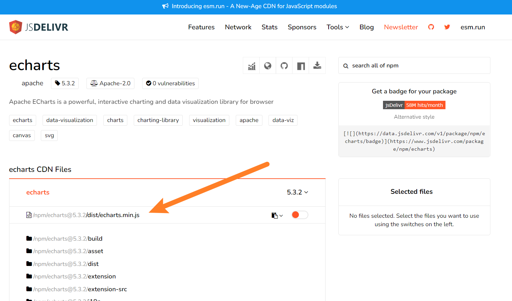
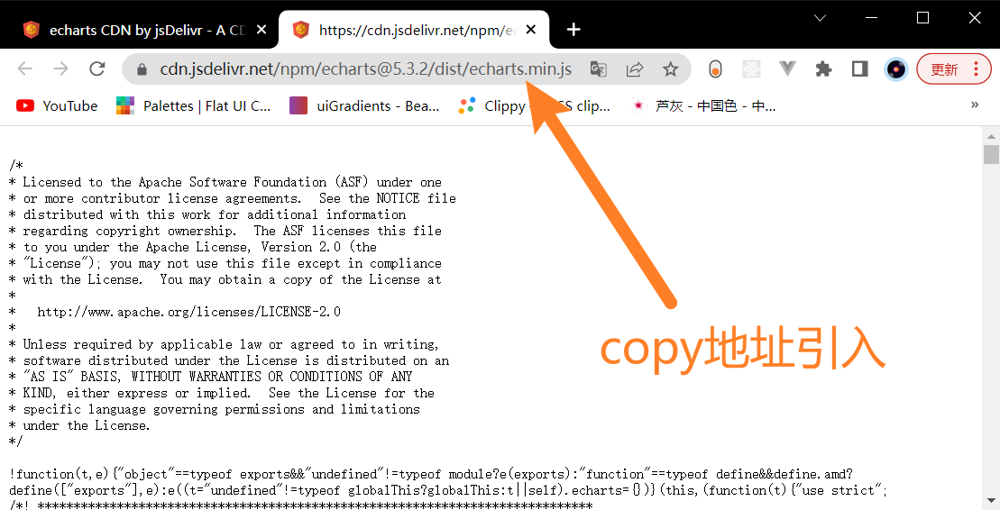
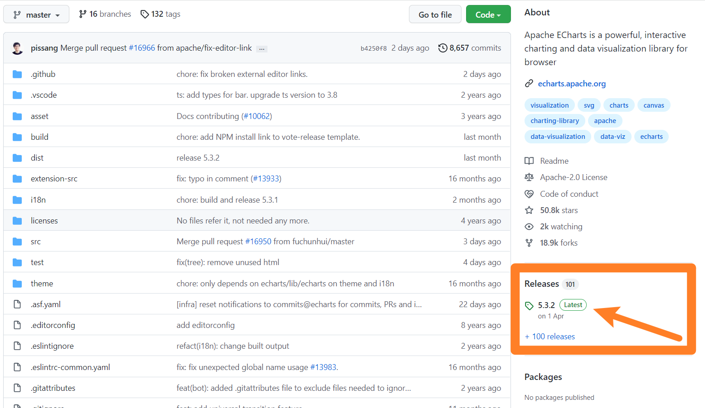

## 引入 Apache ECharts

#### CDN 引入

官方推荐从 jsDelivr 引用 [echarts](https://www.jsdelivr.com/package/npm/echarts)。





```
<script src="https://cdn.jsdelivr.net/npm/echarts@5.3.2/dist/echarts.min.js"></script>

<body>
  <script type="module">
  	//通过 echarts 全局 API 访问
    console.log(echarts);
  </script>
</body>
```


#### GitHub 下载

[apache/echarts](https://github.com/apache/echarts) 项目的 [release](https://github.com/apache/echarts/releases) 页面可以找到各个版本的链接。点击下载页面下方 Assets 中的 Source code。

解压后，`dist` 目录下的 `echarts.js` 即为包含完整 ECharts 功能的文件。



```
<body>
	<!-- 引入下载好的echarts.js -->
  <script src="./echarts.js"></script>
  <script>
  	//通过 echarts 全局 API 访问
    console.log(echarts);
  </script>
</body>
```


#### npm 下载

```
npm install echarts --save
```

##### *普通引入*

```
import * as echarts from 'echarts';
```

##### *按需引入*

上面的代码会引入 ECharts 中所有的图表和组件，但是假如你不想引入所有组件，也可以使用 ECharts 提供的按需引入的接口来打包必须的组件。

```
// 引入 echarts 核心模块，核心模块提供了 echarts 使用必须要的接口。
import * as echarts from 'echarts/core';

// 引入柱状图图表，图表后缀都为 Chart
import { BarChart } from 'echarts/charts';

// 引入提示框，标题，直角坐标系，数据集，内置数据转换器组件，组件后缀都为 Component
import {
  TitleComponent,
  TooltipComponent,
  GridComponent,
  DatasetComponent,
  TransformComponent
} from 'echarts/components';

// 标签自动布局，全局过渡动画等特性
import { LabelLayout, UniversalTransition } from 'echarts/features';

// 引入 Canvas 渲染器，注意引入 CanvasRenderer 或者 SVGRenderer 是必须的一步
import { CanvasRenderer } from 'echarts/renderers';

// 注册必须的组件
echarts.use([
  TitleComponent,
  TooltipComponent,
  GridComponent,
  DatasetComponent,
  TransformComponent,
  BarChart,
  LabelLayout,
  UniversalTransition,
  CanvasRenderer
]);

// 接下来的使用就跟之前一样，初始化图表，设置配置项
var myChart = echarts.init(document.getElementById('main'));
myChart.setOption({
  // ...
});
```

>需要注意的是：为了保证打包的体积是最小的，ECharts 按需引入的时候不再提供任何渲染器，所以需要选择引入 `CanvasRenderer` 或者 `SVGRenderer` 作为渲染器。
>
>​	这样的好处是：假如你只需要使用 svg 渲染模式，打包的结果中就不会再包含无需使用的 `CanvasRenderer` 模块。

官网在示例编辑页的“完整代码”标签提供了非常方便的生成按需引入代码的功能。这个功能会根据当前的配置项动态生成最小的按需引入的代码。你可以直接在你的项目中使用。

##### *TS 中按需引入*

对于使用了 TypeScript 来开发 ECharts 的开发者，我们提供了类型接口来组合出最小的`EChartsOption`类型。这个更严格的类型可以有效帮助你检查出是否少加载了组件或者图表。

```
import * as echarts from 'echarts/core';

import {
  BarChart,
  // 系列类型的定义后缀都为 SeriesOption
  BarSeriesOption,
  LineChart,
  LineSeriesOption
} from 'echarts/charts';

import {
  TitleComponent,
  // 组件类型的定义后缀都为 ComponentOption
  TitleComponentOption,
  TooltipComponent,
  TooltipComponentOption,
  GridComponent,
  GridComponentOption,
  // 数据集组件
  DatasetComponent,
  DatasetComponentOption,
  // 内置数据转换器组件 (filter, sort)
  TransformComponent
} from 'echarts/components';

import { LabelLayout, UniversalTransition } from 'echarts/features';
import { CanvasRenderer } from 'echarts/renderers';

// 通过 ComposeOption 来组合出一个只有必须组件和图表的 Option 类型
type ECOption = echarts.ComposeOption<
  | BarSeriesOption
  | LineSeriesOption
  | TitleComponentOption
  | TooltipComponentOption
  | GridComponentOption
  | DatasetComponentOption
>;

// 注册必须的组件
echarts.use([
  TitleComponent,
  TooltipComponent,
  GridComponent,
  DatasetComponent,
  TransformComponent,
  BarChart,
  LabelLayout,
  UniversalTransition,
  CanvasRenderer
]);

const option: ECOption = {
  // ...
};
```


#### 在线定制

如果只想引入部分模块以减少包体积，可以使用 [ECharts 在线定制](https://echarts.apache.org//builder.html)功能。

## 基本使用步骤

这里先来梳理一下基本的使用步骤：

1. 提供一个容器，并赋予容器尺寸
   * 可通过 CSS 设置
   * 也可在初始化时指定大小
2. `const myChart = echarts.init(chartBox)` 进行图表初始化
3. 配置图表的 option。
4. 将 option 设置到图表本身： `myChart.setOption(option)`

#### 初体验

```
<!DOCTYPE html>
<html lang="en">
  <head>
    <meta charset="UTF-8" />
    <meta http-equiv="X-UA-Compatible" content="IE=edge" />
    <meta name="viewport" content="width=device-width, initial-scale=1.0" />
    <title>Document</title>  
    <!-- CDN 引入 Echarts -->
    <script src="https://cdn.jsdelivr.net/npm/echarts@5.3.2/dist/echarts.min.js"></script>
  </head>
  
  <body>
  	<!-- 提供图表容器,并设置其宽高 -->
    <div id="chartBox" style="width: 100%; height: 400px"></div>

    <script>
      const chartBox = document.getElementById("chartBox");
      
      //传入容器,初始化图标
      const myChart = echarts.init(chartBox);
      
			//配置 option
      var option = {
        title: {
          text: "ECharts 入门示例",
        },
        tooltip: {},
        legend: {
          data: ["销量"],
        },
        xAxis: {
          data: ["衬衫", "羊毛衫", "雪纺衫", "裤子", "高跟鞋", "袜子"],
        },
        yAxis: {},
        series: [
          {
            name: "销量",
            type: "bar",
            data: [5, 20, 36, 10, 10, 20],
          },
        ],
      };
			
			//将 option 设置到图表本身
      myChart.setOption(option);
    </script>
  </body>
</html>
```

#### init 时确定尺寸

* 单位是 `px`。（即便你配置为字符串 `"200%"`，也等价为 `"200px"` 或数字 `200`）

* 必须设置 `height` 
* 若没有配置 `width`，图表将自动占满父级容器

```
<body>
  <!-- 提供图表容器 -->
  <div id="chartBox"></div>

  <script>
    const chartBox = document.getElementById("chartBox");

    //传入容器,初始化图表，并在此时设置宽高
    const myChart = echarts.init(chartBox, null, {
      width: 500,
      height: 300,
    });

    //配置 option
    var option = { …… };

    //将 option 设置到图表本身
    myChart.setOption(option);
  </script>
</body>
```

关于 `init` 方法的参数：

```
(dom?: HTMLDivElement|HTMLCanvasElement, theme?: Object|string, opts?: {
    devicePixelRatio?: number,
    renderer?: string,
    useDirtyRect?: boolean, // 从 `5.0.0` 开始支持
    ssr?: boolean,          // 从 `5.3.0` 开始支持
    width?: number|string,
    height?: number|string,
    locale?: string         // 从 `5.0.0` 开始支持
}) => ECharts
```

