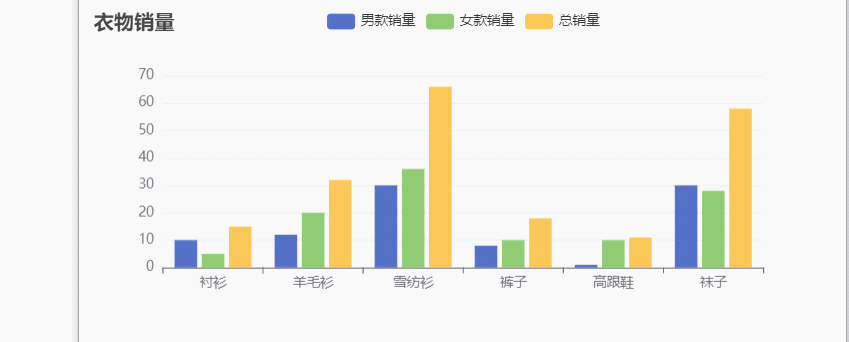
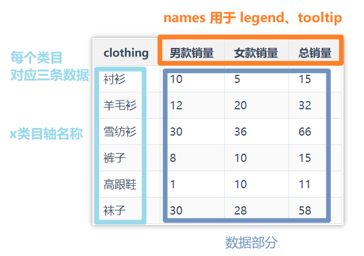
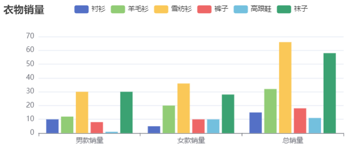
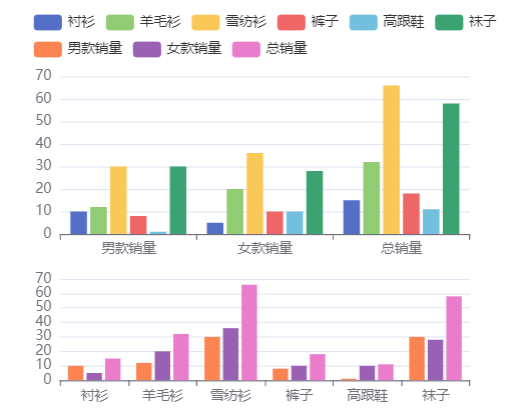
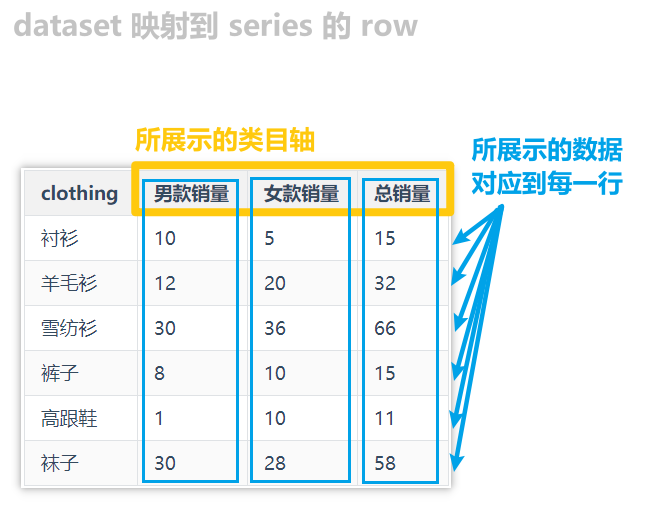
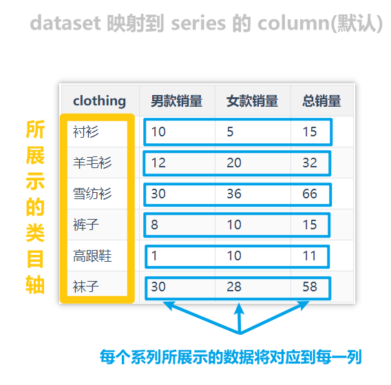

应用图表，就是为了更好的展示数据。在 `Echarts` 中，我们可以通过两种方式向图表压入数据：

1. 系列：`series.data` （传统方式）
2. 数据集：`dataset`     （推荐使用）

>官方中提到：
>
>* 虽然每个系列都可以在 `series.data` 中设置数据，但是从 ECharts4 支持 `数据集` 开始，更推荐使用 `数据集` 来管理数据。
>* `数据集`（`dataset`）是专门用来管理数据的组件。
>* 因为这样，数据可以被多个组件复用，也方便进行 “数据和其他配置” 分离的配置风格。毕竟，在运行时，数据是最常改变的，而其他配置大多并不会改变。

# series

## 示例对比

index.html

```
<script src="https://cdn.jsdelivr.net/npm/echarts@5.3.2/dist/echarts.min.js"></script>

<body>
  <div id="chartBox"></div>

  <script type="module">
    import chartOption from "./index.js";
    const chartBox = document.getElementById("chartBox");

    const myChart = echarts.init(chartBox, null, {
      height: "300px",
    });

    myChart.setOption(chartOption);

    window.onresize = () => {
      console.log(
        myChart.resize({
          animation: { duration: 200 },
        })
      );
    };
  </script>
</body>
```

index.js

```
const maleData = [10, 12, 30, 8, 1, 30];
const femaleData = [5, 20, 36, 10, 10, 28];
const totalArray = maleData.map((v, i) => v + femaleData[i]);

const chartOption = {
  title: {
    text: "衣物销量",
  },
  tooltip: {},
  xAxis: {
    type: "category",
    data: ["衬衫", "羊毛衫", "雪纺衫", "裤子", "高跟鞋", "袜子"],
  },
  yAxis: {},
  legend: {
    data: ["男款销量", "女款销量", "总销量"],
  },
  series: [
    {
      name: "男款销量",
      type: "bar",
      //男款销量系列数据
      data: maleData,
    },
    {
      name: "女款销量",
      type: "bar",
      //女款销量系列数据
      data: femaleData,
    },
    {
      name: "总销量",
      type: "bar",
      //总销量系列数据
      data: totalArray,
    },
  ],
};

export default chartOption;
```

效果图：



### 优缺点

这种方式的优点是：适于对一些特殊的数据结构（如“树”、“图”、超大数据）进行一定的数据类型定制。

但是缺点是：

* 常需要用户先处理数据，把数据分割设置到各个系列（和类目轴）中。
* 此外，不利于多个系列共享一份数据，也不利于基于原始数据进行图表类型、系列的映射安排。

# dataset

## 示例对比

若将上文案例的数据用 `dataset` 设置，则数据格式可以有两种：

* 普通的二维数组
* 数组对象（array的元素为obj）

dataset 把数据按照(x)主轴上的每一个刻度进行划分

### **普通的二维数组形式**

```
const chartOption = {
  title: {
    text: "衣物销量",
  },
  tooltip: {},
  legend: {},

  dataset: {
    source: [
      ["clothing", "男款销量", "女款销量", "总销量"],
      ["衬衫", 10, 5, 15],
      ["羊毛衫", 12, 20, 32],
      ["雪纺衫", 30, 36, 66],
      ["裤子", 8, 10, 18],
      ["高跟鞋", 1, 10, 11],
      ["袜子", 30, 28, 58],
    ],
  },
  
  // 声明一个 X 轴，类目轴（category）。默认情况下，类目轴对应到 dataset 第一列（clothing、衬衫、羊毛衫……）。
  xAxis: { type: "category" },
  // 声明一个 Y 轴，数值轴。
  yAxis: {},
  // 声明多个 bar 系列，进行数据展示。默认情况下，每个系列会自动对应到 dataset 的每一列。
  series: [{ type: "bar" }, { type: "bar" }, { type: "bar" }],
};
```

可以发现，二维数组这种数据组织的形式，与表格是一模一样的，例如上述代码中的数据，抽象为表格：

| clothing | 男款销量 | 女款销量 | 总销量 |
| -------- | -------- | -------- | ------ |
| 衬衫     | 10       | 5        | 15     |
| 羊毛衫   | 12       | 20       | 32     |
| 雪纺衫   | 30       | 36       | 66     |
| 裤子     | 8        | 10       | 15     |
| 高跟鞋   | 1        | 10       | 11     |
| 袜子     | 30       | 28       | 58     |

映射到 Echarts 图表中：



我们还可以通过改变数据的结构，从而改变展示的方式：

* 将图表的行和列进行转换

```
const chartOption = {
  title: {
    text: "衣物销量",
  },
  tooltip: {},
  legend: {},

  dataset: {
    source: [
      ["clothing", "衬衫", "羊毛衫", "雪纺衫", "裤子", "高跟鞋", "袜子"],
      ["男款销量", 10, 12, 30, 8, 1, 30],
      ["女款销量", 5, 20, 36, 10, 10, 28],
      ["总销量", 15, 32, 66, 18, 11, 58],
    ],
  },
  xAxis: { type: "category" },
  yAxis: {},
  
  //此时每一个类目要展示 6 条数据
  series: [
    { type: "bar" },
    { type: "bar" },
    { type: "bar" },
    { type: "bar" },
    { type: "bar" },
    { type: "bar" },
  ],
};
```



>* 这显然是一种比较笨拙的方式。
>* 因为我们只是想换一种展示形式，却还要改变原有的数据。
>* [下文](###把数据集（ dataset ）的行或列映射为系列（series）)将介绍更加聪明的方法（改变映射的方式）

### **数组对象形式**

整体结构与二维数组非常相似，只不过对每一条数据都明确指定了属性。

```
const chartOption = {
  title: {
    text: "衣物销量",
  },
  tooltip: {},
  legend: {},

  dataset: {
    dimensions: ["clothing", "男款销量", "女款销量", "总销量"],
    source: [
      { clothing: "衬衫", 男款销量: 10, 女款销量: 5, 总销量: 15 },
      { clothing: "羊毛衫", 男款销量: 12, 女款销量: 20, 总销量: 32 },
      { clothing: "雪纺衫", 男款销量: 30, 女款销量: 36, 总销量: 66 },
      { clothing: "裤子", 男款销量: 8, 女款销量: 10, 总销量: 18 },
      { clothing: "高跟鞋", 男款销量: 1, 女款销量: 10, 总销量: 11 },
      { clothing: "袜子", 男款销量: 30, 女款销量: 28, 总销量: 58 },
    ],
  },
  xAxis: { type: "category" },
  yAxis: {},
  series: [{ type: "bar" }, { type: "bar" }, { type: "bar" }],
};

export default chartOption;
```

* 用 dimensions 指定了维度的顺序。
* 直角坐标系中，如果 X 轴的 type 为 category，则默认把第一个维度的值映射到 X 轴上（示例的clothing），后面维度映射到 Y 轴上（男、女、总销量数值）。
* 如果不指定 dimensions，也可以通过指定 series.encode 完成映射，参见后文。

## 数据到图形的映射

### 把数据集（ dataset ）的行或列映射为系列（series）

有了数据表之后，我们可以灵活地配置：数据如何对应到 **轴** 和 **图形系列**。

用户可以使用 `seriesLayoutBy` 配置项，改变图表对于行列的理解。

`seriesLayoutBy` 可取值：

- 'column': 默认值。系列被安放到 `dataset` 的列上面。
- 'row': 系列被安放到 `dataset` 的行上面。

**案例体验**

* 不用改变原有数据，即可完成类目轴的转换。

```
const chartOption = {
  tooltip: {},
  legend: {},

  dataset: {
    source: [
      ["clothing", "男款销量", "女款销量", "总销量"],
      ["衬衫", 10, 5, 15],
      ["羊毛衫", 12, 20, 32],
      ["雪纺衫", 30, 36, 66],
      ["裤子", 8, 10, 18],
      ["高跟鞋", 1, 10, 11],
      ["袜子", 30, 28, 58],
    ],
  },

  //划分网格
  grid: [{ bottom: "50%" }, { top: "60%" }],

  xAxis: [
    { type: "category", gridIndex: 0 },
    { type: "category", gridIndex: 1 },
  ],
  yAxis: [{ gridIndex: 0 }, { gridIndex: 1 }],

  series: [
  	// 这几个系列会出现在第一个直角坐标系中，每个系列对应到 dataset 的每一行。
    { type: "bar", seriesLayoutBy: "row" },
    { type: "bar", seriesLayoutBy: "row" },
    { type: "bar", seriesLayoutBy: "row" },
    { type: "bar", seriesLayoutBy: "row" },
    { type: "bar", seriesLayoutBy: "row" },
    { type: "bar", seriesLayoutBy: "row" },
    // 这几个系列会出现在第二个直角坐标系中，每个系列对应到 dataset 的每一列(默认值)。
    { type: "bar", xAxisIndex: 1, yAxisIndex: 1 },
    { type: "bar", xAxisIndex: 1, yAxisIndex: 1 },
    { type: "bar", xAxisIndex: 1, yAxisIndex: 1 },
  ],
};

export default chartOption;
```

效果图：




**下图将帮助更好的理解：**

* dataset 映射到 series 的 row



* dataset 映射到 series 的 column (默认值)




更多知识请查阅[官方文档](https://echarts.apache.org/handbook/zh/concepts/dataset)，后期持续更新~


